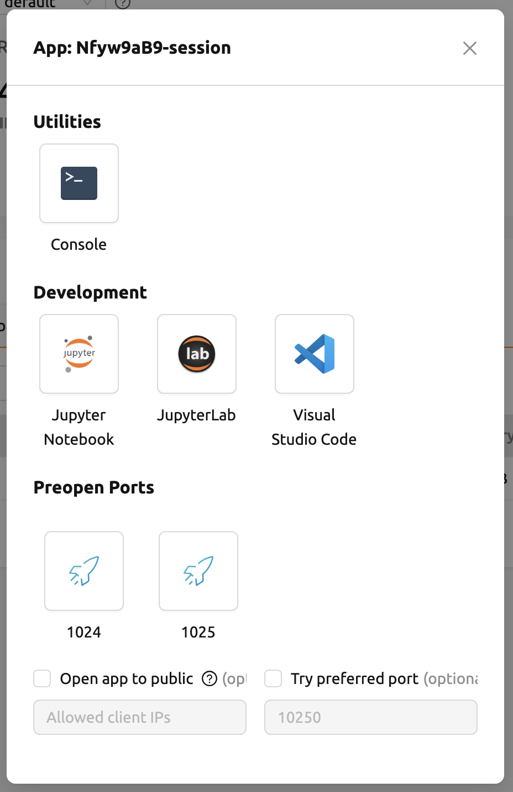

# Run Applications

Once a compute session reaches the `RUNNING` state, you can launch interactive applications directly from the session. Backend.AI provides a built-in app launcher that gives you one-click access to web-based development tools running inside your session.

## Available Applications

The applications available in a session depend on the environment image you selected when creating the session. Common applications include:

- **Jupyter Notebook / JupyterLab**: Interactive notebook environments for writing and running code, visualizing data, and documenting your work.
- **Web Terminal**: A browser-based terminal for running shell commands directly inside the session.
- **VS Code (code-server)**: A full-featured code editor running in your browser.
- **TensorBoard**: A visualization tool for monitoring machine learning training metrics.
- **FileBrowser**: A web-based file manager for browsing and managing files in your session.

:::note
The list of available applications varies by image. For example, a TensorFlow image typically includes TensorBoard, while a basic Python image may only offer Jupyter Notebook and the web terminal.
:::

## Launching an Application

To launch an application from a running session:

1. Click the session name in the session list to open the session detail panel.
2. Click the app launcher icon (first icon in the upper-right corner of the panel) to open the app launcher dialog.
3. Select the application you want to launch (e.g., **Jupyter Notebook**, **Terminal**).
4. The application opens in a new browser tab.

The app launcher dialog provides two optional settings:

- **Open app to public**: Makes the application URL publicly accessible to anyone who knows it.
- **Try preferred port**: Attempts to assign a specific port number instead of a random one.

:::warning
Pop-up blockers may prevent application windows from opening. Make sure to allow pop-ups from the Backend.AI WebUI domain.
:::

## What Are Service Ports?

Behind the scenes, each application runs on a *service port* inside the session container. A service port is a network port that Backend.AI exposes through a secure, authenticated tunnel so you can access the application from your browser without any additional network configuration.

You can also define custom preopen ports when creating a session. This allows you to run your own servers (e.g., a Flask or FastAPI development server) and access them through the app launcher. For details on configuring preopen ports, see the [Sessions](../../backend.ai-usage-guide/workload/sessions/session-management.md) page.

## Next Steps

- [Jupyter Notebook](jupyter-notebook.md) -- Learn how to use Jupyter Notebook inside a compute session.
- [Web Terminal](web-terminal.md) -- Learn how to use the web-based terminal.
- [Start a New Session](../start-a-new-session.md) -- Review how to create and configure a compute session.
