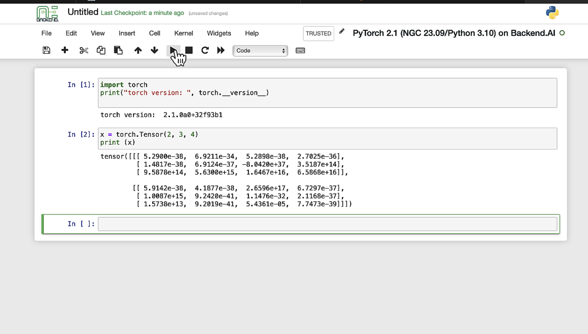

# Jupyter Notebook

Jupyter Notebook is one of the most commonly used applications in Backend.AI compute sessions. It provides an interactive environment where you can write and execute code, visualize results, and document your workflow -- all within a single browser tab.



## Launching Jupyter Notebook

To open Jupyter Notebook from a running session:

1. Click the session name to open the session detail panel.
2. Click the app launcher icon and select **Jupyter Notebook** (or **JupyterLab** if available).
3. The notebook interface opens in a new browser tab.


:::tip
Most Backend.AI environment images include both Jupyter Notebook and JupyterLab. JupyterLab offers a more modern, tabbed interface with a built-in file browser, while Jupyter Notebook provides the classic single-document view.
:::

## Creating and Using Notebooks

Once Jupyter Notebook is open, you can create a new notebook by clicking **New** and selecting a kernel (e.g., Python 3). Each notebook consists of cells that can contain code or markdown text.

- **Code cells**: Write and execute code. Press `Shift + Enter` to run a cell and move to the next one.
- **Markdown cells**: Write formatted text, equations, and documentation using Markdown syntax.

The kernel used by the notebook matches the language environment of your compute session. For example, if you created a session with a PyTorch image, the notebook kernel has PyTorch pre-installed.

## Installing Additional Packages

You can install additional Python packages directly from a notebook cell using `pip`:

```shell
!pip install pandas matplotlib
```

:::warning
Packages installed this way are stored inside the session container and will be lost when the session is terminated. To persist custom packages across sessions, consider using the "Convert Session to Image" feature or installing packages into a mounted storage folder.
:::

## Saving Your Work

All files in Jupyter Notebook are stored under the `/home/work/` directory inside the session. If you mounted a storage folder when creating the session, it appears as a subdirectory under `/home/work/`. Save your notebooks to a mounted folder to ensure they persist after the session ends.

:::note
Files saved outside of mounted storage folders are deleted when the session is terminated. Always save important notebooks and data to a mounted folder. For more information on mounting storage, see [Start a New Session](../start-a-new-session.md).
:::

## Shared Environment with Web Terminal

Jupyter Notebook and the web terminal share the same container environment. Files you create or modify in the terminal are immediately visible in Jupyter Notebook, and vice versa. This makes it easy to switch between the notebook interface and the command line depending on your workflow.
