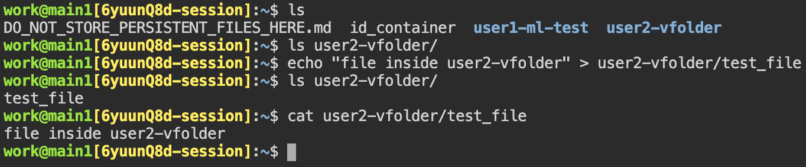
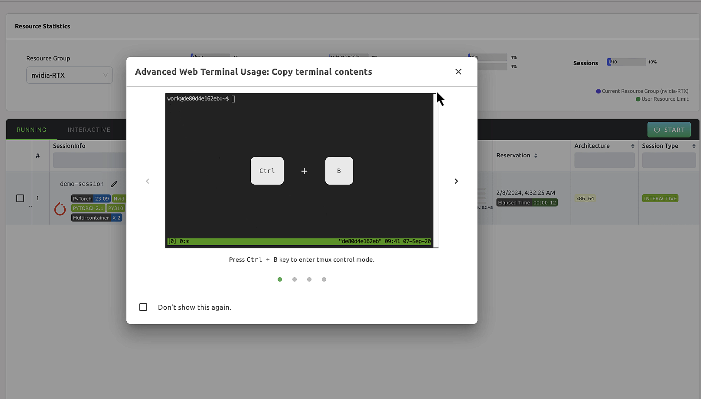
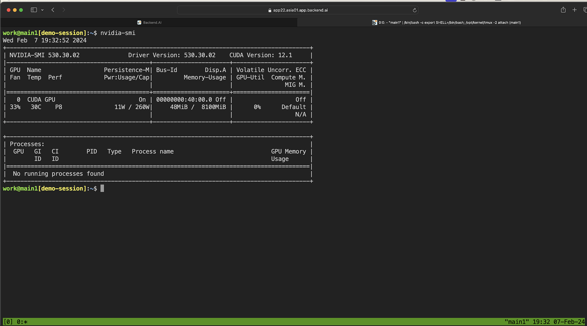

# Web Terminal

The web terminal provides a browser-based command-line interface to your Backend.AI compute session. You can run shell commands, manage files, install packages, and interact with the session environment directly -- without needing a local SSH client.


## Launching the Web Terminal

To open the web terminal from a running session:

1. Click the session name in the session list to open the session detail panel.
2. Click the terminal icon (second button in the upper-right corner) to launch the terminal.
3. The terminal opens in a new browser tab.

You can also launch the terminal through the app launcher dialog by selecting **Terminal**.

## Working with Files

The terminal starts in the `/home/work/` directory. Any storage folders you mounted when creating the session appear as subdirectories here.



Use standard Linux commands to navigate and manage files:

```shell
ls              # List files in the current directory
cd my-folder    # Navigate to a mounted storage folder
mkdir results   # Create a new directory
cp model.py /home/work/my-folder/  # Copy a file to a mounted folder
```

:::tip
Files stored in mounted storage folders persist after the session ends. Save important work to a mounted folder before terminating the session.
:::

## Installing Packages

You can install additional packages using `pip` or `conda` depending on the session image:

```shell
pip install scikit-learn
conda install -c conda-forge opencv
```

:::warning
Packages installed inside the session are lost when the session is terminated. To preserve your environment, consider using the "Convert Session to Image" feature described in the [Sessions](../../backend.ai-usage-guide/workload/sessions/session-management.md) page.
:::

## Advanced Web Terminal Usage

The web terminal internally uses [tmux](https://github.com/tmux/tmux/wiki), a terminal multiplexer that allows you to open multiple shell windows within a single terminal session.





### Multiple Shell Windows

You can create and manage multiple shell windows using tmux keyboard shortcuts:

- `Ctrl-B c`: Create a new shell window.
- `Ctrl-B w`: List all open shell windows and switch between them.
- `exit` or `Ctrl-B x`: Close the current shell window.

### Copying Terminal Contents

tmux has its own clipboard. To copy text to your system clipboard:

1. Press `Ctrl-B` and type `:set -g mouse off` to temporarily disable tmux mouse mode.
2. Select the text you want to copy by dragging with your mouse.
3. Press `Ctrl-C` (or `Cmd-C` on macOS) to copy.
4. To re-enable mouse scrolling, press `Ctrl-B` and type `:set -g mouse on`.

### Browsing Terminal History

Press `Ctrl-B`, then use `Page Up` and `Page Down` to scroll through the terminal history. Press `q` to exit scroll mode.

## SSH Access

For users who prefer connecting to the session from a local terminal, Backend.AI supports SSH access through the Backend.AI Client SDK. You can download an auto-generated SSH keypair and use the client's `app` command to open a secure tunnel to the session. For details, refer to the Backend.AI Client SDK documentation.
