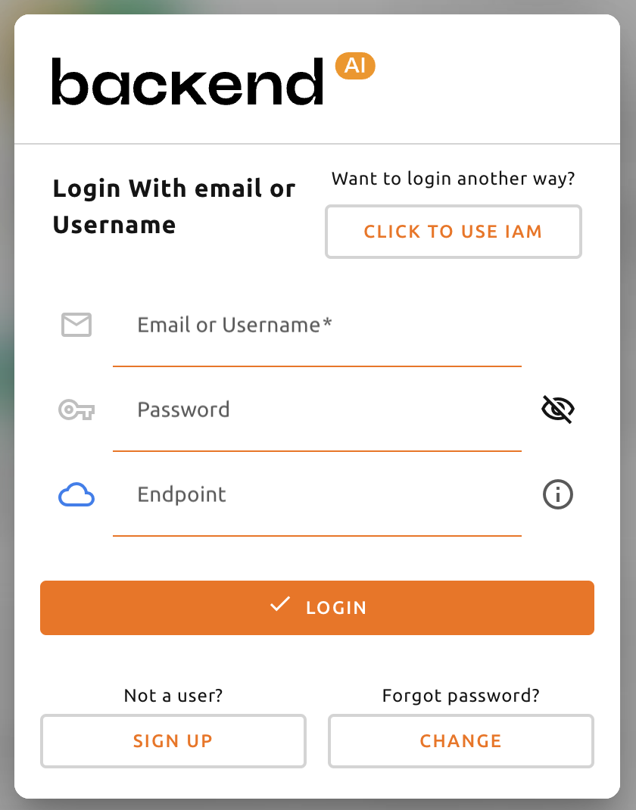
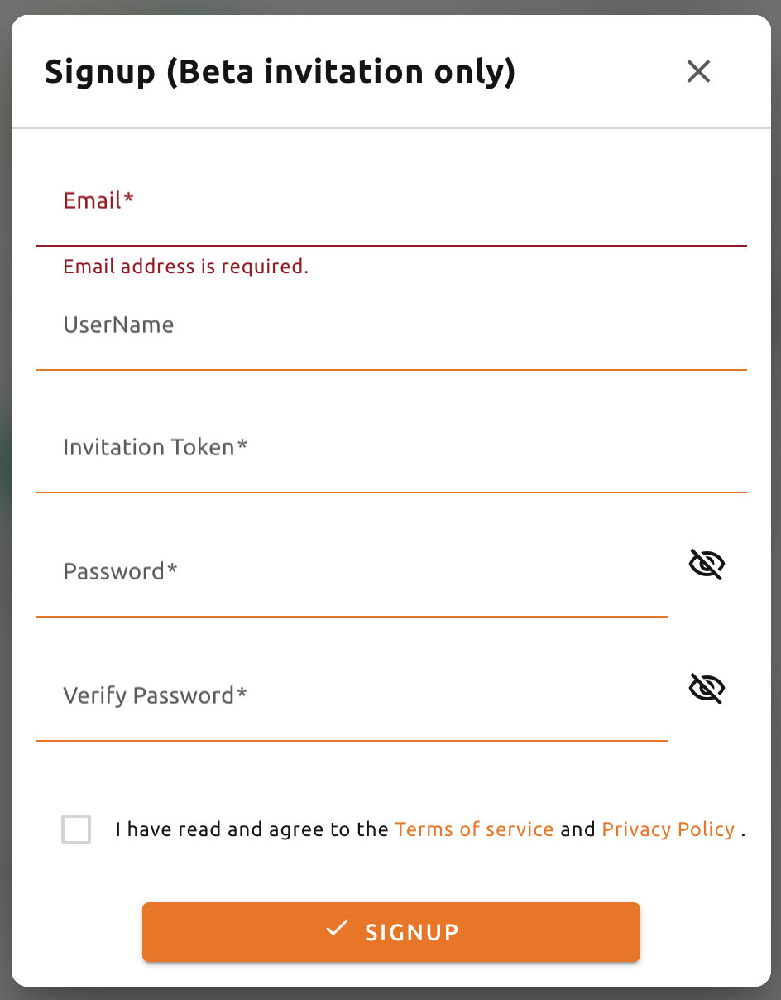
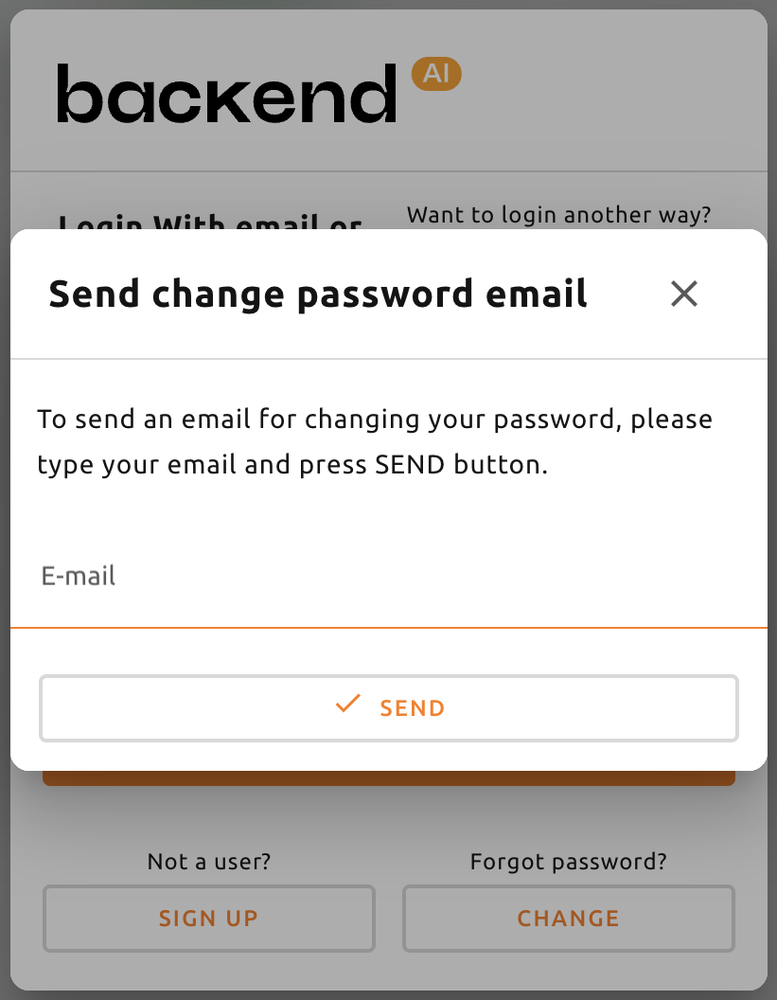
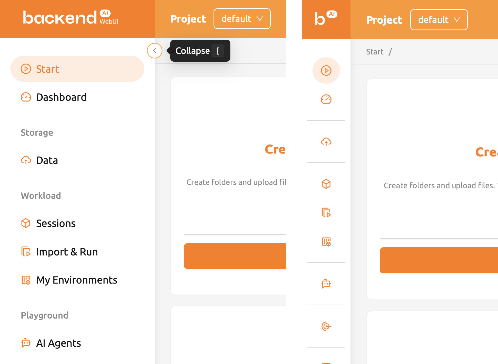

# Signup and Login

When you launch the Backend.AI WebUI, the login dialog appears. If you do not have an account yet, you can sign up first before logging in.

## Signup

If you have not signed up yet, click the **Sign Up** button on the login dialog.

Enter the required information such as email address, username, and password. Read and agree to the Terms of Service and Privacy Policy, then click the **Sign Up** button. Depending on system settings, an invitation token may be required to complete the registration. A verification email may be sent to confirm ownership of the provided email address. In that case, you must follow the verification link in the email before logging in.

:::note
Depending on the server configuration and plugin settings, signing up by anonymous users may not be allowed. In that case, contact your system administrator.
:::

:::note
To prevent unauthorized access, passwords must be at least 8 characters long and include at least one letter, one number, and one special character.
:::

:::info
Backend.AI securely stores user passwords using one-way hashing with BCrypt, the default password hashing algorithm for BSD. Even server administrators cannot access user passwords.
:::

## Login

Enter your email (or username) and password, then click the **Login** button. In the **API Endpoint** field, the URL of the Backend.AI Webserver should be entered.

- **Email or Username**: By default, user authentication is performed using the registered email address. Username-based login is available only when a dedicated plugin is applied.
- **Password**: Use the password set during account creation.
- **Click to use IAM**: (Optional) Identity and Access Management (IAM) login is available for users with valid Access Key (AK) and Secret Key (SK) credentials.

:::note
Depending on the installation and setup environment of the Webserver, the endpoint might be pinned and not configurable.
:::

:::warning
For security reasons, if more than 10 consecutive login failures occur, further login attempts will be restricted for 20 minutes. If the restriction persists, contact your system administrator.
:::

After logging in, you can check the current resource usage in the Summary tab.

## Logout

When you are finished using Backend.AI, you can log out by clicking the user icon in the upper-right corner and selecting **Log Out** from the sub menu.

## Troubleshooting

### Reset Password

If you have forgotten your password, click the **Forgot Password?** button on the login panel. A link to change your password will be sent to your email. Follow the instructions in the email to set a new password.

:::note
The password change feature is modular. Depending on server settings, it may not be available. If the feature is disabled, contact your system administrator.
:::

## Sidebar Menus

You can change the size of the sidebar using the toggle button on the sidebar. Click it to reduce the sidebar width for a wider content view. Click again to restore the original width. You can also use the shortcut key (`[`) to toggle the sidebar width.

