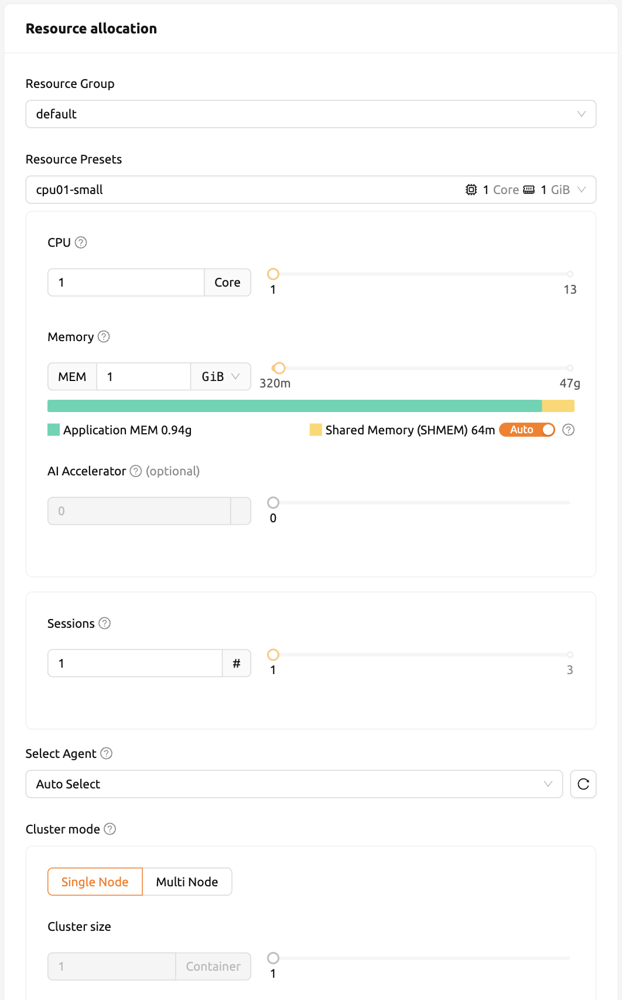
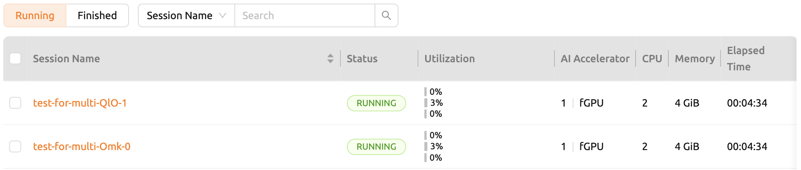
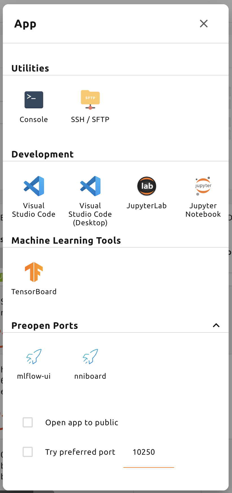

# Start a New Session

In Backend.AI, a *compute session* represents an isolated compute environment where you can run code, train models, or perform data analysis using allocated resources. Each session is created based on user-defined configurations such as runtime image, resource size, and environment settings.

## Creating a Session

To create a new compute session, navigate to the **Sessions** page and click the **Start** button (or the `+` button).

The session launcher dialog allows you to configure the following settings:

- **Environment / Version**: Select the runtime environment (e.g., Python, TensorFlow, PyTorch) and its version.
- **Resource Group**: Choose the resource group where the session will be allocated.
- **Resource Allocation**: Set the amount of CPU, memory, and AI accelerator (GPU) resources for the session. You can select a resource preset or manually adjust values.
- **Session Name**: (Optional) Provide a custom name for the session.
- **Session Type**: Choose between `Interactive`, `Batch`, or `Inference` session types.
- **Mounted Folders**: Select storage folders to mount inside the session. Mounted folders appear under `/home/work/`.

After configuring the desired settings, click the **Launch** button to start the session.

## Session Status

Once launched, the session goes through several states:

1. **PENDING**: The session is queued and waiting for resource allocation.
2. **PREPARING**: Resources are being allocated and the container is being set up.
3. **RUNNING**: The session is active and ready to use.

When the session reaches the `RUNNING` state, you can access it by clicking on the session name or using the application buttons (such as Jupyter Notebook, Terminal, etc.) in the session row.

## Using Applications

After a session starts, you can launch interactive applications directly from the session list:

- **Jupyter Notebook**: Click the Jupyter icon to open a notebook interface.
- **Terminal**: Click the terminal icon to open a web-based terminal.
- **Other Applications**: Depending on the session image, additional applications may be available.

:::note
Pop-up blockers may prevent application windows from opening. Make sure to allow pop-ups from the Backend.AI WebUI domain.
:::

## Terminating a Session

To terminate a session, click the power icon (or trash icon) in the **Control** column of the session list. A confirmation dialog will appear. Click **OK** to confirm termination.

:::warning
All files and data inside the session will be deleted upon termination, except for data stored in mounted storage folders.
:::
