

# Admin Features

Logging in with an admin account adds an **Admin Settings** menu at the top of the sidebar. Selecting it switches the sidebar to show only the administration menus. User information registered in Backend.AI is listed under the **Users** menu. A super-admin can see all users' information, and create or deactivate users.

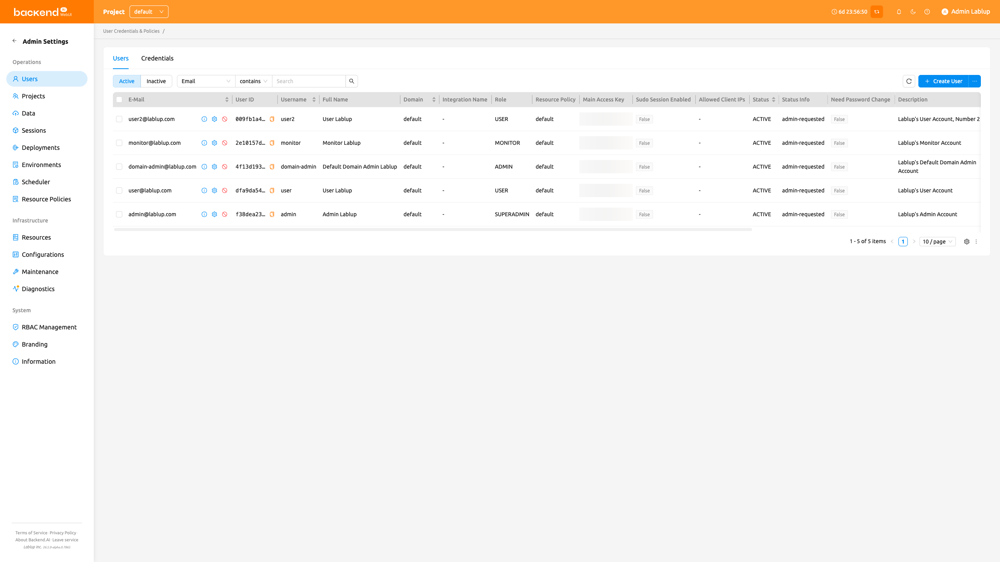
<!-- TODO: Re-capture admin_user_page.png to show the Admin Settings sidebar and the Users list. -->

## Browse and manage users

A user can be created by clicking the `+Create User` button. Note that the password
must be longer or equal to 8 characters and at least 1 alphabet/special
character/number should be included. The maximum length allowed for E-Mail, User Name, and Full Name is 64 characters.

If a user with the same email or username already exists, it is not possible to
create a user account. Please try other email and username.

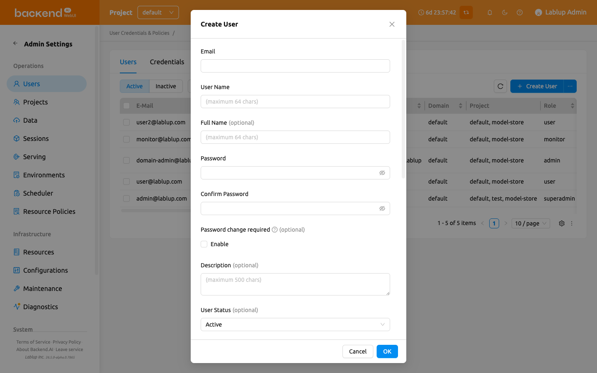

Check if the user is created.

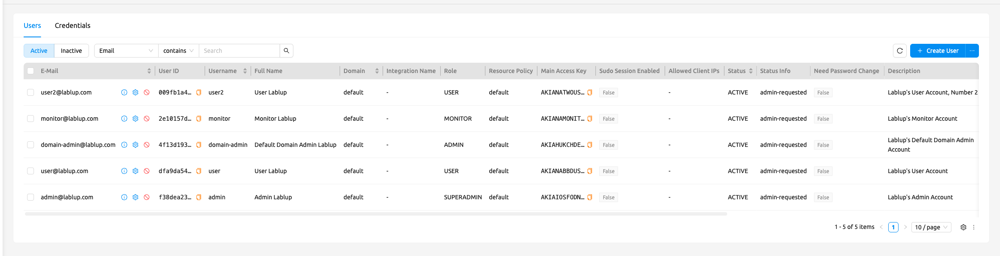
<!-- TODO: Re-capture check_if_user_created.png framed to the card (currently has no padding). -->

Click the info icon in the user's **Email** column row for more detailed user
information. You can also check the domain and project information where the
user belongs.

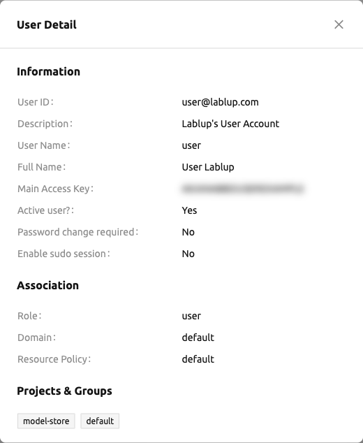

Click the settings (gear) icon in the user's **Email** column row to update information of a user who
already exists. User's name, password, activation state, etc. can be changed. User ID (email) cannot be changed.

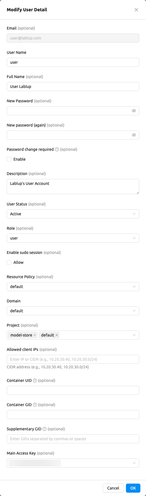

The user create/update dialog contains the following fields:

- **E-Mail**: The user's email address, used as the login ID. Cannot be changed after creation.
- **Username**: A unique identifier for the user (up to 64 characters).
- **Full Name**: The user's display name (up to 64 characters).
- **Password**: Must be at least 8 characters and include at least 1 alphabet, 1 special character, and 1 number.
- **Require password change?**: If the admin has chosen random passwords while
  creating users in batches, this field can be set to ON to indicate that
  password change is required. The users will see the top bar that notify user
  to update their password, but this is a kind of descriptive flag which has no
  effect on actual use.
- **Description**: An optional description for the user (up to 500 characters).
- **User Status**: Indicates the user's status. Inactive users cannot log
  in. Before Verification is a status that indicates a user needs an additional
  step to activate the account such as email verification or an approval from an
  admin. Note that the inactive users are listed in the Inactive tab separately.

  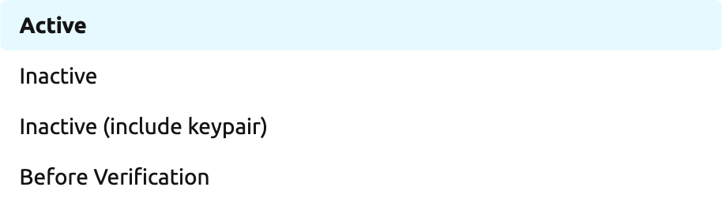

- **Role**: The user's role (user, admin, superadmin). Available options depend on the current user's permissions.
- **Enable sudo session**: Allow the user to use sudo in the compute session.
  This is useful when the user needs to install packages or run commands that
  require root privileges. However, it is not recommended to enable this option
  for all users, as it may cause security issues.
- **2FA Enabled**: A flag indicating whether the user uses two-factor authentication.
  When using two-factor authentication, users are additionally required to enter an
  OTP code when logging in. Administrators can only disable two-factor authentication
  for other users.
- **Resource Policy**: Select the user resource policy
  to which the user belongs. For more information about user resource policies, please
  refer to the [user resource policy](#user-resource-policy) section.
- **Domain**: The domain to which the user belongs. This field is shown in both the create and update dialogs.
- **Projects**: Select one or more projects for the user to belong to. The available projects depend on the domain shown in the dialog.
- **Allowed Client IPs**: Restrict which IP addresses can access the system using this user account. Enter IP addresses or CIDR notation (e.g., `10.20.30.40`, `10.20.30.0/24`). If left empty, access from any IP is allowed.
- **Container UID**: The numeric User ID assigned to processes inside the container. This is useful when the container needs to match a specific UID for file permission purposes.
- **Container GID**: The default numeric Group ID assigned to processes inside the container.
- **Supplementary GID**: Additional numeric Group IDs assigned to container processes. Enter multiple GIDs separated by commas.
- **Main Access Key**: (Edit only) Select the main access key used for API authentication among the user's keypairs.

### Bulk Create Users

When you need to create multiple user accounts at once, you can use the Bulk Create
Users feature. An ellipsis (`...`) dropdown button appears
next to the **Create User** button on the Users page. Click this dropdown button and
select **Bulk Create Users** to open the bulk creation dialog.

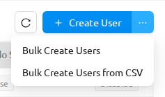

The bulk creation dialog contains the following fields. An info banner at the top of the
dialog explains that emails and usernames will be auto-generated by appending zero-padded
sequential numbers to the prefix.

- **Email prefix (before @)**: The prefix portion of the auto-generated email addresses.
  Must contain only letters, numbers, dots, hyphens, or underscores (max 30 characters).
- **Email suffix (after @)**: The domain portion of the auto-generated email addresses.
  This field displays a `@` prefix automatically (max 30 characters).
- **Number of users**: The number of user accounts to create (1 to 100). A live email
  preview is displayed below this field, showing the email addresses that will be generated.
  For 4 or fewer users, all emails are shown. For more than 4, the first two, an ellipsis,
  and the last email are displayed (e.g., `student01@example.com, student02@example.com ...
  student10@example.com`).
- **Password**: A shared initial password for all created users. The same password rules
  apply as for single user creation (at least 8 characters with at least 1 alphabet,
  special character, and number).
- **Password change required**: Defaults to ON for bulk-created users. When enabled,
  each user will be prompted to change their password on first login.
- All other fields (**Status**, **Role**, **Enable sudo session**, **Resource Policy**, **Domain**, **Projects**, **Allowed Client IPs**, etc.) work the same as in single user creation. See the [Browse and manage users](#create-and-update-users) section.

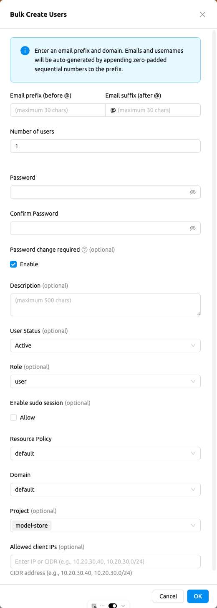

Usernames and email addresses are auto-generated based on the prefix and suffix you
provide. For example, if you set the email prefix to `student` and the email suffix to
`example.com`, and the number of users to 10, the following accounts will be created:

| Username | Email |
|----------|-------|
| `student01` | `student01@example.com` |
| `student02` | `student02@example.com` |
| ... | ... |
| `student10` | `student10@example.com` |

:::note
Sequential numbers are zero-padded based on the total number of users. For example,
3 users produce `student1` to `student3`, 10 users produce `student01` to
`student10`, and 100 users produce `student001` to `student100`.
:::

:::warning
If some of the generated usernames or email addresses already exist, the operation
will partially succeed. A warning message will display how many users were
successfully created and how many failed.
:::

### Bulk Create Users from CSV

Instead of bulk-creating users directly, you can also create users by uploading a CSV file. Click the ellipsis (`...`) dropdown next to the **Create User** button and select **Bulk Create Users from CSV** to open the CSV upload dialog.

#### Preparing the CSV File

The CSV file must use UTF-8 encoding. The first row must be a header row. Header names are matched case-insensitively. You can download a ready-to-use template by clicking **Download CSV Template** inside the dialog.

**Required columns:**

- **email**: The user's email address, used as the login ID.
- **username**: A unique username for the user.
- **password**: The initial password. The same password rules apply as for single user creation (at least 8 characters with at least 1 alphabet, special character, and number).

**Optional columns:**

- **full_name**: The user's display name.
- **role**: The user's role (`user`, `admin`, or `superadmin`). Defaults to `user` if omitted.
- **status**: The user's initial status (`active` or `inactive`). Defaults to `active` if omitted.
- **domain_name**: The domain to assign the user to. Defaults to the current domain if omitted.
- **description**: An optional description for the user.
- **need_password_change**: Whether the user must change their password on first login (`true` or `false`). Defaults to `true` if omitted.
- **resource_policy**: The name of the resource policy to assign.
- **project**: The name of the project to add the user to.

#### Uploading and Reviewing

After selecting your CSV file, the dialog shows a preview table listing all rows with the following indicators:

- Rows with valid data are shown normally.
- Rows with formatting or validation errors are highlighted with inline error messages so you can correct the source file before retrying.
- A summary at the top of the preview shows the total number of valid and invalid rows.

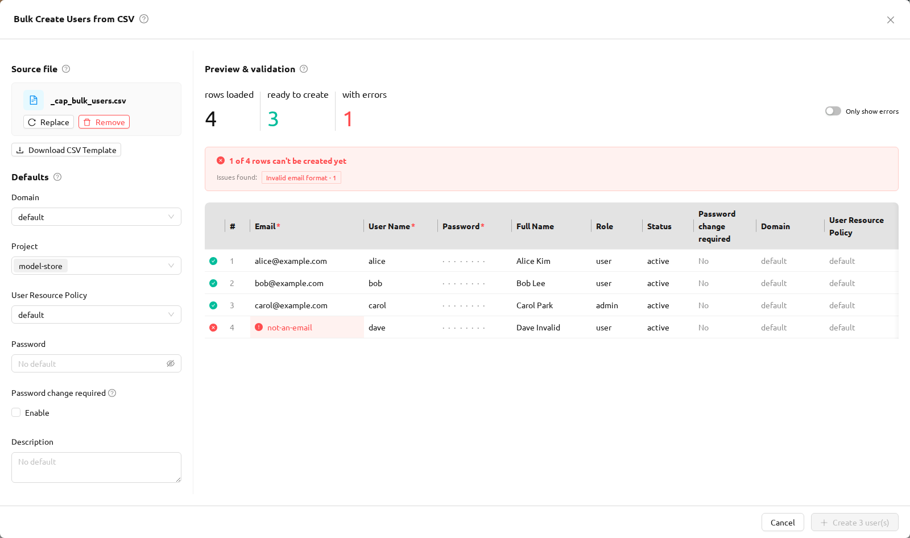

#### Creating the Users

Once you have reviewed the preview and confirmed that all rows are valid, click **Create** to submit. If some rows fail on the server side (for example, because an email or username already exists), the dialog remains open and lists the per-row errors so you can identify and resolve the conflicts.

:::warning
If some rows fail, only the successful rows result in new accounts. Failed rows are reported individually. Correct the source CSV and re-upload to create the remaining accounts.
:::

## Inactivate user account

To track usage statistics per user, retain metrics, and prevent accidental
account loss, the recommended way to stop a user from logging in is to
**deactivate** the account rather than delete it. Deactivation keeps the user's
records intact while blocking sign-in. To deactivate a user, click the deactivate icon in the user's **Email** column row. A confirmation popover appears; click the **Deactivate** button to deactivate the user.

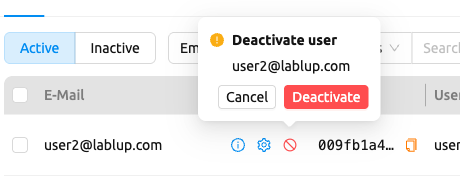
<!-- TODO: Re-capture user_deactivate_confirmation.png in this locale's UI language, reflecting the new flow: the deactivate icon in the user's Email column row and the confirmation popover. -->

To reactivate a user, go to the **Inactive** tab on the Users page and click the reactivate (restore) icon in the user's **Email** column row. A confirmation popover appears; click the **Activate** button to reactivate the user.

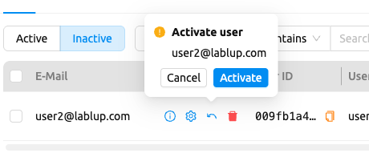
<!-- TODO: Re-capture user_inactivate_confirmation.png in this locale's UI language, reflecting the new flow: the reactivate (restore) icon in the Email column row on the Inactive tab and the activate popover. -->

:::note
Please note that deactivating or reactivating the user does not change the user's credentials, since the user
account can have multiple keypairs, which brings it hard to decide which credential
should be reactivated.
:::

While day-to-day account management relies on deactivation, superadmins can
permanently remove accounts that are already inactive, using the Purge feature
described below.

### Purge Inactive Users

Superadmins can permanently delete (purge) user accounts that have already been
deactivated. Purging is available **only** for users in the **Inactive** tab —
active users must be deactivated first. Unlike deactivation, purging is
irreversible and also removes the user's associated data.

In the Users page, switch to the **Inactive** tab (the status selector reads
**Inactive (include keypair)** to indicate that purging also affects the user's
keypairs). You can purge users in two ways:

- **Per-user purge**: Click the trash-bin (permanently delete) icon in a single inactive user's **Email** column row.
- **Bulk purge**: Select one or more inactive users with the row checkboxes, then
  click the **Permanently Delete Users** button (the trash-bin button that
  appears next to the selection count).

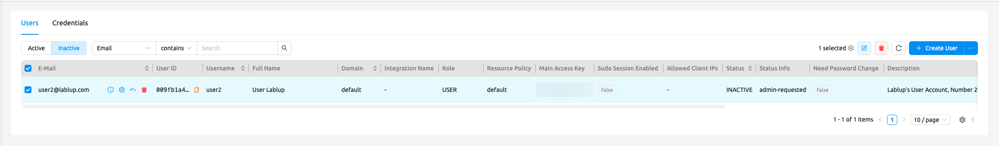
<!-- TODO: Capture screenshot of user_purge_inactive_tab.png — Inactive Users tab showing the per-row purge (trash) icon and the bulk Permanently Delete Users button -->

Either action opens the **Permanently Delete Users** confirmation modal. Because
this operation cannot be undone, you must type the confirmation phrase shown in
the modal before the delete button becomes enabled. The modal also offers two
options:

- **Delete shared virtual folders as well?**: When checked, virtual folders
  shared by the purged users are also deleted. When unchecked, those folders are
  left in place.
- **Delete created model services as well?**: When checked, model services
  created by the purged users are deleted as well. When unchecked, ownership of
  those services is delegated instead of deleting them.

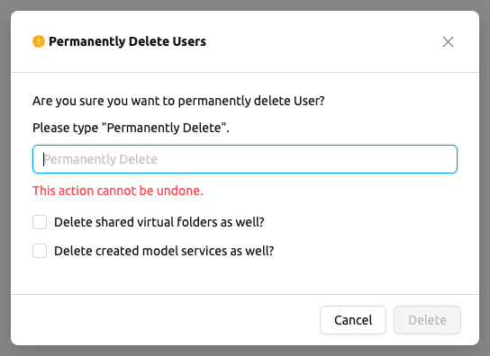
<!-- TODO: Capture screenshot of purge_users_modal.png — Permanently Delete Users confirmation modal with the two option checkboxes and the irreversibility alert -->

:::danger
Purging a user is **irreversible**. The user's virtual folders, kernel history,
and related keypairs are also deleted. Make sure you have selected the correct
users before confirming.
:::

## Manage User's Keypairs

Each user account usually have one or more keypairs. A keypair is used for API
authentication to the Backend.AI server, after user logs in. Login requires
authentication via user email and password, but every request the user sends to
the server is authenticated based on the keypair.

A user can have multiple keypairs, but to reduce the user's burden of managing
keypairs, we are currently using only one of the user's keypairs to send requests.
Also, when you create a new user, a keypair is automatically created, so you do
not need to create and assign a keypair manually in most cases.

Keypairs can be listed on the Credentials tab of in the Users page. Active
keypairs are shown immediately, and to see the inactive keypairs, click the
Inactive panel at the bottom.

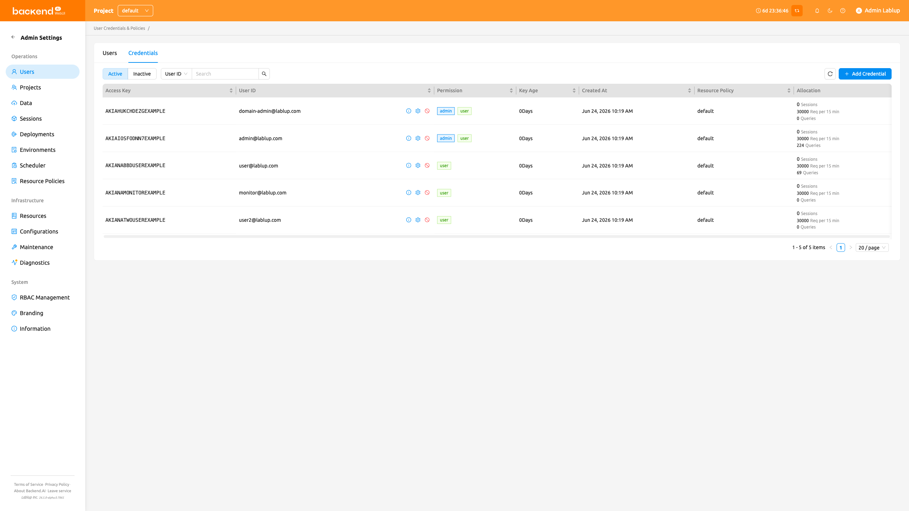
<!-- TODO: Re-capture credential_list_tab.png with the sidebar menu expanded (currently collapsed). -->

Like in Users tab, you can use the inline buttons in the keypair's row to view or
update keypair details. Click the info icon button to see specific details of the keypair.
If necessary, you can copy the secret key by clicking the copy button.

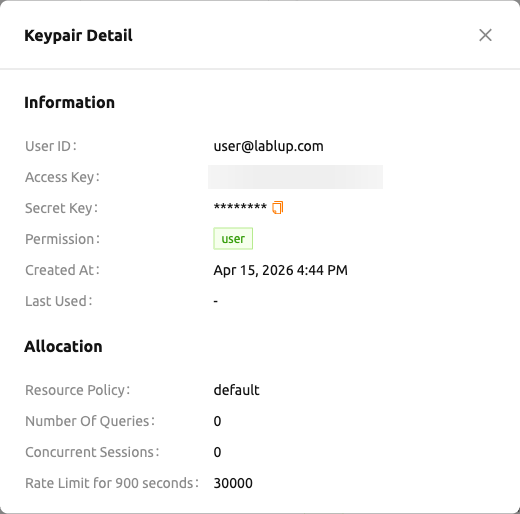

You can modify the resource policy and rate limit of the keypair by clicking the `Setting (Gear)` button.
Please keep in mind that if the 'Rate Limit' value is small, API operations such as login may be blocked.

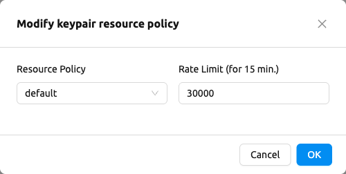

You can also deactivate or reactivate the keypair by clicking the `Deactivate` button or `Activate` button in the keypair's row.
Unlike the User tab, the Inactive tab allows permanent deletion of keypairs.
However, you cannot permanently delete a keypair if it is currently being used as a user's main access key.

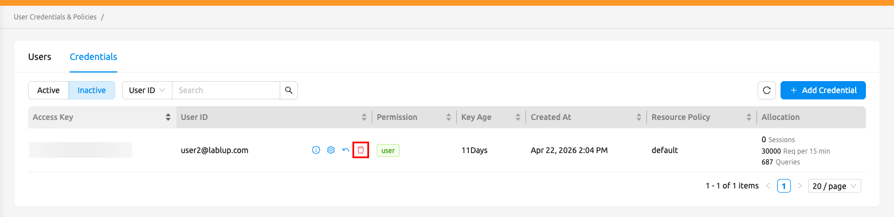

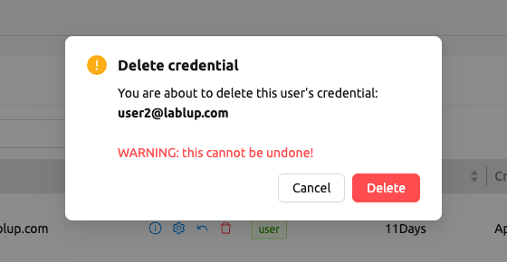
<!-- TODO: Re-capture keypair_delete_confirmation.png — shows the old UI. -->

If you
accidentally deleted a keypair, you can re-create keypair for the user by
clicking the `+ ADD CREDENTIAL` button at the upper right corner.

The Rate Limit field is where you specify the maximum number of requests that
can be sent to the Backend.AI server in 15 minutes. For example, if set to 1000,
and the keypair sends more than 1000 API requests in 15 minutes, and the server
throws an error and does not accept the request. It is recommended to use the
default value and increase it when the API request frequency goes up high
according to the user's pattern.

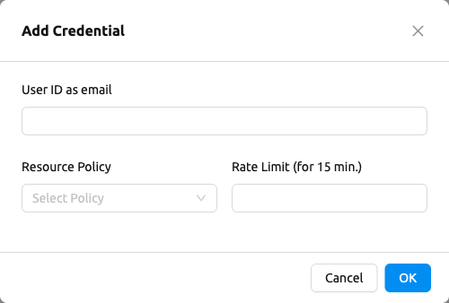

## Share project storage folders with project members

Backend.AI provides storage folders for projects, in addition to user's own
storage folder. A project storage folder is a folder belonging to a specific
project, not a specific user, and can be accessed by all users in that project.

:::note
Project folders can be created only by administrators. Normal users can only
access the contents of the project folder created by the administrator.
Depending on the system settings, project folders may not be allowed.
:::

First, log in with an admin account and create a project folder. After moving to
the Data page, click `Create Folder` to open the folder creation dialog.
Enter the folder name, set the Type to Project. When the type is set to Project,
it will be automatically assigned to the project selected in the project selector in the header.
Permission is set to Read-Only.

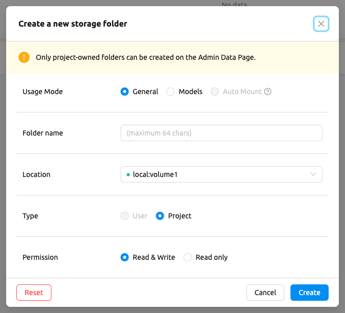
<!-- TODO: Re-capture group_folder_creation.png — shows the old UI. -->

After confirming that the folder has been created, log in with the User B's
account and check that the project folder just created on the Data & Storage page
is displayed without any invitation procedure. You can see that R (Read Only) is
also displayed in the Permission panel.

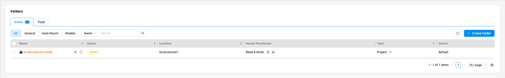
<!-- TODO: Re-capture group_folder_listed_in_B.png — shows the old UI. -->

## Model Deployment

### Admin Deployments Page

Administrators and superadmins can access the Admin Deployments page at `/admin-deployments`, which provides a cross-project view of every deployment in the cluster. The **Project** column is available in the deployment list but is hidden by default; you can enable it using the column settings.

The Admin Deployments page has up to four tabs:

- **Deployments**: Displays the deployment list across all projects, with the same lifecycle and property filters as the user-facing Deployments page.
- **Model Store Management**: See the [Admin Model Store Management](#admin-model-store-management) section below.
- **Prometheus Preset**: Lets administrators manage reusable Prometheus query presets. See the [Prometheus Query Presets](#prometheus-query-presets) section below.
- **Deployment Presets**: Lets administrators manage reusable deployment presets that end users can apply when deploying a model. See the [Deployment Presets](#deployment-presets) section below.

:::note
Each individual admin deployment has its own dedicated route at `/admin-deployments/:id`. When you open a deployment from the Admin Deployments page, the URL changes to this path so that the deployment detail can be linked to or bookmarked directly.
:::

#### Deployment Detail Page

When you open a deployment from the Admin Deployments page, the **Revisions** card on the Deployment Detail Page provides three tabs: **Current Revision**, **Revision History**, and **Audit Log**. These behave the same as on the user-facing Deployments page — for the full description of each tab, see the [Revisions Tab](#revisions-tab) section in the Model Deployment documentation.

- **Current Revision**: Shows the full configuration of the revision currently serving traffic. This includes a **Runtime Parameters** row that lists the runtime-variant parameter values configured for the revision (for `vLLM` and `SGLang` runtimes).
- **Revision History**: Lists every revision added to the deployment. Clicking a revision opens a detail view that shows the full configuration of that revision, including the **Runtime Parameters** row for `vLLM` and `SGLang` revisions.
- **Audit Log**: Shows a record of actions performed on the deployment.

The **Audit Log** tab tracks all action history for the deployment. Each entry includes:

- **Time**: The timestamp when the action was performed.
- **Operation**: The type of action performed.
- **Status**: The result of the operation.
- **Description**: Additional details about the operation.
- **Duration**: The time taken to complete the operation.
- **Triggered By**: The user who initiated the action.

You can filter entries by **Status**, **Operation**, **Triggered By**, and a **Time** date-range picker.

### Admin Model Store Management

Superadmins can manage model cards through the **Model Store Management** tab on the Admin Deployments page.

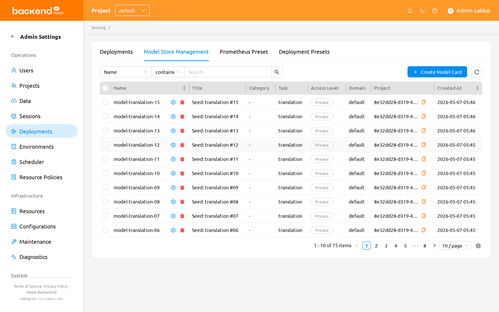

The list provides the following columns:

- **Name**: The unique identifier of the model card.
- **Title**: The human-readable display name.
- **Category**: The model category (e.g., LLM).
- **Task**: The inference task type (e.g., text-generation).
- **Access Level**: Shows a green `Public` tag when the model card is publicly accessible, or a default `Private` tag otherwise.
- **Domain**: The domain that owns the model card.
- **Project**: The project that owns the model card.
- **Created At**: The timestamp when the model card was created.

You can narrow the list using the property filter bar at the top, which supports filtering by the following properties:

- **Name**: Filter by the model card's name (string match).
- **Domain**: Filter by the owning domain (string match).
- **Project**: Filter by the owning project's UUID.
- **Storage Host**: Filter by the storage host of the linked folder, using the equals or not-equals operator with a custom value.

Edit and delete action icons are shown directly in the **Name** cell of each row.

To delete multiple model cards at once, select the rows you want to remove using the checkboxes and click the red trash-bin button next to the selection count. A confirmation dialog appears before the cards are deleted.

#### Creating a Model Card

Click the `Create Model Card` button to open the creation modal. Fill in the following fields:

- **Name** (required): A unique identifier for the model card.
- **Title**: A human-readable display name.
- **Description**: A detailed description of the model.
- **Author**: The model creator or organization.
- **Model Version**: The version of the model.
- **Task**: The inference task type (e.g., text-generation).
- **Category**: The model category (e.g., LLM).
- **Framework**: The ML framework used (e.g., PyTorch, TensorFlow). This is a tag input — type a value and press **Enter** or type a **comma** to add each entry.
- **Label**: Tags for categorization and filtering. Like **Framework**, this is a tag input — press **Enter** or type a **comma** to add each tag.
- **License**: The license under which the model is distributed.
- **Architecture**: The model architecture (e.g., Transformer).
- **README**: A markdown README for the model.
- **Domain**: The domain to associate the model card with. When creating a new model card, this field is pre-filled with your current domain; you can change it if needed.
- **Project ID** (required): The project that owns the model card.
- **VFolder** (required): The storage folder containing the model files.
- **Access Level**: Controls who can see the model card in the user-facing Model Store.

   * `Internal`: Visible only to administrators of the owning domain and project. Regular users cannot see internal cards in their Model Store.
   * `Public`: Visible to all users who have access to the owning project.

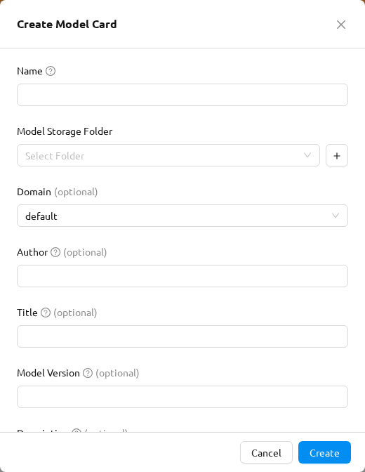

#### Editing a Model Card

Click the edit icon next to the model card name to modify an existing model card. The edit modal opens with previously entered fields already filled in.

#### Deleting Model Cards

You can delete an individual model card by clicking the delete icon next to its name, or perform bulk deletion by selecting multiple model cards with the row checkboxes and clicking the red trash-bin button next to the selection count.

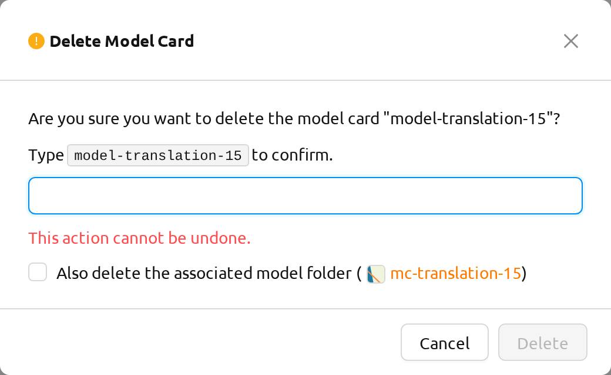

The deletion confirmation dialog includes an **Also delete the associated model folder** option:

- When this option is checked, the storage folder (vfolder) linked to the model card is moved to the trash at the same time the model card is removed. A trash notification appears so superadmins can confirm that the linked folder was sent to the trash, and the folder can be restored (or permanently deleted) from **Data > Trash** if needed. Note that deleting the associated folder also removes every other model card that references the same folder.
- When this option is unchecked, only the model card record is removed; the linked storage folder remains untouched and can be reused for another model card.

The same behavior applies to **bulk deletion** (the label becomes **Also delete all associated model folders**): each selected model card's linked storage folder is moved to the trash when the option is checked, and a trash notification is shown for each folder that was moved.

## Prometheus Query Presets

Backend.AI lets administrators define reusable **Prometheus query presets** that auto-scaling rules and other monitoring features can reference by name. A preset bundles a metric name, a PromQL query template, an optional time window, and optional filter / group labels so operators do not have to retype the same query for every rule.

The presets are managed from the **Prometheus Preset** tab on the Admin Deployments page (`/admin-deployments?tab=prometheus-preset`).

:::note[Superadmin only: live preview in the Auto Scaling Rule editor]
When a superadmin opens the Auto Scaling Rule editor for a deployment, sets **Metric Source** to `Prometheus`, and selects a preset, a live **Current value** preview appears below the preset selector showing the latest metric value from Prometheus. This preview is only visible to superadmin accounts — regular users and domain admins do not see it.
:::

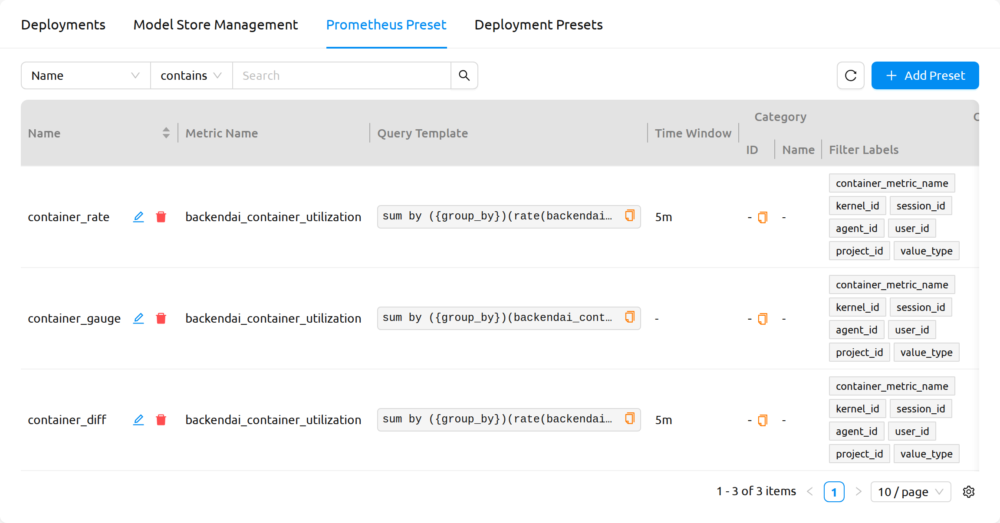

### List & Filter

The preset table lists all Prometheus query presets across the cluster. Each row shows:

- **Name**: A unique, human-readable identifier for the preset. The cell also exposes inline **Edit** and **Delete** actions.
- **ID**: The preset's internal identifier.
- **Metric Name**: The metric this preset reports (used as the display label by consumers such as auto-scaling rules).
- **Query Template**: The PromQL expression that will be executed. The cell is **copyable** — hover over the value and click the copy icon to copy the full template to the clipboard. This is useful when you want to paste the template into a Prometheus UI to verify the result.
- **Time Window**: The default look-back window (for example, `5m`) used when the query references a range vector.
- **Category**: The optional category the preset belongs to (with the resolved category name and the category ID).
- **Options**: The optional **Filter Labels** and **Group Labels** that consumers can apply on top of the preset.
- **Created At** / **Updated At**: Timestamps maintained automatically by the server.

You can search and narrow the list with the property filter above the table, and click any column header to change the sort order.

### Column Settings Persistence

The table includes a column-settings control that lets you hide columns you do not need and reorder the visible columns. Your choices are **persisted across sessions** per browser, so the table opens with your preferred layout the next time you visit the tab. Resetting the column settings restores the default Backend.AI layout.

### Create a Preset

Click **Add Preset** at the top right of the table to open the **Create Preset** modal.

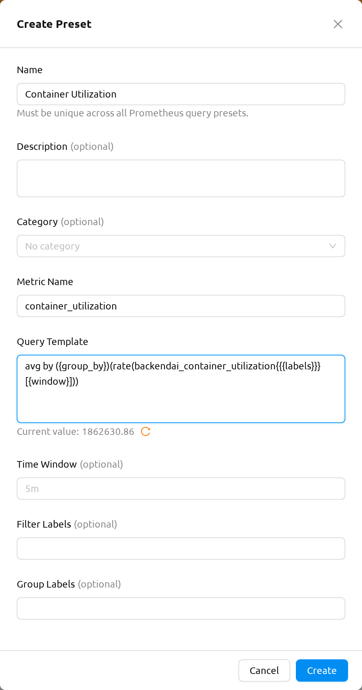

The modal contains the following fields:

- **Name**: The preset's unique name. Must be unique across all Prometheus query presets.
- **Description**: A free-form description shown alongside the preset in selectors.
- **Category**: An optional category for grouping related presets. Leave empty for **No category**.
- **Metric Name**: The metric label that consumers (for example, auto-scaling rules) will display.
- **Query Template**: The PromQL expression to execute. As you type, a **live preview** area below the field shows what value the template returns against your Prometheus instance, so you can verify the template works before saving. The preview is debounced and updates automatically as you edit.
- **Time Window**: The default range-vector window, for example `5m`. Leave empty if the query does not use a range vector.
- **Filter Labels**: Optional list of label selectors that consumers can apply on top of the preset.
- **Group Labels**: Optional list of labels to group the query result by.

Click **Create** to save the preset. On success, the preset appears in the list and a confirmation toast is shown.

### Edit a Preset

Click the **Edit** action in the **Name** cell of a preset row to open the **Edit Preset** modal. The modal is pre-populated with the preset's current values and exposes the same fields as the Create dialog, including the live preview area for the Query Template.

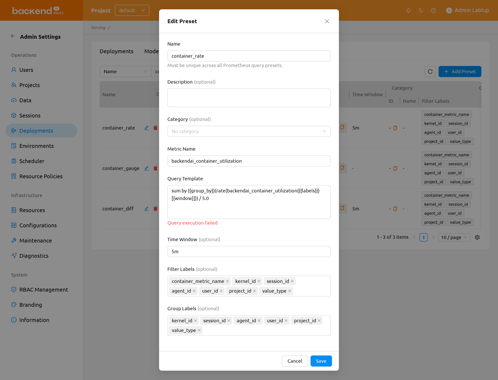

Click **Save** to apply your changes. Consumers of the preset (for example, auto-scaling rules referencing it) automatically pick up the new query template the next time they evaluate the metric.

### Delete a Preset

Click the **Delete** action in the **Name** cell of a preset row to open the deletion confirmation modal.

:::danger
Deleting a Prometheus query preset is **permanent and cannot be undone**. Auto-scaling rules and other features that reference the deleted preset will lose their query template and may stop functioning until they are reconfigured to point at a different preset.
:::

Because deletion is irreversible, the dialog requires you to **type the preset's name** into the confirmation input before the **Delete** button becomes enabled. Type the exact preset name shown in the dialog title and click **Delete** to confirm.

## Deployment Presets

A **Deployment Preset** is a reusable, administrator-curated bundle of deployment settings — image, runtime, resource slots, cluster mode, environment variables, startup command, replica count, visibility, and other defaults — that end users can apply when they create a model deployment from a storage folder. Presets let administrators publish a small set of vetted, known-good deployment shapes (for example, *vLLM-GPU-Large* or *SGLang-CPU-Small*) so that end users can deploy a model without having to choose every advanced field from scratch.

### What Is a Deployment Preset?

A Deployment Preset captures the defaults of a model deployment so that:

- **Administrators** can offer end users a curated catalog of deployment shapes that match the organization's hardware and policy constraints.
- **End users** can pick a preset when deploying a model from the Data page (via the *Create New Deployment with Preset* flow) and skip filling in advanced fields manually.
- **Operators** can ensure that production deployments use consistent resource allocations, runtimes, and visibility defaults across the organization.

When a deployment is created from a preset, the preset's values pre-populate the deployment fields. Users can still review and adjust those fields before confirming the deployment.

Each preset stores the following deployment defaults:

- **Basic Info**: Name, description, runtime variant, and image.
- **Runtime Parameters**: Serving-framework parameters for vLLM or SGLang runtimes (not shown for the Custom runtime).
- **Resources**: Resource slots (CPU, memory, GPU), shared memory (SHM), and resource options.
- **Cluster**: Cluster mode (Single-Node or Multi-Node) and cluster size.
- **Model & Execution**: Startup command, bootstrap script, and environment variables.
- **Model Definition** (optional): Model name, model path, service configuration (port, startup command, pre-start actions), Health Check, and metadata.
- **Deployment**: Replica count, revision history limit, and the *Open to Public* visibility default.

### Managing Deployment Presets

Only administrators can create, edit, or delete deployment presets. Administrators manage them from the **Deployment Presets** tab on the Admin Deployments page.

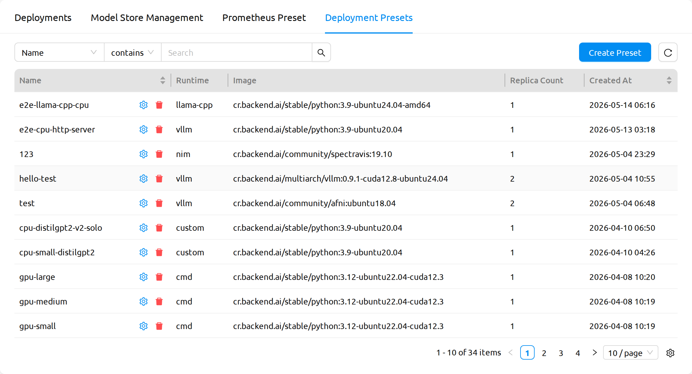

The list view shows each preset with its key fields. From this list, administrators can:

- Filter presets by name or runtime.
- Open a preset's detail view to inspect its full configuration.
- Create, edit, or delete a preset.

The following columns are visible by default: **Name** (with inline edit and delete actions), **Runtime**, **Image** (displayed in `<canonicalName>@<architecture>` format and copyable), **Replicas**, **Created At**, and **Modified At**.

Additional columns are hidden by default and can be shown using the column-settings gear button (⚙) at the right of the table header: **Description**, **Startup Command**, **Cluster**, **Strategy**, **Open to Public** (shown as a Public/Private tag), and **Revision History Limit**. Your column choices are persisted per browser across sessions.

#### Create a Deployment Preset

1. Click the **Create Preset** button at the top right of the preset list.
2. Fill in the fields in the *Create Preset* dialog. The dialog is organized into the following cards, presented across two steps:

   - **Basic Info**:
      * **Name** (required): A unique preset name (for example, `vLLM-GPU-Large`).
      * **Description**: A short summary of the preset's intended use.
      * **Runtime** (required): The runtime variant (for example, vLLM, SGLang, or Custom).
      * **Runtime Parameters** (appears only when a non-Custom runtime such as **vLLM** or **SGLang** is selected): The serving framework parameters for this preset, organized in tabs — for example, **Model Loading**, **Resource Memory**, and **Serving Performance**. Required parameters are marked with a red asterisk (★) next to the label, and the save button stays disabled until every required parameter is filled in — including required parameters on tabs you have not visited yet.
      * **Image** (required): The container image to use when deploying. Images are listed in `<canonicalName>@<architecture>` format (for example, `cr.backend.ai/stable/pytorch:2.1-cuda12.1@aarch64`), which helps distinguish images by CPU architecture on mixed-architecture clusters.
   - **Resources**: Resource slots (CPU, memory, GPU), shared memory, and resource options (key/value pairs).
   - **Cluster**: Cluster mode (Single-Node or Multi-Node) and cluster size.
   - **Deployment**:
      * **Replica Count** (required): Default number of replicas created from this preset.
      * **Revision History Limit**: Number of past revisions kept for each deployment created from this preset.
      * **Open to Public**: A checkbox controlling whether the endpoint of deployments created from this preset is reachable without an access token by default.
   - **Model & Execution**: **Startup Command**, bootstrap script, and environment variables. The Startup Command field shows a shell-syntax hint (`Shell syntax: /bin/bash -c "cmd1; cmd2"`) because the command is executed as `/bin/bash -c <command>`. This means you can use shell operators such as `;`, `|`, and `&&` directly in the field.
   - **Model Definition** (optional): Enable the toggle to configure a structured model definition. When enabled:
      * **Model Name** and **Model Path**: The model identifier and its location in the container.
      * **Service Configuration**: Port, shell, startup command, and pre-start actions.
      * **Health Check**: An **Enable Health Check** toggle, which is **off** by default. When the toggle is off, the health check fields are hidden. When you turn it on, the health check fields appear and become configurable: Path, Interval, Max Retries, Max Wait Time, Status Code, and Startup Grace Period.
      * **Metadata**: Author, title, version, task, category, and other descriptive fields.

   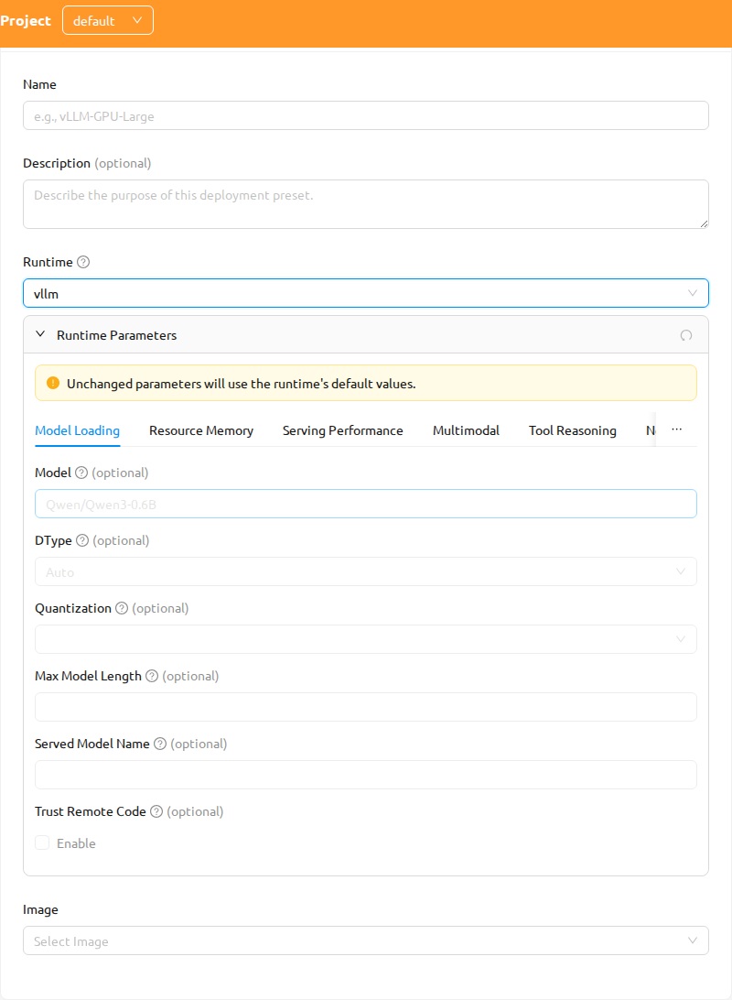

3. Click **Create Preset** to save. A success notification confirms the preset has been created.

:::tip
If a required field is missing or invalid, the **Create Preset** button stays disabled until the error is resolved. Required fields show inline validation messages as you type.
:::

#### Edit a Deployment Preset

1. From the preset list, open the action menu on the preset row (or open the preset's detail view) and select **Edit Preset**.
2. The *Edit Preset* dialog opens with the preset's current values pre-filled. The available sections are identical to the *Create Preset* dialog.
3. Adjust the fields as needed, then click **Edit Preset** to save your changes.

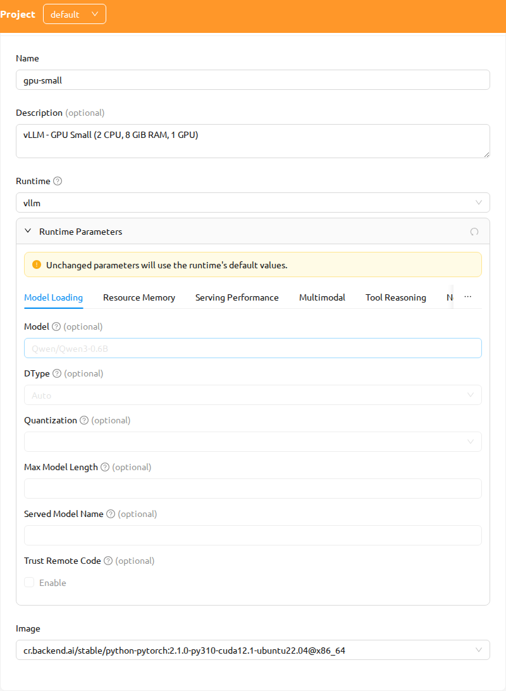

Editing a preset only changes the defaults for **future** deployments. Existing deployments that were already created from this preset are not modified.

#### Delete a Deployment Preset

1. From the preset list (or the preset's detail view), open the action menu on the preset and select **Delete Preset**.
2. A typed-confirmation dialog appears asking you to type the preset's name to confirm. The **OK** button stays disabled until the typed value matches the preset name exactly.
3. Type the preset's name, then click **OK** to confirm.

:::danger
Deleting a deployment preset is **irreversible**. The preset itself is removed, but deployments that were already created from it continue to run unaffected. Future deployments can no longer reference this preset.
:::

### Using a Preset When Deploying a Model

End users apply a deployment preset through the **Create New Deployment with Preset** modal, which opens when you deploy a model from a storage folder on the Data page.

1. From the Data page, locate the model folder you want to deploy.
2. Click the **Deploy** button on the folder row.
3. The **Create New Deployment with Preset** modal opens. Select the deployment preset to apply and the target resource group.
4. To inspect the preset's configuration before deploying, click the **ⓘ** (Info) button next to the preset selector to open the **Deployment Preset Detail** view.
5. Click **OK** to create the deployment using the selected preset's values.

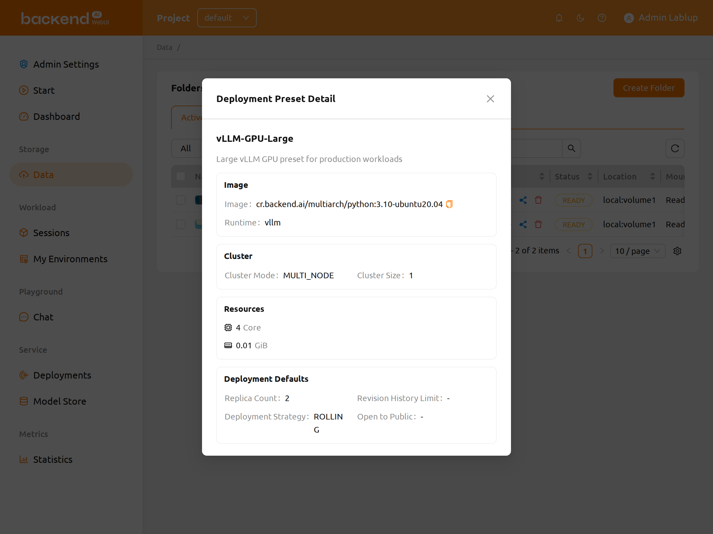

The **Deployment Preset Detail** view shows every field that the preset will apply when used — image, runtime, resources, cluster mode, replica count, visibility, and so on. It also includes a **Health Check** card:

- When health check is enabled in the preset: the card shows **Enabled** along with the configured Path, Interval, Max Retries, Max Wait Time, Status Code, and Startup Grace Period.
- When health check is disabled: the card shows **Disabled**.

For advanced configuration, go to the Deployments page and create a new deployment manually. The revision-add modal offers two modes: **Preset Mode** (applies the preset directly) and **Advanced Mode**, where the deployment launcher opens pre-filled with the preset's values so you can review and adjust every field — image, runtime variant, resource group, resource slots, shared memory, resource options, cluster mode, cluster size, startup command, environment variables, replica count, revision history limit, and **Open to Public** visibility — before confirming. Editing a field in **Advanced Mode** does **not** modify the underlying preset; it only changes the values used for that one deployment.

## Manage Resource Policies

#### Keypair Resource Policy

In Backend.AI, administrators have the ability to set limits on the total resources available for each keypair, user, and project.
Resource policies enable you to define the maximum allowed resources and other compute session-related settings.
Additionally, it is possible to create multiple resource policies for different needs,
such as user or research requirements, and apply them on an individual basis.

The Resource Policies page allows administrators to view a list of all registered resource policies.
Administrators can review the resource policies established for keypairs, users, and projects directly on this page.
Let's begin by examining the resource policies for keypairs. The infinity symbol (∞)
indicates that no resource restrictions have been applied to those resources.

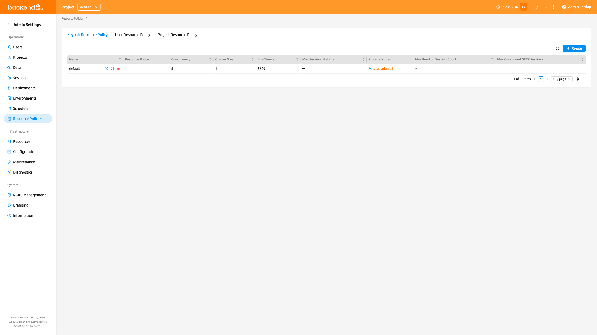
<!-- TODO: Re-capture resource_policy_page.png — needs update. -->

The user account being used in this guide is currently assigned to the default
resource policy. This can be verified in the Credentials tab on the Users page.
You can also confirm that all resource policies are set to default in the Resource Policies panel.

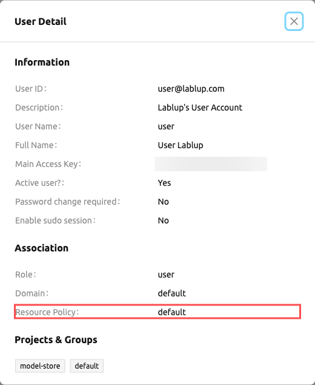

To modify resource policies, click the `Setting (Gear)` in the Name column of the
default policy group. In the Update Resource Policy dialog, every option is
editable except for Policy Name, which serves as the primary key for
distinguishing resource policies in the list. Uncheck the Unlimited checkbox
at the bottom of CPU, RAM, and fGPU, and set the resource limits to the desired
values. Ensure that the allocated resources are less than the total hardware
capacity. In this case, set CPU, RAM, and fGPU to 2, 4, and 1 respectively.
Click the OK button to apply the updated resource policy.

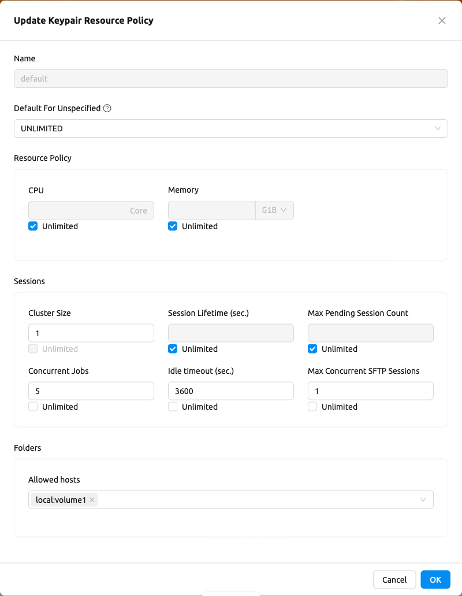

About details of each option in resource policy dialog, see the description below.

- Resource Policy
  - CPU: Specify the maximum amount of CPU cores. (max value: 512)
  - Memory: Specify the maximum amount of memory in GB. It would be good practice
    to set memory twice as large as the maximum value of GPU memory. (max value: 1024)
  - CUDA-capable GPU: Specify the maximum amount of physical GPUs. If fractional GPU
    is enabled by the server, this setting has no effect. (max value: 64)
  - CUDA-capable GPU (fractional): Fractional GPU (fGPU) is literally split a single
    GPU to multiple partitions in order to use GPU efficiently. Notice that the minimum
    amount of fGPU required is differed by each image. If fractional GPU is not enabled
    by the server, this setting has no effect. (max value: 256)

- Sessions
  - Cluster Size: Set the maximum limit for the number of multi-containers or
    multi-nodes that can be configured when creating a session.
  - Session Lifetime (sec.): Limits the maximum lifetime of a compute session
    from the reservation in the active status, including `PENDING` and
    `RUNNING` statuses. After this time, the session will be force-terminated
    even if it is fully utilized. This will be useful to prevent the session
    from running indefinitely.
  - Max Pending Session Count: Maximum number of compute sessions that can be in
    the `PENDING` status simultaneously.
  - Concurrent Jobs: Maximum number of concurrent compute session per keypair.
    If this value is set to 3, for example, users bound to this resource policy
    cannot create more than 3 compute sessions simultaneously. (max value: 100)
  - Idle timeout (sec.): Configurable period of time during which the user can
    leave their session untouched. If there is no activity at all on a
    compute session for idle timeout, the session will be garbage collected
    and destroyed automatically. The criteria of the "idleness" can be
    various and set by the administrators. (max value: 15552000 (approx. 180 days))
  - Max Concurrent SFTP Sessions: Maximum number of concurrent SFTP sessions.

- Folders
  - Allowed hosts: Backend.AI supports many NFS mountpoint. This field limits
    the accessibility to them. Even if a NFS named "data-1" is mounted on
    Backend.AI, users cannot access it unless it is allowed by resource policy.
  - (Deprecated) Max. #: the maximum number of storage folders that
    can be created/invited. (max value: 100).

In the keypair resource policy list, check that the Resources value of the default
policy has been updated.

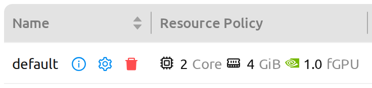

You can create a new resource policy by clicking the `+ Create` button. Each setting
value is the same as described above.

To create a resource policy and associate it with a keypair, go to the
Credentials tab of the Users page, click the gear button located in the
Name column of the desired keypair, and click the Select Policy field to
choose it.

When selecting a keypair resource policy for a specific user, the selection table
includes an **Assigned Keypairs** column that shows which of the user's keypairs
are currently bound to each policy, so you can confirm the user's existing
assignments before choosing a policy.

You can also delete each of resource keypairs by clicking trash can icon
in the Name column. When you click the icon, the confirmation popup appears.
Click the `Delete` button to erase.

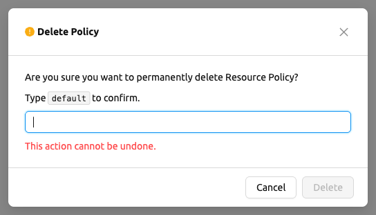
<!-- TODO: Re-capture resource_policy_delete_dialog.png — needs update. -->

:::note
If there's any users (including inactive users) following a resource policy to be deleted,
deletion may not be done. Before deleting a resource policy, please make sure that
no users remain under the resource policy.
:::

If you want to hide or show specific columns, click the `Setting (Gear)` at the bottom right of the
table. This will bring up a dialog where you can select the columns you want to display.

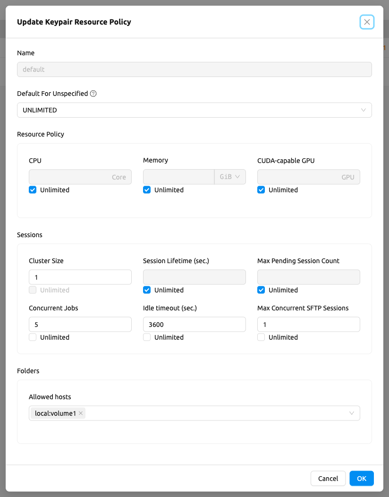
<!-- TODO: Re-capture keypair_resource_policy_table_setting.png — needs update. -->

#### User Resource Policy

Backend.AI supports user resource policy management. While each
user can have multiple keypairs, a user can only have one user resource policy. In the user
resource policy page, users can set restrictions on various settings related to folders such as
Max Folder Count and Max Folder Size, as well as individual resource limits like Max Session
Count Per Model Session and Max Customized Image Count.

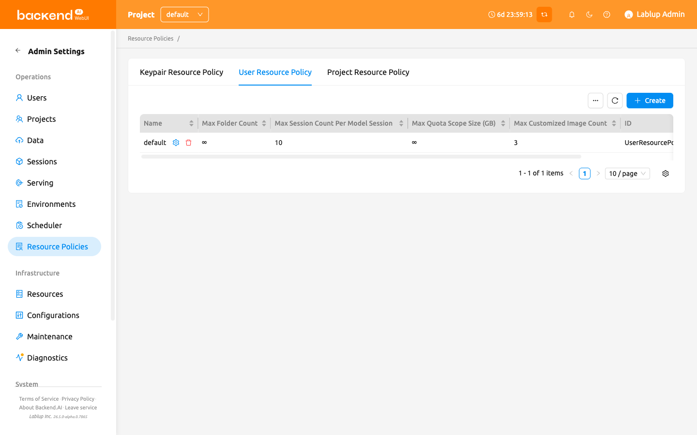

To create a new user resource policy, click the `Create` button.

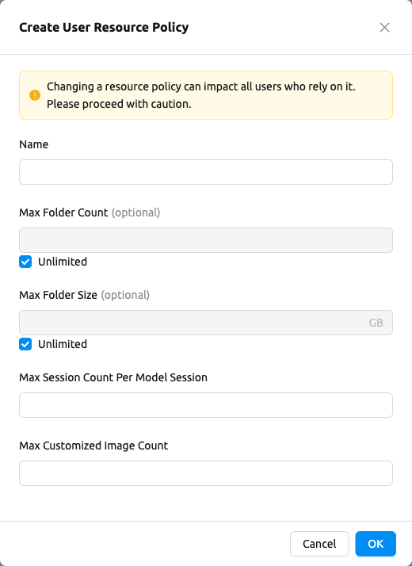

- Name: The name of the user resource policy.
- Max Folder Count: The maximum number of folders that the user can create.
  If the user's folder count exceeds this value, user cannot create a new folder.
  If set to Unlimited, it is displayed as "∞".
- Max Folder Size: The maximum size of the user's storage space. If
  user's storage space exceeds this value, user cannot create a new data
  folder. If set to Unlimited, it is displayed as "∞".
- Max Session Count Per Model Session: The maximum number of available sessions per model
  service created by a user. Increasing this value can put a heavy load on the session
  scheduler and potentially lead to system downtime, so please caution when
  adjusting this setting.
- Max Customized Image Count: The maximum number of customized images that
  user can create. If user's customized image count exceeds this value,
  user cannot create a new customized image. If you want to know more about customized
  images, please refer to the [My Environments](#my-environments) section.

To update, click the `Setting (Gear)` button in the Name column. To delete, click the trash can
button.

:::note
Changing a resource policy may affect all users who use that policy, so use
it with caution.
:::

Similar to keypair resource policy, users can select and display only columns users want by
clicking the `Setting (Gear)` button at the bottom right of the table.

#### Project Resource Policy

Backend.AI supports project resource policy management. Project
resource policies manage storage space (quota) and folder-related limitations for projects.

When clicking the `Project` tab of the `Resource Policies` page, you can see the list of project
resource policy.

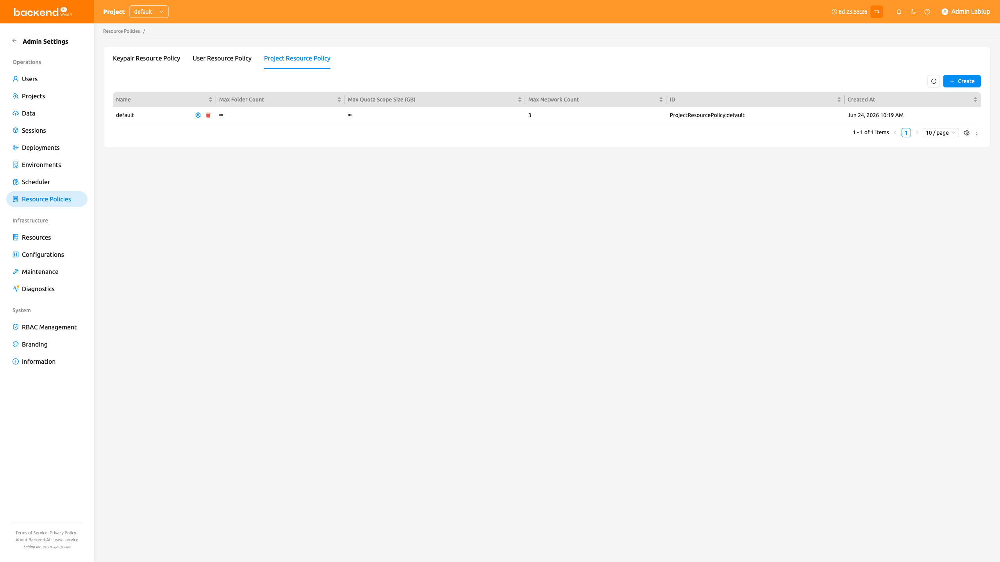
<!-- TODO: Re-capture project_resource_policy_list.png — needs update. -->

To create a new project resource policy, click the `+ Create` button at the top right of the table.

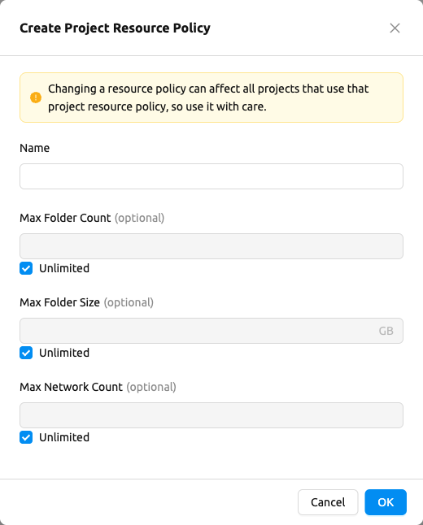

- **Name**: The name of the project resource policy.
- **Max Folder Count**: The maximum number of project folders that an administrator can create.
  If the project folder count exceeds this value, the administrator will not be able to create
  a new project folder. If set to Unlimited, it will be displayed as "∞".
- **Max Folder Size**: The maximum size of the project's storage space. If the project's storage
  space exceeds this value, the administrator cannot create a new project folder. If set to
  Unlimited, it is displayed as "∞".
- **Max Network Count**: The maximum number of networks that can be created for the project. If set to Unlimited, it is displayed as "∞".

The meaning of each field is similar to the user resource policy. The difference is that the
project resource policy is applied to the project folders, while the user resource policy is
applied to the user folders.

If you want to make changes, click the `Setting (Gear)` button in the Name column. Resource policy
names cannot be edited. Deletion can be done by clicking the trash can icon button.

:::note
Changing a resource policy may affect all users who use that policy,
so use it with caution.
:::

You can select and display only the columns you want by clicking the `Setting (Gear)` button at the
bottom right of the table.

To save the current resource policy list as a CSV file, use the **Export CSV** action in the **bottom-right slot of the table**. This applies to the Keypair, User, and Project resource policy tabs alike.

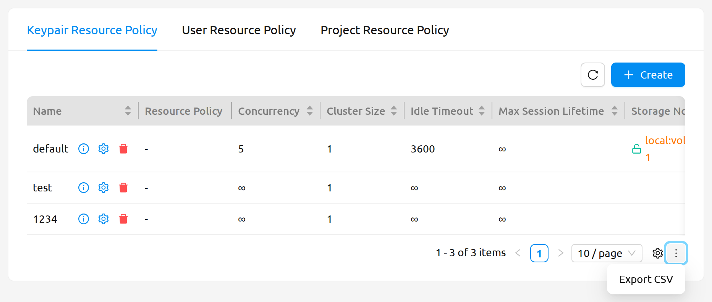

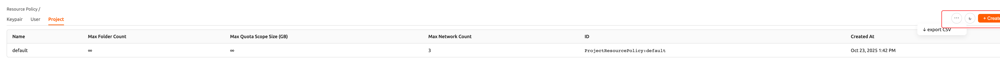

:::tip
Exported CSV files include a UTF-8 BOM at the start of the file, so Microsoft Excel on non-UTF-8 systems (for example, Korean Windows using CP949) correctly recognizes the encoding and displays multi-byte characters without garbling.
:::

## Unified View for Pending Sessions

The Admin Session page provides a unified view of all pending sessions within a
selected resource group. The index number displayed next to the status indicates the queue position in
which the session will be created once sufficient resources become available.

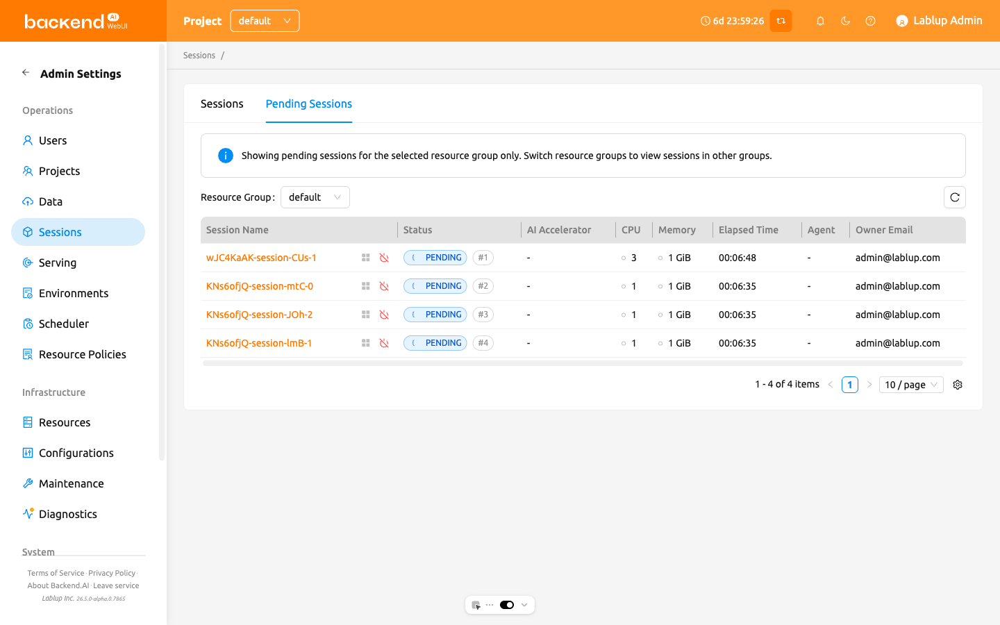

Similar to the Session page, you can click the session name to open a drawer that
displays detailed information about the session.

## Fair Share Scheduler

The Fair Share Scheduler page is available in the
**Admin Settings** menu. This feature allows administrators to manage fair share scheduling weights
across a hierarchical structure of resource groups, domains, projects, and users.

Fair share scheduling allocates compute resources based on historical usage patterns,
ensuring that resources are distributed fairly among users. Users who have consumed fewer
resources in the past receive higher scheduling priority, while those who have used more
resources are given lower priority. Administrators can fine-tune this behavior by adjusting
weights at each level of the hierarchy.

:::note
The Fair Share Scheduler is only available when a resource group's scheduler type is set
to `FAIR_SHARE`. To configure the scheduler type for a resource group, refer to the
[Manage resource group](#manage-resource-group) section.
:::

To access this feature, click the **Scheduler** menu item under **Admin Settings** in the sidebar.
The page displays a Fair Share Setting tab with a 4-step drill-down interface.

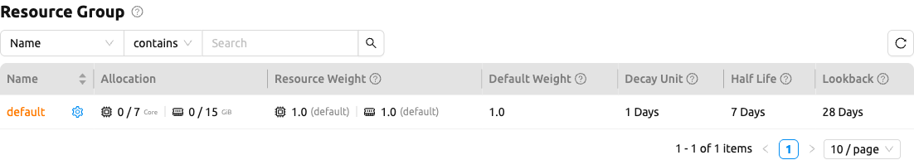

The page is organized into four hierarchical steps:

1. **Resource Group**: Configure core fair share parameters for each resource group
2. **Domain**: Set weights for domains within a resource group
3. **Project**: Set weights for projects within a domain
4. **User**: Set weights for individual users within a project

A step indicator bar at the top of the page shows your current position in the hierarchy.
Completed steps display the name of the selected item. You can click on any completed step
to navigate back to that level.

If the selected resource group does not have its scheduler type set to `FAIR_SHARE`, a
warning alert is displayed indicating that the Fair Share Scheduler is not enabled for that
resource group.

At each step, the following common features are available:

- **Pagination**: Navigate through results with configurable page size.
- **Auto-refresh**: Data refreshes automatically every 7 seconds. A manual refresh button is also available.

### Resource Group

The Resource Group step displays a table of all resource groups with their fair share configuration.

The table includes the following columns:

- **Name**: The resource group name. Click the name to drill into the domain-level settings for that resource group.
- **Control**: A settings (gear) button that opens the Resource Group Fair Share Settings modal.
- **Allocation**: Resource usage showing used/capacity for each resource type allocated to the resource group (e.g., CPU, Memory, CUDA GPU).
- **Resource Weight**: Per-resource-type weights. Displays "default" if using the default weight.
- **Default Weight**: The fallback weight value for domains, projects, and users without a specified weight.
- **Decay Unit**: The period (in days) for aggregating usage.
- **Half Life**: The period (in days) over which the usage reflection rate decreases by half.
- **Lookback**: The range (in days) of usage history reflected in calculations.

### Resource Group Fair Share Settings

Click the settings (gear) button in the Control column of a resource group to open the
Fair Share Settings modal.

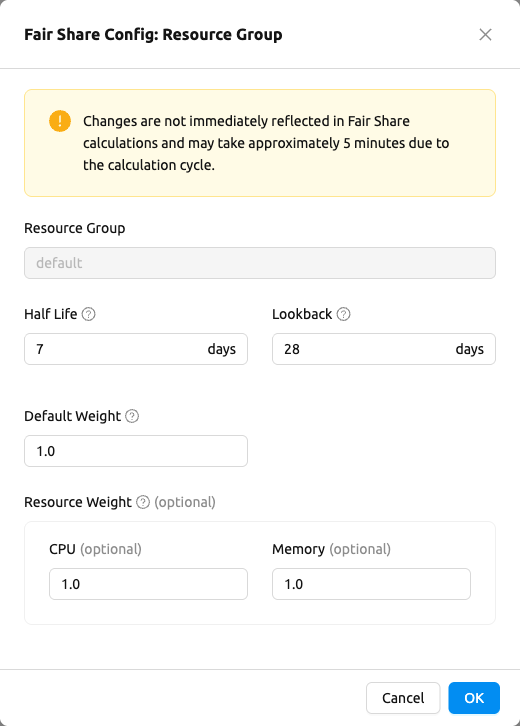

:::warning
Changes are not immediately reflected in Fair Share calculations and may take
approximately 5 minutes due to the calculation cycle.
:::

The modal contains the following fields:

- **Resource Group**: Read-only field showing the resource group name.
- **Half Life**: The period over which the usage reflection rate decreases by half, specified in days (minimum 1). For example, if set to 7 days, usage from 7 days ago is calculated at 50%, and usage from 14 days ago at 25%. It is recommended to set this as a multiple of the decay unit.
- **Lookback**: The range of usage history reflected in Fair Share calculations, specified in days (minimum 1). Usage prior to this period is excluded from calculations. It is recommended to set this as a multiple of the half life.
- **Default Weight**: The default value applied to domains, projects, and users without a specified weight (minimum 1, step 0.1).
- **Resource Weights**: Per-resource-type weights (e.g., CPU, Memory, GPU), each with a minimum value of 1 and step 0.1. This section is only displayed if resource weights exist for the resource group.

### Domain

After selecting a resource group, the Domain step displays a table of domains with their
fair share weights and usage within that resource group.

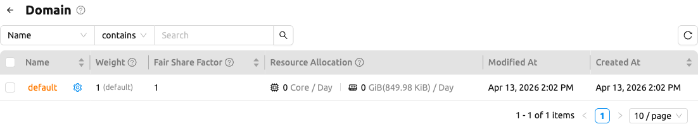

The table includes the following columns:

- **Name**: The domain name. Click the name to drill into project-level settings for that domain.
- **Control**: A settings (gear) button that opens the weight setting modal for this domain.
- **Weight**: The current weight value. Displays "default" if using the default weight.
- **Fair Share Factor**: The scheduling priority calculated by the scheduler. Higher values indicate higher priority.
- **Resource Allocation**: Average daily decayed resource usage per resource type (CPU, Memory, GPU / Day).
- **Modified At**: The last modification timestamp.
- **Created At**: The creation timestamp.

You can select multiple rows using the checkboxes on the left side of the table. When rows
are selected, two additional buttons appear:

- **Usage Graph** (chart icon): Opens the Usage History modal for the selected items.
- **Bulk Edit** (gear icon): Opens the weight setting modal to edit weights for all selected items at once.

### Project

After selecting a domain, the Project step displays a table of projects with the same
column structure as the Domain step. Click a project name to drill into the User step.

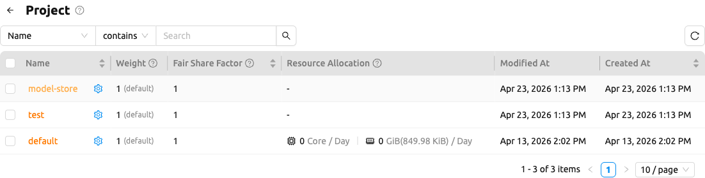

The same bulk operations (Usage Graph and Bulk Edit) are available when rows are selected.

### User

After selecting a project, the User step displays a table of individual users with their
fair share weights and usage.

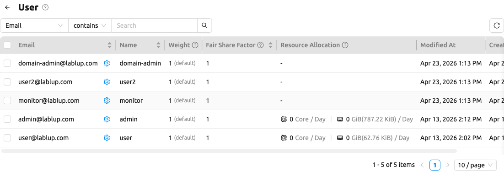

The table includes the following columns:

- **Email**: The user's email address.
- **Name**: The user's name.
- **Control**: A settings (gear) button that opens the weight setting modal for this user.
- **Weight**: The current weight value. Displays "default" if using the default weight.
- **Fair Share Factor**: The scheduling priority calculated by the scheduler.
- **Resource Allocation**: Average daily decayed resource usage per resource type.
- **Modified At**: The last modification timestamp.
- **Created At**: The creation timestamp.

The same bulk operations (Usage Graph and Bulk Edit) are available when rows are selected.

### Editing Fair Share Weights

To edit the fair share weight for a domain, project, or user, click the settings (gear) button
in the Control column of the desired row. This opens the weight setting modal.

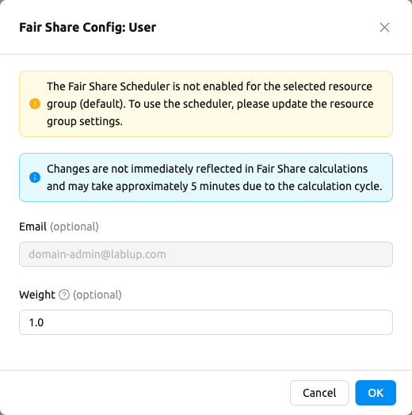

:::warning
Changes are not immediately reflected in Fair Share calculations and may take
approximately 5 minutes due to the calculation cycle.
:::

In single-edit mode, the modal displays the entity name (read-only) and a weight input field.

- **Weight**: The multiplier that determines Fair Share scheduling priority. Higher weight results in higher priority. The default value is "1.0". A weight of "2.0" has twice the priority of "1.0". The minimum value is 1 with a step of 0.1.

To edit weights for multiple items at once, select the desired rows using the checkboxes in the
table, then click the Bulk Edit (gear icon) button. In bulk-edit mode, the modal displays a
tag list of all selected entities and a single weight input that will be applied to all of them.

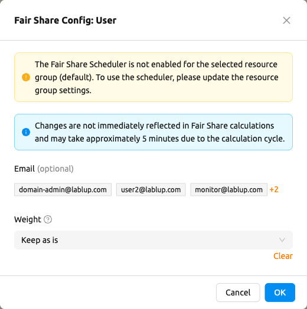

:::note
If the selected resource group does not have its scheduler type set to `FAIR_SHARE`,
a warning alert is displayed in the modal.
:::

### Viewing Usage History

To view the usage history for domains, projects, or users, select the desired rows using
the checkboxes in the table, then click the Usage Graph (chart icon) button. This opens
the Usage History modal.

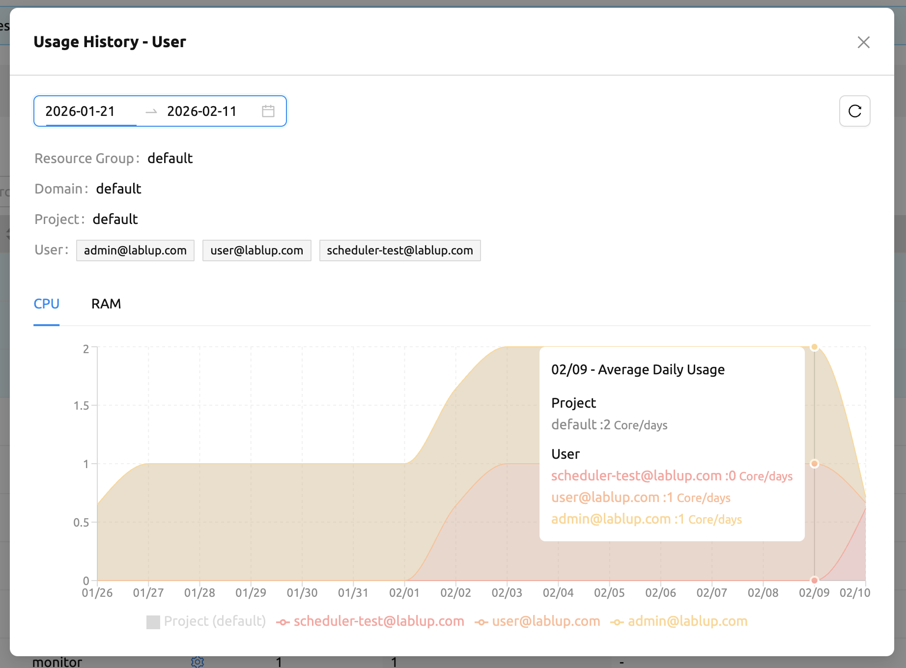

The modal displays the following:

- **Date range picker**: Select a date range for the usage history. Presets are available for Last 7 Days, Last 30 Days, and Last 90 Days.
- **Refresh button**: Manually refresh the usage data.
- **Context information**: Shows the resource group, domain, and project (depending on the current step).
- **Selected entities**: Displayed as tags showing the names of the selected items.
- **Usage chart**: A chart showing the average daily resource usage over the selected period.

## Manage Images

Admins can manage images, which are used in creating a compute session, in the
Images tab of the Environments page. In the tab, meta information of all images
currently in the Backend.AI server is displayed. You can check information such
as registry, architecture, namespace, image name, digest, and minimum
resources required for each image. For images downloaded to one or more agent
nodes, there will be an `installed` tag in the Status column.

:::note
The feature to install images by selecting specific agents is currently
under development.
:::

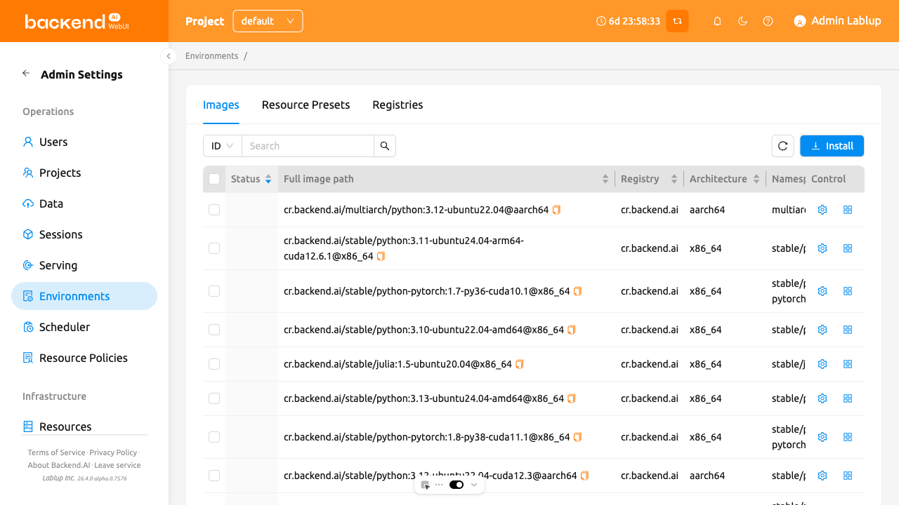

The image list displays additional columns for more detailed image information:

- **Architecture**: The CPU architecture of the image (e.g., x86_64, aarch64).
- **Namespace**: The namespace of the image within the registry.
- **Base Image Name**: The base name of the image, with alias tags for easier identification.
- **Version**: The version tag of the image.
- **Tags**: Detailed tags associated with the image, displayed as double tags with aliases.

You can select multiple uninstalled images and click the `Install` button to install them on available agent nodes in bulk.

You can change the minimum resource requirements for each image by clicking the
`Setting (Gear)` in the `Controls` panel. Each image has hardware and resource
requirements for minimal operation. (For example, for GPU-only images, there
must be a minimum allocated GPU.) The default value for the minimum resource
amount is provided as embedded in the image's metadata. If an attempt is made to
create a compute session with a resource that is less than the amount of
resources specified in each image, the request is automatically adjusted to the
minimum resource requirements for the image and then generated, not cancelled.

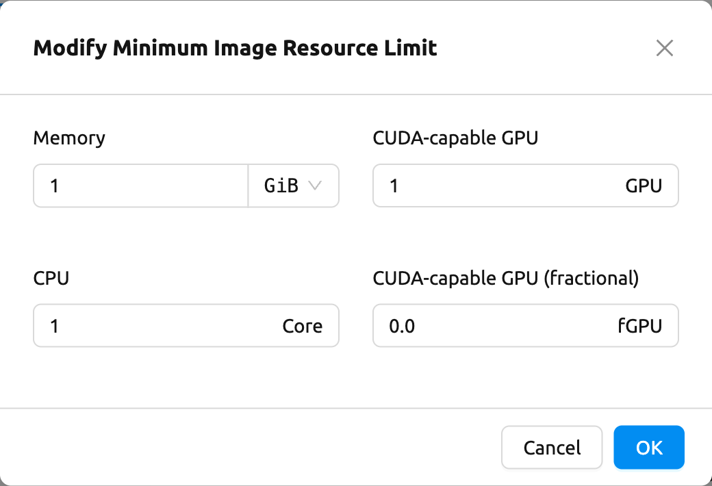

:::note
The minimum resource requirements included in the image metadata are values
that have been tested and determined, so unless you have a clear reason to
change the minimum resource amounts, it is recommended to keep the default values.
:::

Additionally, you can add or modify the supported apps for each image by clicking the `Apps` icon located in the Controls column.
Once you click the icon, the name of the app and its corresponding port number will be displayed accordingly.

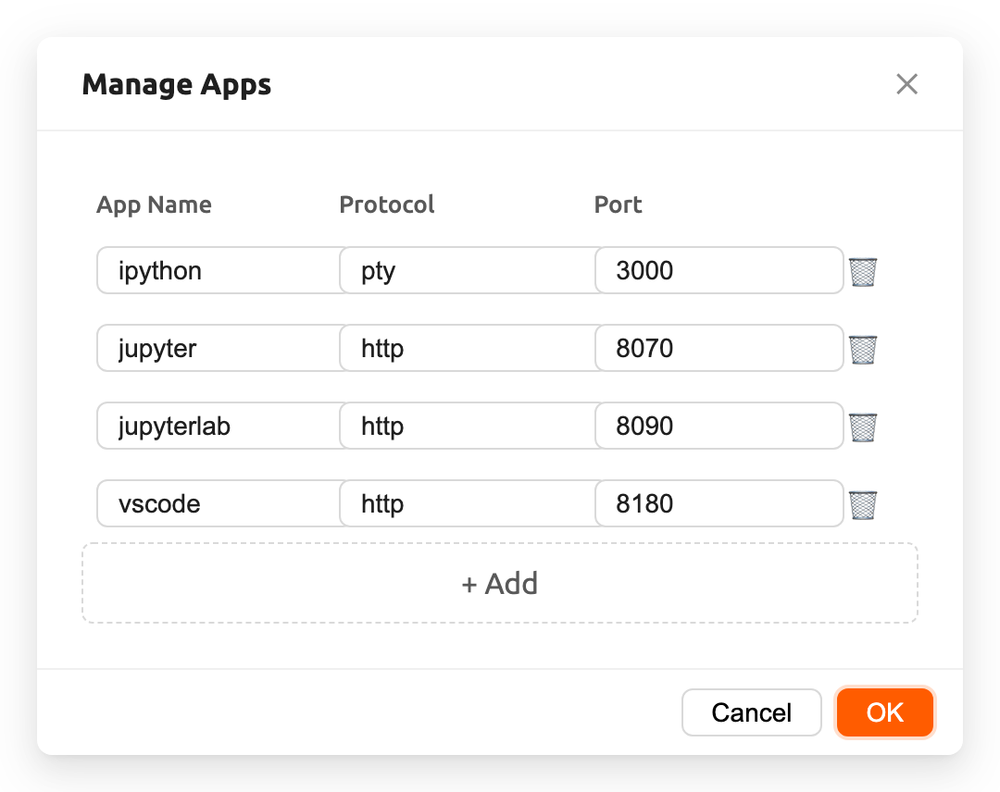

In this interface, you can add supported custom applications by clicking the `+ Add` button below. To delete an application, simply click the `trash can` button on the right side of each row.

:::note

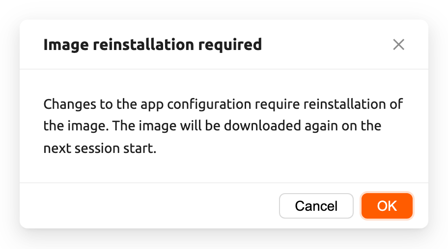
:::

## Manage docker registry

You can click on the Registries tab in Environments page to see the information
of the docker registry that are currently connected. `cr.backend.ai` is
registered by default, and it is a registry provided by Harbor.

:::note
In the offline environment, the default registry is not accessible, so
click the trash icon on the right to delete it.
:::

Click the refresh icon in Controls to update image metadata for Backend.AI from
the connected registry. Image information which does not have labels for
Backend.AI among the images stored in the registry is not updated.

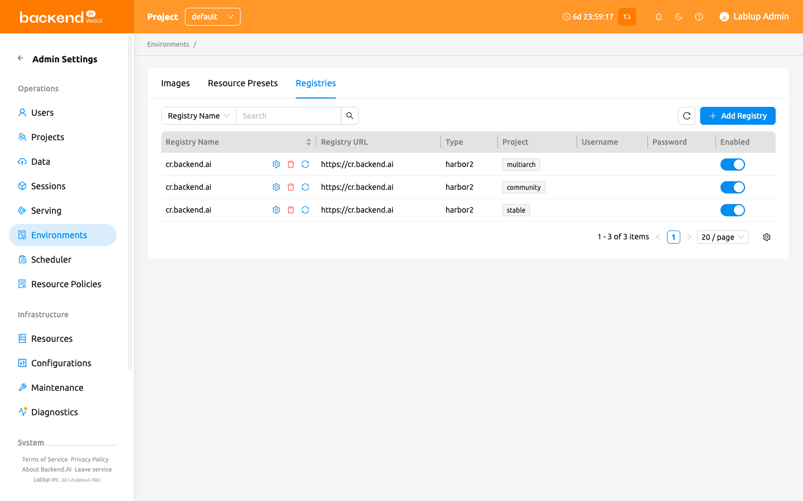

You can add your own private docker registry by clicking the `+ Add Registry`
button. The registry creation dialog contains the following fields:

- **Registry Name**: A unique name for the registry (up to 50 characters). Must match the prefix used in image names stored in the registry.
- **Registry URL**: The URL of the registry. A scheme such as `http://` or `https://` must be explicitly included.
- **Username**: Optional. Fill in if you have separate authentication settings in the registry.
- **Password**: Optional. When editing an existing registry, check the "Change Password" checkbox to modify it.
- **Registry Type**: Select the type of registry. Supported types include: `docker`, `harbor`, `harbor2`, `github`, `gitlab`, `ecr`, and `ecr-public`.
- **Project Name**: The project or namespace in the registry (required). Use the full path including namespace and project name for GitLab registries.
- **Extra Information**: A JSON string for additional configuration needed for each registry type.
- **SSL Verification**: Toggles whether Backend.AI verifies the registry's SSL certificate when connecting. **Enabled by default**, which is the recommended setting for any registry reachable over the public internet. Disable this only for a registry served with a self-signed certificate inside a trusted internal environment where you have already verified the network path; turning it off makes the connection vulnerable to man-in-the-middle attacks.
- **Set as Global Registry**: A toggle that, when enabled, allows access to the registry from all projects.
- **Allowed Projects**: When **Set as Global Registry** is turned off, use this field to select the specific projects that are allowed to use the registry.

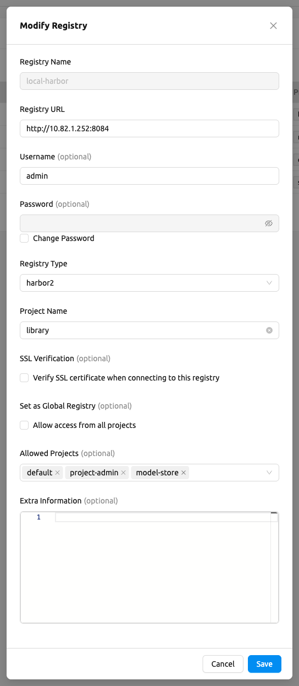
<!-- TODO: Re-capture container_registry_editor_modal.png to show the Set as Global Registry toggle and the Allowed Projects field -->

### GitLab Container Registry Configuration

When adding a GitLab container registry, you must specify the `api_endpoint`
in the Extra Information field. This is required because GitLab uses separate
endpoints for the container registry and the GitLab API.

For **GitLab.com (public instance)**:

- Registry URL: `https://registry.gitlab.com`
- Extra Information: `{"api_endpoint": "https://gitlab.com"}`

For **self-hosted (on-premise) GitLab**:

- Registry URL: Your GitLab registry URL (e.g., `https://registry.example.com`)
- Extra Information: `{"api_endpoint": "https://gitlab.example.com"}`

:::note
The `api_endpoint` should point to your GitLab instance URL, not the registry URL.
:::

Additional configuration notes:

- **Project path format**: When specifying the project, use the full path including
  namespace and project name (e.g., `namespace/project-name`). Both components
  are required for the registry to function correctly.

- **Access token permissions**: The access token used for the registry must have
  both `read_registry` and `read_api` scopes. The `read_api` scope is
  required for Backend.AI to query the GitLab API for image metadata during
  rescan operations.

You can also update the information of an existing registry, except the
Registry Name.

After creating a registry and updating the image metadata, users still cannot
use the images immediately. You must enable the registry by toggling the
Enabled switch in the registry list to allow users to access images from
the registry.

## Manage resource preset

The following predefined resource presets are displayed in the Resource
allocation panel when creating a compute session. Superadmin can manage these
resource presets.

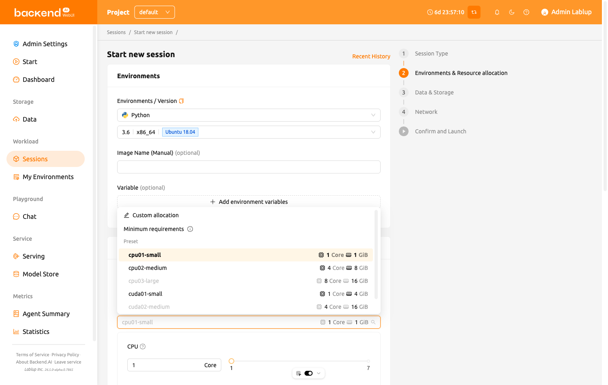

Go to the Resource Presets tab on the Environment page. You can check the list
of currently defined resource presets.

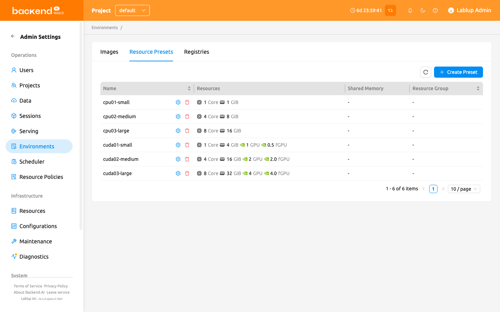

You can set resources such as CPU, RAM, fGPU, etc. to be provided by the
resource preset by clicking the `Setting (Gear)` (cogwheel) in the Name column.
Create or Modify Resource Preset modal shows fields of the resources currently available.
Depending on your server's settings, certain resources may not be visible.
After setting the resources with the desired values, save it and check if the corresponding preset is displayed
when creating a compute session. If available resources are less
than the amount of resources defined in the preset, the corresponding preset
would not be shown.

The resource preset dialog includes:

- **Preset Name**: A unique name for the preset (only alphanumeric characters, periods, hyphens, and underscores allowed).
- **Resource Group**: (Conditional) Associate the preset with a specific resource group.
- **Resource Preset**: Dynamic fields for each available resource type (CPU, Memory, GPU, etc.). Memory fields support dynamic unit input (`MiB`, `GiB`, `TiB`, `PiB`).
- **Shared Memory**: The amount of shared memory allocated for the preset. This value must be less than the **Memory** value.

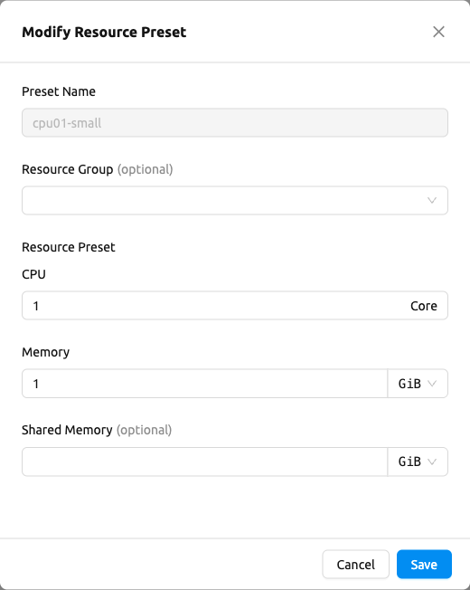

You can also create a resource preset by clicking the `+ Create Presets` button in the
right top of the Resource Presets tab. You cannot create the same resource
preset name that already exists, since it is the key value for distinguishing
each resource preset.

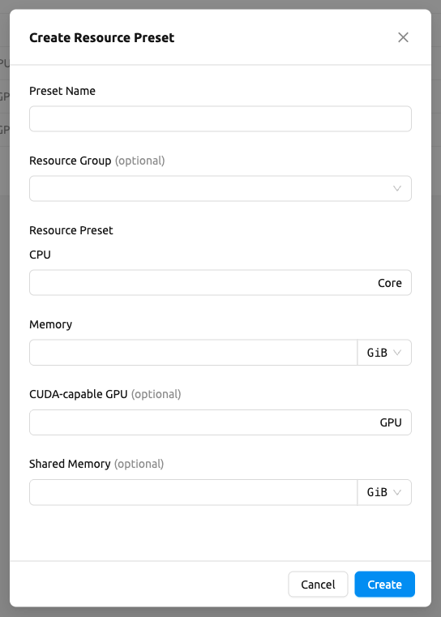
<!-- TODO: Re-capture create_resource_preset_dialog.png — needs update. -->

## Manage agent nodes

Superadmins can view the list of agent nodes, currently connected to
Backend.AI, by visiting the Resources page. You can check agent node's IP,
connecting time, actual resources currently in use, etc. The WebUI does
not provide the function to manipulate agent nodes.

#### Query agent nodes

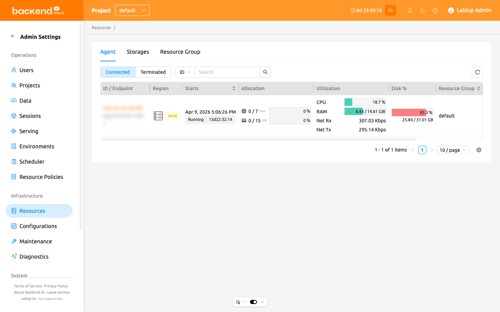

You can also see the exact resource usage for the agent node by clicking
the note icon in the Control panel.

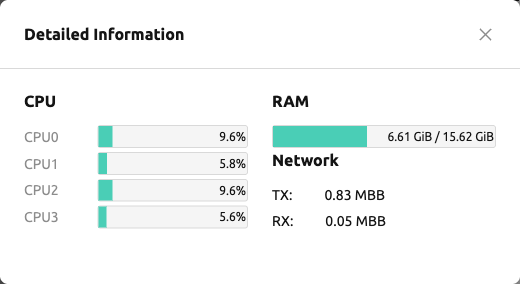

On Terminated tab, you can check the information of the agents that has been
connected once and then terminated or disconnected. It can be used as a
reference for node management. If the list is empty, then it means
that there's no disconnection or termination occurred.

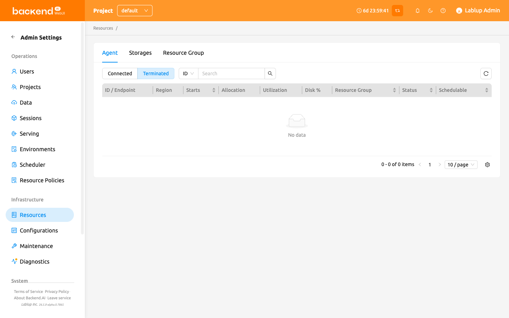

#### Set schedulable status of agent nodes

You may want to prevent new compute sessions from being scheduled to an Agent
service without stopping it. In this case, you can disable the Schedulable
status of the Agent. Then, you can block the creation of a new session while
preserving the existing sessions on the Agent.

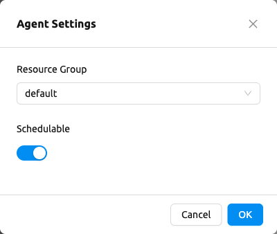

## Manage resource group

Agents can be grouped into units called resource groups. For example,
let's say there are 3 agents with V100 GPUs and 2 agents with P100 GPUs. You
want to expose two types of GPUs to users separately, then you can group three
V100 agents into one resource group, and the remaining two P100 agents into
another resource group.

Adding a specific agent to a specific resource group is not currently handled in
the WebUI, and it can be done by editing agent config file from the installation
location and restart the agent daemon. Management of the resource groups is
possible in Resource Group tab of the Resource page.

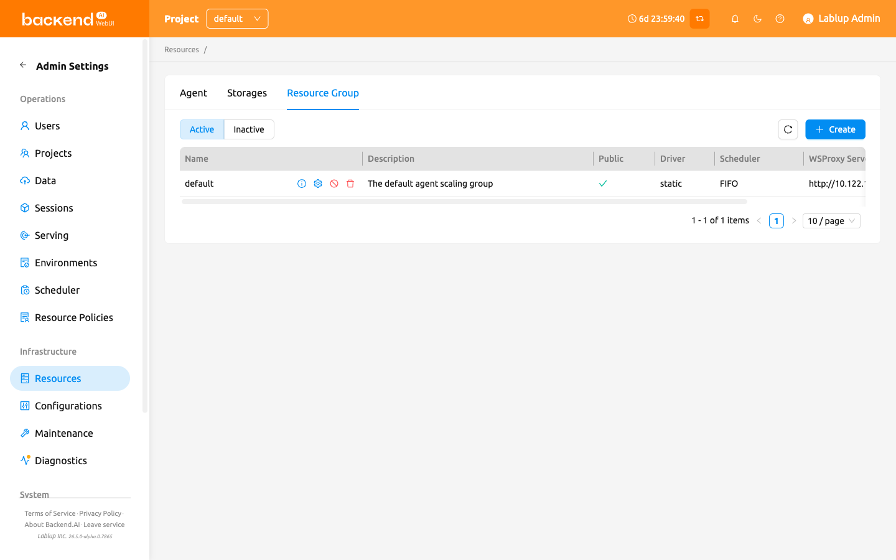

You can edit a resource group by clicking the `Setting (Gear)` in the Control
panel. In the Select scheduler field, you can choose the scheduling method for
creating a compute session. Currently, there are four types: `FIFO`, `LIFO`,
`DRF`, and `FAIR_SHARE`. `FIFO` and `LIFO` are scheduling methods creating the first- or the
last-enqueued compute session in the job queue. `DRF` stands for Dominant Resource
Fairness, and it aims to provide resources as fair as possible for each user.
`FAIR_SHARE` allocates compute resources based on historical usage patterns. For
more details, refer to the [Fair Share Scheduler](#fair-share-scheduler) section.
You can deactivate a resource policy by turning off Active Status.

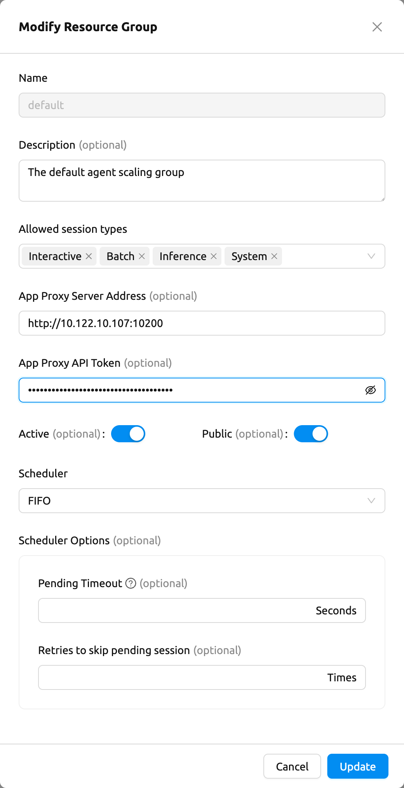

The resource group edit dialog contains the following additional fields:

- **Allowed session types**: Since users can choose the type of session, the resource group can allow certain types. You should allow at least one session type. The allowed session types are Interactive, Batch, Inference, and System.
- **App Proxy Server Address**: Sets the App Proxy address for the resource group's Agents to use. If you set a URL in this field, App Proxy will relay the traffic of an app like Jupyter directly to the compute session via Agent bypassing Manager.
- **App Proxy API Token**: The API token for authenticating with the App Proxy server.
- **Active**: Toggle the active status of the resource group.
- **Public**: When enabled, the resource group is visible to all users.
- **Pending timeout**:
  A compute session will be canceled if it stays `PENDING` status for longer
  than the Pending timeout. When you wish to prevent a session from remaining
  PENDING indefinitely, set this time. Set this value to zero (0) if you do not
  want to apply the pending timeout feature.
- **Retries to skip pending session**:
  The number of retries the scheduler tries before skipping a PENDING session.
  It can be configured to prevent the situation where one PENDING session blocks
  the scheduling of the subsequent sessions indefinitely (Head-of-line blocking,
  HOL). If no value is specified, the global value in Etcd will be used (`num
retries to skip`, default three times).

You can create a new resource policy by clicking the `+ Create` button.
Likewise other creating options, you cannot create a resource policy with the name
that already exists, since name is the key value.

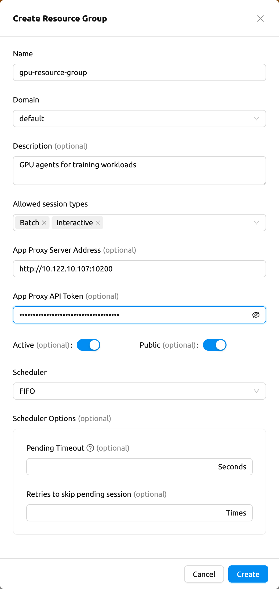

## Storages

On STORAGES tab, you can see what kind of mount volumes (usually NFS) exist.
Backend.AI provides per-user/per-project quota setting on storage that supports quota management.
By using this feature, admin can easily manage and monitor the exact amount of storage usage for each user and project based folder.

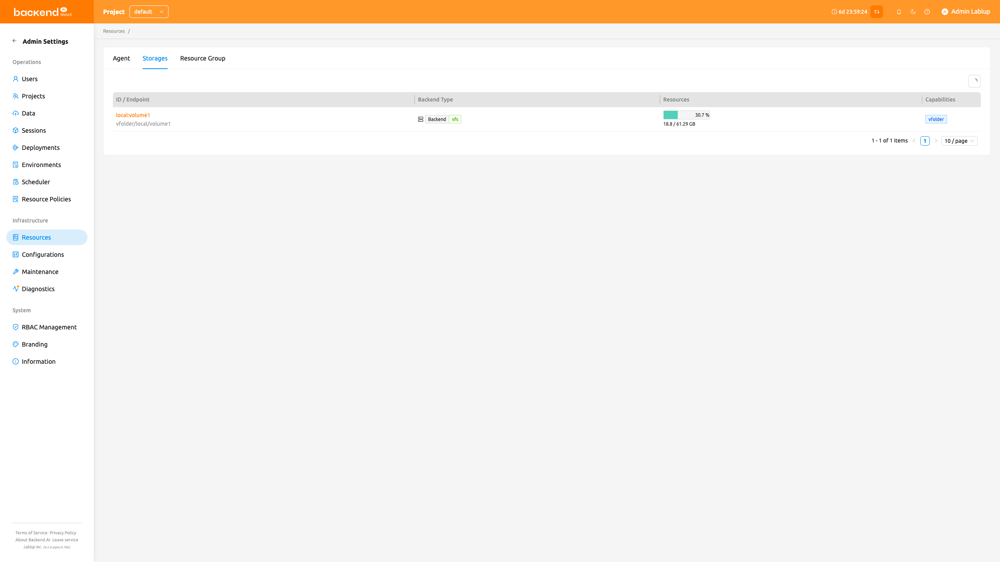
<!-- TODO: Re-capture storage_list.png — needs update (name-click opens the Storage Host Detail Drawer). -->

To manage a storage host, click the storage host name in the Storages list. This opens the **Storage Host
Detail Drawer**, where capacity (quota) and folder permissions are configured.

#### Storage Host Detail Drawer

The Storage Host Detail Drawer is the single place to inspect and manage a
storage host. You can open it by clicking the host name in the Storages list. The
top displays basic information about the host, while the bottom provides tabs for
configuring folder permissions and capacity (quota).

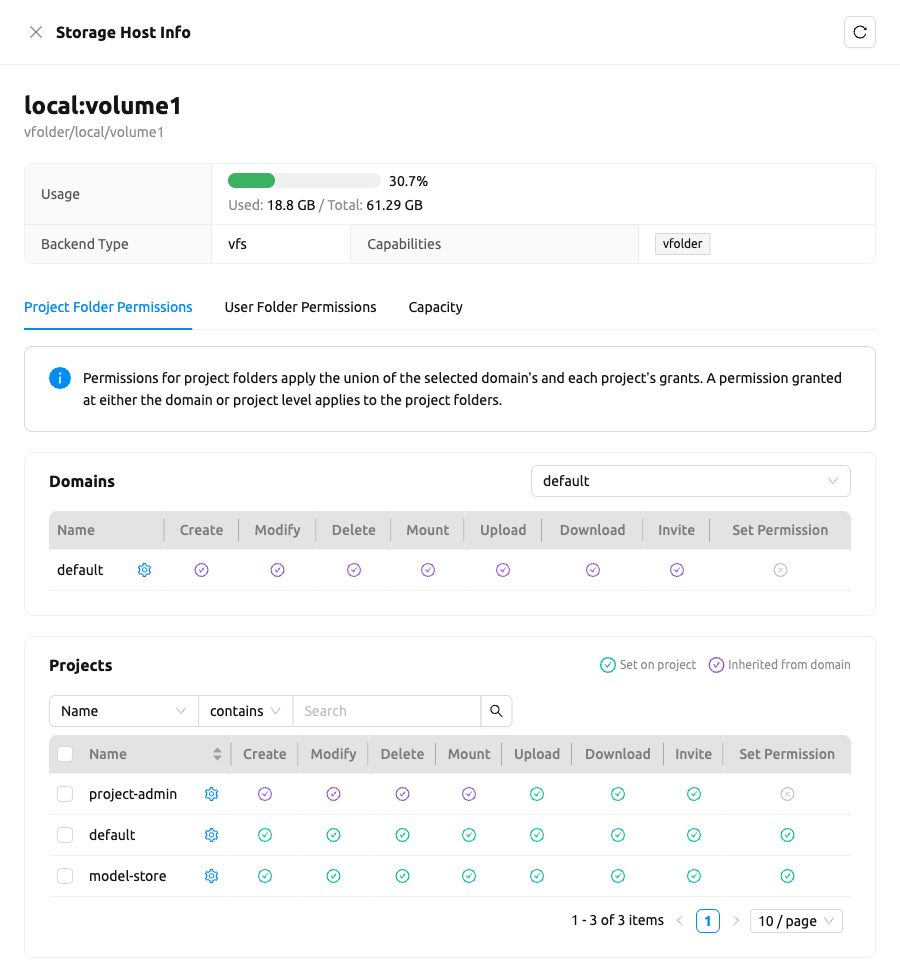
<!-- TODO: Capture screenshot of storage_host_detail_drawer.png — Storage Host detail drawer showing the tab strip (Project Folder Permissions / User Folder Permissions / Capacity) -->

The drawer contains the following tabs:

- **Project Folder Permissions**: View and manage which domains and projects can
  access the host's project folders. See the [Project Folder Permissions](#project-folder-permission) section below.
- **User Folder Permissions**: View and manage the permissions that apply to user
  folders on the host. User folder permissions are determined by the keypair
  resource policy linked to a user's main access key.
- **Capacity**: Configure per-user and per-project storage quotas, and view the
  host's usage and capabilities. This tab is unavailable for storage hosts that do not support quota configuration.

#### Project Folder Permissions

The **Project Folder Permissions** tab of the [Storage Host Detail Drawer](#storage-host-detail-drawer) lets administrators view and manage the permissions of the project folders created on the selected storage host.

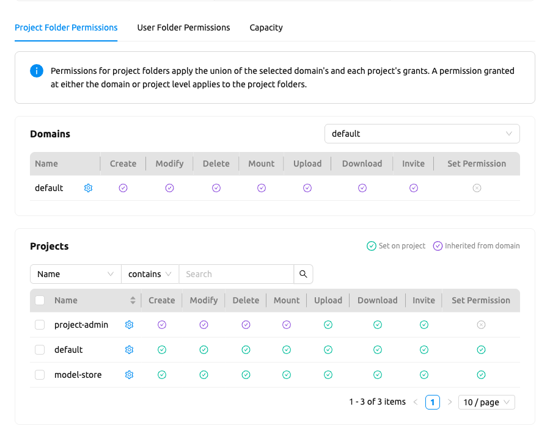
<!-- TODO: Capture screenshot of project_folder_permission_tab.png — Project Folder Permissions tab with the domain selector and the tri-state effective-permission indicators -->

Project folder permissions consist of permissions for the selected domain and permissions for the projects under that domain.

In the Backend.AI structure, a project belongs under a specific domain. Therefore, the storage permissions set on a project inherit the domain's permissions by default.

You can select multiple rows (using the row checkboxes) in the Domains, Projects, or User Folder Permissions tables to compare their permission sets side by side. With rows selected, click **Edit Permissions** to open the bulk edit modal, which applies the chosen permission set to all selected entities at once. The modal opens with all permissions selected by default, and saving overwrites the selected entities' permissions with exactly the set you choose.

#### User Folder Permissions

User folder permissions are the permissions configured in the keypair resource policy. When you select a user with the user selector on the right, only the keypair resource policies assigned to that user's keypairs are filtered and shown. The **Assigned Keypairs** column shows the user's main access key.

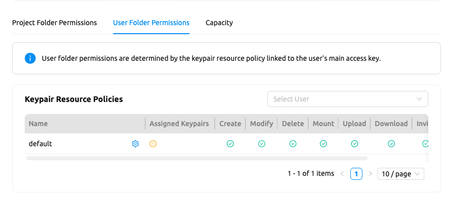
<!-- TODO: Capture screenshot of user_folder_permission_tab.png — User Folder Permissions tab with the user selector and the Assigned Keypair column. -->

#### Quota Settings

Please remind that quota setting is only available in storage that provides quota setting
(e.g. XFS, CephFS, NetApp, Purestorage, etc.). Although you can see the usage of storage
in the Capacity tab regardless of storage, you cannot configure the quota which doesn't
support quota configuration internally.

#### Set User Quota

In Backend.AI, there are two types of vfolders created by user and admin(project). In this section,
we would like to show how to check current quota setting per-user and how to configure it.
First, on the Capacity tab, make sure the active sub-tab of the Quota Settings panel is `For User`. Then, select user you desire to
check and edit the quota. You can see the quota id that corresponds to user's id and the configuration already set
in the table, if you already set the quota.

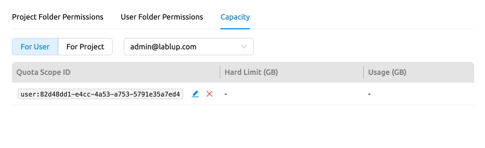
<!-- TODO: Re-capture per_user_quota.png — needs update. -->

Click the Edit button in the Quota Scope ID column to open the modal for configuring the quota.

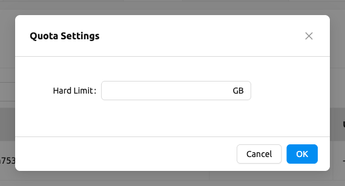
<!-- TODO: Re-capture quota_settings_panel.png — needs update. -->

#### Set Project Quota

Setting a quota on project-folder is similar to setting a user quota. The difference between setting
project quota and user quota is to confirm setting the project quota requires one more procedure,
which is selecting the domain that the project is dependent on. The rest are the same.
As in the picture below, you need to first select the domain, and then select the project.

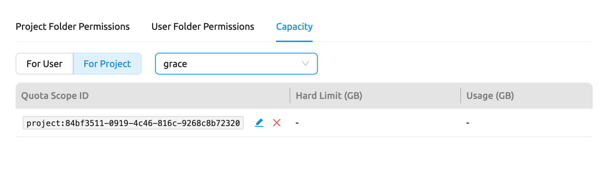
<!-- TODO: Re-capture per_project_quota.png — needs update. -->

#### Unset Quota

We also provides the feature to unset the quota. Please remind that after removing the quota setting, quota will automatically follows
user or project default quota, which cannot be set in WebUI. If you want to change the default quota setting, you may need to access to admin-only page.
By Clicking `Unset` button in the Quota Scope ID column, the small snackbar message will show up and confirm whether you really want to delete the current quota setting.
If you click `OK` button in the snackbar message, then it will delete the quota setting and automatically reset the quota follows to corresponding quota,
which depends on the quota type(user / project).

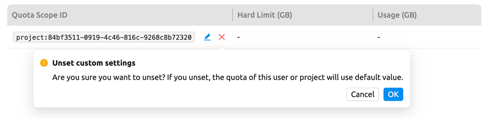
<!-- TODO: Re-capture unset_quota.png — needs update. -->

:::note
If there's no config per user/project, then corresponding values in the user/project resource policy will be set as
a default value. For example, If no hard limit value for quota is set, `max_vfolder_size` value in the resource policy
is used as the default value.
:::

## System settings

In the Configurations page, you can see main settings of Backend.AI server.
Currently, it provides several controls which can change and list settings.

You can change image auto install and update rule by selecting one option from
`Digest`, `Tag`, `None`. `Digest` is kind of checksum for the image which
verifies integrity of the image and also enhances efficiency in downloading images
by reusing duplicated layers. `Tag` is only for developing option since it does not
guarantee the Integrity of the image.

:::note
Don't change rule selection unless you completely understand the meaning of each rule.
:::

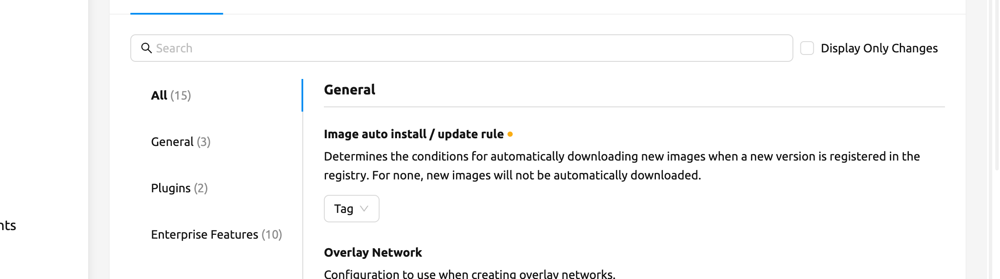

The Configurations page also displays the status of plugins and enterprise features:

**Plugins:**

- **Open Source CUDA GPU support**: Status of CUDA GPU support.
- **ROCm GPU support**: Status of ROCm GPU support.

**Enterprise Features:**

- **Fractional GPU**: Fractional GPU (fGPU) virtualization for sharing GPUs across sessions.

Backend.AI supports a wide range of AI accelerators across multiple vendors:

- **NVIDIA**
  - Spark (GB10)
  - Blackwell (B300, B200, RTX Pro 6000, etc.)
  - Hopper (H200, H100 NVL, etc.)
  - Grace Superchip (GB300, GB200, GH200, etc.)
  - Turing (Titan RTX, RTX 8000, T4)
  - Ampere (A100, A40, A10, etc.)
  - Ada Lovelace (L40S, L4)
  - Jetson (TX, Xavier, Orin, Thor, etc.)
- **Intel**
  - Gaudi 3
  - Gaudi 2
  - Gaudi 1
  - Arc
- **AMD**
  - Instinct MI Series (including MI300X)
  - MI300A
  - MI250
- **Rebellions**
  - ATOM Max
  - ATOM+
  - REBEL
- **FuriosaAI**
  - RNGD
- **Tenstorrent**
  - Wormhole n150s
  - Wormhole n300s
- **Google**
  - TPU v7 (Ironwood)
  - Coral TPU v5p
  - Coral TPU v5e
  - TPU v4
- **Graphcore**
  - C600 IPU
  - Bow IPU
- **HyperAccel**
  - LPU
- **Groq**
  - LPU
- **Cerebras**
  - WSE-3
- **SambaNova**
  - SN40L

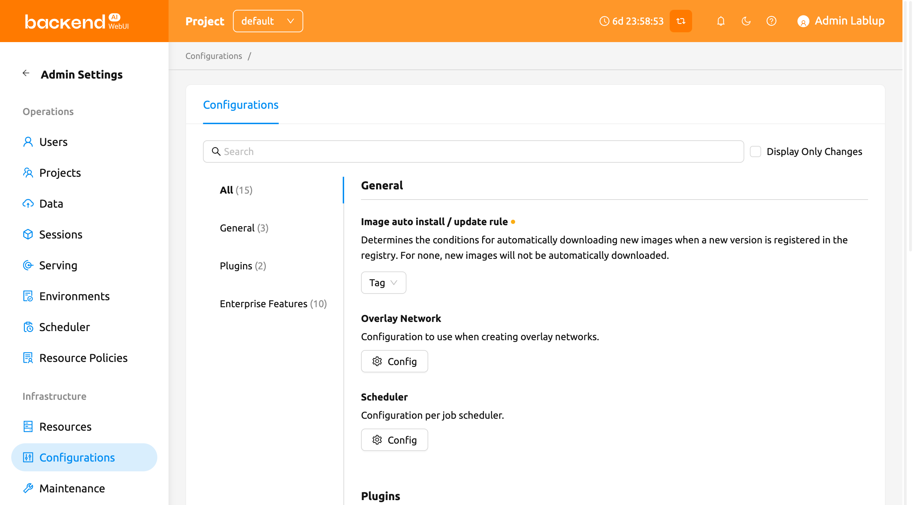

When a user launches a multi-node cluster session, Backend.AI will dynamically create an overlay network to support
private inter-node communication. Admins can set the value of the Maximum
Transmission Unit (MTU) for the overlay network, if it is certain that the value
will enhance the network speed.

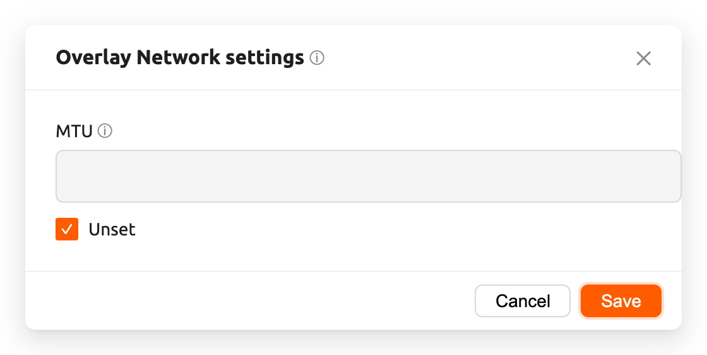

:::note
For more information about Backend.AI Cluster session, please refer to
[Backend.AI Cluster Compute Session](#backendai-cluster-compute-session) section.
:::

You can edit the configuration per job scheduler by clicking the Scheduler's config button.
The values in the scheduler setting are the defaults to use when there is no scheduler
setting in each [resource group](#scheduling-methods). If there is a resource
group-specific setting, this value will be ignored.

Currently supported scheduling methods include `FIFO`, `LIFO`, and `DRF`.
Each method of scheduling is exactly the same as the [scheduling methods](#scheduling-methods) above.
Scheduler options include session creation retries. Session creation retries refers to the number
of retries to create a session if it fails. If the session cannot be created within the trials,
the request will be ignored and Backend.AI will process the next request. Currently, changes are
only possible when the scheduler is FIFO.

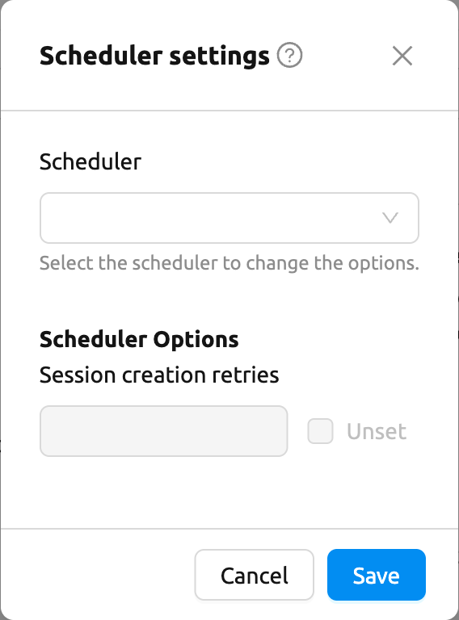

:::note
We will continue to add broader range of setting controls.
:::

:::note
System settings are default settings. If resource group has certain value,
then it overrides configured value in system settings.
:::

## Server management

Go to the Maintenance page and you will see some buttons to manage the server.

- RECALCULATE USAGE: Occasionally, due to unstable network connections or
  container management problem of Docker daemon, there may be a case where the
  resource occupied by Backend.AI does not match the resource actually used by
  the container. In this case, click the RECALCULATE USAGE button to manually
  correct the resource occupancy.
- RESCAN IMAGES: Update image meta information from all registered Docker
  registries. It can be used when a new image is pushed to a
  Backend.AI-connected docker registry.

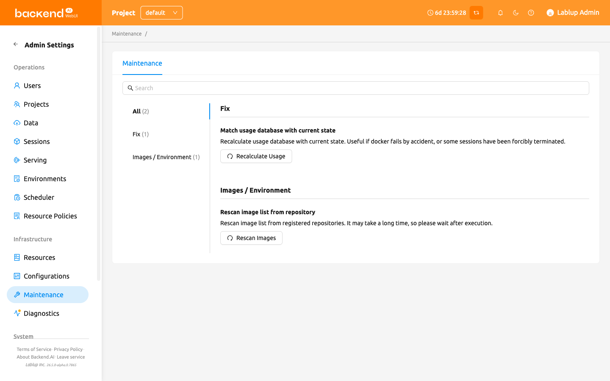

:::note
We will continue to add other settings needed for management, such as
removing unused images or registering periodic maintenance schedules.
:::

## Detailed Information

In Information page, you can see several detailed information and status of each feature.
To see Manager version and API version, check the Core panel. To see whether each component
for Backend.AI is compatible or not, check the Component panel.

:::note
This page is only for showing current information.
:::

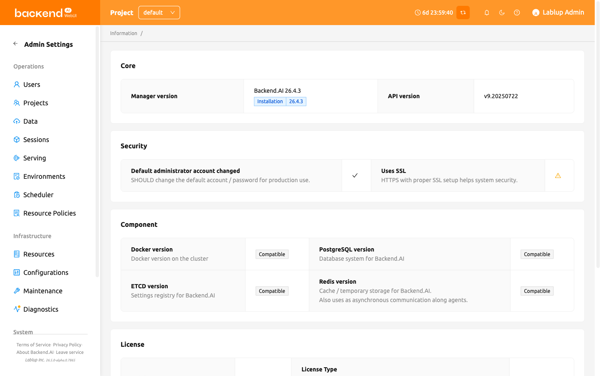

## RBAC Management

RBAC (Role-Based Access Control) Management allows superadmins to define roles with fine-grained permissions and assign them to users. You can control which actions specific users are allowed to perform on various resources throughout the Backend.AI system.

For detailed information about managing roles, permissions, and user assignments, refer to the dedicated [RBAC Management](#rbac-management) page.

## Diagnostics

Superadmins can open the **Diagnostics** page from the admin sidebar to run a set of automated health checks on the WebUI deployment. The page evaluates the browser-to-server configuration and reports any misconfiguration, so that connectivity or security problems can be identified before they affect users.

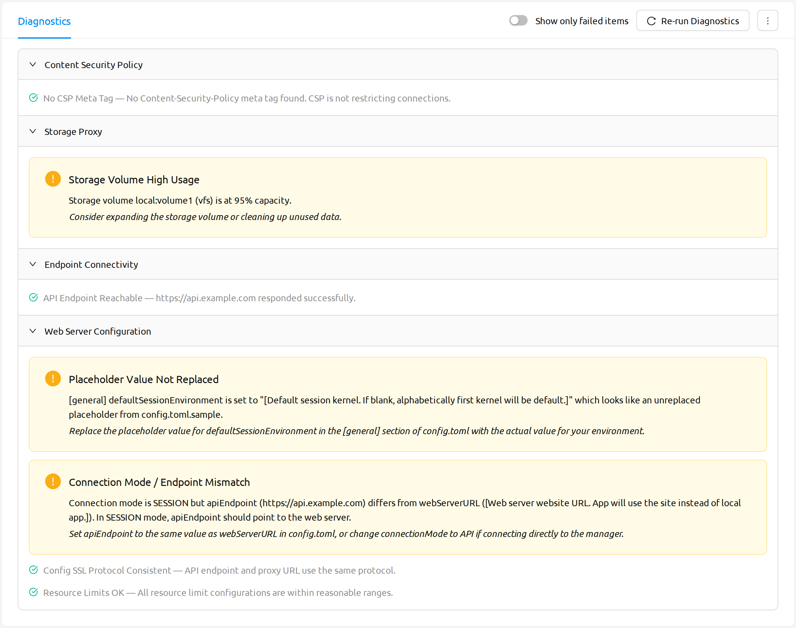

The toolbar at the top of the page provides the following controls:

- **Show only failed items**: A toggle that hides every passing check so that only the sections containing warnings or errors remain visible.
- `Re-run Diagnostics`: Re-evaluates every check and refreshes the results.
- `Export CSV`: Available from the actions dropdown menu, this exports all diagnostic results to a CSV file named `diagnostics-YYYY-MM-DD.csv`.

The diagnostics are organized into the following collapsible sections, each showing the result of its individual checks with a pass, warning, or critical severity:

- **Content Security Policy**: Verifies the Content Security Policy headers (such as `connect-src`, `frame-src`, `script-src`, and `style-src`) so that the application can reach the resources it needs.
- **Storage Proxy**: Checks the storage volume list together with the storage proxy's reachability and usage metrics.
- **Endpoint Connectivity**: Validates that the API endpoint is reachable and that a connection can be established.
- **Web Server Configuration**: Validates the `config.toml` settings, including URL formatting, SSL/protocol consistency, and connection mode.

:::tip
When troubleshooting a connection problem, enable **Show only failed items** and click `Re-run Diagnostics` first — it surfaces just the checks that need attention.
:::

## Branding

The **Branding** page lets superadmins customize the visual identity of the WebUI — colors, logos, and fonts — to match an organization's corporate identity. It is available from the admin sidebar.

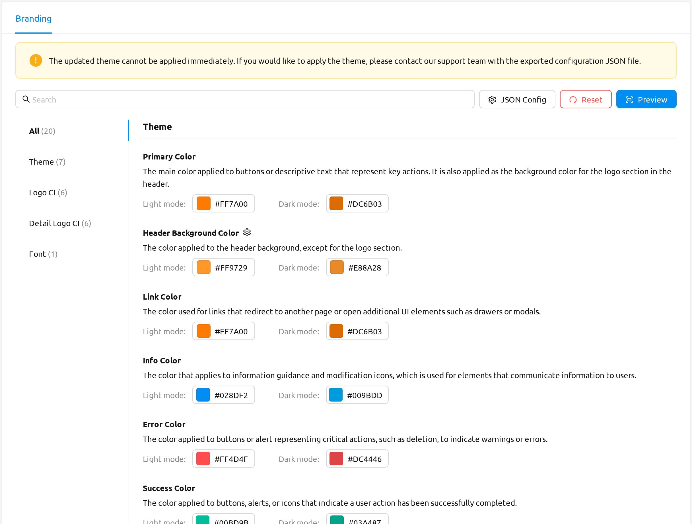

:::warning
The updated theme cannot be applied immediately from this page. To apply a customized theme, export the configuration as a JSON file and provide it to the support team.
:::

The toolbar provides:

- `Preview`: Opens a new window that previews the current theme changes.
- `JSON Config`: Opens a modal where the theme configuration can be edited directly as JSON and exported.
- A reset control that restores all branding settings to their defaults.
- A search bar to filter the settings.

The settings are divided into the following groups:

- **Theme**: Color pickers for the primary, header background, link, info, error, success, and text colors. Each color can be set independently for light and dark mode and reset individually.
- **Logo CI**: Upload the main sidebar logo for light and dark mode, along with the collapsed-sidebar logo, and configure their display sizes.
- **Detail Logo CI**: Upload the logos shown on the login page and in the About modal, for both light and dark mode, with configurable sizes.
- **Font**: Select the font family used throughout the interface.

:::note
After uploading an image or changing a color, use `Preview` to see the result. Because the changes are not applied to the live service automatically, export the JSON configuration and contact support to roll it out.
:::
