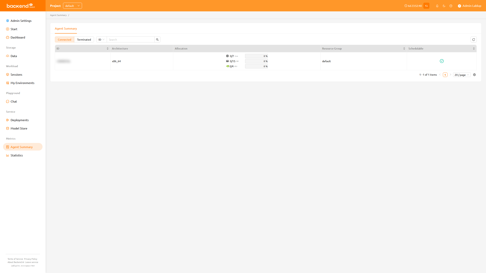

# Agent Summary

The Agent Summary page gives you a read-only overview of the compute **agents** (agent nodes) available to your project and how their resources are currently allocated. Use it to check how much CPU, memory, and accelerator capacity remains before you create a compute session.

:::note
Depending on the server configuration, the Agent Summary feature may not be available. In that case, please contact the administrator of your system.
:::

## Columns

The agent list displays the following columns:

- **ID**: The unique identifier of the agent.
- **Architecture**: The CPU architecture of the agent (for example, `x86_64`).
- **Allocation**: The occupied and available capacity for each resource slot on the agent, shown with a utilization progress bar.
   * CPU is shown as the number of cores, memory in GiB, and any accelerators (such as GPU or fGPU) present on the agent are listed as additional slots.
   * The progress bar turns red when utilization exceeds 80%.
- **Resource Group**: The resource group the agent belongs to.
- **Schedulable**: Whether the agent can accept new sessions. A check icon indicates the agent is schedulable, while a dimmed minus icon indicates it is not.

:::note
Agents that belong to SFTP-dedicated resource groups are automatically excluded from this list, so storage-only agents do not appear here.
:::
