# Appendix

<a id="gpu-virtualization-and-fractional-gpu-allocation"></a>

## GPU virtualization and fractional GPU allocation

Backend.AI supports GPU virtualization technology which allows single physical
GPU can be divided and shared by multiple users simultaneously. Therefore, if
you want to execute a task that does not require much GPU computation
capability, you can create a compute session by allocating a portion of the GPU.
The amount of GPU resources that 1 fGPU actually allocates may vary from system
to system depending on administrator settings. For example, if the administrator
has set one physical GPU to be divided into five pieces, 5 fGPU means 1 physical
GPU, or 1 fGPU means 0.2 physical GPU. If you set 1 fGPU when creating a compute
session, the session can utilize the streaming multiprocessor (SM) and GPU
memory equivalent to 0.2 physical GPU.

In this section, we will create a compute session by allocating a portion of
the GPU and then check whether the GPU recognized inside the compute
container really corresponds to the partial physics GPU.

First, let's check the type of physical GPU installed in the
host node and the amount of memory. The GPU node used in this guide is equipped
with a GPU with 8 GB of memory as in the following figure. And through the
administrator settings, 1 fGPU is set to an amount equivalent to 0.5 physical
GPU (or 1 physical GPU is 2 fGPU).


Now let's go to the Sessions page and create a compute session by allocating 0.5
fGPU as follows:

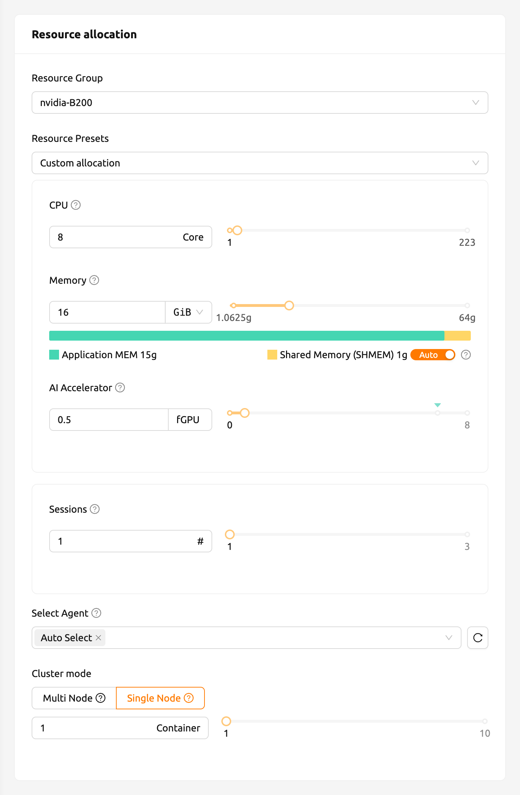

In the AI Accelerator panel of the session list, you can see that
0.5 fGPU is allocated.

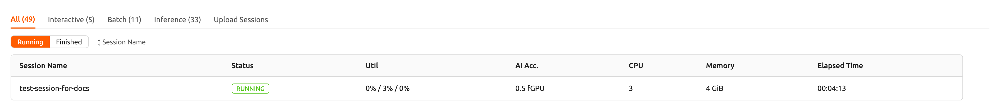

Now, let's connect directly to the container and check if the allocated GPU
memory is really equivalent to 0.5 units (~2 GB). Let's bring up a web
terminal. When the terminal comes up, run the `nvidia-smi` command. As you can
see in the following figure, you can see that about 2 GB of GPU memory is
allocated. This shows that the physical GPU is actually divided into quarters and allocated inside the
container for this compute session, which is not possible by a way like PCI passthrough.


Let's open up a Jupyter Notebook and run a simple ML training code.


While training is in progress, connect to the shell of the GPU host node and
execute the `nvidia-smi` command. You can see that there is one GPU attached
to the process and this process is occupying about 25% of the resources of the
physical GPU. (GPU occupancy can vary greatly depending on training code and GPU
model.)


Alternatively, you can run the `nvidia-smi` command from the web terminal to query the GPU usage history inside the container.


<a id="automated-job-scheduling"></a>

## Automated job scheduling

Backend.AI server has a built-in self-developed task scheduler. It automatically
checks the available resources of all worker nodes and delegates the request to
create a compute session to the worker that meets the user's resource request.
In addition, when resources are insufficient, the user's request to create a
compute session is registered as a PENDING state in the job queue. Later, when
the resources become available again, the pended request is resumed to
create a compute session.

You can check the operation of the job scheduler in a simple way from the
user Web-UI. When the GPU host can allocate up to 2 fGPUs,
let's create 3 compute sessions at the same time requesting
allocation of 1 fGPU, respectively. In the **Custom allocation** section of the
session launch dialog, set the GPU amount to 1, and set the **Number of sessions**
control to 3. If you specify a value greater than 1 in **Number of sessions** and
click the **LAUNCH** button, that many sessions will be requested at the same
time. (**Number of sessions** is distinct from **Cluster Size**, which controls
how many nodes make up a single multi-node session.) This is the situation that
3 sessions requesting a total of 3 fGPUs are created when only 2 fGPUs exist.

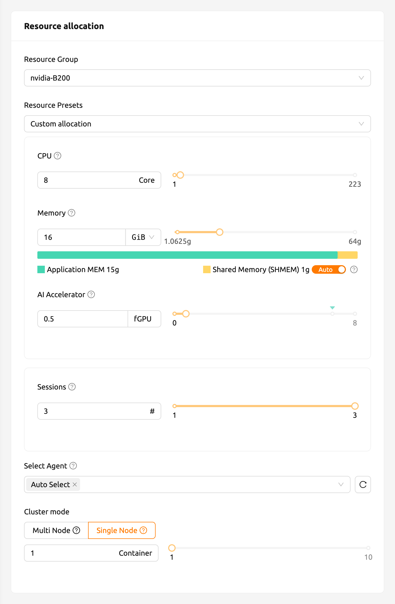
<!-- TODO: Verify/re-capture screenshot of session_launch_dialog_2_sessions.png — Custom allocation now uses the "Number of sessions" control (FR-2867 reworked the Resource Allocation UX) -->


Wait for a while and you will see three compute sessions being listed.
If you look closely at the Status panel, you can see that two of the
three compute sessions are in RUNNING state, but the other compute session
remains in PENDING state. This PENDING session is only registered in the
job queue and has not actually been allocated a container due to insufficient
GPU resources.

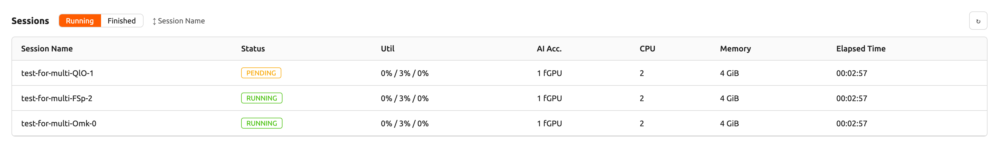

Now let's destroy one of the two sessions in RUNNING state. Then you can see
that the compute session in PENDING state is allocated resources
by the job scheduler and converted to RUNNING state soon. In this way, the job
scheduler utilizes the job queue to hold the user's compute session requests
and automatically process the requests when resources become available.

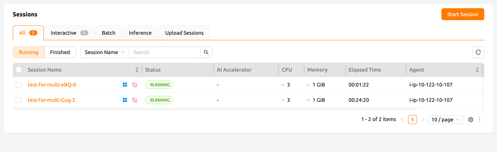


<a id="multi-version-machine-learning-container-support"></a>

## Multi-version machine learning container support

Backend.AI provides variaous pre-built ML and HPC kernel images. Therefore,
users can immediately utilize major libraries and packages without having to
install packages by themselves. Here, we'll walk through an example that takes
advantage of multiple versions of the multiple ML library immediately.

Go to the Sessions page and open the session launch dialog. There may be various
kernel images depending on the installation settings. The exact frameworks and
versions available depend on what your administrator has registered, so the list
in your environment may differ from the screenshot below.

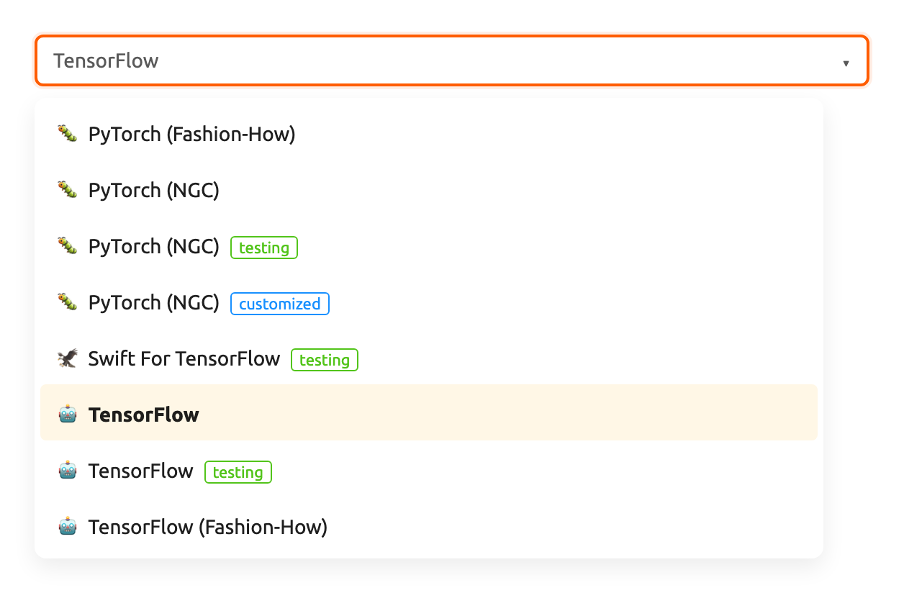
<!-- TODO: Verify/re-capture screenshot of various_kernel_images.png — environment list and launcher layout may have changed -->

Here, let's select a specific TensorFlow version and create a session.

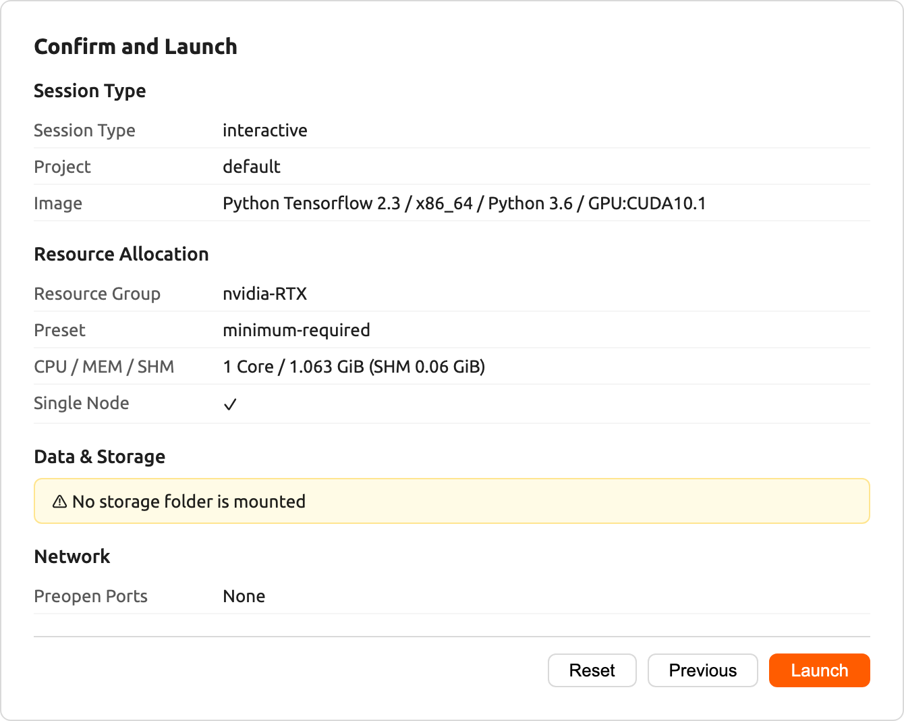

Open the web terminal of the created session and run the following Python
command. You can see that the selected TensorFlow version is installed.

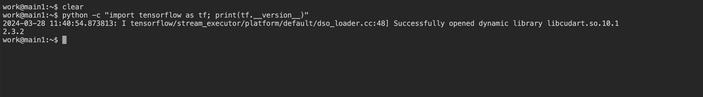

This time, let's select a different TensorFlow version to create a compute
session. If resources are insufficient, delete the previous session.

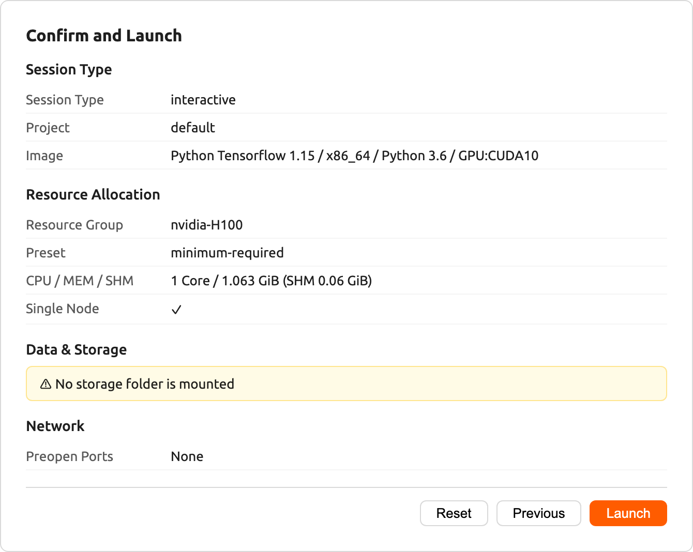

Open the web terminal of the created session and run the same Python command as
before. You can see that the other TensorFlow version is installed.


Finally, create a compute session using a PyTorch image.

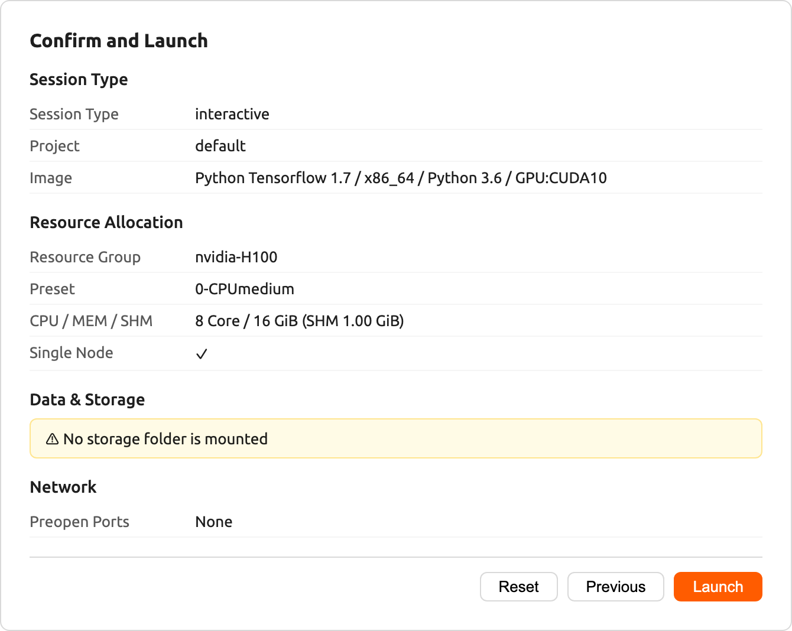

Open the web terminal of the created session and run the following Python
command. You can see that the selected PyTorch version is installed.


Like this, you can utilize various versions of major libraries such as
TensorFlow and PyTorch through Backend.AI without unnecessary effort to install them.


<a id="convert-a-compute-session-to-a-new-private-docker-image"></a>

## Convert a compute session to a new private Docker image

If you want to convert a running compute session (container) to a new Docker image
that you can reuse later to create new compute sessions, Backend.AI provides a
self-service "Convert Session to Image" feature. You can commit a running session
directly from the WebUI, without asking an administrator, and the resulting image
becomes a private customized image visible only to you.

- First, prepare your compute session by installing the packages that you need
  and adjust the configurations as you like.

:::note
If you want to install OS packages, for example via `apt` command, it
usually requires the `sudo` privilege. Depending on the security policy
of the institute, you may not be allowed to use `sudo` inside a
container.

It is recommended to use [automount folder](#using-automount-folder) to
install [Python packages via pip](#install_pip_pkg). However, if you
want to add Python packages in a new image, you should install them with
`sudo pip install <package-name>` to save them not in your home but in
the system directory. The contents in your home directory, usually
`/home/work`, are not saved in converting a compute session to a new
Docker image.
:::

- When your compute session is prepared, open the session detail panel and choose
  **Push session to customized image** (the **Commit Session** action). Enter a
  name for the image and confirm. For the full step-by-step procedure, see the
  [Save session commit](#save-session-commit) section.
- The committed image is created as a private customized image. You can find and
  manage it from the [My Environments](#my-environments) page, and select it from
  the environment list the next time you launch a session.

:::note
The "Convert Session to Image" feature is available from version 24.03 and only
when the session is in `INTERACTIVE` mode. It must be enabled in your deployment
(`enableContainerCommit`); if you do not see the **Push session to customized
image** action, container commit is disabled in your installation. In that case,
ask an administrator to convert your session to a new image instead — provide the
session name or ID and your email address, and the administrator will send you the
full image name and tag. You can then enter that image name manually in the
session launch dialog. The image is private and is not revealed to other users.

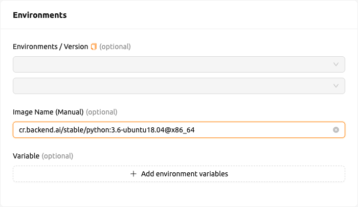
:::


<a id="backend-ai-server-installation-guide"></a>

## Backend.AI Server Installation Guide

For Backend.AI Server daemons/services, following hardware specification should be met. For
optimal performance, just double the amount of each resources.

- Manager: 2 cores, 4 GiB memory
- Agent: 4 cores, 32 GiB memory, NVIDIA GPU (for GPU workload), > 512 GiB SSD
- Webserver: 2 cores, 4 GiB memory
- App Proxy: 2 cores, 4 GiB memory
- PostgreSQL DB: 2 cores, 4 GiB memory
- Redis: 1 core, 2 GiB memory
- Etcd: 1 core, 2 GiB memory

The essential host dependent packages that must be pre-installed before installing
each service are:

<!-- TODO(needs-backend): confirm current host-dependency version minimums and NVIDIA Container Toolkit naming with the server team (FR-3194) -->

- Web-UI: Operating system that can run the latest browsers (Windows, Mac
  OS, Ubuntu, etc.)
- Manager: Python (≥3.8), pyenv/pyenv-virtualenv (≥1.2)
- Agent: docker (≥19.03), CUDA/CUDA Toolkit (≥8, 11 recommend),
  nvidia-docker v2, Python (≥3.8), pyenv/pyenv-virtualenv (≥1.2)
- Webserver: Python (≥3.8), pyenv/pyenv-virtualenv (≥1.2)
- App Proxy: docker (≥19.03), docker-compose (≥1.24)
- PostgreSQL DB: docker (≥19.03), docker-compose (≥1.24)
- Redis: docker (≥19.03), docker-compose (≥1.24)
- Etcd: docker (≥19.03), docker-compose (≥1.24)

For Enterprise version, Backend.AI server daemons are installed by Lablup support team and following materials/services are provided after initial installation:

- DVD 1 (includes Backend.AI packages)
- User GUI Guide manual
- Admin GUI Guide manual
- Installation report
- First-time user/admin on-site tutorial (3-5 hours)

Product maintenance and support information: the commercial contract includes a
monthly/annual subscription fee for the Enterprise version by default. Initial
user/administrator training (1-2 times) and wired/wireless customer support
services are provided for about 2 weeks after initial installation, minor
release updater support and customer support services through online channels
are provided for 3-6 months. Maintenance and support services provided
afterwards may have different details depending on the terms of the contract.


<a id="integration-examples"></a>

## Integration examples

In this section, we would like to introduce several common examples of applications,
toolkits, and machine learning tools that can be utilized on the Backend.AI platform.
Here, we will provide explanations of the basic usage of each tool and how to set them
up in the Backend.AI environment, along with simple examples. We hope this will help
you choose and utilize the tools you need for your projects.

Please note that the content covered in this guide is based on specific versions
of the programs, so the usage may vary in future updates. Therefore, please use this
document for reference and also check the latest official documentation for any changes.
Now, let's take a look at the powerful tools available for use on Backend.AI one by one.
We hope this section will serve as a useful guide for your research and development.

#### Using MLFlow

There are many executable images in Backend.AI supports MLFlow and MLFlow UI as built-in app.
But in order to execute it, you may need extra procedures. By following instructions below,
you will be able to track parameters and result at Backend.AI as if you are using it on your
local environment.


:::note
In this section, we will regard you already created session and about to execute an app in the session.
If you don't have any experience in creating session and executing app inside, please have a
look through [How to create a session](#start-a-new-session) section.
:::

First, launch the terminal app `Console` and execute the command below. It will start the MLflow Tracking UI server.

```bash
mlflow ui --host 0.0.0.0
```

Then, Click "MLFlow UI" app in app launcher dialog.

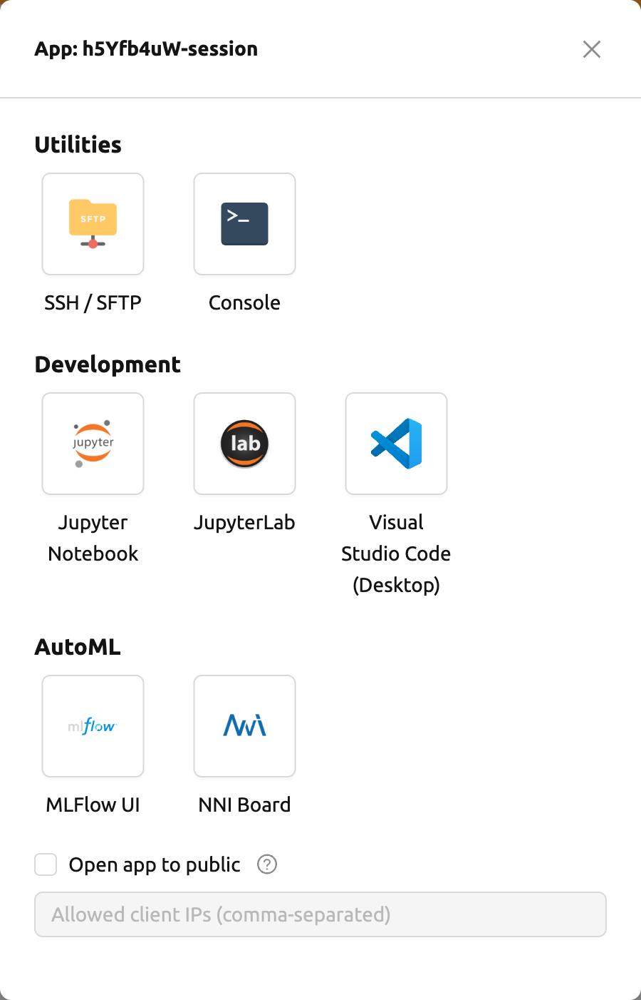

After few moment, you will see a new page for MLFlow UI.


By using MLFlow, you can track experiments, such as metrics and parameters every time you run.
Let's start tracking experiments from simple example.

```bash
wget https://raw.githubusercontent.com/mlflow/mlflow/master/examples/sklearn_elasticnet_diabetes/linux/train_diabetes.py
python train_diabetes.py
```

After executing python code, you may see the experiments result in MLFlow.


You can also set hyperparameter by giving arguments with code execution.

```bash
python train_diabetes.py 0.2 0.05
```

After a few training, you can compare trained models with results.

