

# Chat Page

Chat page enables users to conveniently compare and interact with different LLM models all in one location.
This allows users to experience the services offered by Backend.AI as well as a variety of large language models (LLMs).

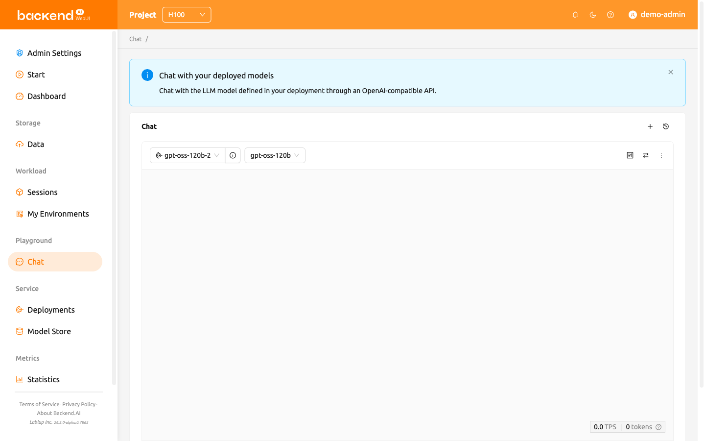

:::note
When you visit the Chat page for the first time, an introductory banner appears at the top of the page:
"Chat with your deployed models — Chat with the LLM model defined in your deployment through an OpenAI-compatible API."
You can dismiss this banner by clicking the close button, and it will not reappear after it has been dismissed.
:::

## Selecting models

Users can select the deployment and model from the top left corner of each chat card on the Chat page.
Clicking the **Deployment** field (indicated by a deployment icon prefix; the field reads **Select Endpoint** while it is empty) opens a dropdown showing available deployments under a "Deployment" header.
Once a deployment is selected, the model dropdown header updates to show "{deployment name}'s Models", listing the models associated with that deployment.

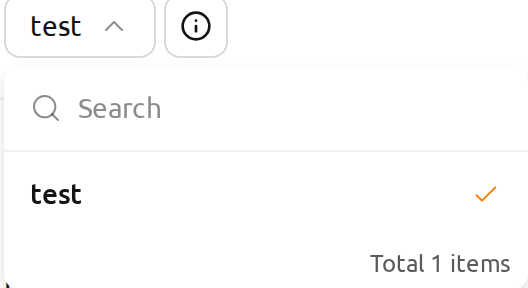

Next to the **Deployment** field, a button with an info icon (**View Deployment Details**) opens the selected deployment's detail page; the button is disabled while no deployment is selected.
If the selected deployment belongs to a project other than the currently active one, a confirmation dialog titled **Switch to another project?** appears before opening the detail page.

### Which deployments are listed

The **Deployment** dropdown does not offer every deployment in the project — only the ones that can answer a message right now. A deployment is offered when at least one of its replicas is currently serving traffic: the replica's **Lifecycle Status** is *Running* and its **Traffic Status** is *Active*. Both conditions have to hold, because the two statuses are independent axes — a *Running* replica may have been taken out of rotation, and a replica marked *Active* may no longer be running. The replica status axes are described in the [Deployments](#model-serving) chapter.

Because availability is judged per replica rather than per deployment, a deployment stays available while a new revision is rolling out. After you apply a new revision, its inference session may stay pending for a while — for example, while it waits for resources — but the previous revision's replica keeps serving during that time. The deployment therefore remains in the dropdown, and you can keep chatting with the replica that is still alive.

A deployment that is not serving anything is not offered: for example, one that has been stopped, or whose desired replica count is 0. A deployment that a chat card already has selected stays selected and keeps its name in the field even when it is no longer offered, so you can always see which deployment the card is pointing at and read the warnings described below.

### Model connection settings

When a chat card has no model list yet, a configuration panel appears above the message area. This happens both while the model list is still being fetched from the deployment and after that fetch has failed.

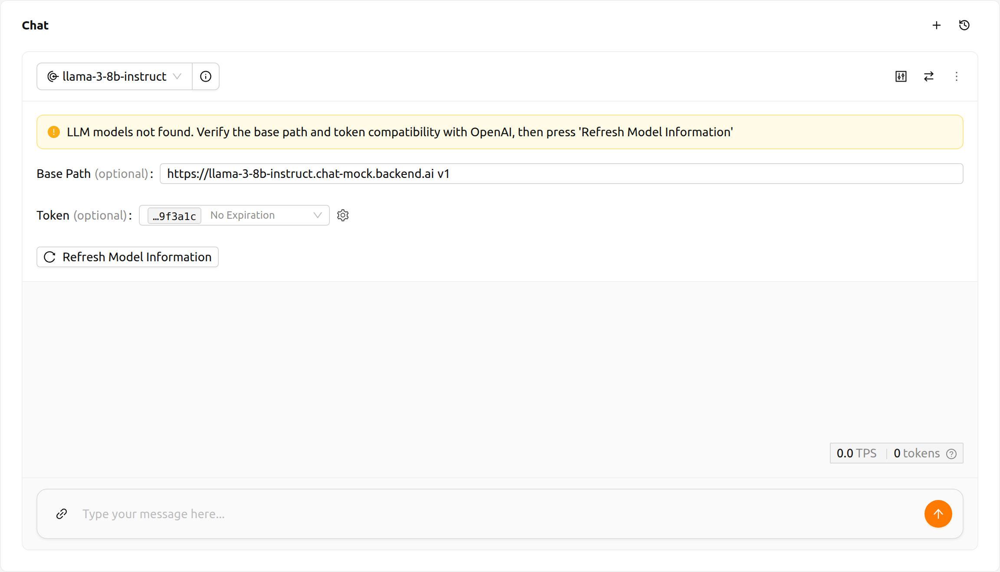

The chat card header — the deployment, model, and sync controls — is rendered right away and does not wait for the model list, so the panel is reachable while the fetch is still in progress. During the fetch, **Refresh Model Information** shows a loading indicator, the **Base Path** and **Token** fields are disabled, and the message input at the bottom of the card is disabled. All of them become usable again once the fetch settles. A deployment that never answers eventually times out and is reported as a failed fetch, so you can correct the settings and retry instead of waiting indefinitely.

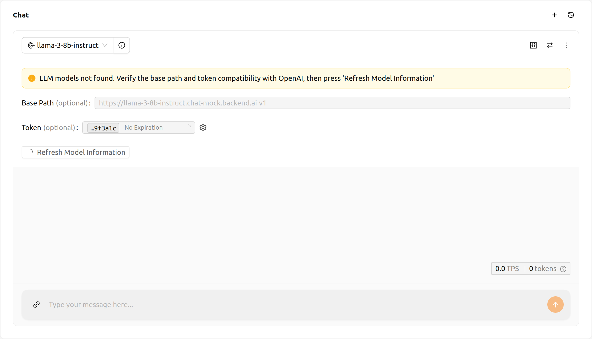

The panel can carry the following warnings:

- **LLM models not found** (warning): The model list could not be retrieved from the deployment's endpoint. Adjust the base path or token in the panel and click **Refresh Model Information** to retry. This warning is part of the panel, so it is also on screen during the initial fetch — wait until **Refresh Model Information** stops loading before acting on it.
- **Desired replica count is 0** (warning): The selected deployment has its desired replica count set to 0 and cannot respond. Set the desired replica count to 1 or more in the Deployment settings to enable it.

The following alerts may also appear in the chat card:

- **Endpoint URL is not valid** (error): The endpoint URL for the selected deployment could not be resolved. Verify that the deployment is properly configured and has a reachable URL.
- **Streaming error** (error): An error occurred while communicating with the model. The message describes the cause. Dismiss the alert and retry your message after resolving the issue.

Refer to the description below for the necessary inputs to configure custom model settings:

- **Base Path** (optional): The path suffix appended to the deployment's endpoint URL when sending requests.
  Make sure to include the version information.
  For instance, when utilizing the OpenAI API, enter `v1`.
- **Token** (optional): The authentication key used to access the model service. When a deployment is selected, this field is a dropdown labeled **Select Token** that lists that deployment's access tokens. When no deployment is selected, it is a plain text field you can paste a token into — tokens can be generated by services other than Backend.AI, and their format and generation process vary by service, so refer to that service's own guide.
   * Each option is labeled with the last six characters of the token and its expiry date. All tokens begin with the same header text and are truncated to the width of the field, so this tail is what tells otherwise identical-looking options apart. A token that never expires is labeled **No Expiration** instead of a date.
   * Point at an option to see its full issue and expiry timestamps.
   * Expired tokens are not listed. When the field is empty, the most recently created valid token is selected for you.
   * The gear icon beside the field (**Access Token Settings**) opens the Access Tokens section of the deployment's detail page, where you can issue a new token. The list is read again when you return, so a token you just created is immediately selectable. For instructions, refer to the [Generating Tokens](#generating-tokens) section.

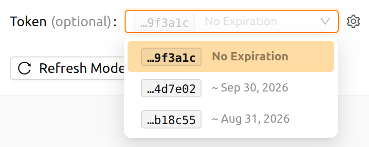

## Add or remove comparison chat cards

To add new comparison chat cards, click the comparison icon button located in the top right corner.

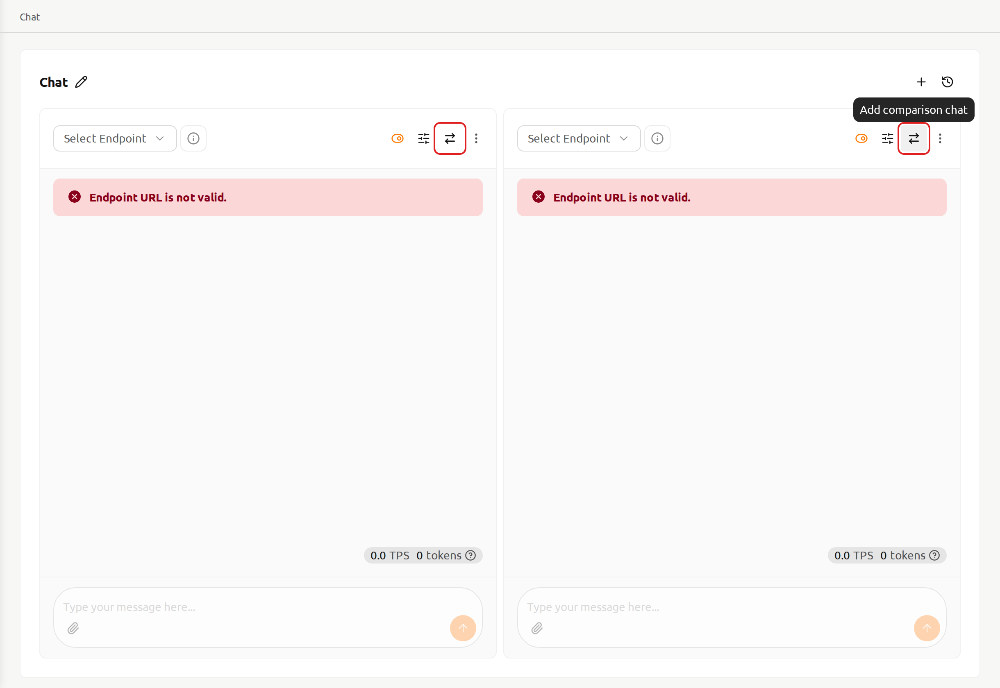

To remove a chat session, click on the `more` button located in the upper right corner of the chat card.
Then a dropdown menu will appear, and users can select `Delete Chat` to remove a chat session.
Please be cautious as this will delete all entered content.

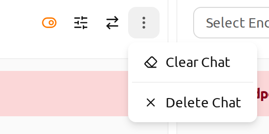

## Clear chat history

Clicking the `more` button will reveal the `Clear Chat` option.
By selecting this, users will erase all chat history associated with the card,
although the card session itself will remain active.

## Synchronize input

The `Sync chat input` button, located at the top right, enables the synchronization of input across chat cards where the option is enabled.
Enabling `Sync chat input` means that pressing `Enter` or clicking the `Send` button on
any card will submit the input from the card users are currently working on.
This functionality is beneficial for comparing the outputs of various models using identical input data.

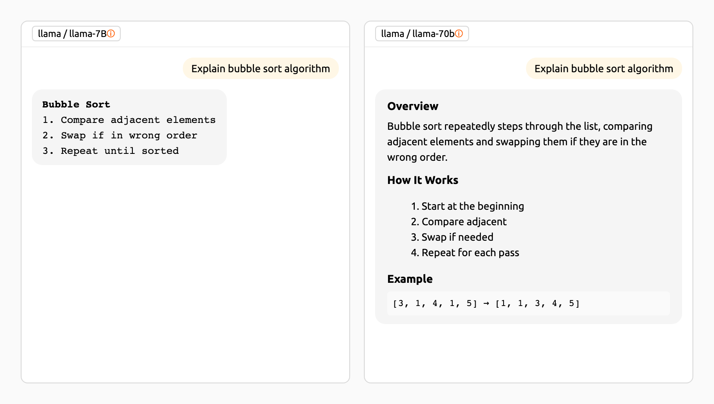

## Parameter adjustment

Click the parameter button in the top-right corner to adjust the parameters for each model. Users can set various values such as Max Tokens, Temperature, Top P, and Top K.
Using the synchronize feature, users can apply different parameters to the same model and then compare the results.

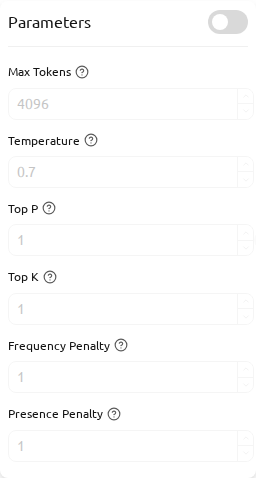

## Chat history

To start new chat, click the `+` button located in the top right corner.

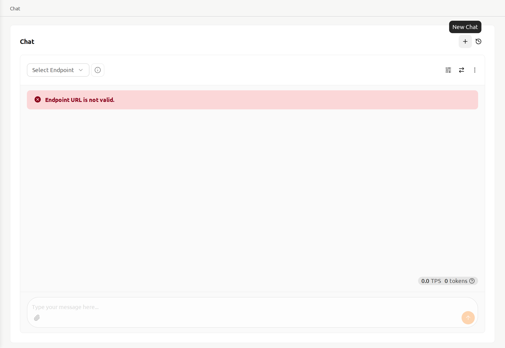

All chat history is stored in local storage, and users can access previous chats by clicking the history button in the top-right corner.

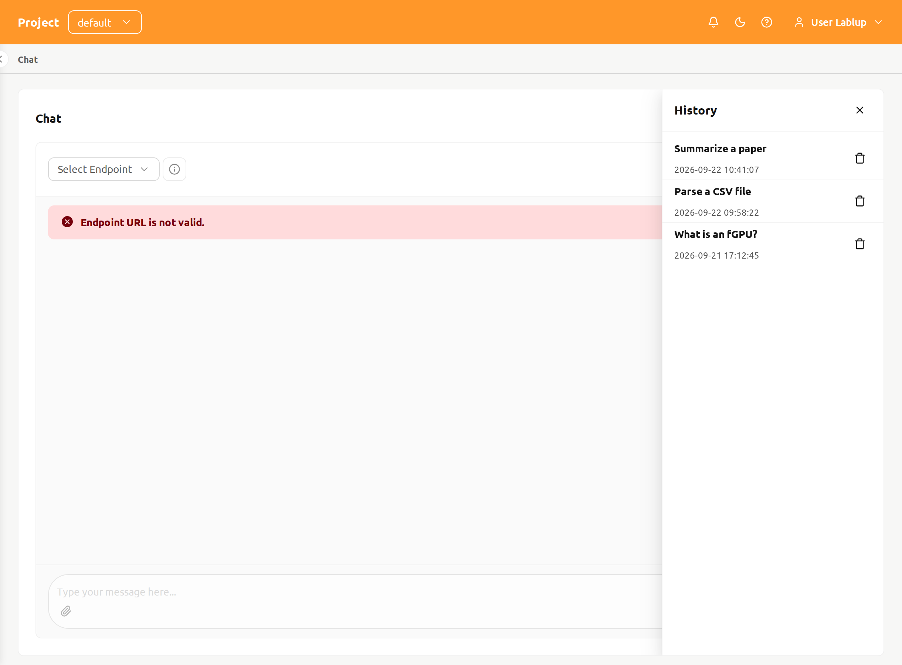
