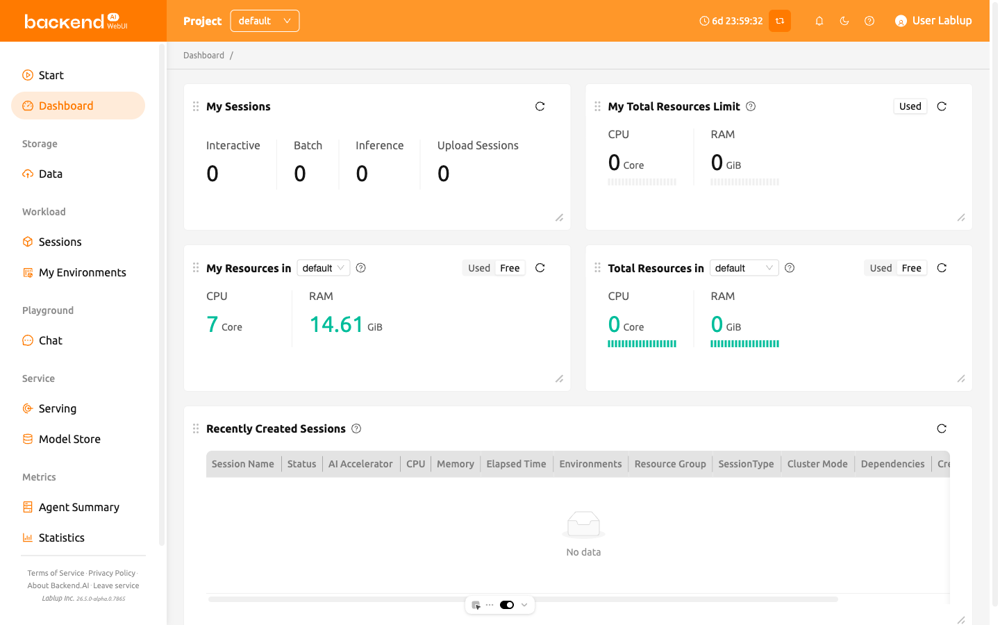

# Dashboard

The **Dashboard** provides an at-a-glance summary of your current resource usage,
available limits, and session information across all your projects and resource groups.
It helps you quickly understand how your computing resources are being utilized
and monitor your recent activities in the system.

The page is composed of several main panels:

- **My Sessions**:
    Shows the number of active sessions by type,
    such as *Interactive*, *Batch*, *Inference*, and *Upload*.
    You can quickly see how many sessions of each type are currently running.

- **My Total Resources Limit**:
    Displays the total used and free resources across all your projects and resource groups.
    When multiple limits (domain, project, or keypair) apply,
    the system uses the **most restrictive** available limit to calculate the remaining resources.

- **My Resources in Resource Group**:
    Shows your current resource usage and remaining capacity
    within the selected resource group of your current project.
    You can switch groups using the dropdown menu.

- **Total Resources in Resource Group**:
    Summarizes the overall used and free resources in the selected resource group.
    The data is aggregated from all agents that belong to the group.

:::note
The **Total Resources in Resource Group** panel may not be visible depending on your
system configuration.
:::

- **Recently Created Sessions**:
    Lists the most recently created active sessions within the current project.
    Provides session details such as name, status, CPU/memory usage, environment, resource group,
    session type, and creation time.
    By default, the latest 5 active sessions are displayed.

When you are logged in as a superadmin, the Dashboard page also displays
**Agent Statistics** and **Active Agents** panels alongside the standard user panels.
See the [Superadmin Dashboard](#superadmin-dashboard) section for details on these panels.

## Auto-Refresh

The Dashboard automatically refreshes all panel data every **15 seconds**. This
ensures that the displayed information stays up to date without requiring manual
interaction.

:::note
The superadmin dashboard uses a **30-second** refresh interval instead.
See the [Superadmin Dashboard](#superadmin-dashboard) section for more information.
:::

## Customizing the Dashboard Layout

You can customize the Dashboard layout by rearranging and resizing panels to
suit your preferences.

- **Move panels**: Drag a panel by its header to reposition it on the board.
- **Resize panels**: Drag the bottom-right corner of a panel to adjust its
  size. Each panel has a minimum size to ensure its content remains readable.

Your customized layout is automatically saved and persists across browser
sessions. The layout is stored per user, so each user can have their own
preferred arrangement.

:::tip
When the WebUI is updated with new dashboard panels, those panels will
automatically appear on your dashboard even if you have a saved custom layout.
:::
