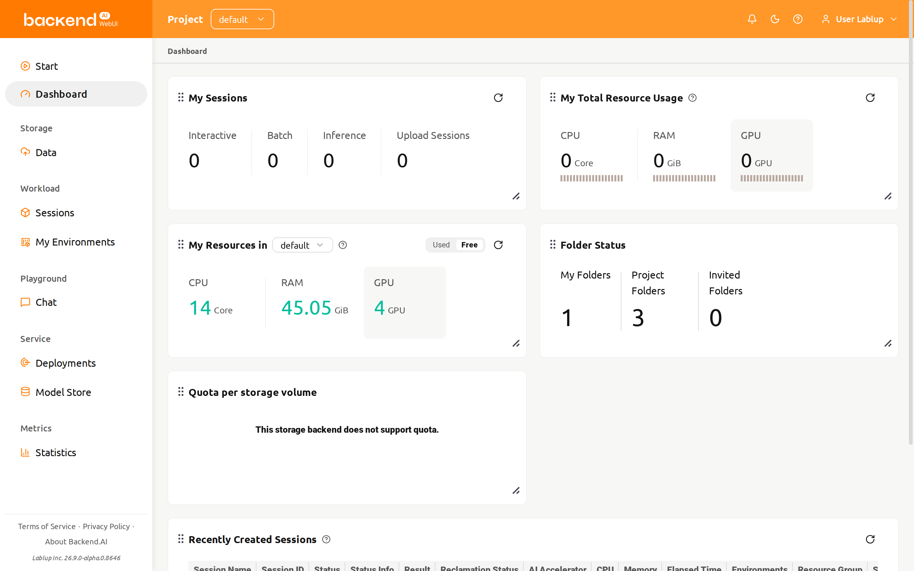
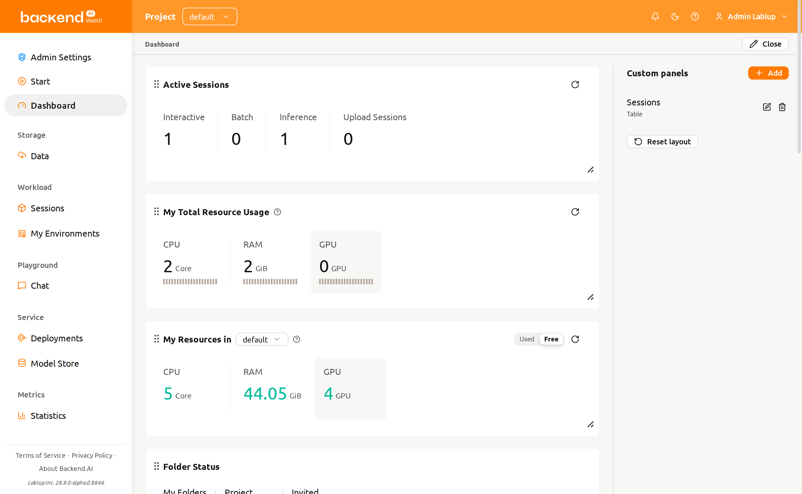
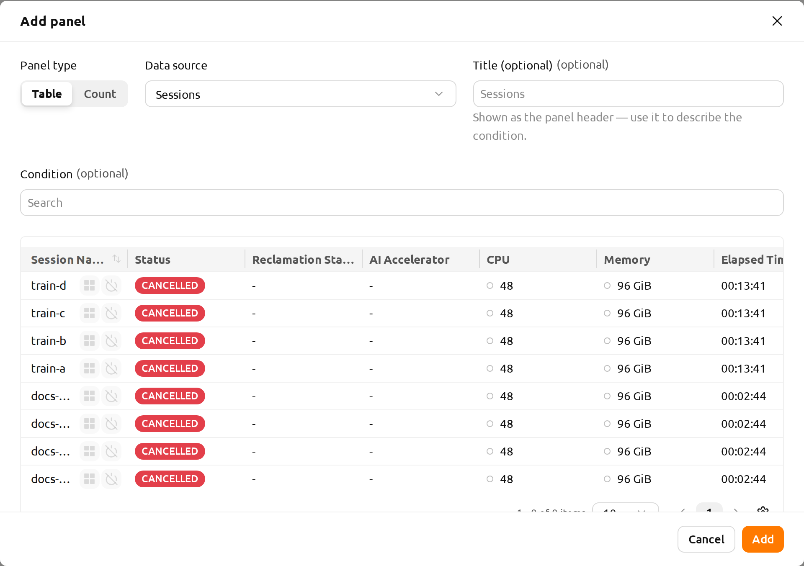

# Dashboard

The **Dashboard** provides an at-a-glance summary of your current resource usage,
available limits, and session information across all your projects and resource groups.
It helps you quickly understand how your computing resources are being utilized
and monitor your recent activities in the system.

The page is composed of several main panels:

- **My Sessions**:
    Shows the number of active sessions by type,
    such as *Interactive*, *Batch*, *Inference*, and *Upload*.
    You can quickly see how many sessions of each type are currently running.

- **My Total Resource Usage**:
    Displays the resources you are currently using across all your projects.
    Each resource shows a usage bar below its value; hover over the bar to see
    how much of your total limit that usage represents.
    When multiple limits (domain, project, or keypair) apply,
    the **most restrictive** one takes effect.

- **My Resources in Resource Group**:
    Shows your current resource usage and remaining capacity
    within the selected resource group of your current project.
    You can switch groups using the dropdown menu.

- **Total Resources in Resource Group**:
    Summarizes the overall used and free resources in the selected resource group.
    The data is aggregated from all agents that belong to the group.

:::note
The **Total Resources in Resource Group** panel may not be visible depending on your
system configuration.
:::

- **Recently Created Sessions**:
    Lists the most recently created active sessions within the current project.
    Provides session details such as name, status, CPU/memory usage, environment, resource group,
    session type, and creation time.
    By default, the latest 5 active sessions are displayed.

When you are logged in as a superadmin, the Dashboard page also displays
**Agent Statistics** and **Active Agents** panels alongside the standard user panels.
These panels show cluster-wide agent health and resource utilization.

## Customizing the Dashboard Layout

You can rearrange the board at any time — there is no mode to enter first:

- **Move panels**: Drag a panel by its header to reposition it on the board.
- **Resize panels**: Drag the bottom-right corner of a panel to adjust its
  size. Each panel has a minimum size to ensure its content remains readable.

<!-- TODO: Capture screenshot of the dashboard in edit mode (board + edit sidebar) -->

Your customized layout is automatically saved and persists across browser
sessions. The layout is stored per user, so each user can have their own
preferred arrangement. To discard your arrangement and restore the default
one, click the **Reset layout** button at the bottom of the edit sidebar and
confirm. Resetting the layout does not remove your custom panels.

:::tip
When the WebUI is updated with new dashboard panels, those panels will
automatically appear on your dashboard even if you have a saved custom layout.
:::

### Custom Panels

:::note[Experimental feature]
The entire custom-panel feature is hidden until you turn on **Custom dashboard
panels** in the [Experimental features](#experimental-features) section of the
User Settings page. If you turn the feature off later, your existing custom
panels are hidden — not deleted — and reappear with their saved board
positions once you turn it back on.
:::

Click the **Edit** button at the top right of the page to open the custom-panel
sidebar, and **Close** to hide it again. The sidebar lists your custom panels. A
custom panel shows a data source you select, narrowed by a condition you define.
The panel itself shows only a title and its data, so
give the panel a title that describes its condition.

To add a panel, click the **Add** button in the sidebar. The panel dialog
contains the following fields. **Panel Type** and **Data source** are
required — the dialog will not submit until both are chosen.

- **Data source**: The data source the panel lists. Choose **Sessions**,
  **Deployments**, or **Data & Storage**.
- **Panel Type**: How the panel displays the data source. Choose **Table** or
  **Count**. For the **Sessions** data source, **Grid** is also offered.
- **Title**: An optional panel title. When omitted, the data source name is
  used.
- **Condition**: A property filter that narrows the rows shown in the panel.

A live preview below the fields shows the rows matching the current condition.
Sorting a column in the preview sets the panel's sort order. Click **Add** to
place the panel on the board.

<!-- TODO: Capture screenshot of the add-panel dialog with the live preview -->

**Deployments** panels list the project's model deployments, using the same
table as the Deployments page: name, status, replica summary, model, and
created at. Clicking a deployment's name opens its detail page. The condition
filter offers name, tags, endpoint URL, and public (open to public).

**Grid** shows the session resource grid: each matching session's allocated
resources as unit cells, colored by utilization. Clicking a session opens its
detail drawer, the same as clicking a row in the table. The grid shows at most
the first 100 matching sessions; a notice appears when there are more.

The grid's display settings — resource or kernel mode, which resource or
metric to show, memory unit, and layout — are chosen in the Add/Edit panel
dialog's live preview and saved with the panel. The panel itself shows no
controls for these settings, so create a second panel if you want a different
view.

:::note
**Grid** is an experimental feature. It is offered in the **Panel Type**
selector only when **Session resource grid view** is turned on under
[Experimental features](#experimental-features). If it is turned off later,
existing Grid panels keep their saved configuration but display as the
session table until the setting is turned back on.
:::

To change a panel's data source, panel type, condition, or title later, click
the pencil (**Edit**) icon next to the panel in the sidebar — or in the
panel's header on the board — and save your changes. To remove a panel, click
the trash (**Delete**) icon and confirm in the popup.

:::note
**Sessions** and **Deployments** panels list data for the current project and
are available to every project member. **Data & Storage** panels are
available to superadmins only. A panel whose data source your role cannot
query remains listed in the sidebar but is not shown on the board.
:::

## Automatic Refresh

The dashboard refreshes its data automatically every 15 seconds, so the panels
always reflect recent activity without reloading the page. Custom panels
refresh on the same cycle as the built-in panels.
