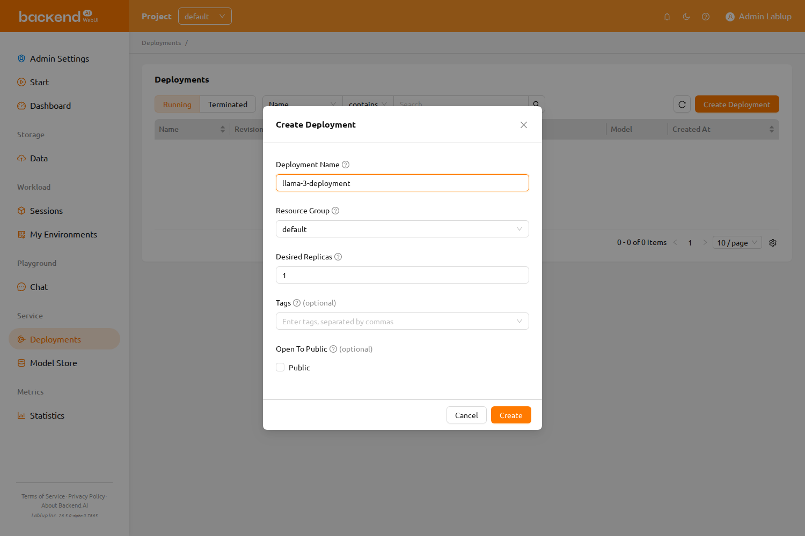
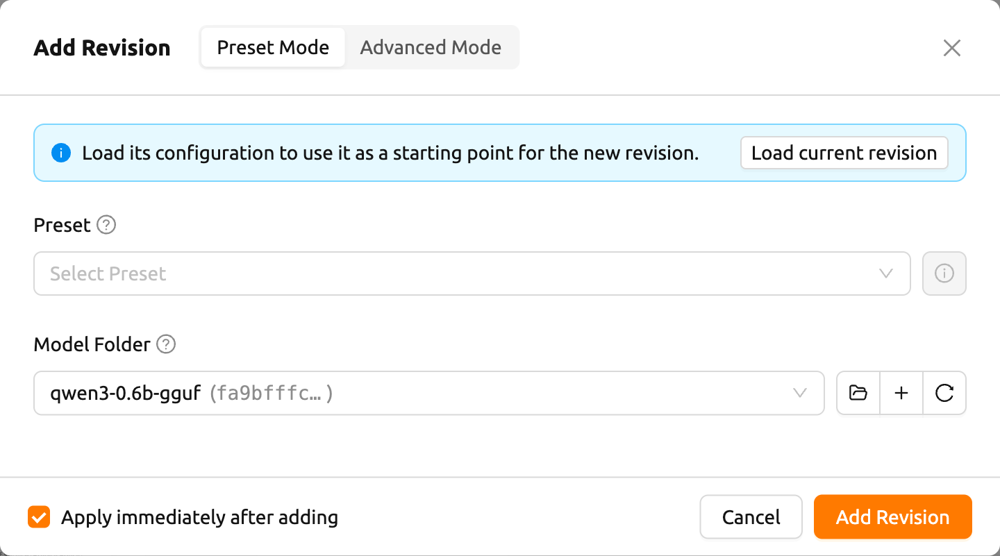
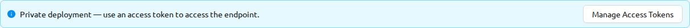
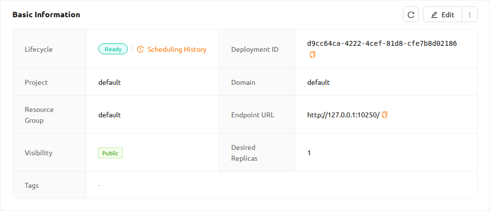
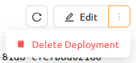
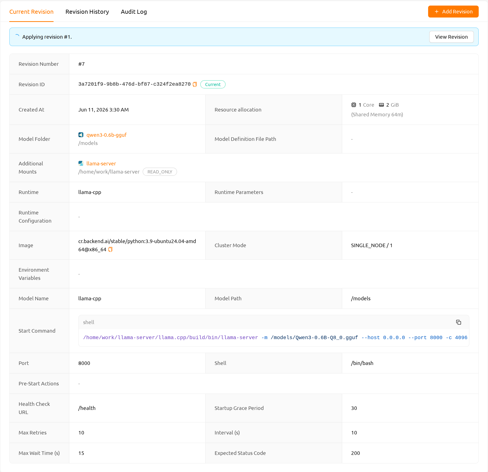
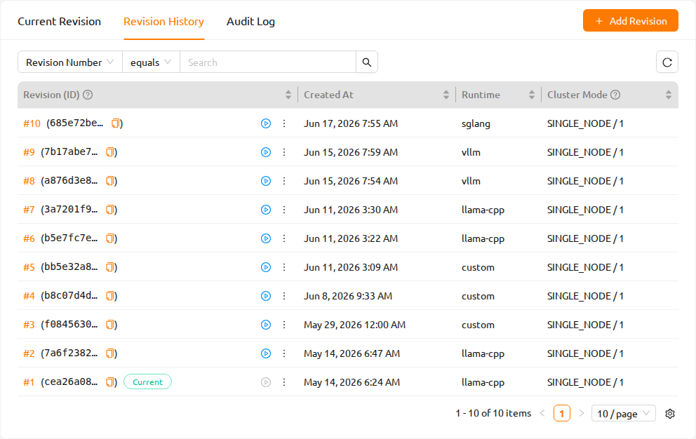
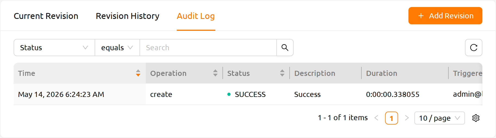
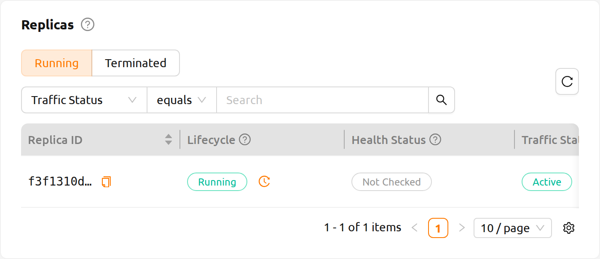
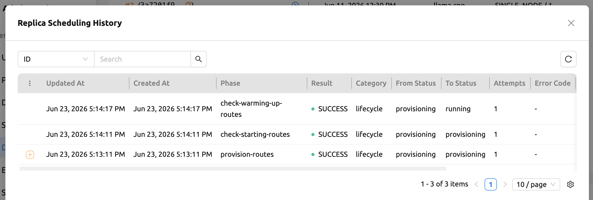

<a id="model-serving"></a>

# Deployments

## Deployment Overview

Backend.AI lets you deploy AI models as inference services through the **Deployments** feature. A deployment exposes a model behind a stable endpoint URL that end-user applications (mobile apps, web service backends, internal tools, and so on) can call to run inference.


A deployment extends a regular compute session with automated maintenance, replica scaling, and a permanent endpoint address that does not change as replicas come and go. You only specify the scaling parameters you want; Backend.AI creates, monitors, and terminates the underlying inference sessions automatically so you do not have to manage them by hand.

## How to Create and Use a Deployment

Starting from version 26.4.0, you can create a deployment easily without a separate configuration file.

**Quick Deploy (Recommended)**: Browse pre-configured models in the [Model Store](#model-store) and click the `Deploy` button to deploy immediately.

**Manual Deploy**: Click the `New Deployment` button on the Deployments page to open the **Create Deployment** modal. After the deployment is created, add a revision by clicking `Add Revision` on the Deployment Detail Page and selecting a runtime variant such as `vLLM` or `SGLang`.

The general workflow is as follows:

1. Create a deployment (name, visibility, and resource group).
2. Add a revision (runtime variant, image, resources, and model storage).
3. (If the deployment is not public) Generate a token.
4. (For end users) Access the service endpoint to verify the service.
5. (If needed) Add a new revision or apply a previous revision.
6. (If needed) Terminate the deployment.

<details>
<summary>Advanced: Using Model Definition and Service Definition Files (Custom Runtime)</summary>

If you are using the `Custom` runtime variant or need finer control, you can create and use model definition and service definition files:

1. Create a model definition file.
2. Create a service definition file.
3. Upload the definition files to the model type folder.
4. When adding a revision, select the `Custom` runtime variant and choose **Use Config File** mode.

For details, refer to the [Creating a Model Definition File](#model-definition-guide) and [Creating a Service Definition File](#service-definition-file) sections.

</details>

<details>
<summary>Reference: Configuration Files for Custom Runtime</summary>

<a id="model-definition-guide"></a>

### Creating a Model Definition File

:::note
From 24.03, you can configure model definition file name. But if you don't
input any other input field in model definition file path, then the system will
regard it as `model-definition.yml` or `model-definition.yaml`.
:::

The model definition file contains the configuration information
required by the Backend.AI system to automatically start, initialize,
and scale the inference session. It is stored in the model type folder
independently from the container image that contains the inference
service engine. This allows the engine to serve different models based on
specific requirements and eliminates the need to build and deploy a new
container image every time the model changes. By loading the model
definition and model data from the network storage, the deployment
process can be simplified and optimized during automatic scaling.

The model definition file follows the following format:

```yaml
models:
  - name: "simple-http-server"
    model_path: "/models"
    service:
      start_command:
        - python
        - -m
        - http.server
        - --directory
        - /home/work
        - "8000"
      port: 8000
      health_check:
        path: /
        interval: 10.0
        max_retries: 10
        max_wait_time: 15.0
        expected_status_code: 200
        initial_delay: 60.0
```

**Key-Value Descriptions for Model Definition File**

:::note
Fields without "(Required)" mark are optional.
:::

- `name` (Required): Defines the name of the model.
- `model_path` (Required): Addresses the path of where model is defined.
- `service`: Item for organizing information about the files to be served
  (includes command scripts and code).

   - `pre_start_actions`: Actions to be executed before the `start_command`. These actions
     prepare the environment by creating configuration files, setting up directories, or
     running initialization scripts. Actions are executed sequentially in the order defined.

      - `action`: The type of action to perform. See [Prestart Actions](#prestart-actions)
        for available action types and their parameters.
      - `args`: Action-specific parameters. Each action type has different required arguments.

   - `start_command` (Required): Specify the command to be executed in model serving.
     Can be a string or a list of strings.
   - `port` (Required): Container port for the model service (e.g., `8000`, `8080`).
   - `health_check`: Configuration for periodic health monitoring of the model service.
     When configured, the system automatically checks if the service is responding correctly
     and removes unhealthy instances from traffic routing.

      - `path` (Required): HTTP endpoint path for health check requests (e.g., `/health`, `/v1/health`).
      - `interval` (default: `10.0`): Time in seconds between consecutive health checks.
      - `max_retries` (default: `10`): Number of consecutive failures allowed before marking
        the service as `UNHEALTHY`. The service continues receiving traffic until this threshold is exceeded.
      - `max_wait_time` (default: `15.0`): Timeout in seconds for each health check HTTP request.
        If no response is received within this time, the check is considered failed.
      - `expected_status_code` (default: `200`): HTTP status code that indicates a healthy response.
        Common values: `200` (OK), `204` (No Content).
      - `initial_delay` (default: `60.0`): Time in seconds to wait after container creation
        before starting health checks. This allows time for model loading, GPU initialization,
        and service warmup. Set higher values for large models (e.g., `300.0` for 70B+ LLMs).


**Understanding Health Check Behavior**

The health check system monitors individual model service containers and automatically
manages traffic routing based on their health status.

**① AppProxy: Traffic Routing Control**


**② Manager: Health State Management and Eviction**


:::note
The internal health status (used for traffic routing) may not be immediately
synchronized with the status displayed in the user interface.
:::

**Time to UNHEALTHY**:

- Initial startup: `initial_delay + interval × (max_retries + 1)`

  Example with defaults: 60 + 10 × 11 = **170 seconds** (about 3 minutes)

- During operation (after healthy): `interval × (max_retries + 1)`

  Example with defaults: 10 × 11 = **110 seconds** (about 2 minutes)


<a id="prestart-actions"></a>

**Description for Service Action Supported in Backend.AI Model Serving**


- `write_file`: This is an action to create a file with the given
  file name and append control to it. the default access permission is `644`.

   - `arg/filename`: Specify the file name
   - `body`: Specify the content to be added to the file.
   - `mode`: Specify the file's access permissions.
   - `append`: Set whether to overwrite or append content to the file as `True` or `False` .

- `write_tempfile`: This is an action to create a file with
  a temporary file name (`.py`) and append content to it. If no value is specified for the mode, the default access permission is `644`.

   - `body`: Specify the content to be added to the file.
   - `mode`: Specify the file's access permissions.

- `run_command`: The result of executing a command,
  including any errors, will be returned in following format
  ( `out`: Output of the command execution, `err`: Error message if an error occurs during command execution)

   - `args/command`: Specify the command to executed as an array. (e.g. `python3 -m http.server 8080` command goes to ["python3", "-m", "http.server", "8080"] )

- `mkdir`: This is an action to create a directory by input path

   - `args/path`: Specify the path to create a directory

- `log`: This is an action to print out log by input message

   - `args/message`: Specify the message to be displayed in the logs.
   -  `debug`: Set to `True` if it is in debug mode, otherwise set to `False`.

### Uploading Model Definition File to Model Type Folder

To upload the model definition file (`model-definition.yml`) to the
model type folder, you need to create a virtual folder. When creating
the virtual folder, select the `model` type instead of the default
`general` type. Refer to the section on [creating a storage folder](#create-storage-folder) in the Data page for
instructions on how to create a folder.


After creating the folder, select the 'MODELS' tab in the Data
page, click on the recently created model type folder icon to open the
folder explorer, and upload the model definition file.
For more information on how to use the folder explorer,
please refer to the [Explore Folder](#explore-folder) section.


<a id="service-definition-file"></a>

### Creating a Service Definition File

The service definition file (`service-definition.toml`) allows administrators to pre-configure the resources, environment, and runtime settings required for a model service. When this file is present in a model folder, the system uses these settings as default values when creating a service.

Both `model-definition.yaml` and `service-definition.toml` must be present in the
model folder to enable the `Deploy` button on the Model Store page. These two files
work together: the model definition specifies the model and inference server
configuration, while the service definition specifies the runtime environment,
resource allocation, and environment variables.

The service definition file follows the TOML format with sections organized by runtime variant. Each section configures a specific aspect of the service:

```toml
[vllm.environment]
image        = "example.com/model-server:latest"
architecture = "x86_64"

[vllm.resource_slots]
cpu = 1
mem = "8gb"
"cuda.shares" = "0.5"

[vllm.environ]
MODEL_NAME = "example-model-name"
```


**Key-Value Descriptions for Service Definition File**

- `[{runtime}.environment]`: Specifies the container image and architecture for the model service.

   - `image` (Required): The full path of the container image to use for the inference service (e.g., `example.com/model-server:latest`).
   - `architecture` (Required): The CPU architecture of the container image (e.g., `x86_64`, `aarch64`).

- `[{runtime}.resource_slots]`: Defines the compute resources allocated to the model service.

   - `cpu`: Number of CPU cores to allocate (e.g., `1`, `2`, `4`).
   - `mem`: Amount of memory to allocate. Supports unit suffixes (e.g., `"8gb"`, `"16gb"`).
   - `"cuda.shares"`: Fractional GPU (fGPU) shares to allocate (e.g., `"0.5"`, `"1.0"`). This value is quoted because the key contains a dot.

- `[{runtime}.environ]`: Sets environment variables that will be passed to the inference service container.

   - You can define any environment variables required by the runtime. For example, `MODEL_NAME` is commonly used to specify which model to load.


:::note
The `{runtime}` prefix in each section header corresponds to the runtime variant
name (e.g., `vllm`, `nim`, `custom`). The system matches this prefix with the
selected runtime variant when creating the service.
:::

:::note
When a service is created from the Model Store using the `Deploy` button, the
settings from `service-definition.toml` are applied automatically. If you later
need to adjust the resource allocation, you can modify the service through the
Deployments page.
:::

</details>

## Deployments Page Overview

The Deployments page displays a list of all deployments in the current project. You can access it by clicking **Deployments** in the sidebar menu.


At the top of the page, you can filter deployments by lifecycle stage:

- **Active**: Shows deployments that are currently running or being created. This is the default view.
- **Destroyed**: Shows deployments that have been terminated.

You can also use the property filter bar to search deployments by **Deployment Name**, **Service Endpoint URL**, or **Owner** (available to admins and superadmins).

Click the `New Deployment` button to open the **Create Deployment** modal.

## Creating a Deployment

Creating a deployment is a two-step flow:

1. **Create the deployment** — a lightweight container that defines the deployment's identity (name, visibility, deployment metadata, and resource group).
2. **Add a revision** — a configuration snapshot that defines what actually runs (start command, environment variables, runtime variant, image, resources, model storage).

Each deployment can hold many revisions. Only one revision is *current* (serving traffic) at a time, and you can switch between revisions from the Revisions tab on the Deployment Detail Page.

### Create Deployment Modal

Click the `New Deployment` button on the Deployments page to open the **Create Deployment** modal. The modal collects only deployment-level metadata; no revision is created at this point.



The modal contains the following fields:

- **Deployment Name**: A unique name used to identify the deployment across the dashboard, API, and the endpoint URL.
- **Resource Group**: The resource group where the deployment will run. If only one resource group is available to your project, the field is auto-selected and you can proceed without choosing one manually.
- **Desired Replicas**: The number of replicas to keep running for this deployment. The system scales the active pool toward this target.
- **Tags**: Optional labels for organizing and filtering deployments. Press Enter or comma to add.
- **Open To Public**: When enabled, the endpoint is reachable without an access token. When disabled, every request must carry a token. See [Access Tokens](#generating-tokens).

Click `Create Deployment` to create the deployment. You are then taken to the Deployment Detail Page, where the **No Current Revision** warning is shown until you add the first revision. To update deployment-level settings (name, visibility, desired replicas, or tags) after creation, click the **Edit** button on the Service Info card.

### Add Revision

A revision captures every setting needed to run the inference server — image, start command, resources, model mounts, and environment variables. From the Deployment Detail Page, click `Add Revision` to open the modal.



Use the **Preset Mode** / **Advanced Mode** switcher in the modal title to select how to configure the revision.

#### Preset Mode

Quickly add a revision using a pre-defined deployment preset.

- **Preset**: A deployment preset compatible with the deployment's resource group. Click the ⓘ button next to the selector to view the preset details.
- **Model Folder**: The storage folder to mount on each replica.

If no presets are available for the deployment's resource group, an informational message is shown. Switch to Advanced Mode to configure the revision manually.

#### Advanced Mode

Configure every revision setting directly. A **Load current revision** button lets you pre-fill the form from the currently active revision.

The form contains the following sections:

- **Model & Runtime**: Select the model folder and runtime variant. For `vLLM` / `SGLang` variants, a Runtime Parameters panel appears; for the `Custom` variant, a Model Definition Mode control appears. See the sections below for details on runtime-specific fields.
- **Environments**: Choose the container image (Environment / Version) and add environment variables.
- **Cluster & Resources**: Allocate CPU, memory, and accelerator resources.
- **Advanced Settings** *(collapsible)*: Mount additional storage folders alongside the model folder.

At the bottom of the modal, check **Apply immediately after adding** to activate the new revision immediately upon creation. If unchecked, the revision is saved in an inactive state and you can apply it later from the Revisions tab.

### Add Revision: Field Reference

The subsections below describe revision-level fields in detail. They apply both when adding a revision manually in **Advanced Mode** and when you want to understand what each field controls.

#### Model Definition Mode (Custom Runtime Only)

When you select the **Custom** runtime variant, a **Model Definition Mode** segmented control appears at the top of the form. It lets you choose how the inference server startup is defined:

##### Enter Command Mode

Select **Enter Command** to define the startup directly as a CLI command. The following fields are available:

- **Start Command**: The command to launch the inference server. For example, `python -m http.server 8000`.

:::tip[Shell operators require an explicit shell invocation]
The backend executes the start command directly (exec-style), not through a shell. Shell operators such as `;`, `|`, `&&`, and `\` (line continuation) are **not** interpreted unless you invoke a shell explicitly.

Instead of:

```bash
chmod +x /setup.sh; vllm serve /models
```

Use:

```bash
/bin/bash -c "chmod +x /setup.sh; vllm serve /models"
```

The Review step (step 4 of the wizard) renders the start command and bootstrap script as code blocks for easy review before you confirm.
:::

- **Model Mount Destination**: The path inside the container where the model storage folder is mounted (default: `/models`).
- **Port**: The container port that the inference server listens on (default: `8000`).
- **Enable Health Check**: When enabled, the system periodically sends HTTP requests to the inference server to verify it is responding correctly. When disabled (the default for new revisions), no health check is configured and unhealthy replicas are not automatically detected. Turn this on for production deployments. When **Enable Health Check** is checked, the following additional fields appear:
   * **Path**: The HTTP endpoint path called during service health checks (default: `/health`).
   * **Interval**: Seconds between consecutive health checks (default: `10.0`).
   * **Max Retries**: Maximum consecutive health check failures before the replica is marked `UNHEALTHY` (default: `10`).
   * **Max Wait Time**: Timeout in seconds for each individual health check request (default: `15.0`).
   * **Expected Status Code**: The HTTP response status code that indicates a healthy service (default: `200`).
   * **Startup Grace Period**: Grace period in seconds after container startup during which failed health checks are tolerated; the replica becomes active on the first successful check (default: `60.0`). Increase this for large models that take longer to load.

##### Use Config File Mode

Select **Use Config File** to load the startup configuration from a `model-definition.yaml` file stored in the model storage folder. The following fields are available:

- **Mount Destination**: The path inside the container where the model storage folder is mounted (default: `/models`).
- **Model Definition File Path**: The path to the model definition file within the model storage folder (default: `model-definition.yaml`).

For instructions on creating a model definition file, refer to the [Creating a Model Definition File](#model-definition-guide) section.

#### Runtime Parameters (vLLM / SGLang)

When you select the `vLLM` or `SGLang` runtime variant, a **Runtime Parameters** section appears in place of the Model Definition Mode selector. This section lets you configure the serving framework without editing configuration files manually.

Parameters are organized into tab-separated categories. The available tabs vary by runtime variant.

:::note
Unchanged parameters use the runtime's default values.
:::

:::note[Required parameters]
Administrators can mark individual parameters as required. Required parameters are indicated by a red asterisk (★) next to the label. Submitting the form with an empty required parameter is blocked — the field shows an inline validation error even if the parameter is on an unvisited tab.

On backends older than Backend.AI Manager 26.4.4, all parameters are treated as optional regardless of the administrator's configuration.
:::

**Enable Health Check**

In Advanced Mode, all runtime variants — including `vLLM` and `SGLang` — include an **Enable Health Check** section at the bottom of the Runtime Parameters area. This is off by default for new revisions. When you check **Enable Health Check**, the following fields appear and are required:

- **Path**: The HTTP endpoint path the system will call to verify service health.
- **Interval**: Seconds between checks (default: `10.0`).
- **Max Retries**: Consecutive failures allowed before the replica is marked `UNHEALTHY` (default: `10`).
- **Max Wait Time**: Per-request timeout in seconds (default: `15.0`).
- **Expected Status Code**: HTTP status code that indicates a healthy response (default: `200`).
- **Startup Grace Period**: Seconds to wait after container startup before health check failures count against the replica (default: `60.0`).

**vLLM Runtime Parameters**


vLLM provides the following tabs: **Model Loading**, **Resource Memory**, **Serving Performance**, **Multimodal**, **Tool Reasoning**, and others.

Key fields in the **Model Loading** tab:

- **Model**: The name or path of the model to use.
- **DType**: The data type for model weights and computation (for example, `Auto`, `float16`, `bfloat16`).
- **Quantization**: The model quantization method (for example, `awq`, `gptq`, `fp8`).
- **Max Model Length**: The maximum context length (number of tokens) the model can process.
- **Served Model Name**: The model name to expose at the API endpoint.
- **Trust Remote Code**: Allows execution of custom model code from the model repository.

**SGLang Runtime Parameters**


SGLang provides the following tabs: **Model Loading**, **Resource Memory**, **Serving Performance**, **Tool Reasoning**, and others.

Key fields in the **Model Loading** tab:

- **Model**: The name or path of the model to use.
- **DType**: The data type for model weights and computation (for example, `Auto`, `float16`, `bfloat16`).
- **Quantization**: The model quantization method (for example, `awq`, `gptq`, `fp8`).
- **Context Length**: The maximum context length the model can process.
- **Served Model Name**: The model name to expose at the API endpoint.
- **Trust Remote Code**: Allows execution of custom model code from the model repository.

In addition to runtime parameters, the `vLLM` and `SGLang` runtime variants pre-populate specific environment variables in the **Environments** section:

- **vLLM**: `BACKEND_MODEL_NAME`, `VLLM_QUANTIZATION`, `VLLM_TP_SIZE` (tensor parallelism), `VLLM_PP_SIZE` (pipeline parallelism), `VLLM_EXTRA_ARGS` (extra CLI arguments)
- **SGLang**: `BACKEND_MODEL_NAME`, `SGLANG_QUANTIZATION`, `SGLANG_TP_SIZE` (tensor parallelism), `SGLANG_PP_SIZE` (pipeline parallelism), `SGLANG_EXTRA_ARGS` (extra CLI arguments)

#### Environments

The **Environments** section is present for all runtime variants.

- **Environment / Version**: The container image used for the inference server. Selecting a runtime variant filters this list to images that are compatible with that runtime.
- **Environment Variables**: Key/value pairs passed to the inference server container. For `vLLM` and `SGLang`, a set of runtime-specific variables (listed above) are pre-populated. You can add, edit, or remove entries freely.

#### Cluster and Resources

The **Cluster and Resources** section lets you specify the compute resources to allocate to each replica.

- **Resource Preset**: A pre-configured bundle of CPU, memory, and accelerator allocations. Available presets are filtered by the deployment's resource group. You can also configure resources manually (CPU, memory, GPU) without selecting a preset.

#### Advanced Settings

Expand the **Advanced Settings** collapse panel to mount additional storage folders alongside the model storage folder.

- **Additional Mounts**: A table of storage folders to mount into the inference server container. Only general-purpose (non-model) folders in `ready` state are listed. Hidden folders (names starting with `.`) and the model storage folder itself are excluded.

<a id="deployment-detail-page"></a>

## Deployment Detail Page

Click on a deployment name in the Deployments list to view detailed information about the deployment.

### Deployment Alerts

The Deployment Detail Page shows contextual alert banners at the top, reflecting the current state of the deployment:

- **Deployment is ready**: Shown when the deployment is `HEALTHY`. Includes a **Test in Chat** button as a shortcut to the LLM Chat Test interface so you can test the model without leaving the page.


- **Private deployment — use an access token to access the endpoint.**: Shown when **Open To Public** is disabled. Includes a shortcut to **Manage Access Tokens** so you can issue or copy a token. See [Access Tokens](#generating-tokens).



- **No revision is deployed — add a revision to activate this service.**: Shown when the deployment has no current revision. Click `Add Revision` to create the first revision and activate the service.

- **Preparing your service**: Shown while the deployment is being created or transitioning between states. Indicates the service is not yet ready to handle requests.


- **Not In Project**: Shown when the deployment belongs to a different project than the currently selected one. The Edit button is disabled while this alert is active. Click the **Switch Project** button in the alert to switch to the correct project and manage the deployment.

### Service Information

The Service Info card displays the following details:

- **Deployment Name** and **Status**. Next to the status tag is a **Scheduling History** link button; click it to view the deployment's scheduling event history in a modal.
- **Deployment ID** and **Session Owner**
- **Visibility**: Shown as a Public / Private tag. **Public** means the endpoint is reachable without an access token; **Private** means callers must supply a valid access token.
- **Number of Replicas**
- **Service Endpoint**: The URL for accessing the deployment. For LLM deployments, a `Test in Chat` button is available.
- **Resource Group**: The resource group the deployment runs in. Resource group is now part of the deployment metadata (set once when the deployment is created) rather than per-revision.
- **Resources**: Allocated CPU, memory, accelerator, and **Shared Memory (SHM)**. The shared memory value is taken from the current revision and represents the size of `/dev/shm` available to the inference server — important for multi-GPU and multi-process inference workloads.
- **Model Storage**: The mounted model storage folder and mount destination.
- **Additional Mounts**: Any extra storage folders mounted.
- **Environment Variables**: Displayed as a code block.
- **Image**: The container image used for the service.



#### More Menu (Edit and Delete)

The Service Info card's header exposes an **Edit** button alongside a **More** menu. The More menu currently contains the **Delete Deployment** action.




<a id="revisions-tab"></a>

### Revisions Tab

The **Revisions** card on the deployment detail page has three tabs: **Current Revision**, **Revision History**, and **Audit Log**. The `Add Revision` button at the top of the card is available from all tabs and opens the Add Revision modal (see [Add Revision](#add-revision)).

#### Current Revision Tab

The **Current Revision** tab shows the full configuration of the revision that is currently active and serving traffic.



The following fields are displayed:

- **Revision Number**: The auto-assigned sequential number of this revision (for example, *#3*).
- **Revision ID**: The UUID of this revision.
- **Created At**
- **Resources**: The resource allocation (CPU, memory, and accelerators) for each replica.
- **Model Folder**: The model folder mounted into each replica, shown as a link, together with **Mount Destination For Model Folder**.
- **Model Definition File Path**: Path to the model definition file within the model folder.
- **Additional Mounts**: Extra storage folders mounted into each replica.
- **Runtime**: The serving runtime (for example, `vLLM`, `SGLang`, or `Custom`).
- **Runtime Parameters**: Runtime-variant preset parameter values configured for this revision (for example, DType: float32, Quantization: awq). Shown only for `vLLM` or `SGLang` revisions that have preset parameter values configured. Shows a dash for the `Custom` runtime or revisions with no preset values.
- **Runtime Configuration**: Additional `vLLM` or `SGLang` settings, displayed as a JSON blob. Shown only when such configuration exists for the runtime.
- **Image**: The container image used to run the replica.
- **Cluster Mode**: The clustering layout of each replica's compute session (mode / size).
- **Environment Variables**: Key-value pairs injected into the container, displayed as a shell script block.

When the model definition file defines a model, the following fields are also shown:

- **Model Name**, **Model Path**, **Start Command**, **Port**, **Shell**, **Pre-Start Actions**, **Health Check URL**, **Startup Grace Period**, **Max Retries**, **Interval (s)**, **Max Wait Time (s)**, **Expected Status Code**
- **Health Check Enabled**: Whether periodic health checking is enabled for this revision.

**Applying-in-progress state**

While a different revision is being applied, the **Current Revision** tab shows an alert: *"Applying revision N."* A **View Revision** button in the alert opens a detail drawer for the revision currently being applied. The tab refreshes automatically every 5 seconds until the apply completes.

**Empty state**

If no revision has been deployed yet, the tab shows: *"No revision is deployed — add a revision to activate this service."*

#### Revision History Tab

The **Revision History** tab lists all revisions added to the deployment, sorted from newest to oldest by default.



The table includes the following columns:

- **Revision (ID)**: The revision number and its UUID. The revision number is an incrementing integer; lower numbers are older revisions. Click the revision number to open the revision detail drawer.
- **Created At**
- **Runtime**: The serving runtime used in this revision (for example, `vLLM`, `SGLang`, or `Custom`).
- **Cluster Mode**: The clustering layout formatted as "mode / size". Hover over the column header for a description.

The following columns are hidden by default but can be enabled from the column settings:

- **Model Name**, **Image**, **Model Folder**

**Filters**

The filter bar above the table lets you narrow the list by revision number, created-at date range, cluster mode, image, and model folder.

**Applying a revision and other actions**

Each row has an **Apply** button and a **More** menu.

- **Apply**: Click it to open a confirmation dialog. On confirm, the selected revision becomes the current revision and the deployment begins serving traffic with the new configuration. The previous revision is preserved in the history.
- **New revision based on this**: Available from the **More** menu. It opens the Add Revision modal pre-filled with that revision's settings, so you can quickly modify and redeploy it.

- A green **Current** tag marks the revision that is currently active.
- A yellow **Applying** tag (with a loading spinner) marks a revision that is being applied.
- The **Apply** button is disabled for the currently active revision and any revision that is being applied.

Clicking the revision number in any row opens the revision detail drawer, which shows the full configuration of that revision. The drawer also has an **Apply** button and a **New revision based on this** button; the **Apply** button is disabled for the current and applying revisions.

:::note
The **Runtime Parameters** field also appears in the revision detail drawer for `vLLM` and `SGLang` revisions, showing the same preset parameter values as the Current Revision tab.
:::

#### Audit Log Tab

The **Audit Log** tab shows a chronological record of all actions taken on this deployment. Use it to track who changed the deployment and when.



The tab provides the following controls:

- **Filter bar**: Filter log entries by **Status**, **Operation**, **Triggered By** (search by user ID), and a **Time** date-range picker.
- **Auto-refresh button**: Reload the log without leaving the tab.
- **Pagination**: Navigate through log entries page by page.

:::note
The Audit Log tab uses lazy loading — the query is sent only when you first activate the tab. The active tab is reflected in the URL (`?revisionTab=auditLog`), so you can share a link directly to the audit log view.
:::

### Replicas

The Replicas tab shows the routing nodes that make up the deployment. Replica entries are filtered by a **Running / Terminated** radio control at the top of the tab, which replaced the previous enum-based status filter.



- **Running**: Shows replicas that are currently provisioning, running, or otherwise active.
- **Terminated**: Shows replicas that have completed their lifecycle.

Each replica row carries three **independent** status fields. They describe different axes and should be read together — a replica can be *Running* in its lifecycle while its health is still *Not Checked*, for example.

- **Lifecycle Status**: Where the replica is in its lifecycle — for example, *Provisioning*, *Warming Up*, *Running*, *Terminating*, or *Terminated*. During **Warming Up**, the replica is inside its startup grace period: it is starting up and waiting for the first successful health check. Failed checks are tolerated during this window; the replica moves to *Running* on the first success, and is terminated if it never succeeds before the window ends. The column header reads **Lifecycle**.
- **Health Status**: The current health of the replica process — *Healthy*, *Unhealthy*, *Degraded*, or *Not Checked*.
   * **Not Checked** means the first health check has not completed yet — the replica is typically still in its **Warming Up** grace period. By itself it does not indicate a problem; read the **Lifecycle Status** to see where the replica is.
- **Traffic Status**: Whether the replica is currently serving requests. A replica can be removed from traffic independently of its health (for example, when it is manually deactivated), which is why traffic is shown as its own status rather than being merged into Health Status.

:::note
The three statuses are independent axes. During the **Warming Up** lifecycle phase a replica is within its startup grace period, and its **Health Status** typically reads *Not Checked* until the first check completes — by itself that does not indicate a problem.
:::

Click the session name in the **Session** column to open the session detail drawer. Click the revision number in the **Revision (ID)** column to open the revision detail drawer.

Next to the status tag in the **Lifecycle** column is a history icon button. Click it to open the **Replica Scheduling History** modal for that replica, where you can review the replica's scheduling events filtered by date range, status, and other criteria.



If a replica has encountered an error, clicking the error indicator on the row opens a JSON viewer modal that displays the raw error data. This is useful for diagnosing issues with individual replicas.


### Auto Scaling Rules

Auto Scaling Rules automatically increase or decrease the number of replicas for a model service based on live metrics. This conserves resources during low usage and prevents request delays or failures during high usage.


The rule list provides:

- A property filter bar to filter rules by **Created At** and **Last Triggered** datetime ranges.
- Server-side pagination.
- The following columns: **Metric Source**, **Condition**, **Cooldown Sec.**, **Step Size**, **Min / Max Replicas**, **Created At**, and **Last Triggered**. The **Step Size** column automatically shows `+`, `−`, or `±` based on the direction derived from the thresholds you have set, so you no longer choose **Scale Out** or **Scale In** explicitly.
- Per-row edit and delete icons shown next to the condition summary in each row.

Click the `Add Rules` button to open the **Add Auto Scaling Rule** editor. To modify an existing rule, click the edit icon on its row; the **Edit Auto Scaling Rule** editor opens with the rule's values pre-filled. The editor contains the following fields in order:

- **Metric Source**: Select `Kernel` or `Prometheus`.
- **Metric Name**: For `Kernel`, enter a metric name. Common metrics such as `cpu_util`, `mem`, `net_rx`, and `net_tx` are offered as autocomplete suggestions, and you can also type a custom name freely.
- **Metric Name (Prometheus Preset)**: Shown only when **Metric Source** is `Prometheus`. Select a preset from the dropdown; the preset's metric name, query template, and (when defined) **Cooldown Sec.** are filled in automatically.
- **Condition**: A segmented control for choosing the scaling direction. It provides three options.

   - **Scale In**: Decreases replicas when the metric falls below a threshold. Sets `Metric < [threshold]`.
   - **Scale Out**: Increases replicas when the metric rises above a threshold. Sets `Metric > [threshold]`.
   - **Scale In & Out**: Automatically scales in or out depending on which side of the configured range the metric crosses. Sets `Metric < Min Threshold` or `Metric > Max Threshold`.


- **Step Size**: A positive integer specifying how many replicas to add or remove per scaling event. The `-`, `+`, or `±` sign is shown automatically based on the selected condition (Scale In / Scale Out / Scale In & Out).

   - Only a minimum threshold is set: `[metric] < [minThreshold]` triggers **Scale In** (replicas decrease when the metric falls below the threshold).
   - Only a maximum threshold is set: `[metric] > [maxThreshold]` triggers **Scale Out** (replicas increase when the metric rises above the threshold).
   - Both thresholds are set: if `[metric] < [minThreshold]`, replicas **scale in**; if `[metric] > [maxThreshold]`, replicas **scale out**.

- **Cooldown Sec.**: The time, in seconds, to wait after a scaling event before the next evaluation.
- **Min Replicas** and **Max Replicas**: The lower and upper bounds that auto-scaling enforces on the replica count. Auto-scaling will not reduce the number of replicas below **Min Replicas** or increase it above **Max Replicas**.


<a id="generating-tokens"></a>

### Generating Tokens

Once the deployment is `HEALTHY`, you can click on its name in the Deployments list to open the Deployment Detail Page. The **Service Endpoint** URL is shown in the Service Info card. If **Open To Public** is enabled, end users can access the deployment without a token. If it is disabled, generate and share a token as described below.


Click the `Generate Token` button located to the right of the generated
token list. In the modal that appears, enter the expiration date.


The issued token will be added to the list of generated tokens. Each token displays its **Status** (Valid or Expired), **Expiration Date**, and **Created Date**. Click the `copy` button in the token
item to copy the token, and add it as the value of the following key.


| Key           | Value            |
|---------------|------------------|
| Content-Type  | application/json |
| Authorization | BackendAI        |

### Terminating a Deployment

When a deployment is no longer needed, it is recommended to terminate it to free up scheduler resources. To terminate the deployment, open the **More** menu on the Service Info card and select **Delete Deployment**. A typed-confirmation modal appears — type the deployment name to enable the **Permanently Delete** button. The terminated deployment then appears in the **Destroyed** filter view.


## Accessing Your Deployment

### Making API Requests

To allow end users to call your deployment, share the deployment URL with them. If the **Open To Public** option is enabled, you can share the **Service Endpoint** URL from the Deployment Detail Page directly. If the deployment is private, share the URL along with an access token.

Here is a simple command using `curl` to verify that the deployment is responding:

```bash
export API_TOKEN="<token>"
export MODEL_SERVICE_ENDPOINT="<model-service-endpoint>"
curl -H "Content-Type: application/json" -X GET \
  -H "Authorization: BackendAI $API_TOKEN" \
  "$MODEL_SERVICE_ENDPOINT"
```

:::warning
By default, end users must be on a network that can reach the deployment URL. If the deployment was created in a closed network, only end users with access to that network can reach the service.
:::

### LLM Chat Test

If you have created a Large Language Model (LLM) service, you can test the LLM in real-time.
When the deployment is ready, a `Test in Chat` button appears in the **Deployment is ready** banner at the top of the Deployment Detail Page. Click it to start the test.


You will be redirected to the Chat page, where the model you created is automatically selected.
Using the chat interface provided on the Chat page, you can test the LLM model.
For more information about the chat feature, please refer to the [Chat page](#chat-page).


If you encounter issues connecting to the API, the Chat page will display options that allow you to manually configure the model settings.
To use the model, you will need the following information:

- **baseURL** (optional): Base URL of the server where the model is located.
  Make sure to include the version information.
  For instance, when utilizing the OpenAI API, you should enter https://api.openai.com/v1.
- **Token** (optional): An authentication key to access the model service. Tokens can be
  generated from various services, not just Backend.AI. The format and generation process
  may vary depending on the service. Always refer to the specific service's guide for details.
  For instance, when using the service generated by Backend.AI, please refer to the
  [Generating Tokens](#generating-tokens) section for instructions on how to generate tokens.


<a id="model-store"></a>

## Model Store

The Model Store provides a card-based gallery of pre-configured models that you can browse, search, and deploy. You can access the Model Store from the sidebar menu.


### Browsing and Searching Models

The page uses a search and sort layout at the top:

- **Filter By Name**: Search model cards by name.
- **Storage Host**: Filter cards by the storage host where the model folder resides.
- **Sort**: Choose how results are ordered. The available options are `Name (A→Z)`, `Name (Z→A)`, `Oldest first`, and `Newest first`.
- **Refresh**: Click the refresh button to reload the card list.

:::note
The model list is automatically scoped to the current domain's MODEL_STORE project. There is no separate domain filter — all cards visible on this page already belong to your domain.
:::

Each card displays the model brand icon, title (or name when no title is set), task tag, relative creation time, and the author with an icon. Cards that have **no compatible presets** for the current project are shown at 50% opacity. You can still open such a card to view its details, but its **Deploy** button is disabled and an error alert is shown in the drawer: **No compatible presets available. This model cannot be deployed.**

If the `MODEL_STORE` project is not set up on the server, the page shows a *Model Store project not found* message with instructions to contact an administrator. If no model cards match your filters, the page displays *No models found*.

The list is paginated at the bottom. You can change the page size between `10`, `20`, and `50` entries.

### Model Card Details

Click a card to open the model card drawer on the right side of the page. The drawer shows the model title and description at the top, followed by the task, category, labels, and license tags, and then a details list with the following items:

- **Author**
- **Architecture**
- **Framework** (each framework is shown with an icon)
- **Version**
- **Created** and **Last Modified** timestamps
- **Model Folder**: A clickable link that opens the folder explorer for the model storage folder
- **Min Resource**: The minimum resource requirements (CPU, memory, GPU)

If the model card includes a README, it is rendered as a `README.md` card at the bottom of the drawer.


### Deploying a Model

Click the **Deploy** button in the drawer header to deploy the model as a service. The deploy flow behaves in one of two ways:

- **Auto-deploy**: If the model has exactly one available preset and the current project has exactly one accessible resource group, the deployment is created silently without showing a modal. You are then navigated to the Deployment Detail Page.
- **Deploy Model modal**: Otherwise, a **Deploy Model** modal opens with the following required fields:

   - **Preset**: A grouped dropdown of available resource presets. When presets span multiple runtime variants, options are grouped by runtime variant name; otherwise the options are shown as a flat list.
   - **Resource Group**: The resource group where the service will run.

   Click the **Deploy** button in the modal to start the deployment. A success toast confirms that the model has been deployed, and you are navigated to the Deployment Detail Page.


:::note
If the selected model has no compatible presets for the current project, the drawer's
**Deploy** button is disabled and deployment is blocked until a compatible preset is available.
:::

