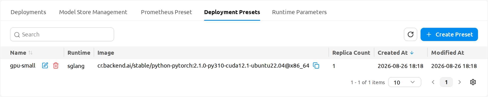
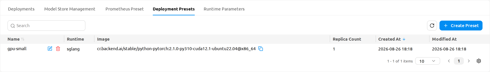
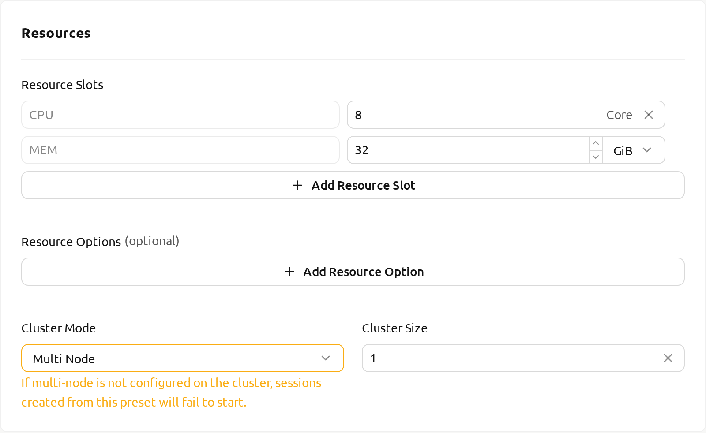
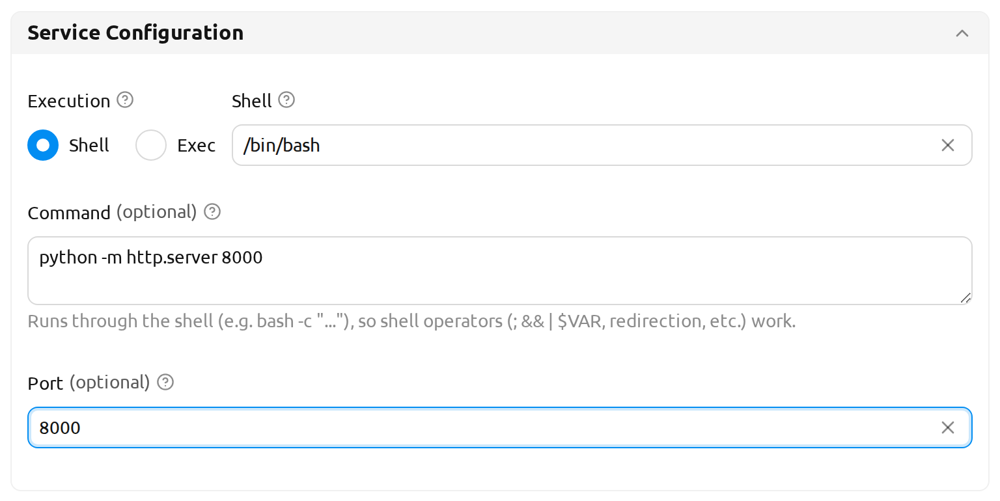
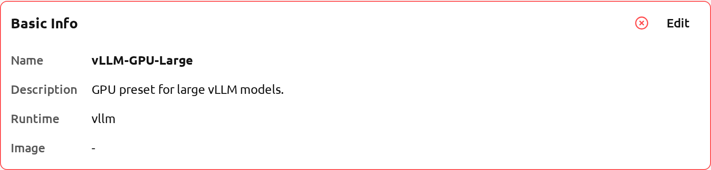
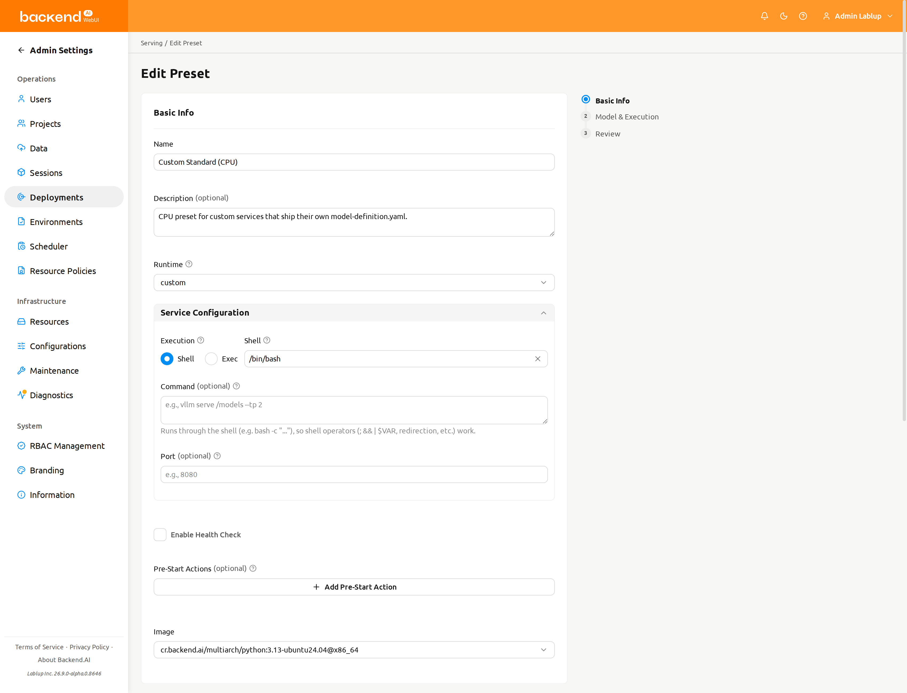
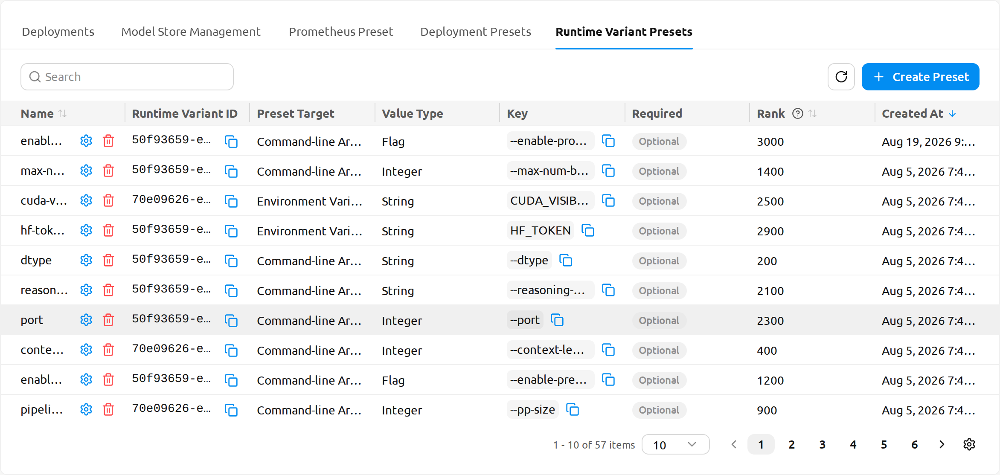
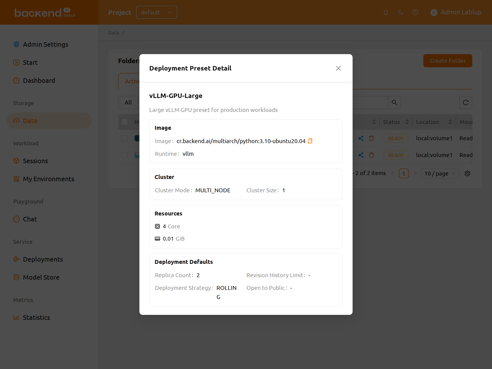
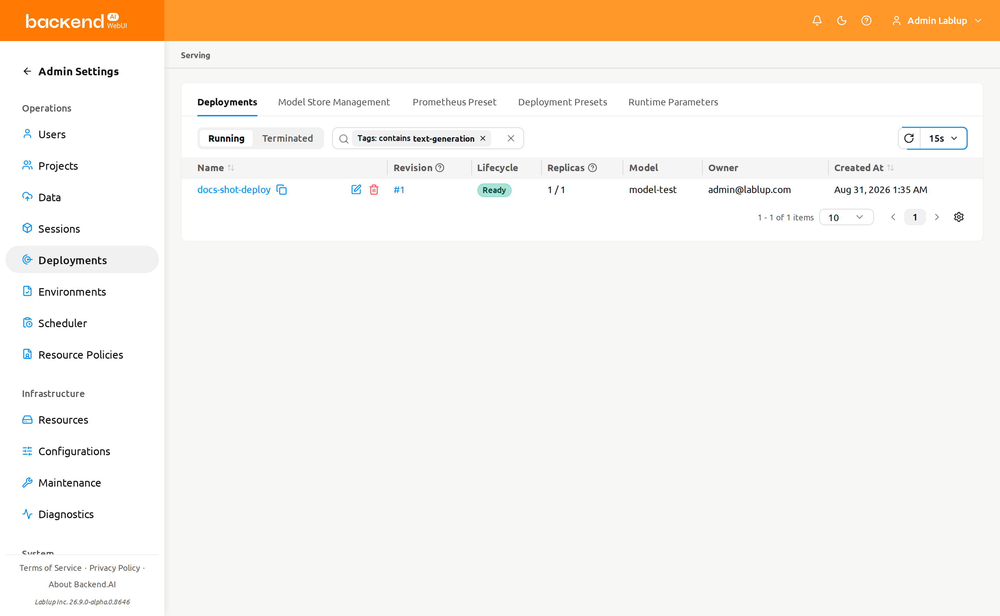

# Deployment Presets

A **Deployment Preset** is a reusable, administrator-curated bundle of deployment settings — image, runtime, resource slots, cluster mode, environment variables, startup command, replica count, visibility, and other defaults — that end users can apply when they create a model deployment from a storage folder. Presets let administrators publish a small set of vetted, known-good deployment shapes (for example, *vLLM-GPU-Large* or *SGLang-CPU-Small*) so that end users can deploy a model without having to choose every advanced field from scratch.

:::info
This page lives under the **Administration** section because only administrators can create, edit, and delete deployment presets. End users cannot manage presets themselves, but they can **apply** any preset that has been published to their project when they deploy a model. The two halves of this page reflect that split: [Managing Deployment Presets](#managing-deployment-presets) describes the admin workflow, and [Using a Preset When Deploying a Model](#using-a-preset-when-deploying-a-model) describes the end-user workflow. Preset-aware revision creation is also documented on the [Deployments](#model-serving) page.
:::

## What is a deployment preset?

A Deployment Preset captures the defaults of a model deployment so that:

- **Administrators** can offer end users a curated catalog of deployment shapes that match the organization's hardware and policy constraints.
- **End users** can pick a preset when deploying a model from the Data page (via the *Create New Deployment with Preset* flow) and skip filling in advanced fields manually.
- **Operators** can ensure that production deployments use consistent resource allocations, runtimes, and visibility defaults across the organization.

When a deployment is created from a preset, the preset's values pre-populate the deployment launcher fields. Users can still review and adjust those fields before confirming the deployment.

Each preset stores the following deployment defaults:

- **Basic Info**: Name, description, runtime variant, rank (display ordering).
- **Image**: The container image to deploy, shown in `<canonicalName>@<architecture>` format.
- **Runtime Parameters**: Serving-framework parameters for vLLM or SGLang runtimes (not shown for the Custom runtime).
- **Resources**: Resource slots (CPU, memory, GPU), shared memory (SHM), and resource options.
- **Cluster**: Cluster mode (Single Node or Multi Node) and cluster size.
- **Execution**: Startup command, environment variables, and bootstrap script.
- **Service Configuration**: Execution mode (Shell or Exec), shell, command, and port — stored for runtimes that read their configuration from the model folder, such as Custom.
- **Deployment Defaults**: Replica count, revision history limit, and the *Open to Public* visibility default.
- **Health Check**: Optional periodic health check, gated behind an *Enable Health Check* toggle.
- **Pre-Start Actions**: Actions to run before the model service starts.
- **Model Definition** (optional): The served model's name and path, plus optional metadata.

## Managing deployment presets

Only administrators can create, edit, or delete deployment presets. Administrators manage them from the **Deployment Presets** tab on the Admin Deployments page, at `/admin/deployments`.

The list view shows each preset with key fields. From this list, administrators can:

- Filter presets by name, runtime, or tag.
- Click a tag chip on any row to filter the list to presets sharing that tag.
- Open a preset's detail view to inspect its full configuration.
- Create, edit, or delete a preset.

The following columns are visible by default: **Name**, **Runtime**, **Image** (displayed as `<canonicalName>@<architecture>`, copyable), **Replicas**, **Created**, and **Modified** (shows when the preset was last updated).

Additional columns can be shown or hidden using the column visibility gear button (⚙) at the right of the table header: **Description**, **Startup Command** (truncated with a tooltip for long values, copyable), **Cluster**, **Strategy**, **Open to Public** (shown as a Public/Private tag), **Revision History Limit**, and **Rank** (sortable).

:::note[Preset page addresses]
Deployment preset pages belong to the admin scope, so their addresses all begin with `/admin`:

| Page | Address |
|---|---|
| Preset list | `/admin/deployments` (the **Deployment Presets** tab) |
| New preset | `/admin/deployments/deployment-presets/new` |
| Edit preset | `/admin/deployments/deployment-presets/{presetId}/edit` |

The end-user flow described in [Using a Preset When Deploying a Model](#using-a-preset-when-deploying-a-model) runs in the project scope instead, so the Data page you deploy a model from is at `/project/{project name}/data`. The segment after `/project/` is the project's **name**, not its ID.

Older flat links such as `/admin-deployments/deployment-presets/new` still work — they redirect to the scoped address above — so an existing bookmark does not break.
:::

### Create a deployment preset

1. Click the **Create Preset** button at the top right of the preset list. This opens the preset form at `/admin/deployments/deployment-presets/new`.
2. Fill in the fields. The form is a three-step wizard — **Basic Info**, **Model & Execution**, and **Review** — with the step list on the right and `Previous` / `Next` navigation at the bottom. Use `Skip to Review` to jump straight to the last step. The fields are organized into the following sections:

   - **Basic Info**:
      * **Name**: A unique preset name (for example, `vLLM-GPU-Large`).
      * **Description**: A short summary of the preset's intended use.
      * **Runtime**: The runtime variant (for example, vLLM, SGLang, or Custom).
      * **Rank**: Display ordering among presets of the same runtime. Lower values appear first.
   - **Image**: The container image to use when deploying. Images are listed in `<canonicalName>@<architecture>` format (for example, `cr.backend.ai/stable/pytorch:2.1-cuda12.1@aarch64`). This format helps distinguish images by CPU architecture on mixed-architecture clusters. The same format appears on the Review step.
   - **Runtime Parameters** (appears when a non-Custom runtime such as vLLM or SGLang is selected): Configure the serving framework parameters for this preset. Parameters are organized in tabs — for example, **Model Loading**, **Resource Memory**, **Serving Performance**, **Multimodal**, and **Tool Reasoning** for vLLM. Saved parameter values are applied when a deployment is created from this preset; parameters you leave unchanged will use the runtime's defaults when the deployment runs.
   - **Service Configuration** (appears when the selected runtime reads its configuration from the model folder, such as Custom): **Execution** (**Shell** or **Exec**), **Shell**, **Command** / **Command (argv)**, and **Port** — the same fields as the Add Revision modal, described in [Service configuration](#service-configuration) on the Deployments page. Leaving **Port** blank makes deployments created from this preset inherit the runtime variant's default port.

      :::note[Where the section appears]
      **Service Configuration**, **Health Check**, and **Pre-Start Actions** all sit on the **Basic Info** step, below the runtime fields, and are saved independently of the model definition.
      :::
   - **Resources**: Resource slots (CPU, memory, GPU), shared memory, and resource options (key/value pairs).
   - **Cluster**: Cluster mode (Single Node or Multi Node) and cluster size. New presets default to **Single Node**. Selecting **Multi Node** shows the warning *"If multi-node is not configured on the cluster, sessions created from this preset will fail to start."* — the warning does not block saving, so choose Multi Node only when your cluster is set up for it.
   - **Execution**: **Startup Command**, environment variables, and bootstrap script. The Startup Command field shows a shell-syntax hint (`Shell syntax: /bin/bash -c "cmd1; cmd2"`) because the command is executed as `/bin/bash -c <command>`. This means you can use shell operators such as `;`, `|`, and `&&` directly in the field.

      :::note[Startup Command is not the Command]
      The two commands are different, and each field carries its own description so they are easier to tell apart.

      | Field | Where it lives | What it does | Example |
      |---|---|---|---|
      | **Startup Command** | Execution section of the preset | *"The command that prepares the environment before the model framework starts (e.g., installing packages such as vllm)."* | `pip install vllm` |
      | **Command** (**Command (argv)** in Exec mode) | Service Configuration section of the preset | The command that starts the model serving process. | `vllm serve /models --tp 2` |

      Use **Startup Command** for preparation work — installing packages, fetching assets, writing config files. Use **Command** for the command that actually launches the serving framework. The placeholder text on each field shows an example of the right kind of command.
      :::
   - **Deployment Defaults**:
      * **Replica Count**: Default number of replicas created from this preset.
      * **Revision History Limit**: Number of past revisions kept for each deployment created from this preset.
      * **Open to Public**: Whether the endpoint of deployments created from this preset is reachable without an access token by default.
   - **Health Check**: This section has an **Enable Health Check** toggle, which is **off** by default. When the toggle is off, the health check fields are hidden. When you turn it on, the health check fields appear and become configurable: Path, Interval, Max Retries, Max Wait Time, Status Code, and Startup Grace Period.
   - **Pre-Start Actions**: Actions to execute before the model service starts. Click **Add Pre-Start Action** to add a row, then fill in **Action** and **Args (JSON)**.
   - **Model Definition** (optional): A switch in the card header turns the model definition on. When it is on, fill in **Model Name** and **Model Path** — both required — and, optionally, expand the **Metadata** section for the served model's title, author, version, license, description, task, category, architecture, framework, and labels.

   

   

3. On the **Review** step, check the summary and click `Create` to save. A success notification confirms the preset has been created.

:::tip
If a required field is missing or invalid, the submit button on the Review step stays disabled until the error is resolved. The Review card that contains the offending field is outlined in red with an error icon next to its **Edit** link, and the step it belongs to is marked as failed in the step list on the right — so you can see which step to go back to even for a field on a step you have not visited. Required fields show inline validation messages as you type.
:::

#### The Review step

The last step of the wizard is a read-only summary that mirrors every earlier step, grouped into the same cards you filled in. Each card has an **Edit** link that takes you back to the matching step and scrolls to that card.

The **Basic Info** card summarizes, in the order the fields appear on step 1:

- **Name**
- **Description** (only when the preset has one)
- **Runtime**: The runtime variant the preset uses, shown as its display name.
- **Image**: In `<canonicalName>@<architecture>` format.
- **Runtime Parameters** (only for a non-Custom runtime with configured values)
- **Shell**, **Command**, and **Port**: The service configuration values, shown only for a runtime that reads its configuration from the model folder. **Shell** is omitted in Exec mode, because no shell is used then.
- **Enable Health Check**, followed by the configured health check values when it is enabled.

The remaining cards summarize **Resources** (resource slots, resource options, cluster mode, cluster size), **Deployment** (replica count, revision history limit, Open to Public), and **Model & Execution** (startup command, bootstrap script, environment variables, and the model definition when enabled).

   The **Runtime** row appears when you create a preset **and** when you edit one, matching the fact that the runtime is editable on step 1 in both cases. Use it to confirm which runtime the preset will use before you save.

:::note[Required parameters in presets]
Administrators can mark individual Runtime Parameters as required. Required parameters display a red asterisk (★) next to the label. The save button stays disabled until all required parameters are filled in. Required parameter validation applies even to parameters on unvisited tabs.
:::

:::note
The **Enable Health Check** toggle also applies to the vLLM/SGLang Advanced Mode runtime parameters.
:::

### Edit a deployment preset

1. From the preset list, open the action menu on the preset row (or open the preset's detail view) and select **Edit Preset**.
2. The preset form opens at `/admin/deployments/deployment-presets/{presetId}/edit` with the preset's current values pre-filled. The steps and sections are identical to the create flow, including the **Runtime Parameters** section for vLLM and SGLang runtimes.
3. Adjust the fields as needed. On the **Review** step, confirm the summary — including the **Runtime** row — and click `Save` to store your changes.

Editing a preset only changes the defaults for **future** deployments. Existing deployments that were already created from this preset are not modified.

### Delete a deployment preset

1. From the preset list (or the preset's detail view), open the action menu on the preset and select **Delete Preset**.
2. A typed-confirmation dialog appears asking you to type the preset's name to confirm. The **OK** button stays disabled until the typed value matches the preset name exactly.
3. Type the preset's name, then click **OK** to confirm.

:::danger
Deleting a deployment preset is **irreversible**. The preset itself is removed, but deployments that were already created from it continue to run unaffected. Future deployments can no longer reference this preset.
:::

## Runtime variant presets

The **Runtime Variant Presets** tab on the Admin Deployments page (`/admin/deployments`) defines the individual parameters that a runtime variant exposes. Each entry describes one parameter — the key it is passed to the container as, its value type, its default, and how it is rendered — and together they make up the **Runtime Parameters** tabs that users fill in when they add a deployment revision (see [Runtime parameters](#runtime-parameters) on the Deployments page).

Above the table sit a property filter (**Name**, **Runtime Variant ID**), a refresh button, and the **Create Preset** button. The following columns are shown by default:

- **Name**: The parameter preset's name. This column also carries the per-row edit and delete buttons.
- **Runtime Variant** and **Runtime Variant ID**: The runtime the parameter belongs to.
- **Preset Target**: How the value reaches the container — **Environment Variable** or **Command-line Argument**.
- **Value Type**: **String**, **Integer**, **Float**, **Boolean**, or **Flag**.
- **Key**: The environment variable name or command-line argument the value is passed as (copyable).
- **Required**: Whether the parameter must be supplied when a revision is built from this runtime.
- **Rank**: Display ordering among presets of the same runtime variant. Lower values are shown first.
- **Created At**: When the preset was created.

**Description**, **Category**, **Display Name**, **Default Value**, and **Modified At** are hidden by default and can be shown with the column visibility gear button (⚙) at the right of the table header.

:::note
The **Runtime Variant**, **Display Name**, and **Category** columns — and the UI metadata fields described below — are only available on servers that support runtime variant preset UI metadata. On an older server they do not appear at all.
:::

### Create or edit a runtime variant preset

Click **Create Preset** above the table to open the **Create Preset** modal, or the edit button on a row to open **Edit Preset** with the current values pre-filled. The runtime variant of an existing preset cannot be changed.

<!-- TODO(screenshot): /admin/deployments -> Runtime Variant Presets tab -> Create Preset modal, showing the UI Type selector and its Choices rows. The capture environment ran manager 26.8.0rc1, which does not serve the runtime-variant-preset UI metadata fields. -->

The modal contains the following fields, in the order they appear:

- **Runtime Variant**: The runtime this parameter belongs to. Required.
- **Name**: A readable name for the parameter, for example `Tensor Parallel Size`. Required.
- **Description**: What the parameter controls and how it affects inference behavior. Shown as the field's tooltip in the deployment form.
- **Category**: The UI category used to organize related parameters together. Categories become the tabs of the **Runtime Parameters** section, so parameters sharing a category are shown on the same tab. The field is free text; categories already in use are listed in its placeholder as a hint.
- **Display Name**: The human-readable label shown in place of the parameter name in the deployment form.
- **Preset Target**: **Environment Variable** or **Command-line Argument**. Required.
- **Value Type**: **String**, **Integer**, **Float**, **Boolean**, or **Flag**. Required.
- **Key**: The environment variable name or command-line argument the value is passed as, for example `TENSOR_PARALLEL_SIZE`. Required.
- **Default Value**: The value the runtime uses when the user leaves the parameter unchanged. It is shown as the field's placeholder in the deployment form rather than pre-filled, so a required parameter still asks for an explicit value.
- **UI Type**: The control used to render this parameter in the deployment form. Leave it empty to render the parameter as a plain text input. Choosing a type reveals its own settings:
   * **Text Input**: **Input Placeholder** — the hint text shown while the field is empty.
   * **Number Input**: **Minimum** and **Maximum**. A value outside the range is reported as a validation error on the deployment form.
   * **Checkbox**: No additional settings.
   * **Select**: **Choices** — one **Value** / **Label** row per option. Click **Add Choice** to add a row and the trash button to remove one; at least one choice is required.
   * **Slider**: **Minimum** and **Maximum** (both required, and the maximum must be greater than the minimum) and **Step**, the increment the slider moves by (defaults to `1`).
- **Required**: Whether users must supply this parameter when they build a revision. Required parameters show a red asterisk (★) in the deployment form.
- **Rank** *(edit only)*: Display ordering among presets of the same runtime variant. Lower values are shown first.

Click `Create` (or `Save` when editing) to store the preset. A notification confirms that the runtime variant preset has been created or updated, and the list refreshes.

### Delete a runtime variant preset

Click the delete button on the preset row. A typed-confirmation dialog appears asking you to type the preset's name; the **Delete** button stays disabled until the typed value matches exactly.

:::danger
Deleting a runtime variant preset is **irreversible**. The parameter disappears from the **Runtime Parameters** section of every deployment form that uses this runtime variant.
:::

## Using a preset when deploying a model

End users apply a deployment preset through the **VFolder Deploy** modal, which opens when you deploy a model from a storage folder on the Data page.

1. From the Data page, locate the model folder you want to deploy and click **Deploy as Service**.
2. The VFolder Deploy modal opens, listing the deployment presets available for your project.
3. Click a preset row to open its **Deployment Preset Detail** view. The detail view shows every field that the preset will apply when used — image, runtime, resources, cluster mode, replica count, visibility, and so on. The detail view also includes a **Health Check** card:
   - When health check is enabled in the preset: the card shows **Enabled** along with the configured Path, Interval, Max Retries, Max Wait Time, Expected Status Code, and Startup Grace Period.
   - When health check is disabled: the card shows **Disabled**.

   

4. From the detail view, choose how to proceed:

   - **Auto-deploy**: Create the deployment immediately using the preset's values as-is. This is the fastest path; the deployment is created in one click with no further input required.
   - **Manual deploy** (*Create New Deployment with Preset*): Open the deployment launcher with all fields pre-populated from the preset, so you can review and adjust before confirming.

## Pre-populated launcher fields

When you choose the manual-deploy path, the deployment launcher opens with every field pre-filled from the selected preset:

- Image, runtime variant, and resource group.
- Resource slots, shared memory, and resource options.
- Cluster mode and cluster size.
- Startup command and environment variables.
- Replica count, revision history limit, and **Open to Public** visibility.
- Auto-selected resource preset, which is preserved across the launcher's initial-value resolution.

You can edit any pre-populated field before deploying. Editing a field does **not** modify the underlying preset — it only changes the values used for this one deployment. The preset's defaults remain unchanged for future deployments.

:::tip
If the auto-selected resource preset is the right one for your workload, leave it as-is. The launcher preserves the auto-selection across the initial-values pass, so you do not need to re-select it after switching presets.
:::

## Filtering by tags

Both the user-facing preset list and the admin preset list support **clickable tag chips** that filter the list to presets sharing the clicked tag.

1. Locate a preset row that has the tag you want to filter by.
2. Click the tag chip on that row.
3. The list refreshes to show only presets that include the selected tag. The active filter is reflected in the filter bar; clear it to return to the full list.

This is useful when you have many presets and want to quickly narrow down to, for example, all GPU-backed presets or all presets for a specific runtime family.
