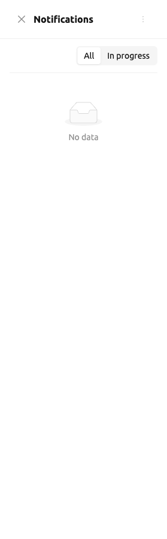
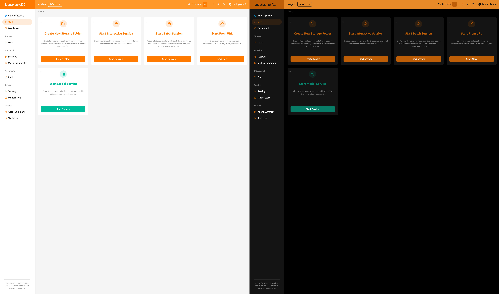
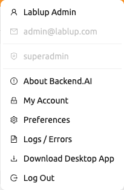
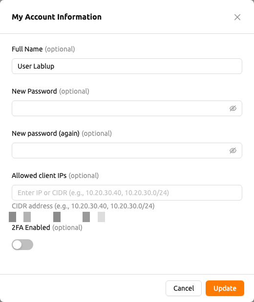
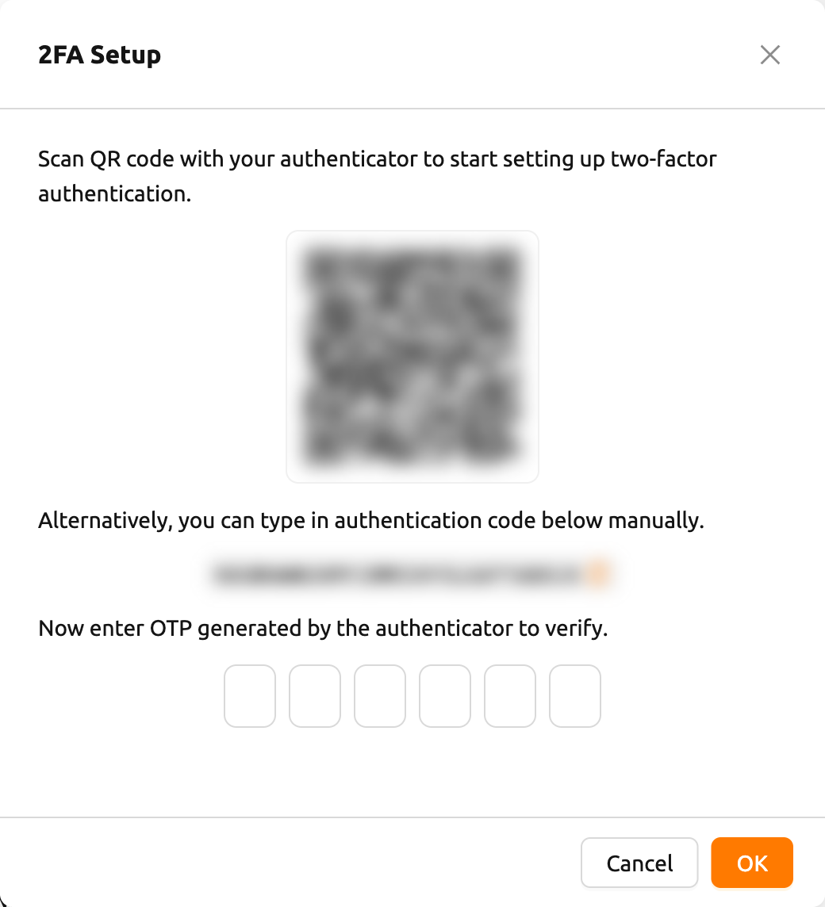
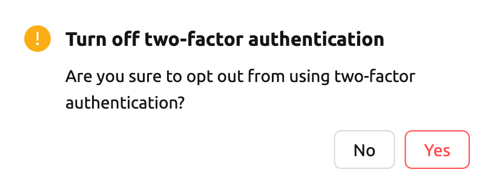

# Top Bar Features

The top bar includes various features that support use of the WebUI.

## Project Selector

Users can switch between projects using the project selector provided in the top bar.
By default, the project that the user currently belongs to is selected.
Since each project may have different resource policies, switching projects may also change the available resource policies.

## Login Session Timer

When login session management is enabled, the top bar displays the remaining
time until automatic logout along with an extend button. The timer shows the
time in `HH:mm:ss` format (or includes a day count if longer than 24 hours).

Click the extend button (repeat icon) next to the timer to reset the session
expiration and extend your login session.

:::note
The login session timer is only visible when the server supports login session
extension and it has been enabled in the system configuration.
:::

## Notification

The bell shape button is the event notification button.
Events that need to be recorded during WebUI operation are displayed here.
When background tasks are running, such as creating a compute session,
you can check the jobs here.
Press the shortcut key (`]`) to open and close the notification area.

## Theme Mode

You can change the theme mode of the WebUI via the dark mode button on the
right side of the header.

## Help

Click the question mark button to access the web version of this guide document.
You will be directed to the appropriate documentation based on the page you are currently on.

## Responsive Layout

On smaller screens, the top bar adjusts its layout for better usability. When
the screen width is narrow, the sidebar toggle is replaced with a menu icon
button in the top bar. The user's display name may also be hidden, showing only
the avatar icon for the user menu. The project label text is hidden on very
small screens.

## User Menu

Click the user icon on the right side of the top bar to see the user menu.

At the top of the dropdown, the following user information is displayed for
reference. These items are not clickable.

- **Full name**: The current user's full name.
- **Email**: The current user's email address.
- **Role**: The current user's role (e.g., user, domain admin, superadmin).

Below the user information, the following action items are available.

- `About Backend.AI`: Displays information such as the version of Backend.AI WebUI,
  license type, etc.
- `My Account`: Check and update information of the current logged-in user.
- `Preferences`: Go to the user settings page.
- `Logs / Errors`: Go to the logs tab in the user settings page. You can check
  the log and error history recorded on the client side.
- `Download Desktop App`: Download the stand-alone WebUI app for your platform.
  This option is only visible when enabled by the administrator.
- `Log Out`: Log out of the WebUI.

### My Account

If you click `My Account`, the My Account Information dialog appears.

Each item has the following meaning. Enter the desired value and click the
`UPDATE` button to update your information.

- **Full Name**: User's name (up to 64 characters).
- **New password**: New password (8 characters or more containing at least 1
  alphabet, number, and symbol). Click the eye icon to reveal the input.
- **New password (again)**: Re-enter the new password for confirmation.
- **Allowed client IPs**: Restrict login access to specific IP addresses or CIDR
  ranges. Enter one or more IP addresses or CIDR notations (e.g.,
  `10.20.30.40`, `10.20.30.0/24`). Below the field, your current client IP
  address is displayed with a copy button for convenience. If the configured
  list does not include your current IP, a warning is shown.
- **2FA Enabled**: Enable or disable two-factor authentication. When enabled,
  you must enter an OTP code at login.

:::note
The **Allowed client IPs** field is available when the server supports the V2
user update API.
:::

:::note
Depending on the plugin settings, the `2FA Enabled` field might not be visible.
In that case, please contact the administrator of your system.
:::

### 2FA Setup

If you activate the `2FA Enabled` switch, the following dialog appears.

Turn on the 2FA application you use and scan the QR code or manually enter the verification
code. There are many 2FA-enabled applications, such as Google Authenticator, 2STP, 1Password,
and Bitwarden.

Then enter the 6-digit code from the item added to your 2FA application into the dialog above.
2FA is activated when you press the `CONFIRM` button.

When you log in later, if you enter an email and password, an additional field appears asking
for the OTP code.

To log in, you must open the 2FA application and enter a 6-digit code in the One-time password field.

If you want to disable 2FA, turn off the `2FA Enabled` switch and click the confirm button in the
following dialog.
