# Top Bar Features

The top bar includes various features that support use of the WebUI.

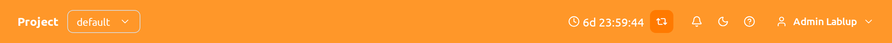

## Project selector

Users can switch between projects using the project selector provided in the top bar.
By default, the project that the user currently belongs to is selected.
Since each project may have different resource policies, switching projects may also change the available resource policies.

The selector lists the projects you can access. If you open an address that names a
project which does not exist or which you cannot access, the project selector
shows no selection and the page explains what happened instead of silently
switching you to another project.

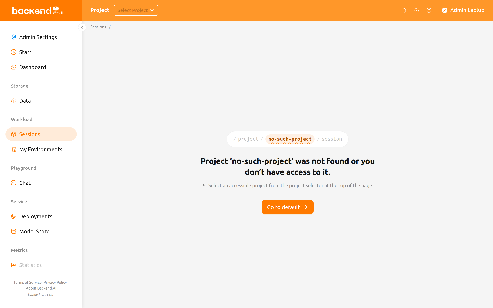

- The message reads `Project ‘<name>’ was not found or you don’t have access to it.`
- Below it, a hint asks you to select an accessible project from the project
  selector at the top of the page.
- A `Go to <project>` button takes you to a project you can access.

If you do not belong to any project, the page shows
`No accessible projects.` together with
`Ask your administrator to grant you access to a project.`

:::note
The project selector is not shown on the administration pages under
**Admin Settings** (addresses starting with `/admin/`). Those pages work across
all projects instead of within one, so the top bar hides the selector while you
are on them. Your selection is left untouched — when you leave an administration
page, the project you had selected before is still selected. Where an
administration page does need a project, the page or its dialog asks for one
explicitly: for example, the folder creation dialog on the administration Data
page has a **Target Project** field, and the image install dialog has an
**Install Session Project** field.
:::

## Login session timer

When login session management is enabled, the top bar displays the remaining
time until automatic logout along with an extend button. The timer shows the
time in `HH:mm:ss` format (or includes a day count if longer than 24 hours).

Click the extend button (repeat icon) next to the timer to reset the session
expiration and extend your login session.

:::note
The login session timer is only visible when the server supports login session
extension and it has been enabled in the system configuration.
:::

## Notification

The bell shape button is the event notification button.
Events that need to be recorded during WebUI operation are displayed here.
When background tasks are running, such as creating a compute session,
you can check the jobs here.
Press the shortcut key (`]`) to open and close the notification area.

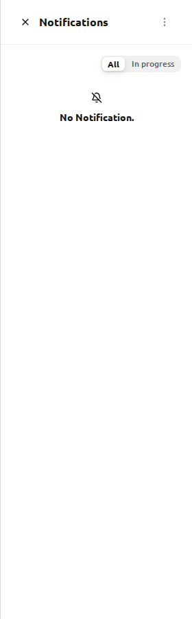

## Display mode

You can change the display mode of the WebUI via the light/dark mode button.

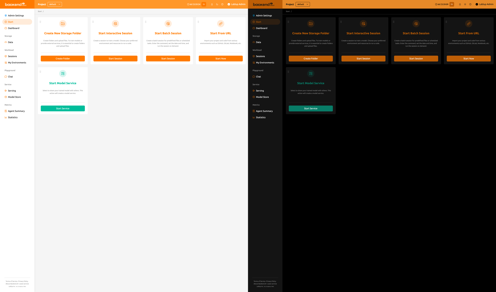

## Help

Click the question mark button to access the web version of this guide document.
The link is built to match the WebUI you are using.

## Responsive layout

On smaller screens, the top bar adjusts its layout for better usability. When
the screen width is narrow, the sidebar toggle is replaced with a menu icon
button in the top bar. The user's display name may also be hidden, showing only
the avatar icon for the user menu. The project label text is hidden on very
small screens.

Tapping the menu icon opens a navigation drawer that slides in from the side and
contains the same menu as the sidebar, topped by a brand-colored header with the
Backend.AI logo. Close the drawer with the close button in its header or by
tapping the area outside it; selecting a menu item also closes it as soon as the
page changes.

## User menu

Click the user icon on the right side of the top bar to see the user menu.

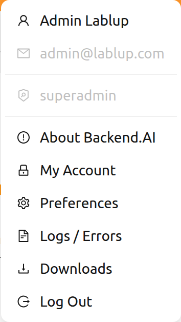

At the top of the dropdown, the following user information is displayed for
reference. These items are not clickable.

- **Full name**: The current user's full name.
- **Email**: The current user's email address.
- **Role**: The current user's role (e.g., user, superadmin).

Below the user information, the following action items are available.

- `About Backend.AI`: Displays information such as the version of Backend.AI WebUI,
  license type, etc.
- `My Account`: Check and update information of the current logged-in user.
- `Preferences`: Go to the user settings page.
- `Logs / Errors`: Go to the logs tab in the user settings page. You can check
  the log and error history recorded on the client side.
- `Downloads`: Open the Downloads dialog, where you can get the stand-alone
  WebUI desktop app and the Backend.AI command-line interface (CLI). This option
  is only visible when the administrator has enabled at least one of the two.
- `Log Out`: Log out of the WebUI.

### My account

If you click `My Account`, the My Account Information dialog appears.

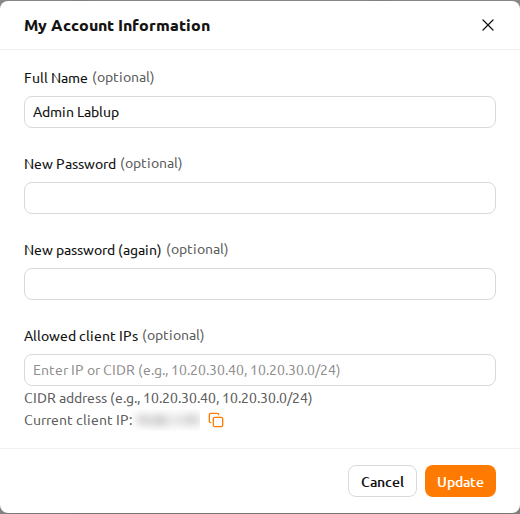

Each item has the following meaning. Enter the desired value and click the
`Update` button to update your information.

- **Full Name**: User's name (up to 64 characters).
- **New password**: New password (8 characters or more containing at least 1
  alphabet, number, and symbol). Click the eye icon to reveal the input.
- **New password (again)**: Re-enter the new password for confirmation.
- **Allowed client IPs**: Restrict login access to specific IP addresses or CIDR
  ranges. Enter one or more IP addresses or CIDR notations (e.g.,
  `10.20.30.40`, `10.20.30.0/24`). Below the field, your current client IP
  address is displayed with a copy button for convenience. If the configured
  list does not include your current IP, a warning is shown.
- **2FA Enabled**: Enable or disable two-factor authentication. When enabled,
  you must enter an OTP code at login.

:::note
Depending on the plugin settings, the `2FA Enabled` field might not be visible.
In that case, please contact the administrator of your system.
:::

### 2FA setup

If you activate the `2FA Enabled` switch, the following dialog appears.

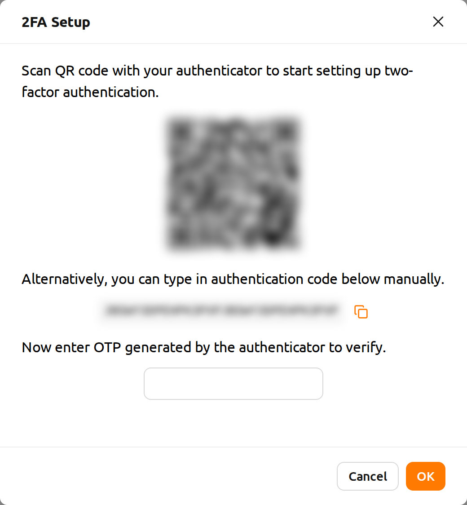

Turn on the 2FA application you use and scan the QR code or manually enter the verification
code. There are many 2FA-enabled applications, such as Google Authenticator, 2STP, 1Password,
and Bitwarden.

Then enter the 6-digit code from the item added to your 2FA application into the dialog above.
2FA is activated when you press the `OK` button.

When you log in later, if you enter an email and password, an additional field appears asking
for the OTP code.

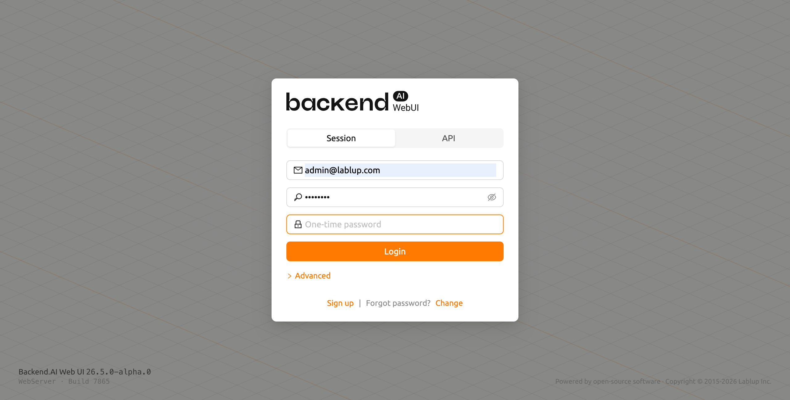

To log in, you must open the 2FA application and enter a 6-digit code in the One-time password field.

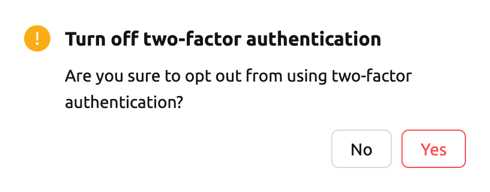

If you want to disable 2FA, turn off the `2FA Enabled` switch and click the confirm button in the
following dialog.

### Downloads

Selecting `Downloads` opens a dialog with one tab for each download the
administrator has enabled: `Desktop App` and `CLI`.

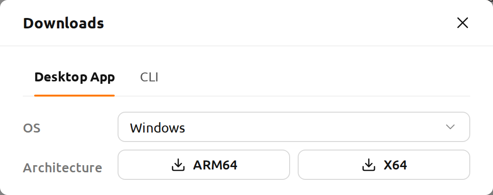

On the `Desktop App` tab, select your operating system in the **OS** field, then
click the button for your CPU architecture to start the download. The
stand-alone app gives you the same WebUI outside a browser.

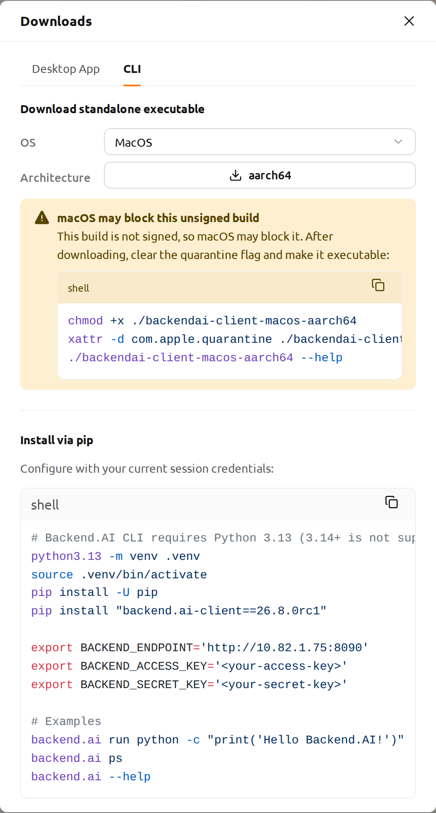

The `CLI` tab offers two ways to start using the command-line client:

- **Download standalone executable**: Select your operating system, then click
  the button for your CPU architecture. Linux and macOS builds are offered.
  After downloading, run the commands shown below the buttons to make the file
  executable and, optionally, install it as `backend.ai` on your `PATH`. On
  macOS, the dialog instead shows how to clear the quarantine flag first,
  because the build is not signed yet.
- **Install via pip**: A ready-to-run snippet that creates a Python virtual
  environment, installs the client version matching the server you are connected
  to, and sets the environment variables the client needs. Use the copy button at
  the top right of the snippet to copy the whole block.

:::note
The snippet fills in the endpoint of your current session, but never your
credentials. Replace `<your-access-key>` and `<your-secret-key>` with your own
keypair before running it. The snippet also pins Python 3.13, which the client
requires.
:::
