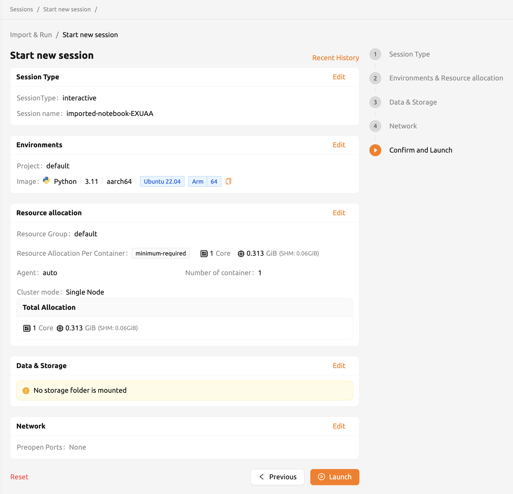
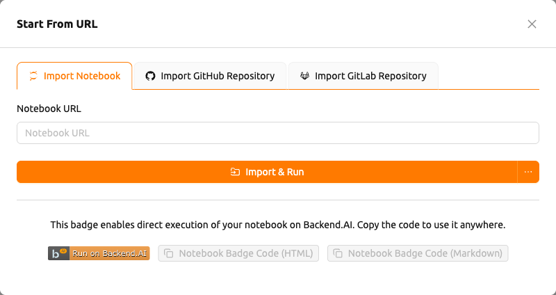
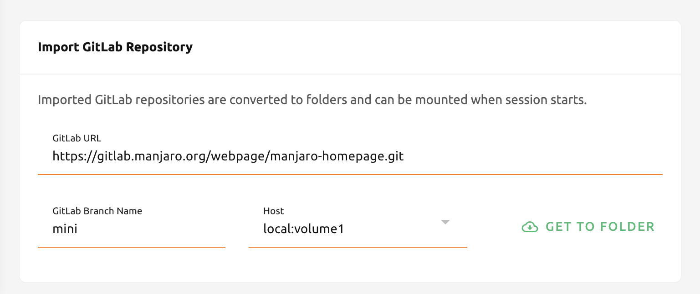

# Import & Run Notebooks and Web-Based Git Repositories

On the Import & Run page, Backend.AI supports executing Jupyter notebook files and importing web-based Git repositories
such as GitHub and GitLab on the fly. You don't need to create or download into your local storage
and re-upload it. The only thing you have to do is input a valid URL you want to execute or import,
and click the button on the right side.

## Import and Run Jupyter Notebooks

To import and run Jupyter notebooks, you need the valid URL for the notebook file.
For example, if you want to execute a Jupyter notebook on GitHub, you can copy and paste
the URL and click the `Import & Run` button.

:::note
When you try to import and run a Jupyter notebook file with a local address,
it will be regarded as invalid. You must input a URL that does not start with `localhost`.
:::

After clicking the `Import & Run` button, a session is created directly with default settings.
You do not need to configure the session launcher manually. The notebook file is automatically
downloaded into the session via the URL you provided.

If you want to customize the environment or resource allocation before launching, click the
dropdown button next to `Import & Run` and select `Start with options`. This opens the full
session launcher page where you can adjust settings before starting the session.

:::note
The pop-up blocker must be turned off to immediately see the running notebook window.
Also, if there are not enough resources to execute the session, the imported Jupyter
notebook will not run.
:::

You can see the importing operation is successfully completed on the Sessions page.

## Create Executable Jupyter Notebook Badge

You can also create an HTML or Markdown badge for a Jupyter notebook URL.
Input a valid Jupyter notebook URL and click the `Notebook Badge Code (HTML)` or
`Notebook Badge Code (Markdown)` copy button to copy the badge code to your clipboard.
The badge code creates a link that directly opens a session with the notebook.
You can use the badge code by inserting it in GitHub repositories or anywhere that supports HTML or Markdown.

:::note
Your account must be logged in before clicking the button. Otherwise, you have to log in first.
:::

## Importing GitHub Repositories

Importing a GitHub repository is similar to importing and running a Jupyter notebook.
All you have to do is fill in the GitHub repository URL, select a storage host from the
`Storage Host` dropdown, and click the `Get To Folder` button.

Clicking `Get To Folder` automatically creates a storage folder with the repository name
and starts a batch session to download and extract the repository contents into it.

:::note
If there are not enough resources to start a session or folder count is at
the limit, then importing the repository will fail. Please check the resource
statistics panel and Data & Storage page before importing the repository.
:::

You can see the repository is successfully imported as a storage folder with its
name.

## Importing GitLab Repositories

From 22.03, Backend.AI supports importing from GitLab. It's almost the same as
[Importing GitHub Repositories](#importing-github-repositories),
but you need to explicitly set the branch name to import.

:::note
If there's a storage folder that has the same name already, the system will append
`_` (underscore) and number in the imported repository folder.
:::
