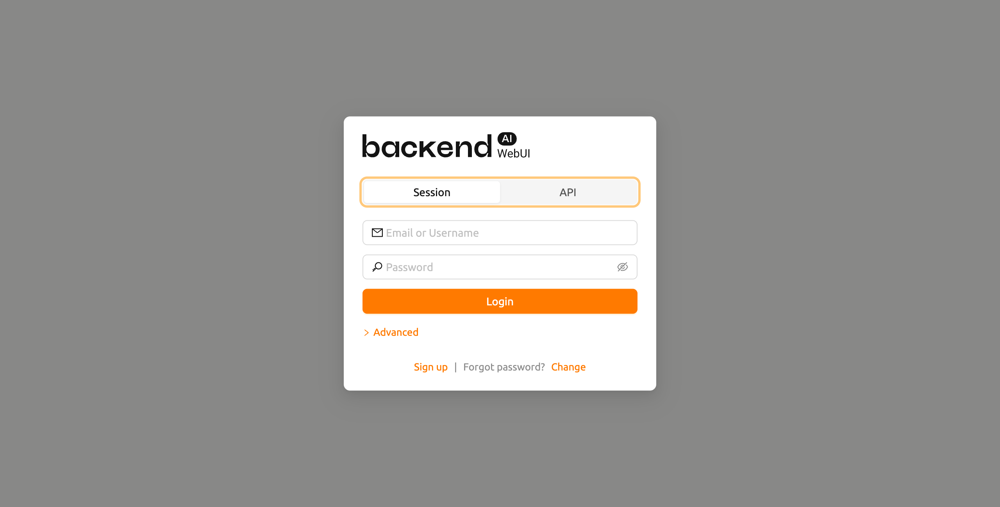
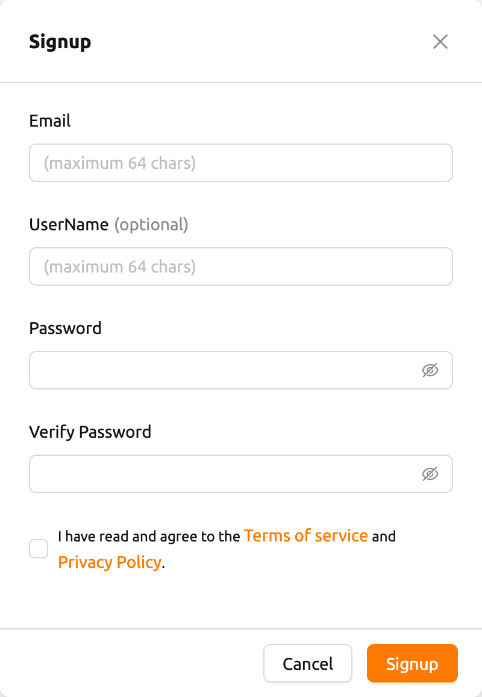
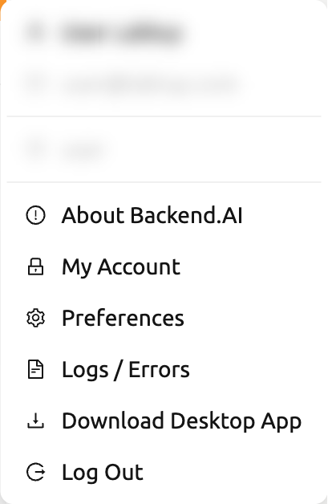
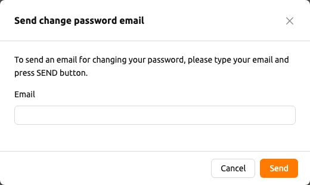
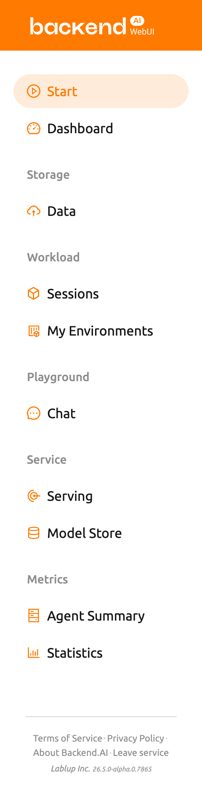

# Sign up and Log in

## Sign up

When you launch the WebUI, log in dialog appears. If you haven't signed up
yet, press the SIGN UP button.

Enter the required information, read and agree to the Terms of Service /
Privacy Policy, and click the SIGNUP button. Depending on your system settings,
you may need to enter an invitation token to sign up. A verification email may
be sent to verify that the email is yours. If the verification email is sent, you
will need to read the email and click the link inside to pass verification
before you can log in with your account.

   Depending on the server configuration and plugin settings, signing up by
   anonymous user may not be allowed. In that case, please contact administrator
   of your system.

   To prevent malicious users from guessing user's password, password should be longer
   than 8 characters with at least one alphabet(s), number(s), and special
   character(s).

## Log in

Enter your ID and password and press the LOGIN button. In API ENDPOINT, the URL
of Backend.AI Webserver, which relays the request to the Manager, should be
entered.

   Depending on the installation and setup environment of the Webserver,
   the endpoint might be pinned and not configurable.

   Backend.AI keeps the user's password securely through a one-way hash. BCrypt,
   the default password hash of BSD, is used, so even the server admins cannot
   know the user's password.

After logging in, you can check the information of the current resource usage in
the Summary tab.

By clicking the icon in the upper-right corner, you will see sub menus. You
can logout by selecting the Log Out menu.

## When you forgot your password

If you have forgotten your password, you can click the CHANGE PASSWORD button on
the log in panel to email a link to change password. You can change your password
by reading and following the instruction. Depending on the server settings, the
password change feature may be disabled. In this case, contact the
administrator.

   This is also a modular feature, so changing password may not be possible in
   some systems.

   If log in failure occurs more than 10 times consecutively, access
   to the endpoint is temporarily restricted for 20 minutes for security
   reasons. If the access restriction continues on more than 20 minutes, please contact
   your system administrator.

## Sidebar Menus

Change the size of the sidebar via the buttons on the right side of the sidebar.
Click it to significantly reduce the width of the sidebar, giving you a wider view of its contents.
Clicking it again will return the sidebar to its original width.
You can also use the shortcut key ( `[` ) to toggle between the narrow and original sidebar widths.

