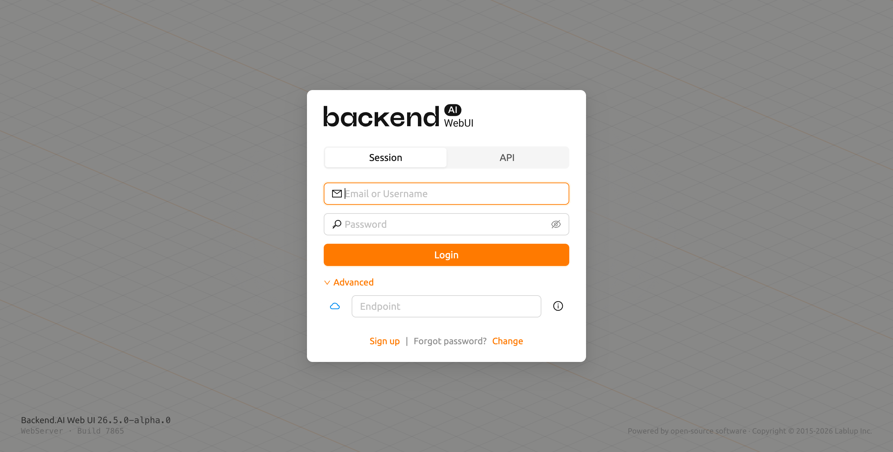
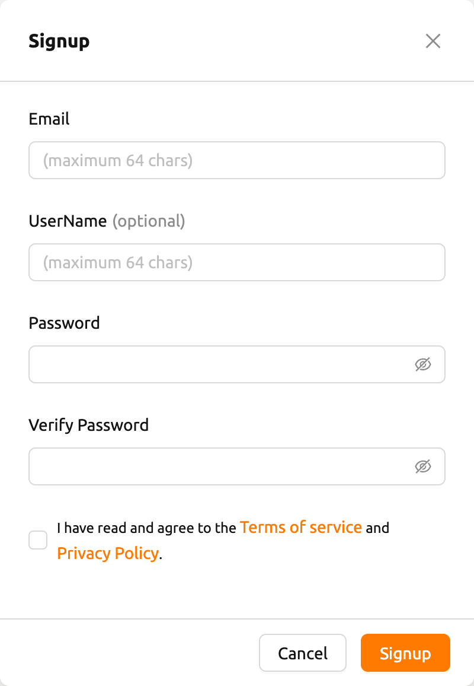
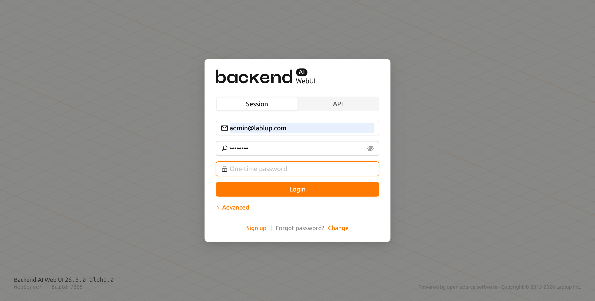
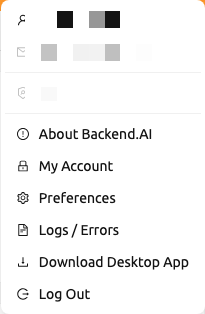
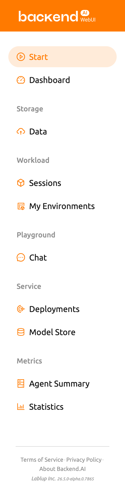

# Sign up and Log in

## Sign up

When you launch the WebUI, the login dialog appears. If you haven't signed up
yet, click the `Sign up` link at the bottom of the dialog.

Enter the required information, read and agree to the Terms of Service /
Privacy Policy, and click the SIGNUP button. Depending on your system settings,
you may need to enter an invitation token to sign up. A verification email may
be sent to verify that the email is yours. If the verification email is sent, you
will need to read the email and click the link inside to pass verification
before you can log in with your account.

:::note
Depending on the server configuration and plugin settings, signing up by
anonymous user may not be allowed. In that case, please contact the administrator
of your system.
:::

:::note
To prevent malicious users from guessing user's password, passwords must be longer
than 8 characters with at least one alphabet(s), number(s), and special
character(s).
:::

## Log in

Enter your email (or username) and password, then click the **Login** button.

### Connection Mode

If enabled by your administrator, a mode selector appears at the top of the
login dialog allowing you to choose between **Session** mode and **API** mode.

- **Session**: The standard login mode. Enter your email/username and password
  to authenticate. This is the default mode for most users.
- **API**: Log in using an API keypair. Enter your **API Key** and **Secret Key**
  instead of email and password. This mode is useful for programmatic access.

### API Endpoint

Click the **Advanced** link to expand the endpoint configuration section. In the
API Endpoint field, enter the URL of the Backend.AI Webserver that relays
requests to the Manager.

:::note
Depending on the installation and setup environment of the Webserver,
the endpoint might be pinned and not configurable.
:::

:::note
Backend.AI keeps the user's password securely through a one-way hash. BCrypt,
the default password hash of BSD, is used, so even the server admins cannot
know the user's password.
:::

### SSO Login (SAML / OpenID)

If your administrator has configured Single Sign-On (SSO), additional login
buttons may appear below the standard **Login** button:

- **Login with SAML**: Authenticate using your organization's SAML identity
  provider.
- **Login with [Realm Name]**: Authenticate using an OpenID Connect provider.
  The button label shows the realm name configured by your administrator.

Click the appropriate SSO button to be redirected to your organization's
identity provider for authentication.

:::note
SSO login options are only visible when enabled by your system administrator.
:::

### OTP Login (Two-Factor Authentication)

If two-factor authentication (2FA) is enabled for your account, an additional
OTP (One-Time Password) field appears after you enter your email and password.

Open your authenticator application (such as Google Authenticator, 1Password,
or Bitwarden) and enter the 6-digit code in the OTP field to complete login.

### TOTP Setup on First Login

If your administrator requires two-factor authentication and you have not yet
set up TOTP, a setup dialog will appear automatically after your first
successful login. Scan the QR code with your authenticator application or
manually enter the provided key, then enter the 6-digit verification code to
complete the setup.

After setting up TOTP, you will need to enter the OTP code on every subsequent
login.

:::note
For more details about enabling or disabling 2FA from your account settings,
refer to the [2FA Setup](#2fa-setup) section in Top Bar Features.
:::

After logging in, you can check the information of the current resource usage on
the Start page.

By clicking the user icon in the upper-right corner, you will see the user menu.
You can log out by selecting the **Log Out** menu item.

## When You Forgot Your Password

If you have forgotten your password, click the **Forgot password?** text and
then the **Change** link on the login panel. A dialog will appear where you can
enter your email address to receive a password change link. Follow the
instructions in the email to reset your password.

:::note
Depending on the server configuration, the password change feature may not be
available. In that case, contact your administrator.
:::

:::warning
If login failure occurs more than 10 times consecutively, access
to the endpoint is temporarily restricted for 20 minutes for security
reasons. If the access restriction continues after 20 minutes, please contact
your system administrator.
:::

## Sidebar Menus

Change the size of the sidebar via the buttons on the right side of the sidebar.
Click it to significantly reduce the width of the sidebar, giving you a wider view of its contents.
Clicking it again will return the sidebar to its original width.
You can also use the shortcut key ( `[` ) to toggle between the narrow and original sidebar widths.

