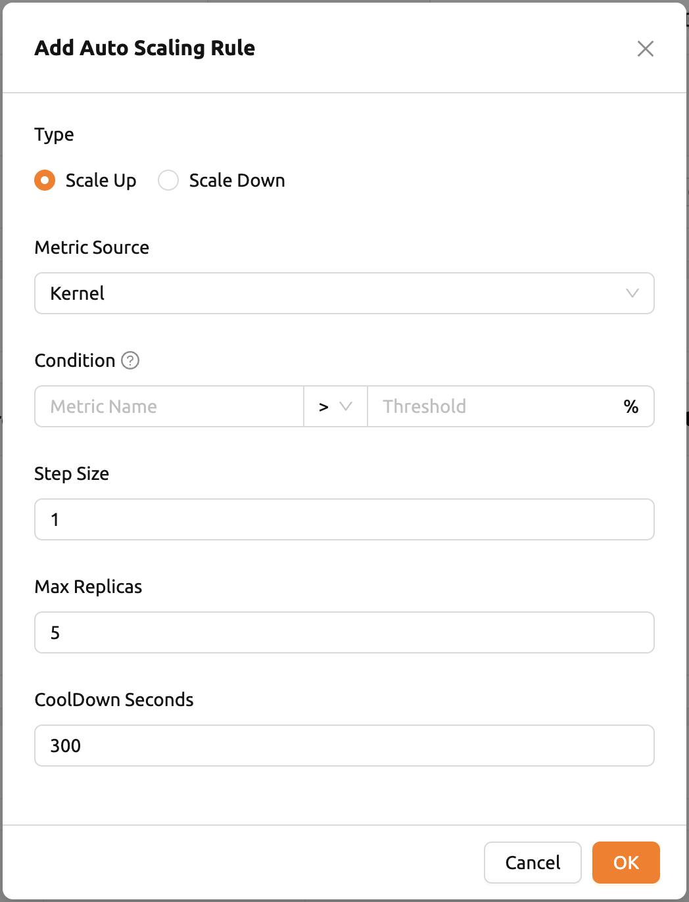
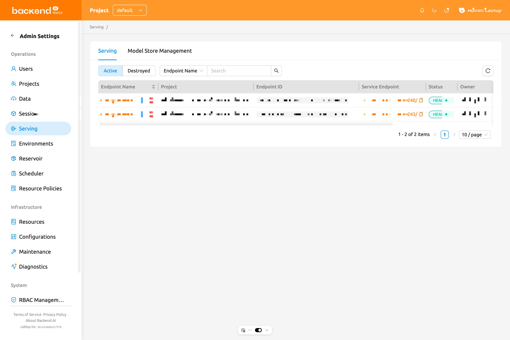
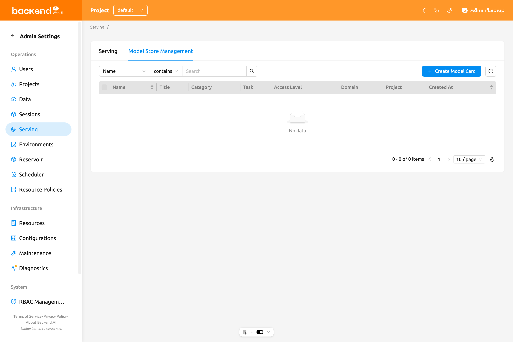
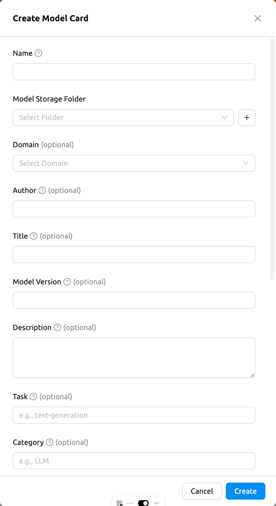

# Model Serving

## Model Service

:::note
This feature is supported in Enterprise version only.
:::

Backend.AI not only facilitates the construction of development environments
and resource management during the model training phase, but also supports
the model service feature from version 23.09 onwards. This feature allows
end-users (such as AI-based mobile apps and web service backends) to make
inference API calls when they want to deploy the completed model as an
inference service.


The Model Service extends the functionality of the existing training
compute sessions, enabling automated maintenance, scaling, and permanent
port and endpoint address mapping for production services. Developers or
administrators only need to specify the scaling parameters required for
the Model Service, without the need to manually create or delete compute
sessions.

<details>
<summary>Model Service in Version 23.03 and Earlier</summary>

Although the model serving-specific feature is officially supported from
version 23.09, you can still use model service in earlier versions.

For example, in version 23.03, you can configure a model service by
modifying the compute session for training in the following way:

1. Add pre-opened ports during session creation to map the running
   server port inside the session for model serving.
   (For instructions on how to use preopen ports, refer to [Set Preopen Ports](#set-preopen-ports).)

2. Check 'Open app to public' to allow the service mapped to the
   pre-opened port to be publicly accessible.
   (For detailed information about "Open app to public," refer to [Open app to public](#open-app-to-public).)

However, there are certain limitations in version 23.03:

-  Sessions do not automatically recover if they are terminated due to
   external factors such as idle timeout or system errors.
-  The app port changes every time a session is restarted.
-  If sessions are repeatedly restarted, the idle ports may be
   exhausted.

The official Model Service feature in version 23.09 resolves these
limitations. Therefore, starting from version 23.09, it is recommended
to create/manage Model Services through the model serving menu whenever
possible. The use of pre-opened ports is recommended only for
development and testing purposes.

</details>

## Guide to Steps for Using Model Service

To use the Model Service, you need to follow the steps below:

1. Create a model definition file.
2. Create a service definition file.
3. Upload the definition files to the model type folder.
4. Create/Validate the Model Service using the service launcher.
5. (If the Model Service is not public) Obtain a token.
6. (For end users) Access the endpoint corresponding to the Model
   Service to verify the service.
7. (If needed) Modify the Model Service.
8. (If needed) Terminate the Model Service.

:::tip
As an alternative workflow, you can browse pre-configured models in the
[Model Store](#model-store) and deploy them with a single click using the
`Run this model` button.
:::

<a id="model-definition-guide"></a>

### Creating a Model Definition File

:::note
From 24.03, you can configure model definition file name. But if you don't
input any other input field in model definition file path, then the system will
regard it as `model-definition.yml` or `model-definition.yaml`.
:::

The model definition file contains the configuration information
required by the Backend.AI system to automatically start, initialize,
and scale the inference session. It is stored in the model type folder
independently from the container image that contains the inference
service engine. This allows the engine to serve different models based on
specific requirements and eliminates the need to build and deploy a new
container image every time the model changes. By loading the model
definition and model data from the network storage, the deployment
process can be simplified and optimized during automatic scaling.

The model definition file follows the following format:

```yaml
models:
  - name: "simple-http-server"
    model_path: "/models"
    service:
      start_command:
        - python
        - -m
        - http.server
        - --directory
        - /home/work
        - "8000"
      port: 8000
      health_check:
        path: /
        interval: 10.0
        max_retries: 10
        max_wait_time: 15.0
        expected_status_code: 200
        initial_delay: 60.0
```

**Key-Value Descriptions for Model Definition File**

:::note
Fields without "(Required)" mark are optional.
:::

- `name` (Required): Defines the name of the model.
- `model_path` (Required): Addresses the path of where model is defined.
- `service`: Item for organizing information about the files to be served
  (includes command scripts and code).

   - `pre_start_actions`: Actions to be executed before the `start_command`. These actions
     prepare the environment by creating configuration files, setting up directories, or
     running initialization scripts. Actions are executed sequentially in the order defined.

      - `action`: The type of action to perform. See [Prestart Actions](#prestart-actions)
        for available action types and their parameters.
      - `args`: Action-specific parameters. Each action type has different required arguments.

   - `start_command` (Required): Specify the command to be executed in model serving.
     Can be a string or a list of strings.
   - `port` (Required): Container port for the model service (e.g., `8000`, `8080`).
   - `health_check`: Configuration for periodic health monitoring of the model service.
     When configured, the system automatically checks if the service is responding correctly
     and removes unhealthy instances from traffic routing.

      - `path` (Required): HTTP endpoint path for health check requests (e.g., `/health`, `/v1/health`).
      - `interval` (default: `10.0`): Time in seconds between consecutive health checks.
      - `max_retries` (default: `10`): Number of consecutive failures allowed before marking
        the service as `UNHEALTHY`. The service continues receiving traffic until this threshold is exceeded.
      - `max_wait_time` (default: `15.0`): Timeout in seconds for each health check HTTP request.
        If no response is received within this time, the check is considered failed.
      - `expected_status_code` (default: `200`): HTTP status code that indicates a healthy response.
        Common values: `200` (OK), `204` (No Content).
      - `initial_delay` (default: `60.0`): Time in seconds to wait after container creation
        before starting health checks. This allows time for model loading, GPU initialization,
        and service warmup. Set higher values for large models (e.g., `300.0` for 70B+ LLMs).


**Understanding Health Check Behavior**

The health check system monitors individual model service containers and automatically
manages traffic routing based on their health status.

```
Container Created
│
▼
┌─────────────────────────────────┐
│  Wait for initial_delay (60s)   │  ← Model loading, GPU init, warmup
│  Status: DEGRADED               │
│  No health checks during this   │
└─────────────────────────────────┘
│
▼
Start Health Check Cycle
│
▼
┌─────────────────────────────────┐
│  Every interval (10s):          │
│  HTTP GET → path ("/health")    │
└─────────────────────────────────┘
│
▼
Wait up to max_wait_time (15s)
│
┌──────────┴──────────┐
▼                     ▼
Response              Timeout/Error
│                     │
▼                     │
Status ==             │
expected?             │
│                     │
┌──┴──┐               │
▼     ▼               │
Y     N               │
│     │               │
│     └───────┬───────┘
│             ▼
│        Consecutive
│        failures +1
│             │
▼             ▼
HEALTHY       Failures > max_retries?
(reset                │
failures)       ┌─────┴─────┐
                ▼           ▼
               Yes          No
                │           │
                ▼           ▼
            UNHEALTHY    Keep current
            (removed     status
            from traffic
            internally)
```

:::note
The internal health status (used for traffic routing) may not be immediately
synchronized with the status displayed in the user interface.
:::

**Time to UNHEALTHY**:

- Initial startup: `initial_delay + interval × (max_retries + 1)`

  Example with defaults: 60 + 10 × 11 = **170 seconds** (about 3 minutes)

- During operation (after healthy): `interval × (max_retries + 1)`

  Example with defaults: 10 × 11 = **110 seconds** (about 2 minutes)


<a id="prestart-actions"></a>

**Description for Service Action Supported in Backend.AI Model Serving**


- `write_file`: This is an action to create a file with the given
  file name and append control to it. the default access permission is `644`.

   - `arg/filename`: Specify the file name
   - `body`: Specify the content to be added to the file.
   - `mode`: Specify the file's access permissions.
   - `append`: Set whether to overwrite or append content to the file as `True` or `False` .

- `write_tempfile`: This is an action to create a file with
  a temporary file name (`.py`) and append content to it. If no value is specified for the mode, the default access permission is `644`.

   - `body`: Specify the content to be added to the file.
   - `mode`: Specify the file's access permissions.

- `run_command`: The result of executing a command,
  including any errors, will be returned in following format
  ( `out`: Output of the command execution, `err`: Error message if an error occurs during command execution)

   - `args/command`: Specify the command to executed as an array. (e.g. `python3 -m http.server 8080` command goes to ["python3", "-m", "http.server", "8080"] )

- `mkdir`: This is an action to create a directory by input path

   - `args/path`: Specify the path to create a directory

- `log`: This is an action to print out log by input message

   - `args/message`: Specify the message to be displayed in the logs.
   -  `debug`: Set to `True` if it is in debug mode, otherwise set to `False`.

### Uploading Model Definition File to Model Type Folder

To upload the model definition file (`model-definition.yml`) to the
model type folder, you need to create a virtual folder. When creating
the virtual folder, select the `model` type instead of the default
`general` type. Refer to the section on [creating a storage folder](#create-storage-folder) in the Data page for
instructions on how to create a folder.


After creating the folder, select the 'MODELS' tab in the Data
page, click on the recently created model type folder icon to open the
folder explorer, and upload the model definition file.
For more information on how to use the folder explorer,
please refer to the [Explore Folder](#explore-folder) section.


<a id="service-definition-file"></a>

### Creating a Service Definition File

The service definition file (`service-definition.toml`) allows administrators to pre-configure the resources, environment, and runtime settings required for a model service. When this file is present in a model folder, the system uses these settings as default values when creating a service.

Both `model-definition.yaml` and `service-definition.toml` must be present in the
model folder to enable the `Run this model` button on the Model Store page. These two
files work together: the model definition specifies the model and inference server
configuration, while the service definition specifies the runtime environment, resource
allocation, and environment variables.

The service definition file follows the TOML format with sections organized by runtime variant. Each section configures a specific aspect of the service:

```toml
[vllm.environment]
image        = "example.com/model-server:latest"
architecture = "x86_64"

[vllm.resource_slots]
cpu = 1
mem = "8gb"
"cuda.shares" = "0.5"

[vllm.environ]
MODEL_NAME = "example-model-name"
```


**Key-Value Descriptions for Service Definition File**

- `[{runtime}.environment]`: Specifies the container image and architecture for the model service.

   - `image` (Required): The full path of the container image to use for the inference service (e.g., `example.com/model-server:latest`).
   - `architecture` (Required): The CPU architecture of the container image (e.g., `x86_64`, `aarch64`).

- `[{runtime}.resource_slots]`: Defines the compute resources allocated to the model service.

   - `cpu`: Number of CPU cores to allocate (e.g., `1`, `2`, `4`).
   - `mem`: Amount of memory to allocate. Supports unit suffixes (e.g., `"8gb"`, `"16gb"`).
   - `"cuda.shares"`: Fractional GPU (fGPU) shares to allocate (e.g., `"0.5"`, `"1.0"`). This value is quoted because the key contains a dot.

- `[{runtime}.environ]`: Sets environment variables that will be passed to the inference service container.

   - You can define any environment variables required by the runtime. For example, `MODEL_NAME` is commonly used to specify which model to load.


:::note
The `{runtime}` prefix in each section header corresponds to the runtime variant
name (e.g., `vllm`, `nim`, `custom`). The system matches this prefix with the
selected runtime variant when creating the service.
:::

:::note
When a service is created from the Model Store using the `Run this model` button,
the settings from `service-definition.toml` are applied automatically. If you later
need to adjust the resource allocation, you can modify the service through the
Model Serving page.
:::

## Serving Page Overview

The Serving page displays a list of all model service endpoints in the current project. You can access it by clicking **Model Serving** in the sidebar menu.


At the top of the page, you can filter endpoints by lifecycle stage:

- **Active**: Shows endpoints that are currently running or being created. This is the default view.
- **Destroyed**: Shows endpoints that have been terminated.

You can also use the property filter bar to search endpoints by **Endpoint Name**, **Service Endpoint URL**, or **Owner** (available to admins and superadmins).

Click the `Start Service` button to open the service launcher and create a new model service.

## Creating a Model Service

### Service Launcher

Click the `Start Service` button on the Serving page to open the service launcher.

#### Service Name and Basic Settings

First, provide a service name. The following fields are available:

- **Open To Public**: This option allows access to the model service without any separate token. By default, it is disabled.
- **Model Storage**: The model storage folder to mount, which contains the model definition file inside the directory.
- **Inference Runtime Variant**: Selects the runtime variant for the model service. The available variants are dynamically loaded from the backend and may include `vLLM`, `SGLang`, `NVIDIA NIM`, `Modular MAX`, `Custom`, and others depending on your installation.


For runtime variants such as `vLLM`, `SGLang`, `NVIDIA NIM`, or `Modular MAX`, there is no need to configure a `model-definition` file in your model folder. Instead, the system handles the model configuration automatically based on the selected variant.


#### Model Definition Mode (Custom Runtime Only)

When you select the `Custom` runtime variant, you can choose between two modes for defining the model service:

##### Enter Command Mode

Select `Enter Command` to paste a CLI command directly. For example:

```shell
vllm serve /models/my-model --tp 2
```

The system automatically parses the command and fills in the following fields:

- **Port**: Auto-detected from the command (default `8000`).
- **Health Check URL**: Auto-detected from the command (default `/health`).
- **Model mount path**: Auto-detected from the command.


You can also configure:

- **Initial Delay**: Seconds to wait before the first health check after the service starts.
- **Max Retries**: Maximum number of health check attempts before the service is considered failed.

:::tip
If the command suggests multi-GPU usage (e.g., `--tp 2`), a GPU hint will appear
to help you allocate the correct number of GPU resources.
:::

##### Use Config File Mode

Select `Use Config File` to use the traditional `model-definition.yaml` approach. This mode allows you to set:

- **Mount Destination For Model Folder**: The path where the model storage is mounted in the session. The default value is `/models`.
- **Model Definition File Path**: The path to the model definition file you uploaded. The default value is `model-definition.yaml`.
- **Additional Mounts**: You can mount additional storage folders. Note that only general/data usage mode folders can be mounted, not additional model folders.


#### Runtime Parameters (vLLM / SGLang)

When you select the `vLLM` or `SGLang` runtime variant, a **Runtime Parameters** section appears. This section lets you fine-tune the model serving behavior without manually editing configuration files.


The parameters are organized into categories:

**Sampling Parameters:**

- **Temperature**: Controls randomness in text generation. Higher values produce more diverse output.
- **Top P**: Nucleus sampling threshold.
- **Top K**: Limits the number of highest-probability tokens to consider.
- **Min P**: Minimum probability threshold for token selection.
- **Frequency Penalty**: Penalizes tokens based on their frequency in the generated text.
- **Presence Penalty**: Penalizes tokens that have already appeared.
- **Repetition Penalty**: Penalizes repeated tokens. Values above 1.0 discourage repetition.
- **Seed**: Random seed for reproducible generation.

**Context / Engine Parameters:**

- **Context Length**: Maximum context length the model can process.
- **Data Type**: Data type for model weights and computation.
- **KV Cache Data Type**: Data type for the key-value cache.
- **GPU Memory Utilization**: Fraction of GPU memory to use for the model.
- **Trust Remote Code**: Allow execution of custom model code from the model repository.
- **Enforce Eager Mode** (vLLM only): Disable CUDA graph optimization for debugging.
- **Disable CUDA Graph** (SGLang only): Disable CUDA graph capture.
- **Memory Fraction Static** (SGLang only): Static memory fraction for the model.
- **Max Model Length**: Maximum context length (number of tokens) the model can process.

**Additional Arguments**: A text field for extra CLI arguments not covered by the controls above.

:::note
Unchanged parameters will use the runtime's default values.
:::

#### Environment and Resources

Set the number of replicas and select the environment and resource group.

- **Number of replicas**: Determines the number of routing sessions to maintain for the service. Changing this value causes the manager to create or terminate replica sessions accordingly.
- **Environment / Version**: Configure the execution environment for the model service. Selecting a runtime variant such as vLLM automatically filters the environment images to show relevant ones.


- **Resource Presets**: Select the amount of resources to allocate. Resources include CPU, RAM, and AI accelerator (GPU).


#### Cluster Mode and Environment Variables

- **Single Node**: The managed node and worker nodes are placed on a single physical node or virtual machine.
- **Multi Node**: One managed node and one or more worker nodes are split across multiple physical nodes or virtual machines.
- **Variable**: Set environment variables when starting a model service. This is useful when using runtime variants that require certain environment variable settings before execution.


#### Validating the Service

Before creating a model service, Backend.AI supports a validation feature to check
whether execution is available. Click the `Validate` button at the bottom-left of
the service launcher, and a new popup for listening to validation events will appear.
In the popup modal, you can check the status through the container log. When the
result is set to `Finished`, the validation check is complete.


:::note
The result `Finished` doesn't guarantee that the execution is successfully done.
Instead, please check the container log.
:::

### Handling Failed Model Service Creation

If the status of the model service remains `UNHEALTHY`, it indicates
that the model service cannot be executed properly.

The common reasons for creation failure and their solutions are as
follows:

-  Insufficient allocated resources for the routing when creating the
   model service

   -  Solution: Terminate the problematic service and recreate it with
      an allocation of more sufficient resources than the previous
      settings.

-  Incorrect format of the model definition file (`model-definition.yml`)

   

   -  Solution: Verify [the format of the model definition file](#model-definition-guide) and
      if any key-value pairs are incorrect, modify them and overwrite the file in the saved location.
      Then, click `Clear error and retry` button to remove all the error stacked in routes info
      table and ensure that the routing of the model service is set correctly.

   

## Endpoint Detail Page

Click on an endpoint name in the serving list to view detailed information about the model service.

### Service Information

The Service Info card displays the following details:

- **Endpoint Name** and **Status**
- **Endpoint ID** and **Session Owner**
- **Number of Replicas**
- **Service Endpoint**: The URL for accessing the model service. For LLM services, an `LLM Chat Test` button is available.
- **Open To Public**: Whether the service is publicly accessible.
- **Resources**: The resource group and allocated CPU/Memory/GPU.
- **Model Storage**: The mounted model storage folder and mount destination.
- **Additional Mounts**: Any extra storage folders mounted.
- **Environment Variables**: Displayed as a code block.
- **Image**: The container image used for the service.

Click the `Edit` button on the Service Info card to navigate to the update launcher and modify the service settings.

:::warning
If the endpoint belongs to a different project than the currently selected one,
a project mismatch warning is displayed. Switch to the correct project to manage the endpoint.
:::

### Auto Scaling Rules

You can configure auto scaling rules for the model service.
Based on the defined rules, the number of replicas is automatically reduced during low usage to conserve resources,
and increased during high usage to prevent request delays or failures.


Click the `Add Rules` button to add a new rule. When you click the button, a modal appears
where you can add a rule. Each field in the modal is described below:

- **Type**: Define the rule. Select either `Scale Out` or `Scale In` based on the scope of the rule.

- **Metric Source**: Inference Framework or kernel.

   - Inference Framework: Average value taken from every replica. Supported only if AppProxy reports the inference metrics.
   - Kernel: Average value taken from every kernel backing the endpoint.

- **Condition**: Set the condition under which the auto scaling rule will be applied.

   - **Metric Name**: The name of the metric to be compared. You can freely input any metric supported by the runtime environment.
   - **Comparator**: Method to compare live metrics with threshold value.

      - LESS_THAN: Rule triggered when current metric value goes below the threshold defined
      - LESS_THAN_OR_EQUAL: Rule triggered when current metric value goes below or equals the threshold defined
      - GREATER_THAN: Rule triggered when current metric value goes above the threshold defined
      - GREATER_THAN_OR_EQUAL: Rule triggered when current metric value goes above or equals the threshold defined

   - **Threshold**: A reference value to determine whether the scaling condition is met.

- **Step Size**: Size of step of the replica count to be changed when rule is triggered.
  Can be represented as both positive and negative value.
  When defined as negative, the rule will decrease number of replicas.

- **Max/Min Replicas**: Sets a maximum/minimum value for the replica count of the endpoint.
  Rule will not be triggered if the potential replica count gets above/below this value.

- **CoolDown Seconds**: Duration in seconds to skip reapplying the rule right after rule is first triggered.



<a id="generating-tokens"></a>

### Generating Tokens

Once the model service is successfully executed, the status will be set
to `HEALTHY`. You can click on the corresponding endpoint name in the
serving list to view detailed information. From there, you can check the
service endpoint in the routing information. If the **Open To Public** option
is enabled when the service is created, the endpoint will be publicly
accessible without any separate token, and end users can access it.
However, if it is disabled, you can issue a token as described below to
verify that the service is running properly.


Click the `Generate Token` button located to the right of the generated
token list. In the modal that appears, enter the expiration date.


The issued token will be added to the list of generated tokens. Each token displays its **Status** (Valid or Expired), **Expiration Date**, and **Created Date**. Click the `copy` button in the token
item to copy the token, and add it as the value of the following key.


| Key           | Value            |
|---------------|------------------|
| Content-Type  | application/json |
| Authorization | BackendAI        |

### Routes Information

The Routes Info card shows the routing status of the model service. You can filter routes by:

- **Running / Finished**: Toggle between active and completed route nodes.
- **Property filter**: Filter by health status and traffic status.

Click the `Sync Routes` button to synchronize the route information with the backend.

Click on a route node to open the session detail drawer, where you can view individual session details.

### Modifying a Service

Click the `Edit` button on the endpoint detail page to modify a model service. The service launcher opens with previously entered fields already filled in. You can optionally modify only the fields you wish to change. After modifying the fields, click `Confirm` to apply the changes.


### Terminating a Service

The model service periodically runs a scheduler to adjust the routing
count to match the desired session count. However, this puts a burden on
the Backend.AI scheduler. Therefore, it is recommended to terminate the
model service if it is no longer needed. To terminate the model service,
click on the `Delete` button in the Controls column. A modal will appear asking
for confirmation to terminate the model service. Clicking `Delete`
will terminate the model service. The terminated model service will
appear in the **Destroyed** filter view.


## Accessing the Service Endpoint

### Making API Requests

To complete the model serving, you need to share information with the
actual end users so that they can access the server where the model
service is running. If the **Open To Public** option is enabled when the
service is created, you can share the service endpoint value from the
endpoint detail page. If the service was created with the option
disabled, you can share the service endpoint value along with the token
previously generated.

Here is a simple command using `curl` to check whether sending requests
to the model serving endpoint is working properly:

```bash
$ export API_TOKEN="<token>"
$ curl -H "Content-Type: application/json" -X GET \
  -H "Authorization: BackendAI $API_TOKEN" \
  <model-service-endpoint>
```

:::warning
By default, end users must be on a network that can access the
endpoint. If the service was created in a closed network, only end
users who have access within that closed network can access the
service.
:::

### LLM Chat Test

If you have created a Large Language Model (LLM) service, you can test the LLM in real-time.
Click the `LLM Chat Test` button located in the Service Endpoint section of the endpoint detail page.


You will be redirected to the Chat page, where the model you created is automatically selected.
Using the chat interface provided on the Chat page, you can test the LLM model.
For more information about the chat feature, please refer to the [Chat page](#chat-page).


If you encounter issues connecting to the API, the Chat page will display options that allow you to manually configure the model settings.
To use the model, you will need the following information:

- **baseURL** (optional): Base URL of the server where the model is located.
  Make sure to include the version information.
  For instance, when utilizing the OpenAI API, you should enter https://api.openai.com/v1.
- **Token** (optional): An authentication key to access the model service. Tokens can be
  generated from various services, not just Backend.AI. The format and generation process
  may vary depending on the service. Always refer to the specific service's guide for details.
  For instance, when using the service generated by Backend.AI, please refer to the
  [Generating Tokens](#generating-tokens) section for instructions on how to generate tokens.


## Model Store

The Model Store provides a card-based gallery of pre-configured models that you can browse, search, and deploy. You can access the Model Store from the sidebar menu.


### Browsing and Searching Models

You can search for models by name, description, task, category, or label using the search bar at the top of the page. Additionally, you can use the filter dropdowns to narrow results:

- **Category**: Filter by model category (e.g., LLM).
- **Task**: Filter by task type (e.g., text-generation).
- **Label**: Filter by model labels.

### Model Card Details

Click on a model card to view its details in a modal. The model card modal displays:

- **Title**, **Author**, and **Version**
- **Description** and **README**
- **Task**, **Category**, and **Architecture**
- **Framework** and **Labels**
- **License**
- **Minimum Resources** required to run the model
- A link to the model storage folder


### Cloning a Model

Click the `Clone to a folder` button on the model card to clone the model folder to your own storage. A confirmation dialog will appear where you can specify the destination folder name.


### Running a Model from Model Store

Click the `Run this model` button on the model card to deploy the model as a service. This requires both `model-definition.yaml` and `service-definition.toml` to be present in the model folder.

- If only one runtime variant is configured in the service definition, the service is launched automatically with the pre-configured settings.
- If multiple runtime variants are available, you are redirected to the service launcher page to select one.

:::note
When a service is created from the Model Store, the settings from
`service-definition.toml` are applied automatically. You can modify the
service later through the Serving page.
:::

## Admin Features

### Admin Serving Page

Administrators and superadmins can access the Admin Serving page, which provides a cross-project view of all endpoints. This page shows the **Project** column in addition to the standard endpoint list columns, allowing admins to manage services across all projects.



The Admin Serving page has two tabs:

- **Serving**: Displays the endpoint list across all projects, with the same lifecycle and property filters as the user-facing Serving page.
- **Model Store Management**: Available to superadmins only. See the section below.

### Admin Model Store Management

Superadmins can manage model cards through the **Model Store Management** tab on the Admin Serving page. This tab provides a table view of all model cards with the following columns: **Name**, **Title**, **Task**, **Category**, **Labels**, **Created At**, and **Controls**.



#### Creating a Model Card

Click the `Create Model Card` button to open the creation modal. Fill in the following fields:

- **Name** (required): A unique identifier for the model card.
- **Title**: A human-readable display name.
- **Description**: A detailed description of the model.
- **Author**: The model creator or organization.
- **Model Version**: The version of the model.
- **Task**: The inference task type (e.g., text-generation).
- **Category**: The model category (e.g., LLM).
- **Framework**: The ML framework used (e.g., PyTorch, TensorFlow).
- **Label**: Tags for categorization and filtering.
- **License**: The license under which the model is distributed.
- **Architecture**: The model architecture (e.g., Transformer).
- **README**: A markdown README for the model.
- **Domain**: The domain to associate the model card with.
- **Project ID** (required): The project that owns the model card.
- **VFolder** (required): The storage folder containing the model files.
- **Access Level**: Set to `Internal` (visible within the domain) or `Public` (visible to all).



#### Editing a Model Card

Click the edit icon in the **Controls** column to modify an existing model card. The edit modal opens with previously entered fields already filled in.

#### Deleting Model Cards

You can delete individual model cards by clicking the delete icon in the **Controls** column, or perform bulk deletion by selecting multiple model cards and clicking `Delete Selected`.

#### Scanning Project Model Cards

Click the `Scan Project Model Cards` button to automatically scan a project's model folders and create model cards for any folders that contain valid model definitions. The scan results show the number of model cards created and updated.
