<a id="model-serving"></a>

# Model Serving

## Model Service

:::note
This feature is supported in Enterprise version only.
:::

Backend.AI not only facilitates the construction of development environments
and resource management during the model training phase, but also supports
the model service feature from version 23.09 onwards. This feature allows
end-users (such as AI-based mobile apps and web service backends) to make
inference API calls when they want to deploy the completed model as an
inference service.


The Model Service extends the functionality of the existing training
compute sessions, enabling automated maintenance, scaling, and permanent
port and endpoint address mapping for production services. Developers or
administrators only need to specify the scaling parameters required for
the Model Service, without the need to manually create or delete compute
sessions.

## Guide to Steps for Using Model Service

Starting from version 26.4.0, you can deploy a model service easily without a separate configuration file.

**Quick Deploy (Recommended)**: Browse pre-configured models in the [Model Store](#model-store) and click the `Deploy` button to deploy immediately.

**Deploy via Service Launcher**: Click the `Start Service` button on the Serving page to open the service launcher, then select a runtime variant such as `vLLM` or `SGLang` to create a model service without a separate model definition file.

The general workflow is as follows:

1. Create a model service using the service launcher.
2. (If the model service is not public) Generate a token.
3. (For end users) Access the service endpoint to verify the service.
4. (If needed) Modify the model service.
5. (If needed) Terminate the model service.

<details>
<summary>Advanced: Using Model Definition and Service Definition Files (Custom Runtime)</summary>

If you are using the `Custom` runtime variant or need finer control, you can create and use model definition and service definition files:

1. Create a model definition file.
2. Create a service definition file.
3. Upload the definition files to the model type folder.
4. Select the `Custom` runtime in the service launcher to create/validate the model service.

For details, refer to the [Creating a Model Definition File](#model-definition-guide) and [Creating a Service Definition File](#service-definition-file) sections below.

</details>

<a id="model-definition-guide"></a>

### Creating a Model Definition File

:::note
From 24.03, you can configure model definition file name. But if you don't
input any other input field in model definition file path, then the system will
regard it as `model-definition.yml` or `model-definition.yaml`.
:::

The model definition file contains the configuration information
required by the Backend.AI system to automatically start, initialize,
and scale the inference session. It is stored in the model type folder
independently from the container image that contains the inference
service engine. This allows the engine to serve different models based on
specific requirements and eliminates the need to build and deploy a new
container image every time the model changes. By loading the model
definition and model data from the network storage, the deployment
process can be simplified and optimized during automatic scaling.

The model definition file follows the following format:

```yaml
models:
  - name: "simple-http-server"
    model_path: "/models"
    service:
      start_command:
        - python
        - -m
        - http.server
        - --directory
        - /home/work
        - "8000"
      port: 8000
      health_check:
        path: /
        interval: 10.0
        max_retries: 10
        max_wait_time: 15.0
        expected_status_code: 200
        initial_delay: 60.0
```

**Key-Value Descriptions for Model Definition File**

:::note
Fields without "(Required)" mark are optional.
:::

- `name` (Required): Defines the name of the model.
- `model_path` (Required): Addresses the path of where model is defined.
- `service`: Item for organizing information about the files to be served
  (includes command scripts and code).

   - `pre_start_actions`: Actions to be executed before the `start_command`. These actions
     prepare the environment by creating configuration files, setting up directories, or
     running initialization scripts. Actions are executed sequentially in the order defined.

      - `action`: The type of action to perform. See [Prestart Actions](#prestart-actions)
        for available action types and their parameters.
      - `args`: Action-specific parameters. Each action type has different required arguments.

   - `start_command` (Required): Specify the command to be executed in model serving.
     Can be a string or a list of strings.
   - `port` (Required): Container port for the model service (e.g., `8000`, `8080`).
   - `health_check`: Configuration for periodic health monitoring of the model service.
     When configured, the system automatically checks if the service is responding correctly
     and removes unhealthy instances from traffic routing.

      - `path` (Required): HTTP endpoint path for health check requests (e.g., `/health`, `/v1/health`).
      - `interval` (default: `10.0`): Time in seconds between consecutive health checks.
      - `max_retries` (default: `10`): Number of consecutive failures allowed before marking
        the service as `UNHEALTHY`. The service continues receiving traffic until this threshold is exceeded.
      - `max_wait_time` (default: `15.0`): Timeout in seconds for each health check HTTP request.
        If no response is received within this time, the check is considered failed.
      - `expected_status_code` (default: `200`): HTTP status code that indicates a healthy response.
        Common values: `200` (OK), `204` (No Content).
      - `initial_delay` (default: `60.0`): Time in seconds to wait after container creation
        before starting health checks. This allows time for model loading, GPU initialization,
        and service warmup. Set higher values for large models (e.g., `300.0` for 70B+ LLMs).


**Understanding Health Check Behavior**

The health check system monitors individual model service containers and automatically
manages traffic routing based on their health status.

**① AppProxy: Traffic Routing Control**

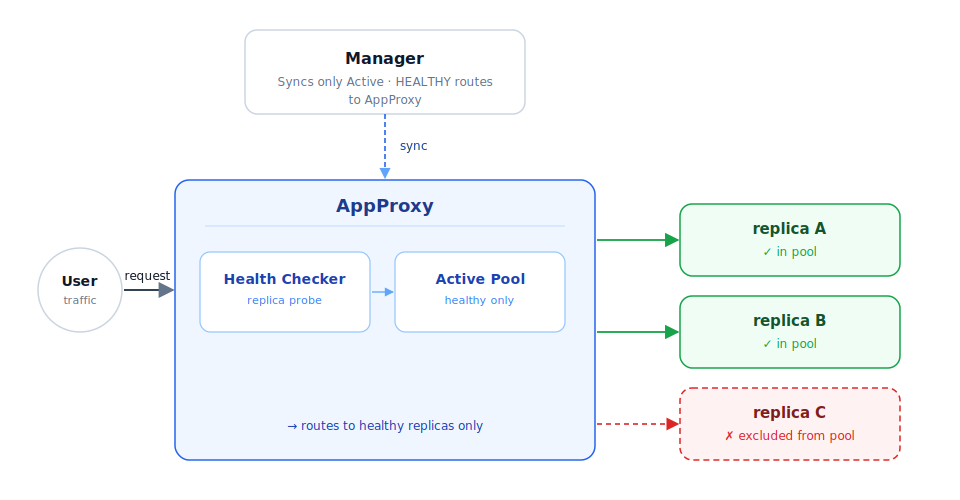

**② Manager: Health State Management and Eviction**

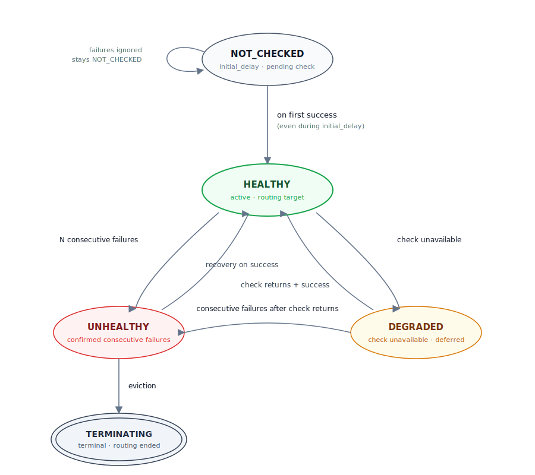

:::note
The internal health status (used for traffic routing) may not be immediately
synchronized with the status displayed in the user interface.
:::

**Time to UNHEALTHY**:

- Initial startup: `initial_delay + interval × (max_retries + 1)`

  Example with defaults: 60 + 10 × 11 = **170 seconds** (about 3 minutes)

- During operation (after healthy): `interval × (max_retries + 1)`

  Example with defaults: 10 × 11 = **110 seconds** (about 2 minutes)


<a id="prestart-actions"></a>

**Description for Service Action Supported in Backend.AI Model Serving**


- `write_file`: This is an action to create a file with the given
  file name and append control to it. the default access permission is `644`.

   - `arg/filename`: Specify the file name
   - `body`: Specify the content to be added to the file.
   - `mode`: Specify the file's access permissions.
   - `append`: Set whether to overwrite or append content to the file as `True` or `False` .

- `write_tempfile`: This is an action to create a file with
  a temporary file name (`.py`) and append content to it. If no value is specified for the mode, the default access permission is `644`.

   - `body`: Specify the content to be added to the file.
   - `mode`: Specify the file's access permissions.

- `run_command`: The result of executing a command,
  including any errors, will be returned in following format
  ( `out`: Output of the command execution, `err`: Error message if an error occurs during command execution)

   - `args/command`: Specify the command to executed as an array. (e.g. `python3 -m http.server 8080` command goes to ["python3", "-m", "http.server", "8080"] )

- `mkdir`: This is an action to create a directory by input path

   - `args/path`: Specify the path to create a directory

- `log`: This is an action to print out log by input message

   - `args/message`: Specify the message to be displayed in the logs.
   -  `debug`: Set to `True` if it is in debug mode, otherwise set to `False`.

### Uploading Model Definition File to Model Type Folder

To upload the model definition file (`model-definition.yml`) to the
model type folder, you need to create a virtual folder. When creating
the virtual folder, select the `model` type instead of the default
`general` type. Refer to the section on [creating a storage folder](#create-storage-folder) in the Data page for
instructions on how to create a folder.

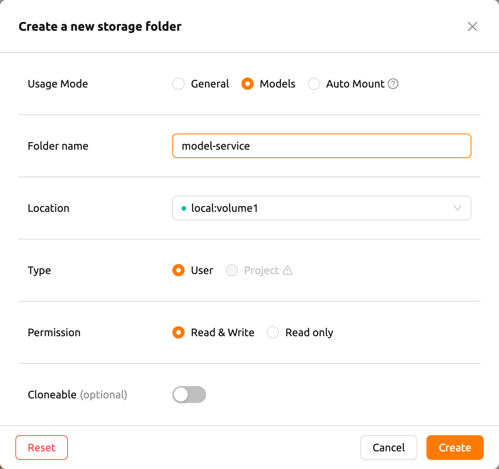

After creating the folder, select the 'MODELS' tab in the Data
page, click on the recently created model type folder icon to open the
folder explorer, and upload the model definition file.
For more information on how to use the folder explorer,
please refer to the [Explore Folder](#explore-folder) section.


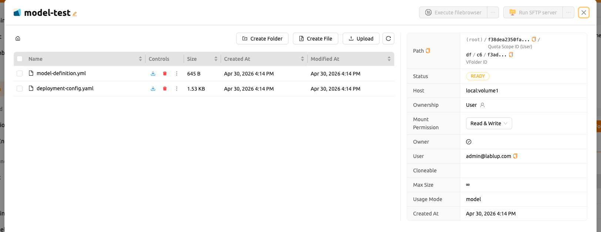

<a id="service-definition-file"></a>

### Creating a Service Definition File

The service definition file (`service-definition.toml`) allows administrators to pre-configure the resources, environment, and runtime settings required for a model service. When this file is present in a model folder, the system uses these settings as default values when creating a service.

Both `model-definition.yaml` and `service-definition.toml` must be present in the
model folder to enable the `Deploy` button on the Model Store page. These two files
work together: the model definition specifies the model and inference server
configuration, while the service definition specifies the runtime environment,
resource allocation, and environment variables.

The service definition file follows the TOML format with sections organized by runtime variant. Each section configures a specific aspect of the service:

```toml
[vllm.environment]
image        = "example.com/model-server:latest"
architecture = "x86_64"

[vllm.resource_slots]
cpu = 1
mem = "8gb"
"cuda.shares" = "0.5"

[vllm.environ]
MODEL_NAME = "example-model-name"
```


**Key-Value Descriptions for Service Definition File**

- `[{runtime}.environment]`: Specifies the container image and architecture for the model service.

   - `image` (Required): The full path of the container image to use for the inference service (e.g., `example.com/model-server:latest`).
   - `architecture` (Required): The CPU architecture of the container image (e.g., `x86_64`, `aarch64`).

- `[{runtime}.resource_slots]`: Defines the compute resources allocated to the model service.

   - `cpu`: Number of CPU cores to allocate (e.g., `1`, `2`, `4`).
   - `mem`: Amount of memory to allocate. Supports unit suffixes (e.g., `"8gb"`, `"16gb"`).
   - `"cuda.shares"`: Fractional GPU (fGPU) shares to allocate (e.g., `"0.5"`, `"1.0"`). This value is quoted because the key contains a dot.

- `[{runtime}.environ]`: Sets environment variables that will be passed to the inference service container.

   - You can define any environment variables required by the runtime. For example, `MODEL_NAME` is commonly used to specify which model to load.


:::note
The `{runtime}` prefix in each section header corresponds to the runtime variant
name (e.g., `vllm`, `nim`, `custom`). The system matches this prefix with the
selected runtime variant when creating the service.
:::

:::note
When a service is created from the Model Store using the `Deploy` button, the
settings from `service-definition.toml` are applied automatically. If you later
need to adjust the resource allocation, you can modify the service through the
Model Serving page.
:::

## Serving Page Overview

The Serving page displays a list of all model service endpoints in the current project. You can access it by clicking **Model Serving** in the sidebar menu.

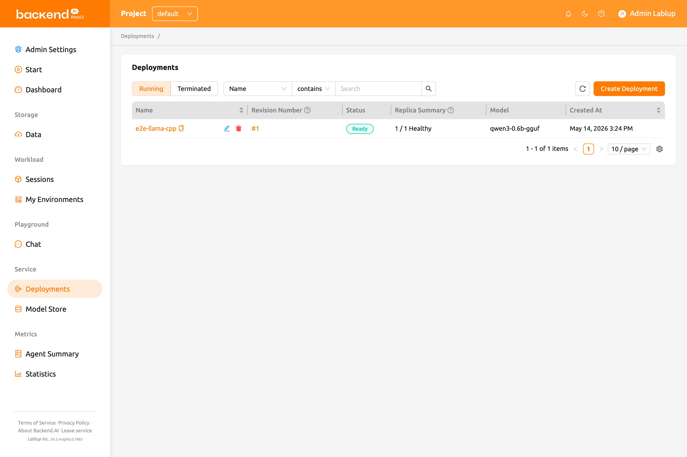

At the top of the page, you can filter endpoints by lifecycle stage:

- **Active**: Shows endpoints that are currently running or being created. This is the default view.
- **Destroyed**: Shows endpoints that have been terminated.

You can also use the property filter bar to search endpoints by **Endpoint Name**, **Service Endpoint URL**, or **Owner** (available to admins and superadmins).

Click the `Start Service` button to open the service launcher and create a new model service.

## Creating a Model Service

### Service Launcher

Click the `Start Service` button on the Serving page to open the service launcher.

#### Service Name and Basic Settings

First, provide a service name. The following fields are available:

- **Service Name**: A unique name to identify the endpoint.
- **Open To Public**: This option allows access to the model service without any separate token. By default, it is disabled.
- **Model Storage Folder to Mount**: Select the storage folder containing the model files.
- **Inference Runtime Variant**: Selects the runtime variant for the model service. The available variants are dynamically loaded from the backend and may include `vLLM`, `SGLang`, `NVIDIA NIM`, `Modular MAX`, `Custom`, and others depending on your installation.
- **Environment / Version**: Configure the execution environment for the model service. Selecting a runtime variant automatically filters the environment images.

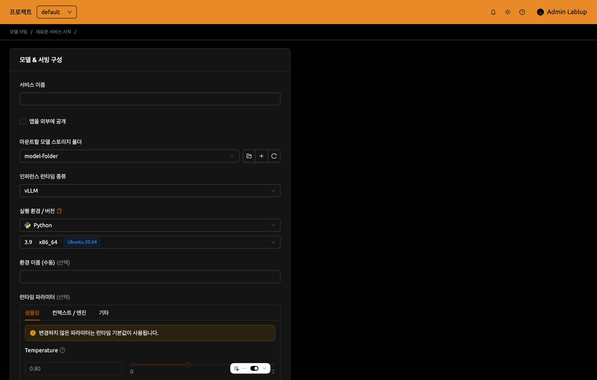

For runtime variants such as `vLLM`, `SGLang`, `NVIDIA NIM`, or `Modular MAX`, there is no need to configure a `model-definition` file in your model folder. Instead, the system handles the model configuration automatically based on the selected variant.


#### Model Definition Mode (Custom Runtime Only)

When you select the `Custom` runtime variant, you can choose between two modes for defining the model service:

##### Enter Command Mode

Select `Enter Command` to paste a CLI command directly. For example:

```shell
vllm serve /models/my-model --tp 2
```


The system automatically parses the command and fills in the following fields:

- **Start Command**: Enter the command to be executed in model serving directly.
- **Model Mount**: The path where the model storage folder is mounted in the container (default `/models`).
- **Port**: Auto-detected from the command (default `8000`). The port number that the model serving process listens on.
- **Health Check URL**: Auto-detected from the command (default `/health`). The HTTP endpoint path called during service health checks.
- **Initial Delay**: Seconds to wait before the first health check after the service starts (default `60.0`).
- **Max Retries**: Maximum number of health check attempts before the service is considered failed (default `10`).

:::tip
If the command suggests multi-GPU usage (e.g., `--tp 2`), a GPU hint will appear
to help you allocate the correct number of GPU resources.
:::

##### Use Config File Mode

Select `Use Config File` to use the traditional `model-definition.yaml` approach. This mode allows you to set:

- **Mount Destination For Model Folder**: The path where the model storage is mounted in the session. The default value is `/models`.
- **Model Definition File Path**: The path to the model definition file you uploaded. The default value is `model-definition.yaml`.
- **Additional Mounts**: You can mount additional storage folders. Note that only general/data usage mode folders can be mounted, not additional model folders.

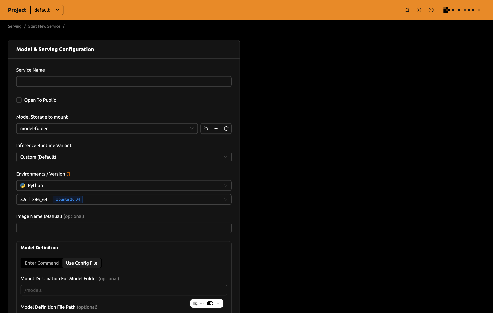

#### Runtime Parameters (vLLM / SGLang)

When you select the `vLLM` or `SGLang` runtime variant, a **Runtime Parameters** section appears. This section lets you fine-tune the model serving behavior without manually editing configuration files.

Parameters are organized into tab-separated categories. The tab list varies by runtime variant.

:::note
Unchanged parameters will use the runtime's default values.
:::

**vLLM Runtime Parameters**


vLLM provides the following tabs: **Model Loading**, **Resource Memory**, **Serving Performance**, **Multimodal**, **Tool Reasoning**, and others.

Key fields in the **Model Loading** tab:

- **Model**: The name or path of the model to use.
- **DType**: The data type for model weights and computation (e.g., `Auto`, `float16`, `bfloat16`).
- **Quantization**: The model quantization method (e.g., `awq`, `gptq`, `fp8`).
- **Max Model Length**: The maximum context length (number of tokens) the model can process.
- **Served Model Name**: The model name to expose at the API endpoint.
- **Trust Remote Code**: Allow execution of custom model code from the model repository.

**SGLang Runtime Parameters**

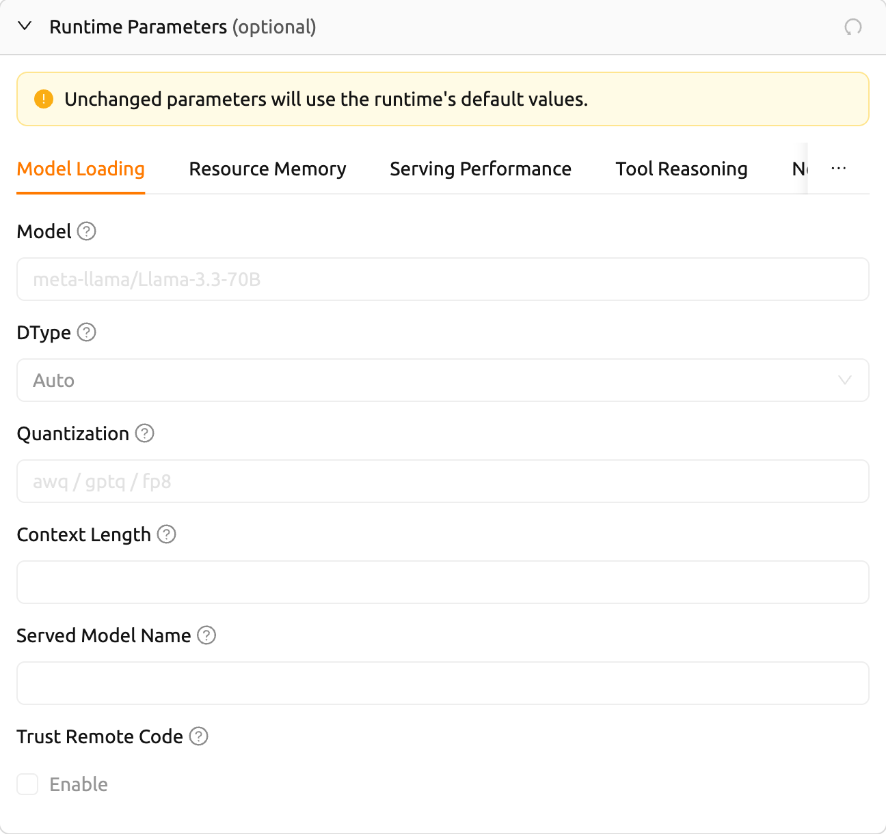

SGLang provides the following tabs: **Model Loading**, **Resource Memory**, **Serving Performance**, **Tool Reasoning**, and others.

Key fields in the **Model Loading** tab:

- **Model**: The name or path of the model to use.
- **DType**: The data type for model weights and computation (e.g., `Auto`, `float16`, `bfloat16`).
- **Quantization**: The model quantization method (e.g., `awq`, `gptq`, `fp8`).
- **Context Length**: The maximum context length the model can process.
- **Served Model Name**: The model name to expose at the API endpoint.
- **Trust Remote Code**: Allow execution of custom model code from the model repository.

In addition to runtime parameters, the `vLLM` and `SGLang` runtime variants expose specific environment variables in the **Environment Variables** section of the service launcher:

- **vLLM**: `BACKEND_MODEL_NAME`, `VLLM_QUANTIZATION`, `VLLM_TP_SIZE` (tensor parallelism), `VLLM_PP_SIZE` (pipeline parallelism), `VLLM_EXTRA_ARGS` (extra CLI arguments)
- **SGLang**: `BACKEND_MODEL_NAME`, `SGLANG_QUANTIZATION`, `SGLANG_TP_SIZE` (tensor parallelism), `SGLANG_PP_SIZE` (pipeline parallelism), `SGLANG_EXTRA_ARGS` (extra CLI arguments)

:::note
These environment variables appear in the **Environment Variables** section of the launcher,
not in the Runtime Parameters section. They provide additional configuration options
specific to each runtime variant.
:::

#### Runtime Variant Comparison

The following table summarizes the key differences between the three main runtime variants:

| Feature | Custom | vLLM | SGLang |
|---------|--------|------|--------|
| Runtime Parameters section | No | Yes | Yes |
| Enter Command / Use Config File toggle | Yes | No | No |
| Environment variable presets | Manual only | `VLLM_*` presets | `SGLANG_*` presets |
| Form pre-populated on edit | Yes (from latest revision) | No | No |

#### Environment and Resources

Set the number of replicas and select the environment and resource group.

- **Number of replicas**: Determines the number of routing sessions to maintain for the service. Changing this value causes the manager to create or terminate replica sessions accordingly.
- **Environment / Version**: Configure the execution environment for the model service. Selecting a runtime variant such as vLLM automatically filters the environment images to show relevant ones.

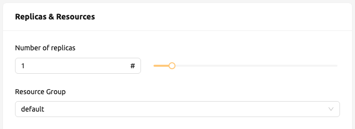

- **Resource Presets**: Select the amount of resources to allocate. Resources include CPU, RAM, and AI accelerator (GPU).

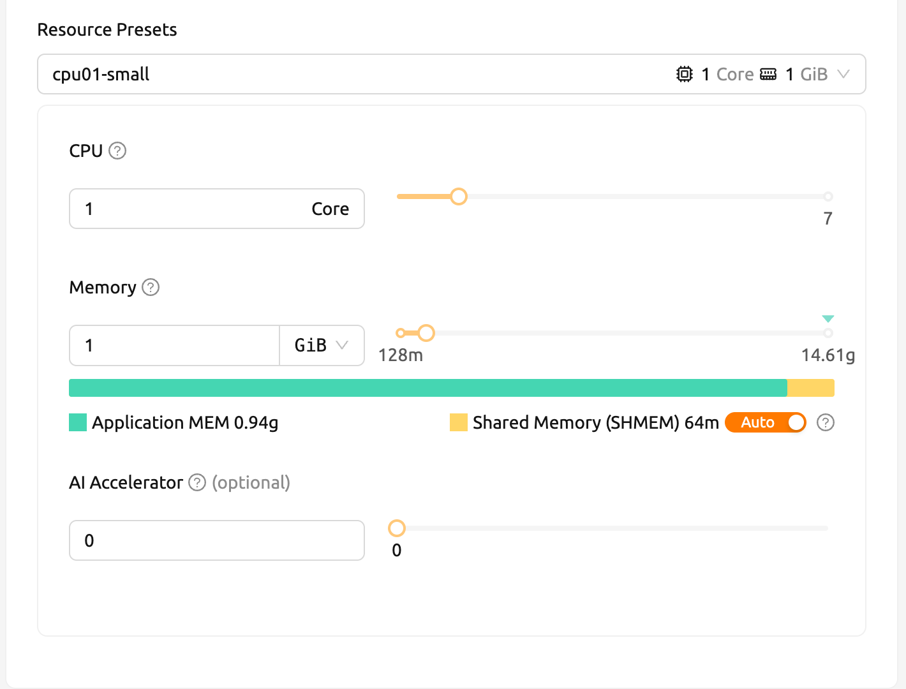

#### Cluster Mode and Environment Variables

- **Single Node**: The managed node and worker nodes are placed on a single physical node or virtual machine.
- **Multi Node**: One managed node and one or more worker nodes are split across multiple physical nodes or virtual machines.
- **Variable**: Set environment variables when starting a model service. This is useful when using runtime variants that require certain environment variable settings before execution.

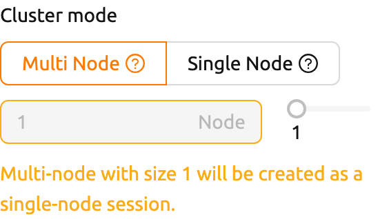

#### Validating the Service

Before creating a model service, Backend.AI supports a validation feature to check
whether execution is available. Click the `Validate` button at the bottom-left of
the service launcher, and a new popup for listening to validation events will appear.
In the popup modal, you can check the status through the container log. When the
result is set to `Finished`, the validation check is complete.

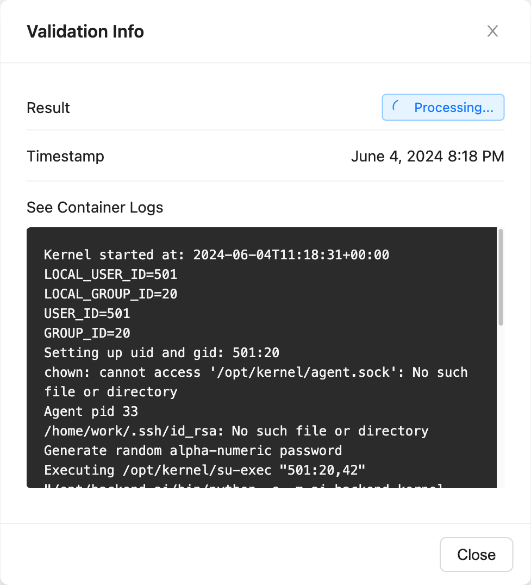

:::note
The result `Finished` doesn't guarantee that the execution is successfully done.
Instead, please check the container log.
:::

### Handling Failed Model Service Creation

If the status of the model service remains `UNHEALTHY`, it indicates
that the model service cannot be executed properly.

The common reasons for creation failure and their solutions are as
follows:

-  Insufficient allocated resources for the routing when creating the
   model service

   -  Solution: Terminate the problematic service and recreate it with
      an allocation of more sufficient resources than the previous
      settings.

-  Incorrect format of the model definition file (`model-definition.yml`)

   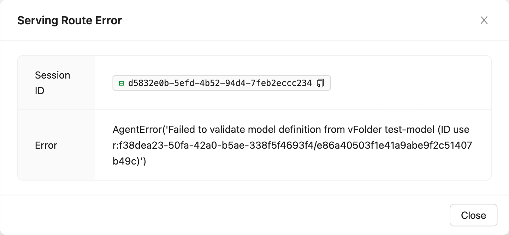

   -  Solution: Verify [the format of the model definition file](#model-definition-guide) and
      if any key-value pairs are incorrect, modify them and overwrite the file in the saved location.
      Then, click `Clear error and retry` button to remove all the error stacked in routes info
      table and ensure that the routing of the model service is set correctly.

   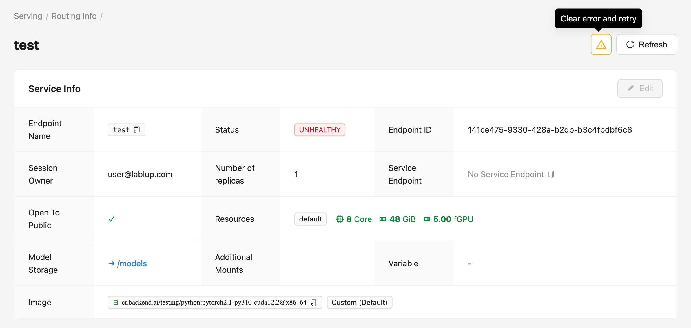

## Endpoint Detail Page

Click on an endpoint name in the serving list to view detailed information about the model service.

### Service Information

The Service Info card displays the following details:

- **Endpoint Name** and **Status**
- **Endpoint ID** and **Session Owner**
- **Number of Replicas**
- **Service Endpoint**: The URL for accessing the model service. For LLM services, an `LLM Chat Test` button is available.
- **Open To Public**: Whether the service is publicly accessible.
- **Resources**: The resource group and allocated CPU/Memory/GPU.
- **Model Storage**: The mounted model storage folder and mount destination.
- **Additional Mounts**: Any extra storage folders mounted.
- **Environment Variables**: Displayed as a code block.
- **Image**: The container image used for the service.

Click the `Edit` button on the Service Info card to navigate to the update launcher and modify the service settings.

The Endpoint Detail Page displays contextual alert banners at the top, depending on the current state of the service:

- **Preparing your service**: Shown while the service is being deployed or transitioning between states. Indicates the service is not yet ready to handle requests.

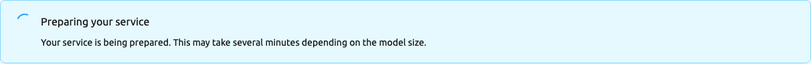

- **Service is ready**: Shown when the service is `HEALTHY`. Includes a **Start Chat** button as a shortcut to the LLM Chat Test interface.


- **Not In Project**: Shown when the endpoint belongs to a different project than the currently selected one. The Edit button is disabled while this alert is active. Click the **Switch Project** button in the alert to switch to the correct project and manage the endpoint.

<a id="revision-info"></a>

### Revision Info

:::note
The Revision Info card is available when the server supports Model Card v2
(Backend.AI version 26.4.0 and later).
:::

The Revision Info card on the Endpoint Detail Page displays the configuration of the **latest revision** — the revision that is queued to be applied next. This may differ from the revision that is currently running on the service.

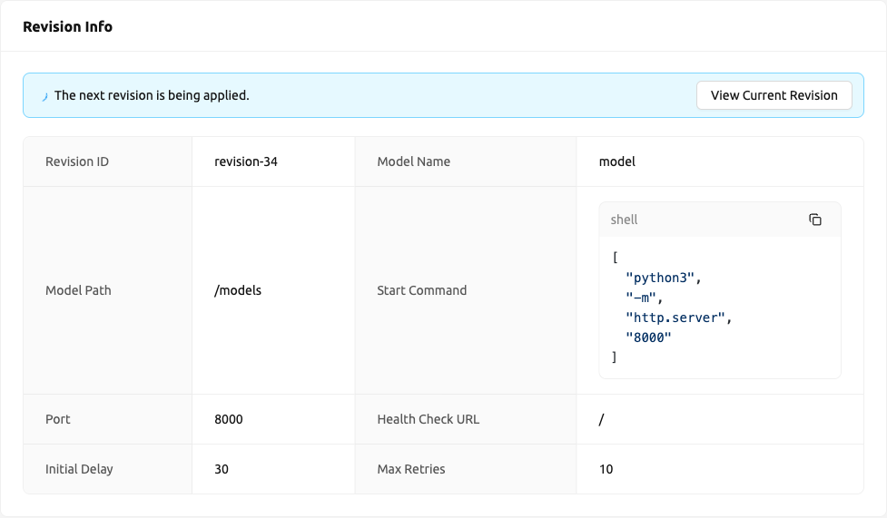

The card shows the following fields:

- **Revision ID**: The identifier of the latest revision.
- **Model Name**: The name of the model as defined in the model definition.
- **Model Path**: The path where the model is mounted.
- **Start Command**: The command used to start the inference server.
- **Port**: The container port for the model service.
- **Health Check Path**: The HTTP endpoint path for health checks.
- **Initial Delay**: Seconds to wait before the first health check.
- **Max Retries**: Maximum consecutive health check failures allowed.

#### Revision Mismatch State

When a new revision has been queued but the service is still running on the previous revision, a **"The next revision is being applied."** alert is displayed on the Revision Info card. This indicates that the latest revision values shown in the card do not yet match the currently running configuration.

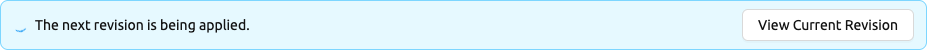

Click the **View Current Revision** button to open a modal that shows the model definition of the revision that is **currently running**. This allows you to compare the upcoming revision (shown in the Revision Info card) with the active revision (shown in the modal).

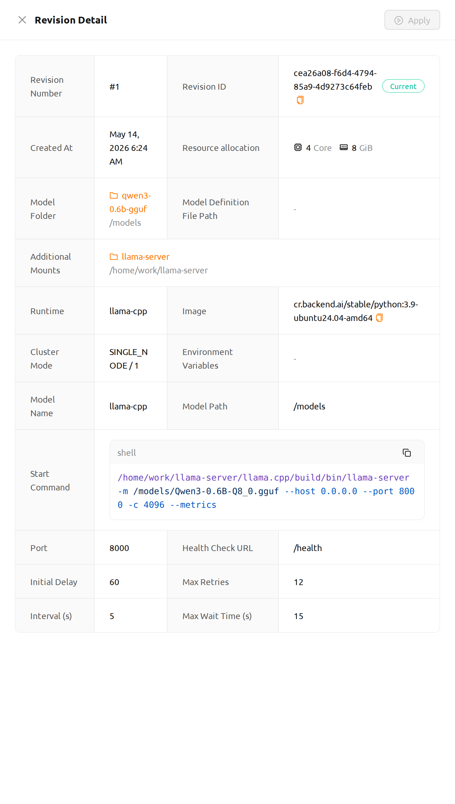

:::tip
To summarize: the **Revision Info card** always shows the **latest/upcoming** revision values,
while the **View Current Revision modal** shows the **currently running** revision values.
:::

#### Edit Behavior With Revisions (Custom Variant Only)

When you click the **Edit** button on the Service Info panel for a service using the `Custom` runtime variant, the service launcher form is pre-populated with the latest revision's model definition values as defaults. This makes it easy to adjust settings incrementally without re-entering all fields.

:::note
This pre-population of model definition values applies only to the `Custom` runtime variant.
`vLLM` and `SGLang` variants do not use model definition fields at all — they expose a
**Runtime Parameters** section (`inference_runtime_config`) for framework-specific configuration.
Model definition and runtime parameters are distinct concepts stored separately in the revision.
:::

### Auto Scaling Rules

Auto Scaling Rules automatically increase or decrease the number of replicas for a model service based on live metrics. This conserves resources during low usage and prevents request delays or failures during high usage.

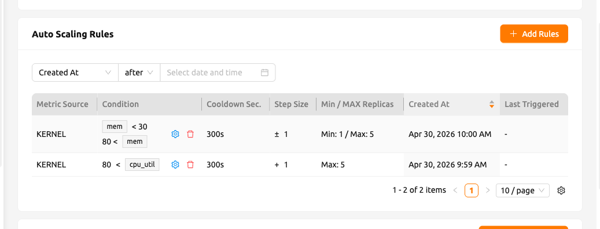

The rule list provides:

- A property filter bar to filter rules by **Created At** and **Last Triggered** datetime ranges.
- Server-side pagination.
- The following columns: **Metric Source**, **Condition**, **Cooldown Sec.**, **Step Size**, **Min / Max Replicas**, **Created At**, and **Last Triggered**. The **Step Size** column automatically shows `+`, `−`, or `±` based on the direction derived from the thresholds you have set, so you no longer choose **Scale Out** or **Scale In** explicitly.
- Per-row edit and delete icons shown next to the condition summary in each row.

Click the `Add Rules` button to open the **Add Auto Scaling Rule** editor. To modify an existing rule, click the edit icon on its row; the **Edit Auto Scaling Rule** editor opens with the rule's values pre-filled. The editor contains the following fields in order:

- **Metric Source**: Select one of `Kernel`, `Inference Framework`, or `Prometheus`.
- **Metric Name**: For `Kernel` and `Inference Framework`, enter a metric name. For `Kernel`, a list of common metrics (such as `cpu_util`, `mem`, `net_rx`, and `net_tx`) is offered as autocomplete suggestions, and you can also type a custom name freely.
- **Metric Name (Prometheus Preset)**: Shown only when **Metric Source** is `Prometheus`. Select a preset from the dropdown; the preset's metric name, query template, and (when defined) **Cooldown Sec.** are filled in automatically. Below the selector, a **Current value** preview shows the latest value returned by the preset, with a refresh button. When multiple series are returned, the preview shows the number of series and the most recent value; if no data is available, it shows **No data available**.
- **Condition**: A segmented control for choosing the scaling direction. It provides three options.

   - **Scale In**: Decreases replicas when the metric falls below a threshold. Sets `Metric < [threshold]`.
   - **Scale Out**: Increases replicas when the metric rises above a threshold. Sets `Metric > [threshold]`.
   - **Scale In & Out**: Automatically scales in or out depending on which side of the configured range the metric crosses. Sets `Metric < Min Threshold` or `Metric > Max Threshold`.

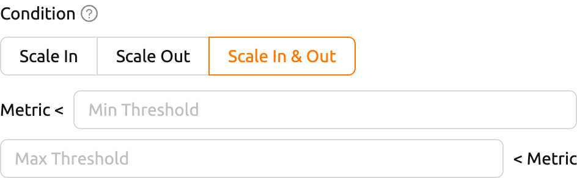

- **Step Size**: A positive integer specifying how many replicas to add or remove per scaling event. The `-`, `+`, or `±` sign is shown automatically based on the selected condition (Scale In / Scale Out / Scale In & Out).

   - Only a minimum threshold is set: `[metric] < [minThreshold]` triggers **Scale In** (replicas decrease when the metric falls below the threshold).
   - Only a maximum threshold is set: `[metric] > [maxThreshold]` triggers **Scale Out** (replicas increase when the metric rises above the threshold).
   - Both thresholds are set: replicas are scaled in or out depending on which boundary the metric crosses (`[minThreshold] < [metric] < [maxThreshold]` is the normal operating range).

- **Cooldown Sec.**: The time, in seconds, to wait after a scaling event before the next evaluation.
- **Min Replicas** and **Max Replicas**: The lower and upper bounds that auto-scaling enforces on the replica count. Auto-scaling will not reduce the number of replicas below **Min Replicas** or increase it above **Max Replicas**.

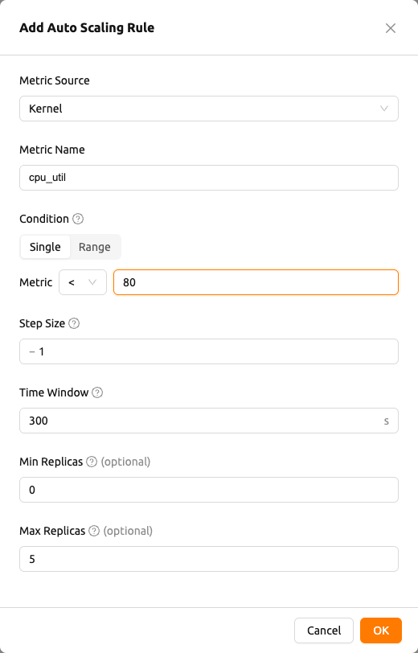

When **Metric Source** is set to `Prometheus`, the editor shows the preset selector and the live **Current value** preview.

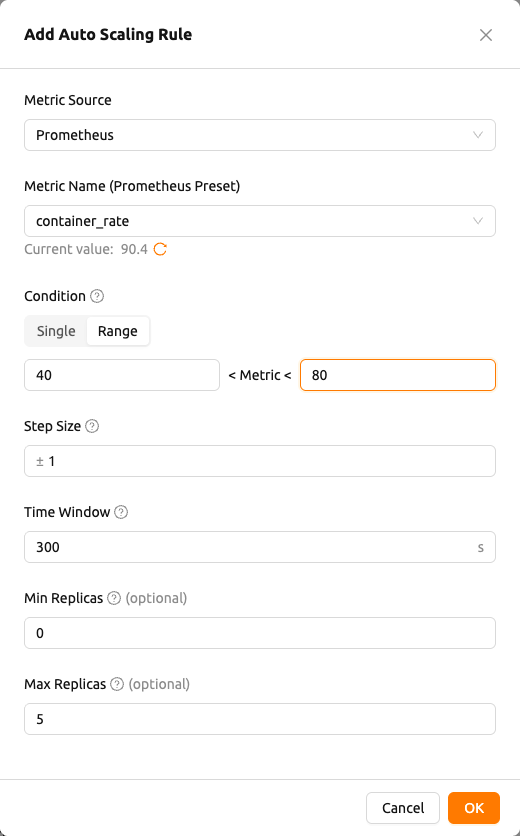

<a id="generating-tokens"></a>

### Generating Tokens

Once the model service is successfully executed, the status will be set
to `HEALTHY`. You can click on the corresponding endpoint name in the
serving list to view detailed information. From there, you can check the
service endpoint in the routing information. If the **Open To Public** option
is enabled when the service is created, the endpoint will be publicly
accessible without any separate token, and end users can access it.
However, if it is disabled, you can issue a token as described below to
verify that the service is running properly.

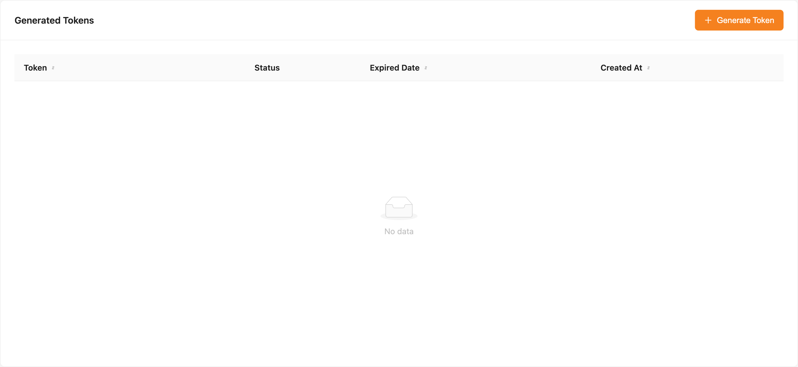

Click the `Generate Token` button located to the right of the generated
token list. In the modal that appears, enter the expiration date.

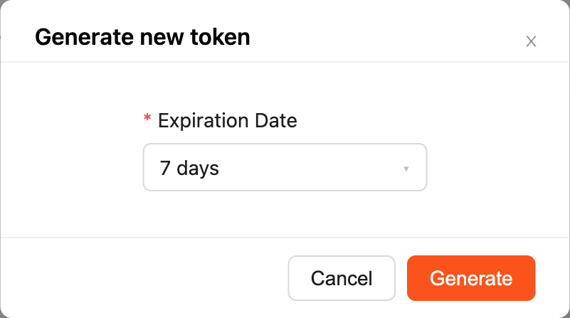

The issued token will be added to the list of generated tokens. Each token displays its **Status** (Valid or Expired), **Expiration Date**, and **Created Date**. Click the `copy` button in the token
item to copy the token, and add it as the value of the following key.

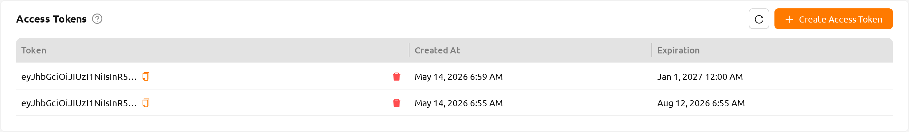

| Key           | Value            |
|---------------|------------------|
| Content-Type  | application/json |
| Authorization | BackendAI        |

### Routes Information

The Routes Info card shows the routing status of the model service. You can filter routes by:

- **Running / Finished**: Toggle between active and completed route nodes.
- **Property filter**: Filter by health status and traffic status.


Click on a route node to open the session detail drawer, where you can view individual session details.

If a route has encountered an error, clicking the error indicator on the route row opens a JSON viewer modal that displays the raw error data for that route. This is useful for diagnosing issues with individual route nodes.

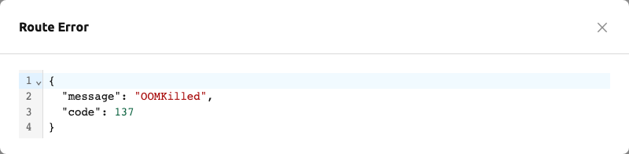

### Modifying a Service

Click the `Edit` button on the endpoint detail page to modify a model service. The service launcher opens with previously entered fields already filled in. You can optionally modify only the fields you wish to change. After modifying the fields, click the `Update` button to apply the changes.

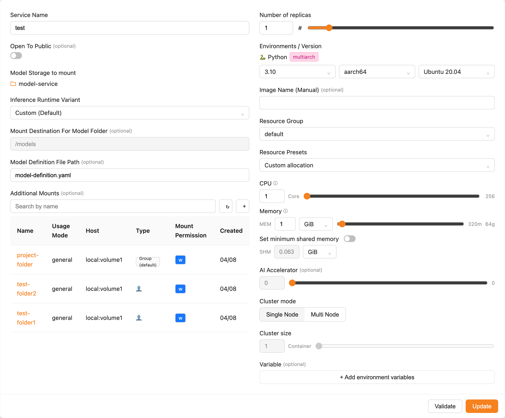

### Terminating a Service

The model service periodically runs a scheduler to adjust the routing
count to match the desired session count. However, this puts a burden on
the Backend.AI scheduler. Therefore, it is recommended to terminate the
model service if it is no longer needed. To terminate the model service,
click on the `Delete` button in the Controls column. A modal will appear asking
for confirmation to terminate the model service. Clicking `Delete`
will terminate the model service. The terminated model service will
appear in the **Destroyed** filter view.

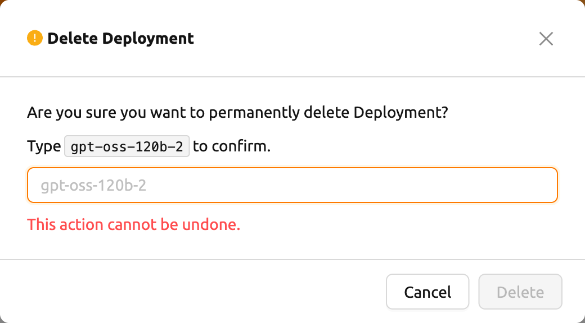

## Accessing the Service Endpoint

### Making API Requests

To complete the model serving, you need to share information with the
actual end users so that they can access the server where the model
service is running. If the **Open To Public** option is enabled when the
service is created, you can share the service endpoint value from the
endpoint detail page. If the service was created with the option
disabled, you can share the service endpoint value along with the token
previously generated.

Here is a simple command using `curl` to check whether sending requests
to the model serving endpoint is working properly:

```bash
export API_TOKEN="<token>"
export MODEL_SERVICE_ENDPOINT="<model-service-endpoint>"
curl -H "Content-Type: application/json" -X GET \
  -H "Authorization: BackendAI $API_TOKEN" \
  "$MODEL_SERVICE_ENDPOINT"
```

:::warning
By default, end users must be on a network that can access the
endpoint. If the service was created in a closed network, only end
users who have access within that closed network can access the
service.
:::

### LLM Chat Test

If you have created a Large Language Model (LLM) service, you can test the LLM in real-time.
Click the `LLM Chat Test` button located in the Service Endpoint section of the endpoint detail page.

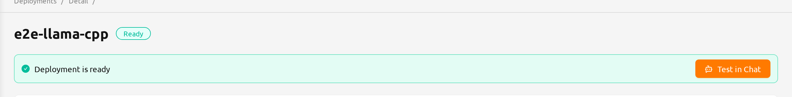

You will be redirected to the Chat page, where the model you created is automatically selected.
Using the chat interface provided on the Chat page, you can test the LLM model.
For more information about the chat feature, please refer to the [Chat page](#chat-page).

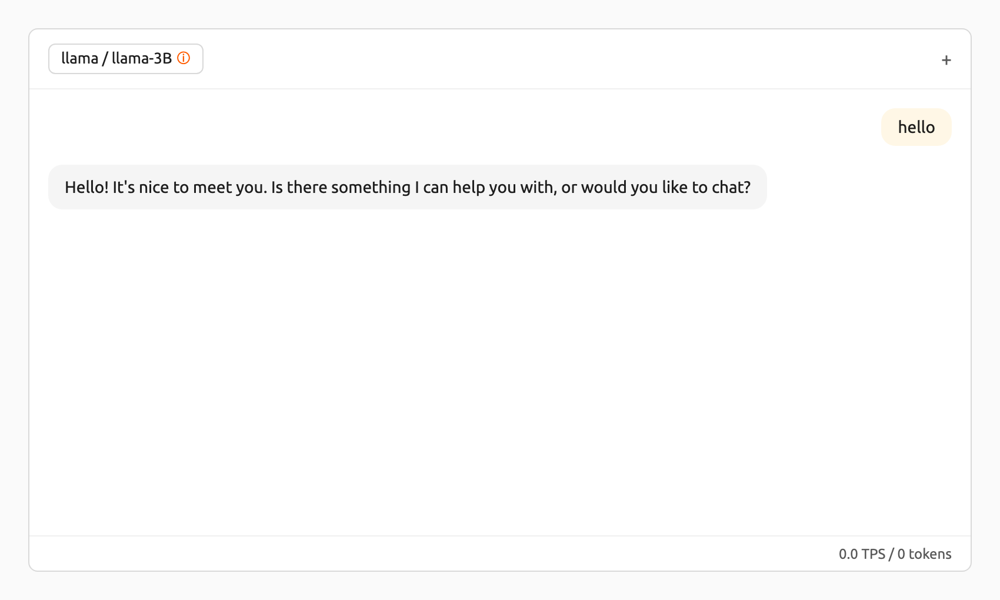

If you encounter issues connecting to the API, the Chat page will display options that allow you to manually configure the model settings.
To use the model, you will need the following information:

- **baseURL** (optional): Base URL of the server where the model is located.
  Make sure to include the version information.
  For instance, when utilizing the OpenAI API, you should enter https://api.openai.com/v1.
- **Token** (optional): An authentication key to access the model service. Tokens can be
  generated from various services, not just Backend.AI. The format and generation process
  may vary depending on the service. Always refer to the specific service's guide for details.
  For instance, when using the service generated by Backend.AI, please refer to the
  [Generating Tokens](#generating-tokens) section for instructions on how to generate tokens.

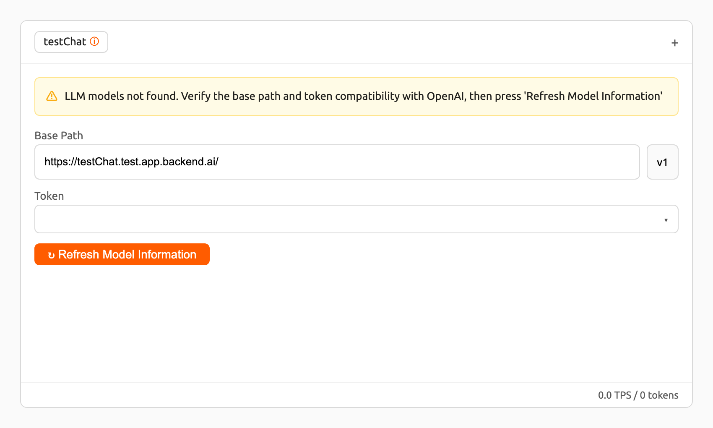

## Model Store

The Model Store provides a card-based gallery of pre-configured models that you can browse, search, and deploy. You can access the Model Store from the sidebar menu.

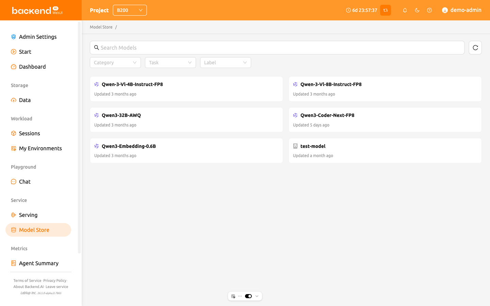

### Browsing and Searching Models

The page uses a search and sort layout at the top:

- **Search Models**: Use the **Filter By Name** property filter to search model cards by name.
- **Sort**: Choose how results are ordered. The available options are `Name (A→Z)`, `Name (Z→A)`, `Oldest first`, and `Newest first`.
- **Refresh**: Click the refresh button to reload the card list.

Each card displays the model brand icon, title (or name when no title is set), task tag, relative creation time, and the author with an icon. Cards that have **no compatible presets** for the current project are shown at 50% opacity. You can still open such a card to view its details, but its **Deploy** button is disabled and an error alert is shown in the drawer: **No compatible presets available. This model cannot be deployed.**

If the `MODEL_STORE` project is not set up on the server, the page shows a *Model Store project not found* message with instructions to contact an administrator. If no model cards match your filters, the page displays *No models found*.

The list is paginated at the bottom. You can change the page size between `10`, `20`, and `50` entries.

### Model Card Details

Click a card to open the model card drawer on the right side of the page. The drawer shows the model title and description at the top, followed by the task, category, labels, and license tags, and then a details list with the following items:

- **Author**
- **Architecture**
- **Framework** (each framework is shown with an icon)
- **Version**
- **Created** and **Last Modified** timestamps
- **Model Folder**: A clickable link that opens the folder explorer for the model storage folder
- **Min Resource**: The minimum resource requirements (CPU, memory, GPU)

If the model card includes a README, it is rendered as a `README.md` card at the bottom of the drawer.

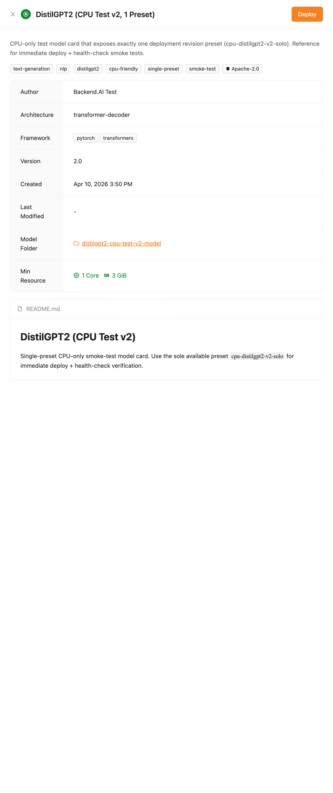

### Deploying a Model

Click the **Deploy** button in the drawer header to deploy the model as a service. The deploy flow behaves in one of two ways:

- **Auto-deploy**: If the model has exactly one available preset and the current project has exactly one accessible resource group, the deployment is created silently without showing a modal. After the endpoint becomes queryable, you are navigated to its endpoint detail page.
- **Deploy Model modal**: Otherwise, a **Deploy Model** modal opens with the following required fields:

   - **Preset**: A grouped dropdown of available resource presets. When presets span multiple runtime variants, options are grouped by runtime variant name; otherwise the options are shown as a flat list.
   - **Resource Group**: The resource group where the service will run.

   Click the **Deploy** button in the modal to start the deployment. A success toast confirms that the model has been deployed, and you are navigated to the endpoint detail page.


:::note
If the selected model has no compatible presets for the current project, the drawer's
**Deploy** button is disabled and deployment is blocked until a compatible preset is available.
:::


