

# Project Admin Features

A **Project Admin** is a user who has been granted administrative authority over a specific project. Project admins can view the users that belong to the project they administer, oversee its compute sessions and model deployments, and manage its storage folders — all without needing system-wide superadmin privileges.

:::note
The Project Admin features described in this chapter are supported from **Backend.AI WebUI 26.4.0** and later.
:::

## Identifying Project Admin Projects

When you open the project dropdown in the header, projects in which you have the project-admin role are marked with a shield-shaped badge next to the project name. Hovering the badge displays a **Project Admin** tooltip, confirming that selecting this project will reveal the project-admin sidebar entries described below.

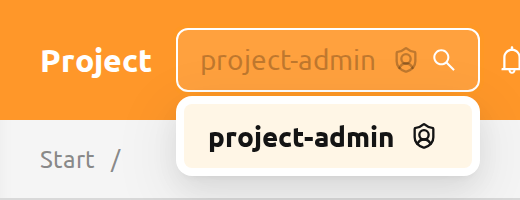

Switching to a different project from the header's project selector re-evaluates the user's role: the same user may act as a project admin in one project and as a regular user in another within the same login session. To learn how project-admin roles are granted and revoked, see [Grant Project Admin Authority](#grant-project-admin) in the RBAC Management chapter.

## The Project Admin Sidebar

When you select a project in which you are a project admin, the sidebar's **Operations** section displays four entries dedicated to managing that project:

- **Users** — the members of the current project
- **Data** — the storage folders owned by the current project
- **Sessions** — the compute sessions owned by users in the current project
- **Deployments** — the model deployments owned by the current project

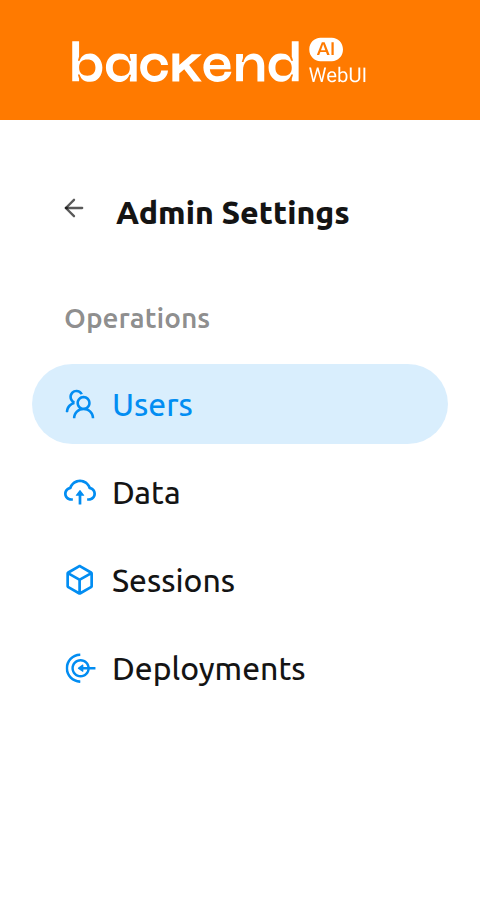

Whenever you are on any of these project-admin pages, a single info banner appears above the page content, reminding you that only items belonging to the currently selected project are shown. The banner is rendered once at the layout level rather than separately on each page.

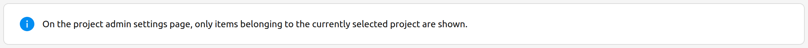

## Users

The **Users** page lists every user who belongs to the currently selected project. Use this page to review project membership at a glance — for example, to confirm who has access to the project's resources or to identify inactive accounts.

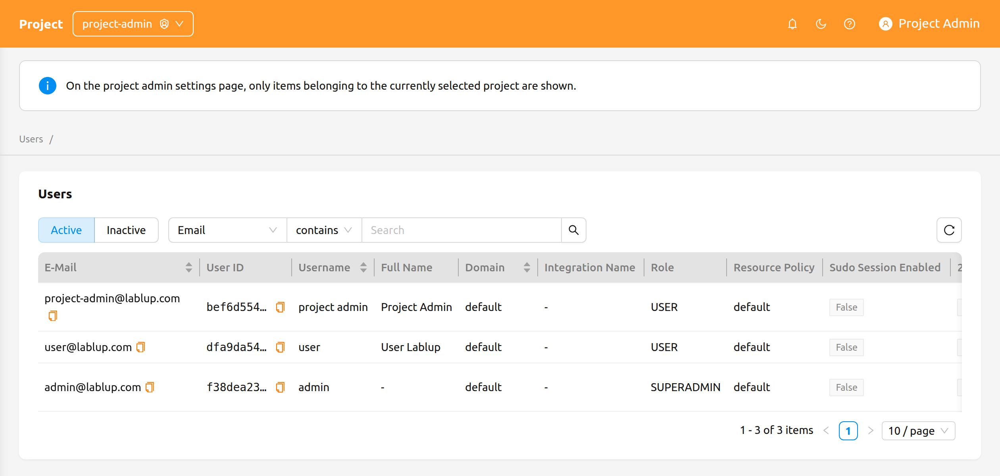

The page provides the following controls:

- **Active / Inactive** segmented control: Toggle between active and inactive users. Active is selected by default.
- **Property filter**: Filter the list by E-Mail, ID, Username, Role, or Created At.

The Users page is **read-only** for project admins. There are no create, edit, or deactivate actions on this page — those operations are reserved for superadmins on the system-wide Users page in the [Admin Features](#admin-menus) chapter.

## Sessions

The **Sessions** page lists the compute sessions owned by users in the currently selected project. Use this page to monitor active workloads, identify long-running sessions, or terminate sessions that are no longer needed.

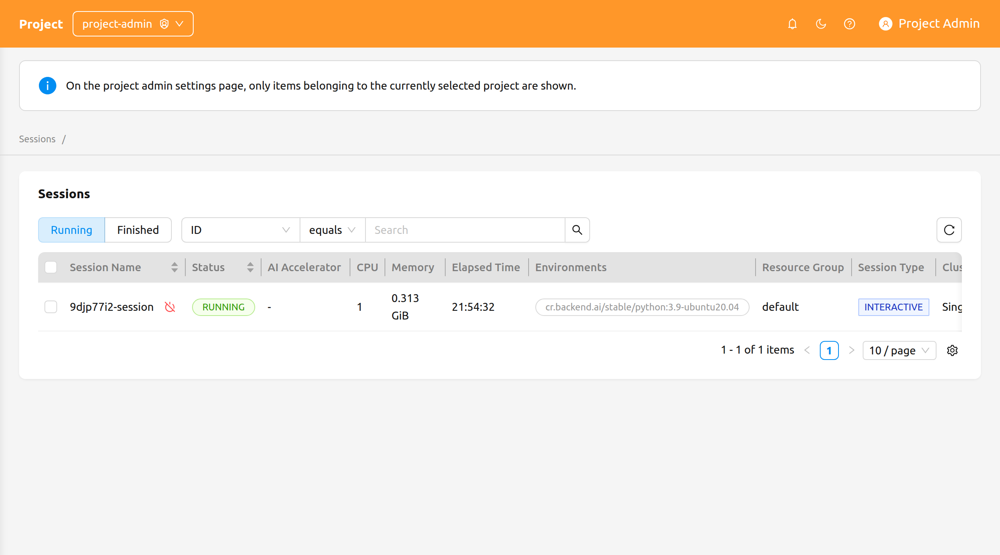

The page provides the following controls:

- **Running / Finished** segmented control: Toggle between currently running sessions and sessions that have already finished.
- **Property filter and sorting**: Filter the list by ID, Session Name, or Owner UUID. Click a sortable column header to sort the table.

### Terminate Sessions

To terminate one or more sessions:

1. Select the sessions you want to terminate using the checkboxes in the leftmost column. To terminate a single session, you can use the row's terminate action instead.
2. Click the power-off icon in the table header to open the confirmation modal.
3. Review the list of targeted sessions in the modal.
4. Optionally select the **Force Terminate** checkbox to terminate or cancel the sessions regardless of their current status. Enabling this option displays a warning and changes the confirm button label from **Terminate** to **Force Terminate**.
5. Click the confirm button to terminate the sessions.

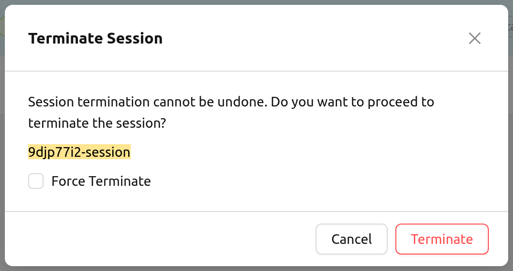
<!-- TODO: Re-capture screenshot of project_admin_terminate_session_modal.png — current image is missing the Force Terminate checkbox and warning -->

:::warning
Use **Force Terminate** only when a session is stuck and its state does not change for an unreasonably long time. Force terminate does not delete the actual containers on the agent(s), so manual cleanup may be required afterward.
:::

:::note
Clicking a session name on the project-admin Sessions page does not currently open a session detail drawer. For background on compute sessions and their detail view, see the [Session Page](#session-page) chapter.
:::

## Deployments

The **Deployments** page lists the model deployments owned by the currently selected project. Use this page to oversee inference endpoints, edit deployment settings, or remove deployments that are no longer in use.

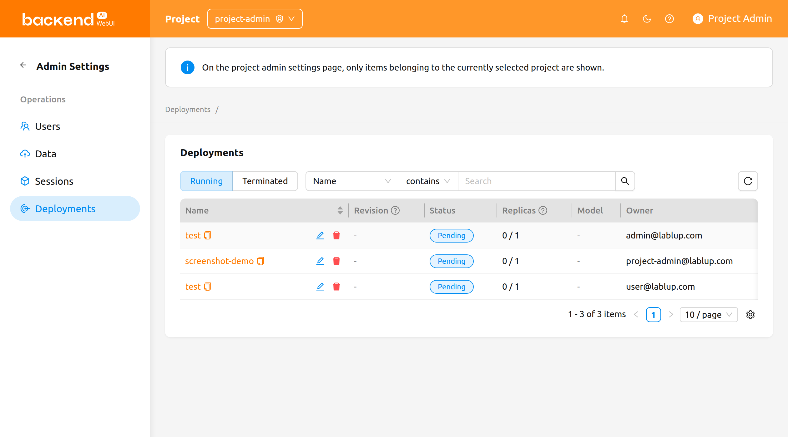

The page provides the following controls:

- **Running / Terminated** segmented control: Toggle between currently running deployments and deployments that have been terminated.
- **Property filter**: Filter the list by Name, Tags, Endpoint URL, or Open to Public.

The table displays the deployment's Name, Revision, Status, Replicas, Model, Created At, and Owner columns, along with the deployment's domain, project, and resource group when relevant.

The **Revision** column shows the deployment's current revision as a clickable `#N` link. Click it to open a drawer that displays the details of the current revision.

   The current revision is available on Backend.AI Manager 26.4.3 and later.

### Deployment Actions

The following actions are available on each deployment row:

- Click the **deployment name** to navigate to the deployment detail page within the project-admin scope.
- Click the **revision number** (`#N`) to open the revision detail drawer for the current revision.
- Click the **pencil icon** to edit the deployment's configuration in the settings modal.
- Click the **trash icon** to delete the deployment. The confirmation modal requires you to type the deployment's name before the deletion is performed.

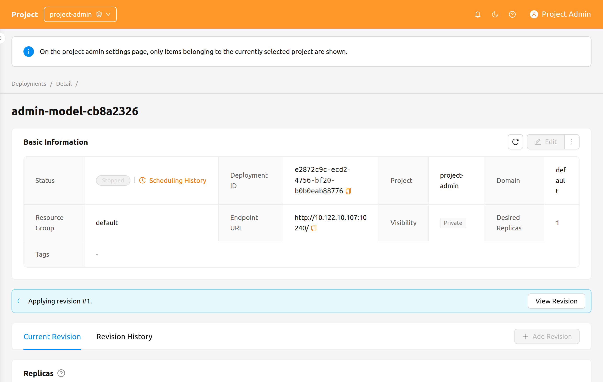

For details about deployment revisions, replicas, and traffic routing, see the [Deployments](#model-serving) chapter.

## Data

The **Data** page lists the storage folders (vfolders) owned by the currently selected project. Use this page to create project-shared folders, restore folders that were accidentally deleted, or purge folders that no longer need to be retained.

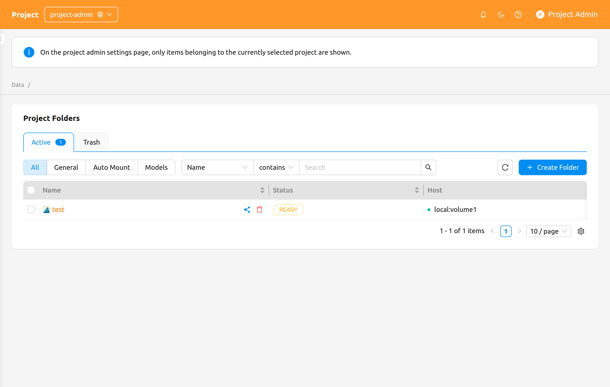
<!-- TODO: Re-capture screenshot of project_admin_data_page.png — current image shows the old mode pill labels (Data/Model) and the old "Deleted" tab instead of "Trash" with count badges -->

The page provides the following controls:

- **Active / Trash** tabs: Switch between currently active folders and folders that have been soft-deleted. Each tab shows a count badge with the number of folders it contains.
- **Mode pill**: Filter by folder usage mode — **All**, **General**, **Pipeline**, **Auto Mount**, or **Models**.

   The **Pipeline** and **Models** options appear only when the corresponding features are enabled in the deployment — the FastTrack pipeline endpoint for **Pipeline**, and model folders for **Models**.

- **Property filter**: Filter the list using the standard storage-folder property filter.

### Create a Folder

To create a new folder from this page:

1. Click the **Create Folder** button at the top right of the page.
2. Fill in the folder details in the creation modal.
3. Click **OK** to create the folder.

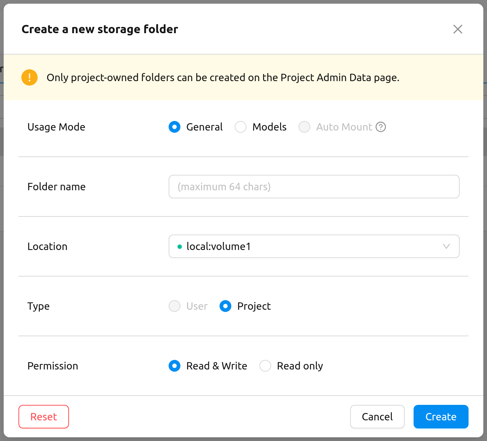

:::info
Only **project-owned** folders can be created from the Project Admin Data page. The creation modal displays the following message to make this explicit:

> Only project-owned folders can be created on the Project Admin Data page.
:::

For details about folder usage modes, permissions, and quota, see the [Vfolder](#vfolders) chapter.

### Restore or Permanently Delete a Folder

Switch to the **Trash** tab to see folders that have been soft-deleted. Select one or more folders using the row checkboxes, then use the header action buttons that appear next to the selection count:

- **Restore**: Move the selected folders back to the Active tab.
- **Delete forever**: Permanently purge the selected folders. This action is irreversible and requires you to type the folder's name to confirm.

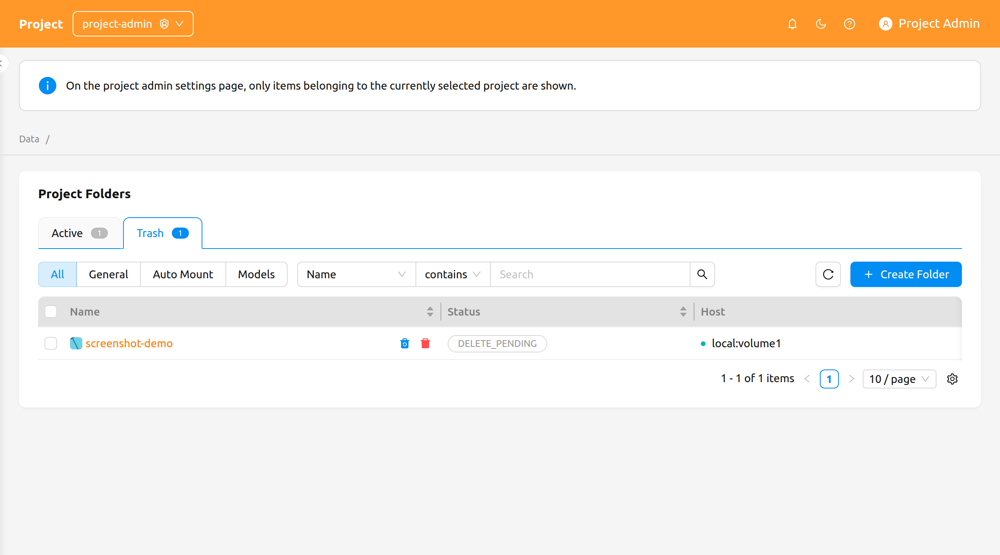

:::danger
Permanently deleting a storage folder removes all of its contents and cannot be undone. The confirmation modal requires you to type the folder's name before the deletion button becomes enabled.
:::
