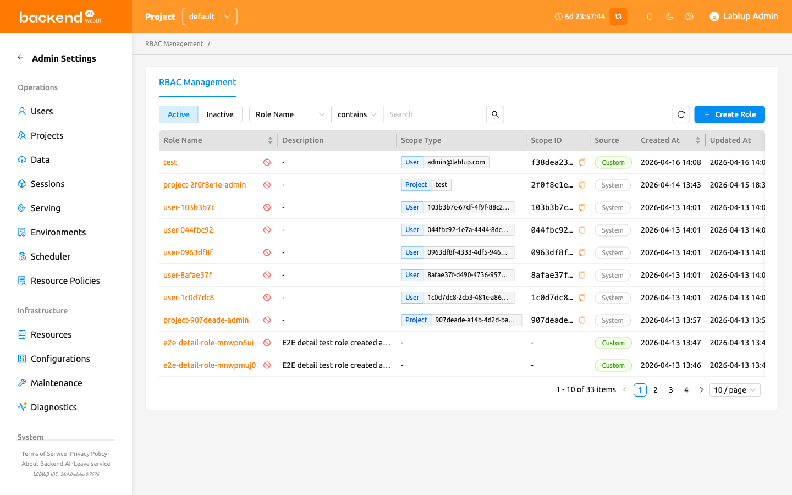
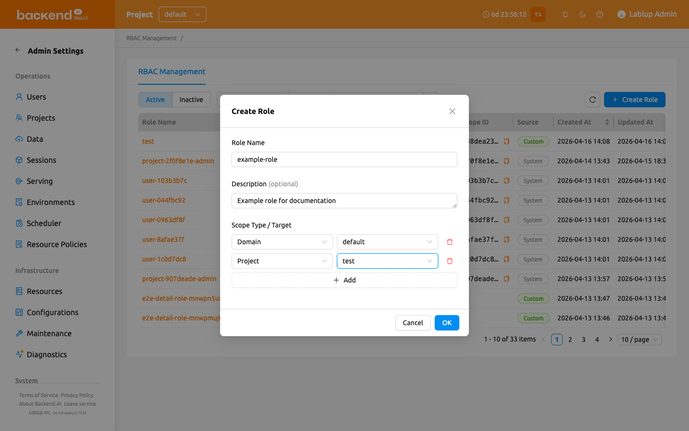
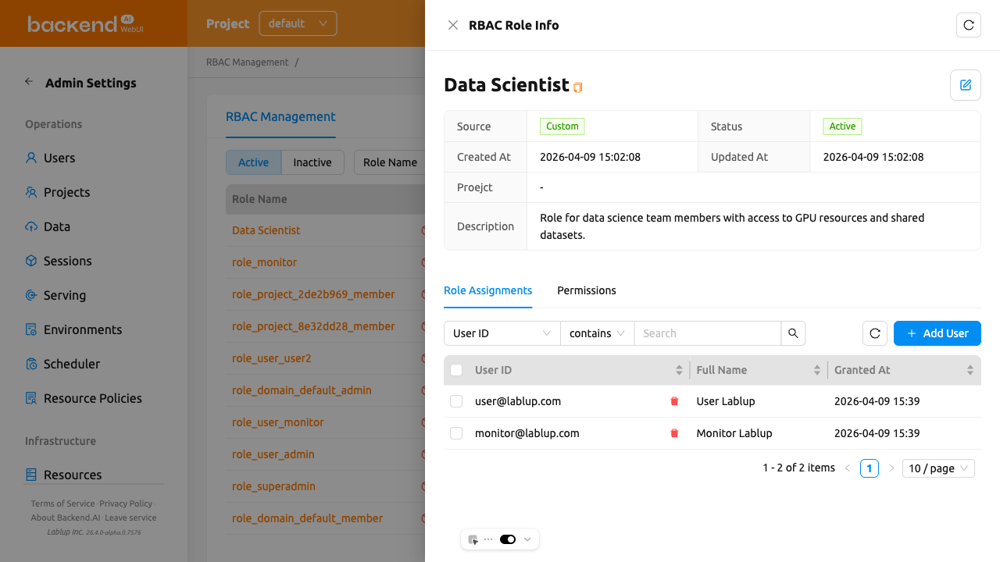
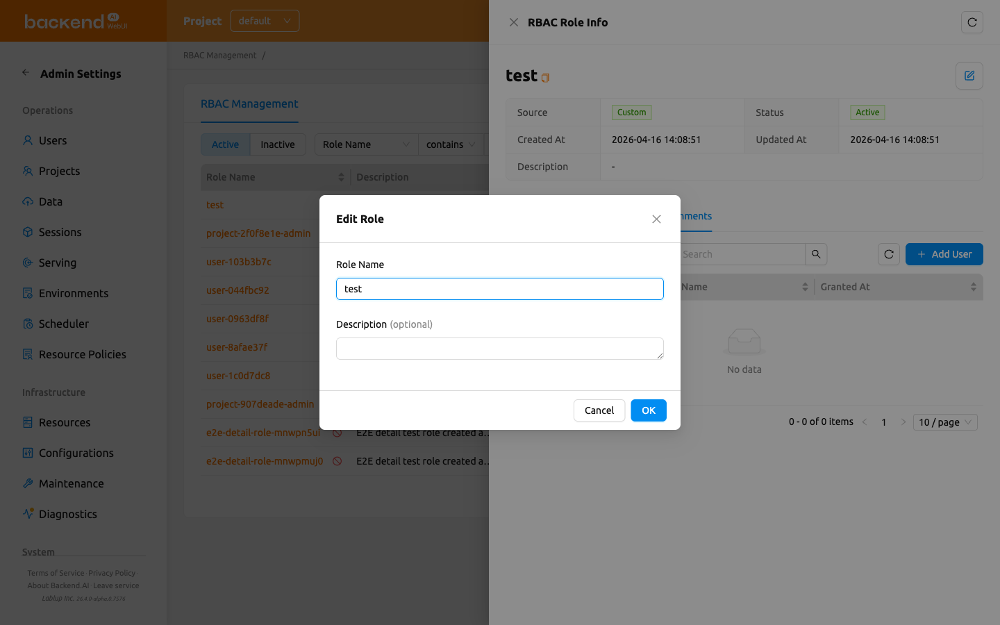
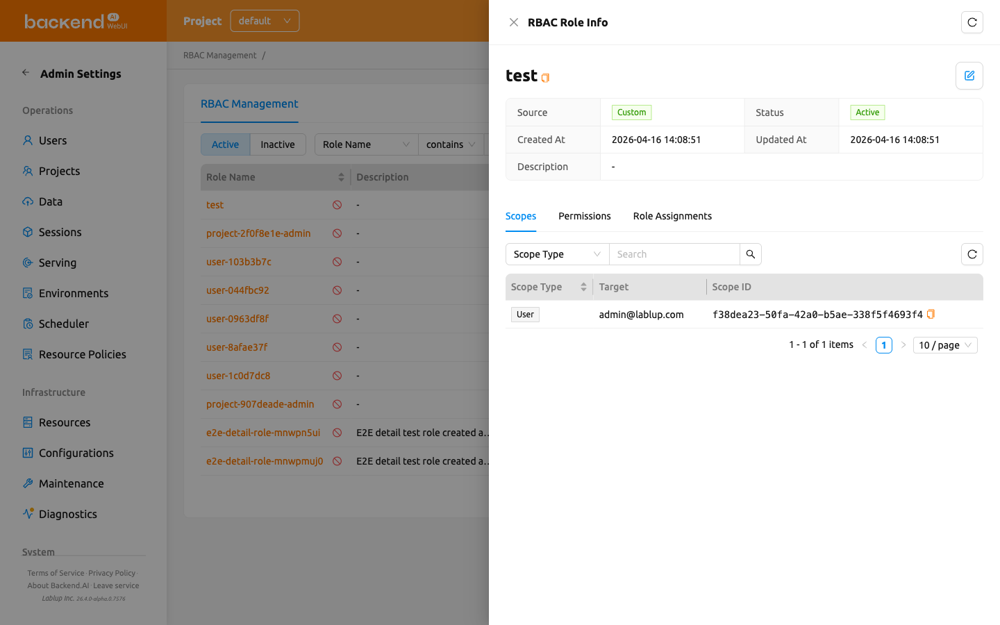
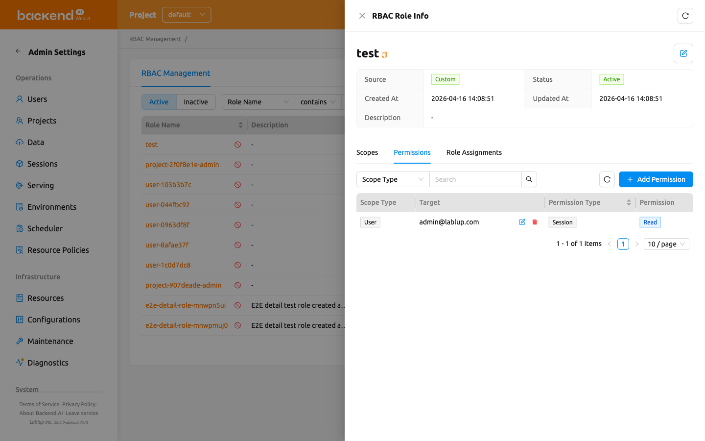
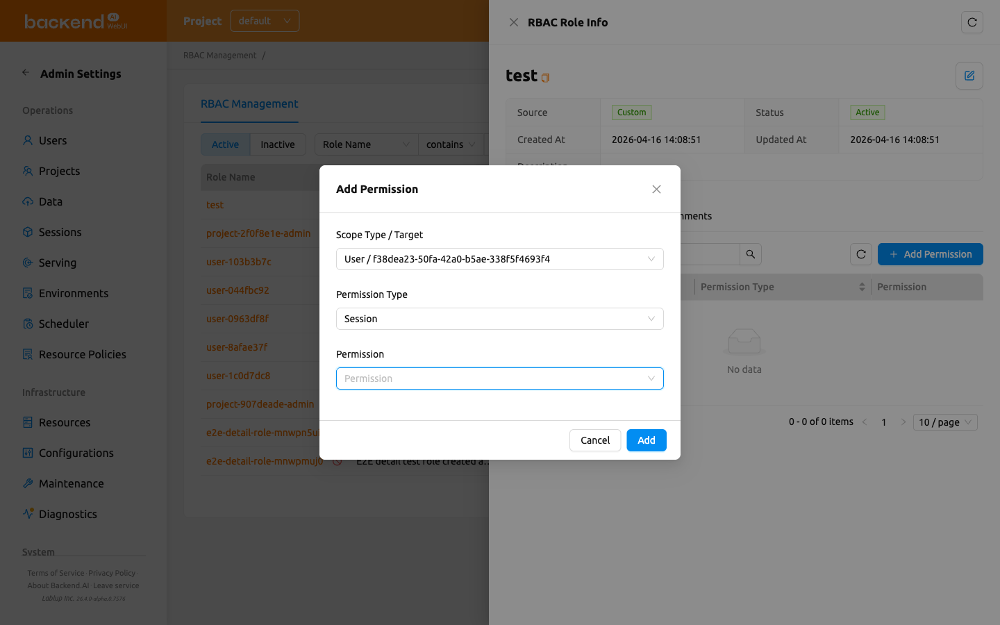
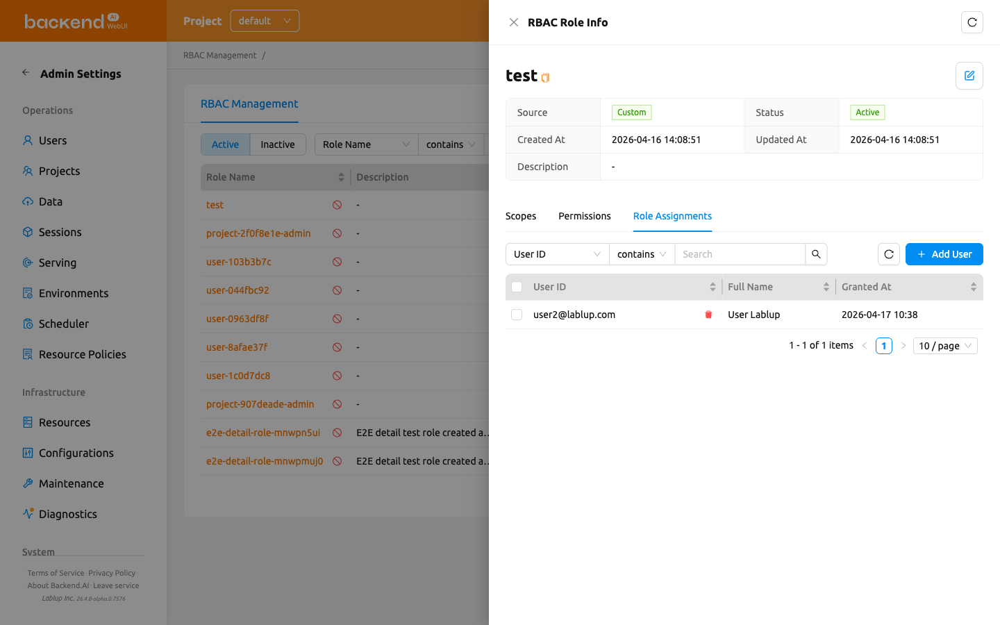
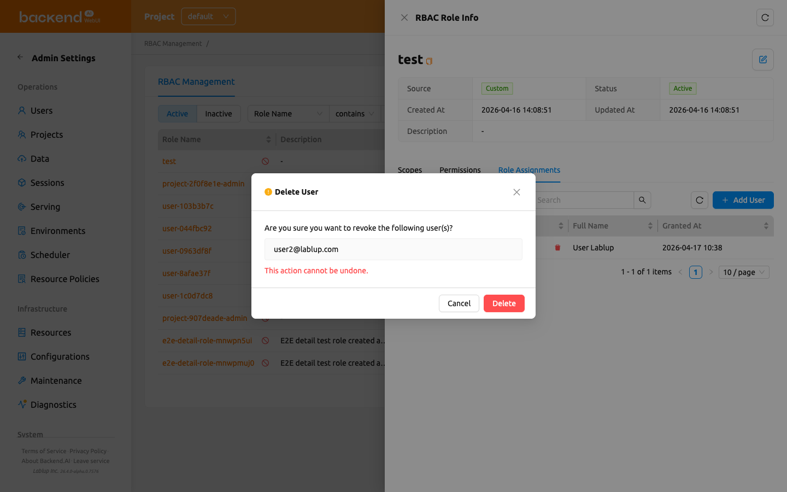

# RBAC Management

RBAC (Role-Based Access Control) Management allows superadmins to define roles with fine-grained permissions and assign them to users. With RBAC, you can control which actions specific users are allowed to perform on various resources throughout the Backend.AI system.

:::note
RBAC Management is only available to superadmins and requires Backend.AI Manager version 25.4.0 or later.
:::

To access the RBAC Management page, click **RBAC Management** in the **Admin Settings** section of the sidebar menu.

## Role List

The Role List page displays all roles in a table format. You can filter, search, and sort roles using the controls at the top of the page.

- **Status filter**: A segmented control to toggle between **Active** and **Inactive** roles. Active is selected by default.
- **Name search**: A property filter to search roles by name or filter by source (System or Custom).
- **Create Role**: A button to create a new custom role.

The table displays the following columns:

- **Role Name**: The name of the role. Click the name to open the role detail drawer.
- **Description**: A brief description of the role's purpose.
- **Scope Type**: The scope type of the role's first assigned scope, with a `+N` indicator when the role has multiple scopes.
- **Scope ID**: The raw scope ID of the role's first assigned scope, with a `+N` indicator when the role has multiple scopes.
- **Source**: Indicates whether the role is **System** (pre-defined) or **Custom** (user-created).
- **Created At**: The date and time when the role was created.
- **Updated At**: The date and time when the role was last modified.

You can sort the table by clicking the **Role Name**, **Created At**, or **Updated At** column headers.

### System vs Custom Roles

Roles are categorized into two source types:

- **System**: Automatically generated roles. You cannot edit their name or description, but you can manage their user assignments and permissions.
- **Custom**: Roles created by superadmins. These are fully editable, including name, description, assignments, scopes, and permissions.

## Create a Role

Creating a role requires you to define its **scopes** upfront. A scope binds the role to a specific resource entity (such as a domain, project, or user) so that every permission you later add to the role is confined to the scopes defined here.

To create a new custom role:

1. Click the **Create Role** button at the top right of the Role List page
2. In the creation modal, fill in the following fields:
   - **Role Name** (required): Enter a unique name for the role
   - **Description** (optional): Enter a description of the role's purpose
   - **Scope Type / Target** (required, at least one): For each scope row, select a **Scope Type** and then choose the specific **Target** within that scope type. Click **Add** to add more scope rows, or the delete icon to remove a row. You must add at least one scope.
3. Click **OK** to create the role

:::info
Scopes are defined at role creation time and cannot be edited afterwards through the role detail drawer. Plan the scopes carefully before creating the role.
:::

### Scope Types

The following scope types are available when creating a role:

- **Domain**: Select from a list of active domains
- **Project**: Select a project (with domain filtering)
- **User**: Search for a user by email or name

## View Role Details

To view detailed information about a role, click the role name in the table. A detail drawer opens on the right side of the page.

The drawer header displays the role name and provides an **Edit** button for custom roles. The detail section shows the following metadata:

- **Source**: System or Custom
- **Status**: Active or Inactive
- **Created At**: The creation timestamp
- **Updated At**: The last modification timestamp
- **Description**: The role's description

Below the metadata, three tabs are available: **Scopes**, **Permissions**, and **Role Assignments**.

### Edit a Role

To edit a custom role's name or description:

1. Open the role detail drawer by clicking a role name in the table
2. Click the **Edit** button (pencil icon) in the drawer header
3. Modify the **Role Name** and/or **Description** in the edit modal
4. Click **OK** to save the changes

:::note
The Edit button is only available for Custom roles. System roles cannot have their name or description modified. Scopes cannot be modified after role creation in either case.
:::

### Role Status Management

Roles have two statuses that you can manage from the role list:

- **Active**: The role is currently in effect. You can **Deactivate** an active role to temporarily suspend it.
- **Inactive**: The role is suspended. You can **Activate** an inactive role to restore it, or **Purge** it to permanently remove it.

Each role row displays a **Deactivate** action button when viewing **Active** roles, or **Activate** and **Purge Role** action buttons when viewing **Inactive** roles.

:::danger
Purging a role is irreversible. The role and all its associated data will be permanently removed. You must remove all user assignments and permissions from the role before purging.
:::

## View Role Scopes

The **Scopes** tab in the role detail drawer lists the scope entries that were assigned to the role at creation time. Each entry constrains the set of targets that permissions on this role can reference.

The table displays the following columns:

- **Scope Type**: The type of the scope entry (e.g., Domain, Project, User).
- **Target**: The human-readable name of the scope target (e.g., the domain name, project name, or user email).
- **Scope ID**: The UUID of the scope target.

Use the filter control at the top to narrow down scope entries by **Scope Type**.

:::note
Scopes are read-only in this tab. To change a role's scopes, you must create a new role with the desired scopes.
:::

## Manage Permissions

The **Permissions** tab in the role detail drawer shows the fine-grained permissions configured for the role.

### Understanding Permissions

Each permission consists of four components:

- **Scope Type**: The type of resource that the permission targets (e.g., Domain, Project, User)
- **Target**: The specific entity within the scope type (e.g., a specific domain name, a specific project)
- **Permission Type**: The category of resource the permission controls, filtered based on the selected scope type
- **Permission**: The operation allowed on the resource. Only valid operations for the selected permission type are shown. Operations are grouped into two categories:
   * **Direct**: Create, Read, Update, Soft Delete, Hard Delete
   * **Delegate to Others**: Delegate All, Delegate Read, Delegate Update, Delegate Soft Delete, Delegate Hard Delete

:::info
The combined **Scope Type / Target** of each permission is inherited from the role's scope entries. When you add a permission, you can only pick from the scopes that were defined when the role was created. To broaden a role's reach, create a new role with additional scopes.
:::

### Permission Examples

Here are some common permission configurations to help you understand how the four components work together. The **Scope Type / Target** column shows the role-level scope that the permission reuses.

| Scenario | Scope Type / Target | Permission Type | Permission |
|----------|---------------------|----------------|------------|
| Allow a user to create storage folders in a specific project | Project / my-project | VFolder | Create |
| Allow a user to view all sessions in a domain | Domain / default | Session | Read |
| Allow a user to manage model serving endpoints | Domain / default | Endpoint | Create, Read, Update |
| Allow a user to delete container images | Domain / default | Image | Soft Delete |

### Add a Permission

1. Open the role detail drawer and select the **Permissions** tab
2. Click the **Add Permission** button
3. In the modal, fill in the following fields:
   - **Scope Type / Target**: Select one of the scope entries that were assigned to the role. The dropdown lists only scopes that have at least one actionable entity.
   - **Permission Type**: Select the entity type. Only valid types for the selected scope type are shown.
   - **Permission**: Select the operation (e.g., Create, Read, Update, Soft Delete, Hard Delete, or delegation operations)
4. Click **Add** to create the permission

:::note
If a role was created without any scopes (for example, a legacy role imported from an earlier version), the **Add Permission** modal falls back to showing separate **Scope Type** and **Target** fields so that administrators can still configure the permission target.
:::

### Delete a Permission

1. In the **Permissions** tab, click the **Delete** button next to the permission you want to remove
2. Confirm the deletion in the confirmation dialog

## Manage User Assignments

The **Role Assignments** tab in the role detail drawer shows which users are assigned to the role.

### Add Users to a Role

1. Open the role detail drawer and select the **Role Assignments** tab
2. Click the **Add User** button
3. In the modal, search for users by email or name
4. Select one or more users using the checkboxes
5. Click **Add** to assign the selected users to the role

### Remove Users from a Role

1. In the **Role Assignments** tab, click the **Delete** button next to the user you want to remove
2. Confirm the removal in the confirmation dialog

