

# RBAC Management

RBAC (Role-Based Access Control) Management allows superadmins to define roles with fine-grained permissions and assign them to users. With RBAC, you can control which actions specific users are allowed to perform on various resources throughout the Backend.AI system.

To access the RBAC Management page, click **RBAC Management** in the **Admin Settings** section of the sidebar menu.

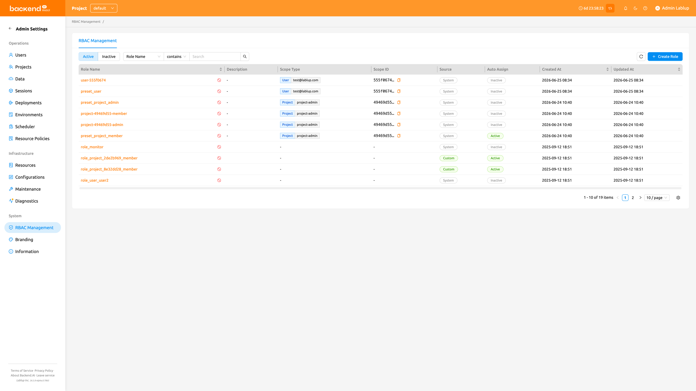

## Role list

The Role List page displays all roles in a table format. You can filter, search, and sort roles using the controls at the top of the page.

- **Status filter**: A segmented control to toggle between **Active** and **Inactive** roles. Active is selected by default.
- **Name search**: A property filter to search roles by name or filter by source (System or Custom). The filter input adapts to the selected property — for example, the **Source** filter exposes the available values (System / Custom) as a typed selector rather than a free-form text box, while the **Name** filter accepts free text.
- **Create Role**: A button to create a new custom role.

The table displays the following columns:

- **Role Name**: The name of the role. Click the name to open the role detail drawer.
- **Description**: A brief description of the role's purpose.
- **Scope Type**: The scope type of the role's first assigned scope, with a `+N` indicator when the role has multiple scopes.
- **Scope ID**: The raw scope ID of the role's first assigned scope, with a `+N` indicator when the role has multiple scopes.
- **Source**: Indicates whether the role is **System** (pre-defined) or **Custom** (user-created).
- **Auto Assign**: Indicates whether the role is automatically assigned to a user when they are added to a scope the role is registered in. Displays **Active** when auto-assignment is enabled, or **Inactive** when disabled.
- **Created At**: The date and time when the role was created.
- **Updated At**: The date and time when the role was last modified.

### System vs custom roles

Roles are categorized into two source types:

- **System**: Automatically generated roles. You cannot edit their name or description, but you can manage their user assignments and permissions.
- **Custom**: Roles created by superadmins. These are fully editable, including name, description, assignments, scopes, and permissions.

## Create a role

Creating a role requires you to define its **scopes** upfront. A scope binds the role to a specific resource entity (such as a domain, project, or user) so that every permission you later add to the role is confined to the scopes defined here.

To create a new custom role:

1. Click the **Create Role** button at the top right of the Role List page
2. In the creation modal, fill in the following fields:
   - **Role Name** (required): Enter a unique name for the role
   - **Description** (optional): Enter a description of the role's purpose
   - **Auto Assign** (optional): When enabled, the role is automatically granted to users when they are added to a scope the role is registered in. Disabled by default.
   - **Scope Type / Target** (required, at least one): For each scope row, select a **Scope Type** and then choose the specific **Target** within that scope type. Click **Add** to add more scope rows, or the delete icon to remove a row. You must add at least one scope.
3. Click **OK** to create the role

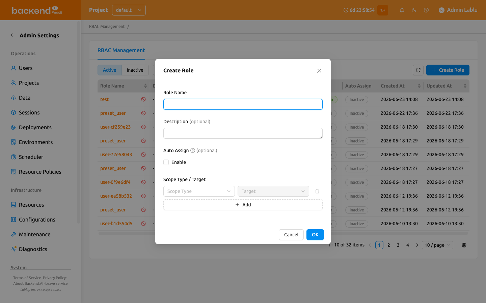

:::info
The **Scope Type** and **Target** you define when creating a role do not grant any permissions on their own. Instead, they pre-define the **Scope Type / Target** options that become available when you later add [permissions](#manage-permissions) to this role. In other words, role creation only narrows down the range of scope types and targets this role's permissions can use — each permission can then be configured only within the scope types and targets defined here.
:::

:::warning
Scopes are defined at role creation time and cannot be edited afterwards through the role detail drawer. Plan the scopes carefully before creating the role.
:::

## View role details

To view detailed information about a role, click the role name in the table. A detail drawer opens on the right side of the page.

The drawer header displays the role name and provides an **Edit** button for custom roles. The detail section shows the following metadata:

- **Source**: System or Custom
- **Status**: Active or Inactive
- **Auto Assign**: Whether auto-assignment is Active or Inactive. When Active, the role is automatically granted to users added to one of its registered scopes.
- **Created At**: The creation timestamp
- **Updated At**: The last modification timestamp
- **Description**: The role's description

Below the metadata, three tabs are available: **Scopes**, **Permissions**, and **Role Assignments**.

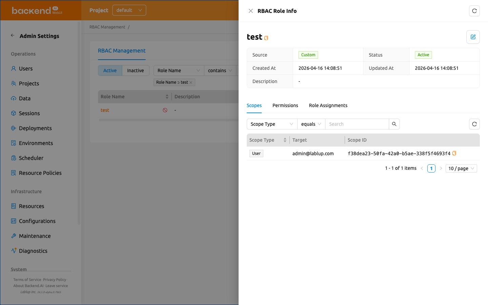

### Edit a role

To edit a custom role's name, description, or auto-assignment setting:

1. Open the role detail drawer by clicking a role name in the table
2. Click the **Edit** button (pencil icon) in the drawer header
3. Modify the following fields in the edit modal:
   - **Role Name**: The name of the role
   - **Description**: A description of the role's purpose
   - **Auto Assign**: When enabled, the role is automatically granted to users added to a scope the role is registered in.
4. Click **OK** to save the changes

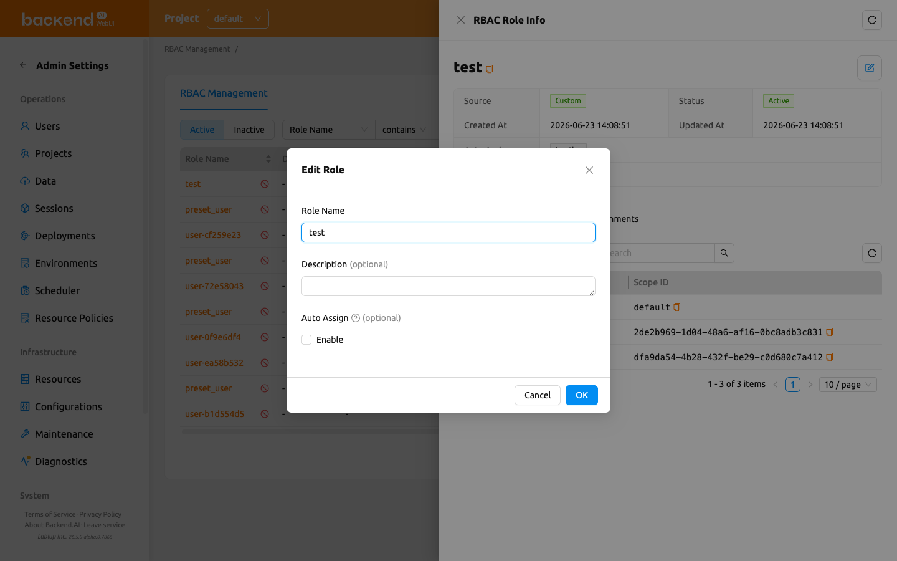

:::note
The Edit button is only available for Custom roles. System roles cannot have their name or description modified. Scopes cannot be modified after role creation in either case.
:::

## View role scopes

The **Scopes** tab in the role detail drawer lists the scope entries that were assigned to the role at creation time. Each entry constrains the set of targets that permissions on this role can reference.

The table displays the following columns:

- **Scope Type**: The type of the scope entry (e.g., Domain, Project, User).
- **Target**: The human-readable name of the scope target (e.g., the domain name, project name, or user email).
- **Scope ID**: The UUID of the scope target.

Use the filter control at the top to narrow down scope entries by **Scope Type**.

:::note
Scopes are read-only in this tab. To change a role's scopes, you must create a new role with the desired scopes.
:::

## Manage permissions

The **Permissions** tab in the role detail drawer shows the fine-grained permissions configured for the role.

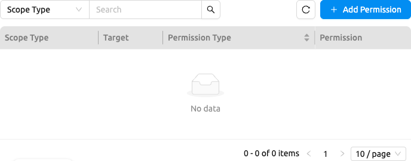

### Understanding permissions

Each permission consists of four components:

- **Scope Type**: The effective scope to which the permission applies (e.g., Domain, Project, User)
- **Target**: A specific entity within the effective scope (e.g., a specific domain name, a specific project)
- **Permission Type**: The target on which operations are performed within the permission's effective scope.
- **Permission**: The operations allowed for the permission type. Only operations valid for the selected permission type are shown. Operations are grouped into two categories:
   * **Direct**: Create, Read, Update, Soft Delete, Hard Delete
   * **Delegate to Others**: Delegate All, Delegate Read, Delegate Update, Delegate Soft Delete, Delegate Hard Delete

:::info
The combined **Scope Type / Target** of each permission is inherited from the role's scope entries. When you add a permission, you can only pick from the scopes that were defined when the role was created. To broaden a role's reach, create a new role with additional scopes.
:::

### Permission examples

Here are some common permission configurations to help you understand how the four components work together. The **Scope Type / Target** column shows the role-level scope that the permission reuses.

| Scenario | Scope Type / Target | Permission Type | Permission |
|----------|---------------------|----------------|------------|
| Allow a user to create storage folders in a specific project | Project / my-project | Folder | Create |
| Allow a user to view all sessions in a specific domain | Domain / default | Session | Read |
| Allow a user to manage model services in a specific domain | Domain / default | Model Service | Create, Read, Update |
| Allow a user to delete container images in a specific domain | Domain / default | Image | Soft Delete |

### Add a permission

1. Open the role detail drawer and select the **Permissions** tab
2. Click the **Add Permission** button
3. In the modal, fill in the following fields:
   - **Scope Type / Target**: Select one of the scope entries that were assigned to the role. The dropdown lists only scopes that have at least one actionable entity. The target is shown by its resolved, localized name (for example, the domain or project's display name) rather than its raw UUID, so you can recognize the scope at a glance.
   - **Permission Type**: Select the entity type. Only valid types for the selected scope type are shown. Permission type labels (such as **Role Assignment**) are localized to match your UI language.
   - **Permission**: Select the operation (e.g., Create, Read, Update, Soft Delete, Hard Delete, or delegation operations)
4. Click **Add** to create the permission

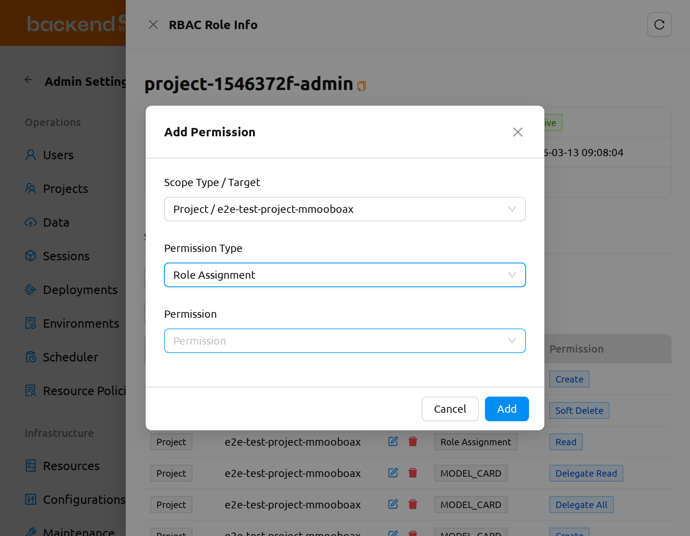

### Remove a permission

1. In the **Permissions** tab, click the **Remove Permission** button next to the permission you want to remove
2. A small confirmation popup appears anchored to the button. Click **OK** to confirm, or **Cancel** to dismiss.

Removing a permission from a role only detaches it from the role's permission set — the role itself, its scopes, and its user assignments are kept. You can add the same permission back later from the same tab, so this action is treated as reversible and uses a lightweight popup confirmation rather than a typed-name confirmation modal.

## Manage user assignments

The **Role Assignments** tab in the role detail drawer shows which users are assigned to the role.

### Add users to a role

1. Open the role detail drawer and select the **Role Assignments** tab
2. Click the **Add User** button
3. In the modal, search for users by email or name
4. Select one or more users using the checkboxes
5. Click **Add** to assign the selected users to the role

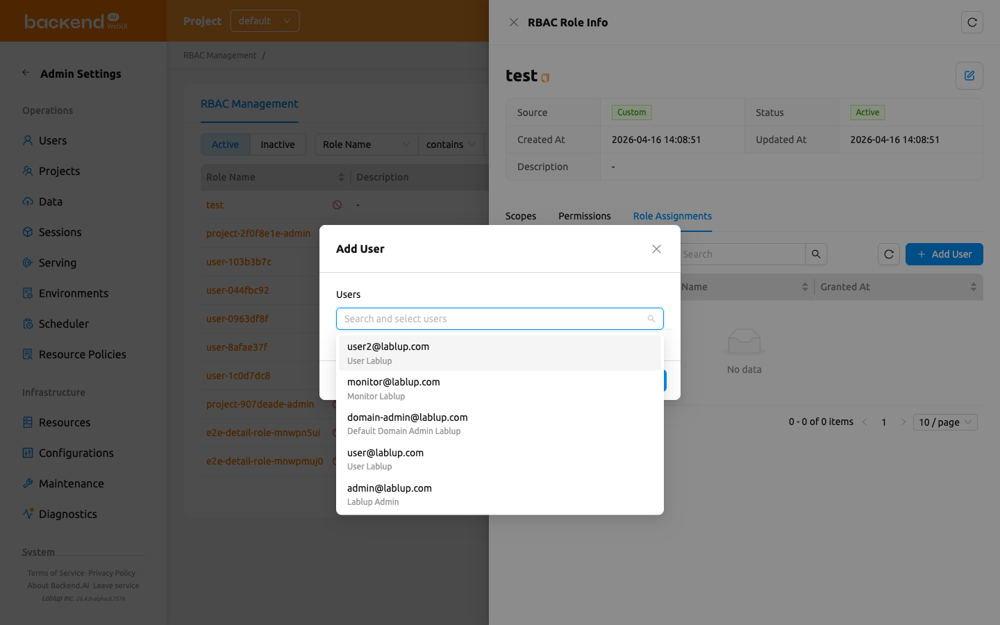

Adding users is a bulk operation — you can select several users in a single pass and assign them all at once.

### Revoke users from a role

You can revoke a single user or several users at once.

To revoke a single user:

1. In the **Role Assignments** tab, hover over the user row and click the revoke (trash) icon next to the user.
2. A **Revoke User** confirmation modal opens. Review the listed user(s) and click **Revoke User** to confirm, or **Cancel** to dismiss.

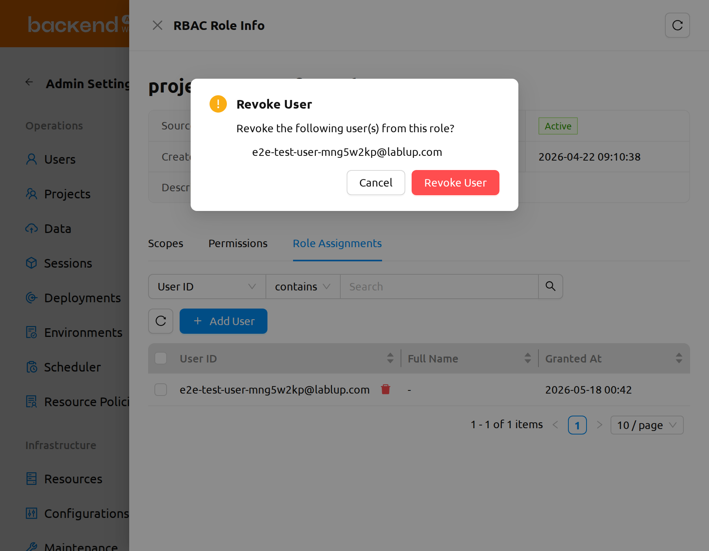

To revoke multiple users at once:

1. In the **Role Assignments** tab, use the checkboxes to select the users you want to remove. A selection-count label appears next to the revoke control showing how many rows are selected; use the clear-selection control on that label to deselect all rows.
2. Click the bulk **Revoke User** button (trash icon) that appears once one or more rows are selected.
3. In the **Revoke User** confirmation modal, review the listed users and click **Revoke User** to confirm, or **Cancel** to dismiss.

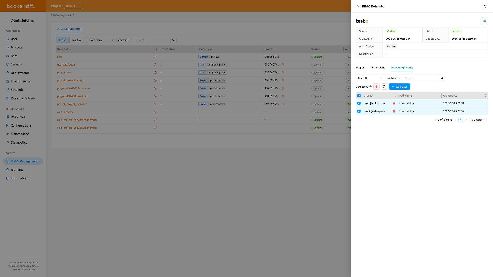

Revoking a user removes only that user's assignment to this role; the role itself and its other assignments remain unchanged.

:::note
Revoking a role assignment can be reversed by re-adding the user to the role from the **Role Assignments** tab.
:::

## Grant Project Admin authority

Creating a project also creates a dedicated role named `project-<project_id>-admin`, where `<project_id>` is the UUID of that project. Assigning a user to this role grants them [Project Admin](#project-admin-features) authority over that specific project — they can manage the project's users, sessions, deployments, and storage folders without holding system-wide superadmin privileges.

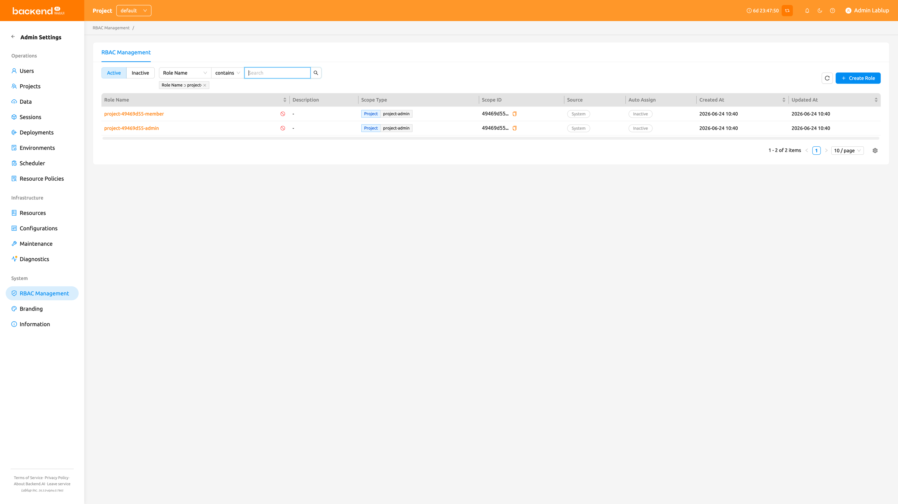

To grant Project Admin authority to a user:

1. Open the [Role List](#role-list) and locate the `project-<project_id>-admin` role for the target project. Use the property filter to search by role name (e.g. enter `project-` to narrow the list).
2. Click the role name to open the role detail view.
3. Follow [Add Users to a Role](#add-users-to-a-role) on this role to assign the user.

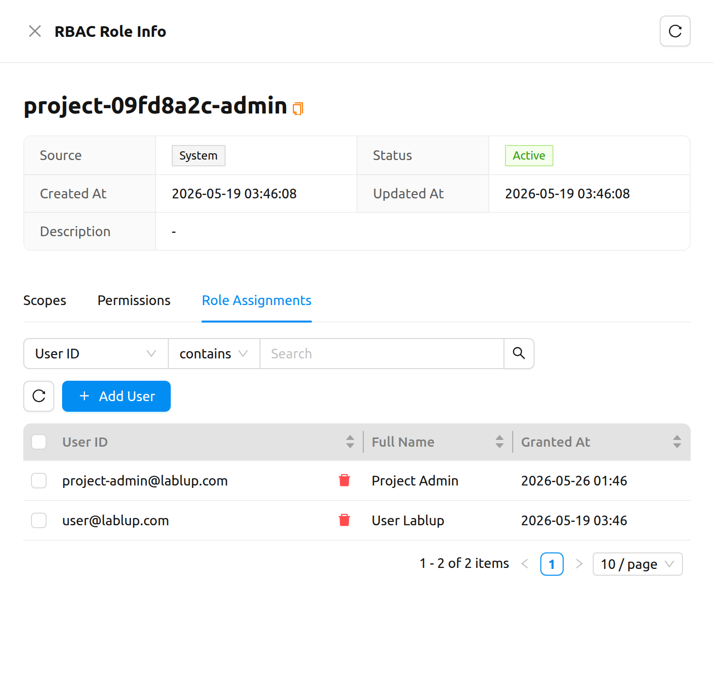

The user gains Project Admin authority immediately. The next time they open the header's project dropdown they will see the project-admin badge next to the corresponding project, and the project-admin sidebar entries described in the [Project Admin Features](#project-admin-features) chapter.

To revoke Project Admin authority, follow [Revoke Users from a Role](#revoke-users-from-a-role) on the same `project-<project_id>-admin` role.
