

# RBAC Management

RBAC (Role-Based Access Control) Management allows superadmins to define roles with fine-grained permissions and assign them to users. With RBAC, you can control which actions specific users are allowed to perform on various resources throughout the Backend.AI system.

To access the RBAC Management page, click **RBAC Management** in the **Admin Settings** section of the sidebar menu.

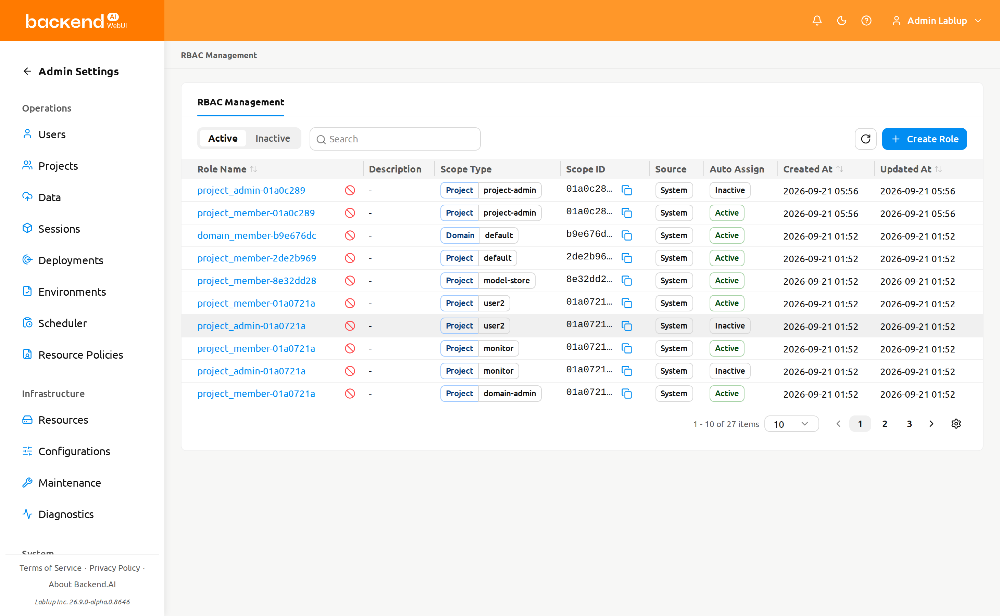

## Role list

The Role List page displays all roles in a table format. You can filter, search, and sort roles using the controls at the top of the page.

- **Status filter**: A segmented control to toggle between **Active** and **Inactive** roles. Active is selected by default.
- **Property filter**: A property filter to narrow the list. The filter input adapts to the selected property. The following properties are available:
   * **Name**: Free-text search by role name.
   * **Source**: A typed selector that exposes the available values (**System** / **Custom**) rather than a free-form text box.
   * **Assigned User**: A user picker that filters the list to the roles assigned to the chosen user. The user's email is shown on the resulting condition tag.
   * **Scope Type**: A typed selector of RBAC scope types (for example, Domain, Project, or User).
   * **Scope ID**: Free-text search by the raw scope UUID.
- **Create Role**: A button to create a new custom role.

The table displays the following columns:

- **Role Name**: The name of the role. Click the name to open the role detail drawer.
- **Description**: A brief description of the role's purpose.
- **Scope Type**: The scope type of the role's first assigned scope, with a `+N` indicator when the role has multiple scopes.
- **Scope ID**: The raw scope ID of the role's first assigned scope, with a `+N` indicator when the role has multiple scopes.
- **Source**: Indicates whether the role is **System** (pre-defined) or **Custom** (user-created).
- **Auto Assign**: Indicates whether the role is automatically assigned to a user when they are added to a scope the role is registered in. Displays **Active** when auto-assignment is enabled, or **Inactive** when disabled.
- **Created At**: The date and time when the role was created.
- **Updated At**: The date and time when the role was last modified.

### System vs custom roles

Roles are categorized into two source types:

- **System**: Automatically generated roles. You cannot edit their name or description, but you can manage their user assignments and permissions.
- **Custom**: Roles created by superadmins. These are fully editable, including name, description, assignments, scopes, and permissions.

## Create a role

Creating a role requires you to define its **scopes** upfront. A scope binds the role to a specific resource entity (such as a domain, project, or user) so that every permission you later add to the role is confined to the scopes defined here.

To create a new custom role:

1. Click the **Create Role** button at the top right of the Role List page
2. In the creation modal, fill in the following fields:
   - **Role Name** (required): Enter a unique name for the role
   - **Description** (optional): Enter a description of the role's purpose
   - **Auto Assign** (optional): When enabled, the role is automatically granted to users when they are added to a scope the role is registered in. Disabled by default.
   - **Scope Type / Target** (required, at least one): For each scope row, select a **Scope Type** and then choose the specific **Target** within that scope type. Click **Add** to add more scope rows, or the delete icon to remove a row. You must add at least one scope.
3. Click **OK** to create the role

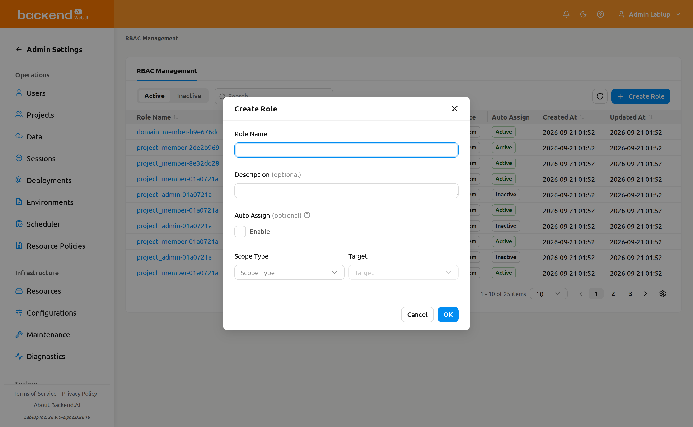

:::info
The **Scope Type** and **Target** you define when creating a role do not grant any permissions on their own. Instead, they pre-define the **Scope Type / Target** options that become available when you later add [permissions](#manage-permissions) to this role. In other words, role creation only narrows down the range of scope types and targets this role's permissions can use — each permission can then be configured only within the scope types and targets defined here.
:::

:::warning
Scopes are defined at role creation time and cannot be edited afterwards through the role detail drawer. Plan the scopes carefully before creating the role.
:::

## View role details

To view detailed information about a role, click the role name in the table. A detail drawer opens on the right side of the page.

The drawer header displays the role name and provides an **Edit** button for custom roles. The detail section shows the following metadata:

- **Source**: System or Custom
- **Status**: Active or Inactive
- **Auto Assign**: Whether auto-assignment is Active or Inactive. When Active, the role is automatically granted to users added to one of its registered scopes.
- **Created At**: The creation timestamp
- **Updated At**: The last modification timestamp
- **Description**: The role's description

Below the metadata, two tabs are available: **Permissions** and **Role Assignments**. The **Permissions** tab is selected by default.

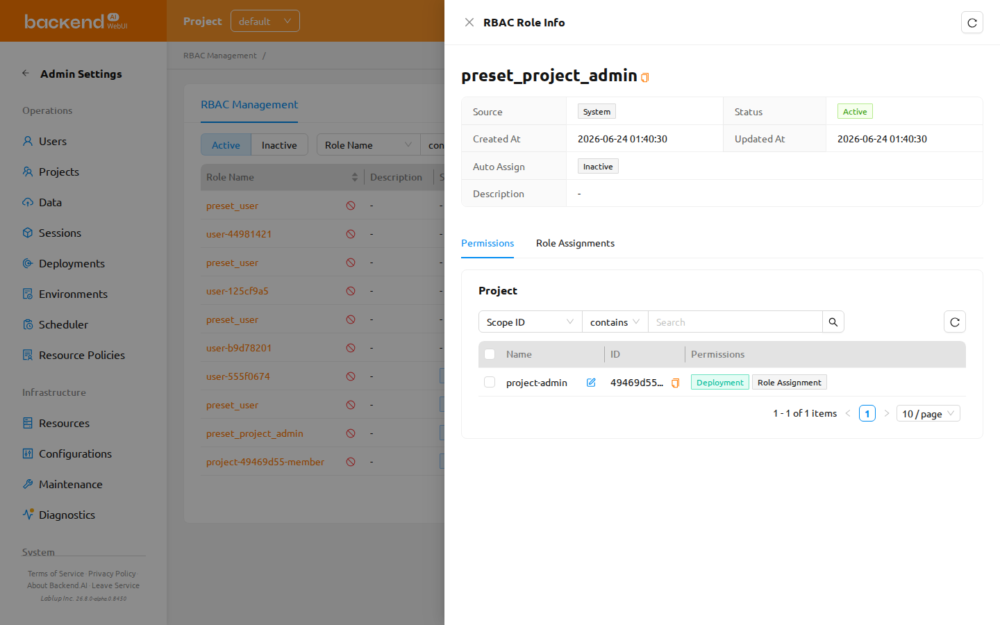

### Edit a role

To edit a custom role's name, description, or auto-assignment setting:

1. Open the role detail drawer by clicking a role name in the table
2. Click the **Edit** button (pencil icon) in the drawer header
3. Modify the following fields in the edit modal:
   - **Role Name**: The name of the role
   - **Description**: A description of the role's purpose
   - **Auto Assign**: When enabled, the role is automatically granted to users added to a scope the role is registered in.
4. Click **OK** to save the changes

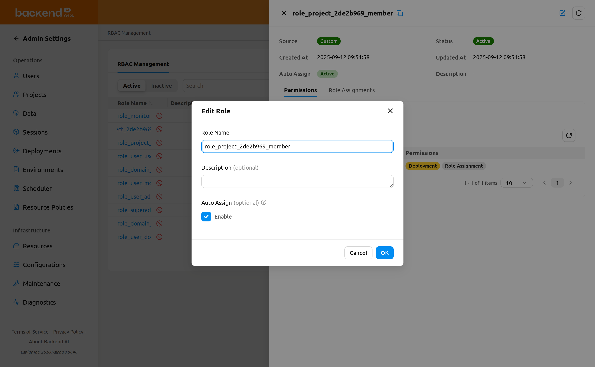

:::note
The Edit button is only available for Custom roles. System roles cannot have their name or description modified. Scopes cannot be modified after role creation in either case.
:::

## Manage permissions

The **Permissions** tab in the role detail drawer is a merged, detailed view that combines the role's scopes and its fine-grained permissions. It renders **one card per scope type** the role uses, and each card shows that scope type's scopes together with the permissions granted on them.

:::info
The scopes a role can reference are defined when the role is created and are **read-only** afterward — you cannot change them from the role detail drawer. In the Permissions tab, scopes appear as the rows inside each scope-type card. To change a role's scopes, create a new role with the desired scopes.
:::

### Scope-type cards

The Permissions tab shows one card for each scope type the role uses (for example, Domain, Project, or User). Scope types the role does not use are hidden, and the card title is the localized scope-type name. Each card contains:

- **Scope ID filter**: A property filter that narrows the card's rows by the raw scope UUID. Searching by the resolved scope name is not supported.
- **Refresh** button: Reloads the card's rows and recomputes the permission tags.
- **Scope table**: Lists the role's scopes of this type, with these columns:
   * **Name**: The resolved scope name (for example, the domain, project, or user's display name), with an inline **Edit** action that opens the permission edit modal for that scope.
   * **ID**: The scope UUID.
   * **Permissions**: One tag per permission type, colored by grant state (see below). When the scope type has no configurable entities, this column shows `-`.
- **Pagination**: Pages through the card's scopes when there are many.

If a role has no scopes at all, the tab shows the message **No scopes are configured for this role** instead of any cards.

### Grant-state tags

In the **Permissions** column, each permission-type tag is colored by how many of that type's operations are granted for the scope:

- **Fully allowed** (green): Every operation of that permission type is granted.
- **Partially allowed** (yellow): Some, but not all, operations are granted.
- **Not allowed** (no color): None of the operations are granted.

Hover over a tag to see its state label.

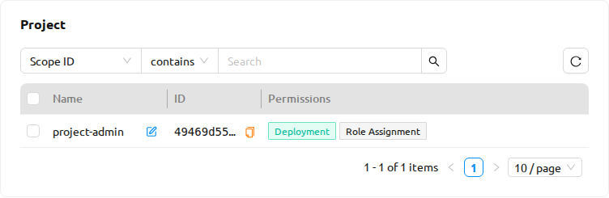

### Understanding permissions

Each permission consists of four components:

- **Scope Type**: The effective scope to which the permission applies (e.g., Domain, Project, User)
- **Target**: A specific entity within the effective scope (e.g., a specific domain name, a specific project)
- **Permission Type**: The target on which operations are performed within the permission's effective scope.
- **Permission**: The operations allowed for the permission type. Only operations valid for the selected permission type are shown. Operations are grouped into two categories:
   * **Direct**: Create, Read, Update, Soft Delete, Hard Delete
   * **Delegate to Others**: Delegate All, Delegate Read, Delegate Update, Delegate Soft Delete, Delegate Hard Delete

:::info
The combined **Scope Type / Target** of each permission is inherited from the role's scope entries. You can only grant permissions on scopes that were defined when the role was created. To broaden a role's reach, create a new role with additional scopes.
:::

### Permission examples

Here are some common permission configurations to help you understand how the four components work together. The **Scope Type / Target** column shows the role-level scope that the permission reuses.

| Scenario | Scope Type / Target | Permission Type | Permission |
|----------|---------------------|----------------|------------|
| Allow a user to create storage folders in a specific project | Project / my-project | Folder | Create |
| Allow a user to view all sessions in a specific domain | Domain / default | Session | Read |
| Allow a user to manage model services in a specific domain | Domain / default | Model Service | Create, Read, Update |
| Allow a user to delete container images in a specific domain | Domain / default | Image | Soft Delete |

### Edit permissions for a scope (single scope)

Permissions are edited per scope through a grid-based modal, where each row is a permission type and each cell is an operation checkbox.

1. In the **Permissions** tab, open the scope-type card and click the **Edit** action on the scope row you want to change.
2. The **Edit {Scope Type} Permissions** modal opens with the scope name shown as a subtitle. It shows a grid where:
   - Rows are the **Permission Types** valid for the scope type.
   - Columns are grouped into **Direct** (Create, Read, Update, Soft Delete, Hard Delete) and **Delegate to Others** (All, Read, Update, Soft Delete, Hard Delete).
   - Cells the permission matrix does not support render as `-` with a **This permission cannot be assigned.** tooltip.
3. Each checkbox is **pre-checked** to the scope's currently granted operations. Tick or untick cells to change what is allowed.
4. Click **Save**. The changes are reconciled against the scope's current grants — newly ticked cells are granted and cleared cells are removed.

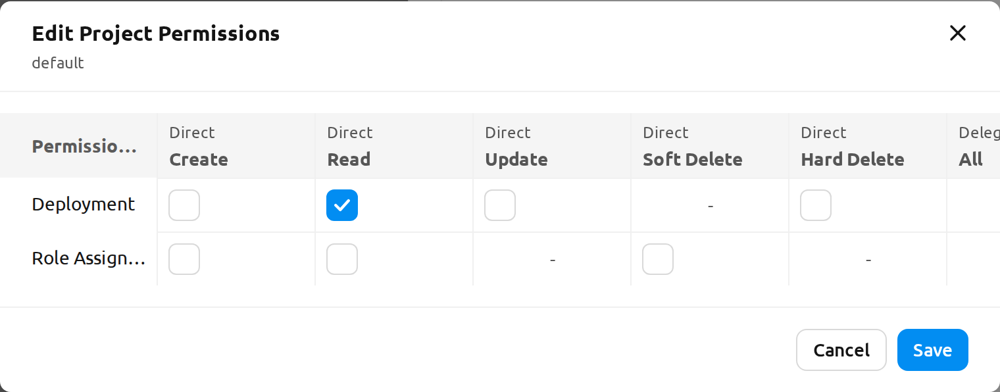

:::note
Editing permissions is **reversible** — you can re-open the modal and change the grid again at any time — so saving uses a normal **Save** button rather than a typed-name confirmation.
:::

### Edit permissions for multiple scopes (bulk)

You can apply the same permission change to several scopes of the same type at once.

1. In a scope-type card, use the row checkboxes to select **two or more** scopes. A selection-count label appears; use the pencil (**Edit Permissions**) control next to it to open the bulk modal.
2. The **Bulk Edit {Scope Type} Permissions** modal opens. Every cell starts in a **Keep as is** state: untouched cells keep each selected scope's existing value, and only the cells you switch into edit mode are applied to **all** selected scopes.
3. Click a cell to switch it into edit mode (it starts checked). Tick or untick it to set the value you want to apply to every selected scope.
4. Click **Save** to apply the changes to all selected scopes.

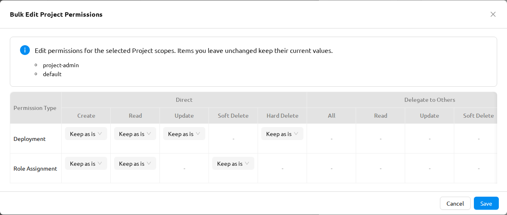

### No-op and partial-failure behavior

When you save permission changes:

- If nothing changed, the modal closes without sending a request and shows the message **No changes made.**
- On success, the message **Permissions saved successfully.** is shown and the card's tags are recomputed.
- On a **partial failure**, the modal stays open with the failed cells flagged. A bulk-error modal lists each failed request — the target scope, the permission, and the error message — along with success and failure counts. You can adjust the grid and save again to retry only the cells that failed.

<!--  -->
<!-- TODO: Capture the bulk-error modal shown after a partial-failure permission save -->

## Manage user assignments

The **Role Assignments** tab in the role detail drawer shows which users are assigned to the role.

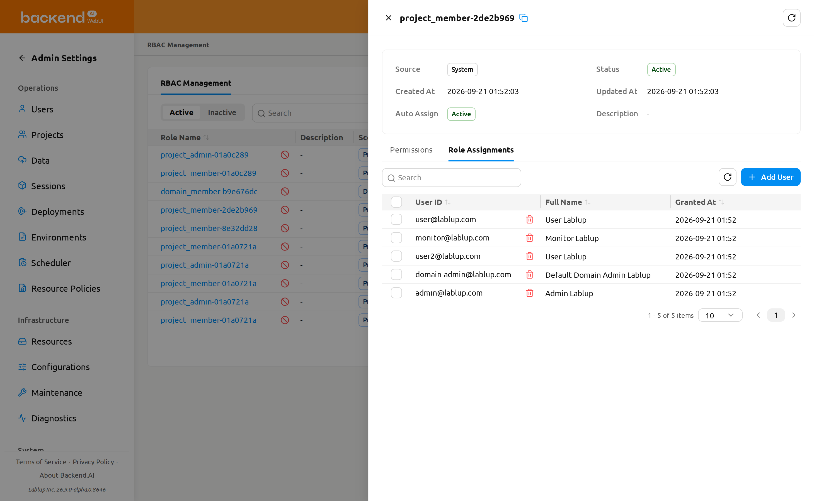

### Add users to a role

1. Open the role detail drawer and select the **Role Assignments** tab
2. Click the **Add User** button
3. In the modal, search for users by email or name
4. Select one or more users using the checkboxes
5. Click **Add** to assign the selected users to the role

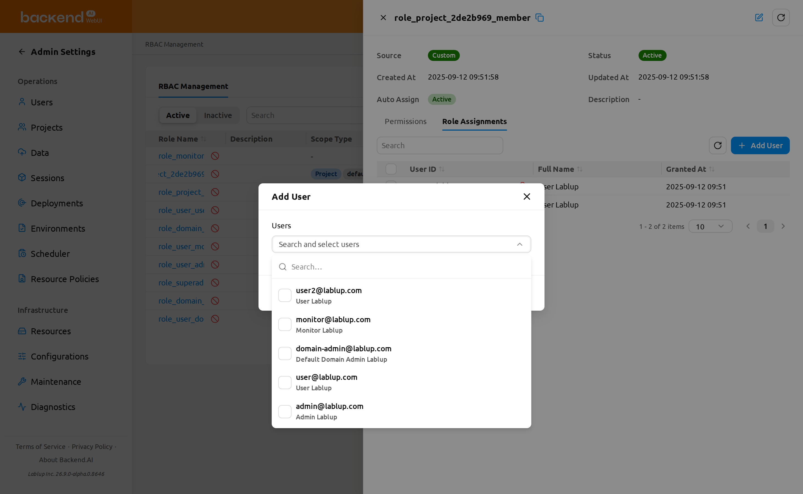

Adding users is a bulk operation — you can select several users in a single pass and assign them all at once. If some assignments fail, the modal stays open and a bulk-error modal lists each failed user with an error message and success and failure counts. The users that were assigned successfully are cleared from the selection, so only the failed users remain selected and you can click **Add** again to retry just those.

<!--  -->
<!-- TODO: Capture the Add User modal with the bulk-error modal listing failed assignments -->

### System roles and assignment restrictions

The system-generated project-admin role (the `role_project_<project_id>_admin` role, whose **Source** is **System**) cannot have users assigned or revoked directly from the Role Assignments tab. The tab shows a warning alert, **Roles automatically created by the system cannot have users directly assigned or unassigned.**, and the assignment table is read-only (the **Add User** and revoke controls are hidden).

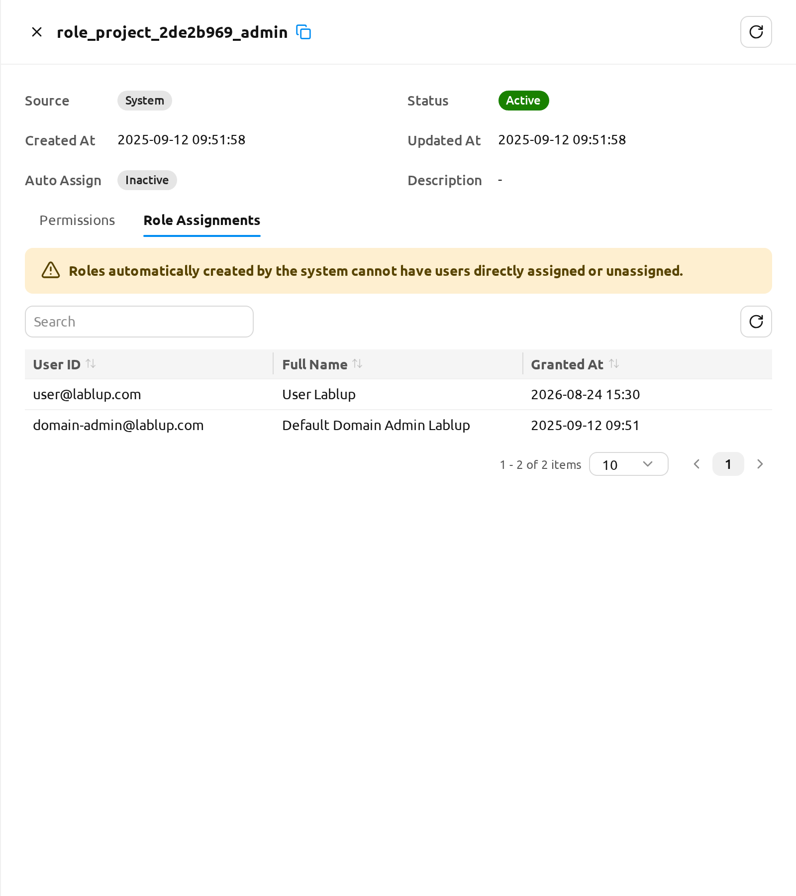

To manage who administers a project, use **Set Project Admin** on the Project page instead. See [Set Project Admin](#set-project-admin) in the Project Admin Features chapter and [Grant Project Admin authority](#grant-project-admin) below.

### Revoke users from a role

You can revoke a single user or several users at once.

To revoke a single user:

1. In the **Role Assignments** tab, hover over the user row and click the revoke (trash) icon next to the user.
2. A **Revoke User** confirmation modal opens. Review the listed user(s) and click **Revoke User** to confirm, or **Cancel** to dismiss.

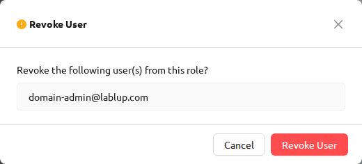

To revoke multiple users at once:

1. In the **Role Assignments** tab, use the checkboxes to select the users you want to remove. A selection-count label appears next to the revoke control showing how many rows are selected; use the clear-selection control on that label to deselect all rows.
2. Click the bulk **Revoke User** button (trash icon) that appears once one or more rows are selected.
3. In the **Revoke User** confirmation modal, review the listed users and click **Revoke User** to confirm, or **Cancel** to dismiss.

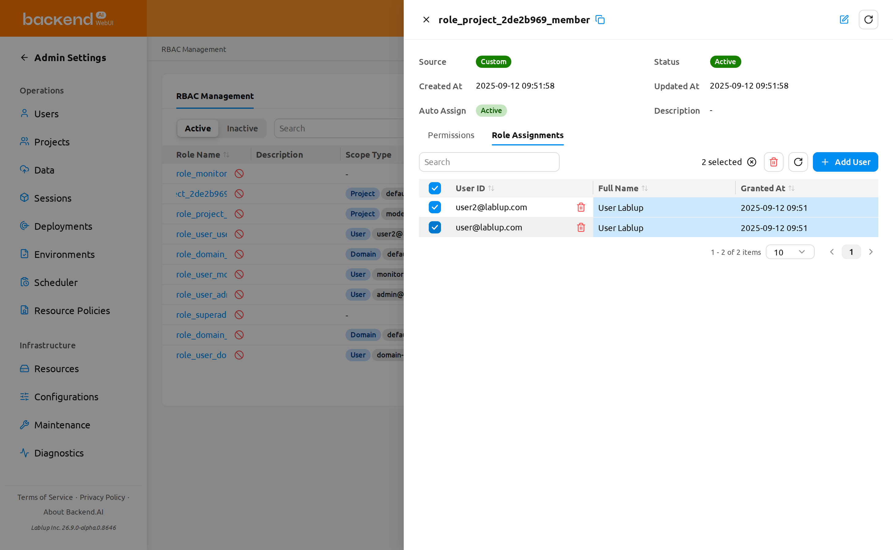

Revoking a user removes only that user's assignment to this role; the role itself and its other assignments remain unchanged.

:::note
Revoking a role assignment can be reversed by re-adding the user to the role from the **Role Assignments** tab.
:::

## Grant Project Admin authority

Creating a project also creates a dedicated role named `role_project_<project_id>_admin`, where `<project_id>` is the first 8 characters of that project's UUID. A user assigned to this role gains [Project Admin](#project-admin-features) authority over that specific project — they can manage the project's users, sessions, deployments, and storage folders without holding system-wide superadmin privileges.

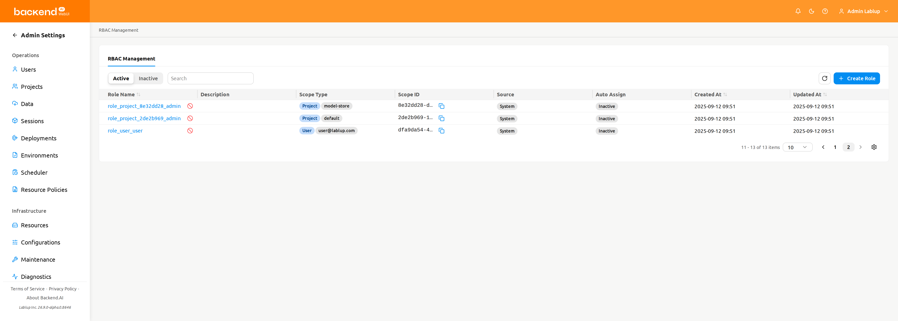

Grant and revoke project admin through the **Set Project Admin** one-click flow on the **Project** admin page, described in [Set Project Admin](#set-project-admin) in the Project Admin Features chapter. The `role_project_<project_id>_admin` role is a system role, so its Role Assignments tab here is **read-only** and provided for inspection — you can still open the role to review who currently holds project admin. The **Set Project Admin** modal also links back to this role's detail drawer through its RBAC shortcut.

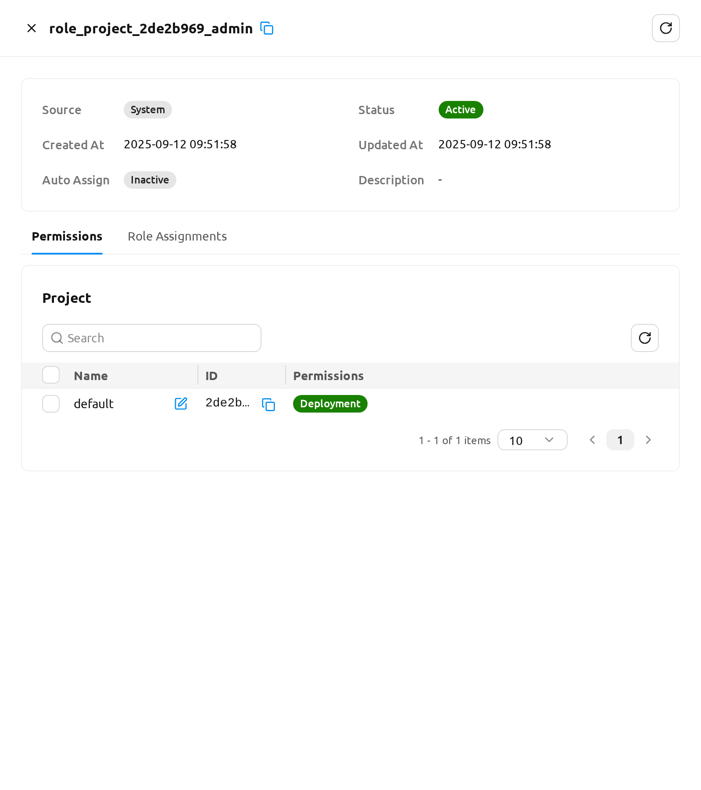

Once granted, the user gains Project Admin authority immediately. The next time they open the header's project dropdown they will see the project-admin badge next to the corresponding project, and the project-admin sidebar entries described in the [Project Admin Features](#project-admin-features) chapter.
