

# RBAC Management

RBAC (Role-Based Access Control) Management allows superadmins to define roles with fine-grained permissions and assign them to users. With RBAC, you can control which actions specific users are allowed to perform on various resources throughout the Backend.AI system.

To access the RBAC Management page, click **RBAC Management** in the **Admin Settings** section of the sidebar menu.

The page has two tabs: **Roles** and **Presets**.

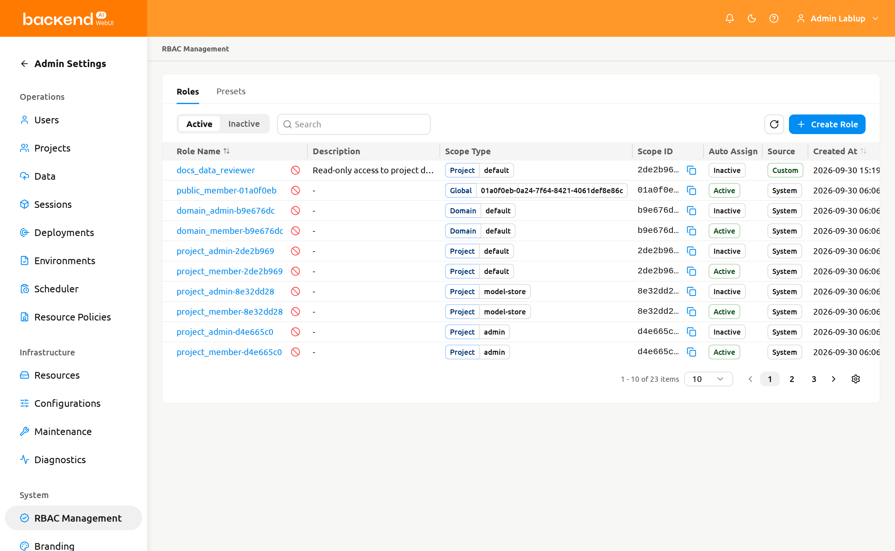

## Role list

The Role List page displays all roles in a table format. You can filter, search, and sort roles using the controls at the top of the page.

- **Status filter**: A segmented control to toggle between **Active** and **Inactive** roles. Active is selected by default.
- **Property filter**: A property filter to narrow the list. The filter input adapts to the selected property. The following properties are available:
   * **Name**: Free-text search by role name.
   * **Source**: A typed selector that exposes the available values (**System** / **Custom**) rather than a free-form text box.
   * **Assigned User**: A user picker that filters the list to the roles assigned to the chosen user. The user's email is shown on the resulting condition tag.
   * **Scope Type**: A typed selector of RBAC scope types (for example, Domain, Project, or User).
   * **Scope ID**: Filters the list by an exact scope UUID.
- **Create Role**: A button to create a new custom role.

The table displays the following columns:

- **Role Name**: The name of the role. Click the name to open the role detail drawer.
- **Description**: A brief description of the role's purpose.
- **Scope Type**: The scope type of the role's scope, shown together with the scope name.
- **Scope ID**: The raw scope ID of the role's scope.
- **Source**: Indicates whether the role is **System** (pre-defined) or **Custom** (user-created).
- **Auto Assign**: Indicates whether the role is automatically assigned to a user when they are added to a scope the role is registered in. Displays **Active** when auto-assignment is enabled, or **Inactive** when disabled.
- **Created At**: The date and time when the role was created.
- **Updated At**: The date and time when the role was last modified.

### System vs custom roles

Roles are categorized into two source types:

- **System**: Automatically generated roles. You cannot edit their name, description, or permissions, but you can manage their user assignments.
- **Custom**: Roles created by superadmins. Their name, description, user assignments, and permissions are all editable.

## Create a role

Creating a role requires you to define its **scope** upfront. The scope binds the role to a specific resource entity (such as a domain, project, or user) so that every permission you later add to the role is confined to the scope defined here.

To create a new custom role:

1. Click the **Create Role** button at the top right of the Role List page
2. In the creation modal, fill in the following fields:
   - **Role Name** (required): Enter a unique name for the role
   - **Description** (optional): Enter a description of the role's purpose
   - **Auto Assign** (optional): When enabled, the role is automatically granted to users when they are added to a scope the role is registered in. Disabled by default.
   - **Scope Type** (required): Select the scope type the role applies to (for example, Domain, Project, or User)
   - **Target** (required): Choose the specific entity within that scope type. A role is bound to exactly one scope.
3. Click **OK** to create the role

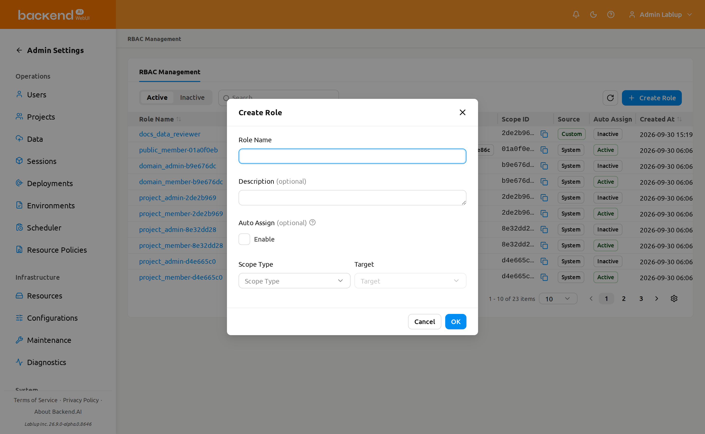

:::info
The **Scope Type** and **Target** you define when creating a role do not grant any permissions on their own. Instead, they pre-define the **Scope Type / Target** that becomes available when you later add [permissions](#manage-permissions) to this role. In other words, role creation only narrows down the scope type and target this role's permissions can use — each permission can then be configured only within the scope type and target defined here.
:::

:::warning
The scope is defined at role creation time and cannot be edited afterwards through the role detail drawer. Plan the scope carefully before creating the role.
:::

## View role details

To view detailed information about a role, click the role name in the table. A detail drawer opens on the right side of the page.

The drawer header displays the role name and provides an **Edit** button for custom roles. The detail section shows the following metadata:

- **Source**: System or Custom
- **Status**: Active or Inactive
- **Scope Type / Target**: The scope the role belongs to. A role belongs to exactly one scope.
- **Auto Assign**: Whether auto-assignment is Active or Inactive. When Active, the role is automatically granted to users added to one of its registered scopes.
- **Created At**: The creation timestamp
- **Updated At**: The last modification timestamp

Below the metadata, two tabs are available: **Permissions** and **Role Assignments**. The **Permissions** tab is selected by default.

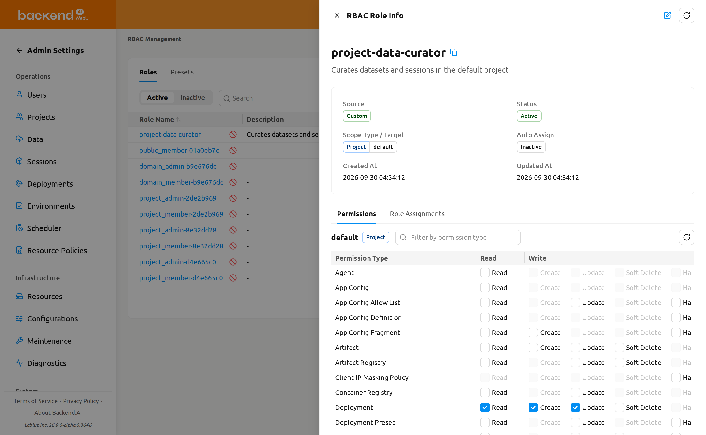

### Edit a role

To edit a custom role's name, description, or auto-assignment setting:

1. Open the role detail drawer by clicking a role name in the table
2. Click the **Edit** button (pencil icon) in the drawer header
3. Modify the following fields in the edit modal:
   - **Role Name**: The name of the role
   - **Description**: A description of the role's purpose
   - **Auto Assign**: When enabled, the role is automatically granted to users added to a scope the role is registered in.
4. Click **OK** to save the changes

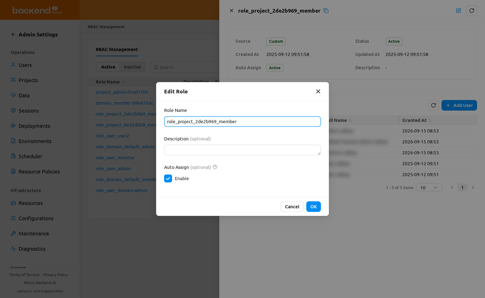

:::note
The Edit button is only available for Custom roles. System roles cannot have their name or description modified. The scope cannot be modified after role creation in either case.
:::

## Manage permissions

The **Permissions** tab in the role detail drawer lists one row per permission type available in the role's scope. The checkboxes in each row are grouped under **Read** and **Write**; **Write** covers Create, Update, Soft Delete, and Hard Delete.

To change the role's permissions, tick or untick the checkboxes and click **Save**.

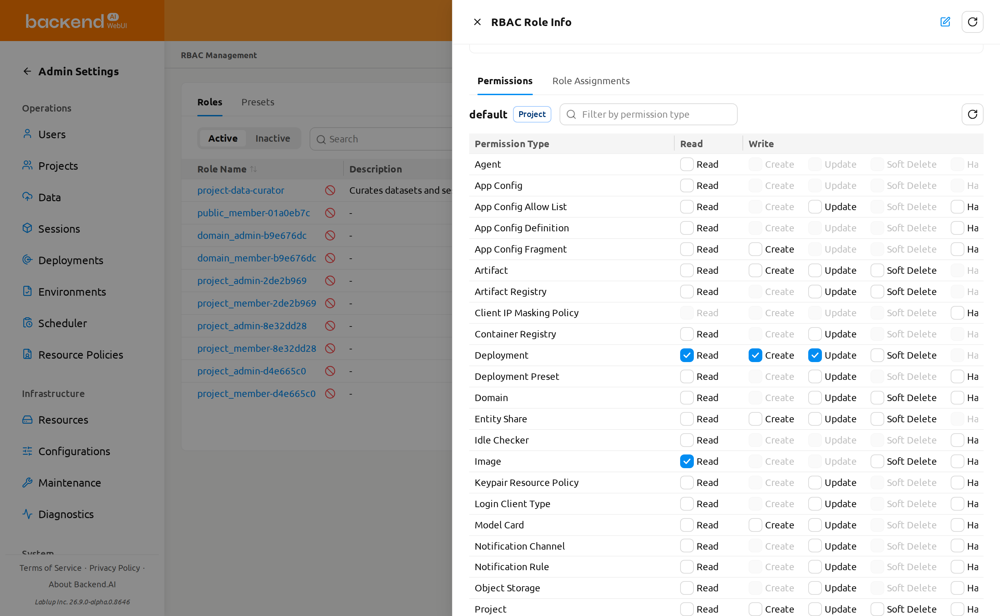

The permissions of a system role are read-only here. They follow the [role preset](#role-presets) the role was created from; click **View Presets** to open the presets.

:::info
The combined **Scope Type / Target** of each permission is inherited from the role's scope. You can only grant permissions on the scope that was defined when the role was created. To broaden a role's reach, create another role with the scope you need.
:::

### Permission examples

Here are some common permission configurations. The **Scope Type / Target** column shows the role-level scope that the permission reuses.

| Scenario | Scope Type / Target | Permission Type | Permission |
|----------|---------------------|----------------|------------|
| Allow a user to create storage folders in a specific project | Project / my-project | Folder | Create |
| Allow a user to view all sessions in a specific domain | Domain / default | Session | Read |
| Allow a user to manage deployments in a specific domain | Domain / default | Deployment | Create, Read, Update |
| Allow a user to delete container images in a specific domain | Domain / default | Image | Soft Delete |

## Role presets

The **Presets** tab lists the role presets that system roles are created from.

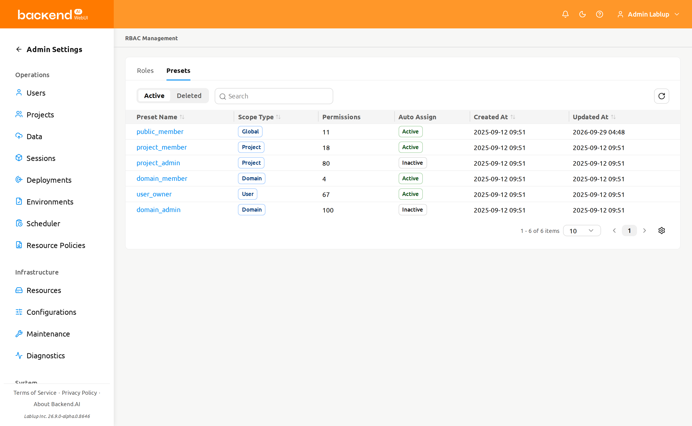

To edit a preset's permissions, click the preset name to open its detail drawer, tick or untick the checkboxes in the **Read** / **Write** grid, and click **Save**.

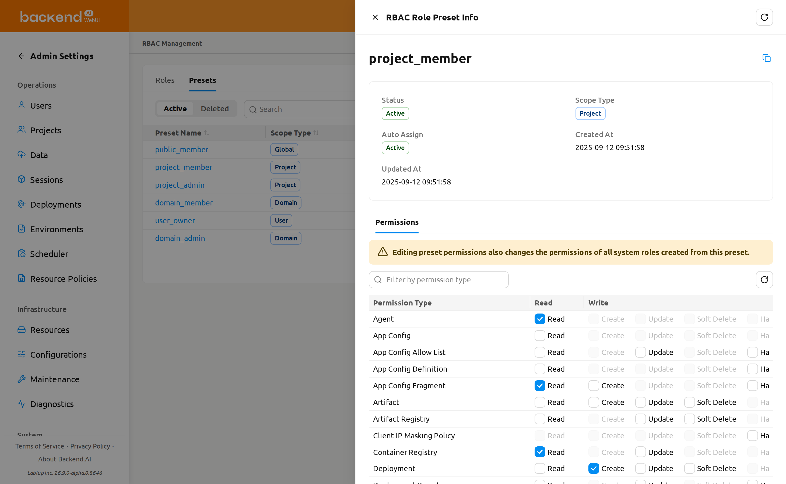

:::warning
Editing preset permissions also changes the permissions of all system roles created from this preset.
:::

## Manage user assignments

The **Role Assignments** tab in the role detail drawer shows which users are assigned to the role.

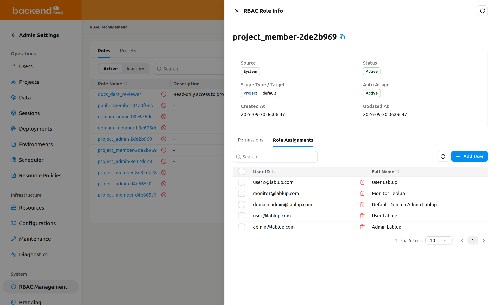

### Add users to a role

1. Open the role detail drawer and select the **Role Assignments** tab
2. Click the **Add User** button
3. In the modal, search for users by email or name
4. Select one or more users using the checkboxes
5. Click **Add** to assign the selected users to the role

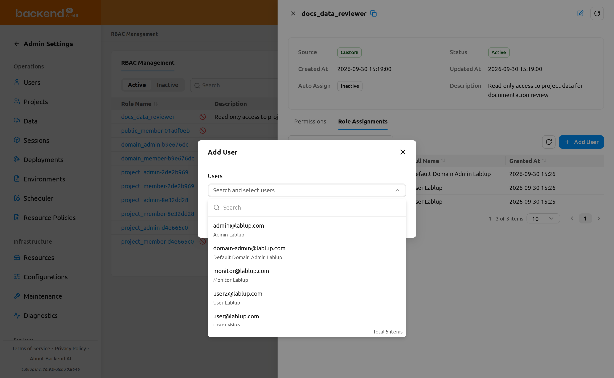

Adding users is a bulk operation — you can select several users in a single pass and assign them all at once. If some assignments fail, the modal stays open and a bulk-error modal lists each failed user with an error message and success and failure counts. The users that were assigned successfully are cleared from the selection, so only the failed users remain selected and you can click **Add** again to retry just those.

<!--  -->
<!-- TODO: Capture the Add User modal with the bulk-error modal listing failed assignments -->

### System roles and assignment restrictions

The system-generated project-admin role (whose **Source** is **System**) cannot have users assigned or revoked directly from the Role Assignments tab. The tab shows a warning alert, **Roles automatically created by the system cannot have users directly assigned or unassigned.**, and the assignment table is read-only (the **Add User** and revoke controls are hidden).

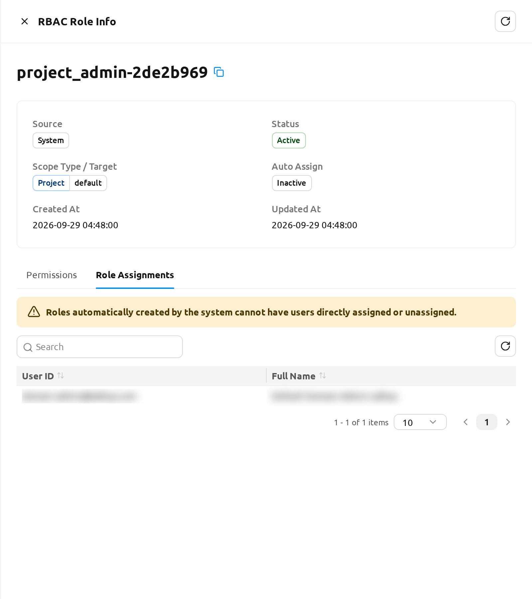

To manage who administers a project, use **Set Project Admin** on the Project page instead. See [Set Project Admin](#set-project-admin) in the Project Admin Features chapter and [Grant Project Admin authority](#grant-project-admin) below.

### Revoke users from a role

You can revoke a single user or several users at once.

To revoke a single user:

1. In the **Role Assignments** tab, hover over the user row and click the revoke (trash) icon next to the user.
2. A **Revoke User** confirmation modal opens. Review the listed user(s) and click **Revoke User** to confirm, or **Cancel** to dismiss.

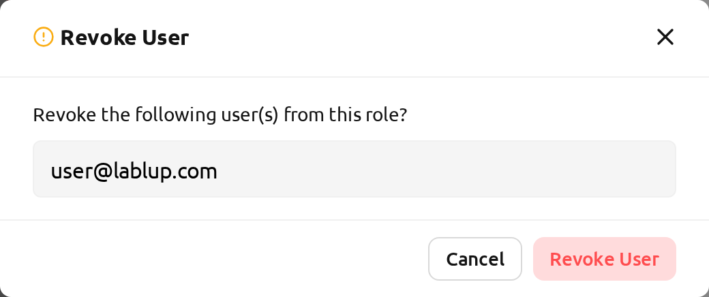

To revoke multiple users at once:

1. In the **Role Assignments** tab, use the checkboxes to select the users you want to remove. A selection-count label appears next to the revoke control showing how many rows are selected; use the clear-selection control on that label to deselect all rows.
2. Click the bulk **Revoke User** button (trash icon) that appears once one or more rows are selected.
3. In the **Revoke User** confirmation modal, review the listed users and click **Revoke User** to confirm, or **Cancel** to dismiss.

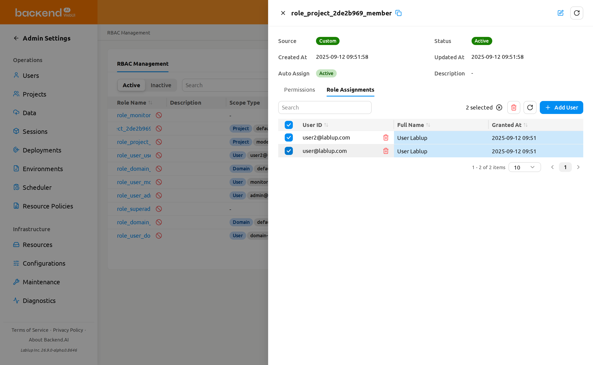

Revoking a user removes only that user's assignment to this role; the role itself and its other assignments remain unchanged.

:::note
Revoking a role assignment can be reversed by re-adding the user to the role from the **Role Assignments** tab.
:::

## Grant Project Admin authority

Creating a project also creates a dedicated project-admin role bound to that project. A user assigned to this role gains [Project Admin](#project-admin-features) authority over that specific project — they can manage the project's users, sessions, deployments, and storage folders without holding system-wide superadmin privileges.

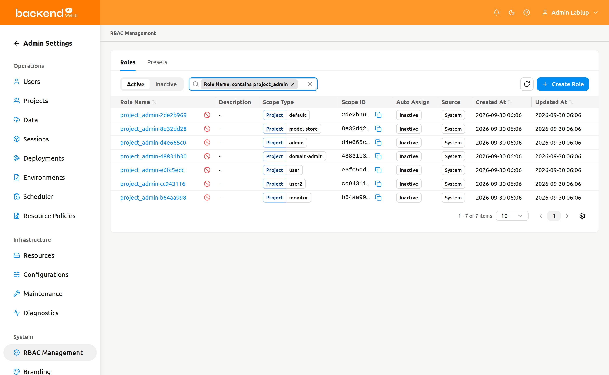

Grant and revoke project admin through the **Set Project Admin** one-click flow on the **Project** admin page, described in [Set Project Admin](#set-project-admin) in the Project Admin Features chapter. The project-admin role is a system role, so its Role Assignments tab here is **read-only** and provided for inspection — you can still open the role to review who currently holds project admin. The **Set Project Admin** modal also links back to this role's detail drawer through its RBAC shortcut.

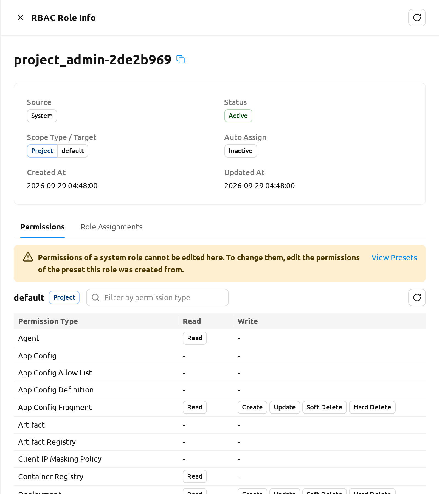

Once granted, the user gains Project Admin authority immediately. The next time they open the header's project dropdown they will see the project-admin badge next to the corresponding project, and the project-admin sidebar entries described in the [Project Admin Features](#project-admin-features) chapter.
