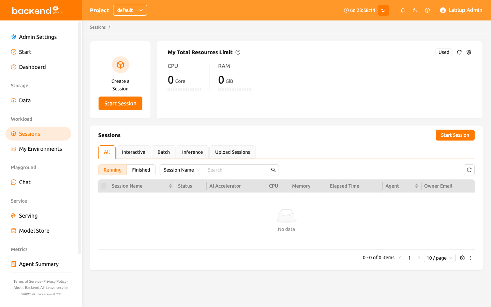
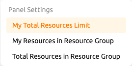
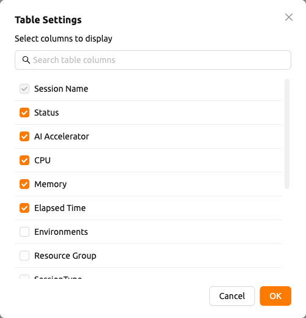

# Session Page

In Backend.AI, a `session` represents an isolated compute environment where users can run code, train models, or perform data analysis using allocated resources.
Each session is created based on user-defined configurations such as runtime image, resource size, and environment settings.
Once started, the session provides access to interactive applications, terminals, and logs, allowing users to manage and monitor their workloads efficiently.

## Resource Summary Panels

At the top of the 'Sessions' page, you can find panels displaying your available computing resources such as CPU, RAM, and AI Accelerators.
Different panel views — 'My Total Resources Limit', 'My Resources in Resource Group', and 'Total Resources in Resource Group' — can be selected depending on
the information needed. Use the 'Settings' button to change which panel is displayed.

For more detailed information about resource panels and their metrics, please refer to the [dashboard](#dashboard) page.

## Session List

The personal Sessions page displays only your own active and completed compute sessions.
You can filter sessions by type — `All`, `Interactive`, `Batch`, `Inference`, or `Upload Sessions` — and switch between
`Running` and `Finished` tabs to manage sessions.

:::note
The personal Sessions page (`/session`) always shows only your own sessions, regardless of your role.
To view and manage sessions across all users in a project, use the **Admin Sessions** page under the
**Administration** sidebar section.
:::

By default, you can view the following columns: session name, status, allocated resources (AI Accelerators, CPU, Memory),
and elapsed time.
Additional columns can be shown or specific ones hidden by clicking the 'Settings' button at the bottom right of the table to customize the view.
Within the column settings dialog, you can also drag columns to change the order in which they appear in the table.

:::tip
You can view the detailed scheduling history for each session from the
session detail panel. This helps you understand scheduling decisions, delays, and failures. For more details,
refer to [Session Scheduling History](../sessions_all/sessions_all.md#session-scheduling-history).
:::

:::note
The **Launch** button on the session launcher creates one session by default.
To launch several sessions with the same configuration in one go, click the
more (`...`) icon next to the **Launch** button to open its dropdown menu and
select **Launch Multiple Sessions**. See [Confirm and Launch](../sessions_all/sessions_all.md#confirm-and-launch)
for details.
:::

:::note
You can export the session list as a CSV file using the download button in the session list toolbar.
The CSV export from the personal Sessions page includes only your own sessions.
:::