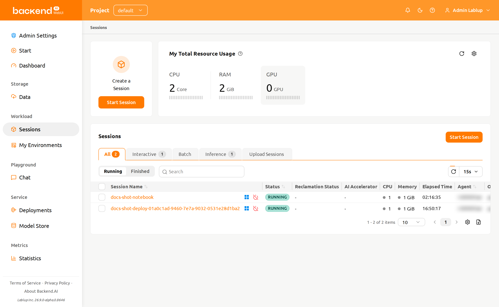
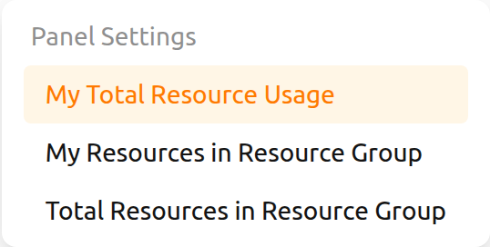
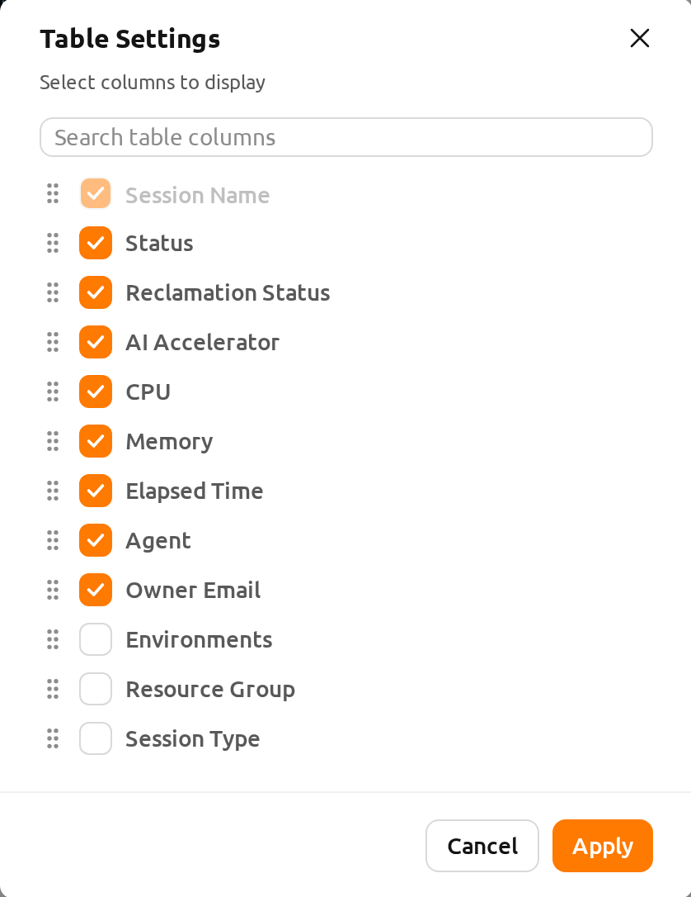
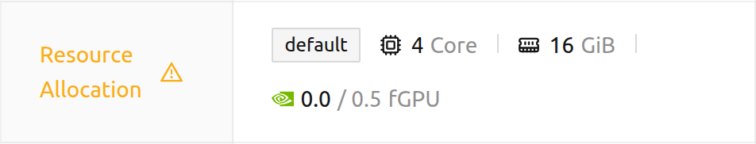

# Session Page

In Backend.AI, a `session` represents an isolated compute environment where users can run code, train models, or perform data analysis using allocated resources.
Each session is created based on user-defined configurations such as runtime image, resource size, and environment settings.
Once started, the session provides access to interactive applications, terminals, and logs, allowing users to manage and monitor their workloads efficiently.

## Resource summary panels

At the top of the 'Sessions' page, you can find panels displaying your computing resources such as CPU, RAM, and AI Accelerators.
Different panel views — **My Total Resource Usage**, **My Resources in Resource Group**, and **Total Resources in Resource Group** — can be selected depending on
the information needed. Click the settings (gear) icon in the panel header and pick a view under **Panel Settings**.

The **My Total Resource Usage** panel shows the resources you are currently using across all projects.
To check the limit that applies to a resource, hover over the status bar below its number. When several limits apply
(domain, project, or keypair), the most restrictive one takes effect.

For more detailed information about resource panels and their metrics, please refer to the [dashboard](#dashboard) page.

## Session list

The personal Sessions page displays only your own active and completed compute sessions.
You can filter sessions by type — `All`, `Interactive`, `Batch`, `Inference`, or `Upload Sessions` — and switch between
`Running` and `Finished` tabs to manage sessions.

:::note
The personal Sessions page is scoped to the project you are currently working in — its address is
`/project/<project name>/session` — and it always shows only your own sessions, regardless of your role.
To view and manage sessions across all users in a project, use the **Sessions** page under
**Admin Settings** in the sidebar.
:::

By default, you can view the following columns: session name, status, allocated resources (AI Accelerators, CPU, Memory),
and elapsed time.
Additional columns can be shown or specific ones hidden by clicking the `Settings` button at the bottom right of the table to customize the view.
Within the column settings dialog, you can also drag columns to change the order in which they appear in the table.

:::tip
You can view the detailed scheduling history for each session from the
session detail panel. This helps you understand scheduling decisions, delays, and failures. For more details,
refer to [Session Scheduling History](#session-scheduling-history).
:::

:::note
The **Launch** button on the session launcher creates one session by default.
To launch several sessions with the same configuration in one go, click the
more (`...`) icon next to the **Launch** button to open its dropdown menu and
select **Launch Multiple Sessions**. See [Confirm and Launch](#confirm-and-launch)
for details.
:::

:::note
You can export the session list as a CSV file using the download button in the session list toolbar.
The CSV export from the personal Sessions page includes only your own sessions.
:::

## Allocated and requested resources

Click a session name to open the session detail panel. Its **Resource Allocation** row shows the resources the
session actually holds, so you can tell what the session is running with — not only what you asked for.

<!--  -->
<!-- TODO: Capture screenshot of the session detail panel Resource Allocation row for a session whose allocation is smaller than its request, showing the warning icon on the label and an `allocated / requested` chip. -->

- When the allocation matches the request, each resource shows a single value.
- When the two differ, the allocated amount is followed by the requested amount in a muted color, with both
  sharing one unit — for example `1 / 2 Core`. Hovering the numbers shows an **Allocated / Requested** tooltip.
- When a resource was allocated less than requested, a warning icon appears next to the **Resource Allocation**
  label. Hovering it shows the message *Fewer resources were allocated than requested.*
- Before the session is allocated — for example while it is still `PENDING` — the requested resources are shown
  and no comparison appears.

A shortfall occurs when the requested amount cannot be allocated exactly, such as a fractional GPU (fGPU)
request that is rounded down to the nearest allocatable unit. The session runs with the allocated amount.

For the other fields in the panel, see [Session detail panel](#session-detail-panel).
