# Sharing Storage Folders and Access Control

You may need to share the contents of storage folders with other users or project
members to collaborate. For this purpose, Backend.AI provides a flexible folder
sharing feature.

## Share Storage Folders With Other Users

Let's learn how to share your personal storage folder with other users. First,
log in to User A's account and go to the Data page. There are several
folders, and we want to share a folder named `tests` to User B.

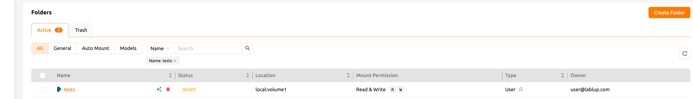

Inside the `tests` folder you can see files and directories like `hello.txt`
and `myfolder`.

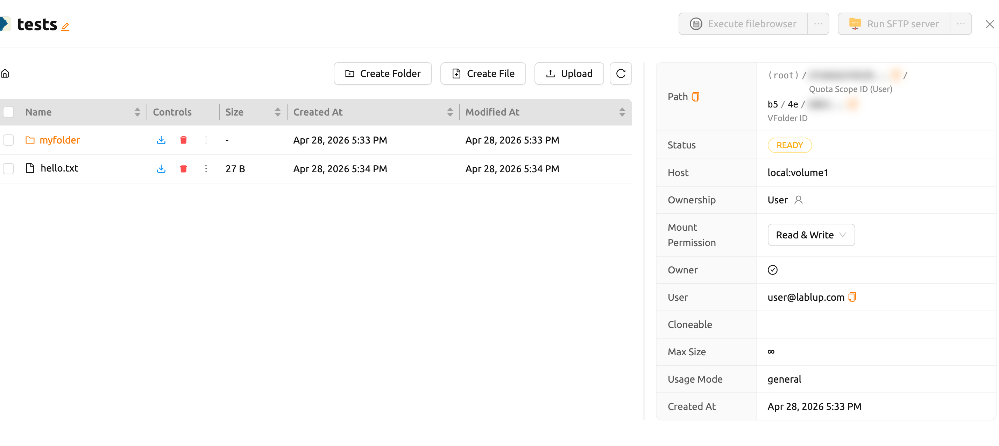

Confirm that the `tests` folder is not listed when logging in with User B's
account.

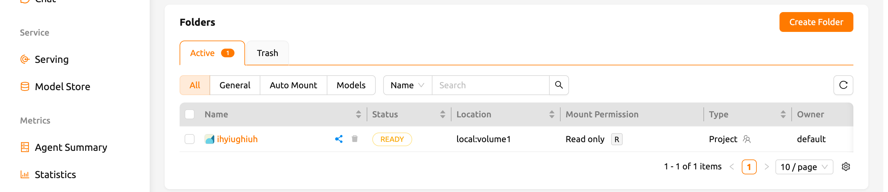

:::note
If a folder named `tests` already exists in User B's account, User A's
`tests` folder cannot be shared with User B.
:::

Back to User A's account, click the share button in the Control column on the
`tests` folder in the list.

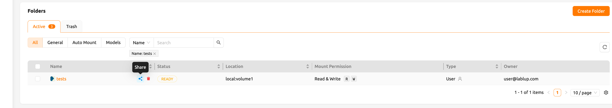

A Share Folder modal opens. In the **Invite User** section, enter User B's
email address and select the desired permission level from the **Permission**
dropdown. If you choose `Read only`, User B will be able to only view the
folder but not modify it. If you select `Read & Write`, User B will be able to
both view and modify the folder. Click the `Add` button to send the invitation.

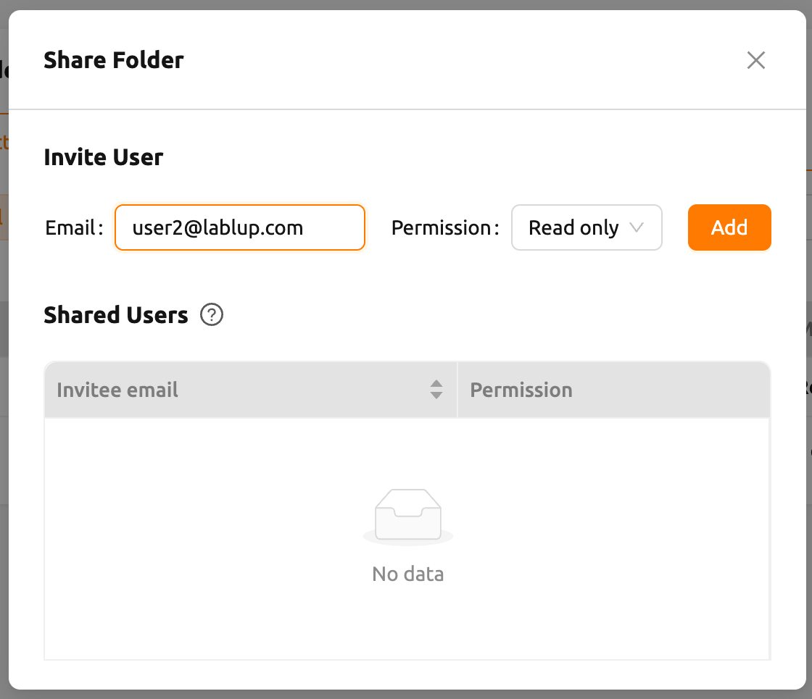

Switch back to User B's account and navigate to the Data page.
The number of invited folders can be checked in the Storage Status panel.

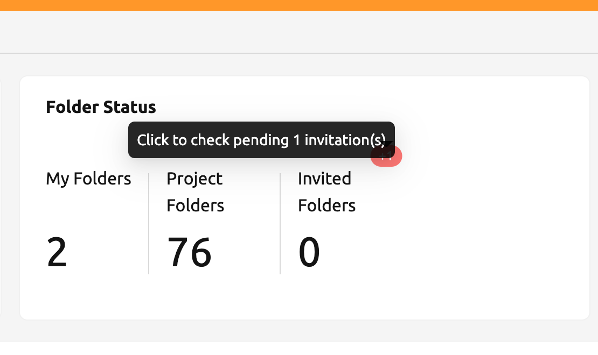

Clicking the badge opens an invitation list modal, where pending folder invitations
can be accepted or declined.

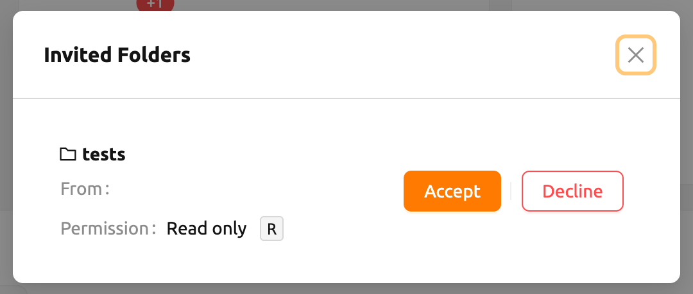

Go to the Data page and check that the `tests` folder is displayed in
the list. If you don't see it on the list, try refreshing your browser page.
Since you have accepted the invitation, you can now view the contents of User
A's `tests` folder in User B account. Unlike folders created by User B,
shared folders appear without the check icon in the Owner column. You
can also see the `Read only` mark displayed in the Mount Permission column.

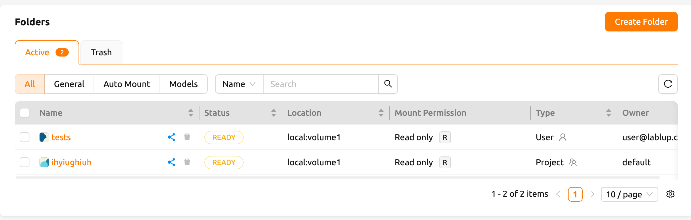

Let's navigate inside the `tests` folder by clicking the folder icon in the
Control panel of `tests`. You can check the `hello.txt` and `myfolder`
that you checked in the User A's account again.

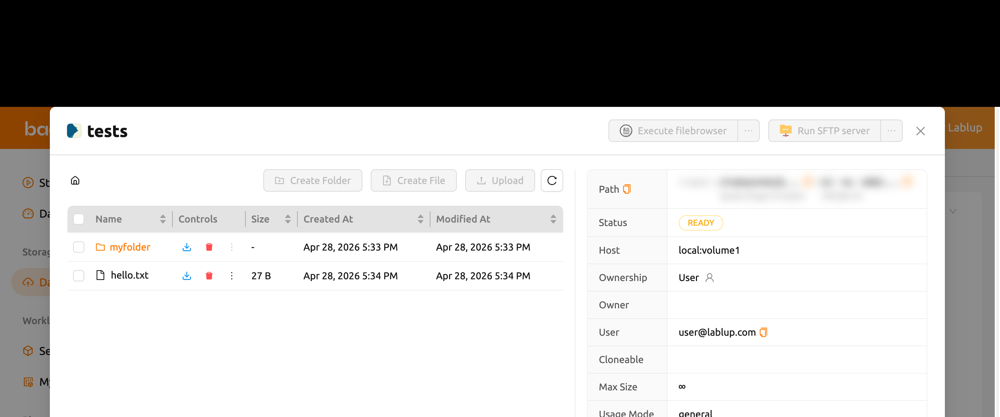

Let's create a compute session
by mounting this storage folder with the User B's account.

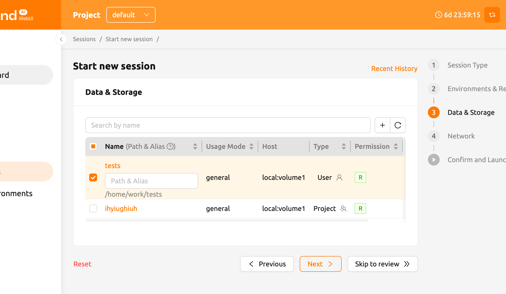

:::note
From version 24.09, Backend.AI offers an improved version of the session launcher (NEO)
as default. If you want to use the previous session launcher, please refer [User Settings](#general-tab)
section. For instructions on how to use it, please refer to the following [link](https://webui.docs.backend.ai/en/23.09_a/sessions_all/sessions_all.html).
If you want to know more about the NEO session launcher, please refer [Create Session](#start-a-new-session)
:::

After creating a session, open the web terminal and check that the `tests`
folder is mounted in the home folder. The contents of the `tests` folder are
displayed, but attempts to create or delete files are not allowed. This is
because User A shared it as read-only. User B can create a file in the `tests`
folder if it has been shared including write access.

This way, you can share your personal storage folders with other users based on
your Backend.AI email account.

:::note
Backend.AI also provides sharing project folder to project members.
To see the detail, go to [sharing a project storage folder with project members](#share-project-storage-folders-with-project-members).
:::

## Adjust Permission for Shared Folders

You can modify the permissions of shared users from the Share Folder modal.
The **Shared Users** section displays a table listing all users who have accepted
the invitation. Each row shows the invitee's email address and a permission
dropdown. Click the permission dropdown in a user's row to change their access
level:

- **Read only**: The invited user has read-only access to the folder.
- **Read & Write**: The invited user has read and write access to the folder.
  The user cannot delete folders or files.

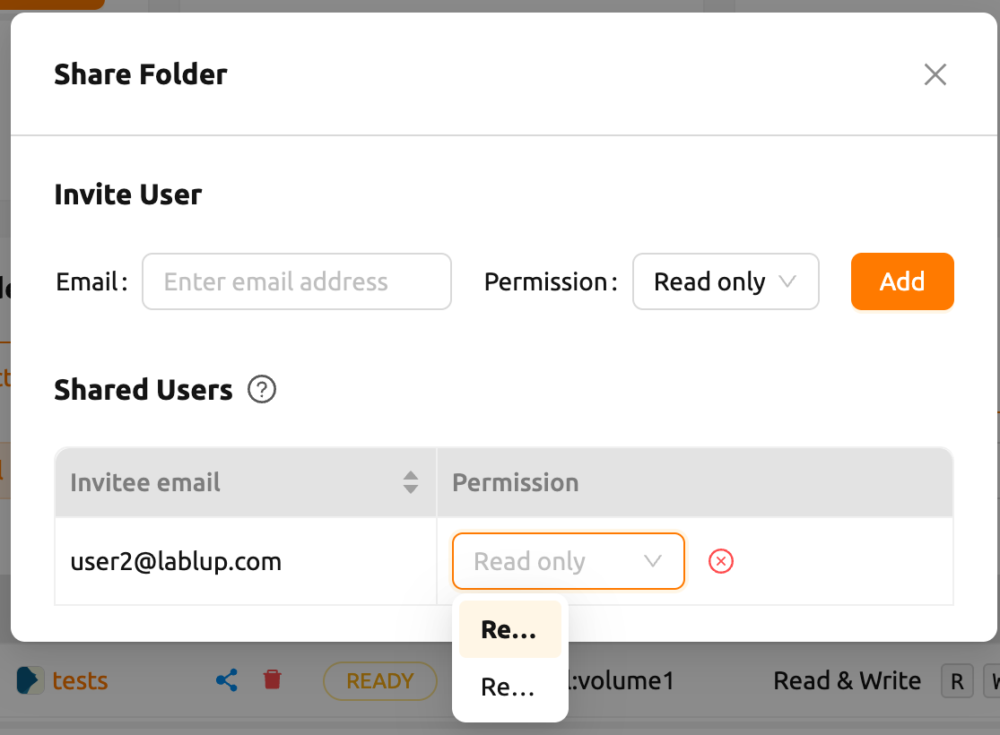

:::note
Renaming the folder itself is available only for the owner, even if the user has been
granted Read & Write permission. Please note that Read & Write permission does not
include renaming the folder.
:::

## Stop Sharing a Folder

To stop sharing a folder as the inviter, open the Share Folder modal by
clicking the share button in the Control column of the folder list. In the
**Shared Users** table, click the stop sharing icon (red close circle) next to
the permission dropdown in the row of the user you want to remove. A
confirmation dialog will appear asking you to confirm. Click `Confirm` to
revoke the user's access.

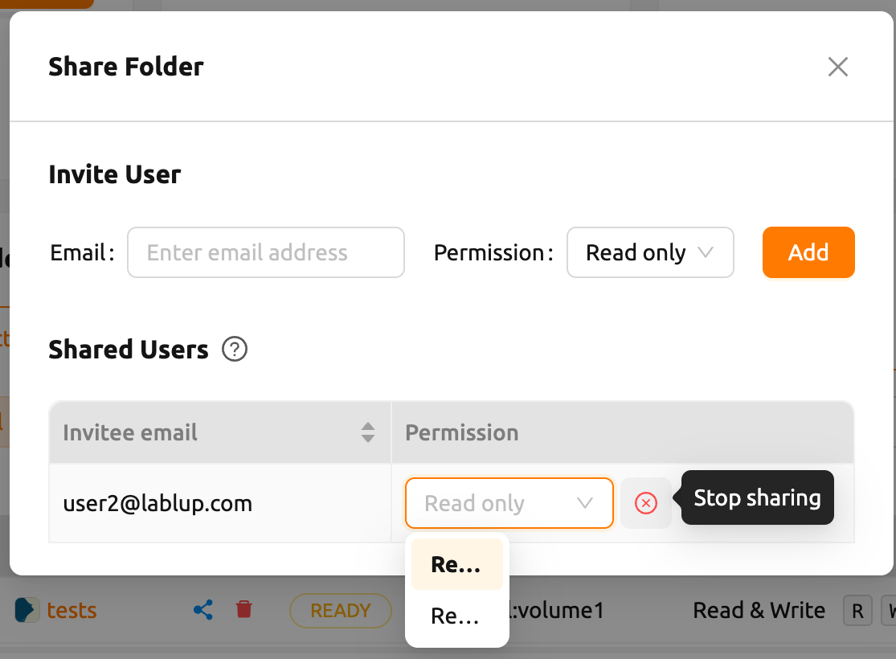

If access to a shared folder is no longer needed as an invitee, click the share
button next to the folder in the folder list to open the Shared Folder
Permission modal. In the permission table, click the leave icon in the
**Control** column to leave the shared folder. A confirmation dialog will appear
before the action is completed.

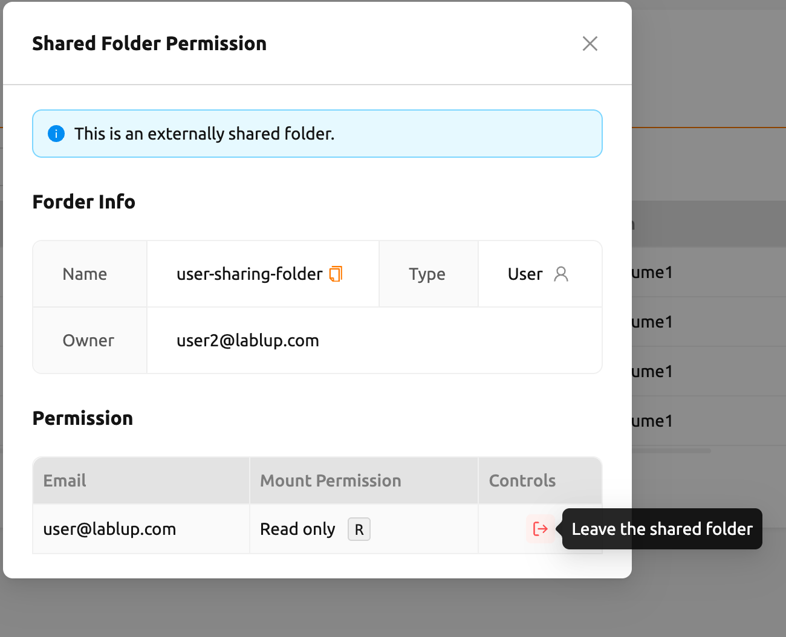
