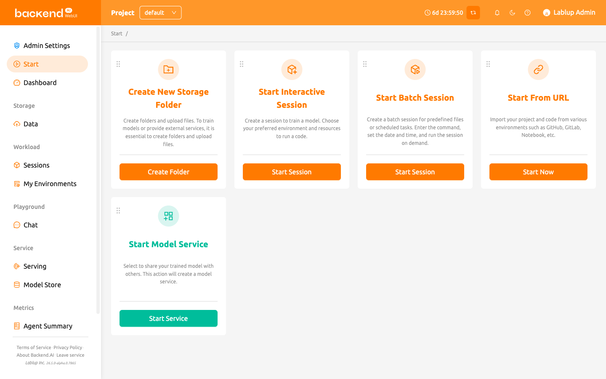
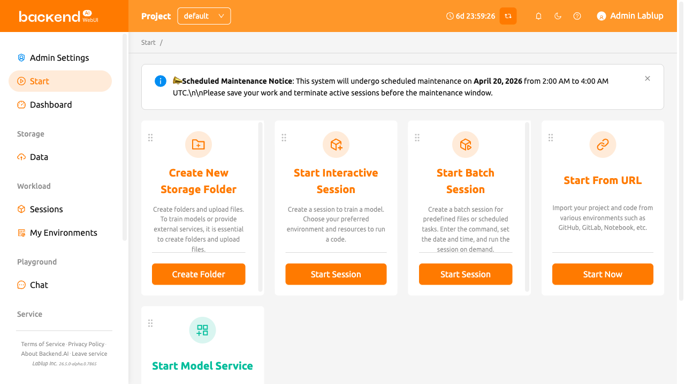
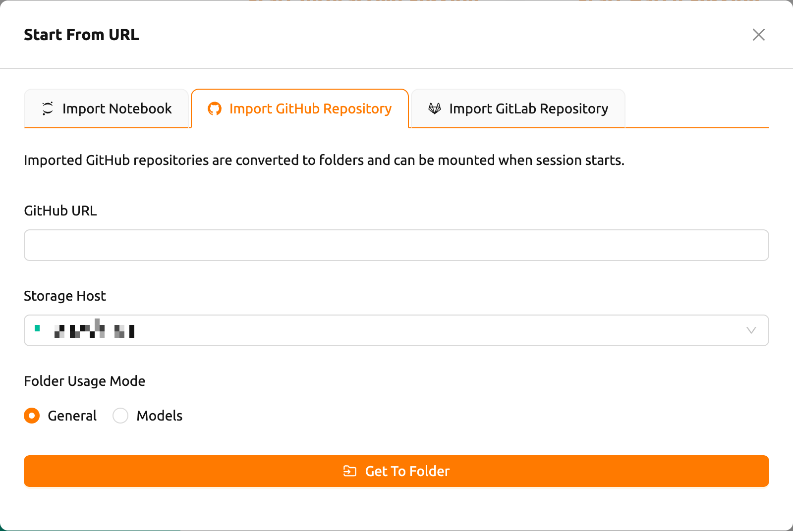

# Start Page

The Start page provides quick access to frequently used WebUI features through
action cards. Each card represents a common workflow such as creating storage
folders, launching sessions, starting model services, or importing projects from
external URLs.

## Announcement Banner

If your system administrator has published an announcement, it appears as a
banner at the top of the Start page. The announcement supports Markdown
formatting and may contain important notices about system maintenance, updates,
or usage guidelines. You can dismiss the banner by clicking the close icon.

<!-- TODO: Capture screenshot of the announcement banner with sample content -->

## Action Cards

The Start page displays the following action cards by default:

- **Create New Storage Folder**: Create a storage folder and upload files. This
  is an essential first step for training models or providing external services.
  Clicking the button opens the folder creation dialog.
- **Start Interactive Session**: Create a session to train a model. Choose your
  preferred environment and resources to run your code.
- **Start Batch Session**: Create a batch session for predefined files or
  scheduled tasks. Enter the command, set the date and time, and run the session
  on demand.
- **Start Model Service**: Select a trained model to share with others by
  creating a model service endpoint.
- **Start From URL**: Import your project and code from various environments
  such as GitHub, GitLab, or Jupyter Notebooks via URL.

:::note
Depending on the server configuration, some cards such as the model service card
may not be available. If you want to use these features, please contact your
system administrator.
:::

## Start From URL

The **Start From URL** card allows you to import and run projects directly from
external sources. Clicking the card opens a dialog with three tabs.

### Import Notebook

<!-- TODO: Capture screenshot of the Start From URL modal showing the Import Notebook tab -->

1. Enter a Jupyter Notebook URL (must end with `.ipynb`) in the **Notebook URL**
   field
2. Click **Import & Run** to automatically create a session and open the
   notebook in Jupyter

   You can also click the dropdown arrow next to the button and select
   **Start with options** to customize the session environment before launching.

At the bottom of the tab, you can generate a "Run on Backend.AI" badge code.
Copy the HTML or Markdown badge code to embed a direct-launch link in your
project documentation.

### Import GitHub Repository

<!-- TODO: Capture screenshot of the Start From URL modal showing the Import GitHub Repository tab -->

1. Enter a valid GitHub repository URL in the **GitHub URL** field
2. Select a **Storage Host** where the repository will be saved
3. Optionally set the **Folder Usage Mode** (General or Models)
4. Click **Get To Folder** to clone the repository into a new storage folder

The imported repository is converted to a storage folder that can be mounted
when starting a session.

### Import GitLab Repository

<!-- TODO: Capture screenshot of the Start From URL modal showing the Import GitLab Repository tab -->

1. Enter a valid GitLab repository URL in the **GitLab URL** field
2. Optionally specify a **GitLab Branch Name** (defaults to `master`)
3. Select a **Storage Host** where the repository will be saved
4. Optionally set the **Folder Usage Mode** (General or Models)
5. Click **Get To Folder** to clone the repository into a new storage folder

## Customizing Card Layout

You can rearrange the action cards on the Start page by dragging and dropping
them. Each card has a drag handle at the top-left corner that you can grab to
move the card to a different position.

Your customized card arrangement is automatically saved and persists across
browser sessions. The layout is stored per user, so each user can have their
own preferred arrangement.
