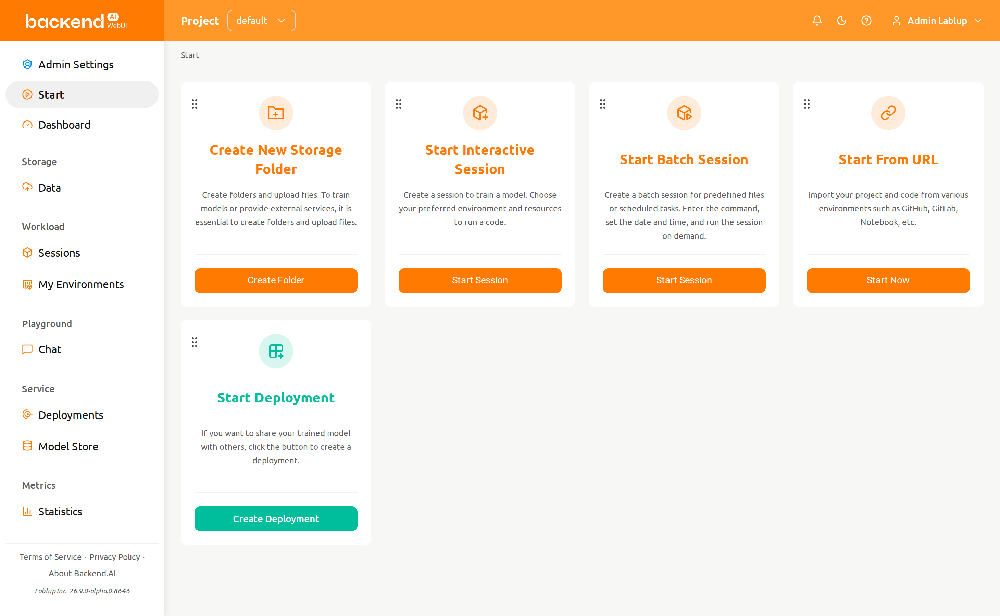
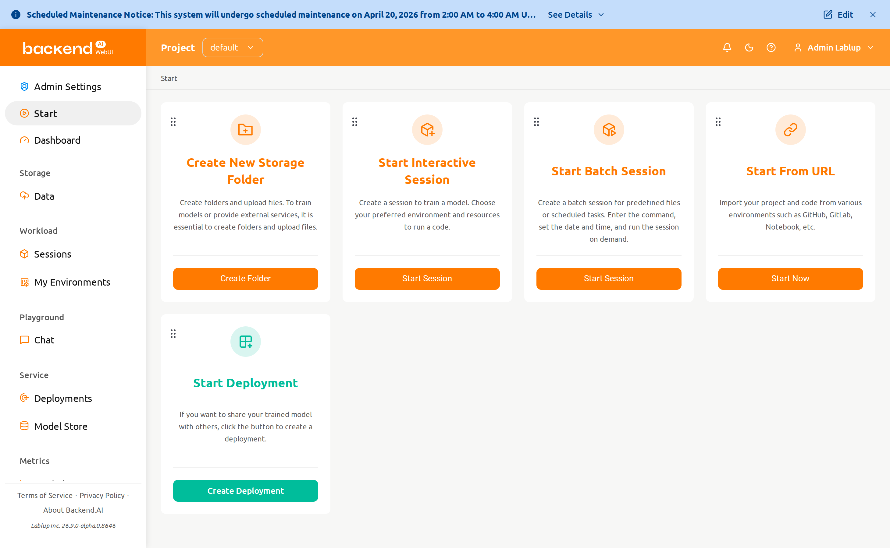
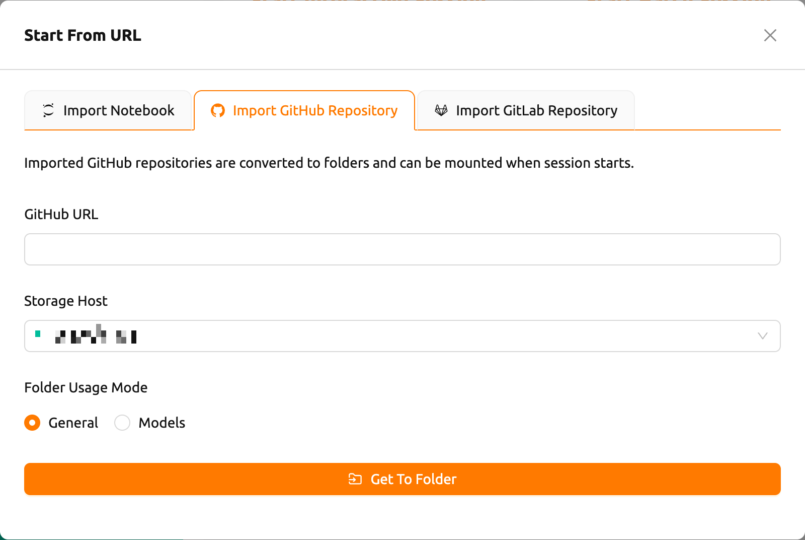
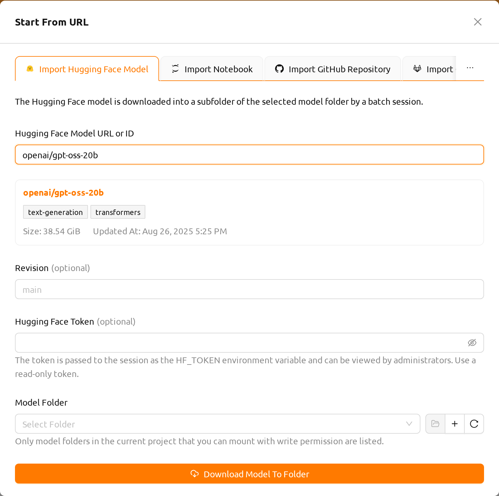

# Start Page

The Start page provides quick access to frequently used WebUI features through
action cards. Each card represents a common workflow such as creating storage
folders, launching sessions, deploying models, or importing projects from
external URLs.

## Announcement banner

If your system administrator has published an announcement, it appears as a
banner at the top of the Start page. The announcement supports Markdown
formatting and may contain important notices about system maintenance, updates,
or usage guidelines. You can dismiss the banner by clicking the close icon.

## Action cards

The Start page displays the following action cards by default:

- **Create New Storage Folder**: Create a storage folder and upload files. This
  is an essential first step for training models or providing external services.
  Clicking the button opens the folder creation dialog.
- **Start Interactive Session**: Create a session to train a model. Choose your
  preferred environment and resources to run your code.
- **Start Batch Session**: Create a batch session for predefined files or
  scheduled tasks. Enter the command, set the date and time, and run the session
  on demand.
- **Start Deployment**: Share a trained model with others by creating a
  deployment.
- **Start From URL**: Import your project and code from various environments
  such as GitHub, GitLab, or Jupyter Notebooks via URL.

:::note
Depending on the server configuration, some cards such as the deployment card
may not be available. If you want to use these features, please contact your
system administrator.
:::

## Start from URL

The **Start From URL** card allows you to import and run projects directly from
external sources. Clicking the card opens a dialog with one tab per import
source: **Import Notebook**, **Import GitHub Repository**, and
**Import GitLab Repository**. An additional **Import Hugging Face Model** tab
appears when the experimental Hugging Face import is turned on.

### Import notebook

1. Enter a Jupyter Notebook URL (must end with `.ipynb`) in the **Notebook URL**
   field
2. Click **Import & Run** to automatically create a session and open the
   notebook in Jupyter

   You can also click the dropdown arrow next to the button and select
   **Start with options** to customize the session environment before launching.

:::note
The notebook is downloaded from inside the compute session (its bootstrap
script runs `curl -O <url>`), so the URL must be reachable from the session.
Local addresses such as `localhost` or `127.0.0.1` resolve to the session
container itself — not your own machine — and will not work. Use a URL that is
reachable from the compute session.
:::

:::note
Turn off your browser's pop-up blocker so the running notebook window can open
automatically. If there are not enough resources to start the session, the
imported notebook will not run.
:::

At the bottom of the tab, you can generate a "Run on Backend.AI" badge code.
Copy the HTML or Markdown badge code to embed a direct-launch link in your
project documentation.

:::note
You must be logged in before generating the badge code. Otherwise, log in first
and try again.
:::

### Import GitHub repository

1. Enter a valid GitHub repository URL in the **GitHub URL** field
2. Select a **Storage Host** where the repository will be saved
3. Optionally set the **Folder Usage Mode** (General or Models)
4. Click **Get To Folder** to clone the repository into a new storage folder

The imported repository is converted to a storage folder that can be mounted
when starting a session.

### Import GitLab repository

1. Enter a valid GitLab repository URL in the **GitLab URL** field
2. Optionally specify a **GitLab Branch Name** (defaults to `master`)
3. Select a **Storage Host** where the repository will be saved
4. Optionally set the **Folder Usage Mode** (General or Models)
5. Click **Get To Folder** to clone the repository into a new storage folder

### Import Hugging Face Model

The **Import Hugging Face Model** tab downloads a model from Hugging Face into
one of your model folders, so you can later mount it in a compute session or
serve it as a deployment.

:::warning[Experimental feature]
This tab is hidden until you turn on **Import from Hugging Face** in the
**Experimental features** section of the [User Settings](#user-settings) page.
Experimental features may change or be removed in future updates.
:::

1. Enter the model in the **Hugging Face Model URL or ID** field. Both a model
   page URL such as `https://huggingface.co/openai/gpt-oss-20b` and a plain
   model ID such as `openai/gpt-oss-20b` are accepted. Addresses that point to
   a dataset, a space, or any other non-model page are rejected.

   Once the field contains a valid model, the dialog looks it up on Hugging
   Face after a short pause — a loading indicator shows while it checks — and
   displays a preview card below the field before you start the import. The
   card shows the model ID as a link to its Hugging Face page, the model's
   task and library tags, its size, and when it was last updated.

2. Optionally enter a **Revision** — the branch, tag, or commit of the model
   repository to download. Leave it empty to download the default revision. If
   the address you entered already contains a revision, that revision is used.
3. Optionally enter a **Hugging Face Token**. A token is required for gated or
   private models.
4. Select the **Model Folder** to download into. As the helper text under the
   field notes, only model folders in the current project that you can mount
   with write permission are listed — the download session writes into the
   folder, so folders you can only mount read-only are excluded. The buttons
   next to the selector let you open the selected folder, create a new model
   folder, and refresh the list. When creating a new folder here, set its
   mount permission to read & write: a folder created with read-only mount
   permission cannot receive the download, and a warning tells you to create
   one with read & write mount permission instead.
5. Click **Download Model To Folder**.

The dialog closes and Backend.AI starts a batch session that performs the
download. Because the download runs inside that session, you can follow its
progress on the Sessions page; the model is ready once the session finishes
successfully. If the session fails, the download did not complete and the
model is not ready to use.

The model is stored in a subfolder named after the model, inside the folder you
selected — `openai/gpt-oss-20b`, for example, is downloaded to `gpt-oss-20b/`.
Several models can therefore share a single model folder.

:::warning
The token is passed to the download session as the `HF_TOKEN` environment
variable and can be viewed by administrators. Use a read-only token.
:::

:::note
The tab downloads into model folders, so it is only available when the
deployment feature is enabled for your account. Large models take a long time
to download and consume the storage quota of the target folder.
:::

## Customizing card layout

You can rearrange the action cards on the Start page by dragging and dropping
them. Each card has a drag handle at the top-left corner that you can grab to
move the card to a different position.

Your customized card arrangement is automatically saved and persists across
browser sessions. The layout is stored per user, so each user can have their
own preferred arrangement.
