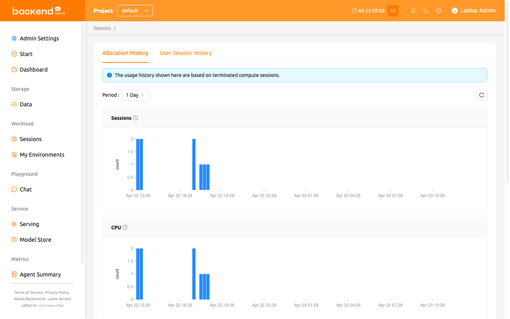
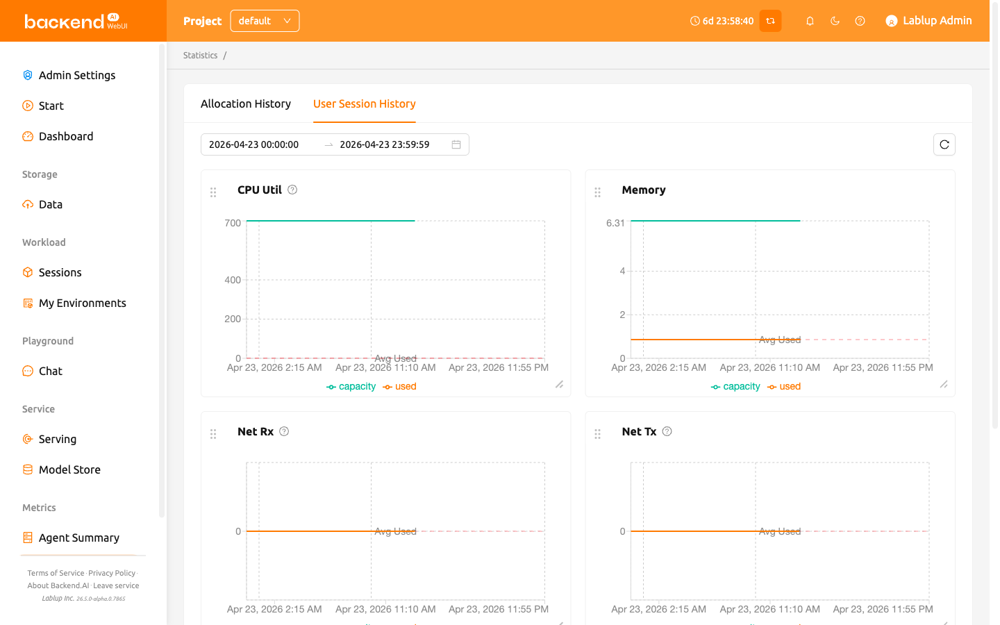

# Statistics Page

## Allocation history

On the Statistics page, under the Allocation History tab, you can check simple statistics related to the use of
compute sessions via a graph. You can check the statistics for a day or a week by selecting the usage period
from the select period menu on the upper left. Displayed items are as follows.

- Sessions: The number of compute sessions created.
- CPU: The number of CPU cores allocated to the compute sessions.
- Memory: The amount of memory allocated to the compute sessions.
- GPU: The number of GPU units allocated to the compute sessions.
  If the Fractional GPU feature is enabled, it may not match the physics GPU.
- IO-Read: The amount of data read from the storage.
- IO-Write: The amount of data written to the storage.

Note that the statistics shown here are based on terminated compute sessions.
Also, one week statistics may not be shown for the users whose account is created no
longer than a week.

## User session history

In the User Session History tab of the Statistics page, users can view statistics on various resources used by sessions through graphs.
Users can check the statistics for a selected period using the Select Period menu at the upper left. The displayed items are as follows.

- CPU Util: The amount of CPU time used by the sessions.
- Memory: The amount of memory used by the sessions.
- Net Rx: The rate at which the container is receiving network data.
- Net Tx: The rate at which the container is sending network data.
- IO Read: The amount of data read from the storage by the sessions.
- IO Write: The amount of data written to the storage by the sessions.

In addition, depending on the available resources, additional items such as CUDA-capable GPU Util and CUDA-capable GPU Mem may be displayed.

More detailed statistics are shown in the admin-only Control-Panel.

