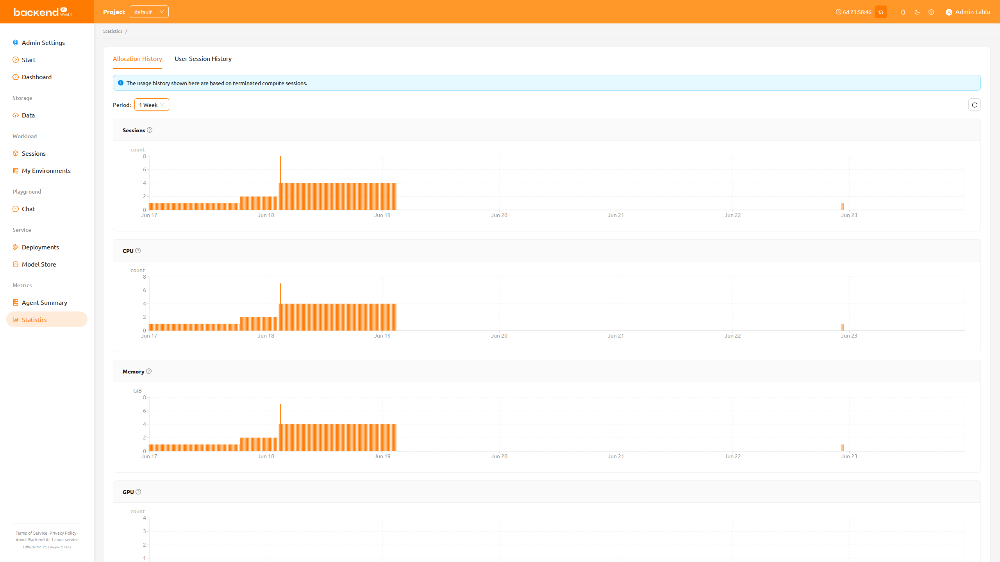
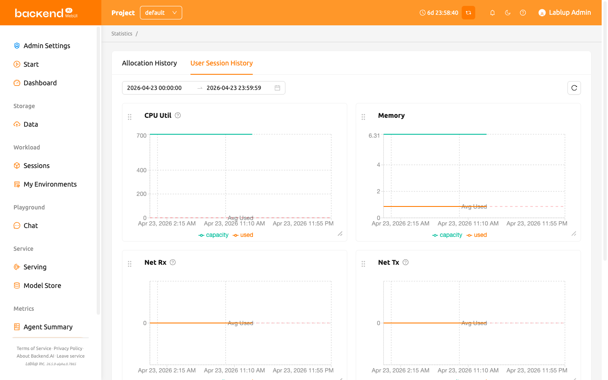

# Statistics Page

## Allocation History

On the Statistics page, under the Allocation History tab, you can check simple statistics related to the use of
compute sessions via graphs. An information banner at the top of the tab reminds you that the usage history is
based on terminated compute sessions. Below the banner, you can select the display period using the **Period**
dropdown at the upper left. The available options are **1 Day** and **1 Week**. You can also click the refresh
button next to the dropdown to reload the statistics data. The displayed items are as follows.

- Sessions: The number of compute sessions created.
- CPU: The number of CPU cores allocated to the compute sessions.
- Memory: The amount of memory allocated to the compute sessions.
- GPU: The number of GPU units allocated to the compute sessions.
  If the fractional GPU (fGPU) feature is enabled, it may not match the physical GPU.
- IO-Read: The amount of data read from the storage.
- IO-Write: The amount of data written to the storage.

Each metric card shows a question-mark icon next to its title. Hover over the icon to see a short description of
what that metric measures.

:::note
The statistics shown here are based on terminated compute sessions.
Also, one week statistics may not be shown for users whose account was created less than a week ago.
:::

:::info
The IO-Read and IO-Write cards appear only when user metrics are not available — that is, when the
[User Session History](#user-session-history) tab is not present. When user metrics are available, per-session
I/O activity is shown through the User Session History tab instead, so these two cards are omitted here.
:::

<!-- TODO: Verify/re-capture screenshot of usage_panel.png — charts now render via recharts -->

## User Session History

:::note
The User Session History tab is only available when the backend supports user metrics.
If you do not see this tab, contact your administrator.
:::

In the User Session History tab of the Statistics page, you can view statistics on various resources used by
sessions through graphs. You can select a custom date and time range using the date range picker at the upper
left. The date range picker also provides the following preset options for quick selection:

- **Today**
- **Last 1 Hour**
- **Last 3 Hours**
- **Last 12 Hours**
- **Last 1 Day**
- **Last 7 Days**

You can also click the refresh button next to the date range picker to reload the statistics data.

:::warning
If the selected date range exceeds 30 days, data for some dates may not be available when usage is low.
Try again with a shorter date range if you encounter missing data.
:::

The metric graphs displayed are dynamically determined by the backend based on the resources available in
your environment. Common metrics include:

- CPU Util: The amount of CPU time used by the sessions.
- Memory: The amount of memory used by the sessions.
- Net Rx: The rate at which the container is receiving network data.
- Net Tx: The rate at which the container is sending network data.

Depending on the available resources, additional metrics such as GPU Util and GPU Mem may also be displayed.

Each metric card plots two lines over the selected period, identified in the chart legend:

- **Capacity**: The total amount allocated or available for the metric over the selected period.
- **Used**: The actual amount the sessions used over the period.

A red dashed reference line labeled **Avg Used** marks the average used value across the selected range, so you
can quickly compare the current usage against the period average. As on the Allocation History tab, hover the
question-mark icon next to a metric title to see a description of what the metric measures.

:::note
If no metrics are available for the selected range or environment, the metric card shows an empty state
indicating that there are no metrics to display.
:::

The metric graph cards can be rearranged and resized by dragging, allowing you to customize the layout to
your preference.

More detailed statistics are shown in the admin-only Control-Panel.

<!-- TODO: Verify/re-capture screenshot of user_session_history.png — charts now render via recharts -->
