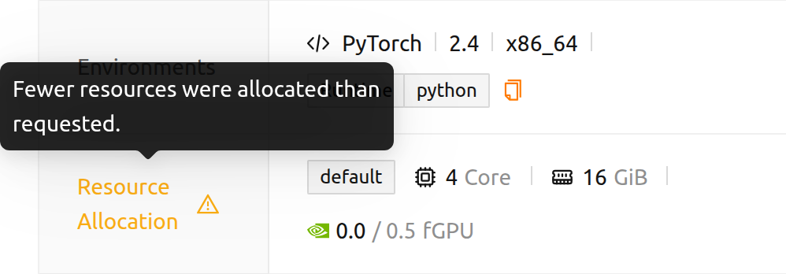

# FAQs & Troubleshooting

## User troubleshooting guide

### Session list is not displayed correctly

Due to intermittent network problems and/or other various reasons, session list
may not be displayed correctly. Most of the time, this problem will disappear just by
refreshing the browser.

- Web-based WebUI: Refresh the browser page (use the shortcut provided by
  browsers such as Ctrl-R). Since the browser's cache may cause troubles
  sometimes, it is recommended to refresh the page bypassing the cache
  (such as Shift-Ctrl-R, but the keys may differ in each browser).
- WebUI App: Press Ctrl-R shortcut to refresh the app.

### Suddenly, I cannot login with my account

If there are problems in recognizing authentication cookies, users may not be able to login temporarily. Try
to login with private browser window. If it succeeds, please clear your
browser's cache and/or application data.

<a id="offline-banner"></a>

### The WebUI says I am offline

A red **Offline: Not connected to any networks.** banner at the top of the page
means the Backend.AI server could not be reached. The WebUI does not rely on the
browser's own network guess alone — when the browser reports no connection, the
WebUI first checks whether the server still answers, and shows the banner only
if that check also fails. A working VPN, captive portal, or virtual network
adapter therefore no longer triggers a false alarm.

Check your network connection, and confirm with your administrator that the
Backend.AI server is running. The WebUI keeps re-checking while the banner is
shown, so the banner disappears on its own within a few seconds once the server
is reachable again.

A yellow **The server is taking longer to respond. Please wait a moment**
banner is a different message: the server is reachable but slow. You can dismiss
it and keep working.

<a id="route-error-pages"></a>

### A link takes me to an error page instead of the page I expected

When an address cannot be opened, the WebUI keeps you inside the application and
explains why instead of leaving a blank page. The page shows the address you
tried to open and a button that takes you to the first page available to you
(**Go back to the ... page**). The message tells you which of the following
happened:

- **Oops! Page not Found...** — the address does not match any page in the
  WebUI. This usually comes from a mistyped or outdated link, or a bookmark
  saved before a page was renamed.
- **Project '...' was not found or you don't have access to it.** — the address
  names a project that does not exist, or that you are not a member of. The
  address is shown with the project part marked, so you can see exactly which
  name failed. Pick a project you can use from the project selector at the top
  of the page, and the same feature opens in that project.
- **No accessible projects.** — your account does not belong to any project yet.
  Ask your administrator to grant you access to a project, as the message
  suggests.
- **Unauthorized Access** — the address is valid, but your role does not allow
  you to open it. See
  [Pages you cannot open](#pages-you-cannot-open) in the login chapter.

<a id="installing_apt_pkg"></a>

### How to install apt packages?

Inside a compute session, users cannot access `root` account and perform
operations that require `sudo` privilege for security reasons. Therefore, it
is not allowed to install packages with `apt` or `yum` since they require
`sudo`. If it is really required, you can request to admins to allow `sudo`
permission.

Alternatively, users may use Homebrew to install OS packages. Please refer to
the [guide on using Homebrew with automount folder](#using-linuxbrew-with-automountfolder).


<a id="install_pip_pkg"></a>

### How to install packages with pip?

By default, when you install a pip package, it will be installed under
`~/.local`. So, if you create an automount storage folder named `.local`, you
can keep the installed packages after a compute session is destroyed, and then
reuse them for the next compute session. Just install the packages with pip like:

```bash
pip install aiohttp
```
For more information, please refer to the [guide on installing Python
packages with automount folder](#using-pip-with-automountfolder).

### I have created a compute session, but cannot launch Jupyter Notebook

If you installed a Jupyter package with pip by yourself, it may be conflict with
the Jupyter package that a compute session provides by default. Especially, if you
have created `~/.local` directory, the manually installed Jupyter packages
persists for every compute session. In this case, try to remove the `.local`
automount folder and then try to launch Jupyter Notebook again.

### Page layout is broken

Backend.AI WebUI utilizes the latest modern JavaScript and/or browser features.
Please use the LATEST versions of moder browsers (such as Chrome).

<a id="sftp-disconnection"></a>

### SFTP disconnection

This entry covers transfers that stop after a connection was established. If no
connection dialog opens at all and a notification reports an error instead, the
connection information could not be resolved — see
[Connection Errors](#connection-errors) in the SFTP to Container chapter.

When the WebUI App launches an SFTP connection, it uses a local proxy server
which is embedded in the App. If you exit the WebUI App during the file transfer
with SFTP protocol, the transfer will immediately fail because the connection
established through the local proxy server is disconnected. Therefore, even if
you are not using a compute session, you should not quit the WebUI App while
using SFTP. If you need to refresh the page, we recommend using the Ctrl-R
shortcut.

If the WebUI App is closed and restarted, the SFTP service is not
automatically initiated for the existing compute session. You must explicitly
start the SSH/SFTP service in the desired container to establish the SFTP
connection.


## Admin troubleshooting guide

### Users cannot launch apps like Jupyter Notebook

There may be a problem connecting to the App Proxy service.
Try to stop and restart the service by referencing the guide on
start/stop/restart App Proxy service.

When users report a failure to open SSH/SFTP rather than a web-based app, ask
them for the exact message shown in the notification: each message points at a
different part of the App Proxy path, as described in
[Connection Errors](#connection-errors).

### Indicated resources do not match with actual allocation

The session detail page reports this by itself, so check it before doing
anything else. It shows the resources the session **actually holds**. When the
allocation differs from the request, each resource shows both values as
*allocated / requested* in the same chip (for example `0.0 / 0.5 fGPU`), and the
**Resource Allocation** label carries a warning icon whose tooltip reads
*Fewer resources were allocated than requested.*



A difference shown there is the real allocation, not a display error. It usually
means the request was adjusted when the session was allocated — for example a
fractional GPU amount rounded down to the resource group's quantum size. A
session that has not been allocated yet shows the requested amounts with no
comparison.

Only if the values on that page still disagree with what the container actually
uses — which can happen after an unstable network connection or a container
management problem of the Docker daemon — recompute the occupancy:

1. Log in with an administrator account.
2. Open the **Maintenance** page.
3. Click the **Recalculate Usage** button.

### Image is not displayed after it is pushed to a docker registry


:::note
This feature is only available for superadmins.
:::

If a new image is pushed to one of the Backend.AI docker registries, the image
metadata must be updated in Backend.AI to be used in creating a compute session.
Metadata update can be performed by clicking the **Rescan Images** button on the
**Maintenance** page. This will update metadata for every docker registry, if
there are multiple registries.

If you want to update the metadata for a specific docker registry, open the
**Registries** tab on the **Environments** page. Each registry is shown as a row
with an action menu. Click the **Rescan Images** action for the desired
registry's row to refresh only that registry's image metadata.

:::warning
The same row also has a **Delete** action (the trash icon). Deleting a registry
permanently removes it from Backend.AI — do not confuse it with the **Rescan
Images** action.
:::
