

# User Settings

The User Settings page allows you to customize your Backend.AI WebUI experience.
You can access it by clicking the person icon at the top right and selecting
the Preferences menu. From here, you can configure preferences such as theme mode,
language, desktop notifications, SSH keypair management, shell scripts, and
experimental features.

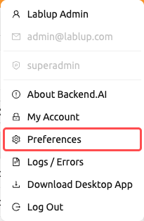

## General Tab

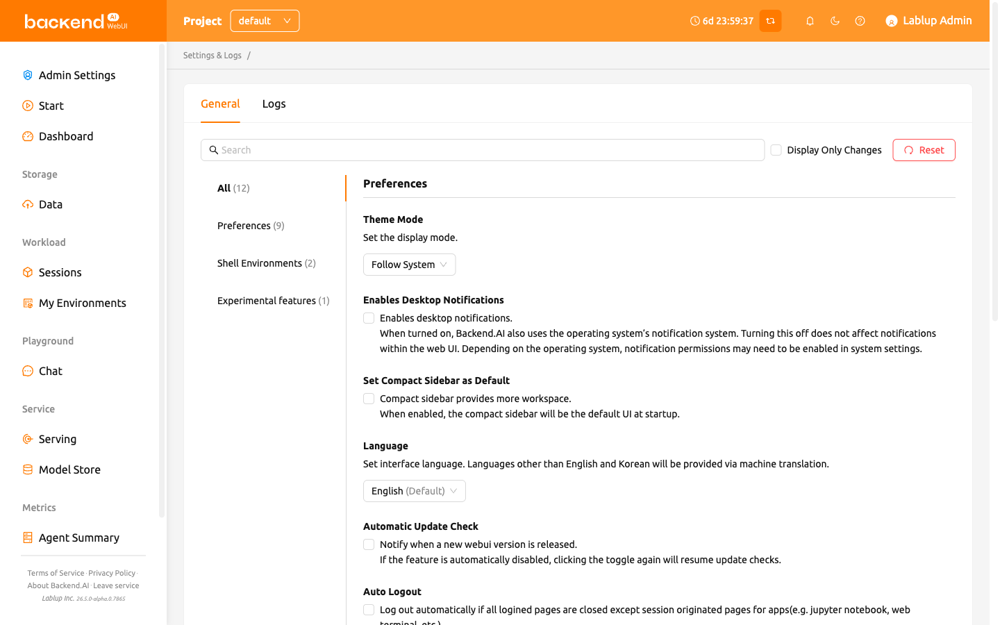

The General tab contains all preference settings organized into groups:
**Preferences**, **Shell Environments**, and **Experimental features**.

### Searching and Filtering Settings

At the top of the settings area, you can use the **search bar** to quickly find
a specific setting by name. Type a keyword, and only matching settings will be
displayed.

You can also check the **Display Only Changes** checkbox to filter the list
and show only settings that have been modified from their default values. This
is useful for reviewing all customizations you have made at a glance.

### Resetting Settings to Default

To restore all settings to their default values, click the **Reset to Default**
button at the top of the settings area. A confirmation dialog will appear before
the reset is applied.

Each individual setting also has its own reset button (displayed when the value
differs from the default), allowing you to reset a single setting without
affecting others.

### Theme Mode

Select the display mode for the WebUI. You can choose from:

- **Follow System**: Automatically matches your operating system's light or dark
  mode setting.
- **Light Mode**: Always use the light theme.
- **Dark Mode**: Always use the dark theme.

### Enables Desktop Notifications

Enables or disables the desktop notification feature. When turned on, Backend.AI
uses the operating system's notification system in addition to in-app
notifications. Turning this off does not affect notifications within the web UI.
Depending on the operating system, notification permissions may need to be
enabled in system settings.

### Set Compact Sidebar as Default

When this option is on, the left sidebar will be shown in a compact form
(narrower width). The change is applied when the browser is refreshed. If you
want to immediately change the sidebar type without refreshing the page, click
the leftmost icon at the top of the header.

### Language

Set the interface language. The language selector is a searchable dropdown that
lists 20 languages: English, 한국어 (Korean), brasileiro (Brazilian Portuguese),
简体中文 (Simplified Chinese), 繁體中文 (Traditional Chinese), Français (French),
Suomalainen (Finnish), Deutsch (German), Ελληνική (Greek),
Bahasa Indonesia (Indonesian), Italiano (Italian), 日本語 (Japanese),
Монгол (Mongolian), Polski (Polish), Português (Portuguese), русский (Russian),
Español (Spanish), ภาษาไทย (Thai), Türkçe (Turkish), and
Tiếng Việt (Vietnamese). You can type in the dropdown to filter and quickly
find a language.

The language that matches your browser's default is indicated with a "(Default)"
label next to its name. Languages other than English and Korean are provided via
machine translation. Some UI items may not update their language before the page
is refreshed.

:::note
Some translated items may be marked as `__NOT_TRANSLATED__`, which
indicates the item is not yet translated for that language. Since Backend.AI
WebUI is open sourced, anyone willing to help improve translations
can contribute: https://github.com/lablup/backend.ai-webui.
:::

### Keep Login Session Information while Logout

:::note
This setting is only available in the Electron (desktop) app.
:::

When enabled, the WebUI app preserves your current login session information
for the next app launch. If the option is turned off, login information will be
cleared each time you log out.

### Automatic Update Check

A notification window pops up when a new WebUI version is detected. It works
only in an environment where Internet access is available. If the feature is
automatically disabled, clicking the toggle again will resume update checks.

### Auto Logout

Log out automatically when all Backend.AI WebUI pages are closed except for
pages created to run apps in a session (e.g. Jupyter Notebook, web terminal,
etc.).

### My Keypair Information

Every user has at least one keypair. You can view your access key and secret key
by clicking the `Config` button. Remember that only one main access keypair exists.

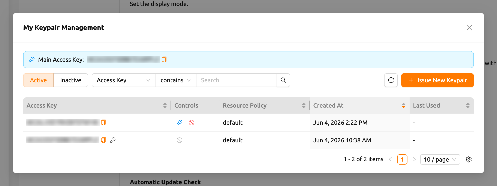

At the top of the dialog, the **Main Access Key** banner shows your current main
access key. Click the copy icon next to it to copy the key to your clipboard.

#### Browsing Your Keypairs

The dialog lists your keypairs in a table. Use the controls above the table to
narrow down what is shown:

- **Active** / **Inactive** toggle: Switch between viewing active keypairs and
  deactivated keypairs.
- **Filter**: Filter the list by **Access Key** or **Resource Policy**.
- **Column sorting**: Sort the table by **Access Key**, **Resource Policy**,
  **Created At**, or **Last Used** by clicking the column header.
- **Pagination**: Move between pages when you have more keypairs than fit on a
  single page.

The table includes the following columns:

- **Access Key**: The keypair's access key. Your main access key is flagged with
  a key icon. Click the copy icon to copy the access key.
- **Controls**: The actions available for each keypair (see below).
- **Resource Policy**: The resource policy applied to the keypair.
- **Created At**: When the keypair was created.
- **Last Used**: When the keypair was last used.
- **Modified At**: When the keypair was last modified. This column is hidden by
  default; you can show it through the table column settings.

#### Issuing a New Keypair

Click the **Issue New Keypair** button to create a new keypair. After the
keypair is issued, the **Keypair Credential Information** dialog appears, showing
the new credentials one time only.

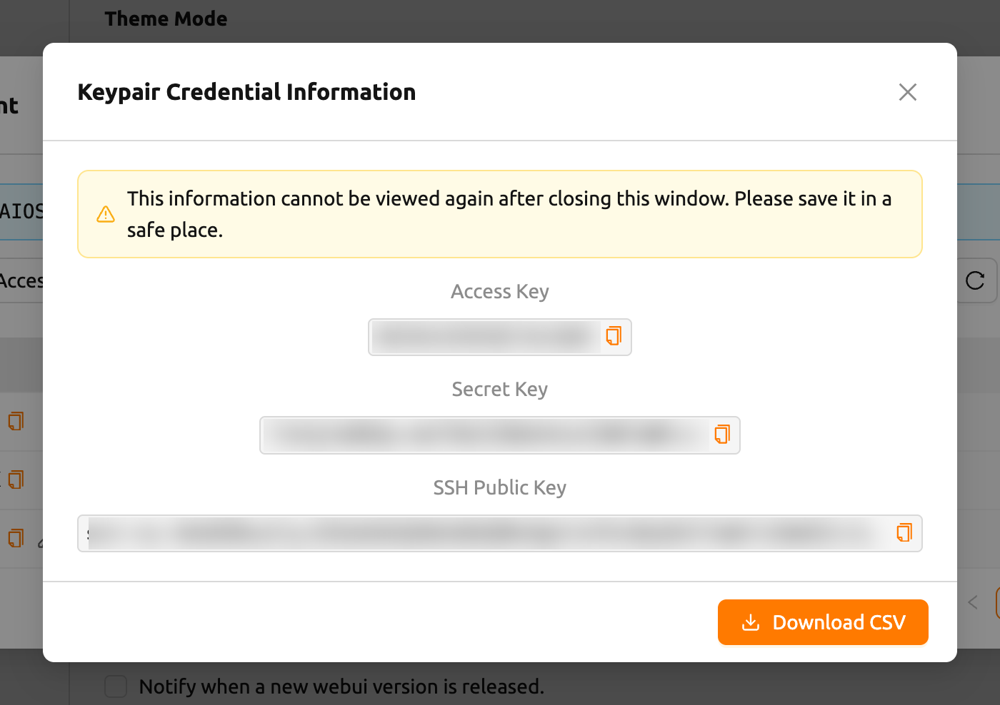

The dialog reveals the following values, each with a copy button:

- **Access Key**
- **Secret Key**
- **SSH Public Key**

Click **Download CSV** to save the credentials to a file.

:::warning
*"This information cannot be viewed again after closing this window. Please save
it in a safe place."* The secret key is shown only once. Copy it or download the
CSV before you close the dialog — there is no way to retrieve the secret key
afterward.
:::

#### Managing Active Keypairs

For each active keypair, the **Controls** column provides these actions:

- **Set as Main**: Make this keypair your main access key. A confirmation prompt
  appears before the change is applied. The current main access key already in
  use does not show this action.

  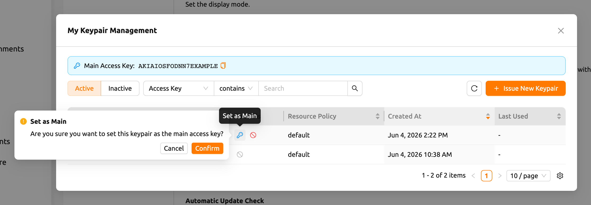

- **Deactivate**: Deactivate the keypair so it can no longer be used. A
  confirmation prompt appears before the keypair is deactivated. The main access
  key cannot be deactivated — switch to another key first
  (*"Cannot deactivate the main access key. Switch to another key first."*).

:::note[Re-Login Required]
When the main access key changes (for example, after issuing a new keypair and
setting it as the main one), the WebUI shows a **Re-Login Required**
notification with the message *"The main access key has been changed. Please log
in again to apply the change."* Log out and sign in again so that the new main
access key is applied to your session.
:::

#### Managing Inactive Keypairs

Switch to the **Inactive** view to manage deactivated keypairs. Each inactive
keypair provides these actions:

- **Restore**: Reactivate the keypair so it can be used again. A confirmation
  prompt appears before the keypair is restored.
- **Delete Keypair**: Permanently delete the keypair.

:::danger
Deleting a keypair is **irreversible** — the keypair cannot be recovered once
deleted. To prevent accidental deletion, you must type **Permanently Delete**
into the confirmation field before the delete is allowed.
:::

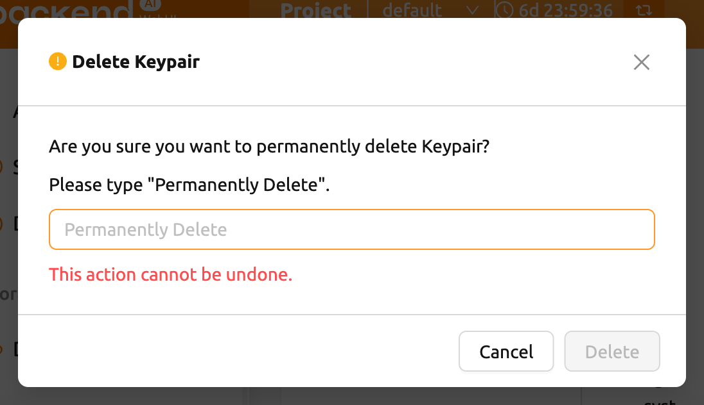

### SSH Keypair Management

When using the WebUI app, you can create SSH/SFTP connections directly to a
compute session. Once you sign up for Backend.AI, a public keypair is
provided. If you click the button on the right of the SSH Keypair Management
section, the following dialog appears. Click the copy button on the right to
copy the existing SSH public key. You can update the SSH keypair by clicking
the `GENERATE` button at the bottom of the dialog. SSH public/private keys are
randomly generated and stored as user information. Please note that the secret
key cannot be checked again unless it is saved manually immediately after
creation.

:::note
Backend.AI uses SSH keypair based on OpenSSH. On Windows, you may need to convert
this into a PPK key.
:::

Backend.AI WebUI supports adding your own SSH keypair to provide flexibility
such as accessing a private repository. To add your own SSH keypair, click the
`ENTER MANUALLY` button. You will then see two text areas
corresponding to the "public" and "private" keys.

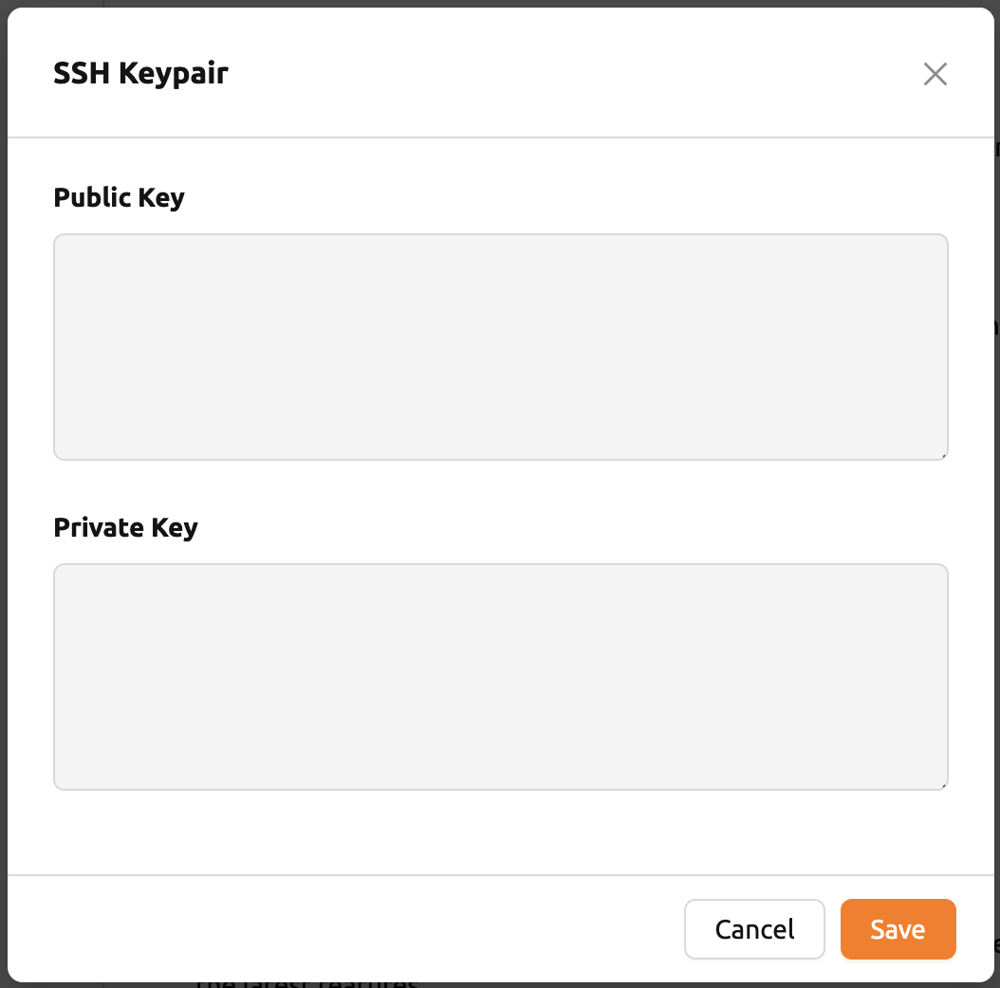

Enter the keys and click the `SAVE` button. You can now access your Backend.AI
session using your own key.

### Max Concurrent File Upload Limit

Limits the number of files that can be uploaded simultaneously through the
File Explorer. You can select a value between 2 and 5. The default value is 2.

### Edit Bootstrap Script

If you want to execute a one-time script just after your compute session
starts, write down the contents here.

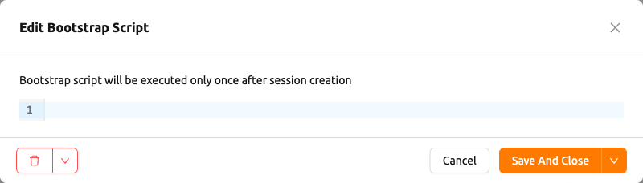

:::note
The compute session will remain in the `PREPARING` status until the bootstrap
script finishes its execution. Since you cannot use the session until it
is `RUNNING`, if the script contains long-running tasks, it might be
better to remove them from the bootstrap script and run them in a terminal
app.
:::

### Edit User Config Script

You can write config scripts to replace the default ones in a compute
session. Files like `.bashrc`, `.tmux.conf.local`, `.vimrc`, etc. can be
customized. The scripts are saved for each user and can be used when certain
automation tasks are required. For example, you can modify the `.bashrc`
script to register your command aliases or specify that certain files are always
downloaded to a specific location.

Use the drop-down menu at the top to select the type of script you want to write
and then write the content. You can save the script by
clicking the `Save` or `Save And Close` button. Click the `Delete` button to delete
the script.

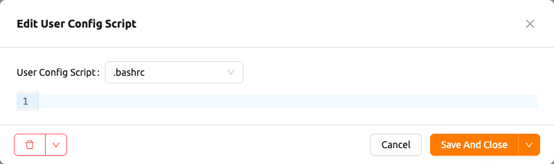

### Experimental Features

Access new experimental features early -- these may change or be removed in
future updates.

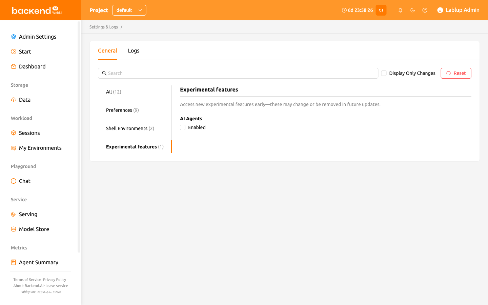

- **AI Agents**: Enable the AI Agents feature, which provides agent-based AI
  capabilities within the WebUI. When turned on, AI agent functionality becomes
  available for use in your sessions.

## Logs Tab

Displays detailed information of various logs recorded on the client side. You
can visit this page to find out more about errors that occurred.
You can search and filter error logs, refresh the list, and clear all logs by
clicking the Clear Logs button at the top right.

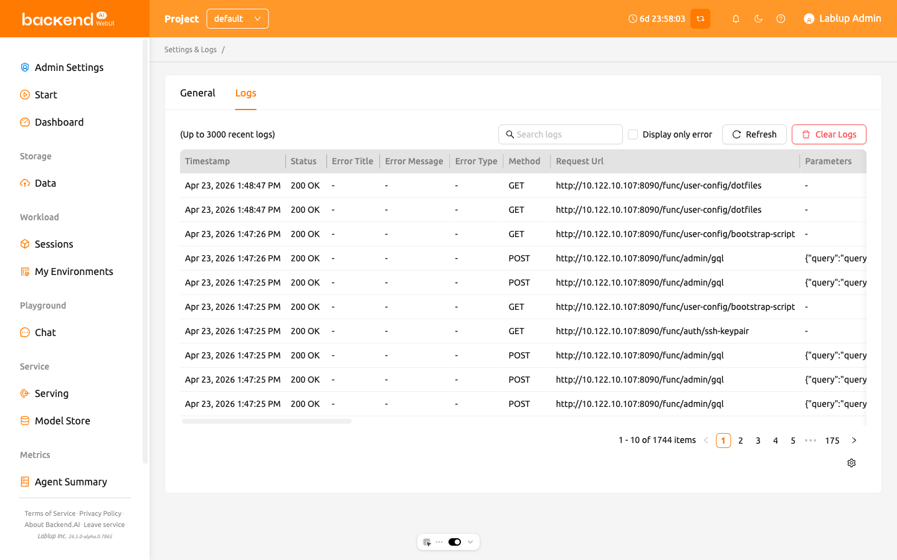

:::note
If you only have one page logged in, clicking the REFRESH button may not seem
to work properly. The Logs page is a collection of requests to the server and
responses from the server. If the current page is the Logs page, it will
not send any requests to the server except when explicitly refreshing the page.
To check that logs are being stacked properly, open another page and click
the REFRESH button.
:::

If you want to hide or show certain columns, click the gear icon at the bottom
right of the table. A dialog will appear where you can select the columns you
want to see.

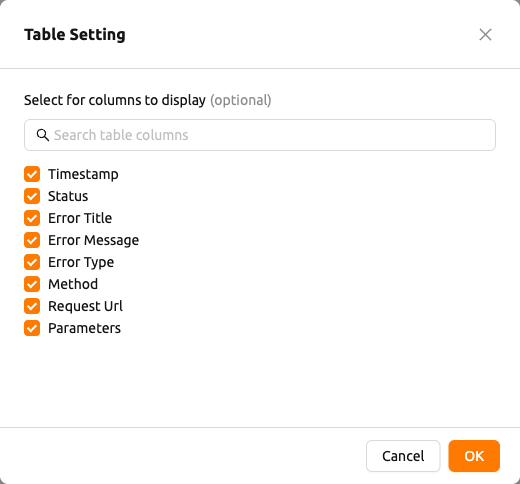
