

# User Settings

The User Settings page allows you to customize your Backend.AI WebUI experience.
You can access it by clicking the person icon at the top right and selecting
the Preferences menu. From here, you can configure preferences such as theme mode,
language, desktop notifications, SSH keypair management, shell scripts, and
experimental features. You can also review the client-side logs, the login
sessions currently signed in to your account, and your login history.

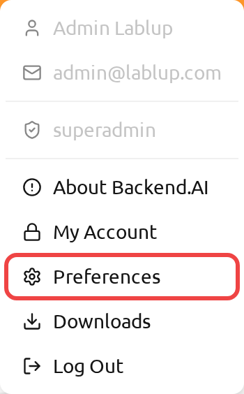

The page is organized into four tabs: **General**, **Logs**, **Login Sessions**,
and **Login History**.

## General tab

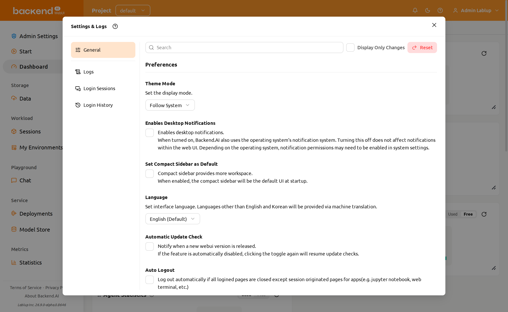

The General tab contains all preference settings organized into groups:
**Preferences**, **Shell Environments**, and **Experimental features**. The list
on the left lets you jump to a single group, or select **All** to see every
setting at once.

### Searching and filtering settings

At the top of the settings area, you can use the **search bar** to quickly find
a specific setting by name. Type a keyword, and only matching settings will be
displayed.

You can also check the **Display Only Changes** checkbox to filter the list
and show only settings that have been modified from their default values. This
is useful for reviewing all customizations you have made at a glance.

### Resetting settings to default

To restore all settings to their default values, click the **Reset** button at
the top of the settings area. A confirmation dialog appears before the reset is
applied, warning you that the action cannot be undone.

Each individual setting also has its own reset button (displayed when the value
differs from the default), allowing you to reset a single setting without
affecting others.

### Theme mode

Select the display mode for the WebUI. You can choose from:

- **Follow System**: Automatically matches your operating system's light or dark
  mode setting.
- **Light Mode**: Always use the light theme.
- **Dark Mode**: Always use the dark theme.

### Theme

A theme is a color family that Backend.AI applies across the whole WebUI, in
both light and dark mode. When theme selection is available, the **Theme**
setting lets you pick one of the built-in themes that ship with the product:

- **Default**: The standard look, built from the colors configured for your
  installation.
- **Stained**
- **Glass**
- **Reverie**
- **Bliss**

The selected theme is applied immediately, and the choice is remembered for your
account. Click the setting's reset button to go back to **Default**.

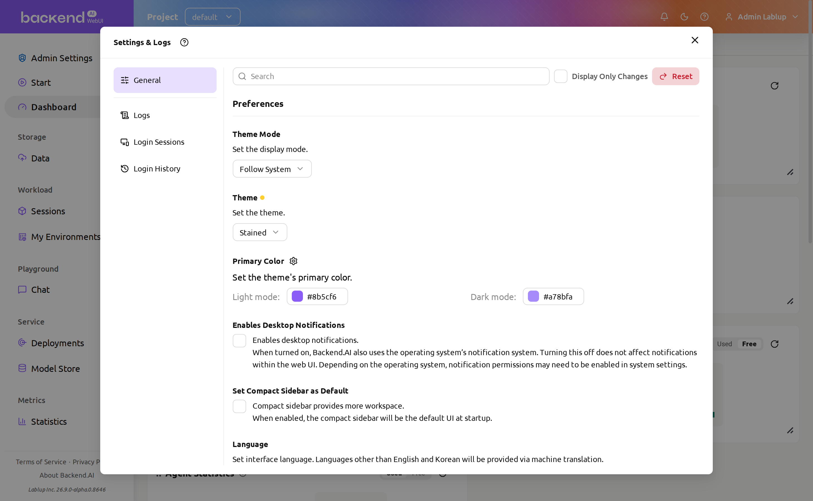

:::note
The **Theme** setting appears only when your administrator has enabled theme
customization and more than one theme is available for your installation. The
set of themes offered can therefore differ from the list above.
:::

### Primary color

**Primary Color** overrides the main accent color of the selected theme. Two
color pickers are provided — one for **Light mode** and one for **Dark mode** —
so each display mode can use a different accent color.

1. Click the color swatch of the mode you want to change
2. Choose a color from the picker, or enter a hex value
3. The new accent color is applied to the WebUI immediately

Clear a picker to fall back to the color that the selected theme provides for
that mode. Clicking the setting's reset button clears both modes and restores
the theme's own colors.

:::note
Like the **Theme** setting, **Primary Color** appears only when your
administrator has enabled theme customization.
:::

### Enables desktop notifications

Enables or disables the desktop notification feature. When turned on, Backend.AI
uses the operating system's notification system in addition to in-app
notifications. Turning this off does not affect notifications within the web UI.
Depending on the operating system, notification permissions may need to be
enabled in system settings.

### Set compact sidebar as default

When this option is on, the left sidebar will be shown in a compact form
(narrower width). The change is applied when the browser is refreshed. If you
want to immediately change the sidebar type without refreshing the page, click
the leftmost icon at the top of the header.

### Language

Set the interface language. The language selector is a searchable dropdown that
lists 20 languages: English, 한국어 (Korean), brasileiro (Brazilian Portuguese),
简体中文 (Simplified Chinese), 繁體中文 (Traditional Chinese), Français (French),
Suomalainen (Finnish), Deutsch (German), Ελληνική (Greek),
Bahasa Indonesia (Indonesian), Italiano (Italian), 日本語 (Japanese),
Монгол (Mongolian), Polski (Polish), Português (Portuguese), русский (Russian),
Español (Spanish), ภาษาไทย (Thai), Türkçe (Turkish), and
Tiếng Việt (Vietnamese). You can type in the dropdown to filter and quickly
find a language.

The language that matches your browser's default is indicated with a "(Default)"
label next to its name. Languages other than English and Korean are provided via
machine translation. Some UI items may not update their language before the page
is refreshed.

:::note
Some translated items may be marked as `__NOT_TRANSLATED__`, which
indicates the item is not yet translated for that language. Since Backend.AI
WebUI is open sourced, anyone willing to help improve translations
can contribute: https://github.com/lablup/backend.ai-webui.
:::

### Keep login session information while logout

:::note
This setting is only available in the Electron (desktop) app.
:::

When enabled, the WebUI app preserves your current login session information
for the next app launch. If the option is turned off, login information will be
cleared each time you log out.

### Automatic update check

A notification window pops up when a new WebUI version is detected. It works
only in an environment where Internet access is available. If the feature is
automatically disabled, clicking the toggle again will resume update checks.

### Auto logout

Log out automatically when all Backend.AI WebUI pages are closed except for
pages created to run apps in a session (e.g. Jupyter Notebook, web terminal,
etc.).

### My keypair information

Every user has at least one keypair. You can view your access key and secret key
by clicking the `Config` button. Remember that only one main access keypair exists.

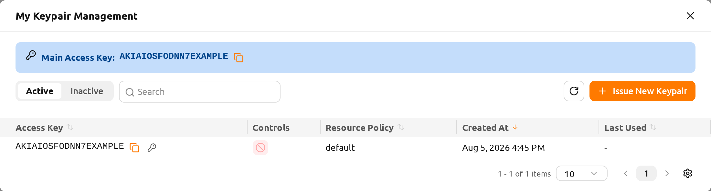

At the top of the dialog, the **Main Access Key** banner shows your current main
access key. Click the copy icon next to it to copy the key to your clipboard.

#### Browsing your keypairs

The dialog lists your keypairs in a table. Use the controls above the table to
narrow down what is shown:

- **Active** / **Inactive** toggle: Switch between viewing active keypairs and
  deactivated keypairs.
- **Filter**: Filter the list by **Access Key** or **Resource Policy**.
- **Column sorting**: Sort the table by **Access Key**, **Resource Policy**,
  **Created At**, or **Last Used** by clicking the column header.
- **Pagination**: Move between pages when you have more keypairs than fit on a
  single page.

The table includes the following columns:

- **Access Key**: The keypair's access key. Your main access key is flagged with
  a key icon. Click the copy icon to copy the access key.
- **Controls**: The actions available for each keypair (see below).
- **Resource Policy**: The resource policy applied to the keypair.
- **Created At**: When the keypair was created.
- **Last Used**: When the keypair was last used.
- **Modified At**: When the keypair was last modified. This column is hidden by
  default; you can show it through the table column settings.

#### Issuing a new keypair

Click the **Issue New Keypair** button to create a new keypair. After the
keypair is issued, the **Keypair Credential Information** dialog appears, showing
the new credentials one time only.

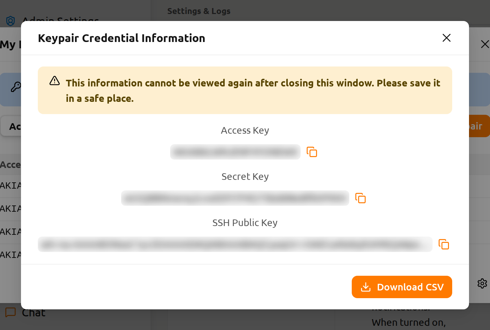

The dialog reveals the following values, each with a copy button:

- **Access Key**
- **Secret Key**
- **SSH Public Key**

Click **Download CSV** to save the credentials to a file.

:::warning
*"This information cannot be viewed again after closing this window. Please save
it in a safe place."* The secret key is shown only once. Copy it or download the
CSV before you close the dialog — there is no way to retrieve the secret key
afterward.
:::

#### Managing active keypairs

For each active keypair, the **Controls** column provides these actions:

- **Set as Main**: Make this keypair your main access key. A confirmation prompt
  appears before the change is applied. The current main access key already in
  use does not show this action.

  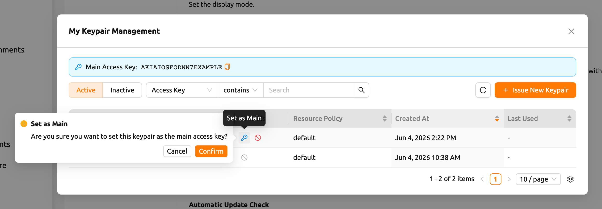

- **Deactivate**: Deactivate the keypair so it can no longer be used. A
  confirmation prompt appears before the keypair is deactivated. The main access
  key cannot be deactivated — switch to another key first
  (*"Cannot deactivate the main access key. Switch to another key first."*).

:::note[Re-Login Required]
When the main access key changes (for example, after issuing a new keypair and
setting it as the main one), the WebUI shows a **Re-Login Required**
notification with the message *"The main access key has been changed. Please log
in again to apply the change."* Log out and sign in again so that the new main
access key is applied to your session.
:::

#### Managing inactive keypairs

Switch to the **Inactive** view to manage deactivated keypairs. Each inactive
keypair provides these actions:

- **Restore**: Reactivate the keypair so it can be used again. A confirmation
  prompt appears before the keypair is restored.
- **Delete Keypair**: Permanently delete the keypair.

:::danger
Deleting a keypair is **irreversible** — the keypair cannot be recovered once
deleted. To prevent accidental deletion, you must type **Permanently Delete**
into the confirmation field before the delete is allowed.
:::

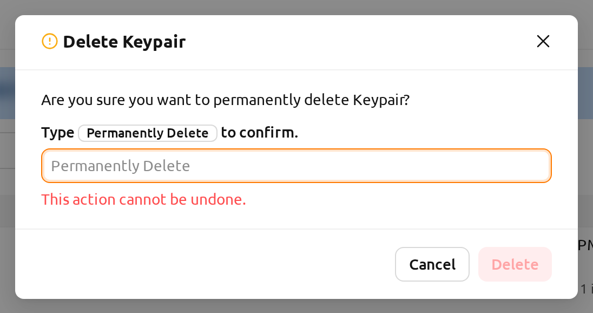

### SSH keypair management

When using the WebUI app, you can create SSH/SFTP connections directly to a
compute session. Once you sign up for Backend.AI, a public keypair is
provided. If you click the button on the right of the SSH Keypair Management
section, the following dialog appears. Click the copy button on the right to
copy the existing SSH public key. You can update the SSH keypair by clicking
the `Generate` button at the bottom of the dialog. SSH public/private keys are
randomly generated and stored as user information. Please note that the secret
key cannot be checked again unless it is saved manually immediately after
creation.

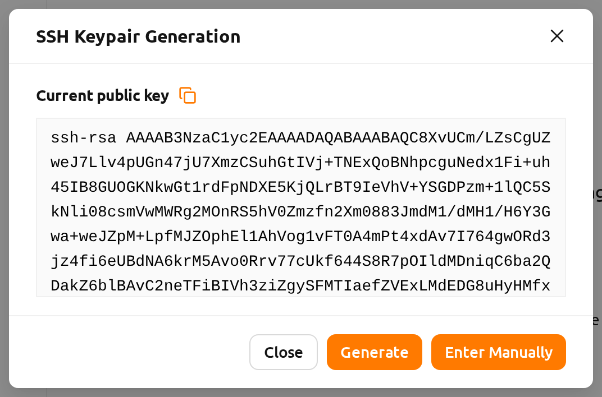

:::note
Backend.AI uses SSH keypair based on OpenSSH. On Windows, you may need to convert
this into a PPK key.
:::

Backend.AI WebUI supports adding your own SSH keypair to provide flexibility
such as accessing a private repository. To add your own SSH keypair, click the
`Enter Manually` button. You will then see two text areas labeled **Public Key**
and **Private Key**.

Enter the keys and click the `Save` button. You can now access your Backend.AI
session using your own key.

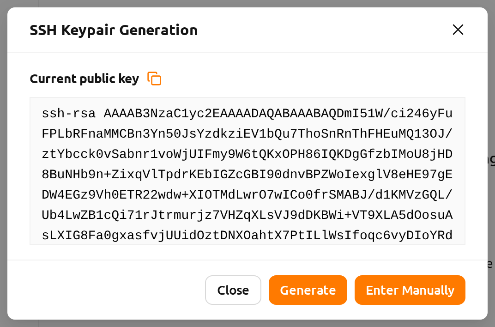

### Max concurrent file upload limit

Limits the number of files that can be uploaded simultaneously through the
File Explorer. You can select a value between 2 and 5. The default value is 2.

### Edit bootstrap script

If you want to execute a one-time script just after your compute session
starts, write down the contents here.

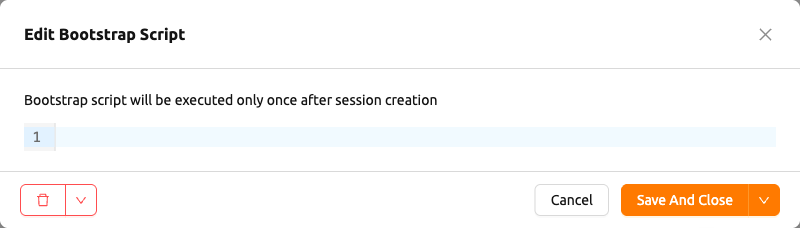

:::note
The compute session will remain in the `PREPARING` status until the bootstrap
script finishes its execution. Since you cannot use the session until it
is `RUNNING`, if the script contains long-running tasks, it might be
better to remove them from the bootstrap script and run them in a terminal
app.
:::

### Edit user config script

You can write config scripts to replace the default ones in a compute
session. Files like `.bashrc`, `.tmux.conf.local`, `.vimrc`, etc. can be
customized. The scripts are saved for each user and can be used when certain
automation tasks are required. For example, you can modify the `.bashrc`
script to register your command aliases or specify that certain files are always
downloaded to a specific location.

Use the drop-down menu at the top to select the type of script you want to write
(`.bashrc`, `.zshrc`, `.tmux.conf.local`, `.vimrc`, or `.Renviron`) and then
write the content. Click `Save And Close` to save the script and close the
dialog, or open the arrow next to it and select `Save Without Close` to save
while keeping the dialog open. The buttons on the left of the dialog delete the
script or reset your unsaved changes.

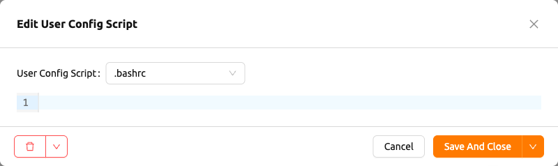

### Experimental features

Access new experimental features early -- these may change or be removed in
future updates. Each feature is turned on with its **Enabled** checkbox.

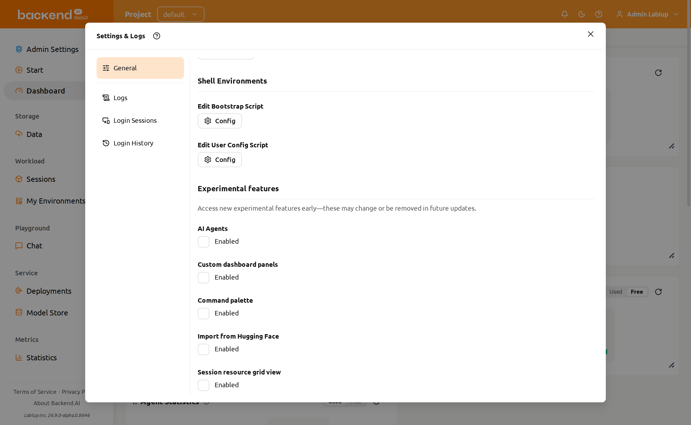

- **AI Agents**: Enable the AI Agents feature, which provides agent-based AI
  capabilities within the WebUI. When turned on, AI agent functionality becomes
  available for use in your sessions.
- **Import from Hugging Face**: Adds an **Import Hugging Face Model** tab to the
  **Start From URL** dialog on the Start page, so you can import a model from
  Hugging Face directly into a model folder. The tab appears only when model
  deployment is also available in your installation.

## Logs tab

Displays detailed information of various logs recorded on the client side. You
can visit this page to find out more about errors that occurred.
You can search and filter error logs, refresh the list, and clear all logs by
clicking the **Clear Logs** button at the top right.

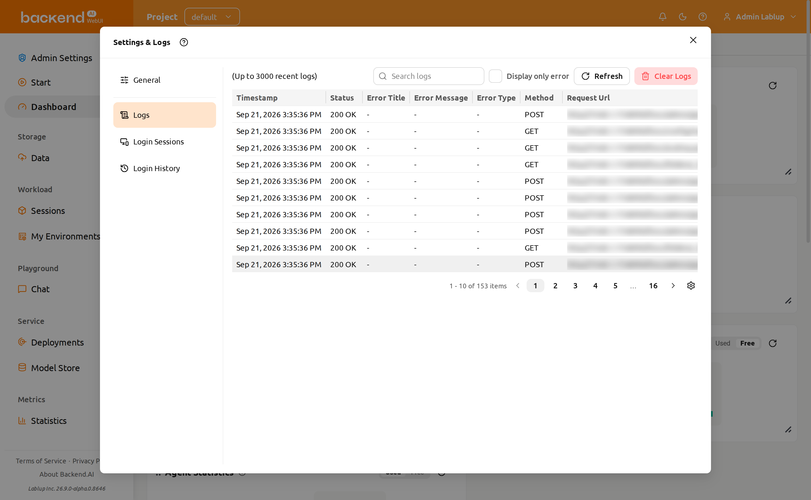

:::note
If you only have one page logged in, clicking the **Refresh** button may not
seem to work properly. The Logs page is a collection of requests to the server
and responses from the server. If the current page is the Logs page, it will
not send any requests to the server except when explicitly refreshing the page.
To check that logs are being stacked properly, open another page and click
the **Refresh** button.
:::

If you want to hide or show certain columns, click the gear icon at the bottom
right of the table. A dialog will appear where you can select the columns you
want to see.

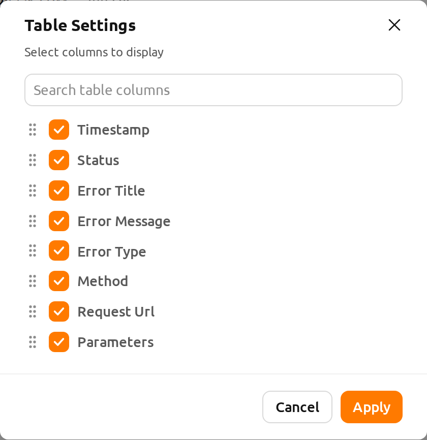

## Login Sessions tab

The Login Sessions tab lists the login sessions currently associated with your
account — one entry for every place where you are signed in to Backend.AI. Use
it to review where your account is in use and to sign out a session you no
longer need.

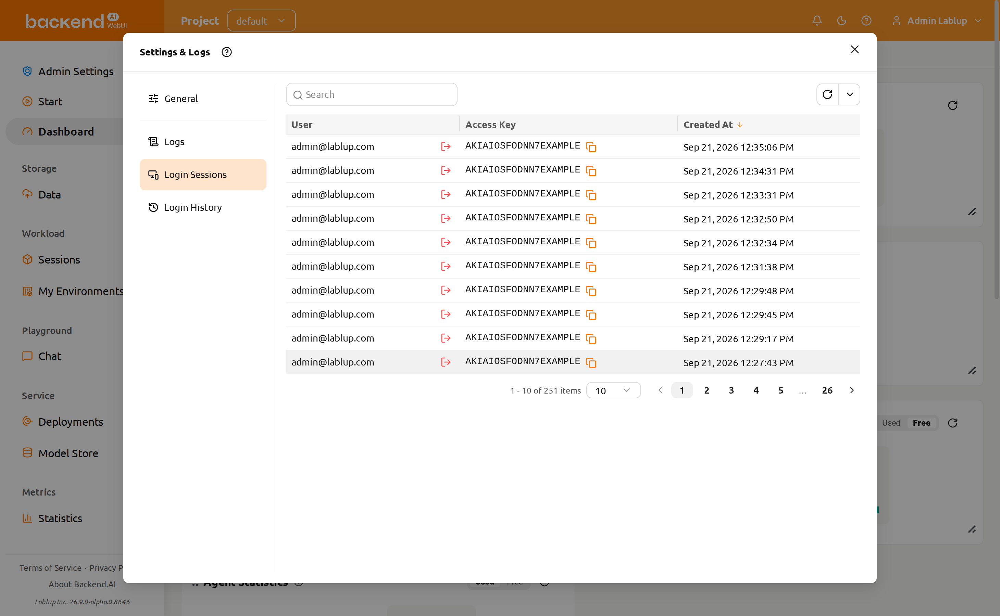

The table includes the following columns:

- **User**: The email address of the account that owns the login session.
- **Access Key**: The access key the login session authenticates with. Click the
  copy icon to copy it.
- **Created At**: When the login session was created. Click the column header to
  sort by this column.

### Filtering login sessions

Use the filter above the table to narrow down the list:

- **Access Key**: Shows only the login sessions whose access key contains the
  text you enter.
- **Created At**: Shows only the login sessions created after (or before) the
  date and time you select.

Use the pagination controls below the table to move between pages and to change
how many rows are shown per page.

### Revoking a login session

Each row provides a **Revoke Session** action next to the email address in the
**User** column.

1. Click **Revoke Session** on the row you want to end
2. Check the confirmation prompt, which shows the access key of that login
   session
3. Click **Revoke**

The list reloads and the message *"Login session revoked."* is displayed. If the
login session cannot be revoked, *"Failed to revoke login session."* is shown
instead.

:::warning
Revoking a login session signs it out immediately. If you revoke the login
session you are currently using, you have to log in again.
:::

## Login History tab

The Login History tab shows the login attempts recorded for your account —
successful sign-ins, failed attempts, and login session events such as logout or
expiry. This tab is read-only; there are no actions on the rows.

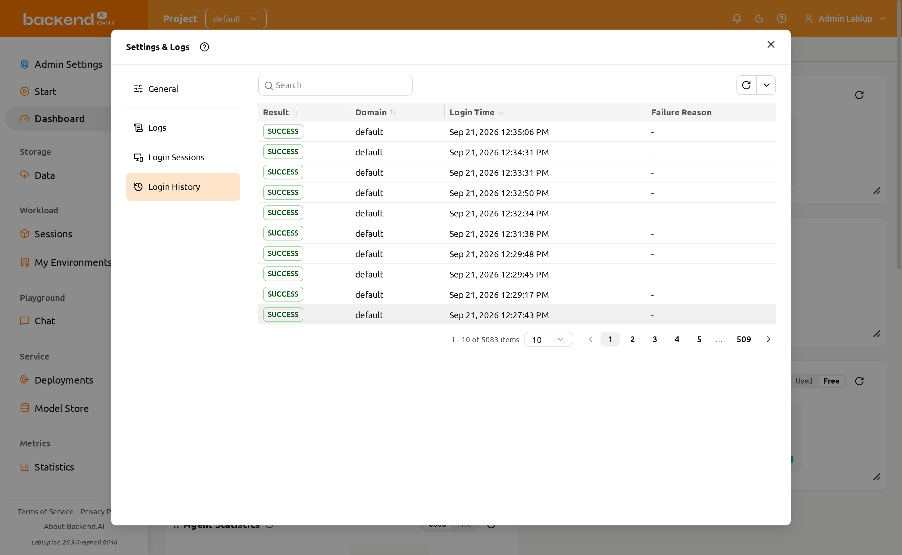

The table includes the following columns:

- **Result**: The outcome of the login attempt, shown as a color-coded tag. You
  can sort by this column.
- **Domain**: The domain the login attempt was made against. You can sort by
  this column.
- **Login Time**: When the login attempt was recorded. You can sort by this
  column.
- **Failure Reason**: Additional detail reported for a failed attempt. Shows `-`
  when there is none.

:::note
Result values are shown exactly as the server reports them (for example,
`SUCCESS` or `FAILED_INVALID_CREDENTIALS`) and are not translated.
:::

### Result values

| Result | Color | Meaning |
|--------|-------|---------|
| SUCCESS | Green | The sign-in succeeded |
| FAILED_INVALID_CREDENTIALS | Red | The email address or password was wrong |
| FAILED_USER_INACTIVE | Red | The account is not active |
| FAILED_BLOCKED | Red | The sign-in was blocked |
| FAILED_PASSWORD_EXPIRED | Red | The account password has expired |
| FAILED_REJECTED_BY_HOOK | Red | The sign-in was rejected by a server-side hook |
| FAILED_SESSION_ALREADY_EXISTS | Red | A login session already exists for the account |
| LOGOUT | Gray | The login session was ended by signing out |
| REVOKED_BY_ADMIN | Yellow | An administrator revoked the login session |
| REVOKED_BY_USER | Gray | You revoked the login session yourself |
| EVICTED | Yellow | The server evicted the login session |
| EXPIRED | Gray | The login session expired |

### Filtering login history

Use the filter above the table to narrow down the list:

- **Result**: Shows only the entries with the result you select from the list of
  values above.
- **Domain**: Shows only the entries whose domain contains the text you enter.
- **Login Time**: Shows only the entries recorded after (or before) the date and
  time you select.

Use the pagination controls below the table to move between pages and to change
how many rows are shown per page.
