# Handling Data & Storage Folders


Backend.AI supports dedicated storage to preserve user's files. Since the files
and directories of a compute session are deleted upon session termination, it is
recommended to save them in a storage folder. List of storage folders can be
found by selecting the Data page on the sidebar. You can see the information
such as the folder name and ID, the NFS host name where the folder is located
(Location), and folder access rights (Permission).


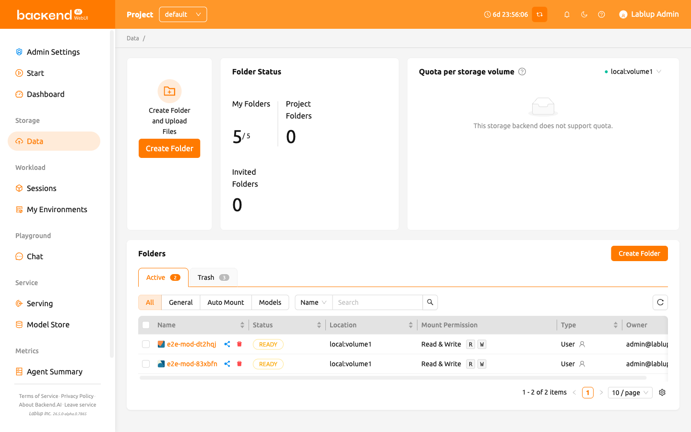

There are two types of storage folders: `User` and `Project`. You can
distinguish between them in the 'Type' column.

A User folder is created directly by an individual user for personal use.
A Project folder is created by a domain administrator for each project.
Regular users cannot create project folders themselves; they can only use
project folders that have been created by an administrator.

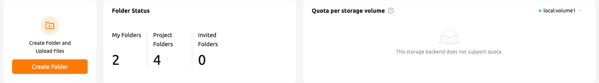

The Storage Status and Quota per storage volume show the following information:

- Storage Status
    - Created Folders: The number of folders that the user created.

         - Limit: The maximum number of folders that the user can create afterwards. This value depends on the resource policy applied to the user and cannot be changed without changing the resource policy. Folders that were not created by the user (eg. folders invited to share, or project folders) are not counted.

    * Project Folders: The number of project folders that the user created.
    * Invited Folders: The number of folders that the user was invited to share.
- Quota per storage volume
    * Host: The name of the storage host.
    * Project: Current project folder usage / current project folder quota scope.
    * User: Current user folder usage / current user folder quota scope.


:::note
Please remind that quota is only available in storage that provides quota setting
(e.g. XFS, CephFS, NetApp, Purestorage, etc.). For the quota setting, please refer
to the [Quota Setting Panel](#quota-setting-panel) section.
:::

<a id="create-storage-folder"></a>
<a id="create_storage_folder"></a>

## Create storage folder


To create a new folder, click 'Create Folder' on the Data page. Fill in the fields in
the creation dialog as follows:


The meaning of each field in the creation dialog is as follows.

- Usage Mode: Set the purpose of the folder.

   * General: Defines a folder for storing various data in a general-purpose manner.
   * Models: Defines a folder specialized for model serving and management. If this mode is selected, it is also possible to toggle the folder's copy availability.
   * Auto Mount: Folders automatically mounted when a session is created. If selected, the folder name must start with a dot ('.').

- Folder name: The name of the folder (up to 64 characters).
- Location: Select the NFS host where the folder will be created. If there are multiple hosts, choose one. An indicator will show if there is enough available space.
- Type: Determines the type of folder to be created. It can be set as User or Project. The User folder is a folder that users can create and use alone and the Project folder is a folder created by admin and shared by users in the project.
- Project: Shown only when you select project type. Designates the project to which the folder belongs when creating a new project folder. Project folders must belong to a project. However, it does not play any role when creating a user folder.
- Permission: Set permission of a project folder for project members. If this is set to "Read-Only", project members cannot write to this folder inside their compute session.
- Cloneable: Shown only when you select usage model to "Model". Select whether the vfolder you are creating should be cloneable.

The folders created here can be [mounted](../mount_vfolder/mount_vfolder.md#session-mounts) when creating a compute session. Folders are mounted
under the user's default working directory, `/home/work/`, and the file stored in the mounted
directory will not be deleted when the compute session is terminated.
(If you delete the folder, the file will also be deleted.)

<a id="explore-folder"></a>

## Explore folder


Click the folder name to open a file explorer and view the contents of the folder.


You can see that directories and files inside the folder will be listed, if
exists. Click a directory name in the Name column to move to the directory.  You
can click the download button or delete button in the Actions column to download
it or delete it entirely from the directory. You can rename a file/directory as
well. For more detailed file operations, you can mount this folder when creating
a compute session, and then use a service like Terminal or Jupyter Notebook to
do it.

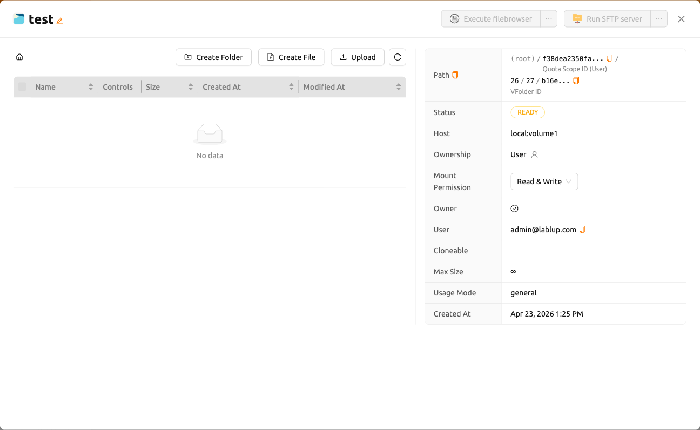

You can create a new directory on the current path with the 'Create' button
(in the folder explorer), or upload a local file or folder with the 'Upload' button. All
of these file operations can also be performed using the above-described method
of mounting folders into a compute session.

The maximum length of file or directory inside a folder may depends on the host
file system. But, it usually cannot exceed 255 characters.


:::note
To ensure smooth performance, the screen limits the maximum number of files that can be displayed when a
directory contains an excessive number of files. If a folder contains a large number of files, some may
not be shown on the screen. In such cases, please use the terminal or other applications to view all files
in the directory.
:::

### Edit Text Files

You can edit text files directly in the folder explorer. Click the folder name to open the file explorer, then click the 'Edit File' button in the Control column for any text file.

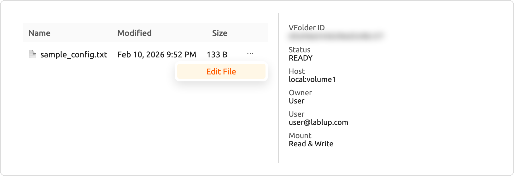

The text file editor opens in a modal with a code editor interface. The editor automatically detects the file type based on the file extension and applies appropriate syntax highlighting (e.g., Python, JavaScript, Markdown). The modal title displays the file name and size.

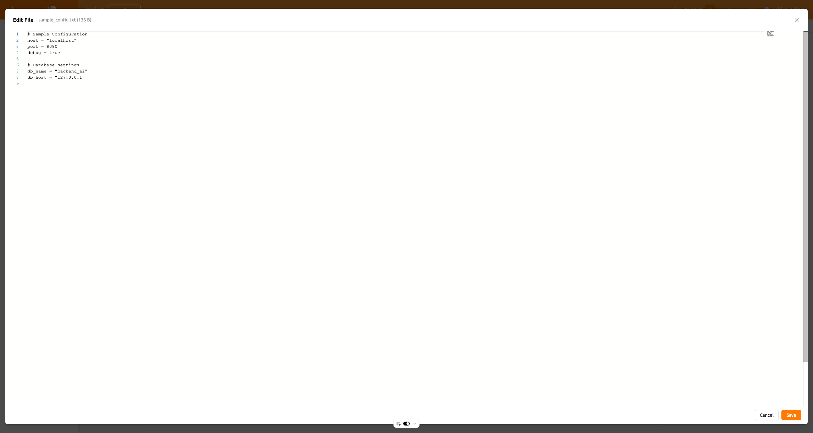

The editor supports both light and dark themes matching your UI preferences. You can edit the file content, then click 'Save' to upload the modified file, or 'Cancel' to discard changes.

:::note
The Edit File button is only available when you have write_content permission on the storage folder. If the file fails to load, an error message will be displayed.
:::

## Rename folder


If you have permission to rename the storage folder, you can rename it by
clicking the edit button.

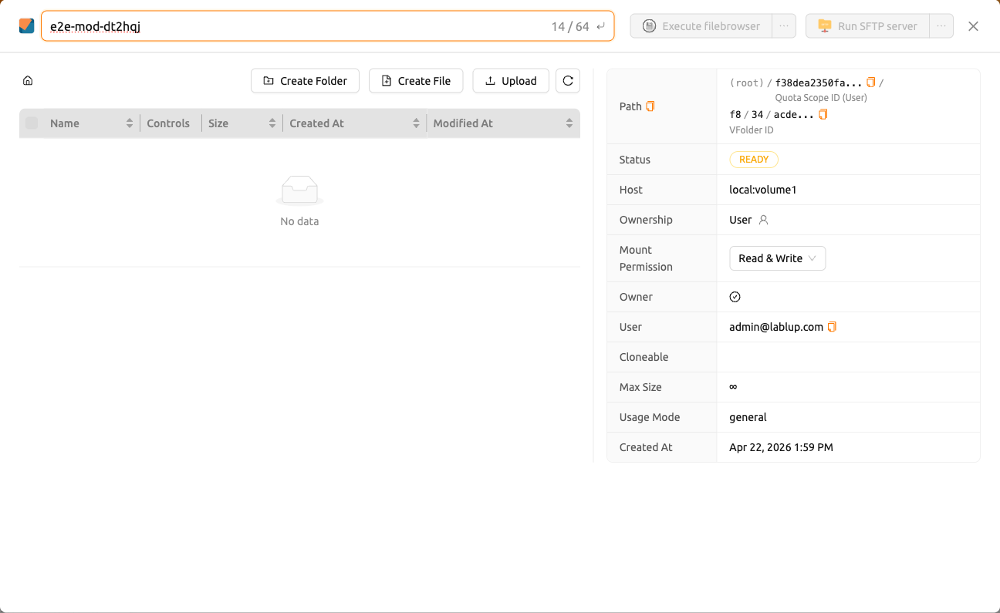


## Delete folder


If you have permission to delete the storage folder, you can send the folder to the 'Trash'
tab by clicking the 'trash bin' button. When you move a folder to the Trash tab, it is marked as delete-pending.

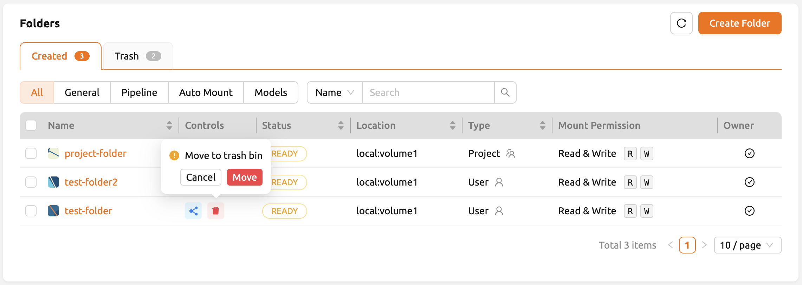

In this status, you can restore the folder by clicking restore button in Control column. If you want to permanently delete the folder,
please click 'trash bin' button in the same column.

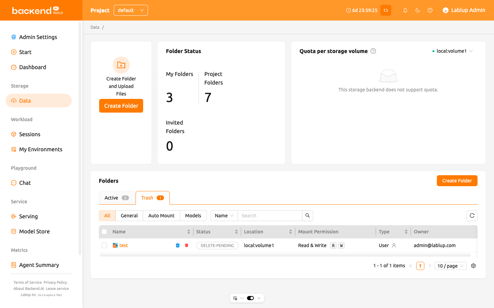

A confirmation modal will pop up with
an input field saying `Type folder name to delete`. Make sure you type the exact folder name correctly
into the field, and click the red 'DELETE FOREVER' button to permanently delete the folder.

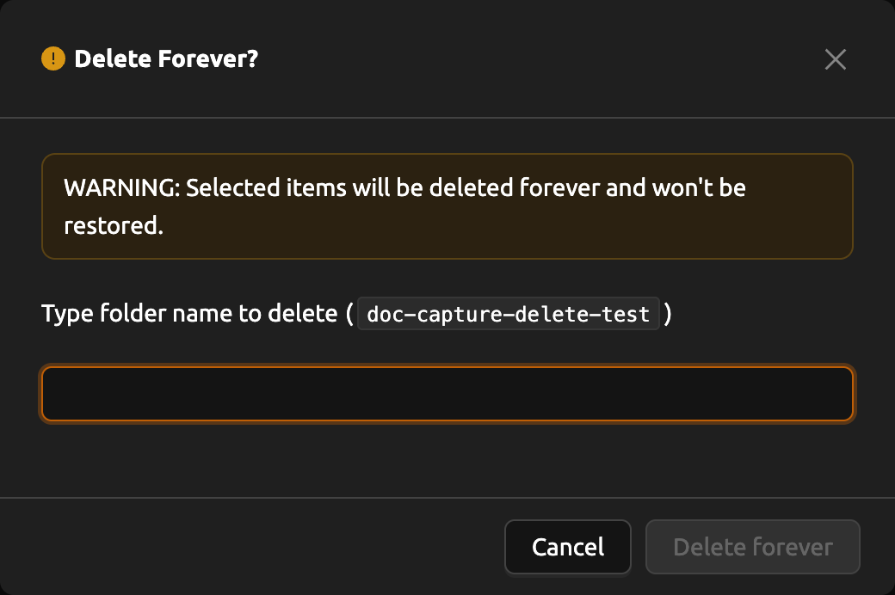

## Using FileBrowser


Backend.AI supports [FileBrowser](https://filebrowser.org) from version
20.09. FileBrowser is a program that helps you manage files on a remote server
through a web browser. This is especially useful when uploading a directory from
the user's local machine.

Currently, Backend.AI provides a FileBrowser as an application of a compute
session. Therefore, the following conditions are required to launch it.

- User can create at least one compute session.
- User can allocated at least 1 core of CPU and 512 MB of memory.
- Image that supports FileBrowser must be installed.

You can access FileBrowser in two ways.

- Execute FileBrowser from file explorer dialog of a data folder.
- Launch a compute session directly from a FileBrowser image on Sessions page.


### Execute FileBrowser from folder explorer dialog

Go to the Data page and open the file explorer dialog of target
data folder. Click the folder name to open the file explorer.


Click 'Execute filebrowser' button in the upper-right corner of the explorer.


You can see the FileBrowser is opened in a new window. You can also see that the
data folder you opened the explorer dialog becomes the root directory. From the
FileBrowser window, you can freely upload, modify, and delete any directories
and files.


When user clicks 'EXECUTE FILEBROWSER' button, Backend.AI automatically creates a
dedicated compute session for the app. So, in the Sessions page, you should see
FileBrowser compute session. It is user's responsibility to delete this compute
session.

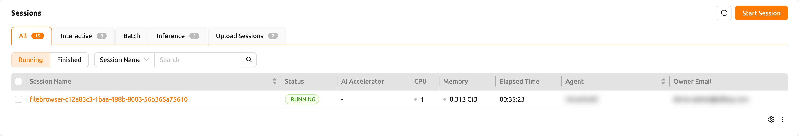


:::note
If you accidentally close the FileBrowser window and want to reopen it, just
go to Sessions page and click the FileBrowser application button of the
FileBrowser compute session.


When you click 'EXECUTE FILEBROWSER' button again in the data folder
explorer, a new compute session will be created and a total of two
FileBrowser sessions will appear.
:::

### Create a compute session with FileBrowser image

You can directly create a compute session with FileBrowser supported images.
You need to mount at least one or more data folders to access them. You can use
FileBrowser without a problem even if you do not mount any data folder, but
every uploaded/updated files will be lost after the session is terminated.


:::note
The root directory of FileBrowser will be `/home/work`. Therefore, you
can access any mounted data folders for the compute session.
:::

### Basic usage examples of FileBrowser

Here, we present some basic usage examples of FileBrowser in Backend.AI. Most
of the FileBrowser operations are intuitive, but if you need more detailed
guide, please refer to the
[FileBrowser documentation](https://filebrowser.org).

**Upload local directory using FileBrowser**

FileBrowser supports uploading one or more local directories while maintaining
the tree structure. Click the upload button in the upper right corner of the
window, and click Folder button. Then, local file explorer dialog will appear
and you can select any directory you want to upload.


:::note
If you try to upload a file to a read-only folder, FileBrowser will raise a
server error.
:::


Let's upload a directory with the following structure.

```shell
foo
+-- test
|   +-- test2.txt
+-- test.txt
```

After selecting `foo` directory, you can see the directory just uploaded
successfully.

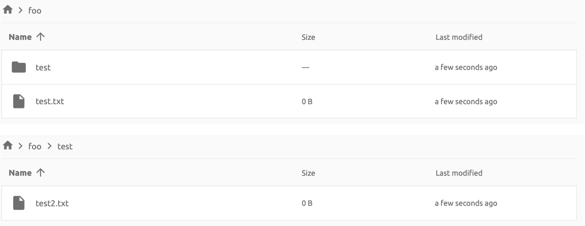

You can also upload local files and directories by drag and drop.

**Move files or directories to another directory**

Moving files or directories in data folder is also possible from FileBrowser.
You can move files or directories by following steps below.

1. Select directories or files from FileBrowser.


2. Click the 'arrow' button in the upper right corner of FileBrowser


3. Select the destination


4. Click 'MOVE' button

You will see that moving operation is successfully finished.


:::note
FileBrowser is provided via application inside a compute session currently.
We are planning to update FileBrowser so that it can run independently
without creating a session.
:::

## Using SFTP Server


From 22.09, Backend.AI supports SSH / SFTP file upload from both desktop app and
web-based WebUI. The SFTP server allows you to upload files quickly through reliable
data streams.


:::note
Depending on the system settings, running SFTP server from the file dialog may not
be allowed.
:::

### Execute SFTP server from folder explorer dialog in Data page

Go to the Data page and open the file explorer dialog of target data folder.
Click the folder button or the folder name to open the file explorer.

Click 'Run SFTP server' button in the upper-right corner of the explorer.


You can see the SSH / SFTP connection dialog. And a new SFTP session will be created
automatically. (This session will not affect resource occupancy.)


For the connection, click 'Download SSH Key' button to download the SSH private key
(`id_container`). Also, remember the host and port number. Then, you can copy your
files to the session using the Connection Example code written in the dialog, or
referring to the following guide: [SFTP Connection Guide](../sftp_to_container/sftp_to_container.md#for-linux-mac).
To preserve the files, you need to transfer the files to the data folder. Also,
the session will be terminated when there is no transfer for some time.


:::note
If you upload your SSH keypair, the `id_container` will be set with your
own SSH private key. So, you don't need to download it every time you
want to connect via SSH to your container. Please refer to
[managing user's SSH keypair](#user-ssh-keypair-management).
:::

## Folder Categories


## Pipeline folders

This tab shows the list of folders that are automatically created when executing a
pipeline in FastTrack. When a pipeline is created, a new folder is created and mounted
under `/pipeline` for each instance of work (computing session).

<a id="automount-folder"></a>

## Automount folders


Data page has an Automount Folders tab. Click this tab to see a
list of folders whose names prefixed with a dot (`.`). When you create a folder,
if you specify a name that starts with a dot (`.`), it is added to the Automount
Folders tab, not the Folders tab. Automount Folders are special folders that are
automatically mounted in your home directory even if you do not mount them
manually when creating a compute session. By using this feature, creating and
using Storage folders such as `.local`, `.linuxbrew`, `.pyenv`, etc.,
you can configure a certain user packages or environments that do not change
with different kinds of compute session.

For more detailed information on the usage of Automount folders, refer to
[examples of using automount folders](#using-automount-folder).

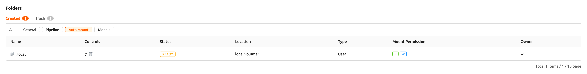

<a id="models"></a>

## Models


The Models tab facilitates straightforward model serving.
You can store the necessary data, including input data for [model serving](#model-serving) and training data, in the model folder.

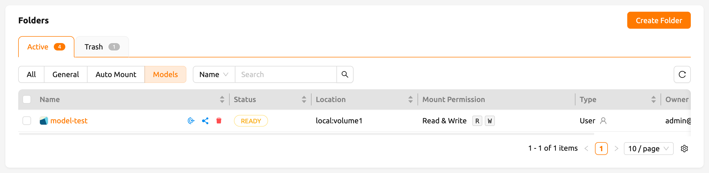