<a id="admin-menus"></a>

# 管理者メニュー

Logging in with an 管理者 account will reveal an extra Administration menu on the bottom left of the sidebar.
User information registered in Backend.AI is listed in the Users tab.
super-管理者 role ユーザー can see all ユーザーs' information, create and deactivate a ユーザー.

User ID (email), Name (ユーザーname), Role and Description(User Description) can be filtered by typing text in the
search box on each column header.


<a id="create-and-update-users"></a>

## ユーザーの作成と更新

A ユーザー can be created by clicking the '+Create User' button. Note that the password
must be longer or equal to 8 characters and at least 1 alphabet/special
character/ number should be included. The maximum length allowed for E-Mail and Username is 64.

同じメールアドレスまたはユーザー名のユーザーが既に存在する場合、ユーザーアカウントを作成することはできません。他のメールアドレスとユーザー名を試してください。

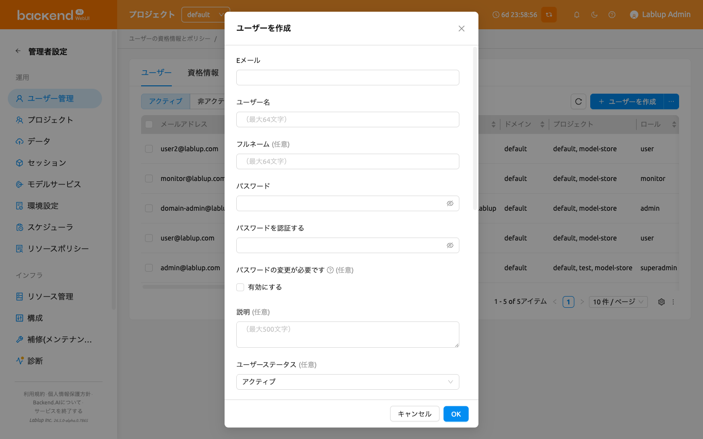

Check if the user is created.

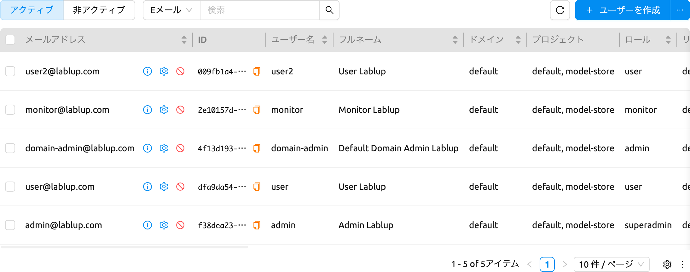

Click the green button in the Controls panel for more detailed user
information. You can also check the domain and project information where the
user belongs.

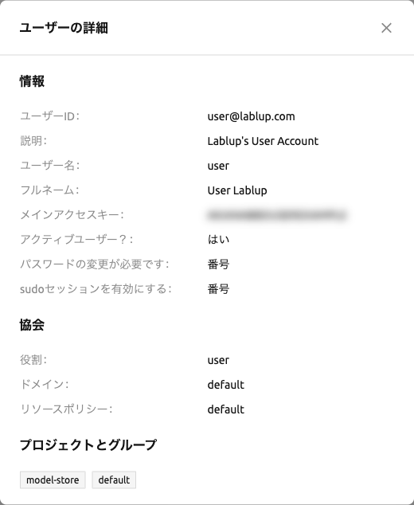

Click the 'Setting (Gear)' in the Controls panel to update information of a user who
already exists. User's name, password, activation state, etc. can be changed. User ID cannot be changed.

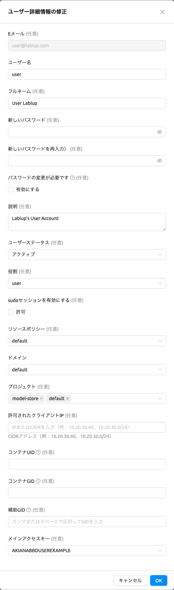

Each of the five items at the bottom of the dialog has the following functions.

- User Status: Indicates the user's status. Inactive users cannot log
  in. Before Verification is a status indicates that a user needs an additional
  step to activate the account such as email verification or an approval from an
  admin. Note that the inactive users are listed in the Inactive tab separately.

  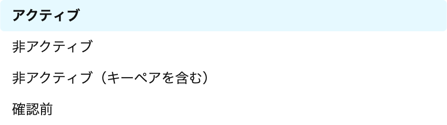

- Require password change?: If the admin has chosen random passwords while
  creating users in batches, this field can be set to ON to indicate that
  password change is required. The users will see the top bar that notify user
  to update their password, but this is a kind of descriptive flag which has no
  effect on actual use.
- Enable sudo session: Allow the user to use sudo in the compute session.
  This is useful when the user needs to install packages or run commands that
  require root privileges. However, it is not recommended to enable this option
  for all users, as it may cause security issues.
- 2FA Enabled: A flag indicating whether the user uses two-factor authentication.
  When using two-factor authentication, users are additionally required to enter an
  OTP code when logging in. Administrators can only disable two-factor authentication
  for other users.
- Resource Policy: From Backend.AI version 24.09, you can select the user resource policy
  to which the user belongs. For more information about user resource policies, please
  refer [user resource policy](#user-resource-policy) section.

<a id="inactivate-user-account"></a>

## Inactivate user account

Deleting user accounts is not allowed even for superadmins, to track usage
statistics per user, metric retention, and accidental account loss. Instead,
admins can inactivate user accounts to keep users from logging in. Click the
delete icon in the Controls panel. A popover asking confirmation appears, and
you can deactivate the user by clicking the Deactivate button.

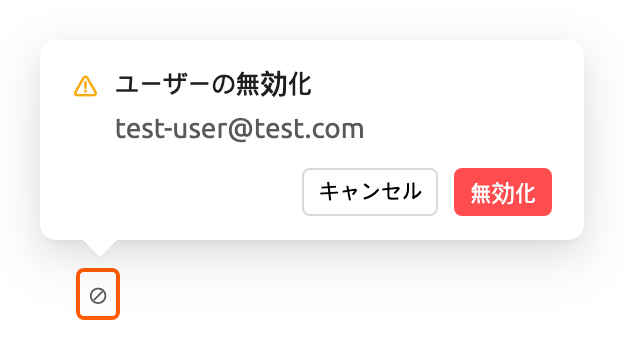

To re-activate users, go to Users - Inactive tab, and select the status of
the target user to `Active`.

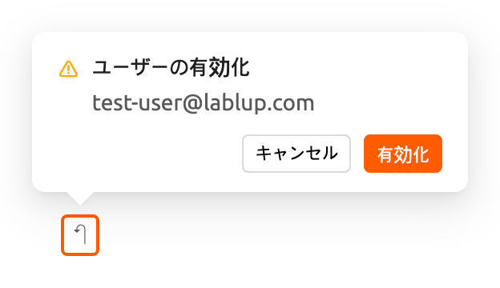

:::note
Please note that deactivating or reactivating the user does not change the user's credentials, since the user
account can have multiple keypairs, which brings it hard to decide which credential
should be reactivated.
:::

<a id="manage-users-keypairs"></a>

## Manage User's Keypairs

Each user account usually have one or more keypairs. A keypair is used for API
authentication to the Backend.AI server, after user logs in. Login requires
authentication via user email and password, but every request the user sends to
the server is authenticated based on the keypair.

A user can have multiple keypairs, but to reduce the user's burden of managing
keypairs, we are currently using only one of the user's keypairs to send requests.
Also, when you create a new user, a keypair is automatically created, so you do
not need to create and assign a keypair manually in most cases.

Keypairs can be listed on the Credentials tab of in the Users page. Active
keypairs are shown immediately, and to see the inactive keypairs, click the
Inactive panel at the bottom.

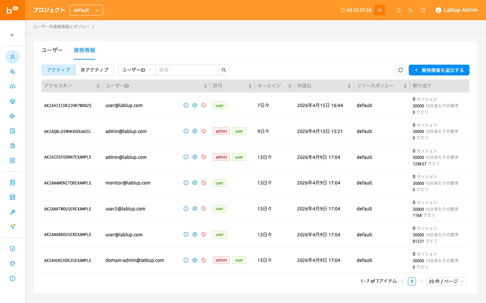

Like in Users tab, you can use the buttons in the Controls panel to view or
update keypair details. Click the green info icon button to see specific details of the keypair.
If necessary, you can copy the secret key by clicking the copy button.

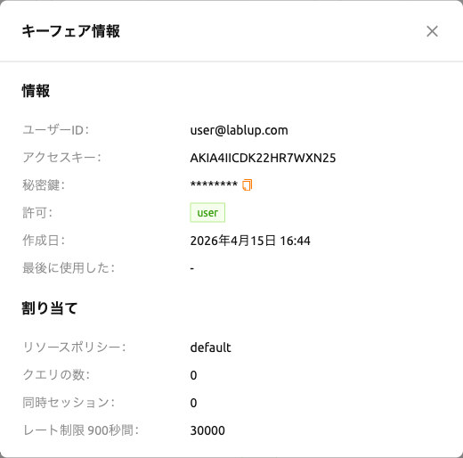

You can modify the resource policy and rate limit of the keypair by clicking the blue 'Setting (Gear)' button.
Please keep in mind that if the 'Rate Limit' value is small, API operations such as login may be blocked.

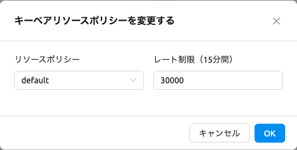

You can also deactivate or reactivate the keypair by clicking red 'Deactivate' button or black 'Activate' button in control column.
Unlike the User tab, the Inactive tab allows permanent deletion of key pairs.
However, you cannot permanently delete a key pair if it is currently being used as a user's main access key.

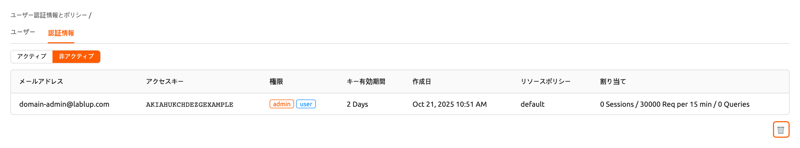

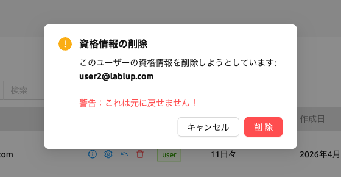

If you
accidentally deleted a keypair, you can re-create keypair for the user by
clicking the '+ ADD CREDENTIAL' button at the upper right corner.

The Rate Limit field is where you specify the maximum number of requests that
can be sent to the Backend.AI server in 15 minutes. For example, if set to 1000,
and the keypair sends more than 1000 API requests in 15 minutes, and the server
throws an error and does not accept the request. It is recommended to use the
default value and increase it when the API request frequency goes up high
according to the user's pattern.

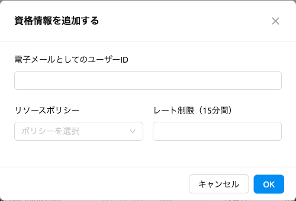

<a id="share-project-storage-folders-with-project-members"></a>

## Share project storage folders with project members

Backend.AI provides storage folders for projects, in addition to user's own
storage folder. A project storage folder is a folder belonging to a specific
project, not a specific user, and can be accessed by all users in that project.

:::note
Project folders can be created only by administrators. Normal users can only
access the contents of the project folder created by the administrator.
Depending on the system settings, project folders may not be allowed.
:::

First, log in with an admin account and create a project folder. After moving to
the Data page, click 'Create Folder' to open the folder creation dialog.
Enter the folder name, set the Type to Project. When the type is set to Project,
it will be automatically assigned to the project selected in the project selector in the header.
Permission is set to Read-Only.

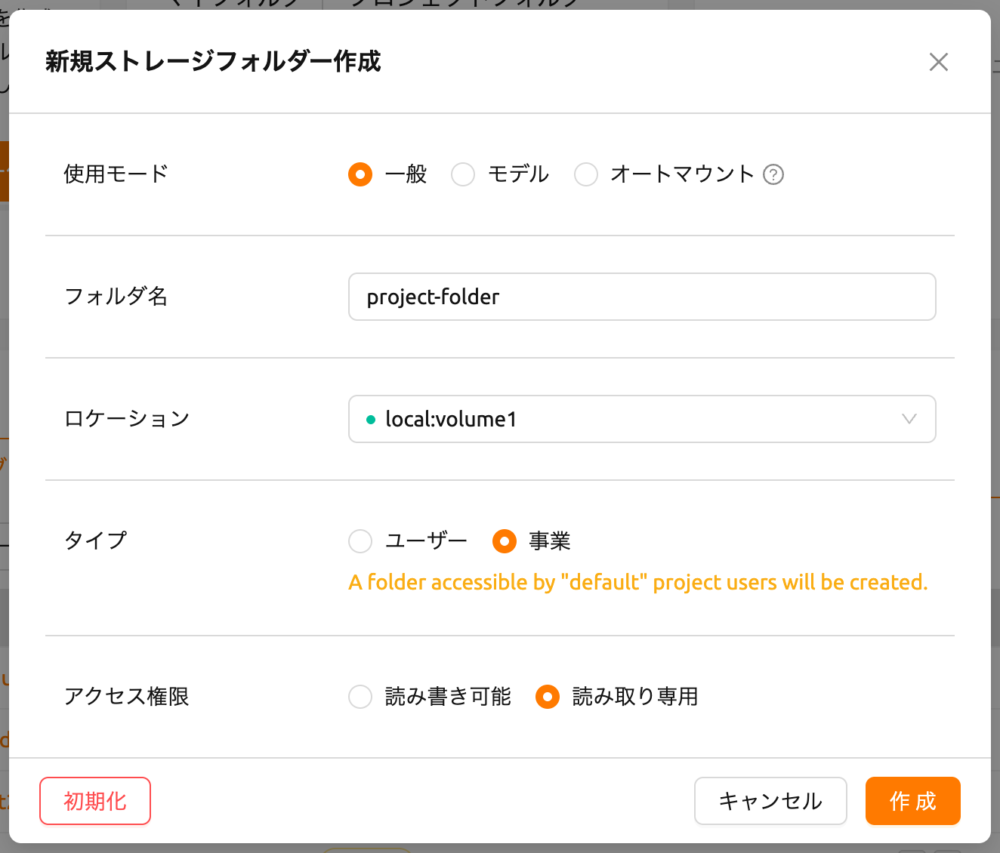

After confirming that the folder has been created, log in with the User B's
account and check that the project folder just created on the Data & Storage page
is displayed without any invitation procedure. You can see that R (Read Only) is
also displayed in the Permission panel.

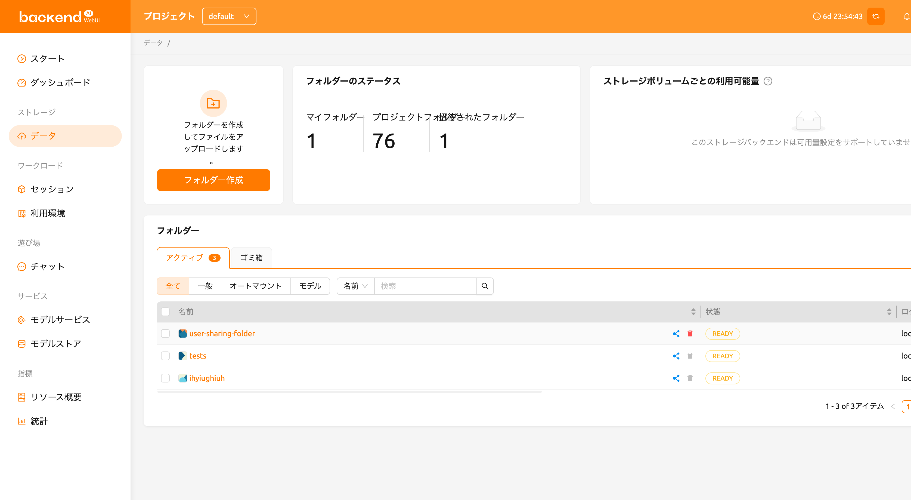

<a id="manage-models-cards"></a>

## モデルカードの管理

モデルストアのすべてのモデルカードはプロジェクト管理者によって管理されます。
model-definitionファイルとともにモデルストアをアップロードすると、プロジェクトのすべてのユーザーが
モデルカードにアクセスし、必要に応じて複製することができます。

以下はHugging Faceからモデルカードを追加する方法です。

:::note
モデルカードを作成する前に、Hugging Faceの特定のモデルへのアクセス権限が必要です。
詳細については、[Gated models](https://huggingface.co/docs/hub/models-gated) を参照してください。
:::

まず、プロジェクトを'model-store'に設定します。


データページに移動し、右側の「フォルダ作成」ボタンをクリックします。フォルダ名を入力し、
残りのフォルダ設定を以下のように構成します:

- 使用方式: Model
- タイプ: project
- 権限: Read-Write
- 複製可能: True

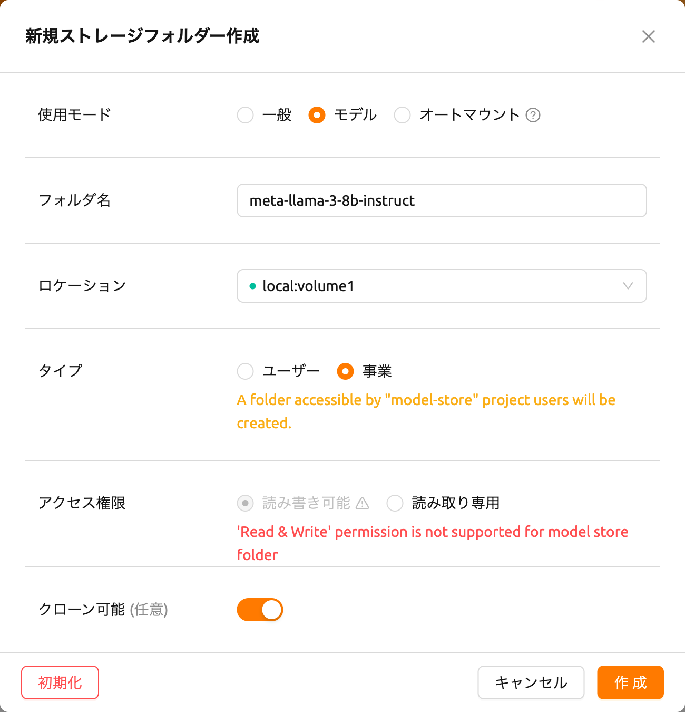

フォルダを作成した後、作成したフォルダにmodel-definition.yamlファイルを設定してアップロードする必要があります。
以下はmodel-definitionファイルの例です。
model-definitionファイルの作成方法の詳細については、
[モデル定義ガイド](#model-definition-guide) セクションを参照してください。

```yaml
models:
  - name: "Llama-3.1-8B-Instruct"
    model_path: "/models/Llama-3.1-8B-Instruct"
    service:
      pre_start_actions:
        - action: run_command
          args:
            command:
              - huggingface-cli
              - download
              - --local-dir
              - /models/Llama-3.1-8B-Instruct
              - --token
              - hf_****
              - meta-llama/Llama-3.1-8B-Instruct
      start_command:
        - /usr/bin/python
        - -m
        - vllm.entrypoints.openai.api_server
        - --model
        - /models/Llama-3.1-8B-Instruct
        - --served-model-name
        - Llama-3.1-8B-Instruct
        - --tensor-parallel-size
        - "1"
        - --host
        - "0.0.0.0"
        - --port
        - "8000"
        - --max-model-len
        - "4096"
    port: 8000
    health_check:
      path: /v1/models
      max_retries: 500
```

model-definitionファイルがアップロードされると、モデルストアページにモデルカードが表示されます。

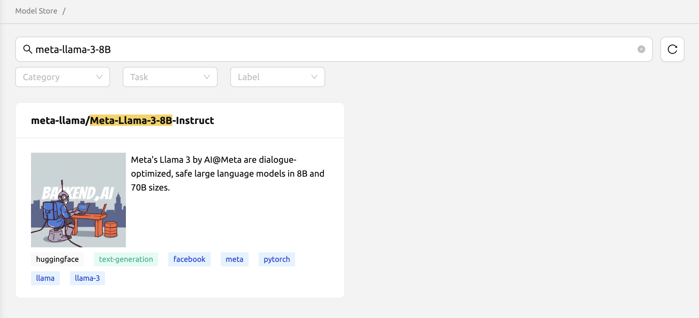

:::note
model-definitionファイルを設定した後、モデルを手動でダウンロードする必要があります。フォルダにモデルファイルをダウンロードするには、
セッション作成時にモデルフォルダをマウントし、[Downloading models](https://huggingface.co/docs/hub/models-downloading) を参照して
そこにファイルをダウンロードすることができます。
:::

作成したモデルカードをクリックすると、アップロードしたmodel-definitionファイルの詳細が表示されます。
これで、プロジェクトのすべてのメンバーがモデルカードにアクセスして複製できます。

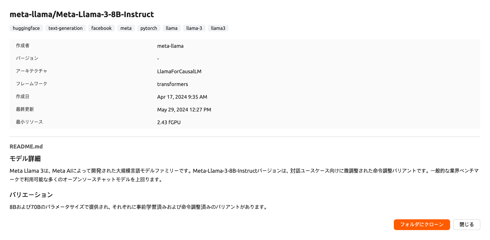

:::note
モデルカードの「このモデルを実行します」ボタンを有効にするには、フォルダに
`model-definition.yaml`と`service-definition.toml`の両方のファイルが存在する
必要があります。いずれかのファイルが不足している場合、ボタンは無効になります。
サービス定義ファイルの作成方法の詳細については、モデルサービスドキュメントの
[サービス定義ファイル](#service-definition-file)
セクションを参照してください。
:::

<a id="model-store-page"></a>

## モデルストアページ

モデルストアページは、管理者が事前に構成したモデルをユーザーが閲覧して活用できるページです。サイドバーからモデルストアページに移動すると、モデルストアプロジェクトに登録されたすべてのモデルカードを確認できます。

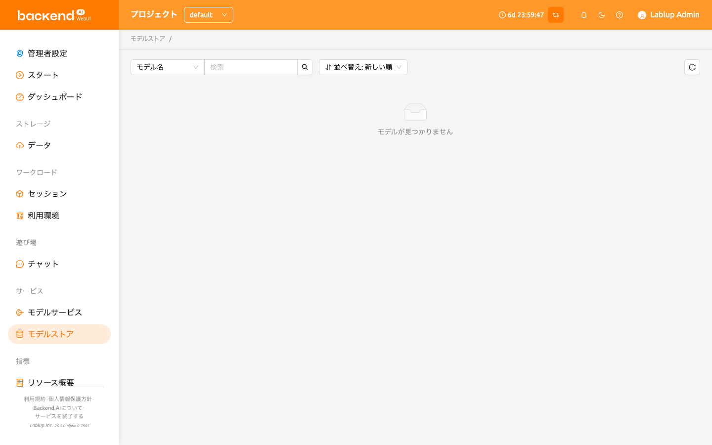

<!-- TODO: Capture screenshot of Model Store page showing model cards with buttons visible -->

各モデルカードには以下の主要な情報が表示されます：

- モデル名（フォルダ名）
- READMEの内容（フォルダにREADMEファイルがある場合）
- model-definition.yamlファイルのメタデータ
- モデルと対話するためのアクションボタン

モデルカードをクリックすると、READMEの全内容と利用可能なアクションを含む詳細ビューが開きます。


<!-- TODO: Capture screenshot of model card detail view showing README content and buttons -->

<a id="clone-to-folder"></a>

### フォルダにクローン

「フォルダにクローン」ボタンを使用すると、モデルストアフォルダの個人コピーを作成できます。モデルストアフォルダは読み取り専用でプロジェクト全体で共有されるため、ファイルを変更したりカスタムワークフローで使用するには、自分のストレージにクローンする必要があります。

モデルフォルダをクローンするには：

1. モデルカードの「フォルダにクローン」ボタンをクリックします
2. クローンダイアログで以下の設定を構成します：
   - **フォルダ名**: クローンするフォルダの名前です（デフォルトは元の名前にランダムなサフィックスが追加されます）
   - **権限**: クローンしたフォルダのアクセス権限を設定します（読み取り専用または読み書き）
   - **使用モード**: フォルダの種類を選択します（一般、モデル、または自動マウント）
3. 「クローン」ボタンをクリックしてクローンプロセスを開始します


<!-- TODO: Capture screenshot of clone folder dialog with field settings -->

:::note
現在、フォルダのクローンは同じストレージホスト内でのみサポートされています。
:::

クローンが完了すると、選択した使用モードに応じてデータページの該当タブに新しいフォルダが表示されます。

<a id="create-service-from-this-model"></a>

### このモデルからサービスを作成

「このモデルを実行します」ボタンを使用すると、モデルカードからワンクリックでモデルサービスを直接作成できます。この機能はモデルフォルダのクローンとモデルサービスエンドポイントの作成プロセスを自動化します。

:::note
このボタンを有効にするには、以下の条件を満たす必要があります：

- モデルフォルダに `model-definition.yaml` と `service-definition.toml` の両方のファイルが存在すること。いずれかのファイルが不足している場合、ボタンは無効になり、必要なファイルを示すツールチップが表示されます。
- モデルサービスを作成するための十分なリソースクォータがあること。
- リソースグループが推論セッションタイプを許可していること。
  :::

<a id="service-creation-workflow"></a>

#### サービス作成ワークフロー

「このモデルを実行します」ボタンをクリックすると、Backend.AIは以下のワークフローに従います：

1. **必要ファイルの確認**: フォルダにmodel-definition.yamlとservice-definition.tomlの両方が存在するか確認します

2. **フォルダのクローン（必要な場合）**: モデルフォルダのクローンがない場合：
   - フォルダをクローンするかどうかを尋ねる確認ダイアログが表示されます
   - フォルダは `{元の名前}-{ランダム4文字}` の形式の名前でクローンされます
   - 通知でクローンの進行状況が表示されます


<!-- TODO: Capture screenshot of clone confirmation dialog before service creation -->

3. **サービスの作成**: フォルダの準備ができたら（以前のクローンまたは新しいクローンから）：
   - service-definition.tomlの設定を使用してサービスが自動的に作成されます
   - 通知でサービス作成の進行状況が表示されます
   - 通知をクリックするとモデルサービスページに移動できます

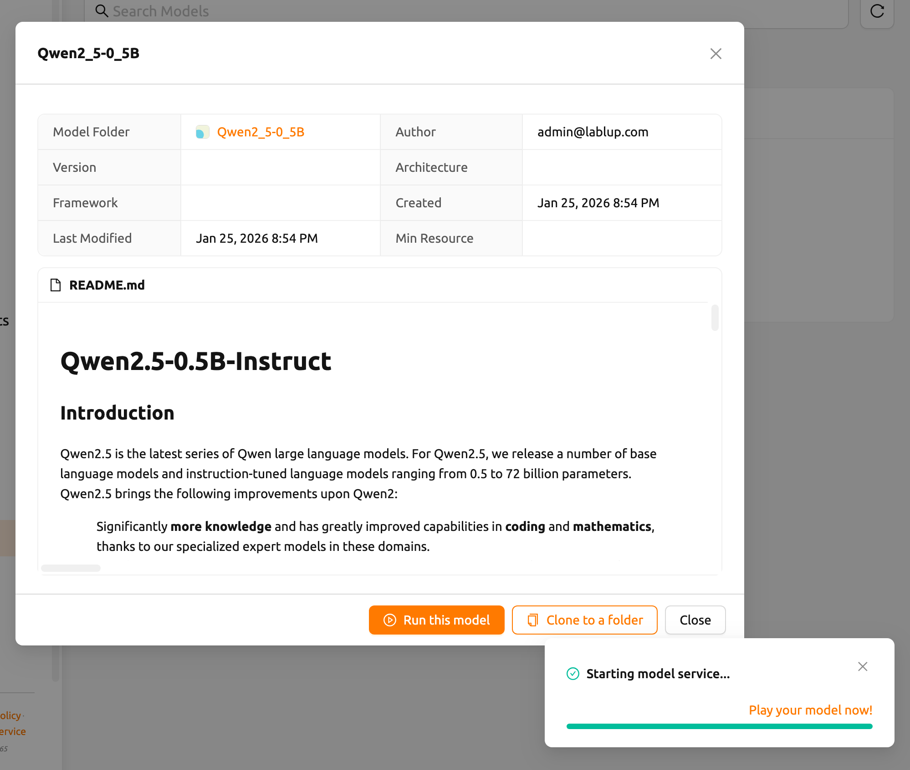

<!-- TODO: Capture screenshot of service creation progress notification -->

4. **サービス詳細の確認**: 作成が完了したら、モデルサービスページに移動してエンドポイントの詳細を確認し、サービスの状態を監視し、サービスを管理できます


<!-- TODO: Capture screenshot of completed service in Model Serving page -->

:::note
以前の操作でクローンしたフォルダがすでに存在する場合、システムはそのフォルダを
自動的に使用してサービスを作成します。将来のリリースでは、複数のコピーがある場合に
どのクローンフォルダを使用するか選択できるようになる予定です。
:::

<a id="troubleshooting"></a>

#### トラブルシューティング

サービスの作成に失敗した場合：

- model-definition.yamlとservice-definition.tomlのフォーマットが正しいか確認してください
- リソースクォータが新しいモデルサービスの作成を許可しているか確認してください
- モデルサービスページでサービスステータスのエラーメッセージを確認してください
- 詳細なトラブルシューティング手順については、[モデルサービス](#model-serving) ドキュメントを参照してください

モデルサービス、サービス構成、エンドポイント管理の詳細については、[モデルサービス](#model-serving) ドキュメントを参照してください。

<a id="manage-resource-policy"></a>

## Manage Resource Policies

<a id="keypair-resource-policy"></a>

#### Keypair Resource Policy

In Backend.AI, administrators have the ability to set limits on the total resources available for each keypair, user, and project.
Resource policies enable you to define the maximum allowed resources and other compute session-related settings.
Additionally, it is possible to create multiple resource policies for different needs,
such as user or research requirements, and apply them on an individual basis.

The Resource Policies page allows administrators to view a list of all registered resource policies.
Administrators can review the resource policies established for keypairs, users, and projects directly on this page.
Let's begin by examining the resource policies for keypairs. In the figure below, there are
three policies in total (gardener, student, default). The infinity symbol (∞)
indicates that no resource restrictions have been applied to those resources.

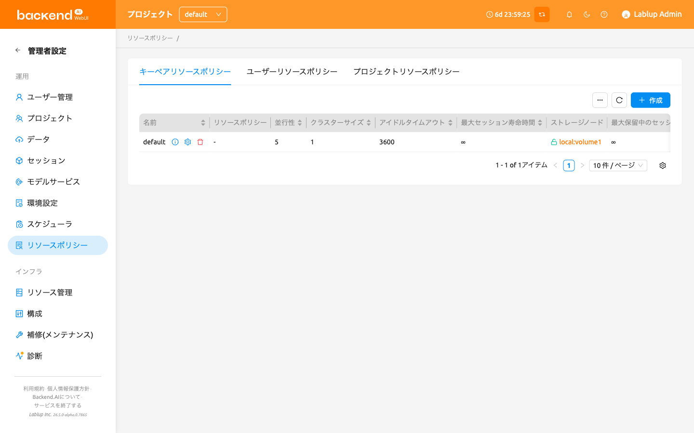

The user account being used in this guide is currently assigned to the default
resource policy. This can be verified in the Credentials tab on the Users page.
You can also confirm that all resource policies are set to default in the Resource Policies panel.

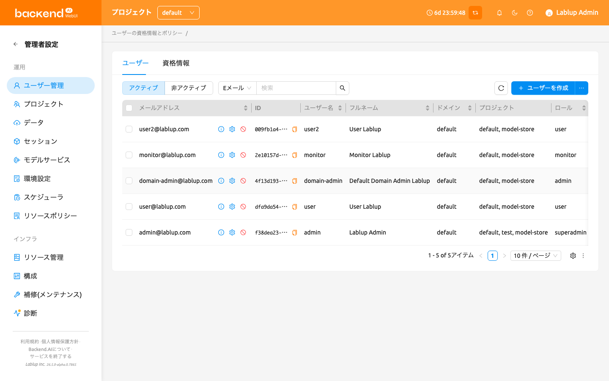

To modify resource policies, click the 'Setting (Gear)' in the Control column of the
default policy group. In the Update Resource Policy dialog, every option is
editable except for Policy Name, which serves as the primary key for
distinguishing resource policies in the list. Uncheck the Unlimited checkbox
at the bottom of CPU, RAM, and fGPU, and set the resource limits to the desired
values. Ensure that the allocated resources are less than the total hardware
capacity. In this case, set CPU, RAM, and fGPU to 2, 4, and 1 respectively.
Click the OK button to apply the updated resource policy.

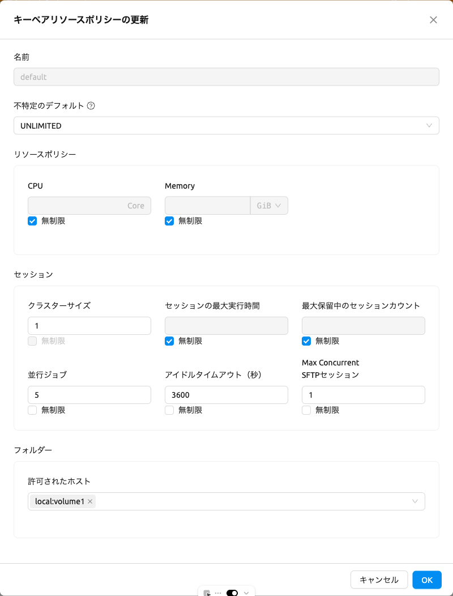

About details of each option in resource policy dialog, see the description below.

- Resource Policy
  - CPU: Specify the maximum amount of CPU cores. (max value: 512)
  - Memory: Specify the maximum amount of memory in GB. It would be good practice
    to set memory twice as large as the maximum value of GPU memory. (max value: 1024)
  - CUDA-capable GPU: Specify the maximum amount of physical GPUs. If fractional GPU
    is enabled by the server, this setting has no effect. (max value: 64)
  - CUDA-capable GPU (fractional): Fractional GPU (fGPU) is literally split a single
    GPU to multiple partitions in order to use GPU efficiently. Notice that the minimum
    amount of fGPU required is differed by each image. If fractional GPU is not enabled
    by the server, this settings has no effect. (max value: 256)

- Sessions
  - Cluster Size: Set the maximum limit for the number of multi-containers or
    multi-nodes that can be configured when creating a session.
  - Session Lifetime (sec.): Limits the maximum lifetime of a compute session
    from the reservation in the active status, including `PENDING` and
    `RUNNING` statuses. After this time, the session will be force-terminated
    even if it is fully utilized. This will be useful to prevent the session
    from running indefinitely.
  - Max Pending Session Count: Maximum number of compute sessions that can be in
    the `PENDING` status simultaneously.
  - Concurrent Jobs: Maximum number of concurrent compute session per keypair.
    If this value is set to 3, for example, users bound to this resource policy
    cannot create more than 3 compute sessions simultaneously. (max value: 100)
  - Idle timeout (sec.): Configurable period of time during which the user can
    leave their session untouched. If there is no activity at all on a
    compute session for idle timeout, the session will be garbage collected
    and destroyed automatically. The criteria of the "idleness" can be
    various and set by the administrators. (max value: 15552000 (approx. 180 days))
  - Max Concurrent SFTP Sessions: Maximum number of concurrent SFTP sessions.

- Folders
  - Allowed hosts: Backend.AI supports many NFS mountpoint. This field limits
    the accessibility to them. Even if a NFS named "data-1" is mounted on
    Backend.AI, users cannot access it unless it is allowed by resource policy.
  - (Deprecated since 23.09.4) Max. #: the maximum number of storage folders that
    can be created/invited. (max value: 100).

In the keypair resource policy list, check that the Resources value of the default
policy has been updated.

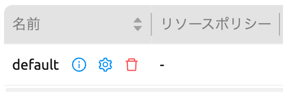

You can create a new resource policy by clicking the '+ Create' button. Each setting
value is the same as described above.

To create a resource policy and associate it with a keypair, go to the
Credentials tab of the Users page, click the gear button located in the
Controls column of the desired keypair, and click the Select Policy field to
choose it.

You can also delete each of resource keypairs by clicking trash can icon
in the Control column. When you click the icon, the confirmation popup will appears.
Click 'Delete' button to erase."

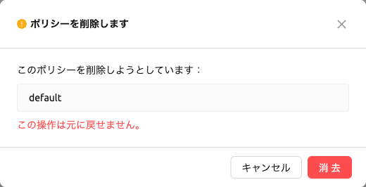

:::note
If there's any users (including inactive users) following a resource policy to be deleted,
deletion may not be done. Before deleting a resource policy, please make sure that
no users remain under the resource policy.
:::

If you want to hide or show specific columns, click the 'Setting (Gear)' at the bottom right of the
table. This will bring up a dialog where you can select the columns you want to display.

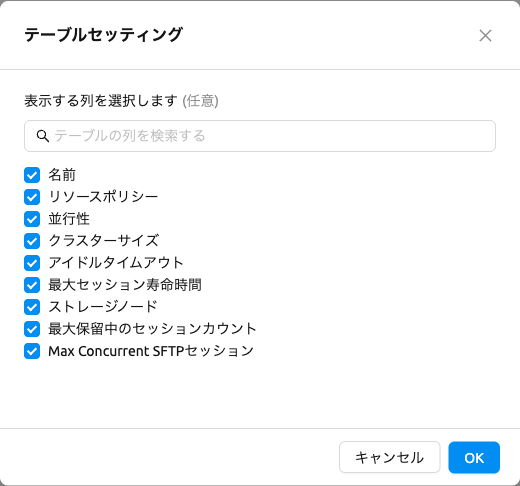

<a id="user-resource-policy"></a>

#### User Resource Policy

Starting from version 24.03, Backend.AI supports user resource policy management. While each
user can have multiple keypairs, a user can only have one user resource policy. In the user
resource policy page, users can set restrictions on various settings related to folders such as
Max Folder Count and Max Folder Size, as well as individual resource limits like Max Session
Count Per Model Session and Max Customized Image Count.

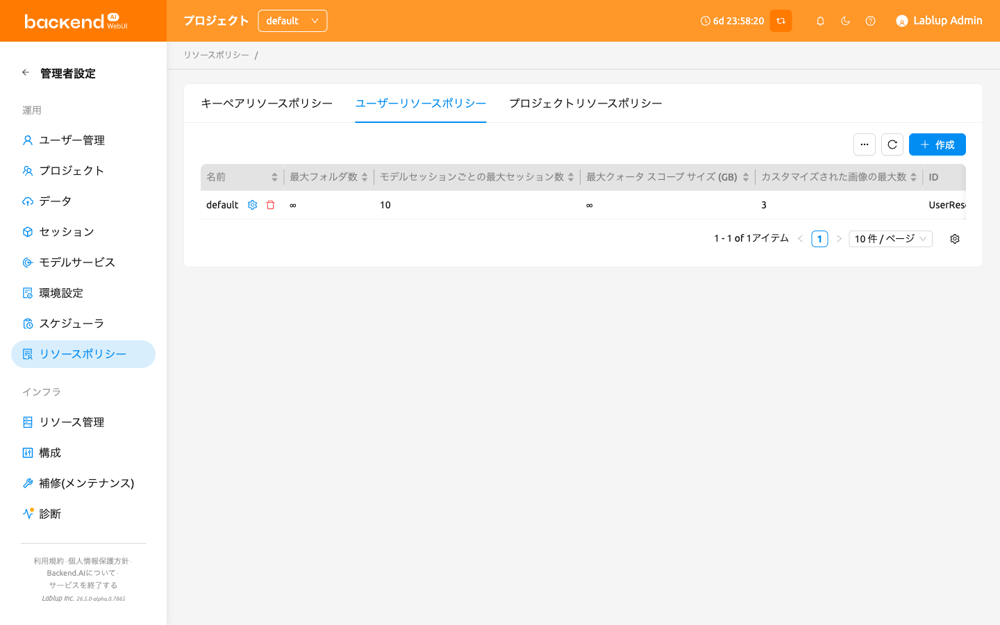

To create a new user resource policy, click the Create button.

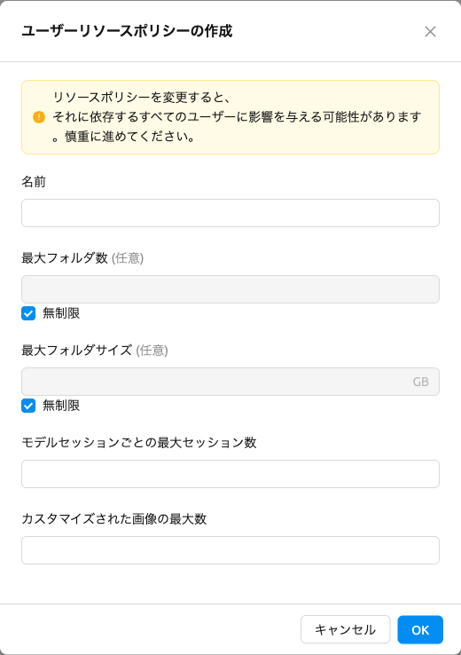

- Name: The name of the user resource policy.
- Max Folder Count: The maximum number of folders that the user can create.
  If the user's folder count exceeds this value, user cannot create a new folder.
  If set to Unlimited, it is displayed as "∞".
- Max Folder Size: The maximum size of the user's storage space. If
  user's storage space exceeds this value, user cannot create a new data
  folder. If set to Unlimited, it is displayed as "∞".
- Max Session Count Per Model Session: The maximum number of available sessions per model
  service created by a user. Increasing this value can put a heavy load on the session
  scheduler and potentially lead to system downtime, so please caution when
  adjusting this setting.
- Max Customized Image Count: The maximum number of customized images that
  user can create. If user's customized image count exceeds this value,
  user cannot create a new customized image. If you want to know more about customized
  images, please refer to the [My Environments](#my-environments) section.

To update, click the 'Setting (Gear)' button in the control column. To delete, click the trash can
button.

:::note
Changing a resource policy may affect all users who use that policy, so use
it with caution.
:::

Similar to keypair resource policy, users can select and display only columns users want by
clicking the 'Setting (Gear)' button at the bottom right of the table.

<a id="project-resource-policy"></a>

#### Project Resource Policy

Starting from version 24.03, Backend.AI supports project resource policy management. Project
resource policies manage storage space (quota) and folder-related limitations for projects.

When clicking the Project tab of the Resource Policies page, you can see the list of project
resource policy.

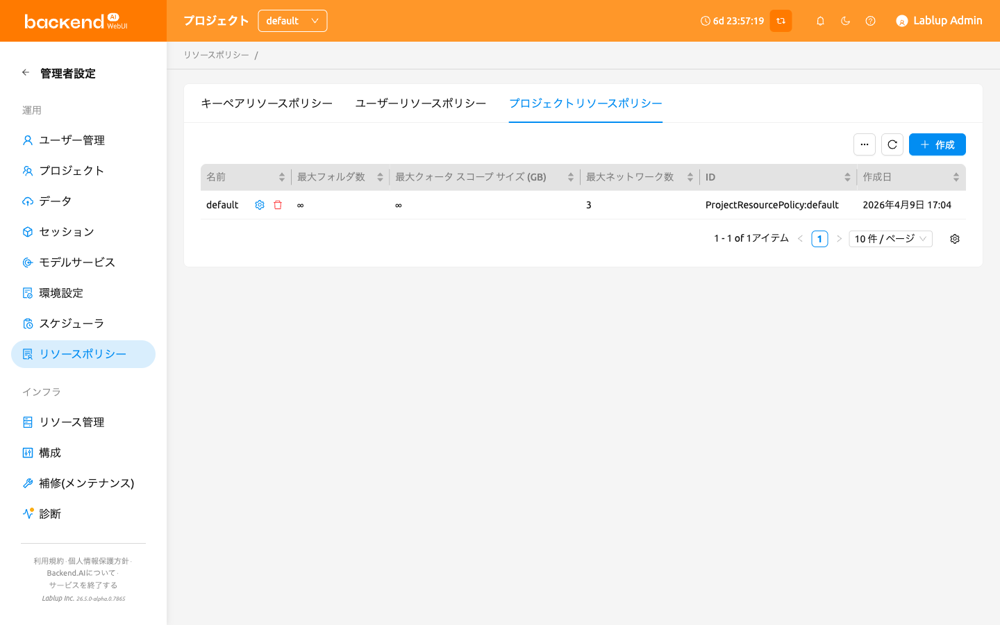

To create a new project resource policy, click the '+ Create' button at the top right of the table.

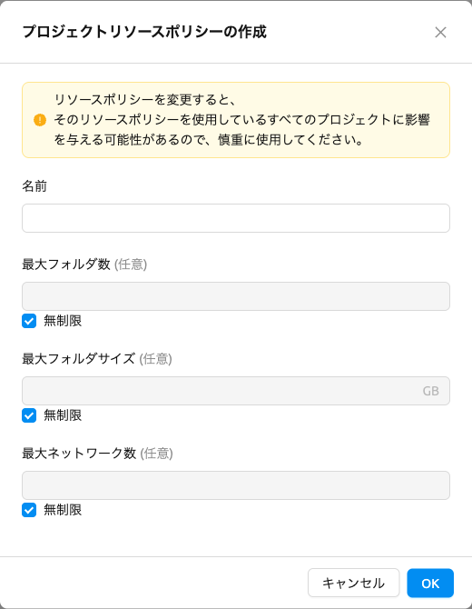

- Name: The name of the project resource policy.
- Max Folder Count: The maximum number of project folders that an administrator can create.
  If the project folder count exceeds this value, the administrator will not be able to create
  a new project folder. If set to Unlimited, it will be displayed as "∞".
- Max Folder Size: The maximum size of the project's storage space. If the project's storage
  space exceeds this value, the administrator cannot create a new project folder. If set to
  Unlimited, it is displayed as "∞".
- Max Network Count: The maximum number of networks that can be created for the project since Backend.AI version 24.12. If set to Unlimited, it is displayed as "∞".

The meaning of each field is similar to the user resource policy. The difference is that the
project resource policy is applied to the project folders, while the user resource policy is
applied to the user folders.

If you want to make changes, click the 'Setting (Gear)' button in the control column. Resource policy
names cannot be edited. Deletion can be done by clicking the trash can icon button.

:::note
Changing a resource policy may affect all users who use that policy,
so use it with caution.
:::

You can select and display only the columns you want by clicking the 'Setting (Gear)' button at the
bottom right of the table.

To save the current resource policy as a file, click on the 'Tools' menu located at the top left of each tab. Once you click the menu, download dialog will appear.

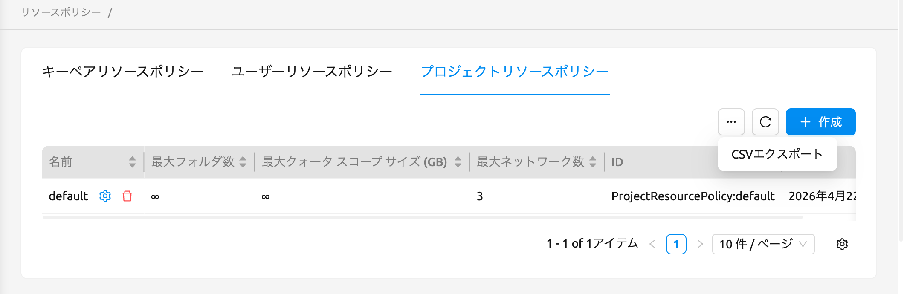

<a id="unified-view-for-pending-sessions"></a>

## ペンディングセッションの統合ビュー

Backend.AIバージョン25.13.0以降、管理者メニューでペンディングセッションの統合ビューが利用可能です。
Admin Sessionページでは、選択したリソースグループ内のすべてのペンディングセッションを
一覧で確認できます。ステータスの横に表示されるインデックス番号は、十分なリソースが
確保された際にセッションが作成されるキューの位置を示しています。

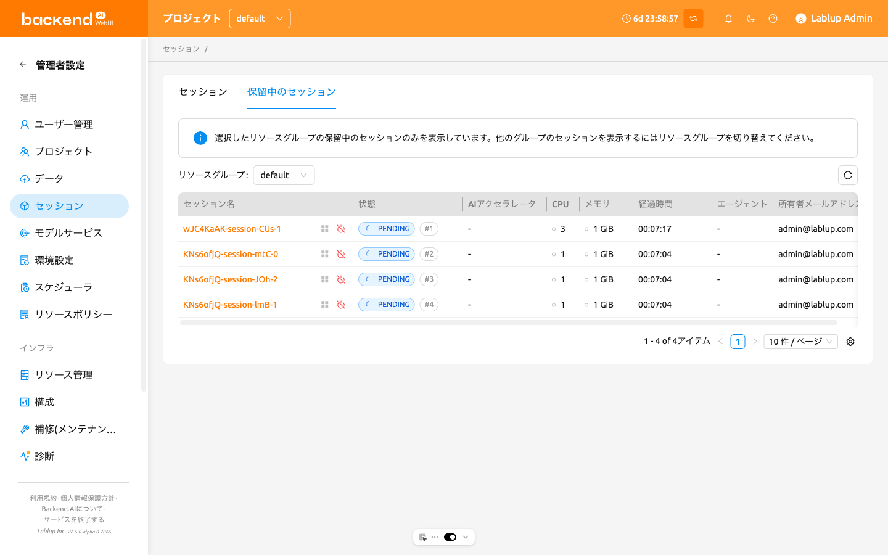

セッションページと同様に、セッション名をクリックすると、セッションの詳細情報を
表示するドロワーが開きます。

<a id="manage-images"></a>

## フェアシェアスケジューラ

Backend.AIコアバージョン26.2.0以降で、フェアシェアスケジューラページがAdministration
メニューから利用可能です。この機能により、管理者はリソースグループ、ドメイン、
プロジェクト、ユーザーの階層構造に基づいてフェアシェアスケジューリングの重みを
管理できます。

フェアシェアスケジューリングは、過去の使用パターンに基づいてコンピューティングリソースを
配分し、ユーザー間でリソースが公平に分配されるようにします。過去にリソースの使用が
少なかったユーザーはスケジューリング優先度が高くなり、多く使用したユーザーは優先度が
低くなります。管理者は階層構造の各レベルで重みを調整することで、この動作を
細かく制御できます。

:::note
フェアシェアスケジューラは、リソースグループのスケジューラタイプが`FAIR_SHARE`に
設定されている場合にのみ使用できます。リソースグループのスケジューラタイプの設定に
ついては、リソースグループの管理セクションを参照してください。
:::

この機能にアクセスするには、サイドバーのAdministrationセクションでSchedulerメニュー項目を
クリックします。ページにはフェアシェア設定タブと4段階のドリルダウンインターフェースが
表示されます。

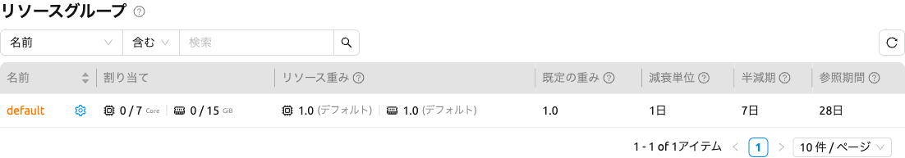

ページは以下の4つの階層的なステップで構成されています：

1. **リソースグループ**: 各リソースグループのフェアシェアの主要パラメータを設定します
2. **ドメイン**: リソースグループ内のドメインごとに重みを設定します
3. **プロジェクト**: ドメイン内のプロジェクトごとに重みを設定します
4. **ユーザー**: プロジェクト内の個々のユーザーに重みを設定します

ページ上部のステップインジケーターバーは、階層構造での現在の位置を表示します。
完了したステップには選択した項目の名前が表示されます。完了したステップをクリックすると
そのレベルに戻ることができます。


選択したリソースグループのスケジューラタイプが`FAIR_SHARE`に設定されていない場合、
そのリソースグループでフェアシェアスケジューラが有効になっていないことを示す警告
アラートが表示されます。


各ステップで以下の共通機能が利用可能です：

- **フィルタリング**: プロパティベースの検索フィルタを使用して、名前で結果を絞り込めます。ユーザーステップでは、メールアドレスとアクティブ状態による追加フィルタが利用できます。
- **ソート**: カラムヘッダーをクリックして、そのカラムでテーブルをソートできます。
- **ページネーション**: ページサイズを設定して結果をナビゲートできます。
- **自動リフレッシュ**: データは7秒ごとに自動更新されます。手動リフレッシュボタンも利用可能です。

### リソースグループ

リソースグループステップでは、すべてのリソースグループとそのフェアシェア設定がテーブルで
表示されます。


テーブルには以下のカラムが含まれます：

- **名前**: リソースグループ名です。名前をクリックすると、そのリソースグループのドメインレベル設定にドリルダウンします。
- **制御**: リソースグループのフェアシェア設定モーダルを開く設定（歯車）ボタンです。
- **割り当て**: リソースグループに割り当てられた各リソースタイプの使用量/容量を表示します（例：CPU、Memory、CUDA GPU）。
- **リソース重み**: リソースタイプごとの重みです。デフォルトの重みを使用している場合は「デフォルト」と表示されます。
- **既定の重み**: 重みが指定されていないドメイン、プロジェクト、ユーザーに適用されるデフォルト値です。
- **減衰単位**: 使用量を集計する期間（日単位）です。
- **半減期**: 使用量の反映率が半分になる期間（日単位）です。
- **参照期間**: Fair Share計算に反映される利用履歴の範囲（日単位）です。

### リソースグループのフェアシェア設定

リソースグループの制御カラムにある設定（歯車）ボタンをクリックすると、フェアシェア設定
モーダルが開きます。

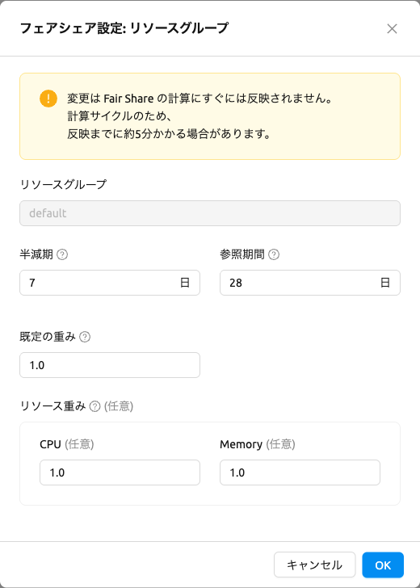

:::warning
変更はFair Shareの計算にすぐには反映されません。計算サイクルのため、反映までに
約5分かかる場合があります。
:::

モーダルには以下のフィールドが含まれます：

- **リソースグループ**: リソースグループ名を表示する読み取り専用フィールドです。
- **半減期**: 使用量の反映率が半分になる期間で、日数で指定します（最小1）。例えば7日に設定すると、7日前の使用量は50%、14日前の使用量は25%として計算されます。減衰単位の倍数に設定することを推奨します。
- **参照期間**: Fair Share計算に反映される利用履歴の範囲で、日数で指定します（最小1）。これより前の利用は計算から除外されます。半減期の倍数に設定することを推奨します。
- **既定の重み**: 重みが指定されていないドメイン、プロジェクト、ユーザーに適用されるデフォルト値です（最小1、ステップ0.1）。
- **リソース重み**: リソースタイプごとの重み（例：CPU、Memory、GPU）で、それぞれ最小値1、ステップ0.1です。このセクションはリソースグループにリソース重みが存在する場合にのみ表示されます。

### ドメイン

リソースグループを選択すると、ドメインステップでそのリソースグループ内のドメインの
フェアシェア重みと使用量がテーブルで表示されます。

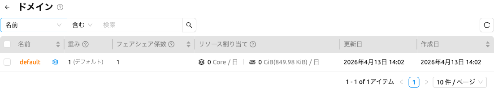

テーブルには以下のカラムが含まれます：

- **名前**: ドメイン名です。名前をクリックすると、そのドメインのプロジェクトレベル設定にドリルダウンします。
- **制御**: 重み設定モーダルを開く設定（歯車）ボタンです。
- **重み**: 現在の重み値です。デフォルトの重みを使用している場合は「デフォルト」と表示されます。
- **フェアシェア係数**: フェアシェアスケジューラによって算出されたスケジューリング優先度です。値が大きいほど優先度が高くなります。
- **リソース割り当て**: リソースタイプごとの1日あたりの平均減衰リソース使用量です（CPU、Memory、GPU / Day）。
- **更新日時**: 最終更新のタイムスタンプです。
- **作成日時**: 作成のタイムスタンプです。

テーブル左側のチェックボックスを使用して複数の行を選択できます。行が選択されると、
2つの追加ボタンが表示されます：

- **利用グラフ**（チャートアイコン）：選択した項目の利用履歴モーダルを開きます。
- **一括編集**（歯車アイコン）：選択したすべての項目の重みを一括で編集するモーダルを開きます。

### プロジェクト

ドメインを選択すると、プロジェクトステップでドメインステップと同じカラム構造の
プロジェクトテーブルが表示されます。プロジェクト名をクリックするとユーザーステップに
ドリルダウンします。

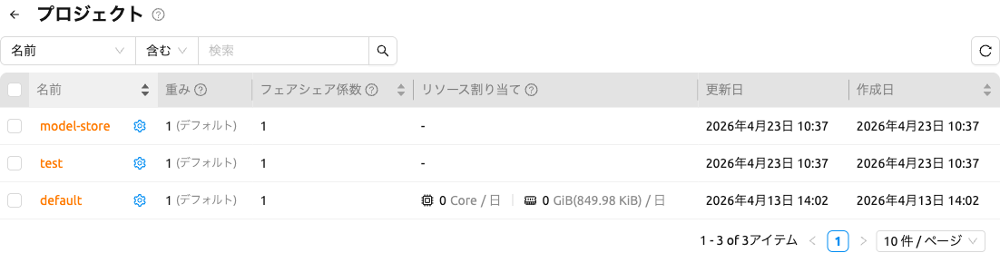

行を選択した場合、同じ一括操作（利用グラフおよび一括編集）が利用可能です。

### ユーザー

プロジェクトを選択すると、ユーザーステップで個々のユーザーのフェアシェア重みと
使用量がテーブルで表示されます。

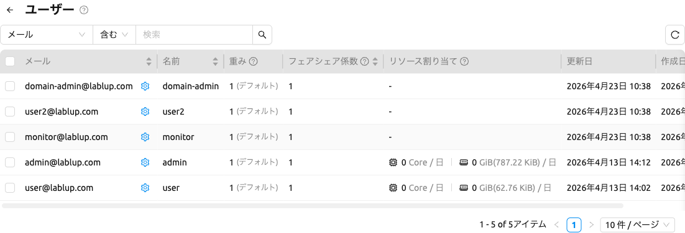

テーブルには以下のカラムが含まれます：

- **メール**: ユーザーのメールアドレスです。
- **名前**: ユーザーの名前です。
- **制御**: 重み設定モーダルを開く設定（歯車）ボタンです。
- **重み**: 現在の重み値です。デフォルトの重みを使用している場合は「デフォルト」と表示されます。
- **フェアシェア係数**: フェアシェアスケジューラによって算出されたスケジューリング優先度です。
- **リソース割り当て**: リソースタイプごとの1日あたりの平均減衰リソース使用量です。
- **更新日時**: 最終更新のタイムスタンプです。
- **作成日時**: 作成のタイムスタンプです。

:::note
ユーザーステップでは、メール、名前、アクティブ状態による追加フィルタが利用可能です。
:::

行を選択した場合、同じ一括操作（利用グラフおよび一括編集）が利用可能です。

### フェアシェア重みの編集

ドメイン、プロジェクト、またはユーザーのフェアシェア重みを編集するには、対象の行の
制御カラムにある設定（歯車）ボタンをクリックします。重み設定モーダルが開きます。

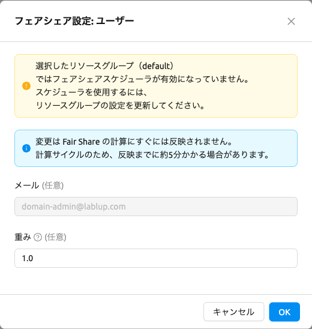

:::warning
変更はFair Shareの計算にすぐには反映されません。計算サイクルのため、反映までに
約5分かかる場合があります。
:::

単一編集モードでは、モーダルにエンティティ名（読み取り専用）と重み入力フィールドが
表示されます。

- **重み**: Fair Shareスケジューリングの優先度を決定する基本倍率です。値が大きいほど優先度が高くなります。デフォルトは「1.0」です。重み「2.0」は「1.0」の2倍の優先度です。最小値は1、ステップは0.1です。

複数の項目の重みを一括で編集するには、テーブルのチェックボックスで対象の行を選択し、
一括編集（歯車アイコン）ボタンをクリックします。一括編集モードでは、モーダルに選択した
すべてのエンティティのタグリストと、すべてに適用される単一の重み入力フィールドが
表示されます。

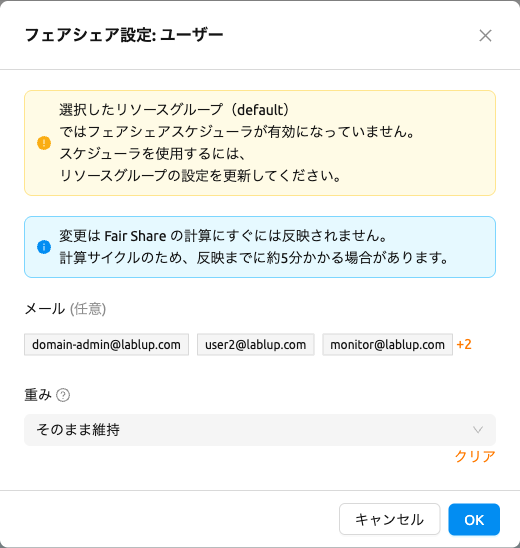

:::note
選択したリソースグループのスケジューラタイプが`FAIR_SHARE`に設定されていない場合、
モーダルに警告アラートが表示されます。
:::

### 利用履歴の表示

ドメイン、プロジェクト、またはユーザーの利用履歴を表示するには、テーブルの
チェックボックスで対象の行を選択し、利用グラフ（チャートアイコン）ボタンをクリック
します。利用履歴モーダルが開きます。

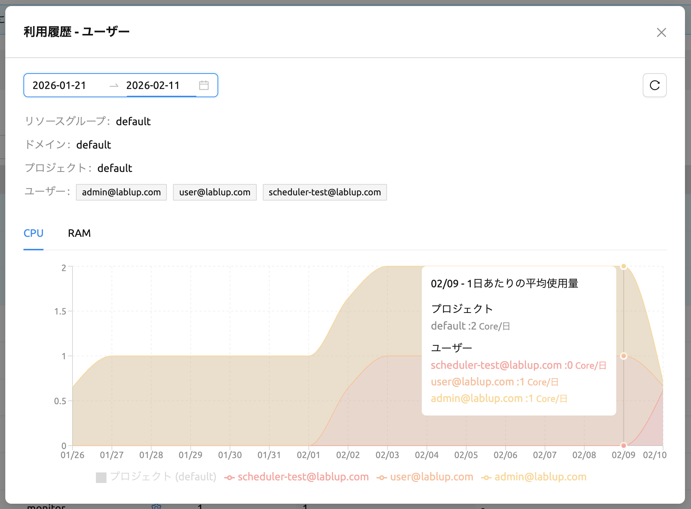

モーダルには以下が表示されます：

- **日付範囲ピッカー**: 利用履歴の日付範囲を選択します。過去7日間、過去30日間、過去90日間のプリセットが利用可能です。
- **リフレッシュボタン**: 利用データを手動で更新します。
- **コンテキスト情報**: 現在のステップに応じて、リソースグループ、ドメイン、プロジェクトの情報が表示されます。
- **選択されたエンティティ**: 選択した項目の名前がタグとして表示されます。
- **利用チャート**: 選択した期間の1日あたりの平均リソース使用量を示すチャートです。

<a id="manage-images"></a>

## Manage Images

Admins can manage images, which are used in creating a compute session, in the
Images tab of the Environments page. In the tab, meta information of all images
currently in the Backend.AI server is displayed. You can check information such
as registry, namespace, image name, image's based OS, digest, and minimum
resources required for each image. For images downloaded to one or more agent
nodes, there will be a `installed` tag in each Status column.

:::note
The feature to install images by selecting specific agents is currently
under development.
:::

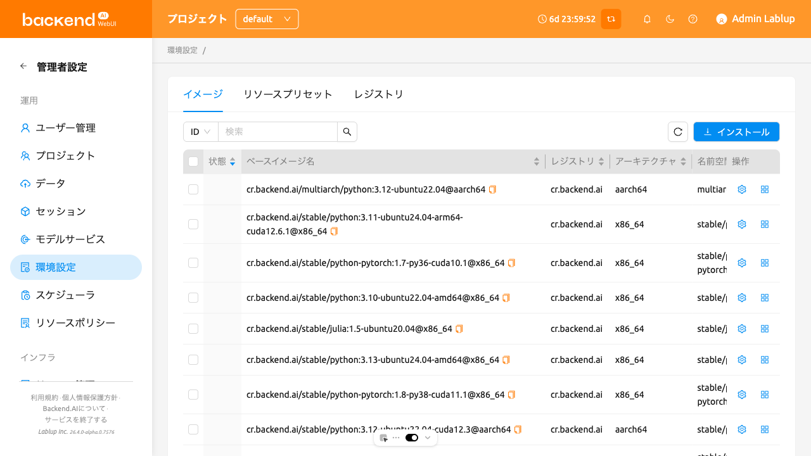

You can change the minimum resource requirements for each image by clicking the
'Setting (Gear)' in the Controls panel. Each image has hardware and resource
requirements for minimal operation. (For example, for GPU-only images, there
must be a minimum allocated GPU.) The default value for the minimum resource
amount is provided as embedded in the image's metadata. If an attempt is made to
create a compute session with a resource that is less than the amount of
resources specified in each image, the request is automatically adjusted to the
minimum resource requirements for the image and then generated, not cancelled.

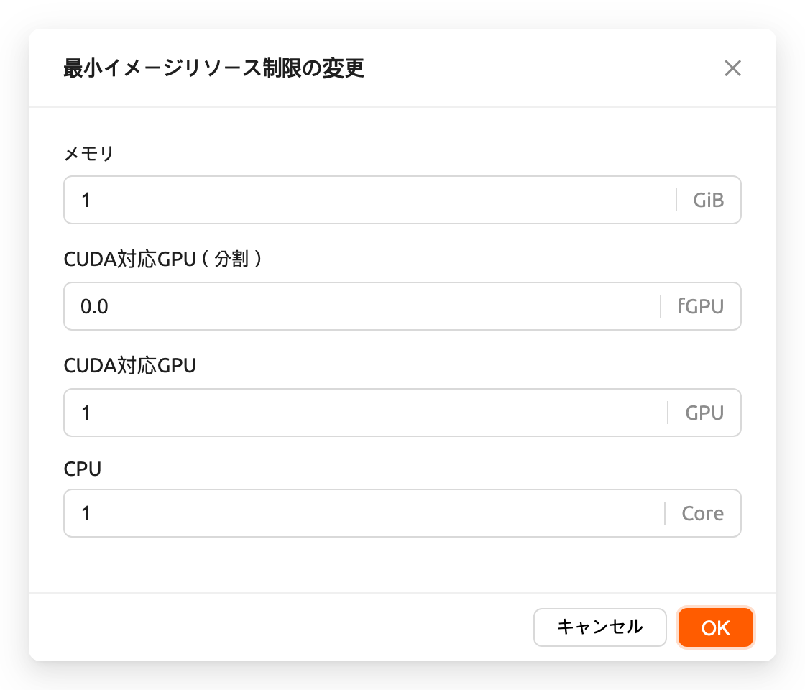

:::note
Don't change the minimum resource requirements to an amount less than the
predefined value! The minimum resource requirements included in the image
metadata are values that have been tested and determined. If you are not
really sure about the minimum amount of resources you want to change, leave
it in the default.
:::

Additionally, you can add or modify the supported apps for each image by clicking the 'Apps' icon located in the Controls column.
Once you click the icon, the name of the app and its corresponding port number will be displayed accordingly.

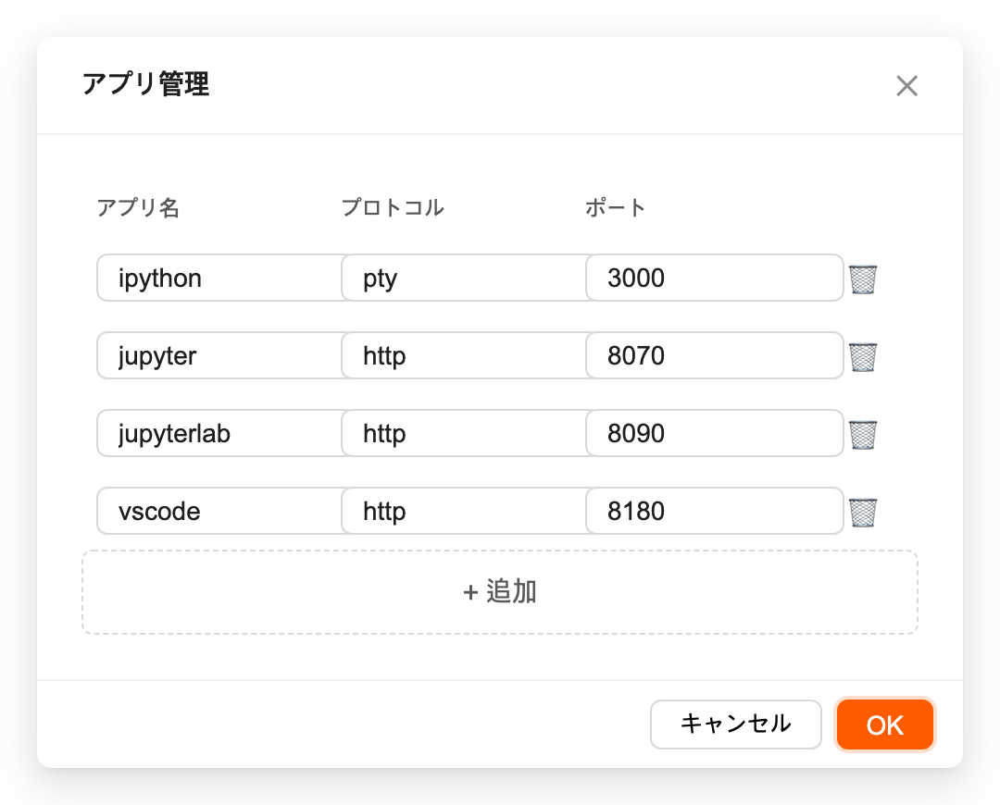

In this interface, you can add supported custom applications by clicking the '+ Add' button below. To delete an application, simply click the 'red trash can' button on the right side of each row.

:::note
You need to reinstall the image after changing the managed app.

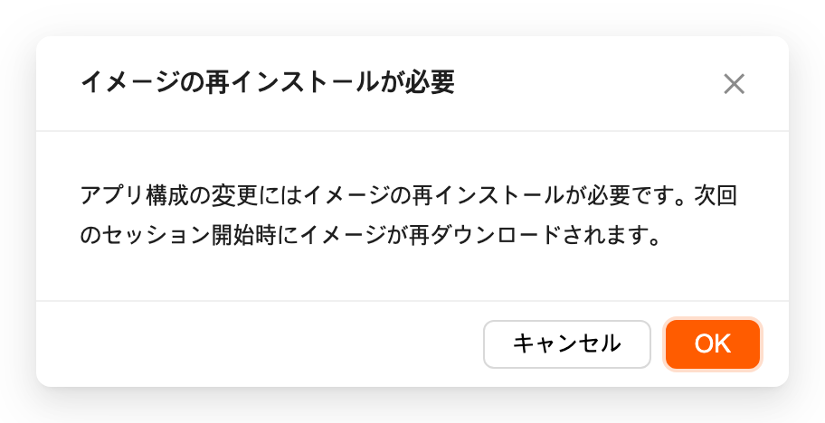
:::

<a id="manage-docker-registry"></a>

## Manage docker registry

You can click on the Registries tab in Environments page to see the information
of the docker registry that are currently connected. `cr.backend.ai` is
registered by default, and it is a registry provided by Harbor.

:::note
In the offline environment, the default registry is not accessible, so
click the trash icon on the right to delete it.
:::

Click the refresh icon in Controls to update image metadata for Backend.AI from
the connected registry. Image information which does not have labels for
Backend.AI among the images stored in the registry is not updated.

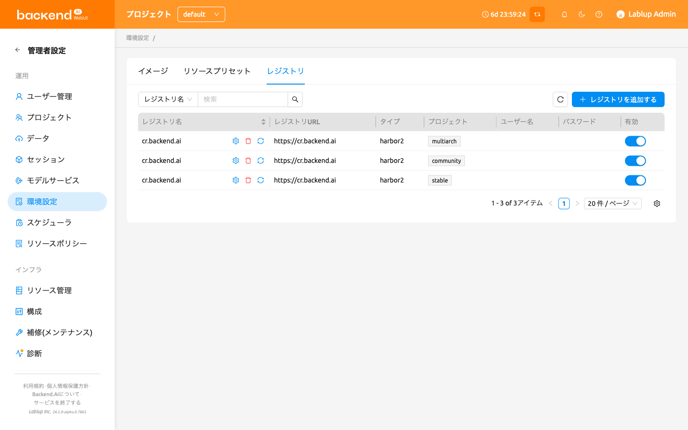

You can add your own private docker registry by clicking the '+ Add Registry'
button. Note that Registry Name and Registry URL address must be set
identically, and in the case of Registry URL, a scheme such as `http://__PROTECTED_10__https://__PROTECTED_11__api_endpoint__PROTECTED_12__https://registry.gitlab.com__PROTECTED_13__{"api_endpoint": "https://gitlab.com"}__PROTECTED_14__https://registry.example.com__PROTECTED_15__{"api_endpoint": "https://gitlab.example.com"}__PROTECTED_16__api_endpoint__PROTECTED_17__namespace/project-name__PROTECTED_18__read_registry__PROTECTED_19__read_api__PROTECTED_20__read_api__PROTECTED_21__FIFO__PROTECTED_22__LIFO__PROTECTED_23__DRF__PROTECTED_24__FIFO__PROTECTED_25__LIFO__PROTECTED_26__DRF__PROTECTED_27__PENDING__PROTECTED_28__num
  retries to skip`, default three times).

<a id="scheduling-methods"></a>

You can create a new resource policy by clicking the '+ Create' button.
Likewise other creating options, you cannot create a resource policy with the name
that already exists, since name is the key value.

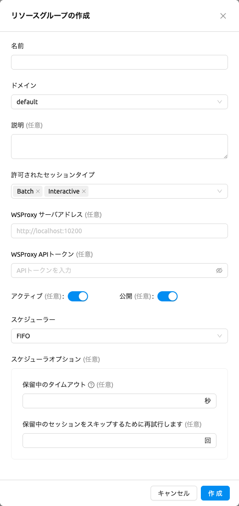

<a id="storages"></a>

## Storages

On STORAGES tab, you can see what kind of mount volumes (usually NFS) exist.
From 23.03 version, We provide per-user/per-project quota setting on storage that supports quota management.
By using this feature, admin can easily manage and monitor the exact amount of storage usage for each user and project based folder.

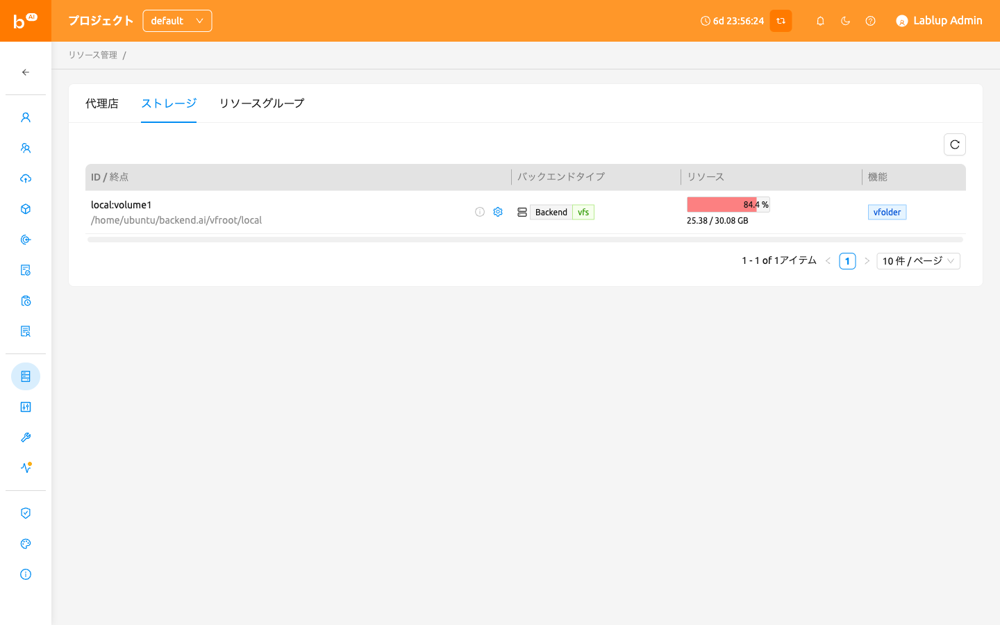

In order to set quota, you need to first access to storages tab in resource page.
And then, click 'Setting (Gear)' in control column.

:::note
Please remind that quota setting is only available in storage that provides quota setting
(e.g. XFS, CephFS, NetApp, Purestorage, etc.). Although you can see the usage of storage
in quota setting page regardless of storage, you cannot configure the quota which doesn't
support quota configuration internally.

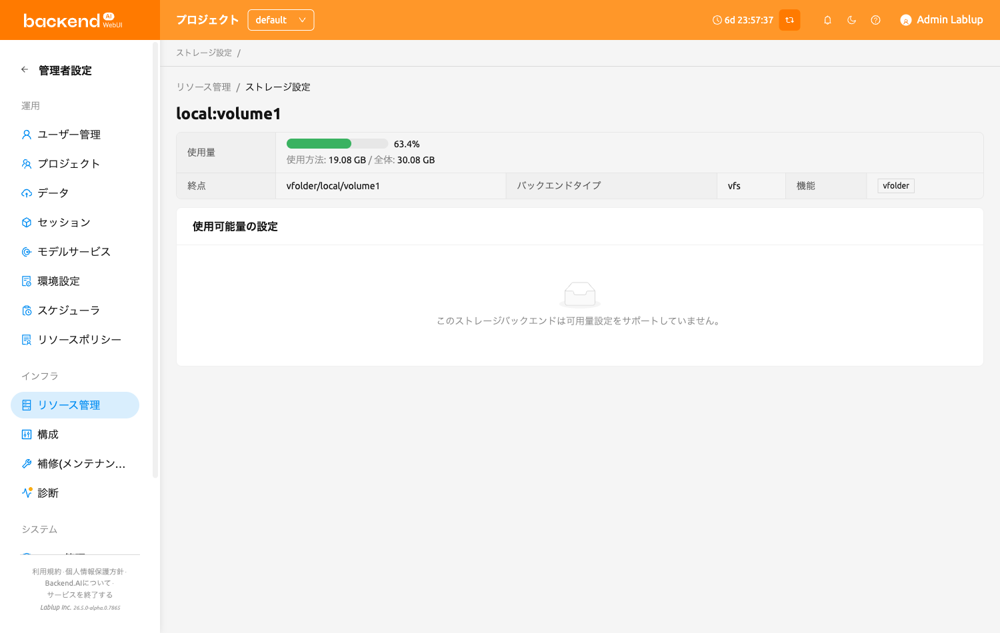
:::

<a id="quota-setting-panel"></a>

#### Quota Setting Panel

In Quota setting page, there are two panels.

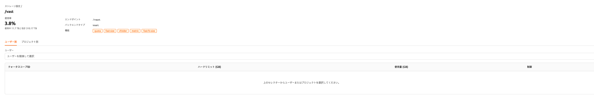

- Overview panel
  - Usage: Shows the actual amount usage of the selected storage.
  - Endpoint: Represents the mount point of the selected storage.
  - Backend Type: The type of storage.
  - Capabilities: The supported feature of the selected storage.

- Quota Settings
  - For User: Configure per-user quota setting here.
  - For Project: Configure per-project quota(project-folder) setting here.
  - ID: Corresponds to user or project id.
  - Hard Limit (GB): Currently set hard limit quota for selected quota.
  - Control: Provides editing the hard limit or even deleting the quota setting.

<a id="set-user-quota"></a>

#### Set User Quota

In Backend.AI, there are two types of vfolders created by user and admin(project). In this section,
we would like to show how to check current quota setting per-user and how to configure it.
First, make sure the active tab of quota settings panel is `For User`. Then, select user you desire to
check and edit the quota. You can see the quota id that corresponds to user's id and the configuration already set
in the table, if you already set the quota.

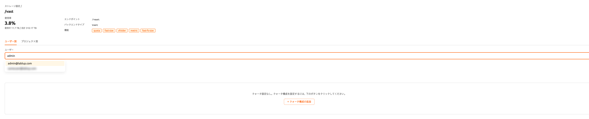

Of course, if you want to edit the quota, you can simply click the Edit button in the control column. After Clicking `Edit` button, you may see the small modal that enables configuring quota setting.
After input the exact amount, don't forget to Click `OK` button, unless the changes will not be applied.

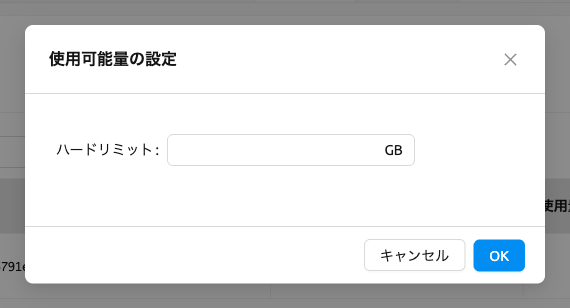

<a id="set-project-quota"></a>

#### Set Project Quota

Setting a quota on project-folder is similar to setting a user quota. The difference between setting
project quota and user quota is to confirm setting the project quota requires one more procedure,
which is selecting the domain that the project is dependent on. The rest are the same.
As in the picture below, you need to first select the domain, and then select the project.

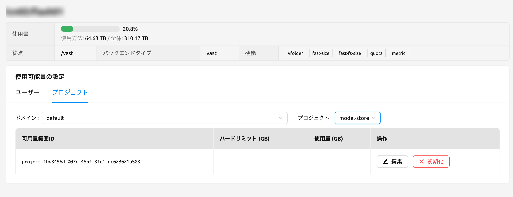

<a id="unset-quota"></a>

#### Unset Quota

We also provides the feature to unset the quota. Please remind that after removing the quota setting, quota will automatically follows
user or project default quota, which cannot be set in WebUI. If you want to change the default quota setting, you may need to access to admin-only page.
By Clicking `Unset` button in control column, the small snackbar message will show up and confirm whether you really want to delete the current quota setting.
If you click `OK` button in the snackbar message, then it will delete the quota setting and automatically reset the quota follows to corresponding quota,
which depends on the quota type(user / project).

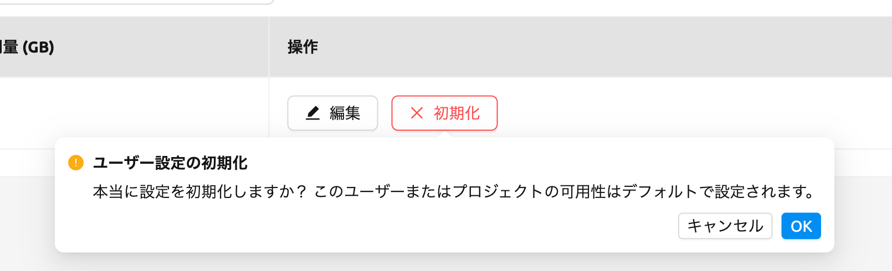

:::note
If there's no config per user/project, then corresponding values in the user/project resource policy will be set as
a default value. For example, If no hard limit value for quota is set, `max_vfolder_size` value in the resource policy
is used as the default value.
:::

<a id="download-session-lists"></a>

## Download session lists

:::note
This feature is currently not available on the default Session page.
To use this feature, please enable 'Classic Session list page' option in the 'Switch back to the Classic UI' section
on the User Setting page. For more details, please refer to [Backend.AI User Settings](#user-settings) section.
:::

There's additional feature in Session page for admin.
On the right side of the FINISHED tab there is a menu marked with `...`.
When you click this menu, a sub-menu export CSV appears.


If you click this menu, you can download the information of the comcpute sessions
created so far in CSV format. After the following dialog opens, enter an appropriate
file name (if necessary), click the EXPORT button and you will get the CSV file.
Please note that a file name can have up to 255 characters.

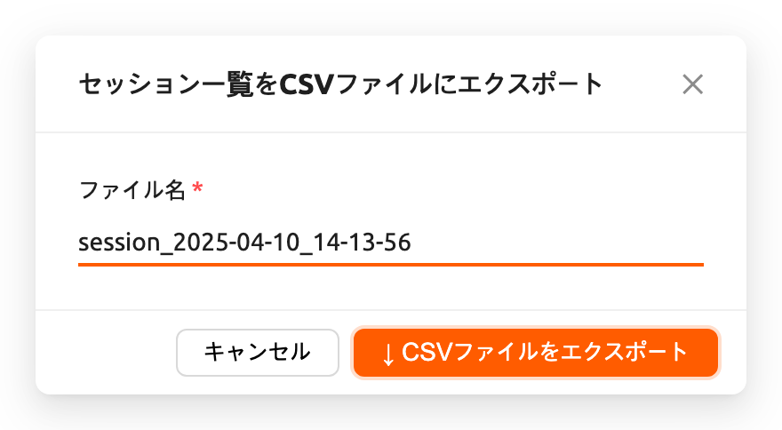

<a id="system-settings"></a>

## System settings

In the Configuration page, you can see main settings of Backend.AI server.
Currently, it provides several controls which can change and list settings.

You can change image auto install and update rule by selecting one option from
`Digest`, `Tag`, `None`. `Digest` is kind of checksum for the image which
verifies integrity of the image and also enhances efficiency in downloading images
by reusing duplicated layers. `Tag` is only for developing option since it does not
guarantee the Integrity of the image.

:::note
Don't change rule selection unless you completely understand the meaning of each rule.
:::

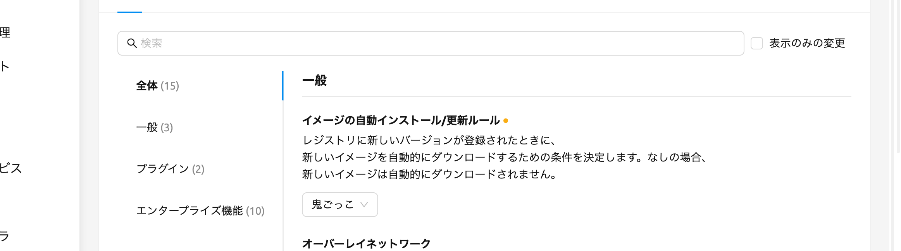

You can also change settings for scaling, plugins and enterprise features.

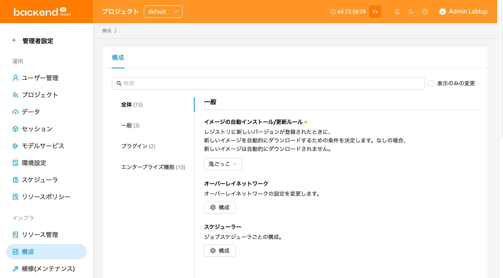

When a user launches a multi-node cluster session, which is introduced at
version 20.09, Backend.AI will dynamically create an overlay network to support
private inter-node communication. Admins can set the value of the Maximum
Transmission Unit (MTU) for the overlay network, if it is certain that the value
will enhance the network speed.


:::note
For more information about Backend.AI Cluster session, please refer to
[Backend.AI Cluster Compute Session](#backendai-cluster-compute-session) section.
:::

You can edit the configuration per job scheduler by clicking the Scheduler's config button.
The values in the scheduler setting are the defaults to use when there is no scheduler
setting in each [resource group](#scheduling-methods). If there is a resource
group-specific setting, this value will be ignored.

Currently supported scheduling methods include `FIFO`, `LIFO`, and `DRF`.
Each method of scheduling is exactly the same as the [scheduling methods](#scheduling-methods) above.
Scheduler options include session creation retries. Session creation retries refers to the number
of retries to create a session if it fails. If the session cannot be created within the trials,
the request will be ignored and Backend.AI will process the next request. Currently, changes are
only possible when the scheduler is FIFO.

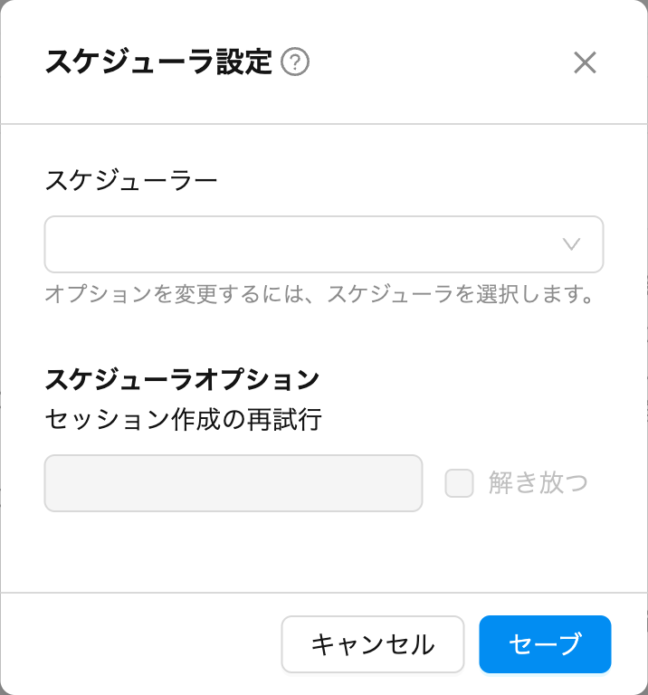

:::note
We will continue to add broader range of setting controls.
:::

:::note
System settings are default settings. If resource group has certain value,
then it overrides configured value in system settings.
:::

<a id="server-management"></a>

## Server management

Go to the Maintenance page and you will see some buttons to manage the server.

- RECALCULATE USAGE: Occasionally, due to unstable network connections or
  container management problem of Docker daemon, there may be a case where the
  resource occupied by Backend.AI does not match the resource actually used by
  the container. In this case, click the RECALCULATE USAGE button to manually
  correct the resource occupancy.
- RESCAN IMAGES: Update image meta information from all registered Docker
  registries. It can be used when a new image is pushed to a
  Backend.AI-connected docker registry.

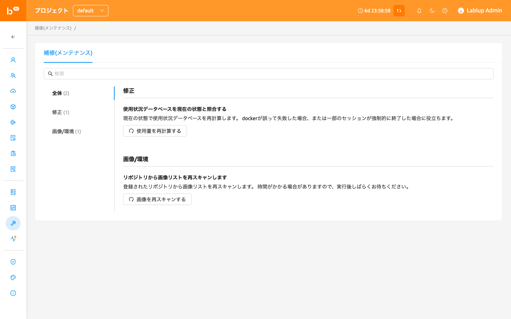

:::note
We will continue to add other settings needed for management, such as
removing unused images or registering periodic maintenance schedules.
:::

<a id="detailed-information"></a>

## Detailed Information

In Information page, you can see several detailed information and status of each feature.
To see Manager version and API version, check the Core panel. To see whether each component
for Backend.AI is compatible or not, check the Component panel.

:::note
This page is only for showing current information.
:::

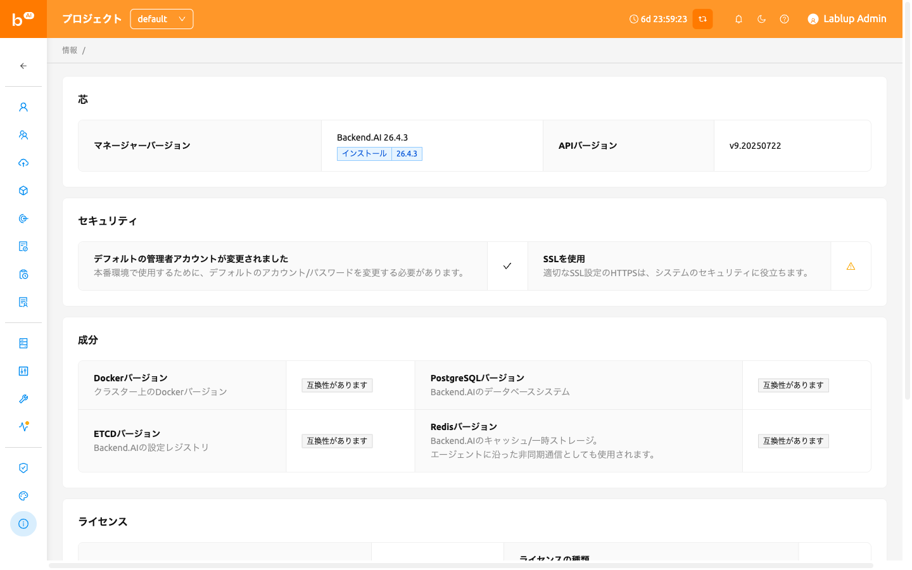
