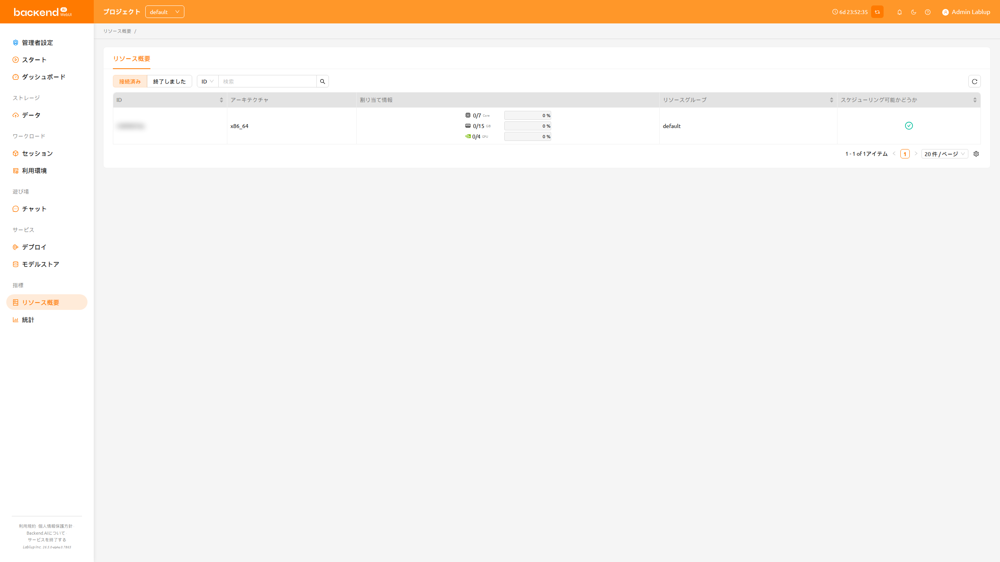

# エージェントサマリー

現在、管理者権限を持つユーザーのみが管理メニューを通じてエージェント情報を確認できます。
22.09以降、Backend.AI WebUIは設定に応じてエージェントノードの一部情報を一般ユーザーにも表示できるようになりました。
エージェントサマリーメニューでは、エンドポイントアドレス、CPUアーキテクチャ、リソース割り当て、
およびエージェントのスケジュール可否など、エージェント情報の一覧を確認できます。このメニューは、セッション作成時のリソース割り当て状況の確認に便利です。

:::note
サーバーの設定によっては、エージェントサマリーサービス機能が利用できない場合があります。
その場合は、システムの管理者にお問い合わせください。
:::