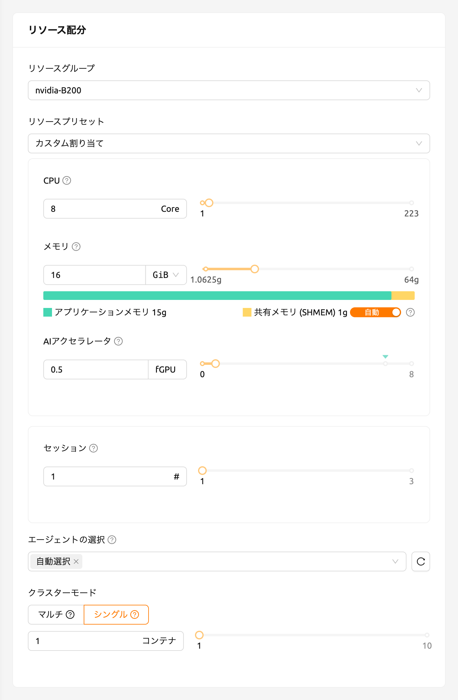
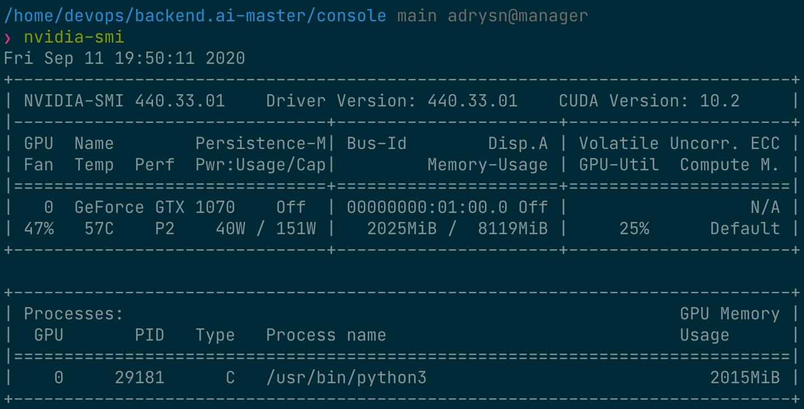
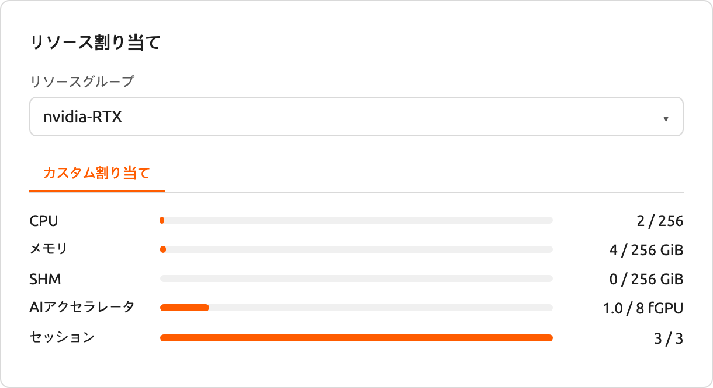
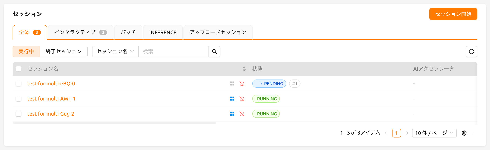
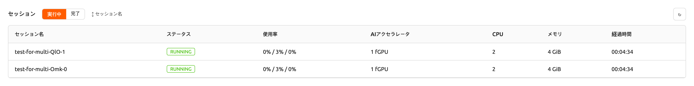
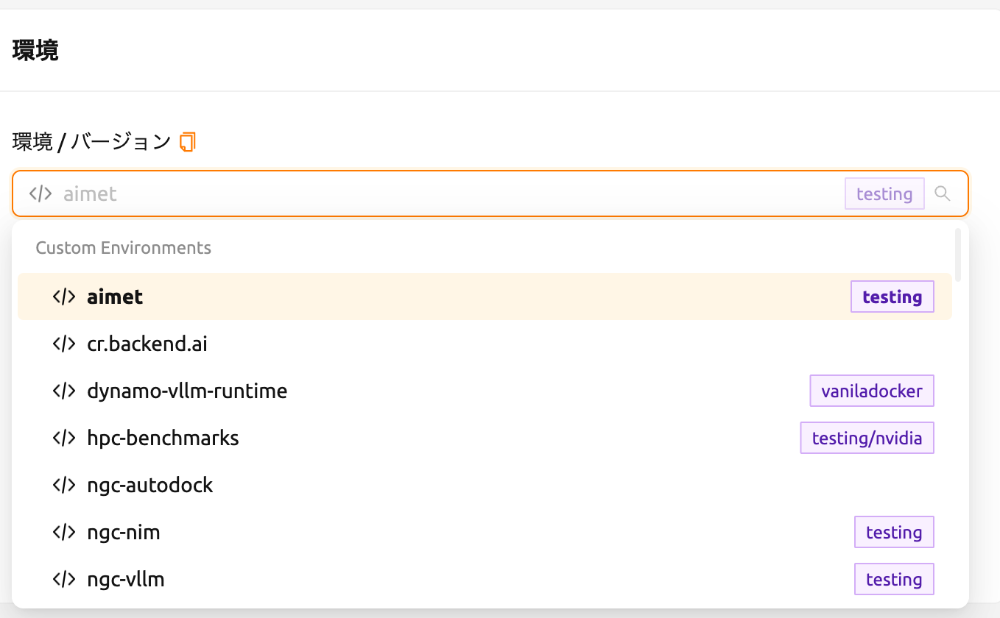
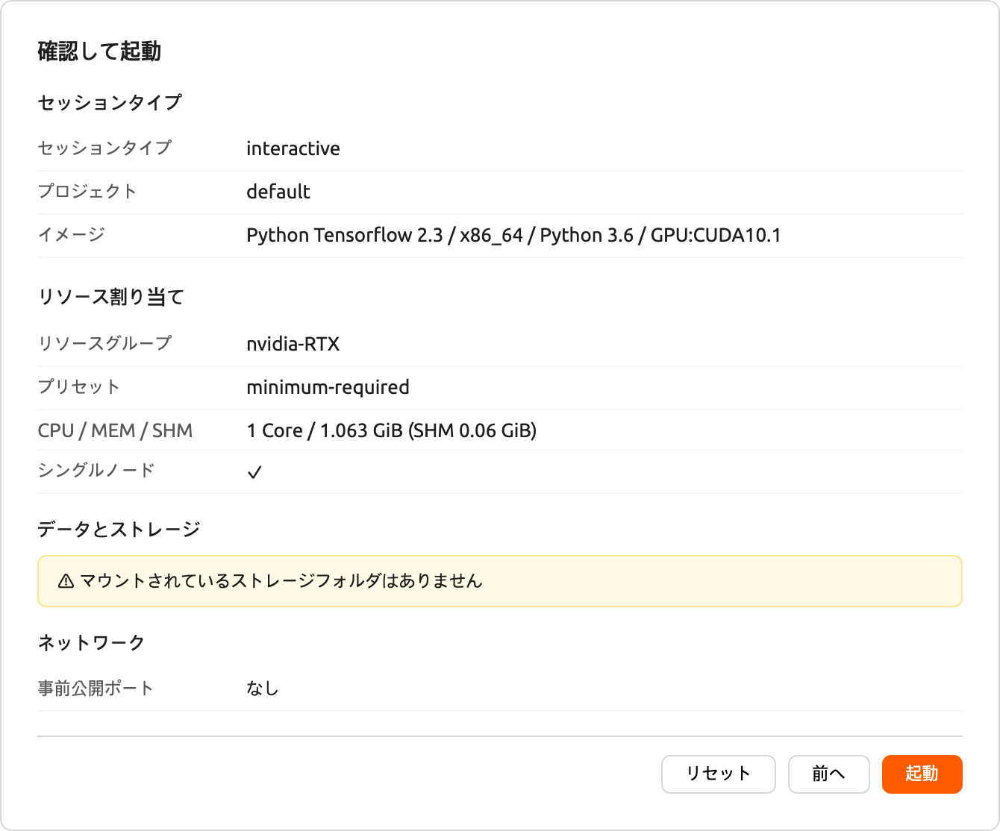
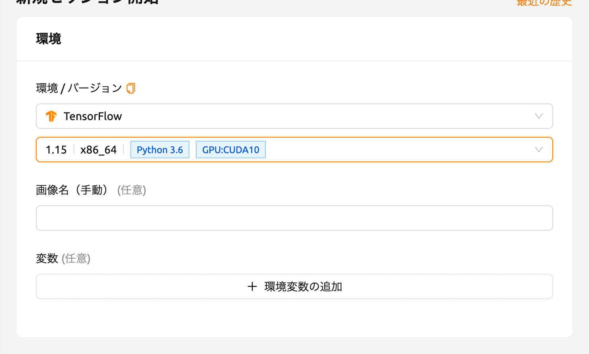
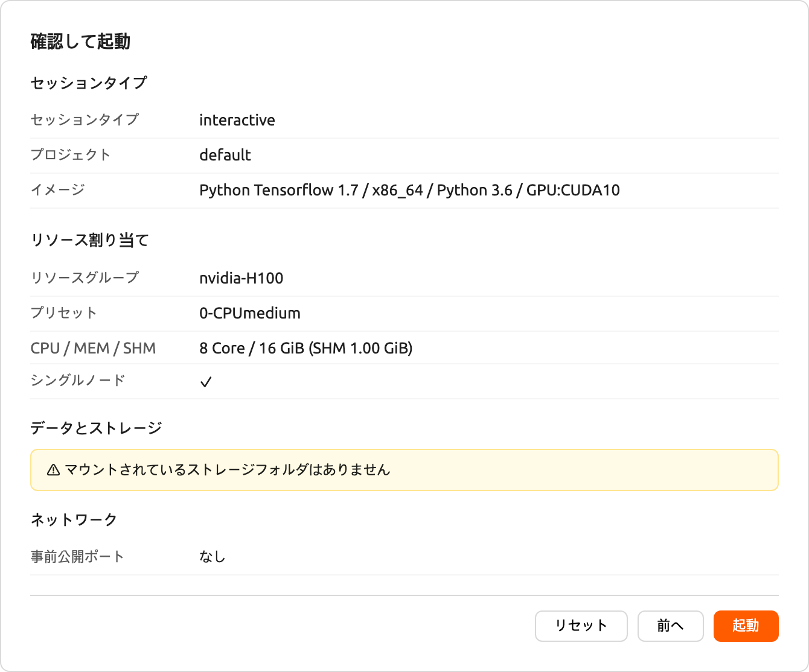
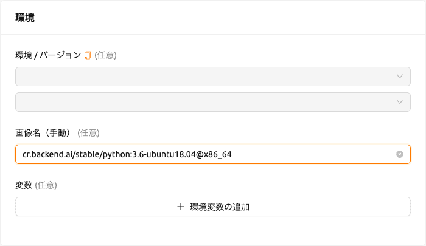

# 付録

<a id="gpu-virtualization-and-fractional-gpu-allocation"></a>

## GPU仮想化および分数GPU割り当て

Backend.AI supports GPU virtualization technology which allows single physical
GPU can be divided and shared by multiple ユーザーs simultaneously. Therefore, if
you want to execute a task that does not require much GPU computation
capability, you can create a compute session by allocating a portion of the GPU.
The amount of GPU resources that 1 fGPU actually allocates may vary from system
to system depending on 管理者istrator settings. For example, if the 管理者istrator
has set one physical GPU to be divided into five pieces, 5 fGPU means 1 physical
GPU, or 1 fGPU means 0.2 physical GPU. If you set 1 fGPU when creating a compute
session, the session can utilize the streaming multiprocessor (SM) and GPU
memory equivalent to 0.2 physical GPU.

このセクションでは、GPUの一部を割り当てて計算セッションを作成し、その計算コンテナ内で認識されたGPUが本当に部分的な物理GPUに対応しているかどうかを確認します。

First, let's check the type of physical GPU installed in the
host node and the amount of memory. The GPU node used in this guide is equipped
with a GPU with 8 GB of memory as in the following figure. And through the
管理者istrator settings, 1 fGPU is set to an amount equivalent to 0.5 physical
GPU (or 1 physical GPU is 2 fGPU).


Now let's go to the セッション page and create a compute session by allocating 0.5
fGPU as follows:



In the AI Accelerator panel of the session list, you can see that
0.5 fGPU is allocated.


Now, let's connect directly to the container and check if the allocated GPU
memory is really equivalent to 0.5 units (~2 GB). Let's bring up a web
terminal. When the terminal comes up, run the `nvidia-smi` command. As you can
see in the following figure, you can see that about 2 GB of GPU memory is
allocated. This shows that the physical GPU is actually divided into quarters and allocated inside the
container for this compute session, which is not possible by a way like PCI passthrough.


Jupyter Notebookを開いて、シンプルなMLトレーニングコードを実行しましょう。


While training is in progress, connect to the shell of the GPU host node and
execute the `nvidia-smi` command. You can see that there is one GPU attached
to the process and this process is occupying about 25% of the resources of the
physical GPU. (GPU occupancy can vary greatly depending on training code and GPU
model.)



Alternatively, you can run the `nvidia-smi` command from the web terminal to query the GPU usage history inside the container.


<a id="automated-job-scheduling"></a>

## 自動ジョブスケジューリング

Backend.AIサーバーには、独自開発されたタスクスケジューラーが組み込まれています。これにより、すべてのワーカーノードの利用可能なリソースを自動的にチェックし、ユーザーのリソース要求を満たすワーカーに対してコンピュートセッションの作成を委任します。さらに、リソースが不足している場合、ユーザーのコンピュートセッションの作成要求は、ジョブキューのPENDING状態として登録されます。その後、リソースが再び利用可能になると、保留された要求が再開されてコンピュートセッションの作成が行われます。

ジョブスケジューラの動作は、ユーザーWeb-UIから簡単に確認することができます。GPUホストが最大2つのfGPUを割り当てることができる場合、それぞれ1つのfGPUの割り当てを要求する3つのコンピュートセッションを同時に作成してみましょう。セッション起動ダイアログのカスタム割り当てセクションには、GPUとセッションのスライダーがあります。セッションに1より大きい値を指定してLAUNCHボタンをクリックすると、セッションの数が同時に要求されます。GPUとセッションをそれぞれ1と3に設定してみましょう。これは、合計3つのfGPUを要求する3つのセッションが、2つのfGPUしか存在しないときに作成される状況です。



しばらく待つと、3つのコンピュートセッションが一覧表示されるのが見えます。ステータスパネルをよく見ると、3つのコンピュートセッションのうち2つはRUNNING状態ですが、もう1つのコンピュートセッションはPENDING状態のままであることがわかります。このPENDINGセッションはジョブキューに登録されているだけで、不十分なGPUリソースのために実際にはコンテナが割り当てられていません。



それでは、RUNNING状態にある2つのセッションのうち1つを削除しましょう。すると、PENDING状態にあるコンピュートセッションがジョブスケジューラによってリソースが割り当てられ、すぐにRUNNING状態に変わることが確認できます。このようにして、ジョブスケジューラはユーザーのコンピュートセッションリクエストを保持するためにジョブキューを利用し、リソースが利用可能になると自動的にリクエストを処理します。




<a id="multi-version-machine-learning-container-support"></a>

## マルチバージョン機械学習コンテナサポート

Backend.AIは、さまざまなプリビルドのMLおよびHPCカーネルイメージを提供しています。したがって、ユーザーは主要なライブラリやパッケージを自分でインストールすることなく、すぐに利用することができます。ここでは、複数バージョンの複数のMLライブラリを即座に活用する例を説明します。

セッションページに移動し、セッション起動ダイアログを開きます。インストール設定によっては、さまざまなカーネルイメージがあるかもしれません。



Here, let's select the TensorFlow 2.3 environment and created a session.



Open the web terminal of the created session and run the following Python
command. You can see that TensorFlow 2.3 version is installed.


This time, let's select the TensorFlow 1.15 environment to create a compute
session. If resources are insufficient, delete the previous session.



Open the web terminal of the created session and run the same Python command as
before. You can see that TensorFlow 1.15(.4) version is installed.


Finally, create a compute session using PyTorch version 1.7.



Open the web terminal of the created session and run the following Python
command. You can see that PyTorch 1.8 version is installed.


このように、TensorFlowやPyTorchなどの主要なライブラリのさまざまなバージョンを、Backend.AIを通じてインストールの手間をかけずに利用することができます。


<a id="convert-a-compute-session-to-a-new-private-docker-image"></a>

## コンピュートセッションを新しいプライベートDockerイメージに変換する

実行中のコンピュートセッション（コンテナ）を、新しいコンピュートセッションを作成するために後で利用できる新しいDockerイメージに変換したい場合は、コンピュートセッション環境を準備し、管理者に変換を依頼する必要があります。

- まず、必要なパッケージをインストールし、設定を好みに合わせて調整して、コンピュートセッションを準備します。

:::note
OSパッケージをインストールしたい場合（例えば`apt`コマンドを通じて）、通常`sudo`権限が必要です。機関のセキュリティポリシーに応じて、コンテナ内で`sudo`を使用することが許可されていない場合があります。

Pythonパッケージをインストールする際は、[自動マウントフォルダ](#using-automount-folder)を使用して[pipを通じてインストール](#install_pip_pkg)することをお勧めします。ただし、新しいイメージにPythonパッケージを追加したい場合は、`sudo pip install <パッケージ名>`を使用して、ホームディレクトリではなくシステムディレクトリに保存する必要があります。ホームディレクトリ（通常`/home/work/`）の内容は、コンピュートセッションを新しいDockerイメージに変換する際に保存されません。
:::

- コンピュートセッションの準備ができたら、管理者に新しいDockerイメージへの変換を依頼してください。セッション名またはIDとプラットフォームに登録されているメールアドレスを知らせる必要があります。
- 管理者がコンピュートセッションを新しいDockerイメージに変換すると、完全なイメージ名とタグが通知されます。
- セッション起動ダイアログでイメージ名を手動で入力できます。このイメージはプライベートであり、他のユーザーには表示されません。

  

- 新しいDockerイメージを使用して、新しいコンピュートセッションが作成されます。


<a id="backend-ai-server-installation-guide"></a>

## Backend.AI サーバーインストールガイド

Backend.AIサーバーデーモン/サービスには、以下のハードウェア仕様を満たす必要があります。最適なパフォーマンスを得るためには、各リソースの量を2倍にすることをお勧めします。

- Manager: 2コア、4 GiBメモリ
- Agent: 4コア、32 GiBメモリ、NVIDIA GPU（GPUワークロード用）、> 512 GiB SSD
- Webserver: 2コア、4 GiBメモリ
- WSProxy: 2コア、4 GiBメモリ
- PostgreSQL DB: 2コア、4 GiBメモリ
- Redis: 1コア、2 GiBメモリ
- Etcd: 1コア、2 GiBメモリ

各サービスをインストールする前に事前にインストールする必要がある必須ホスト依存パッケージは以下の通りです：

- Web-UI: 最新のブラウザを実行できるオペレーティングシステム（Windows、Mac OS、Ubuntuなど）
- Manager: Python (≥3.8)、pyenv/pyenv-virtualenv (≥1.2)
- Agent: docker (≥19.03)、CUDA/CUDA Toolkit (≥8、11推奨)、nvidia-docker v2、Python (≥3.8)、pyenv/pyenv-virtualenv (≥1.2)
- Webserver: Python (≥3.8)、pyenv/pyenv-virtualenv (≥1.2)
- WSProxy: docker (≥19.03)、docker-compose (≥1.24)
- PostgreSQL DB: docker (≥19.03)、docker-compose (≥1.24)
- Redis: docker (≥19.03)、docker-compose (≥1.24)
- Etcd: docker (≥19.03)、docker-compose (≥1.24)

エンタープライズ版については、Backend.AIサーバーデーモンはLablupサポートチームによってインストールされ、初回インストール後に以下の資料/サービスが提供されます：

- DVD 1枚（Backend.AIパッケージを含む）
- ユーザーGUIガイドマニュアル
- 管理者GUIガイドマニュアル
- インストールレポート
- 初回ユーザー/管理者オンサイトチュートリアル（3-5時間）

製品メンテナンスおよびサポート情報：商用契約にはデフォルトでエンタープライズ版の月額/年額サブスクリプション料金が含まれています。初回インストール後約2週間、初回ユーザー/管理者トレーニング（1-2回）および有線/無線カスタマーサポートサービスが提供され、3-6ヶ月間マイナーリリースアップデートサポートおよびオンラインチャネルを通じたカスタマーサポートサービスが提供されます。その後提供されるメンテナンスおよびサポートサービスは、契約条件に応じて詳細が異なる場合があります。


<a id="integration-examples"></a>

## 連携例

このセクションでは、Backend.AIプラットフォームで活用できるアプリケーション、ツールキット、機械学習ツールの代表的な使用例を紹介します。ここでは、各ツールの基本的な使い方とBackend.AI環境での設定方法を簡単な例とともに説明します。プロジェクトに必要なツールを選択し活用する際の参考になれば幸いです。

このガイドで扱う内容は特定バージョンのプログラムに基づいて作成されているため、今後のアップデートにより使用方法が変わる可能性があります。そのため、このドキュメントは参考としてご利用いただき、変更事項については最新の公式ドキュメントもあわせてご確認ください。それでは、Backend.AIで活用できる強力なツールを一つずつ見ていきましょう。このセクションが皆さまの研究および開発に役立つガイドとなることを願っています。

#### MLFlowの使用

Backend.AIにはMLFlowとMLFlow UIを内蔵アプリとしてサポートする多数の実行イメージがあります。ただし、実行するために追加の手順が必要になる場合があります。以下の手順に従うことで、ローカル環境で使用するのと同様に、Backend.AIでパラメータと結果を追跡できます。

:::note
このセクションでは、すでにセッションを作成し、セッション内でアプリを実行しようとしている状態を前提としています。セッション作成およびアプリ実行の経験がない場合は、[新しいセッションの作成方法](#start-a-new-session)セクションを先にご覧ください。
:::

まず、ターミナルアプリ「console」を起動し、以下のコマンドを実行します。これによりMLFlowトラッキングUIサーバーが開始されます。

```shell
$ mlflow ui --host 0.0.0.0
```

次に、アプリランチャーダイアログで「MLFlow UI」アプリをクリックします。


しばらくすると、MLFlow UIの新しいページが表示されます。


MLFlowを使用すると、実行するたびにメトリクス、パラメータなどの実験を追跡できます。簡単な例から実験追跡を始めましょう。

```shell
$ wget https://raw.githubusercontent.com/mlflow/mlflow/master/examples/sklearn_elasticnet_diabetes/linux/train_diabetes.py
$ python train_diabetes.py
```

Pythonコードを実行した後、MLFlowで実験結果を確認できます。


コード実行時に引数を渡してハイパーパラメータを設定することもできます。

```shell
$ python train_diabetes.py 0.2 0.05
```

いくつかのトレーニングを行った後で、結果とともに訓練されたモデルを比較することができます。

