# 付録

<a id="gpu-virtualization-and-fractional-gpu-allocation"></a>

## GPU仮想化およびフラクショナルGPU割り当て

Backend.AIは、1つの物理GPUを複数のユーザーで分割して同時に共有できるGPU仮想化技術をサポートしています。したがって、GPUの計算能力をあまり必要としないタスクを実行する場合、GPUの一部を割り当ててコンピュートセッションを作成できます。1フラクショナルGPU (fGPU) が実際に割り当てるGPUリソースの量は、管理者の設定によってシステムごとに異なる場合があります。例えば、管理者が1つの物理GPUを5つに分割するように設定した場合、5 fGPUは1物理GPU、または1 fGPUは0.2物理GPUを意味します。コンピュートセッション作成時に1 fGPUを設定すると、そのセッションは0.2物理GPUに相当するストリーミングマルチプロセッサ (SM) およびGPUメモリを利用できます。

このセクションでは、GPUの一部を割り当てて計算セッションを作成し、その計算コンテナ内で認識されたGPUが本当に部分的な物理GPUに対応しているかどうかを確認します。

まず、ホストノードにインストールされている物理GPUの種類とメモリ容量を確認しましょう。本ガイドで使用するGPUノードは、以下の図のように8 GBのメモリを搭載したGPUを備えています。また、管理者の設定により、1 fGPUは0.5物理GPUに相当する量（または1物理GPUは2 fGPU）に設定されています。


それでは、セッションページに移動し、以下のように0.5 fGPUを割り当ててコンピュートセッションを作成してみましょう。

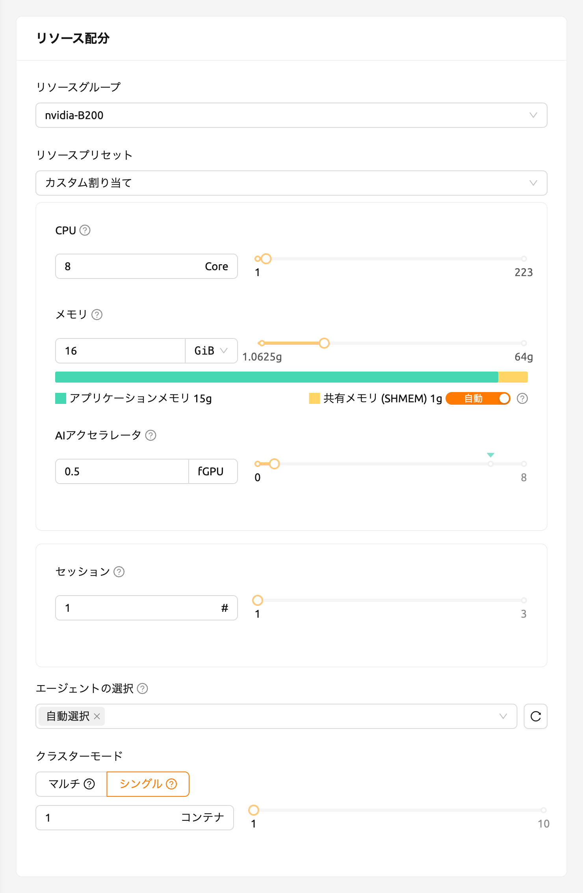

セッション一覧のAIアクセラレータパネルで、0.5 fGPUが割り当てられていることを確認できます。

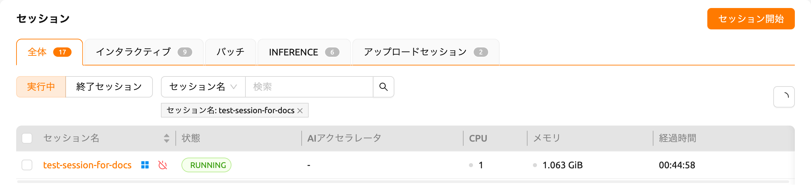

次に、コンテナに直接接続し、割り当てられたGPUメモリが本当に0.5ユニット（約2 GB）に相当するかを確認しましょう。Webターミナルを起動し、ターミナルが表示されたら `nvidia-smi` コマンドを実行します。以下の図のとおり、約2 GBのGPUメモリが割り当てられていることを確認できます。これは、このコンピュートセッションのコンテナ内で物理GPUが実際に4分の1に分割して割り当てられていることを示しており、PCIパススルーのような方法では実現できないものです。

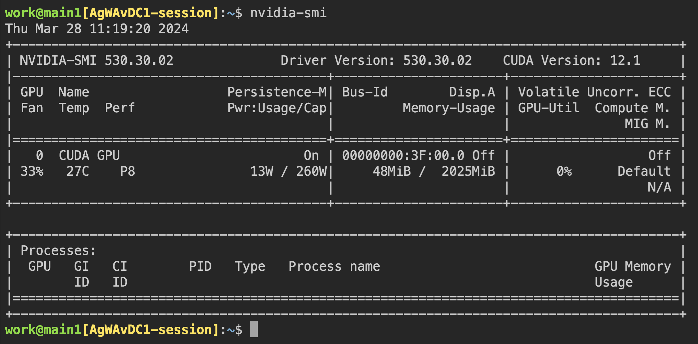

Jupyter Notebookを開いて、シンプルなMLトレーニングコードを実行しましょう。


トレーニング実行中に、GPUホストノードのシェルに接続し、`nvidia-smi` コマンドを実行します。プロセスに1つのGPUがアタッチされており、このプロセスが物理GPUのリソースの約25%を占有していることを確認できます。（GPU占有率はトレーニングコードやGPUモデルによって大きく異なる場合があります。）

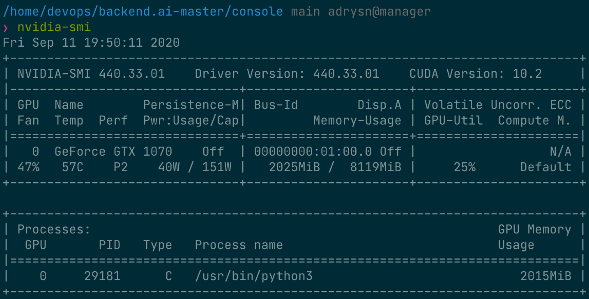

あるいは、Webターミナルから `nvidia-smi` コマンドを実行して、コンテナ内のGPU使用履歴を確認することもできます。


<a id="automated-job-scheduling"></a>

## 自動ジョブスケジューリング

Backend.AIサーバーには、独自開発されたタスクスケジューラーが組み込まれています。これにより、すべてのワーカーノードの利用可能なリソースを自動的にチェックし、ユーザーのリソース要求を満たすワーカーに対してコンピュートセッションの作成を委任します。さらに、リソースが不足している場合、ユーザーのコンピュートセッションの作成要求は、ジョブキューのPENDING状態として登録されます。その後、リソースが再び利用可能になると、保留された要求が再開されてコンピュートセッションの作成が行われます。

ジョブスケジューラの動作は、ユーザーWeb-UIから簡単に確認することができます。GPUホストが最大2つのfGPUを割り当てることができる場合、それぞれ1つのfGPUの割り当てを要求する3つのコンピュートセッションを同時に作成してみましょう。セッション起動ダイアログのカスタム割り当てセクションには、GPUとセッションのスライダーがあります。セッションに1より大きい値を指定してLAUNCHボタンをクリックすると、セッションの数が同時に要求されます。GPUとセッションをそれぞれ1と3に設定してみましょう。これは、合計3つのfGPUを要求する3つのセッションが、2つのfGPUしか存在しないときに作成される状況です。

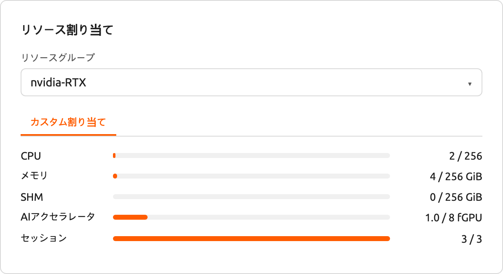

しばらく待つと、3つのコンピュートセッションが一覧表示されるのが見えます。ステータスパネルをよく見ると、3つのコンピュートセッションのうち2つはRUNNING状態ですが、もう1つのコンピュートセッションはPENDING状態のままであることがわかります。このPENDINGセッションはジョブキューに登録されているだけで、不十分なGPUリソースのために実際にはコンテナが割り当てられていません。

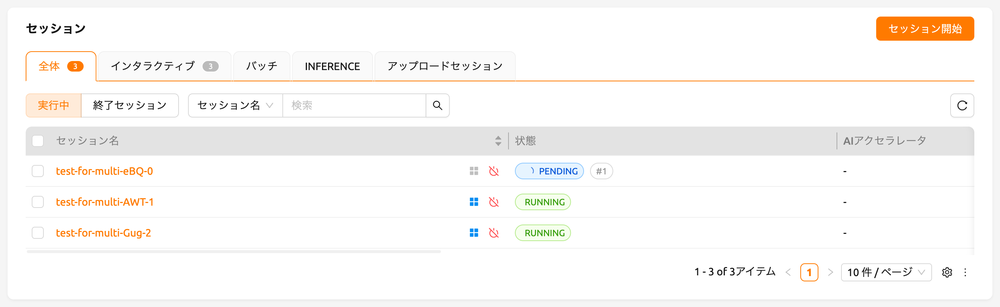

それでは、RUNNING状態にある2つのセッションのうち1つを削除しましょう。すると、PENDING状態にあるコンピュートセッションがジョブスケジューラによってリソースが割り当てられ、すぐにRUNNING状態に変わることが確認できます。このようにして、ジョブスケジューラはユーザーのコンピュートセッションリクエストを保持するためにジョブキューを利用し、リソースが利用可能になると自動的にリクエストを処理します。

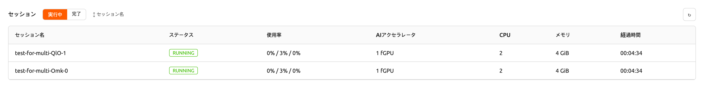


<a id="multi-version-machine-learning-container-support"></a>

## マルチバージョン機械学習コンテナサポート

Backend.AIは、さまざまなプリビルドのMLおよびHPCカーネルイメージを提供しています。したがって、ユーザーは主要なライブラリやパッケージを自分でインストールすることなく、すぐに利用することができます。ここでは、複数バージョンの複数のMLライブラリを即座に活用する例を説明します。

セッションページに移動し、セッション起動ダイアログを開きます。インストール設定によっては、さまざまなカーネルイメージがあるかもしれません。

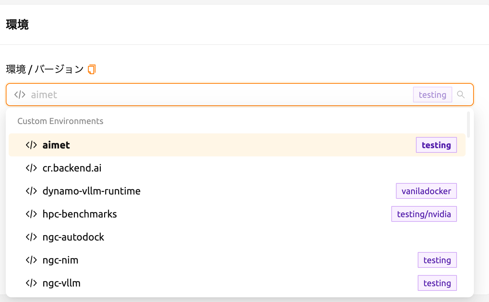

ここでは、TensorFlow 2.3 環境を選択してセッションを作成してみましょう。

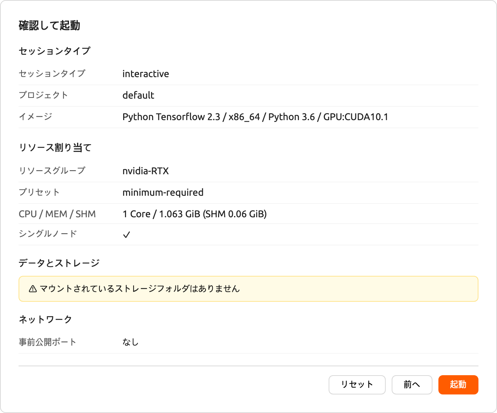

作成したセッションのWebターミナルを開き、以下のPythonコマンドを実行します。TensorFlow 2.3 がインストールされていることを確認できます。


今度は、TensorFlow 1.15 環境を選択してコンピュートセッションを作成しましょう。リソースが不足している場合は、先に作成したセッションを削除してください。

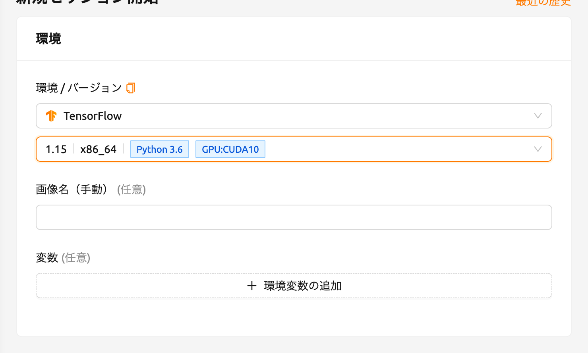

作成したセッションのWebターミナルを開き、先ほどと同じPythonコマンドを実行します。TensorFlow 1.15(.4) がインストールされていることを確認できます。


最後に、PyTorch 1.9 を使用してコンピュートセッションを作成します。

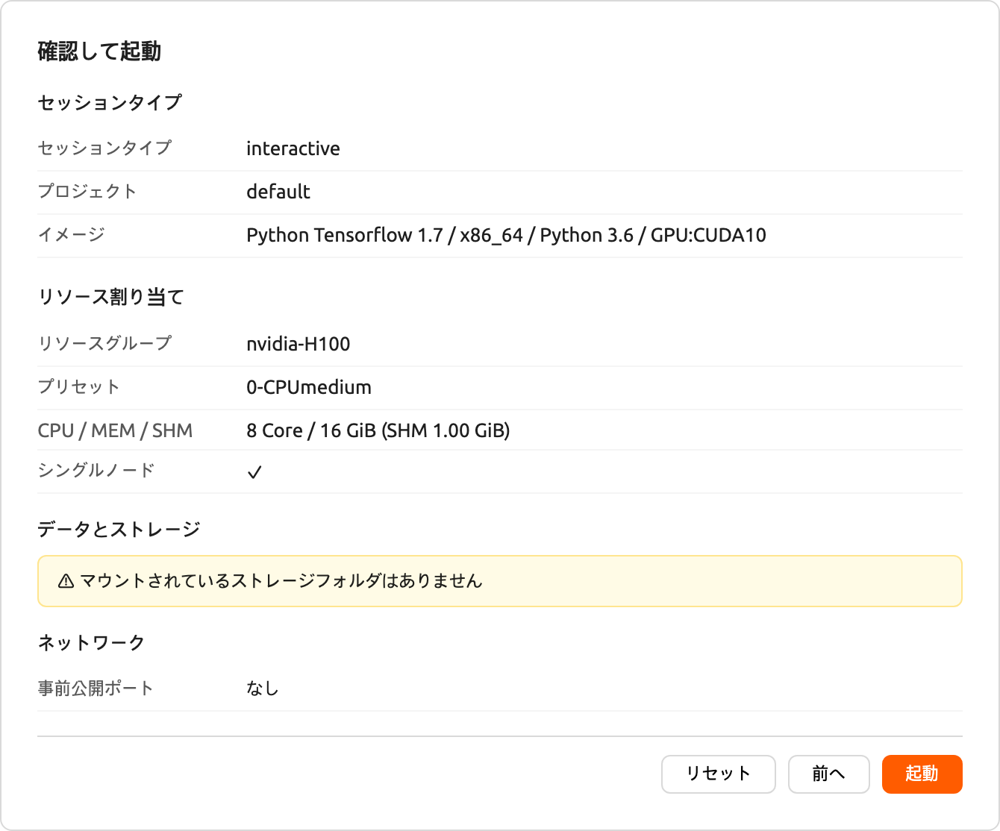

作成したセッションのWebターミナルを開き、以下のPythonコマンドを実行します。PyTorch 1.9 がインストールされていることを確認できます。


このように、TensorFlowやPyTorchなどの主要なライブラリのさまざまなバージョンを、Backend.AIを通じてインストールの手間をかけずに利用することができます。


<a id="convert-a-compute-session-to-a-new-private-docker-image"></a>

## コンピュートセッションを新しいプライベートDockerイメージに変換する

実行中のコンピュートセッション（コンテナ）を、新しいコンピュートセッションを作成するために後で利用できる新しいDockerイメージに変換したい場合は、コンピュートセッション環境を準備し、管理者に変換を依頼する必要があります。

- まず、必要なパッケージをインストールし、設定を好みに合わせて調整して、コンピュートセッションを準備します。

:::note
OSパッケージをインストールしたい場合（例えば`apt`コマンドを通じて）、通常`sudo`権限が必要です。機関のセキュリティポリシーに応じて、コンテナ内で`sudo`を使用することが許可されていない場合があります。

Pythonパッケージをインストールする際は、[自動マウントフォルダ](#using-automount-folder)を使用して[pipを通じてインストール](#install_pip_pkg)することをお勧めします。ただし、新しいイメージにPythonパッケージを追加したい場合は、`sudo pip install <パッケージ名>`を使用して、ホームディレクトリではなくシステムディレクトリに保存する必要があります。ホームディレクトリ（通常`/home/work/`）の内容は、コンピュートセッションを新しいDockerイメージに変換する際に保存されません。
:::

- コンピュートセッションの準備ができたら、管理者に新しいDockerイメージへの変換を依頼してください。セッション名またはIDとプラットフォームに登録されているメールアドレスを知らせる必要があります。
- 管理者がコンピュートセッションを新しいDockerイメージに変換すると、完全なイメージ名とタグが通知されます。
- セッション起動ダイアログでイメージ名を手動で入力できます。このイメージはプライベートであり、他のユーザーには表示されません。

  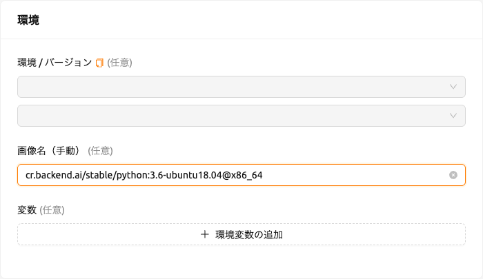

- 新しいDockerイメージを使用して、新しいコンピュートセッションが作成されます。


<a id="backend-ai-server-installation-guide"></a>

## Backend.AI サーバーインストールガイド

Backend.AIサーバーデーモン/サービスには、以下のハードウェア仕様を満たす必要があります。最適なパフォーマンスを得るためには、各リソースの量を2倍にすることをお勧めします。

- Manager: 2コア、4 GiBメモリ
- Agent: 4コア、32 GiBメモリ、NVIDIA GPU（GPUワークロード用）、> 512 GiB SSD
- Webserver: 2コア、4 GiBメモリ
- WSProxy: 2コア、4 GiBメモリ
- PostgreSQL DB: 2コア、4 GiBメモリ
- Redis: 1コア、2 GiBメモリ
- Etcd: 1コア、2 GiBメモリ

各サービスをインストールする前に事前にインストールする必要がある必須ホスト依存パッケージは以下の通りです：

- Web-UI: 最新のブラウザを実行できるオペレーティングシステム（Windows、Mac OS、Ubuntuなど）
- Manager: Python (≥3.8)、pyenv/pyenv-virtualenv (≥1.2)
- Agent: docker (≥19.03)、CUDA/CUDA Toolkit (≥8、11推奨)、nvidia-docker v2、Python (≥3.8)、pyenv/pyenv-virtualenv (≥1.2)
- Webserver: Python (≥3.8)、pyenv/pyenv-virtualenv (≥1.2)
- WSProxy: docker (≥19.03)、docker-compose (≥1.24)
- PostgreSQL DB: docker (≥19.03)、docker-compose (≥1.24)
- Redis: docker (≥19.03)、docker-compose (≥1.24)
- Etcd: docker (≥19.03)、docker-compose (≥1.24)

エンタープライズ版については、Backend.AIサーバーデーモンはLablupサポートチームによってインストールされ、初回インストール後に以下の資料/サービスが提供されます：

- DVD 1枚（Backend.AIパッケージを含む）
- ユーザーGUIガイドマニュアル
- 管理者GUIガイドマニュアル
- インストールレポート
- 初回ユーザー/管理者オンサイトチュートリアル（3-5時間）

製品メンテナンスおよびサポート情報：商用契約にはデフォルトでエンタープライズ版の月額/年額サブスクリプション料金が含まれています。初回インストール後約2週間、初回ユーザー/管理者トレーニング（1-2回）および有線/無線カスタマーサポートサービスが提供され、3-6ヶ月間マイナーリリースアップデートサポートおよびオンラインチャネルを通じたカスタマーサポートサービスが提供されます。その後提供されるメンテナンスおよびサポートサービスは、契約条件に応じて詳細が異なる場合があります。


<a id="integration-examples"></a>

## 連携例

このセクションでは、Backend.AIプラットフォームで活用できるアプリケーション、ツールキット、機械学習ツールの代表的な使用例を紹介します。ここでは、各ツールの基本的な使い方とBackend.AI環境での設定方法を簡単な例とともに説明します。プロジェクトに必要なツールを選択し活用する際の参考になれば幸いです。

このガイドで扱う内容は特定バージョンのプログラムに基づいて作成されているため、今後のアップデートにより使用方法が変わる可能性があります。そのため、このドキュメントは参考としてご利用いただき、変更事項については最新の公式ドキュメントもあわせてご確認ください。それでは、Backend.AIで活用できる強力なツールを一つずつ見ていきましょう。このセクションが皆さまの研究および開発に役立つガイドとなることを願っています。

#### MLFlowの使用

Backend.AIにはMLFlowとMLFlow UIを内蔵アプリとしてサポートする多数の実行イメージがあります。ただし、実行するために追加の手順が必要になる場合があります。以下の手順に従うことで、ローカル環境で使用するのと同様に、Backend.AIでパラメータと結果を追跡できます。

:::note
このセクションでは、すでにセッションを作成し、セッション内でアプリを実行しようとしている状態を前提としています。セッション作成およびアプリ実行の経験がない場合は、[新しいセッションの作成方法](#start-a-new-session)セクションを先にご覧ください。
:::

まず、ターミナルアプリ「console」を起動し、以下のコマンドを実行します。これによりMLFlowトラッキングUIサーバーが開始されます。

```bash
mlflow ui --host 0.0.0.0
```

次に、アプリランチャーダイアログで「MLFlow UI」アプリをクリックします。

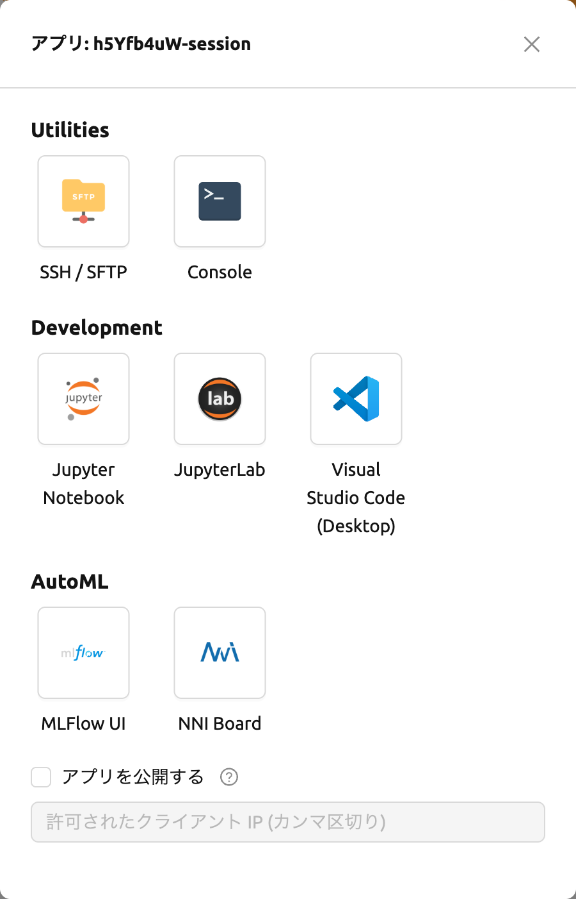

しばらくすると、MLFlow UIの新しいページが表示されます。


MLFlowを使用すると、実行するたびにメトリクス、パラメータなどの実験を追跡できます。簡単な例から実験追跡を始めましょう。

```bash
wget https://raw.githubusercontent.com/mlflow/mlflow/master/examples/sklearn_elasticnet_diabetes/linux/train_diabetes.py
python train_diabetes.py
```

Pythonコードを実行した後、MLFlowで実験結果を確認できます。


コード実行時に引数を渡してハイパーパラメータを設定することもできます。

```bash
python train_diabetes.py 0.2 0.05
```

いくつかのトレーニングを行った後で、結果とともに訓練されたモデルを比較することができます。

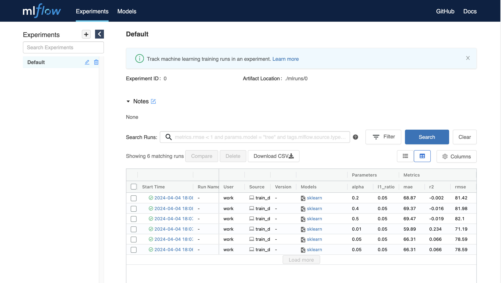