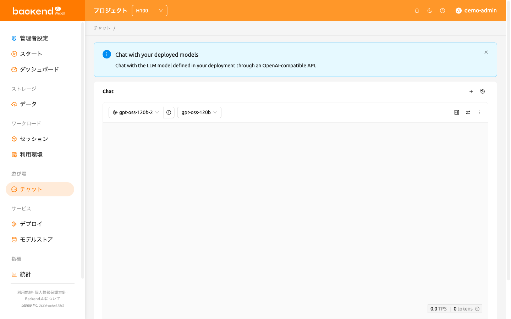
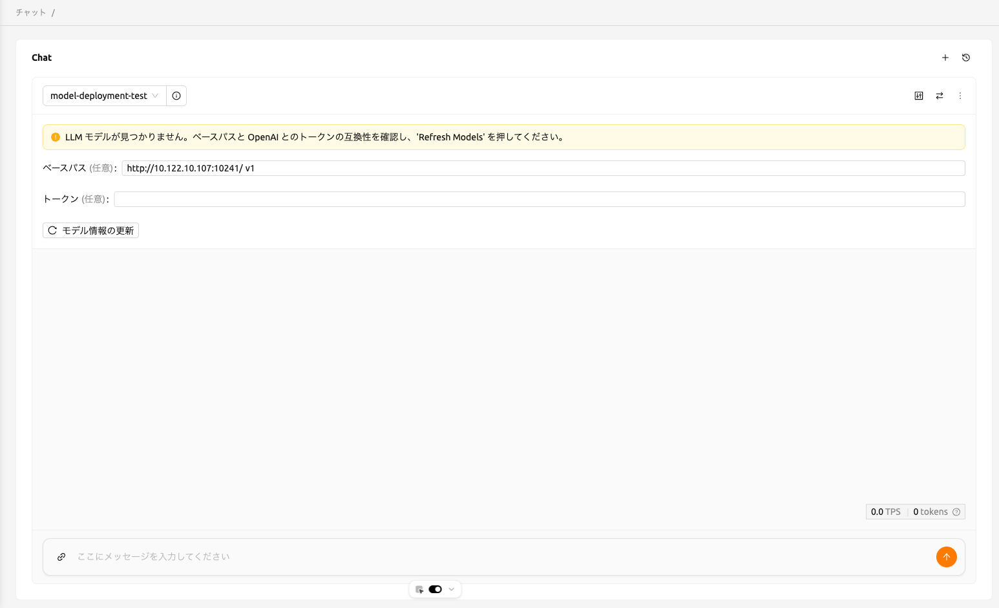
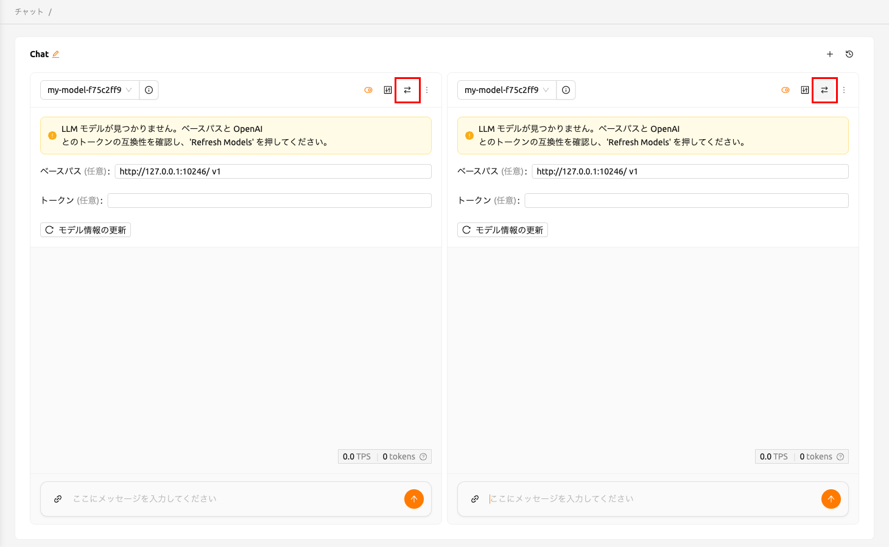
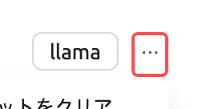
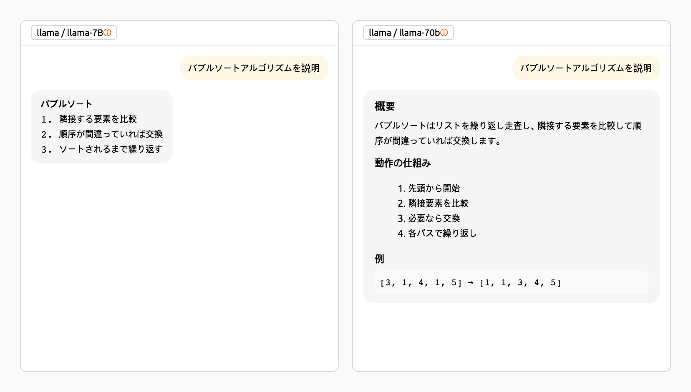
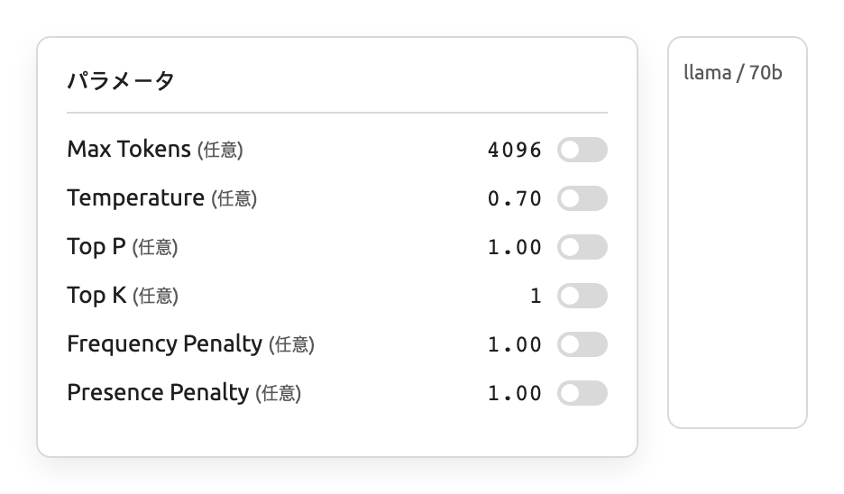
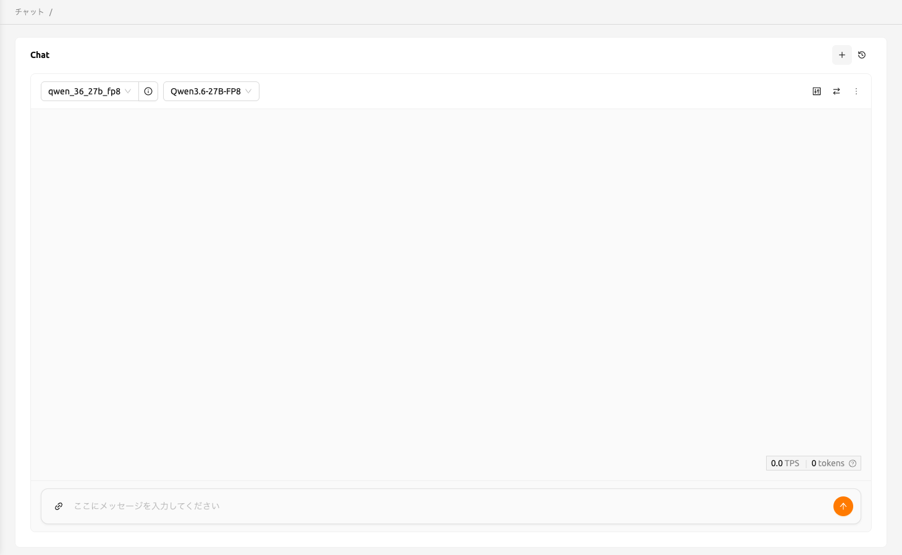
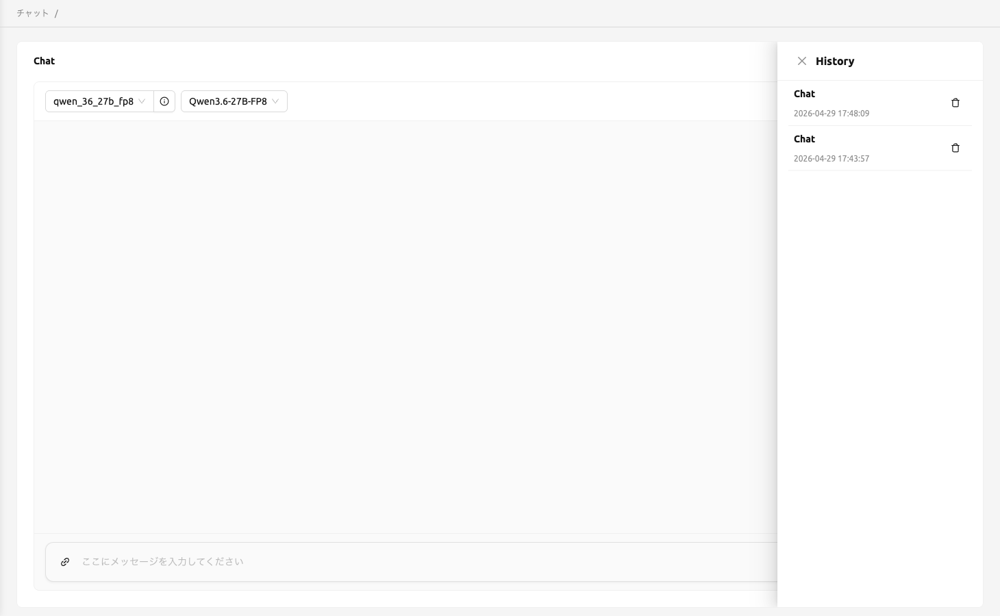

# チャットページ

バージョン25.05以降、'LLMプレイグラウンド'機能は独立したページに分離され、チャット（Chat）という名称に変更されました。
チャットページでは、さまざまなLLMモデルを一か所で便利に比較し、対話することができます。
これにより、ユーザーはBackend.AIが提供するサービスと多様な大規模言語モデル（LLM）を体験できます。

## モデルの選択

チャットページの各チャットカードの左上で、エンドポイントとモデルを選択できます。
エンドポイント欄をクリックすると、利用可能なエンドポイントを検索したり一覧から選択したりでき、モデルも同じ方法で選択できます。
選択したエンドポイントに対応するモデルがない場合は、OpenAI互換のベースパスおよびトークンを確認してから、'Refresh model info' ボタンをクリックしてください。

カスタムモデル設定を構成するために必要な入力項目については、以下の説明を参照してください。

- baseURL（任意）: モデルが配置されているサーバーのベースURLです。
  バージョン情報を必ず含めてください。
  例えば、OpenAI APIを利用する場合は https://api.openai.com/v1 と入力します。
- Token（任意）: モデルサービスにアクセスするための認証キーです。トークンは
  Backend.AIだけでなく、さまざまなサービスで生成できます。形式と生成プロセスは
  サービスによって異なる場合があるため、詳細については各サービスのガイドを参照してください。
  例えば、Backend.AIで生成されたサービスを利用する場合は、
  トークンの生成方法について[トークンの生成](#generating-tokens)セクションを参照してください。

## 比較チャットカードの追加と削除

新しい比較チャットカードを追加するには、右上にある比較アイコンボタンをクリックします。

チャットセッションを削除するには、チャットカードの右上にある'more'ボタンをクリックしてください。
ドロップダウンメニューが表示されるので、'Delete Chat'を選択するとチャットセッションを削除できます。
入力した内容がすべて削除されるため、ご注意ください。

## チャット履歴のクリア

'more'ボタンをクリックすると、'Clear chat'オプションが表示されます。
このオプションを選択すると、カードに紐づくすべてのチャット履歴を削除できます。
ただし、カードのセッション自体は引き続き有効なまま維持されます。

## 入力を同期する

右上にある'Sync Input'ボタンを使用すると、オプションが有効になっているチャットカード間で入力を同期できます。
'Sync input'が有効な状態では、いずれかのカードで'Enter'を押すか'Send'ボタンをクリックすると、
現在操作中のカードの入力が一括して送信されます。
この機能は、同じ入力データを使用してさまざまなモデルの出力を比較する際に便利です。

## パラメータ調整

右上のパラメータボタンをクリックすると、各モデルのパラメータを調整できます。Max Tokens、Temperature、Top P、Top Kなどのさまざまな値を設定できます。
同期機能を使用すると、同じモデルに対して異なるパラメータを適用し、その結果を比較できます。

## チャット履歴

新しいチャットを開始するには、右上にある'+'ボタンをクリックします。

すべてのチャット履歴はローカルストレージに保存され、右上の履歴ボタンをクリックすると以前のチャットにアクセスできます。

