

# チャットページ

チャットページでは、さまざまなLLMモデルを一か所で便利に比較し、対話することができます。
これにより、ユーザーはBackend.AIが提供するサービスと多様な大規模言語モデル（LLM）を体験できます。

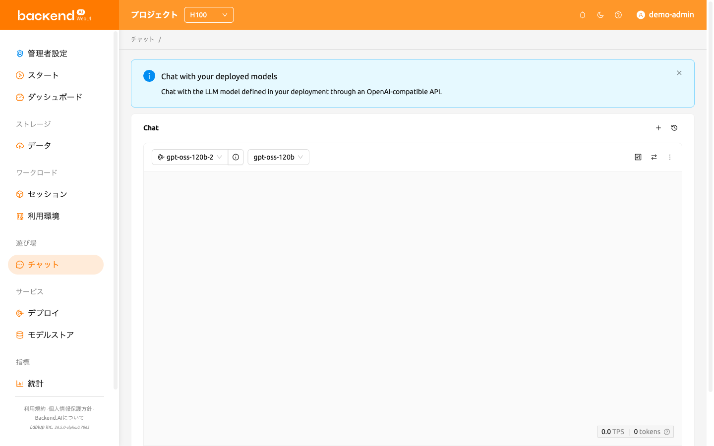

:::note
チャットページに初めてアクセスすると、ページ上部に次のような案内バナーが表示されます：
「デプロイしたモデルとチャットする — デプロイに定義されたLLMモデルと、OpenAI互換APIを通じてチャットできます。」
閉じるボタンをクリックするとバナーを非表示にでき、一度非表示にすると再表示されません。
:::

## モデルの選択

チャットページの各チャットカードの左上で、デプロイメントとモデルを選択できます。
**デプロイメント**フィールド（未選択のときは「エンドポイントの選択」と表示されます）をクリックすると、利用可能なデプロイメントが一覧表示されたドロップダウンが開きます。一覧の上部には検索ボックスが、下部にはデプロイメントの総数が表示されます。
デプロイメントを選択すると、モデルドロップダウンのヘッダーが「{デプロイメント名}のモデル」に更新され、そのデプロイメントに関連付けられたモデルが一覧表示されます。

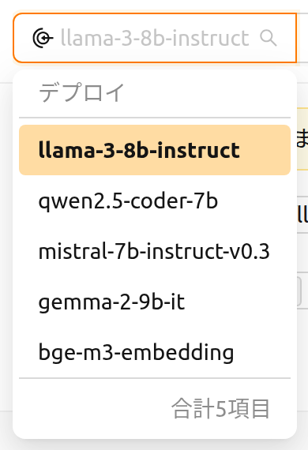

**デプロイメント**フィールドの横にある情報アイコンのボタン（**デプロイの詳細を表示**）をクリックすると、選択したデプロイメントの詳細ページが開きます。デプロイメントが選択されていない間、このボタンは無効です。
選択したデプロイメントが現在アクティブなプロジェクトとは別のプロジェクトに属している場合は、詳細ページを開く前に **別のプロジェクトに切り替えますか？** という確認ダイアログが表示されます。

### 一覧に表示されるデプロイメント

**デプロイメント**ドロップダウンには、プロジェクト内のすべてのデプロイメントではなく、今すぐ応答できるデプロイメントだけが表示されます。デプロイメントは、いずれかのレプリカが実際にトラフィックを処理しているとき、つまりレプリカの**ライフサイクルステータス**が*実行中*で、**トラフィックステータス**が*アクティブ*であるときに一覧に表示されます。2 つのステータスは互いに独立した軸であるため、両方の条件を満たす必要があります。*実行中*のレプリカでもトラフィックの対象から外されている場合があり、*アクティブ*と表示されたレプリカでもすでに実行されていない場合があるためです。レプリカのステータス軸の詳細については、[デプロイ](#model-serving)章を参照してください。

一覧に載せるかどうかをデプロイメント単位ではなくレプリカ単位で判断するため、新しい Revision の適用中もデプロイメントは選択できたままになります。新しい Revision を適用すると、その推論セッションはリソース待ちなどでしばらく保留のままになることがありますが、その間も前の Revision のレプリカがトラフィックを処理し続けます。そのためデプロイメントはドロップダウンに残り、まだ稼働しているレプリカとチャットを続けられます。

何も処理していないデプロイメントは表示されません。たとえば停止済みのデプロイメントや、希望レプリカ数が 0 のデプロイメントです。チャットカードですでに選択されているデプロイメントは、一覧から外れても選択状態と名前がそのまま保持されるため、そのカードがどのデプロイメントを指しているかを常に確認でき、以下で説明する警告も読めます。

### モデル接続設定

チャットカードにまだモデル一覧がない場合、メッセージ領域の上に設定パネルが表示されます。これはデプロイメントからモデル一覧を取得している最中と、取得に失敗した後の両方で表示されます。

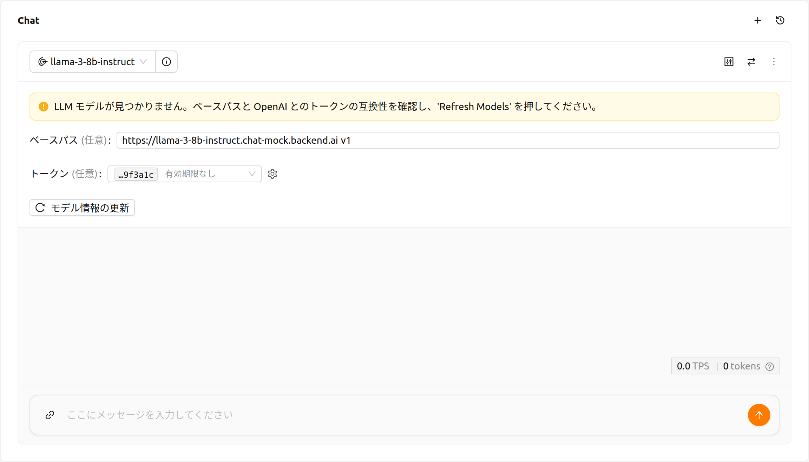

デプロイメント、モデル、同期のコントロールを含むチャットカードのヘッダーはモデル一覧を待たずにすぐ表示されるため、取得中でもこのパネルを操作できます。取得中は **モデル情報の更新** ボタンにローディング表示が出て、**ベースパス** と **トークン** の入力欄、およびカード下部のメッセージ入力欄が無効になります。取得が完了すると、いずれも再び使用できます。応答しないデプロイメントは一定時間後にタイムアウトして取得失敗として扱われるため、いつまでも待たされることなく設定を修正して再試行できます。

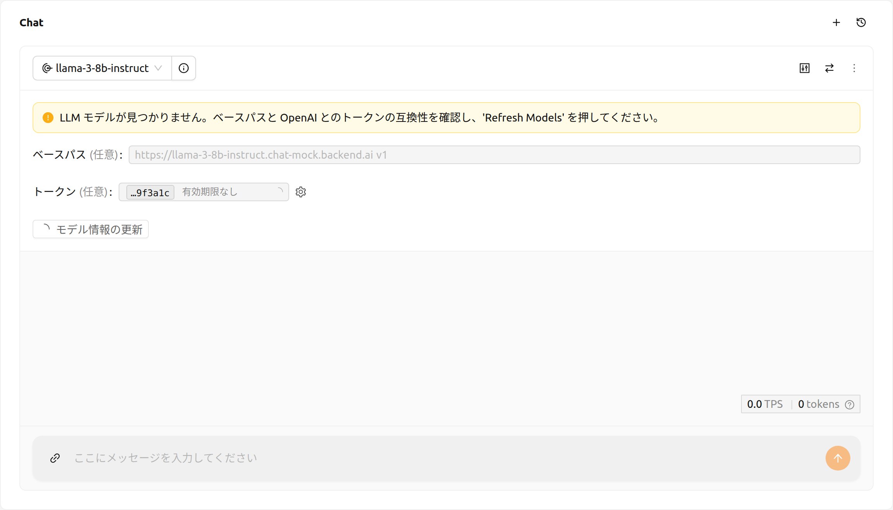

このパネルには以下の警告が表示される場合があります。

- **LLMモデルが見つかりません**（警告）：デプロイメントのエンドポイントからモデル一覧を取得できませんでした。パネルでベースパスまたはトークンを確認し、**モデル情報の更新** ボタンをクリックして再試行してください。この警告はパネルの一部であるため、最初の取得中にも表示されます。**モデル情報の更新** ボタンのローディングが終わってから対処してください。
- **希望レプリカ数が0**（警告）：選択したデプロイメントの希望レプリカ数が0に設定されており、応答できません。デプロイメント設定で希望レプリカ数を1以上に設定してください。

以下のアラートがチャットカードに表示される場合があります。

- **エンドポイントURLが無効**（エラー）：選択したデプロイメントのエンドポイントURLを解決できませんでした。デプロイメントが正しく設定されていることを確認してください。
- **ストリーミングエラー**（エラー）：モデルとの通信中にエラーが発生しました。メッセージで原因を確認し、アラートを閉じてから再試行してください。

カスタムモデル設定を構成するために必要な入力項目については、以下の説明を参照してください。

- **ベースパス**（任意）：リクエスト送信時にデプロイメントのエンドポイントURLに追加されるパスです。
  バージョン情報を必ず含めてください。
  例えば、OpenAI APIを利用する場合は `v1` と入力します。
- **トークン**（任意）：モデルサービスにアクセスするための認証キーです。デプロイメントを選択している場合、この項目はそのデプロイメントのアクセストークンを一覧表示する「トークンを選択」ドロップダウンになります。デプロイメントを選択していない場合は、トークンを直接貼り付けられる入力欄になります。トークンは Backend.AI だけでなくさまざまなサービスで生成でき、形式と生成プロセスはサービスによって異なるため、詳細については各サービスのガイドを参照してください。
   * 各項目には、トークンの末尾 6 文字と有効期限の日付が表示されます。すべてのトークンは先頭部分が同じで、入力欄の幅に合わせて省略されるため、この末尾が、見た目が同じ項目どうしを見分ける手がかりになります。有効期限のないトークンには、日付の代わりに **有効期限なし** と表示されます。
   * 項目にポインタを合わせると、発行日時と有効期限の全体を確認できます。
   * 期限切れのトークンは一覧に表示されません。値が空の場合は、最後に作成された有効なトークンが自動的に選択されます。
   * 入力欄の横の歯車アイコン（**アクセストークンの設定**）をクリックすると、デプロイ詳細ページのアクセストークンセクションが開き、新しいトークンを発行できます。戻ると一覧が読み直されるため、作成したばかりのトークンをすぐに選択できます。手順については[トークンの生成](#generating-tokens)セクションを参照してください。

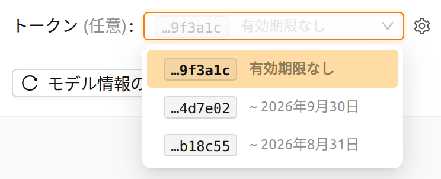

## 比較チャットカードの追加と削除

新しい比較チャットカードを追加するには、右上にある比較アイコンボタンをクリックします。

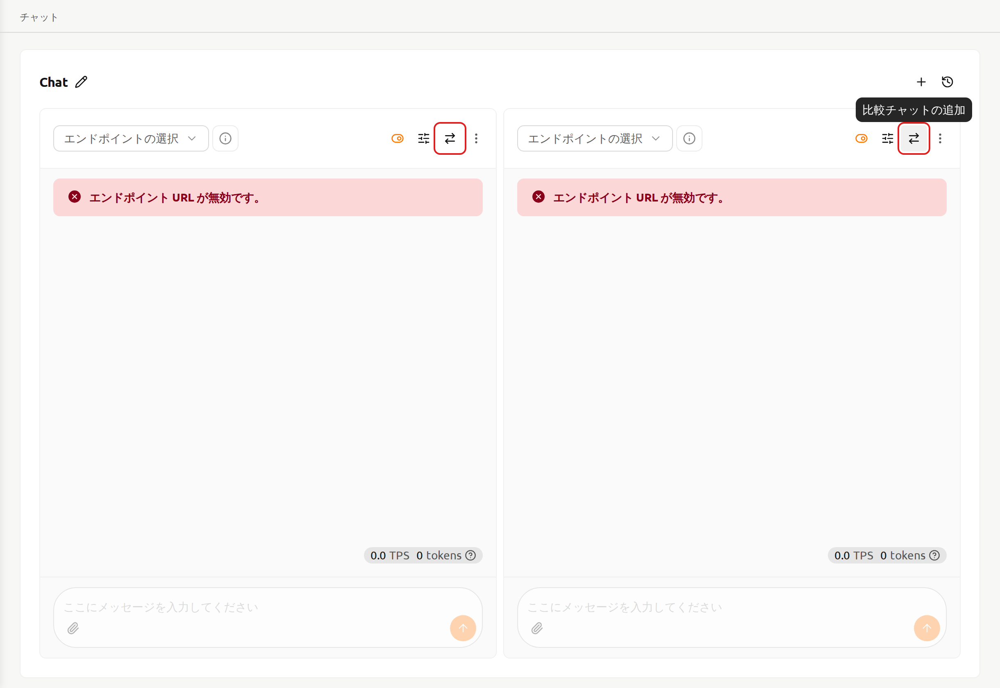

チャットセッションを削除するには、チャットカードの右上にある`more`ボタンをクリックしてください。
ドロップダウンメニューが表示されるので、`Delete Chat`を選択するとチャットセッションを削除できます。
入力した内容がすべて削除されるため、ご注意ください。

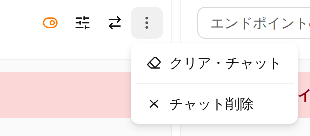

## チャット履歴のクリア

`more`ボタンをクリックすると、`クリア・チャット`オプションが表示されます。
このオプションを選択すると、カードに紐づくすべてのチャット履歴を削除できます。
ただし、カードのセッション自体は引き続き有効なまま維持されます。

## 入力を同期する

右上にある`チャット入力同期`ボタンを使用すると、オプションが有効になっているチャットカード間で入力を同期できます。
`チャット入力同期`が有効な状態では、いずれかのカードで`Enter`を押すか`Send`ボタンをクリックすると、
現在操作中のカードの入力が一括して送信されます。
この機能は、同じ入力データを使用してさまざまなモデルの出力を比較する際に便利です。

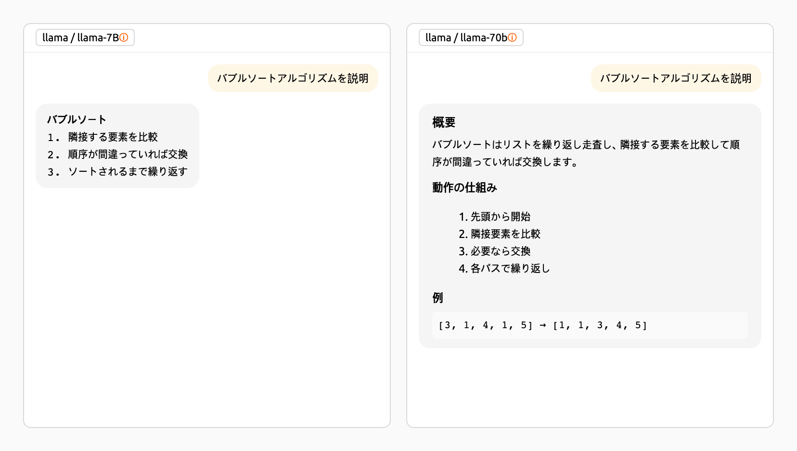

## パラメータ調整

右上のパラメータボタンをクリックすると、各モデルのパラメータを調整できます。Max Tokens、Temperature、Top P、Top Kなどのさまざまな値を設定できます。
同期機能を使用すると、同じモデルに対して異なるパラメータを適用し、その結果を比較できます。

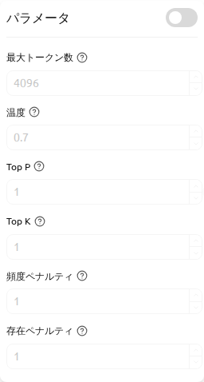

## チャット履歴

新しいチャットを開始するには、右上にある`+`ボタンをクリックします。

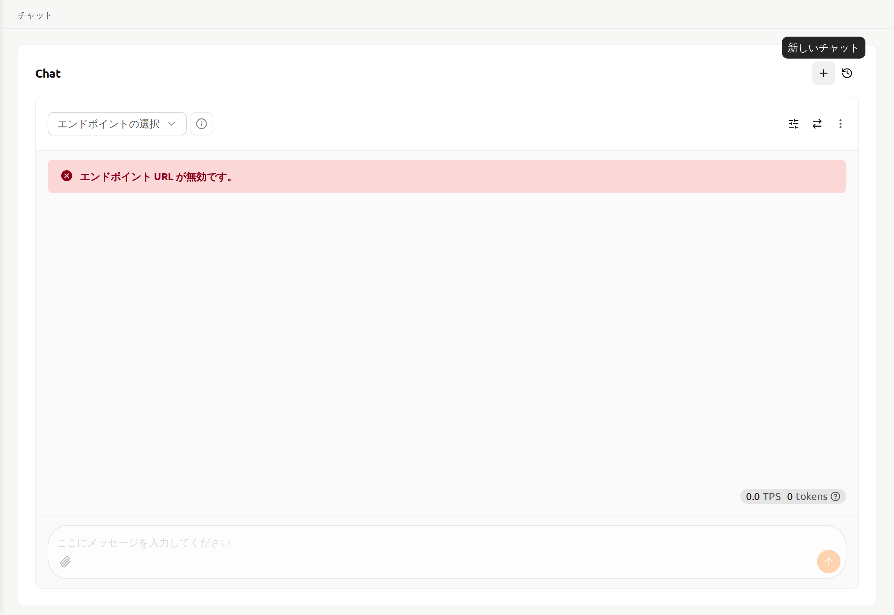

すべてのチャット履歴はローカルストレージに保存され、右上の履歴ボタンをクリックすると以前のチャットにアクセスできます。

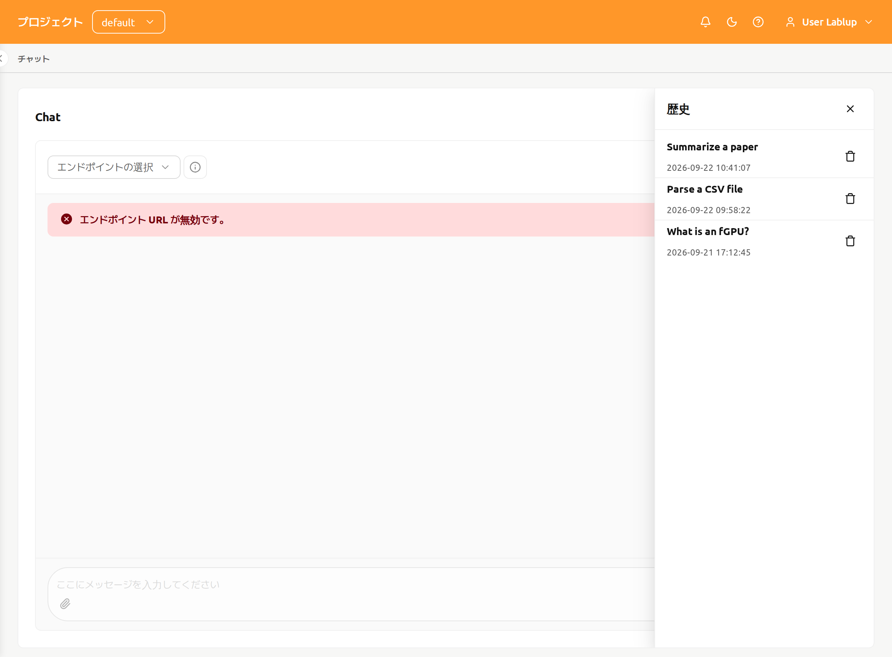