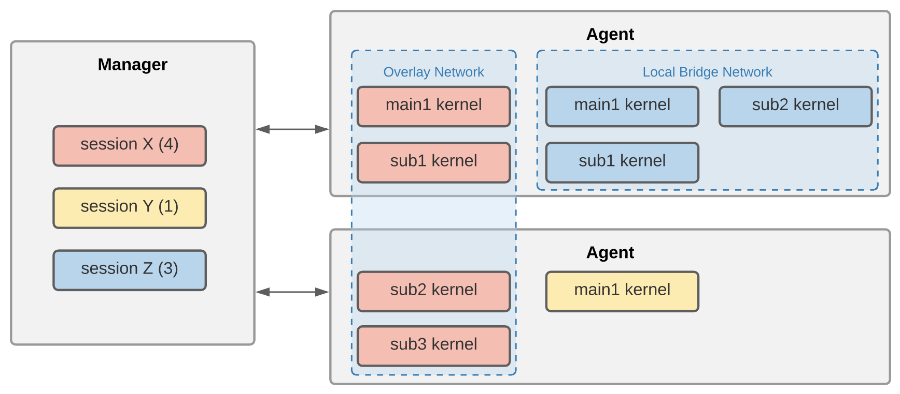
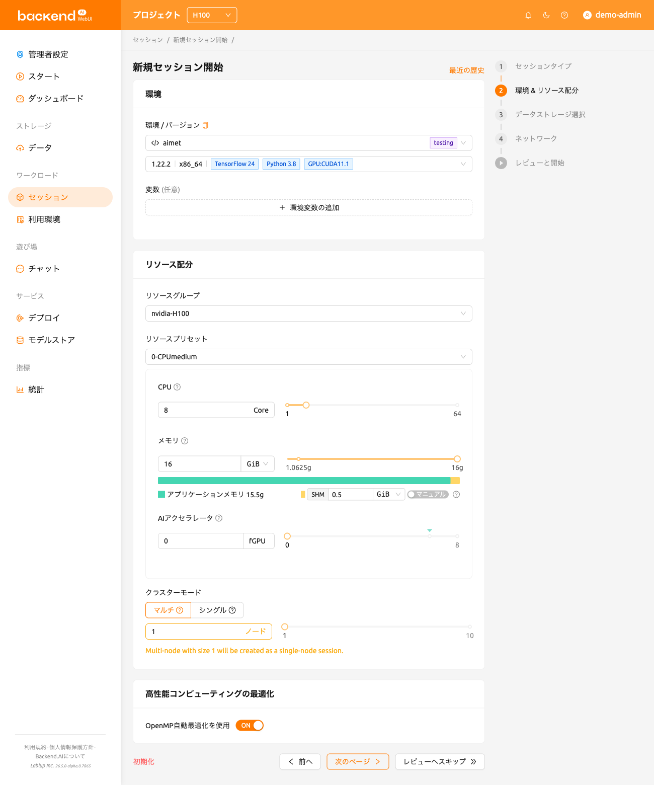
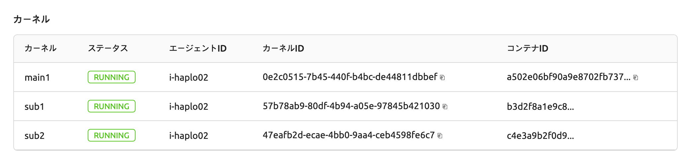
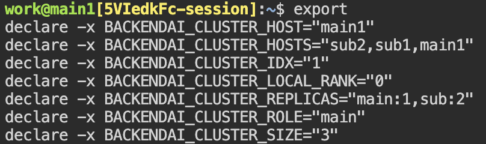
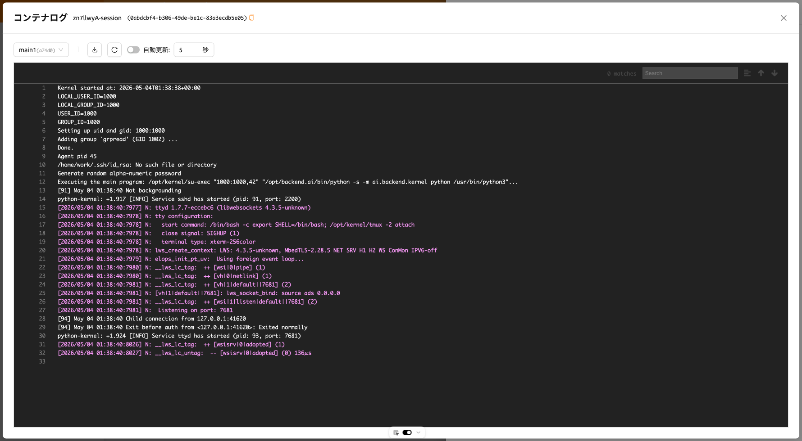

# Backend.AI クラスターコンピュートセッション

:::note
クラスターコンピュートセッション機能は、Backend.AIサーバー 20.09 以降でサポートされています。
:::

### Backend.AI クラスター コンピュート セッションの概要

Backend.AIは、分散コンピューティング／トレーニングタスクをサポートするためにクラスターコンピュートセッションを提供しています。クラスターセッションは複数のコンテナで構成され、それぞれが複数のエージェントノードにわたって作成されます。クラスターセッション配下のコンテナは、動的に作成されるプライベートネットワークを通じて自動的に相互接続されます。また、一時的なドメイン名（`main1`、`sub1`、`sub2` など）も付与されるため、SSH接続などのネットワークタスクを簡単に実行できます。コンテナ間のSSH接続に必要なすべての秘密鍵や各種設定は、自動的に生成されます。

Backend.AI クラスターセッションの詳細については、以下を参照してください。

- クラスタセッション下のコンテナは、リソースグループに属する1台以上のエージェントノードにわたって作成されます。
- クラスターセッションは、1つのメインコンテナ（`main1`）と1つ以上のサブコンテナ（`subX`）で構成されます。
- クラスターセッションの下にあるすべてのコンテナは、同じ量のリソースを割り当てて作成されます。上の図では、セッションXの4つのコンテナすべてが同じ量のリソースで作成されています。
- クラスターセッション内のすべてのコンテナは、コンピュートセッションを作成するときに指定された同じデータフォルダーをマウントします。
- クラスターセッション下のすべてのコンテナはプライベートネットワークに結びつけられます。

   * メインコンテナの名前は `main1` です。
   * サブコンテナは `sub1`、`sub2` のように昇順で名前が付けられます。
   * クラスターセッションを構成するコンテナ間にファイアウォールはありません。
   * ユーザーはメインコンテナに直接接続でき、サブコンテナにはメインコンテナからのみ接続できます。

- クラスタセッションには、2つのモード/タイプがあります。

   * 単一ノードクラスターセッション: 1つの同一のエージェントノード上で2つ以上のコンテナから構成されるクラスターセッション。上の図では、これはローカルブリッジネットワークにバインドされたセッションZです。
   * マルチノードクラスターセッション: 異なるエージェントノード上の2つ以上のコンテナで構成されるクラスターセッション。上の図では、これはオーバーレイネットワークにバインドされているセッションXです。
   * 1 つのコンテナしかない計算セッションは、クラスタセッションではなく通常の計算セッションとして分類されます。上の図では、これがセッション Y です。

- 単一ノードクラスターセッションは、以下の場合に作成されます。

   * コンピュートセッション作成時に「クラスターモード」フィールドで「シングルノード」が選択されたとき。すべてのコンテナを同時に作成できる十分なリソースを持つ単一のエージェントが存在しない場合、セッションは保留（`PENDING`）状態のままとなります。
   * 「マルチノード」がクラスター モードとして選択されているが、全てのコンテナを同時に作成できる十分なリソースを持つ単一のエージェントが存在する場合、全てのコンテナはそのエージェントにデプロイされる。これは外部ネットワークへのアクセスを排除し、ネットワーク遅延を可能な限り削減するためである。

クラスターセッション内の各コンテナには、以下の環境変数があります。これを参照してクラスターの構成や現在接続されているコンテナ情報を確認することができます。

- `BACKENDAI_CLUSTER_HOST`: 現在のコンテナの名前（例: `main1`）
- `BACKENDAI_CLUSTER_HOSTS`: 現在のクラスターセッションに属するすべてのコンテナの名前（例: `main1,sub1,sub2`）
- `BACKENDAI_CLUSTER_IDX`: 現在のコンテナの数値インデックス（例: `1`）
- `BACKENDAI_CLUSTER_MODE`: クラスターセッションのモード／タイプ（例: `single-node`）
- `BACKENDAI_CLUSTER_ROLE`: 現在のコンテナのタイプ（例: `main`）
- `BACKENDAI_CLUSTER_SIZE`: 現在のクラスターセッションに属するコンテナの総数（例: `4`）
- `BACKENDAI_KERNEL_ID`: 現在のコンテナのID（例: `3614fdf3-0e04-...`）
- `BACKENDAI_SESSION_ID`: 現在のコンテナが属するクラスターセッションのID（例: `3614fdf3-0e04-...`）。メインコンテナの `BACKENDAI_KERNEL_ID` は `BACKENDAI_SESSION_ID` と同じです。

### Backend.AI クラスターコンピュートセッションの使用

このセクションでは、ユーザーGUIを通じて実際にクラスタコンピュートセッションを作成および使用する方法を見ていきます。

セッションページで、セッション作成ダイアログを開き、通常の計算セッションを作成するのと同じ方法で設定します。このときに設定するリソース量は、**1つのコンテナ**に割り当てられる量です。例えば、4つのCPUを設定した場合、クラスタセッションの下で各コンテナに4コアが割り当てられます。これは、クラスタ計算セッション全体に割り当てられるリソース量ではないことに注意してください。クラスタ計算セッションを作成するには、ここで設定したリソース量のN倍に相当するサーバーリソースが必要です（Nはクラスタのサイズです）。データの安全保存のためにデータフォルダーをマウントすることを忘れないでください。

下部にある「クラスターモード」フィールドで、作成したいクラスターのタイプを選択できます。

- 単一ノード: すべてのコンテナは1つのエージェントノード上に作成されます。
- マルチノード：コンテナはリソースグループ内の複数のエージェントノードにわたって作成されます。ただし、すべてのコンテナを1つのエージェントノードで作成できる場合は、すべてそのノード上で作成されます。これはコンテナ間のネットワーク遅延を最小限に抑えるためです。

その下の「クラスターサイズ」を設定します。3に設定すると、メインコンテナを含む合計3つのコンテナが作成されます。これらの3つのコンテナは、プライベートネットワークで結合され、1つの計算セッションを形成します。

LAUNCHボタンをクリックしてコンピュートセッションの作成リクエストを送信し、しばらく待つとクラスターセッションが作成されます。セッションが作成されると、セッション詳細ページで作成されたコンテナを確認できます。

先ほど作成したコンピュートセッションでターミナルアプリを開いてみましょう。環境変数を確認すると、上記のセクションで説明した `BACKENDAI_CLUSTER_*` 変数が設定されていることが確認できます。各環境変数の意味と値を、上記の説明と比較してみてください。

また、`sub1` コンテナにもSSHで接続できます。別途SSH設定を行う必要はなく、`ssh sub1` コマンドを実行するだけで接続できます。`work@` の後のホスト名が変更されたことを確認でき、サブコンテナのシェルが表示されていることが分かります。

このように、Backend.AI はクラスタコンピューティングセッションの作成を容易にします。クラスタ計算セッションを通じて分散学習と計算を実行するには、TensorFlow/PyTorch などの ML ライブラリが提供する分散学習モジュールや、Horovod、NNI、MLFlow などの追加のサポートソフトウェアが必要であり、そのソフトウェアを利用できる方法でコードを記述する必要があります。慎重に書く必要があります。Backend.AI は分散学習に必要なソフトウェアを含むカーネルイメージを提供しているため、そのイメージを使用して優れた分散学習アルゴリズムを作成することができます。

### コンテナごとのログを表示

バージョン24.03から、ログモーダルで各コンテナのログを確認できます。これにより、`main` コンテナだけでなく `sub` コンテナで何が起こっているかを把握するのに役立ちます。

