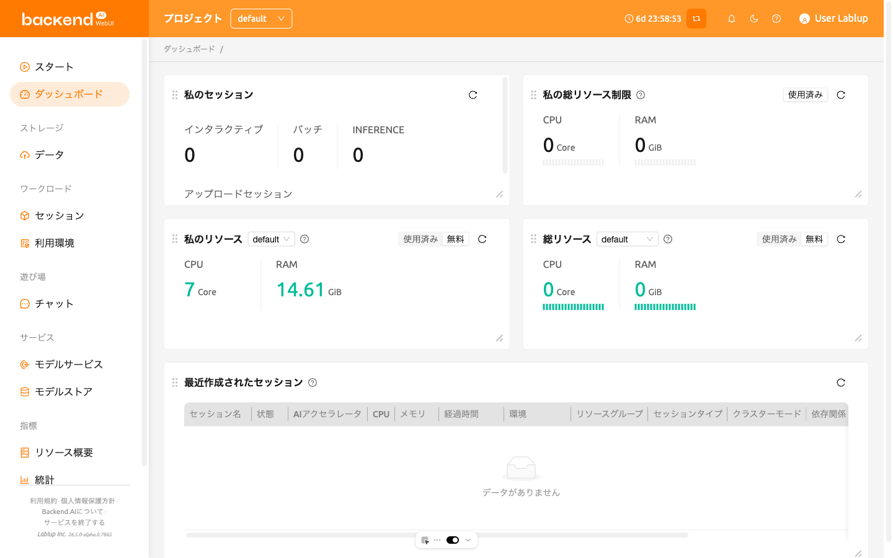
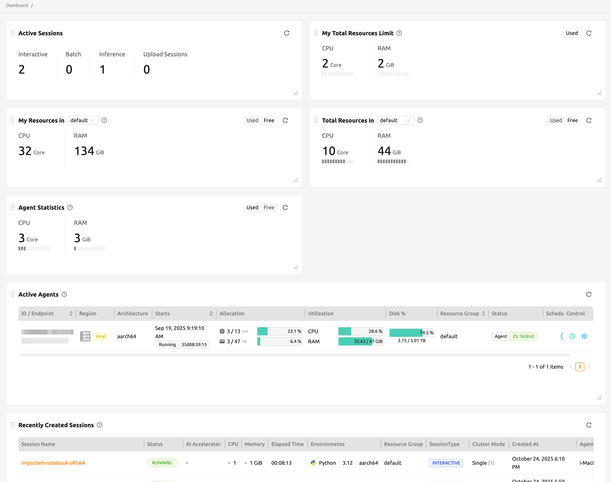

# Dashboard

The **Dashboard** provides an at-a-glance summary of your current resource usage,
available limits, and session information across all your projects and resource groups.
It helps you quickly understand how your computing resources are being utilized
and monitor your recent activities in the system.
Click the refresh icon in any panel to update the displayed data if it seems outdated.

The page is composed of several main panels:

- My セッション:
    Shows the number of active sessions by type,
    such as *インタラクティブ*, *バッチ*, *推論*, and *Upload*.
    You can quickly see how many sessions of each type are currently running.

- My Total Resources Limit:
    Displays the total used and free resources across all your projects and resource groups.
    When multiple limits (domain, project, or keypair) apply,
    the system uses the **most restrictive** available limit to calculate the remaining resources.

- My Resources in Resource Group:
    Shows your current resource usage and remaining capacity
    within the selected resource group of your current project.
    You can switch groups using the dropdown menu.

- Total Resources in Resource Group:
    Summarizes the overall used and free resources in the selected resource group.
    The data is aggregated from all agents that belong to the group.

- Recently Created セッション:
    Lists the most recently created active sessions within the current project.
    Provides session details such as name, status, CPU/memory usage, environment, resource group,
    session type, and creation time.
    By default, the latest 5 active sessions are displayed.

For super 管理者s, additional information is available.

Except for 'Active セッション', 'Agent 統計', and 'Active Agents', the remaining panels
display the same information as the ユーザー dashboard.

- Active セッション:
    Shows the total number of active sessions across current projects,
    categorized by session type.

- Agent 統計:
    Provides all used resources across all agents in the system.
    The values represent the total used resources by all active sessions.

- Active Agents:
    Lists all currently active agents in the system.