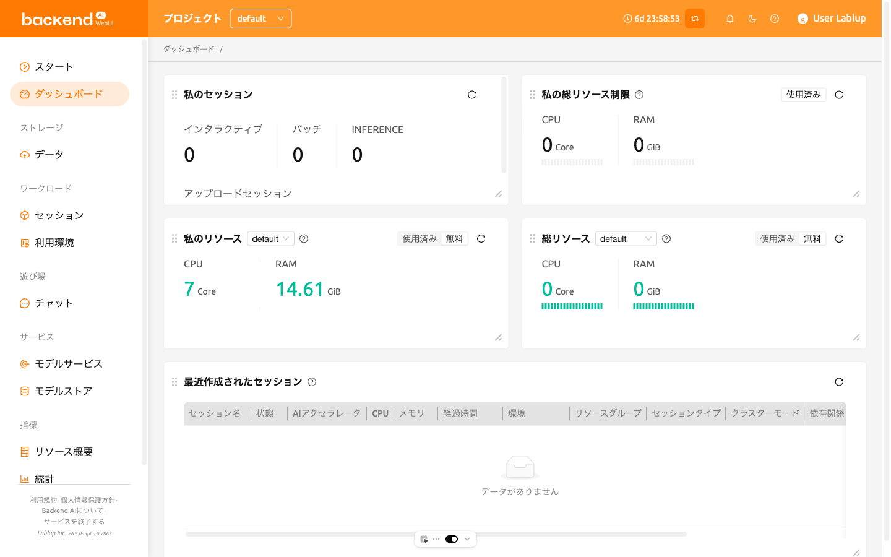

# ダッシュボード

**ダッシュボード**は、すべてのプロジェクトとリソースグループにおける現在のリソース使用状況、利用可能な上限、セッション情報の概要を一目で確認できるページです。コンピューティングリソースの使用状況を素早く把握し、システム内の最近の活動をモニタリングするのに役立ちます。

このページは以下の主要パネルで構成されています：

- **私のセッション:**
    インタラクティブ、バッチ、推論、アップロードなど、タイプ別にアクティブなセッション数を表示します。各タイプのセッションがいくつ実行中かをすばやく確認できます。

- **私の総リソース制限:**
    すべてのプロジェクトとリソースグループを合算した総使用量と空きリソースを表示します。ドメイン、プロジェクト、キーペアなど複数の上限が同時に適用される場合、システムは**最も制限的な上限**を基準に残りのリソースを計算します。

- **リソースグループの私のリソース:**
    現在のプロジェクトの選択されたリソースグループにおけるリソース使用量と残りの容量を表示します。ドロップダウンメニューでグループを切り替えることができます。

- **リソースグループの総リソース:**
    選択されたリソースグループ全体の使用量と空き容量を要約表示します。グループに属するすべてのエージェントのデータを集計した値です。

:::note
**リソースグループの総リソース**パネルは、システム構成によって表示されない場合があります。
:::

- **最近作成されたセッション:**
    現在のプロジェクトで最近作成されたアクティブなセッション一覧を表示します。セッション名、ステータス、CPU/メモリ使用量、環境、リソースグループ、セッションタイプ、作成日時などの詳細を確認できます。デフォルトでは最新の5つのアクティブなセッションが表示されます。

## 自動更新

ダッシュボードは**15秒**ごとにすべてのパネルデータを自動的に更新します。これにより、手動操作なしに常に最新の情報を確認できます。

## ダッシュボードレイアウトのカスタマイズ

パネルの再配置やサイズ変更により、ダッシュボードのレイアウトをお好みに合わせてカスタマイズできます。

- **パネルの移動**: パネルのヘッダーをドラッグして、ボード上の位置を変更できます。
- **パネルのサイズ変更**: パネルの右下隅をドラッグしてサイズを調整できます。各パネルにはコンテンツの可読性を確保するための最小サイズが設定されています。

カスタマイズされたレイアウトは自動的に保存され、ブラウザセッション間で保持されます。レイアウトはユーザーごとに保存されるため、各ユーザーが独自の配置を設定できます。

:::tip
WebUIの更新で新しいダッシュボードパネルが追加された場合、保存済みのカスタムレイアウトが
あっても、新しいパネルは自動的にダッシュボードに表示されます。
:::
