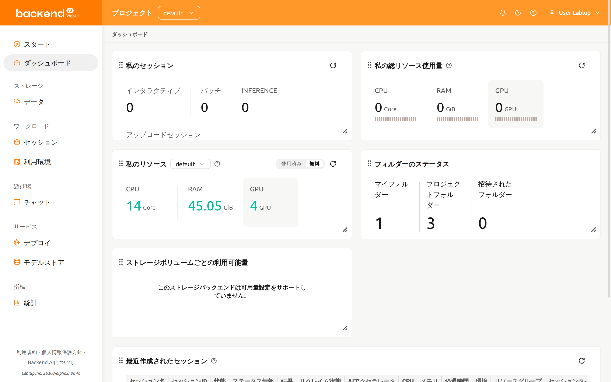
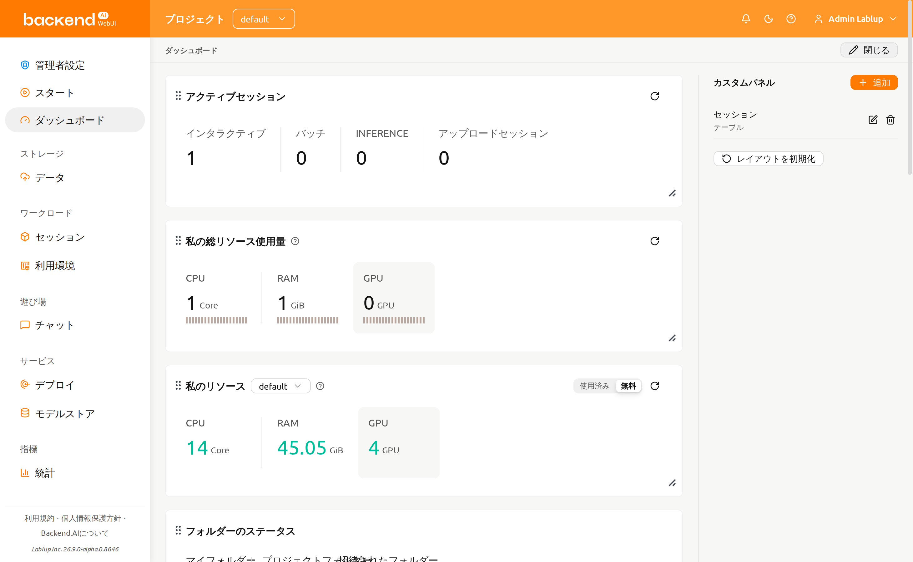
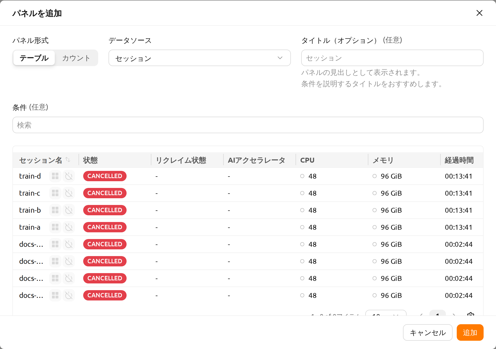

# ダッシュボード

**ダッシュボード**は、すべてのプロジェクトとリソースグループにおける現在のリソース使用状況、利用可能な上限、セッション情報の概要を一目で確認できるページです。コンピューティングリソースの使用状況を素早く把握し、システム内の最近の活動をモニタリングするのに役立ちます。

このページは以下の主要パネルで構成されています：

- **私のセッション:**
    インタラクティブ、バッチ、推論、アップロードなど、タイプ別にアクティブなセッション数を表示します。各タイプのセッションがいくつ実行中かをすばやく確認できます。

- **私の総リソース使用量:**
    すべてのプロジェクトで現在使用しているリソースを表示します。各リソースの数値の下には使用量バーが表示され、バーにマウスを合わせると総リソース制限に対する使用量を確認できます。ドメイン、プロジェクト、キーペアなど複数の制限が同時に適用される場合は、**最も厳しい制限**が適用されます。

- **リソースグループの私のリソース:**
    現在のプロジェクトの選択されたリソースグループにおけるリソース使用量と残りの容量を表示します。ドロップダウンメニューでグループを切り替えることができます。

- **リソースグループの総リソース:**
    選択されたリソースグループ全体の使用量と空き容量を要約表示します。グループに属するすべてのエージェントのデータを集計した値です。

:::note
**リソースグループの総リソース**パネルは、システム構成によって表示されない場合があります。
:::

- **最近作成されたセッション:**
    現在のプロジェクトで最近作成されたアクティブなセッション一覧を表示します。セッション名、ステータス、CPU/メモリ使用量、環境、リソースグループ、セッションタイプ、作成日時などの詳細を確認できます。デフォルトでは最新の5つのアクティブなセッションが表示されます。

スーパー管理者としてログインしている場合、ダッシュボードページには通常のユーザーパネルに加えて、**エージェントの統計**および**アクティブなエージェント**パネルも表示されます。これらのパネルは、クラスター全体のエージェントの状態とリソース使用状況を示します。

## ダッシュボードレイアウトのカスタマイズ

ボードは特別なモードに切り替えなくても、いつでも並べ替えられます：

- **パネルの移動**: パネルのヘッダーをドラッグして、ボード上の位置を変更できます。
- **パネルのサイズ変更**: パネルの右下隅をドラッグしてサイズを調整できます。各パネルにはコンテンツの可読性を確保するための最小サイズが設定されています。

<!-- TODO: Capture screenshot of the dashboard in edit mode (board + edit sidebar) -->

カスタマイズされたレイアウトは自動的に保存され、ブラウザセッション間で保持されます。レイアウトはユーザーごとに保存されるため、各ユーザーが独自の配置を設定できます。配置をデフォルトに戻すには、編集サイドバー下部の**レイアウトを初期化**ボタンをクリックして確認します。レイアウトを初期化してもカスタムパネルは削除されません。

:::tip
WebUIの更新で新しいダッシュボードパネルが追加された場合、保存済みのカスタムレイアウトが
あっても、新しいパネルは自動的にダッシュボードに表示されます。
:::

### カスタムパネル

:::note[実験的機能]
ユーザー設定ページの[実験的特徴](#experimental-features)セクションで
**カスタムダッシュボードパネル**を有効にするまで、カスタムパネル機能全体は
非表示になります。後でこの機能を無効にすると、既存のカスタムパネルは
削除されずに非表示になり、再度有効にすると保存されたボード上の位置のまま
再表示されます。
:::
ページ右上の**編集**ボタンをクリックすると、ボードの右側にカスタムパネルのサイドバーが開き、**閉じる**をクリックすると再び非表示になります。サイドバーにはカスタムパネルの一覧が表示されます。カスタムパネルは、選択したデータソースを指定した条件で絞り込んで表示します。パネルにはタイトルとデータのみが表示されるため、条件がわかるタイトルを付けることをおすすめします。

パネルを追加するには、サイドバーの**追加**ボタンをクリックします。パネルのダイアログには以下の項目があります。**パネル形式**と**データソース**は必須項目で、両方を選択しないとダイアログを送信できません。

- **データソース**: パネルに表示するデータソースです。**セッション**、**デプロイ**、**データ＆ストレージ**から選択します。
- **パネル形式**: データソースの表示方法です。**テーブル**または**カウント**から選択します。**セッション**データソースの場合は **グリッド** も選択できます。
- **タイトル**: パネルのタイトル（オプション）です。省略した場合はデータソース名が使用されます。
- **条件**: パネルに表示する項目を絞り込むプロパティフィルターです。

入力項目の下のライブプレビューには、現在の条件に一致する行が表示されます。プレビューで列をソートすると、そのソート順がパネルに適用されます。**追加**ボタンをクリックすると、パネルがボードに配置されます。

<!-- TODO: Capture screenshot of the add-panel dialog with the live preview -->

**デプロイ**パネルは、デプロイページと同じテーブル（名前、状態、レプリカ概要、モデル、作成日時）を使用して、プロジェクトのモデルデプロイを一覧表示します。デプロイの名前をクリックすると、その詳細ページが開きます。条件フィルターでは、名前、タグ、エンドポイントURL、公開を指定できます。

**グリッド**を選択すると、セッションリソースグリッドが表示されます。条件に一致する各セッションに割り当てられたリソースを、使用率に応じて色分けされたユニットセルとして表示します。セッションをクリックすると、テーブルで行をクリックしたときと同様に詳細ドロワーが開きます。グリッドは条件に一致するセッションのうち最大100件までを表示し、それを超える場合は件数の通知が表示されます。

グリッドの表示設定（リソース／カーネルモード、表示するリソースまたはメトリック、メモリ単位、レイアウト）は、パネルの追加／編集ダイアログのライブプレビューで指定し、パネルとともに保存されます。パネル自体にはこれらの設定を変更するコントロールがないため、別の表示にしたい場合はパネルをもう一つ追加してください。

:::note
**グリッド**は実験的機能です。**パネル形式**の選択肢に表示されるのは、[実験的特徴](#experimental-features)で**Session resource grid view** がオンになっている場合のみです。後でこの設定をオフにしても、作成済みのグリッドパネルは保存された設定を維持したまま、設定を再度オンにするまでセッションテーブルとして表示されます。
:::

パネルのデータソース、パネル形式、条件、タイトルを後から変更するには、サイドバーの該当パネルの横、またはボード上のパネルヘッダーにある鉛筆（**編集**）アイコンをクリックし、変更内容を保存します。パネルを削除するには、ゴミ箱（**削除**）アイコンをクリックし、確認ポップアップで承認します。

:::note
**セッション**および**デプロイ**パネルは現在のプロジェクトのデータを表示し、すべてのプロジェクトメンバーが利用できます。**データ＆ストレージ**パネルはスーパー管理者のみ利用できます。現在の権限で照会できないデータソースのパネルは、サイドバーの一覧には残りますが、ボードには表示されません。
:::

## 自動更新

ダッシュボードのデータは15秒ごとに自動的に更新されるため、ページを再読み込みしなくてもパネルには常に最新の活動が反映されます。カスタムパネルも組み込みパネルと同じサイクルで更新されます。
