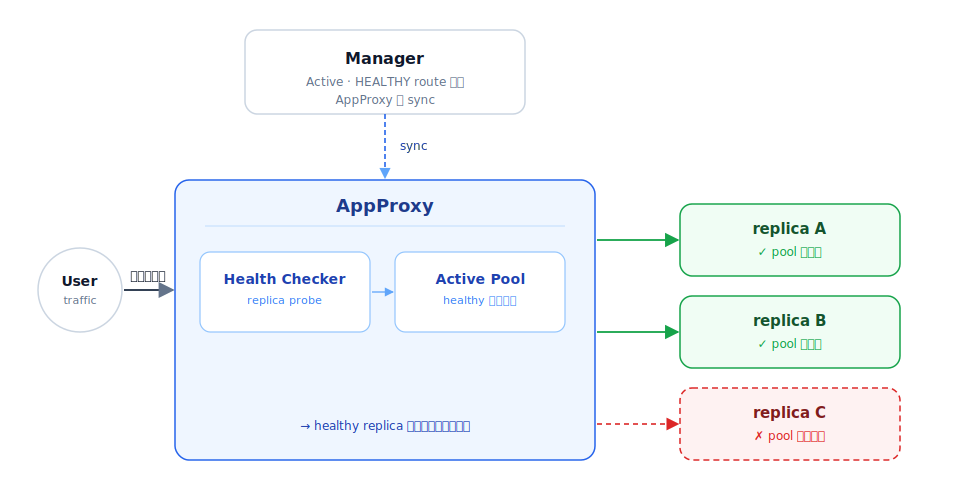
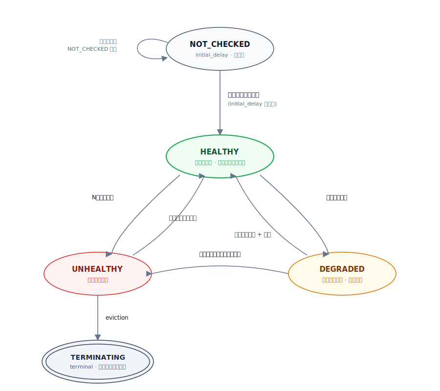
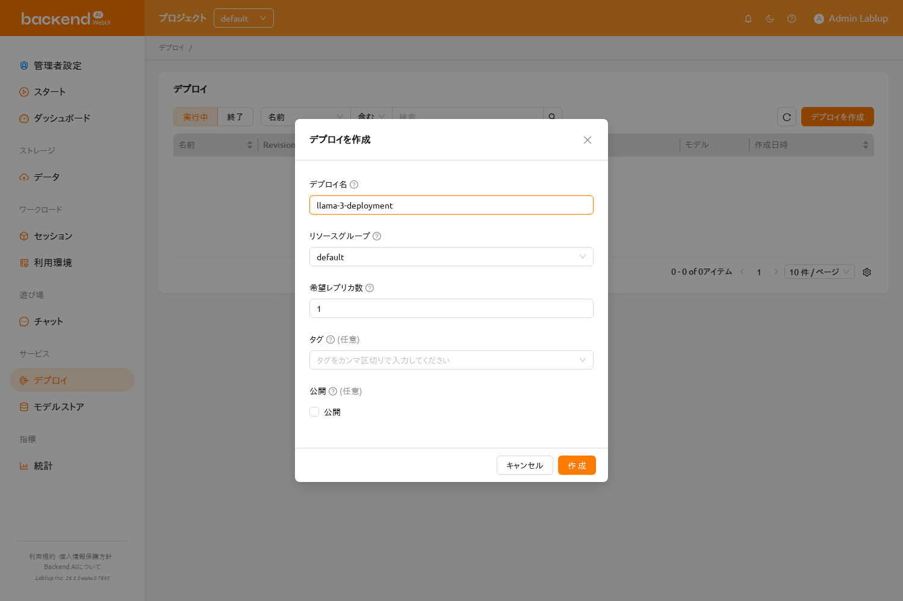
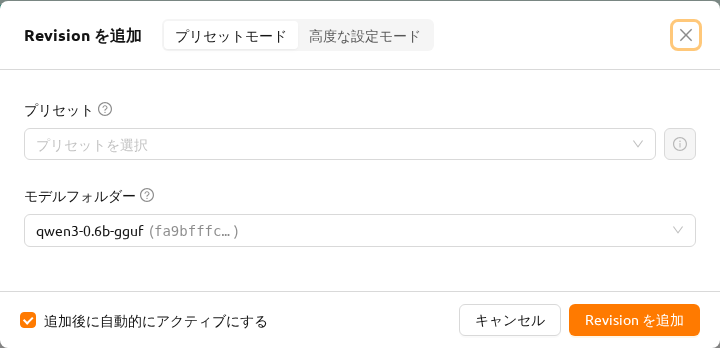
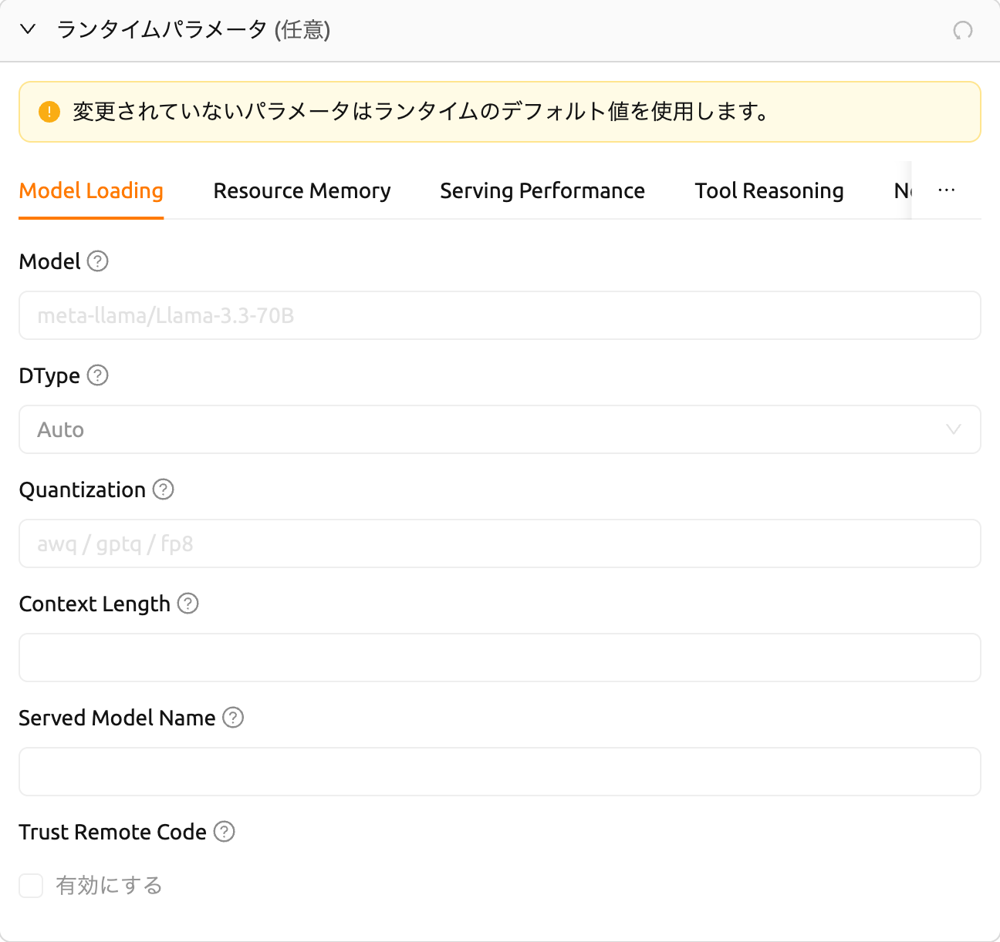
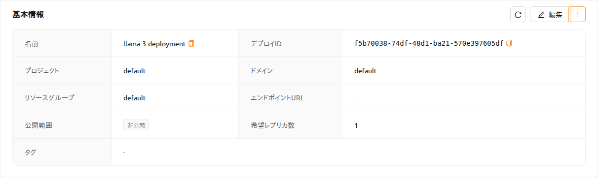
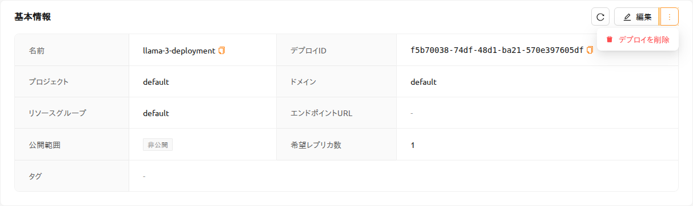
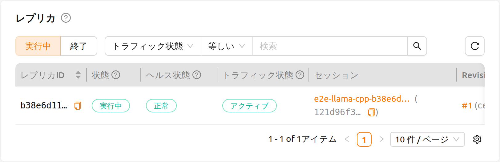
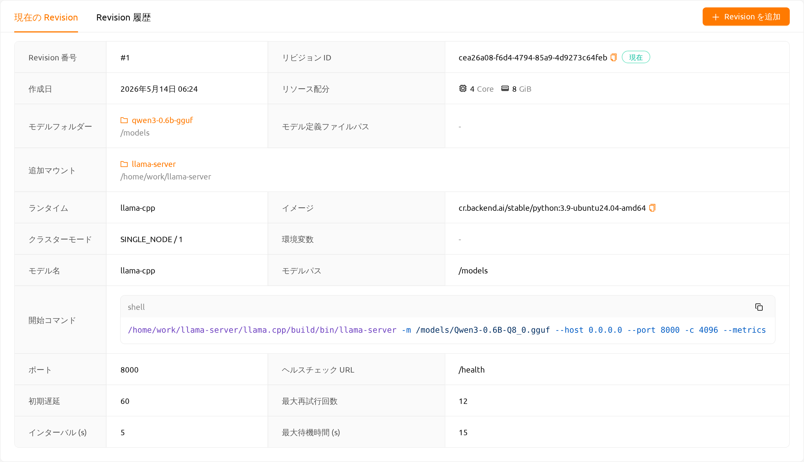
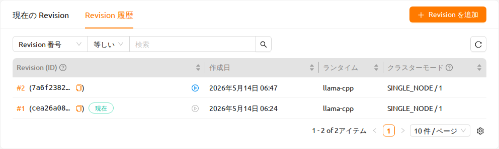

<a id="model-serving"></a>

# デプロイ

## デプロイの概要

Backend.AI では、**デプロイ（Deployments）** 機能を通じて AI モデルを推論サービスとしてデプロイできます。デプロイは、モバイルアプリやウェブサービスのバックエンド、社内ツールなどのエンドユーザーアプリケーションが推論を実行するために呼び出せる、安定したエンドポイント URL の背後にモデルを公開します。


デプロイは通常のコンピュートセッションを拡張し、自動メンテナンス、レプリカのスケーリング、そしてレプリカの増減に左右されない永続的なエンドポイントアドレスを提供します。必要なスケーリングパラメータを指定するだけで、Backend.AI が内部の推論セッションを自動的に作成・監視・終了するため、セッションを手動で管理する必要はありません。

## デプロイの作成と利用方法

バージョン26.4.0以降、別途設定ファイルなしでもデプロイを簡単に作成できます。

**クイックデプロイ（推奨）**: [モデルストア](#model-store)で事前構成されたモデルを閲覧し、`デプロイ（Deploy）`ボタンをクリックするだけでデプロイできます。

**手動デプロイ**: デプロイページの`デプロイを作成`ボタンをクリックして**デプロイ作成**モーダルを開きます。デプロイ作成後は、デプロイ詳細ページで`リビジョンを追加（Add Revision）`をクリックし、`vLLM`や`SGLang`などのランタイムバリアントを選択してリビジョンを追加します。

一般的なワークフローは次のとおりです：

1. デプロイを作成します（名前、公開設定、リソースグループの設定）。
2. リビジョンを追加します（ランタイムバリアント、イメージ、リソース、モデルストレージの設定）。
3. （デプロイが公開されていない場合）トークンを生成します。
4. （エンドユーザー向け）サービスエンドポイントにアクセスしてサービスを確認します。
5. （必要に応じて）新しいリビジョンを追加するか、以前のリビジョンを適用します。
6. （必要に応じて）デプロイを終了します。

<details>
<summary>高度な設定: モデル定義ファイルおよびサービス定義ファイルの使用（Customランタイム）</summary>

`Custom`ランタイムバリアントを使用する場合や、より詳細な制御が必要な場合は、モデル定義ファイルとサービス定義ファイルを作成して使用できます：

1. モデル定義ファイルを作成します。
2. サービス定義ファイルを作成します。
3. 定義ファイルをモデルタイプフォルダーにアップロードします。
4. リビジョンを追加する際に、`Custom`ランタイムバリアントを選択し、**Config ファイルを使用**モードを選択します。

詳細については、[モデル定義ファイルの作成](#model-definition-guide)および[サービス定義ファイルの作成](#service-definition-file)セクションを参照してください。

</details>

<details>
<summary>参考: Custom ランタイム構成ファイルガイド</summary>

<a id="model-definition-guide"></a>

### モデル定義ファイルの作成

:::note
24.03以降、モデル定義ファイル名を設定できます。モデル定義ファイルパスで
他の入力フィールドを入力しない場合、システムは`model-definition.yml`または
`model-definition.yaml`と見なします。
:::

モデル定義ファイルには、推論セッションを自動的に開始、初期化、およびスケーリングするためにBackend.AIシステムで必要な構成情報が含まれています。これは推論サービスエンジンを含むコンテナイメージとは独立して、モデルタイプフォルダーに保存されます。これにより、特定の要件に基づいて異なるモデルをエンジンが提供できるようになり、モデルが変更されるたびに新しいコンテナイメージを構築してデプロイする必要がなくなります。ネットワークストレージからモデル定義とモデルデータをロードすることで、自動スケーリング中にデプロイメントプロセスを簡素化し、最適化できます。

モデル定義ファイルは次の形式に従います：

```yaml
models:
  - name: "simple-http-server"
    model_path: "/models"
    service:
      start_command:
        - python
        - -m
        - http.server
        - --directory
        - /home/work
        - "8000"
      port: 8000
      health_check:
        path: /
        interval: 10.0
        max_retries: 10
        max_wait_time: 15.0
        expected_status_code: 200
        initial_delay: 60.0
```

**モデル定義ファイルのキーと値の説明**

:::note
「(必須)」表示のないフィールドはオプションです。
:::

- `name` (必須): モデルの名前を定義します。
- `model_path` (必須): モデルが定義されているパスを指定します。
- `service`: サービスされるファイルに関する情報を整理する項目です
  （コマンドスクリプトおよびコードを含む）。

   - `pre_start_actions`: `start_command`の前に実行されるアクションです。これらのアクションは、
     設定ファイルの作成、ディレクトリのセットアップ、初期化スクリプトの実行などによって環境を準備します。
     アクションは定義された順序で順次実行されます。

      - `action`: 実行するアクションのタイプ。利用可能なアクションタイプとそのパラメータについては
        [事前開始アクション](#prestart-actions)を参照してください。
      - `args`: アクション固有のパラメータ。各アクションタイプには異なる必須引数があります。

   - `start_command` (必須): モデルサービングで実行されるコマンドを指定します。
     文字列または文字列のリストで指定できます。
   - `port` (必須): モデルサービス用のコンテナポートです（例：`8000`、`8080`）。
   - `health_check`: モデルサービスの定期的なヘルスモニタリングの設定です。
     設定すると、システムはサービスが正しく応答しているか自動的に確認し、
     異常なインスタンスをトラフィックルーティングから除外します。

      - `path` (必須): ヘルスチェックリクエスト用のHTTPエンドポイントパスです（例：`/health`、`/v1/health`）。
      - `interval` (デフォルト: `10.0`): 連続するヘルスチェック間の秒数です。
      - `max_retries` (デフォルト: `10`): サービスを`UNHEALTHY`としてマークする前に
        許容される連続失敗回数です。このしきい値を超えるまでサービスはトラフィックを受け続けます。
      - `max_wait_time` (デフォルト: `15.0`): 各ヘルスチェックHTTPリクエストのタイムアウト秒数です。
        この時間内に応答がない場合、チェックは失敗とみなされます。
      - `expected_status_code` (デフォルト: `200`): 正常な応答を示すHTTPステータスコードです。
        一般的な値：`200`（OK）、`204`（No Content）。
      - `initial_delay` (デフォルト: `60.0`): コンテナ作成後にヘルスチェックを開始するまでの
        待機時間（秒）です。モデルのロード、GPUの初期化、サービスのウォームアップに時間を確保します。
        大規模モデルの場合はより高い値を設定してください（例：70B+のLLMの場合`300.0`）。


**ヘルスチェック動作の理解**

ヘルスチェックシステムは、個々のモデルサービスコンテナを監視し、ヘルスステータスに基づいてトラフィックルーティングを自動的に管理します。

**① AppProxy: トラフィックルーティング制御**



**② Manager: ヘルス状態管理と eviction**



:::note
内部ヘルスステータス（トラフィックルーティングに使用）は、ユーザーインターフェースに
表示されるステータスと即座に同期されない場合があります。
:::

**UNHEALTHYまでの時間**:

- 初期起動時: `initial_delay + interval × (max_retries + 1)`

  デフォルト値の例: 60 + 10 × 11 = **170秒**（約3分）

- 運用中（正常状態後）: `interval × (max_retries + 1)`

  デフォルト値の例: 10 × 11 = **110秒**（約2分）


<a id="prestart-actions"></a>

**Backend.AIモデルサービングでサポートされているサービスアクションの説明**


- `write_file`: 指定されたファイル名でファイルを作成し、内容を追加するアクションです。
  デフォルトのアクセス権限は `644` です。

   - `arg/filename`: ファイル名を指定
   - `body`: ファイルに追加する内容を指定
   - `mode`: ファイルのアクセス権限を指定
   - `append`: ファイルへの内容の上書きまたは追加を `True` または `False` で設定

- `write_tempfile`: 一時ファイル名（`.py`）でファイルを作成し、内容を追加するアクションです。
  モードの値が指定されていない場合、デフォルトのアクセス権限は `644` です。

   - `body`: ファイルに追加する内容を指定
   - `mode`: ファイルのアクセス権限を指定

- `run_command`: コマンドを実行した結果が、エラーも含めて以下の形式で返されます
  （`out`: コマンド実行の出力、`err`: コマンド実行中にエラーが発生した場合のエラーメッセージ）

   - `args/command`: 実行するコマンドを配列として指定（例：`python3 -m http.server 8080` コマンドは ["python3", "-m", "http.server", "8080"] になります）

- `mkdir`: 入力パスによってディレクトリを作成するアクションです

   - `args/path`: ディレクトリを作成するパスを指定

- `log`: 入力メッセージによってログを出力するアクションです

   - `args/message`: ログに表示するメッセージを指定
   - `debug`: デバッグモードの場合は `True`、それ以外は `False` に設定

### モデル定義ファイルをモデルタイプフォルダーにアップロード

モデル定義ファイル（`model-definition.yml`）をモデルタイプフォルダーにアップロードするには、
バーチャルフォルダーを作成する必要があります。バーチャルフォルダーを作成する際は、
デフォルトの `general` タイプではなく `model` タイプを選択してください。
フォルダーの作成方法については、データページの[ストレージフォルダーの作成](#create-storage-folder)セクションを参照してください。


フォルダーを作成した後、データページの「MODELS」タブを選択し、
最近作成したモデルタイプフォルダーアイコンをクリックしてフォルダーエクスプローラーを開き、
モデル定義ファイルをアップロードします。
フォルダーエクスプローラーの使用方法については、[フォルダーの探索](#explore-folder)セクションを参照してください。


<a id="service-definition-file"></a>

### サービス定義ファイルの作成

サービス定義ファイル（`service-definition.toml`）を使用すると、管理者はモデルサービスに必要なリソース、環境、およびランタイム設定を事前に構成できます。このファイルがモデルフォルダーに存在する場合、システムはサービスを作成する際にこれらの設定をデフォルト値として使用します。

`model-definition.yaml` と `service-definition.toml` の両方がモデルフォルダーに存在する必要があり、
これによりモデルストアページで `デプロイ（Deploy）` ボタンが有効になります。これら 2 つの
ファイルは連携して動作します：モデル定義はモデルと推論サーバーの構成を指定し、サービス
定義はランタイム環境、リソース割り当て、および環境変数を指定します。

サービス定義ファイルは、ランタイムバリアントごとにセクションを整理したTOML形式に従います。各セクションはサービスの特定の側面を構成します：

```toml
[vllm.environment]
image        = "example.com/model-server:latest"
architecture = "x86_64"

[vllm.resource_slots]
cpu = 1
mem = "8gb"
"cuda.shares" = "0.5"

[vllm.environ]
MODEL_NAME = "example-model-name"
```


**サービス定義ファイルのキーと値の説明**

- `[{runtime}.environment]`: モデルサービスのコンテナイメージとアーキテクチャを指定します。

   - `image` (必須): 推論サービスに使用するコンテナイメージのフルパス（例：`example.com/model-server:latest`）。
   - `architecture` (必須): コンテナイメージのCPUアーキテクチャ（例：`x86_64`、`aarch64`）。

- `[{runtime}.resource_slots]`: モデルサービスに割り当てるコンピュートリソースを定義します。

   - `cpu`: 割り当てるCPUコアの数（例：`1`、`2`、`4`）。
   - `mem`: 割り当てるメモリ量。単位接尾辞をサポート（例：`"8gb"`、`"16gb"`）。
   - `"cuda.shares"`: 割り当てる分割GPU（fGPU）シェア（例：`"0.5"`、`"1.0"`）。キーにドットが含まれるため、この値は引用符で囲まれています。

- `[{runtime}.environ]`: 推論サービスコンテナに渡される環境変数を設定します。

   - ランタイムに必要な環境変数を定義できます。例えば、`MODEL_NAME` はどのモデルをロードするかを指定するために一般的に使用されます。


:::note
各セクションヘッダーの `{runtime}` プレフィックスは、ランタイムバリアント名
（例：`vllm`、`nim`、`custom`）に対応します。システムは、サービスを作成する際に
選択されたランタイムバリアントとこのプレフィックスを照合します。
:::

:::note
`デプロイ（Deploy）` ボタンを使用してモデルストアからサービスを作成すると、
`service-definition.toml` の設定が自動的に適用されます。後でリソース割り当てを調整する
必要がある場合は、デプロイページを通じてサービスを変更できます。
:::

</details>

## デプロイページの概要

デプロイページには、現在のプロジェクト内のすべてのデプロイの一覧が表示されます。サイドバーメニューの **デプロイ** をクリックしてアクセスできます。


ページ上部で、ライフサイクルステージ別にデプロイをフィルタリングできます：

- **アクティブ**: 現在実行中または作成中のデプロイを表示します。これがデフォルトビューです。
- **破壊された**: 終了したデプロイを表示します。

また、プロパティフィルターバーを使用して、**デプロイ名**、**サービスエンドポイントURL**、または **オーナー**（管理者およびスーパー管理者に提供）でデプロイを検索できます。

`デプロイを作成` ボタンをクリックして**デプロイ作成**モーダルを開きます。

## デプロイの作成

デプロイを作成するフローは次の 2 ステップに分かれています。

1. **デプロイメントの作成** — デプロイメントのアイデンティティ情報（名前、公開範囲、デプロイメントメタデータ、リソースグループ）のみを定義する軽量なコンテナを作成します。
2. **Revision の追加** — 実際に実行される構成（起動コマンド、環境変数、ランタイムバリアント、イメージ、リソース、モデルストレージ）を含む設定スナップショットを追加します。

1 つのデプロイメントは複数の Revision を保持できます。任意の時点で *現在* の Revision（トラフィックを処理する Revision）は 1 つだけであり、デプロイ詳細ページの Revisions タブから他の Revision に切り替えることができます。

### デプロイメント作成モーダル

デプロイページで `デプロイを作成` ボタンをクリックすると、**デプロイメント作成** モーダルが開きます。このモーダルではデプロイメント単位のメタデータのみを入力し、この段階で Revision は作成されません。



モーダルには次のフィールドが含まれます。

- **デプロイ名**: ダッシュボード、API、エンドポイント URL でデプロイメントを識別するための一意の名前です。
- **リソースグループ**: デプロイメントが実行されるリソースグループです。プロジェクトで利用可能なリソースグループが 1 つしかない場合は自動的に選択され、手動で選択しなくても先に進めます。
- **希望レプリカ数**: このデプロイメントで実行し続けるレプリカ数です。システムはアクティブプールをこの目標に向けてスケーリングします。
- **タグ**: デプロイメントを整理・フィルタリングするための任意のラベルです。Enter またはカンマで追加します。
- **公開**: 有効にすると、アクセストークンなしでエンドポイントにアクセスできます。無効にすると、すべてのリクエストにトークンが必要です。詳細は [トークンの生成](#generating-tokens) を参照してください。

`デプロイを作成` をクリックするとデプロイメントが作成され、デプロイ詳細ページに移動します。最初の Revision を追加するまで、**デプロイされたリビジョンがありません** 警告が表示されます。作成後にデプロイレベルの設定（名前、公開設定、希望レプリカ数、タグ）を更新するには、サービス情報カードの **編集** ボタンをクリックします。

### Revision の追加

Revision には、推論サーバを実行するために必要なすべての設定（イメージ、起動コマンド、リソース、モデルマウント、環境変数）が含まれます。デプロイ詳細ページで `Revision を追加` ボタンをクリックしてモーダルを開きます。



モーダルのタイトル部にある **プリセットモード** / **高度な設定モード** の切り替えスイッチで、Revision の構成方法を選択します。

#### プリセットモード

あらかじめ定義されたデプロイメントプリセットを使用して、Revision をすばやく追加します。

- **プリセット**: デプロイメントのリソースグループと互換性のあるデプロイメントプリセットです。セレクタ横の ⓘ ボタンをクリックすると、プリセットの詳細構成を確認できます。
- **モデルフォルダー**: 各レプリカにマウントされるストレージフォルダーです。

デプロイメントのリソースグループに対応するプリセットがない場合は、案内メッセージが表示されます。その場合は高度な設定モードに切り替えて手動で構成してください。

#### 高度な設定モード

すべての設定を直接構成します。**現在の Revision を読み込む** ボタンで、現在適用中の Revision の設定をフォームに事前入力できます。

フォームは以下のセクションで構成されています。

- **モデルとランタイム**: モデルフォルダーとランタイムバリアントを選択します。`vLLM` / `SGLang` バリアントではランタイムパラメータパネルが、`Custom` バリアントではモデル定義モードコントロールが表示されます。ランタイム固有のフィールドの詳細については、以下のセクションを参照してください。
- **環境**: コンテナイメージ（実行環境 / バージョン）を選択し、環境変数を追加します。
- **クラスターとリソース**: CPU、メモリ、アクセラレータのリソースを割り当てます。
- **詳細設定** *（折りたたみ可能）*: モデルフォルダーに加えて、追加でマウントするストレージフォルダーを設定します。

モーダル下部の **追加後に自動的にアクティブにする** チェックボックスをオンにすると、Revision の作成直後に有効化されます。オフの場合は非アクティブ状態で保存され、後から Revisions タブで適用できます。

### Revision 構成: Custom モードフィールド

Revision 追加モーダルで **Custom** ランタイムバリアントを選択すると、フォームの上部に **モデル定義モード** セグメントコントロールが表示されます。推論サーバの起動方法を 2 つの中から選択できます。

#### コマンド入力モード

**コマンドを入力** を選択すると、CLI コマンドとして推論サーバの起動を直接定義できます。使用できるフィールドは次のとおりです。

- **起動コマンド**: 推論サーバを起動するシェルコマンドまたは引数リストです（例: `python -m http.server 8000`）。
- **モデルマウント先**: コンテナ内でモデルストレージフォルダーがマウントされるパスです（デフォルト: `/models`）。
- **ポート (Port)**: 推論サーバがリッスンするコンテナポートです（デフォルト: `8000`）。
- **ヘルスチェック URL**: サービスのヘルスチェック時に呼び出される HTTP エンドポイントパスです（デフォルト: `/health`）。
- **初期遅延時間**: コンテナ起動後、最初のヘルスチェックを行うまで待機する秒数です（デフォルト: `60.0`）。ロード時間が長い大規模モデルの場合は、この値を大きく設定してください。
- **最大再試行回数**: レプリカが `UNHEALTHY` とマークされるまでに許容される連続ヘルスチェック失敗回数です（デフォルト: `10`）。
- **間隔**: 連続するヘルスチェック間の時間（秒）です（デフォルト: `10.0`）。
- **最大待機時間**: 各ヘルスチェック HTTP リクエストのタイムアウト時間（秒）です（デフォルト: `15.0`）。

#### 設定ファイル使用モード

**設定ファイルを使用** を選択すると、モデルストレージフォルダーに保存された `model-definition.yaml` ファイルから推論サーバの設定を読み込みます。使用できるフィールドは次のとおりです。

- **マウント先**: コンテナ内でモデルストレージフォルダーがマウントされるパスです（デフォルト: `/models`）。
- **モデル定義ファイルパス**: モデルストレージフォルダー内のモデル定義ファイルへのパスです（デフォルト: `model-definition.yaml`）。

モデル定義ファイルの作成手順については、[モデル定義ファイルの作成](#model-definition-guide) セクションを参照してください。

#### ランタイムパラメータ（vLLM / SGLang）

`vLLM` または `SGLang` ランタイムバリアントを選択すると、モデル定義モードセレクタの代わりに **ランタイムパラメータ** セクションが表示されます。このセクションでは、設定ファイルを手動で編集することなくサービングフレームワークを構成できます。

パラメータはタブで区切られたカテゴリ別に構成されています。使用可能なタブの一覧はランタイムバリアントによって異なります。

:::note
変更されていないパラメータはランタイムのデフォルト値を使用します。
:::

**vLLM ランタイムパラメータ**


vLLM は次のパラメータタブを提供します: **Model Loading**、**Resource Memory**、**Serving Performance**、**Multimodal**、**Tool Reasoning** など。

**Model Loading** タブの主要フィールド:

- **Model**: 使用するモデルの名前またはパスです。
- **DType**: モデルの重みと計算のデータ型です（例: `Auto`、`float16`、`bfloat16`）。
- **Quantization**: モデルの量子化方式です（例: `awq`、`gptq`、`fp8`）。
- **Max Model Length**: モデルが処理できる最大コンテキスト長（トークン数）です。
- **Served Model Name**: API エンドポイントで公開するモデル名です。
- **Trust Remote Code**: モデルリポジトリのカスタムモデルコードの実行を許可します。

**SGLang ランタイムパラメータ**



SGLang は次のパラメータタブを提供します: **Model Loading**、**Resource Memory**、**Serving Performance**、**Tool Reasoning** など。

**Model Loading** タブの主要フィールド:

- **Model**: 使用するモデルの名前またはパスです。
- **DType**: モデルの重みと計算のデータ型です（例: `Auto`、`float16`、`bfloat16`）。
- **Quantization**: モデルの量子化方式です（例: `awq`、`gptq`、`fp8`）。
- **Context Length**: モデルが処理できる最大コンテキスト長です。
- **Served Model Name**: API エンドポイントで公開するモデル名です。
- **Trust Remote Code**: モデルリポジトリのカスタムモデルコードの実行を許可します。

`vLLM` および `SGLang` ランタイムバリアントは、**環境** セクションに次の環境変数を事前入力します。

- **vLLM**: `BACKEND_MODEL_NAME`、`VLLM_QUANTIZATION`、`VLLM_TP_SIZE`（テンソル並列化）、`VLLM_PP_SIZE`（パイプライン並列化）、`VLLM_EXTRA_ARGS`（追加 CLI 引数）
- **SGLang**: `BACKEND_MODEL_NAME`、`SGLANG_QUANTIZATION`、`SGLANG_TP_SIZE`（テンソル並列化）、`SGLANG_PP_SIZE`（パイプライン並列化）、`SGLANG_EXTRA_ARGS`（追加 CLI 引数）

#### 環境

**環境** セクションはすべてのランタイムバリアントで利用できます。

- **実行環境 / バージョン**: 推論サーバに使用するコンテナイメージです。ランタイムバリアントを選択すると、そのランタイムと互換性のあるイメージにリストが絞り込まれます。
- **環境変数**: 推論サーバコンテナに渡されるキー/値のペアです。`vLLM` および `SGLang` の場合は、上記に示したランタイム専用の変数が事前入力されています。エントリは自由に追加、編集、削除できます。

#### クラスターとリソース

**クラスターとリソース** セクションでは、各レプリカに割り当てるコンピュートリソースを指定します。

- **リソースプリセット**: CPU、メモリ、アクセラレータの割り当てがあらかじめ設定されたバンドルです。利用可能なプリセットはデプロイメントのリソースグループに応じてフィルタリングされます。プリセットを選択せずに手動でリソース（CPU、メモリ、GPU）を設定することもできます。

#### 詳細設定

**詳細設定** 折りたたみパネルを展開すると、モデルストレージフォルダーに加えて追加のストレージフォルダーをマウントできます。

- **追加マウント**: 推論サーバコンテナにマウントするストレージフォルダーの一覧です。準備完了（`ready`）状態の汎用（非モデル）フォルダーのみ選択できます。名前が `.` で始まる隠しフォルダーおよびモデルストレージフォルダー自体は除外されます。

<a id="deployment-detail-page"></a>

## デプロイ詳細ページ

デプロイ一覧でデプロイ名をクリックすると、デプロイメントの詳細情報を表示できます。

### デプロイメントアラート

デプロイ詳細ページでは、デプロイメントの現在の状態に応じて、ページ上部にコンテキスト対応のアラートバナーが表示されます。

- **デプロイの準備が完了しました**: デプロイメントのステータスが `HEALTHY` の場合に表示されます。ページを離れずにモデルをテストできるよう、LLM チャットテストインターフェースへのショートカットとして **チャットでテスト** ボタンが含まれます。


- **非公開デプロイメントです。エンドポイントの使用にはアクセストークンが必要です。**: **アプリを外部公開** が無効な場合に表示されます。トークンの発行やコピーができるよう、**アクセストークンを管理** へのショートカットが含まれます。詳細は [トークンの生成](#generating-tokens) を参照してください。


- **デプロイされたリビジョンがありません。リビジョンを追加してこのサービスを有効化してください。**: デプロイメントに現在の Revision が存在しない場合に表示されます。`Revision を追加` をクリックして最初の Revision を作成し、サービスを有効化します。

- **サービスを準備しています**: デプロイメントが作成中、またはステータスが遷移中の場合に表示されます。サービスがまだリクエストを処理する準備ができていないことを示します。


- **このモデルサービスは別のプロジェクトに属しています**: デプロイが現在選択されているプロジェクトとは異なるプロジェクトに属している場合に表示されます。このアラートが表示されている間は Edit ボタンが無効になります。アラート内の **プロジェクトを切り替える** ボタンをクリックして正しいプロジェクトに切り替えてください。

### サービス情報

サービス情報カードには以下の詳細が表示されます：

- **デプロイ名**と**ステータス**
- **デプロイID**と**セッションオーナー**
- **公開範囲**: 公開 / 非公開 タグとして表示されます。**公開** はアクセストークンなしでエンドポイントにアクセスできることを意味し、**非公開** は呼び出し元が有効なアクセストークンを送信する必要があることを意味します。
- **レプリカ数**
- **サービスエンドポイント**: デプロイメントにアクセスするための URL です。LLM デプロイメントの場合、`チャットでテスト` ボタンが利用可能です。
- **リソースグループ**: デプロイメントが実行されるリソースグループです。リソースグループは Revision 単位ではなく、デプロイメントのメタデータの一部として（デプロイメント作成時に一度だけ設定）管理されます。
- **リソース**: 割り当てられた CPU、メモリ、アクセラレータ、および **共有メモリ (SHM)** です。共有メモリの値は現在の Revision を基準に表示され、推論サーバが利用できる `/dev/shm` のサイズを表します。マルチ GPU やマルチプロセス推論のワークロードで重要です。
- **モデルストレージ**: マウントされたモデルストレージフォルダーとマウント先です。
- **追加マウント**: マウントされた追加のストレージフォルダーです。
- **環境変数**: コードブロックとして表示されます。
- **イメージ**: サービスに使用されるコンテナイメージです。




#### その他メニュー（編集と削除）

サービス情報カードのヘッダーには、**編集** ボタンに加えて **その他** メニューが表示されます。その他メニューには現在 **デプロイを削除** アクションが含まれます。




### レプリカ

レプリカタブには、デプロイメントを構成するルーティングノードが表示されます。タブ上部の **実行中 / 終了** ラジオコントロールで項目をフィルタリングします。これは以前の列挙型ステータスフィルタを置き換えるものです。



- **実行中**: 現在プロビジョニング中、実行中、またはアクティブなレプリカを表示します。
- **終了**: ライフサイクルが終了したレプリカを表示します。

各レプリカ行には独立した 3 つのステータスフィールドが表示されます。

- **ライフサイクルステータス**: レプリカがライフサイクルのどの段階にあるかを示します（例: *プロビジョニング中*、*実行中*、*終了中*）。
- **ヘルスステータス**: レプリカプロセスの現在の健全性です（例: *正常*、*異常*）。
- **トラフィックステータス**: レプリカが現在リクエストを処理しているかどうかです。

レプリカノードをクリックするとセッション詳細ドロワーが開き、個々のセッションの詳細を確認できます。

レプリカでエラーが発生した場合、行のエラーインジケータをクリックすると JSON ビューアーモーダルが開き、生のエラーデータが表示されます。個別のレプリカの問題を診断する際に役立ちます。


<a id="revisions-tab"></a>

### Revisions タブ

デプロイ詳細ページの **Revisions** カードには、**現在の Revision** と **Revision 履歴** の2つのタブがあります。カード上部の `Revision を追加` ボタンはどちらのタブからも使用でき、Revision 追加モーダルを開きます（[Revision の追加](#revision-の追加) を参照）。

#### 現在の Revision タブ

**現在の Revision** タブは、現在アクティブでトラフィックを処理している Revision の完全な設定を表示します。



次のフィールドが表示されます。

- **Revision 番号**: 自動割り当てされた連番です（例: *#3*）。
- **Revision ID**: この Revision の UUID です。
- **作成日時**
- **リソース**: 各レプリカのリソース割り当て（CPU、メモリ、アクセラレータ）です。
- **モデルフォルダー**: 各レプリカにマウントされたモデルフォルダーで、リンクと **モデルフォルダーのマウント先** とともに表示されます。
- **モデル定義ファイルパス**: モデルフォルダー内のモデル定義ファイルのパスです。
- **追加マウント**: 各レプリカにマウントされた追加のストレージフォルダーです。
- **ランタイム**: サービングランタイムです（例: `vLLM`、`SGLang`、`Custom`）。
- **イメージ**: レプリカの実行に使用されるコンテナイメージです。
- **クラスターモード**: 各レプリカのコンピューティングセッションのクラスタリングレイアウト（モード / サイズ）です。
- **環境変数**: コンテナに注入されるキーと値のペアで、シェルスクリプトブロックとして表示されます。

モデル定義ファイルにモデルが定義されている場合、以下のフィールドも表示されます。

- **モデル名**、**モデルパス**、**開始コマンド**、**ポート**、**ヘルスチェック URL**、**初期遅延**、**最大再試行回数**、**インターバル (s)**、**最大待機時間 (s)**

**デプロイ進行中の状態**

別の Revision がデプロイ中の間、**現在の Revision** タブには *"Revision N をデプロイしています。"* というアラートが表示されます。アラートの **Revision を表示** ボタンをクリックすると、デプロイ中の Revision の詳細ドロワーが開きます。タブはデプロイが完了するまで5秒ごとに自動更新されます。

**空の状態**

まだ Revision がデプロイされていない場合、タブには *"デプロイされたリビジョンがありません。リビジョンを追加してこのサービスを有効化してください。"* と表示されます。

#### Revision 履歴タブ

**Revision 履歴** タブは、デプロイメントに追加されたすべての Revision を新しい順に表示します。



テーブルには次のカラムが含まれます。

- **Revision (ID)**: Revision 番号とその UUID です。Revision 番号は増加する整数で、数値が小さいほど古い Revision です。Revision 番号をクリックすると Revision 詳細ドロワーが開きます。
- **作成日時**
- **クラスターモード**: 「モード / サイズ」形式のクラスタリングレイアウトです。カラムヘッダーをホバーすると説明が表示されます。

デフォルトでは非表示ですが、カラム設定から有効にできるカラム：

- **モデル名**、**ランタイム**、**イメージ**、**モデルフォルダー**

**フィルター**

テーブル上部のフィルターバーを使用して、Revision 番号、作成日時の範囲、クラスターモード、イメージ、モデルフォルダーで一覧を絞り込めます。

**Revision のデプロイ**

各行には **デプロイ** ボタンがあります。クリックすると確認ダイアログが開きます。確認後、選択した Revision が現在の Revision となり、デプロイメントは新しい設定でトラフィックの処理を開始します。以前の Revision は履歴に保持されます。

- 緑色の **現在** タグは、現在アクティブな Revision を示します。
- 黄色の **デプロイ中** タグ（ローディングスピナー付き）は、デプロイ中の Revision を示します。
- **デプロイ** ボタンは、現在アクティブな Revision およびデプロイ中の Revision に対して無効化されます。

行の Revision 番号をクリックすると、その Revision の完全な設定を示す詳細ドロワーが開きます。ドロワーにも **デプロイ** ボタンがあり、現在アクティブな Revision およびデプロイ中の Revision では無効化されます。

### 自動スケーリングルール

自動スケーリングルール（Auto Scaling Rules）は、ライブメトリックに基づいてモデルサービスのレプリカ数を自動的に増減します。これにより、使用率が低いときはリソースを節約し、使用率が高いときはリクエストの遅延や失敗を防ぎます。


ルール一覧には以下が含まれます：

- 作成された時間（Created At）および最後にトリガーされました（Last Triggered）の日時範囲でルールをフィルタリングできるプロパティフィルターバー。
- サーバーサイドのページネーション。
- メトリックソース（Metric Source）、コンディション（Condition）、クールダウン秒（Cooldown Sec.）、ステップサイズ（Step Size）、min / max レプリカ（Min / Max Replicas）、作成された時間（Created At）、最後にトリガーされました（Last Triggered）の列。ステップサイズ列は、設定されたしきい値から導出される方向に基づいて `+`、`−`、`±` を自動的に表示するため、`Scale Out` または `Scale In` を明示的に選択する必要はなくなりました。
- 各行のコンディションサマリーの横に表示される行ごとの編集および削除アイコン。

`ルールを追加します` ボタンをクリックすると、**自動スケーリングルールを追加します** エディターが開きます。既存のルールを変更するには、その行の編集アイコンをクリックします。ルールの値が事前に入力された状態で **自動スケーリングルールを編集します** エディターが開きます。エディターには次のフィールドが順番に含まれます：

- **メトリックソース（Metric Source）**: `Kernel`、`Inference Framework`、`Prometheus` のいずれかを選択します。
- **メトリック名（Metric Name）**: `Kernel` および `Inference Framework` の場合、メトリック名を入力します。`Kernel` では、`cpu_util`、`mem`、`net_rx`、`net_tx` などの一般的なメトリックがオートコンプリートの候補として提案され、カスタム名を自由に入力することもできます。
- **メトリック名プリセット（Metric Name (Prometheus Preset)）**: メトリックソースが `Prometheus` の場合のみ表示されます。ドロップダウンからプリセットを選択すると、プリセットのメトリック名、クエリテンプレート、および（定義されている場合）クールダウン秒（Cooldown Sec.）が自動的に入力されます。セレクタの下にある現在の値（Current value）プレビューは、プリセットが返す最新の値を更新ボタンとともに表示します。複数のシリーズが返される場合、プレビューにはシリーズの件数と最新の値が表示されます。利用可能なデータがない場合は、データがありません（No data available）と表示されます。
- **コンディション（Condition）**: スケーリング方向を選択するセグメントコントロールです。3 つのオプションがあります。

   * **スケールイン**: メトリックがしきい値を下回るとレプリカを減らします。`Metric < [しきい値]` の条件を設定します。
   * **スケールアウト**: メトリックがしきい値を上回るとレプリカを増やします。`Metric > [しきい値]` の条件を設定します。
   * **スケールイン＆アウト**: メトリックが設定した範囲のどちら側を超えたかに応じて、自動的に縮小または拡張します。`Metric < Min Threshold` または `Metric > Max Threshold` の条件を設定します。


- **ステップサイズ（Step Size）**: スケーリングイベントごとに追加または削除するレプリカ数を指定する正の整数です。選択したコンディション（スケールイン / スケールアウト / スケールイン＆アウト）に応じて `-`、`+`、`±` の符号が自動的に表示されます。

   * 最小しきい値のみ設定: `[metric] < [minThreshold]` 条件になるとスケール**イン**（Scale In）されます（メトリックがしきい値を下回るとレプリカが減少します）。
   * 最大しきい値のみ設定: `[metric] > [maxThreshold]` 条件になるとスケール**アウト**（Scale Out）されます（メトリックがしきい値を上回るとレプリカが増加します）。
   * 両方設定: メトリックがどちらの境界を超えたかに応じてスケールインまたはスケールアウトされます（`[minThreshold] < [metric] < [maxThreshold]` が正常稼働範囲です）。

- **クールダウン秒（Cooldown Sec.）**: スケーリングイベント後、次の評価まで待機する時間（秒単位）です。
- **最小レプリカ（Min Replicas）および最大レプリカ（Max Replicas）**: 自動スケーリングがレプリカ数に対して強制する下限と上限です。自動スケーリングは、レプリカ数を最小レプリカより下げたり、最大レプリカより上げたりすることはありません。


メトリックソース（Metric Source）が `Prometheus` に設定されている場合、エディターにはプリセットセレクタとライブの現在の値（Current value）プレビューが表示されます。


<a id="generating-tokens"></a>

### トークンの生成

デプロイのステータスが `HEALTHY` になったら、デプロイ一覧で対応するデプロイ名をクリックしてデプロイ詳細ページを開きます。サービス情報カードで **サービスエンドポイント** URL を確認できます。**Open To Public** が有効の場合、エンドユーザーはトークンなしでデプロイにアクセスできます。無効の場合は、以下の説明に従ってトークンを発行してください。


生成されたトークン一覧の右側にある`トークン生成`ボタンを
クリックします。表示されるモーダルで有効期限を入力します。


発行されたトークンは生成されたトークン一覧に追加されます。各トークンには**ステータス**（有効または期限切れ）、**有効期限**、**作成日**が表示されます。トークン
項目の`copy`ボタンをクリックしてトークンをコピーし、以下のキーの値として追加します。


| Key           | Value            |
|---------------|------------------|
| Content-Type  | application/json |
| Authorization | BackendAI        |

### デプロイの終了

デプロイが不要になった場合は、終了することを推奨します。デプロイを終了するには、サービス情報カードの **その他** メニューを開き、**デプロイを削除** を選択します。入力確認モーダルが表示されるため、デプロイ名を入力すると **完全に削除** ボタンが有効になります。終了したデプロイは **破壊された** フィルタービューに表示されます。


## デプロイへのアクセス

デプロイへのアクセスを可能にするため、デプロイ URL をエンドユーザーと共有します。**Open To Public** が有効の場合、デプロイ詳細ページの **サービスエンドポイント** URL をそのまま共有できます。非公開デプロイの場合は、URL とアクセストークンを併せて共有します。

### APIリクエストの送信

以下は、デプロイへのリクエスト送信が正しく機能しているかどうかを確認する `curl` コマンドの簡単な例です：

```bash
export API_TOKEN="<token>"
export MODEL_SERVICE_ENDPOINT="<model-service-endpoint>"
curl -H "Content-Type: application/json" -X GET \
  -H "Authorization: BackendAI $API_TOKEN" \
  "$MODEL_SERVICE_ENDPOINT"
```

:::warning
デフォルトでは、エンドユーザーはエンドポイントにアクセスできるネットワーク上にいる必要があります。
サービスがクローズドネットワークで作成された場合、そのクローズドネットワーク内にアクセスできる
エンドユーザーのみがサービスにアクセスできます。
:::

### LLMチャットテスト

大規模言語モデル（LLM）サービスを作成した場合、リアルタイムでLLMをテストできます。
デプロイの準備が完了すると、デプロイ詳細ページ上部の **デプロイの準備が完了しました** バナーに `チャットでテスト` ボタンが表示されます。このボタンをクリックしてテストを開始します。


作成したモデルが自動的に選択されたChatページにリダイレクトされます。
Chatページで提供されるチャットインターフェースを使用して、LLMモデルをテストできます。
チャット機能の詳細については、[Chatページ](#chat-page)を参照してください。


API接続に問題が発生した場合、Chatページにモデル設定を手動で構成できるオプションが表示されます。
モデルを使用するには、以下の情報が必要です：

- **ベースパス**（オプション）: モデルが配置されているサーバーのベースURLです。
  バージョン情報を含めてください。
  例えば、OpenAI APIを使用する場合は、https://api.openai.com/v1 を入力してください。
- **トークン**（オプション）: モデルサービスにアクセスするための認証キーです。トークンは
  Backend.AIだけでなく、さまざまなサービスから生成できます。形式と生成プロセスは
  サービスによって異なる場合があります。詳細については、常に特定のサービスのガイドを参照してください。
  例えば、Backend.AIで生成されたサービスを使用する場合は、
  トークンの生成方法については[トークンの生成](#generating-tokens)セクションを参照してください。


<a id="model-store"></a>

## モデルストア

モデルストア（Model Store）は、事前構成されたモデルを閲覧、検索、デプロイできるカードベースのギャラリーを提供します。サイドバーメニューからモデルストアにアクセスできます。


### モデルの閲覧と検索

ページ上部には検索と並べ替えのレイアウトが使用されています：

- **モデルの検索（Search Models）**: 名前でフィルタリング（Filter By Name）プロパティフィルターを使用して、モデルカードを名前で検索します。
- **並べ替え（Sort）**: 結果の並び順を選択します。使用可能なオプションは、`名前 (A→Z)`、`名前 (Z→A)`、`古い順`、`新しい順` です。
- **更新（Refresh）**: 更新ボタンをクリックしてカード一覧を再読み込みします。

各カードには、モデルブランドのアイコン、タイトル（タイトルが設定されていない場合は名前）、タスクタグ、相対作成時刻、およびアイコン付きの著者（Author）が表示されます。現在のプロジェクトに**互換性のあるプリセットがない**カードは不透明度 50 % で表示されます。そのようなカードを開いて詳細を表示することは可能ですが、`デプロイ（Deploy）` ボタンは無効化され、ドロワーに **互換性のあるプリセットがありません。このモデルはデプロイできません。** というエラーアラートが表示されます。

サーバーで `MODEL_STORE` プロジェクトが設定されていない場合、ページには管理者に問い合わせるようにとの案内とともに *モデルストアプロジェクトが見つかりません* というメッセージが表示されます。フィルターに一致するモデルカードがない場合は *モデルが見つかりません* と表示されます。

一覧はページ下部でページネーションされます。ページサイズは `10`、`20`、`50` 件の中から変更できます。

### モデルカードの詳細

カードをクリックすると、ページの右側にモデルカードのドロワーが開きます。ドロワーの上部にはモデルのタイトルと説明が表示され、次にタスク、カテゴリ、ラベル、ライセンスのタグが続き、その後に次の項目を含む詳細一覧が表示されます：

- **著者（Author）**
- **アーキテクチャ（Architecture）**
- **フレームワーク（Framework）**（各フレームワークはアイコン付きで表示）
- **バージョン（Version）**
- **作成日時（Created）** および **最終更新日時（Last Modified）** のタイムスタンプ
- **モデルフォルダ（Model Folder）**: モデルストレージフォルダのフォルダエクスプローラを開くクリック可能なリンク
- **最小リソース（Min Resource）**: 最小リソース要件（CPU、メモリ、GPU）

モデルカードに README が含まれている場合は、ドロワーの下部に `README.md` カードとしてレンダリングされます。


### モデルのデプロイ

ドロワーヘッダーの `デプロイ（Deploy）` ボタンをクリックすると、モデルがサービスとしてデプロイされます。デプロイフローは次の 2 通りのいずれかで動作します：

- **自動デプロイ**: モデルに使用可能なプリセットがちょうど 1 つあり、現在のプロジェクトにアクセス可能なリソースグループがちょうど 1 つある場合、モーダルを表示せずにデプロイが静かに作成されます。エンドポイントがクエリ可能になった後、そのデプロイ詳細ページに遷移します。
- **モデルのデプロイモーダル（Deploy Model）**: それ以外の場合、モデルのデプロイモーダルが次の必須フィールドとともに開きます。

   * **プリセット（Preset）**: 使用可能なリソースプリセットのグループ化されたドロップダウンです。プリセットが複数のランタイムバリアントにまたがる場合、オプションはランタイムバリアント名ごとにグループ化されます。それ以外の場合は、フラットなリストとして表示されます。
   * **リソースグループ（Resource Group）**: サービスが実行されるリソースグループです。

   モーダルの `デプロイ（Deploy）` ボタンをクリックしてデプロイを開始します。モデルがデプロイされたことを確認する成功トーストが表示され、デプロイ詳細ページに遷移します。


:::note
選択したモデルに現在のプロジェクトと互換性のあるプリセットがない場合、ドロワーの
`デプロイ（Deploy）` ボタンは無効化され、互換性のあるプリセットが利用可能になるまで
デプロイはブロックされます。
:::


