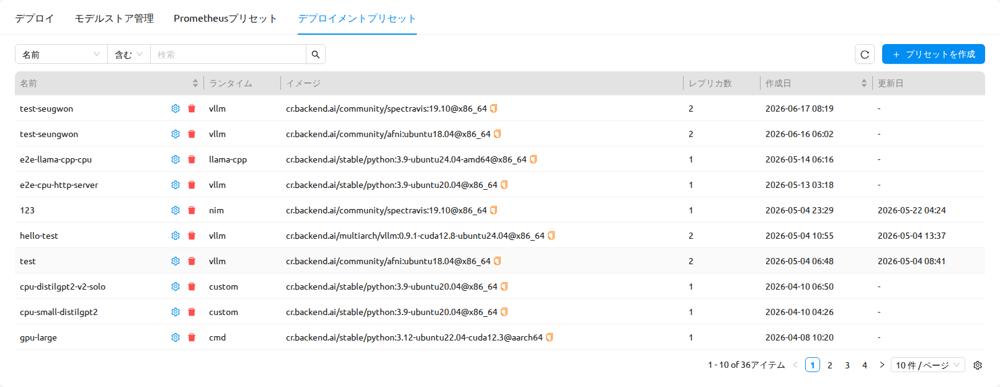
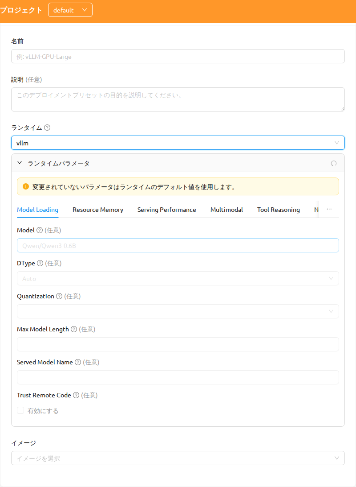
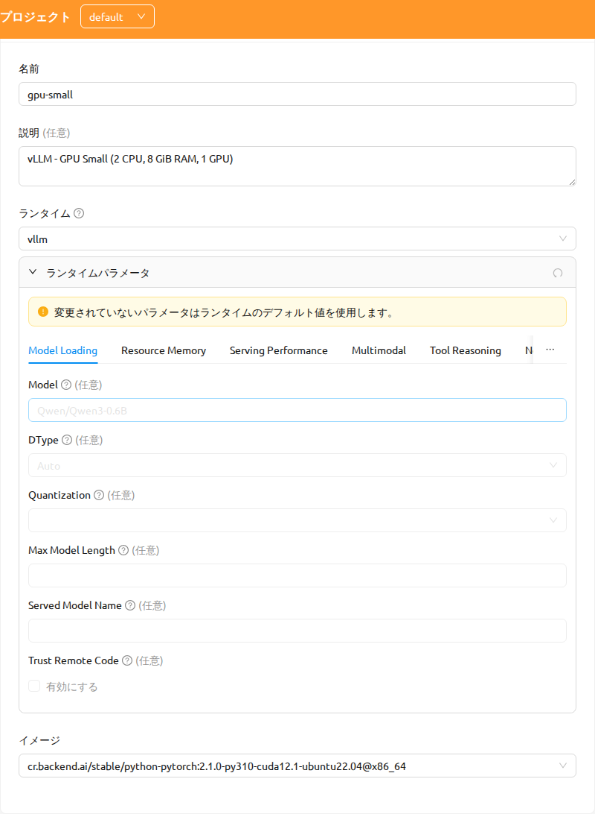
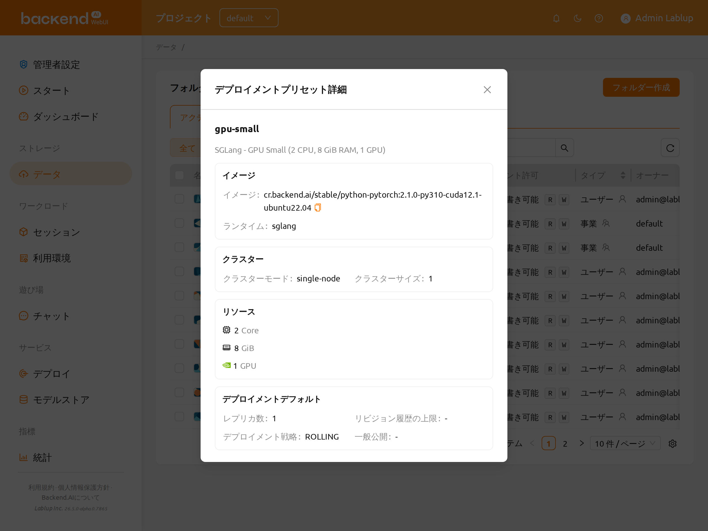
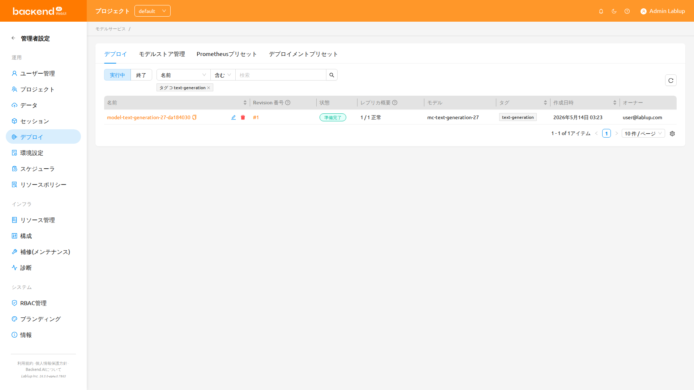

# デプロイメントプリセット

**デプロイメントプリセット（Deployment Preset）** は、イメージ、ランタイム、リソーススロット、クラスターモード、環境変数、起動コマンド、レプリカ数、公開可否など、モデルデプロイに必要な既定値を一つのテンプレートとして管理者が定義する仕組みです。エンドユーザーはストレージフォルダからモデルをデプロイする際にこのプリセットを適用でき、管理者は *vLLM-GPU-Large* や *SGLang-CPU-Small* のように組織が検証済みのデプロイ構成を提供できます。ユーザーは高度なオプションをすべて手動で入力することなく、モデルを素早くデプロイできます。

:::info
このページは、デプロイメントプリセットを作成・編集・削除できるのが管理者だけであるため、**管理** セクションに配置されています。エンドユーザーはプリセット自体を管理することはできませんが、プロジェクトに公開されているプリセットをモデルのデプロイ時に **適用** できます。このページは 2 つのパートで構成されており、[デプロイメントプリセットの管理](#managing-deployment-presets) では管理者向けのワークフローを、[モデルをデプロイする際にプリセットを使う](#using-a-preset-when-deploying-a-model) ではエンドユーザー向けのワークフローを説明します。プリセットを利用したリビジョン作成については、[デプロイ](#model-serving) ページもご参照ください。
:::

## デプロイメントプリセットとは

デプロイメントプリセットはモデルデプロイの既定値を保存することで、次のような利点をもたらします。

- **管理者**：組織のハードウェアやポリシーに合った検証済みのデプロイ構成カタログをユーザーに提供できます。
- **エンドユーザー**：データページの *プリセットで新規デプロイメント作成* フローでプリセットを選択すれば、高度なフィールドを手動で入力する必要がありません。
- **運用担当者**：組織全体でリソース割り当て、ランタイム、公開可否の既定値を一貫して適用できます。

プリセットからデプロイを作成すると、プリセットの値がデプロイランチャーに自動的に反映されます。ユーザーはデプロイを確定する前にそれらの値を自由に確認・調整できます。

各プリセットには次の項目が保存されます。

- **基本情報**：名前、説明、ランタイム、表示順（ランク）。
- **イメージ**：デプロイに使用するコンテナイメージ。
- **リソース**：リソーススロット（CPU、メモリ、GPU）、共有メモリ（SHM）、リソースオプション。
- **クラスター**：クラスターモード（Single-Node または Multi-Node）とクラスターサイズ。
- **実行**：起動コマンド、環境変数、ブートストラップスクリプト。
- **デプロイ既定値**：レプリカ数、リビジョン履歴の保持数、*Open to Public*（公開可否）の既定値。
- **詳細**：カスタムランタイム向けのモデル定義 JSON（必要な場合）。

## デプロイメントプリセットの管理

デプロイメントプリセットを作成・編集・削除できるのは管理者だけです。管理者は、管理者向けデプロイページの **デプロイメントプリセット** タブからプリセットを管理します。

リストには各プリセットの主要な項目が表示されます。管理者はこの画面で次の操作を行えます。

- 名前、ランタイム、タグでプリセットをフィルターします。
- 任意の行のタグチップをクリックすると、同じタグを持つプリセットだけが表示されるようにフィルタリングされます。
- プリセットの詳細画面を開いて構成全体を確認します。
- プリセットを作成、編集、削除します。

既定では次の列が表示されます：**名前**、**ランタイム**、**イメージ**（`<canonicalName>@<architecture>` 形式で表示され、コピー可能）、**レプリカ数**、**作成日時**、**変更日時**（プリセットが最後に更新された日時を表示）。

テーブルヘッダー右側の列表示設定（歯車）ボタン（⚙）を使用して、次の列を表示または非表示にできます：**説明**、**起動コマンド**（長い値はツールチップ付きで省略表示され、コピー可能）、**クラスター**、**戦略（Strategy）**、**Open to Public**（Public／Private タグで表示）、**リビジョン履歴の保持数**、**ランク**（並べ替え可能）。

### デプロイメントプリセットを作成する

1. プリセット一覧の右上にある **プリセットを作成** ボタンをクリックします。
2. *プリセットを作成* ダイアログの各セクションに入力します。

   - **基本情報**：
      * **名前**：一意のプリセット名（例：`vLLM-GPU-Large`）。
      * **説明**：プリセットの用途を簡潔に説明します。
      * **ランタイム**：ランタイムバリアント（例：vLLM、SGLang、Custom）。
      * **ランク**：同じランタイムのプリセット間での表示順。値が小さいほど先に表示されます。
   - **イメージ**：デプロイに使用するコンテナイメージ。イメージは `<canonicalName>@<architecture>` 形式で一覧表示されます（例：`cr.backend.ai/stable/pytorch:2.1-cuda12.1@aarch64`）。この形式は、複数アーキテクチャが混在するクラスターで CPU アーキテクチャごとにイメージを区別するのに役立ちます。同じ形式がレビューステップにも表示されます。
   - **ランタイムパラメータ**（vLLM や SGLang などの非 Custom ランタイムを選択した場合に表示）：このプリセットのサービングフレームワークのパラメータを設定します。パラメータはタブで整理されています — vLLM の場合、例として **Model Loading**、**Resource Memory**、**Serving Performance**、**Multimodal**、**Tool Reasoning** などです。保存したパラメータ値は、このプリセットからデプロイメントを作成する際に適用されます。変更しなかったパラメータは、デプロイメント実行時にランタイムの既定値が使用されます。
   - **リソース**：リソーススロット（CPU、メモリ、GPU）、共有メモリ、リソースオプション（キー／値ペア）。
   - **クラスター**：クラスターモード（Single-Node または Multi-Node）とクラスターサイズ。
   - **実行**：起動コマンド、環境変数、ブートストラップスクリプト。
   - **デプロイ既定値**：
      * **レプリカ数**：このプリセットから生成されるデプロイの既定レプリカ数。
      * **リビジョン履歴の保持数**：このプリセットから生成された各デプロイで保持される過去リビジョンの数。
      * **Open to Public**：このプリセットから生成されたデプロイのエンドポイントを、アクセストークンなしで到達可能にするかの既定値。
   - **詳細**（任意）：カスタムランタイム用のモデル定義 JSON。

   

3. **プリセットを作成** ボタンをクリックして保存します。成功通知が表示されます。

:::tip
必須フィールドが未入力または不正な場合、**プリセットを作成** ボタンは無効のままになります。必須フィールドには入力中にインラインの検証メッセージが表示されます。
:::

:::note[プリセットの必須パラメータ]
管理者は個々のランタイムパラメータを必須に指定できます。必須パラメータには、ラベルの横に赤いアスタリスク（★）が表示されます。すべての必須パラメータが入力されるまで、保存ボタンは無効のままになります。必須パラメータの検証は、まだ開いていないタブ上のパラメータにも適用されます。

Backend.AI Manager 26.4.4 より前のバックエンドでは、すべてのパラメータは任意として扱われます。
:::

### デプロイメントプリセットを編集する

1. プリセット一覧の行アクションメニュー（またはプリセット詳細画面）から **プリセットを編集** を選択します。
2. *プリセットを編集* ダイアログが現在の値で事前に入力された状態で開きます。使用可能なセクションは *プリセットを作成* ダイアログと同じで、vLLM および SGLang ランタイム向けの **ランタイムパラメータ** セクションも含まれます。
3. 必要な値を変更し、**プリセットを編集** ボタンをクリックして保存します。

プリセットを編集すると、**今後** 作成されるデプロイの既定値のみが変更されます。すでにこのプリセットから作成された既存のデプロイには影響しません。

### デプロイメントプリセットを削除する

1. プリセット一覧（またはプリセット詳細画面）のアクションメニューから **プリセットを削除** を選択します。
2. プリセット名を入力して確認するタイプ確認ダイアログが表示されます。入力した値がプリセット名と完全に一致するまで **OK** ボタンは無効のままです。
3. プリセット名を入力し、**OK** をクリックします。

:::danger
デプロイメントプリセットの削除は **元に戻せません**。プリセット自体は削除されますが、すでにそのプリセットから作成されたデプロイは影響を受けずに動作し続けます。今後はこのプリセットを参照できません。
:::

## モデルをデプロイする際にプリセットを使う

エンドユーザーは、データページのストレージフォルダからモデルをデプロイする際に開く **VFolder Deploy** モーダルを通じて、デプロイメントプリセットを適用します。

1. データページでデプロイしたいモデルフォルダを見つけ、**Deploy as Service** をクリックします。
2. VFolder Deploy モーダルが開き、現在のプロジェクトで利用可能なデプロイメントプリセットが一覧表示されます。
3. プリセット行をクリックすると **デプロイメントプリセット詳細** 画面が開きます。詳細画面には、プリセットが適用するすべての項目（イメージ、ランタイム、リソース、クラスターモード、レプリカ数、公開可否など）が表示されます。詳細画面には **ヘルスチェック** カードも含まれます。
   - プリセットでヘルスチェックが有効になっている場合：カードには **有効** と、設定されたパス、間隔、最大リトライ回数、最大待機時間、想定ステータスコード、起動猶予期間が表示されます。
   - ヘルスチェックが無効になっている場合：カードには **無効** と表示されます。

   

4. 詳細画面で次のいずれかを選択します。

   - **Auto-deploy（自動デプロイ）**：プリセットの値をそのまま使用してすぐにデプロイを作成します。追加入力なしの 1 クリックで完了する最速の経路です。
   - **Manual deploy（手動デプロイ）** (*プリセットで新規デプロイメント作成*)：すべてのフィールドがプリセットの値で事前入力されたデプロイランチャーを開き、確定前に確認・調整できます。

:::note
選択中のプリセットやタブキーなどのナビゲーション状態は `URLSearchParams` を介して URL に保持されます。特定のプリセット詳細画面のリンクを共有すれば、受け取った相手も同じ画面から開始できます。
:::

## 事前入力されるランチャー項目

手動デプロイの経路を選択すると、次のような項目がすべて選択したプリセットの値で事前入力された状態でデプロイランチャーが開きます。

- イメージ、ランタイムバリアント、リソースグループ。
- リソーススロット、共有メモリ、リソースオプション。
- クラスターモードとクラスターサイズ。
- 起動コマンドと環境変数。
- レプリカ数、リビジョン履歴の保持数、**Open to Public** 公開可否。
- 自動選択されたリソースプリセット。ランチャーの初期値解決処理を経てもそのまま維持されます。

事前入力された値はデプロイ前に自由に編集できます。フィールドを編集してもプリセット自体は変更**されず**、このデプロイにのみ適用されます。今後のデプロイの既定値はそのまま保持されます。

:::tip
自動選択されたリソースプリセットがワークロードに合っていれば、そのままで構いません。プリセットを切り替えても自動選択の結果は維持されるため、再選択する必要はありません。
:::

## タグでフィルターする

ユーザー向け／管理者向けのいずれのプリセット一覧でも、**クリック可能なタグチップ** がサポートされており、クリックしたタグを共有するプリセットだけを表示するよう一覧をフィルターできます。

1. フィルターしたいタグが付いているプリセット行を見つけます。
2. その行のタグチップをクリックします。
3. 選択したタグを含むプリセットだけが表示されるよう一覧が更新されます。アクティブなフィルターはフィルターバーに表示され、解除すると全件表示に戻ります。

プリセットの数が多い場合に、たとえばすべての GPU 対応プリセット、または特定のランタイムファミリーのプリセットだけを素早く絞り込みたいときに便利です。
