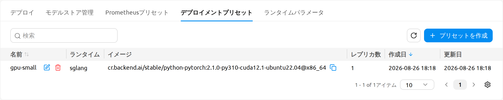
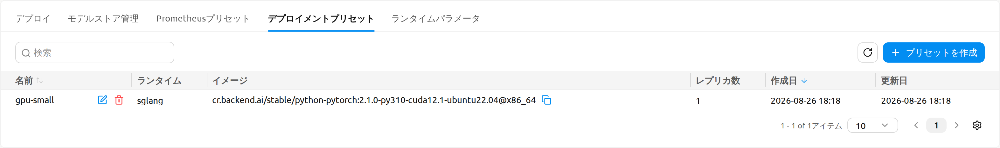
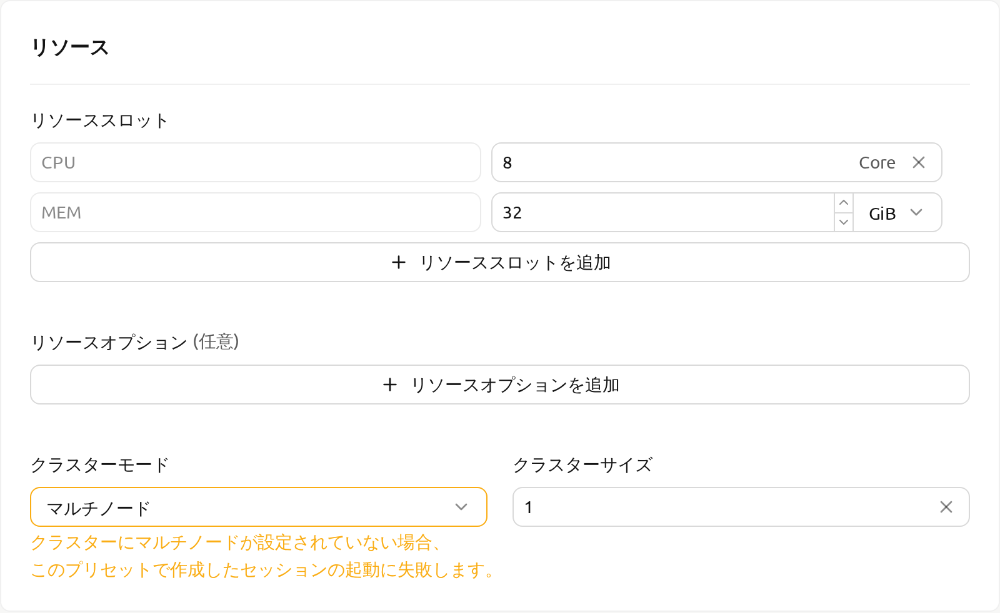
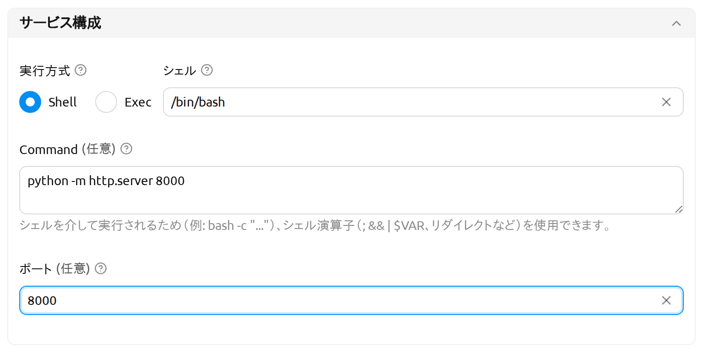
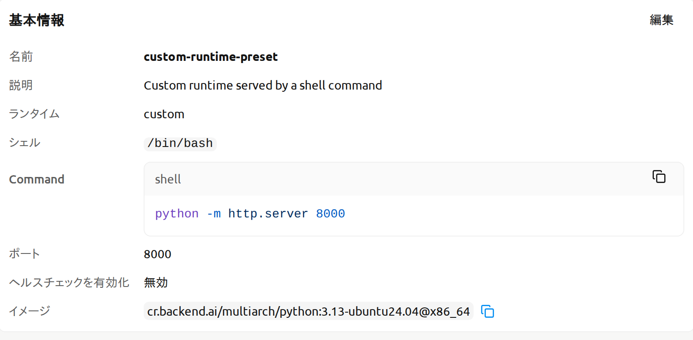
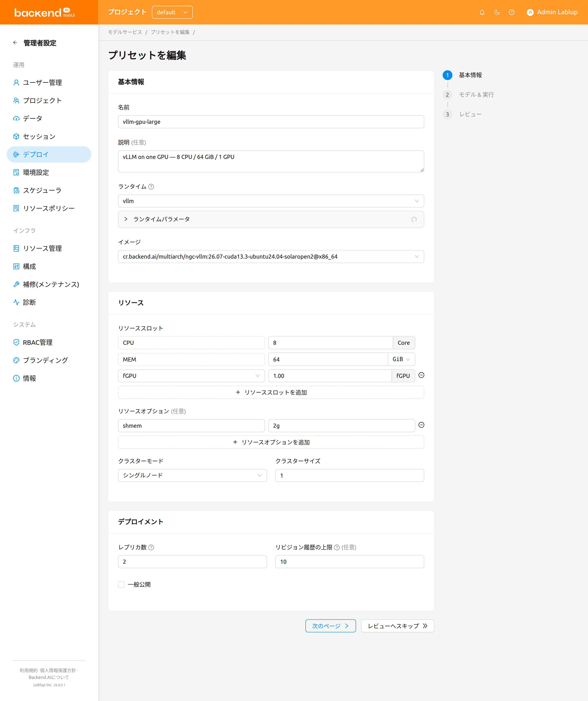
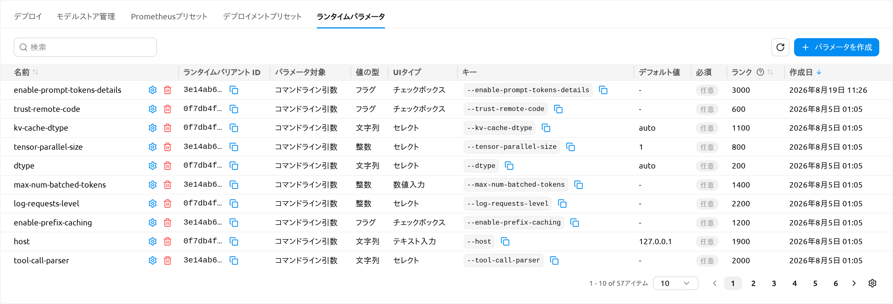
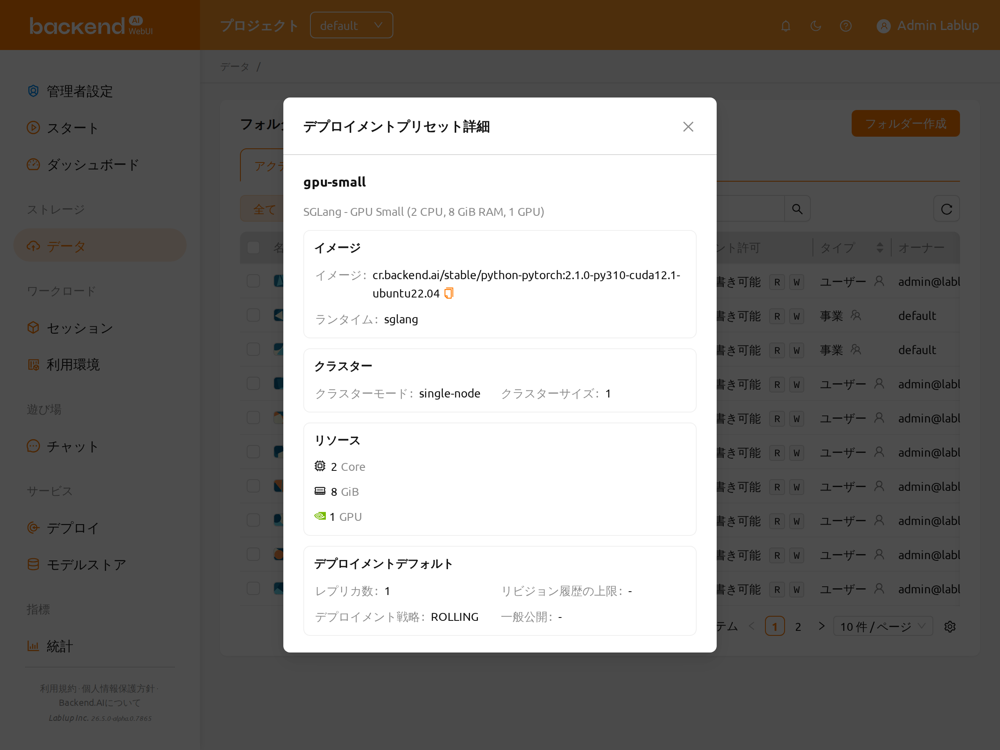
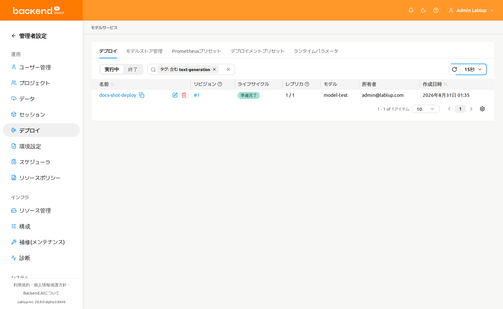

# デプロイメントプリセット

**デプロイメントプリセット（Deployment Preset）** は、イメージ、ランタイム、リソーススロット、クラスターモード、環境変数、起動コマンド、レプリカ数、公開可否など、モデルデプロイに必要な既定値を一つのテンプレートとして管理者が定義する仕組みです。エンドユーザーはストレージフォルダからモデルをデプロイする際にこのプリセットを適用でき、管理者は *vLLM-GPU-Large* や *SGLang-CPU-Small* のように組織が検証済みのデプロイ構成を提供できます。ユーザーは高度なオプションをすべて手動で入力することなく、モデルを素早くデプロイできます。

:::info
このページは、デプロイメントプリセットを作成・編集・削除できるのが管理者だけであるため、**管理** セクションに配置されています。エンドユーザーはプリセット自体を管理することはできませんが、プロジェクトに公開されているプリセットをモデルのデプロイ時に **適用** できます。このページは 2 つのパートで構成されており、[デプロイメントプリセットの管理](#managing-deployment-presets) では管理者向けのワークフローを、[モデルをデプロイする際にプリセットを使う](#using-a-preset-when-deploying-a-model) ではエンドユーザー向けのワークフローを説明します。プリセットを利用したリビジョン作成については、[デプロイ](#model-serving) ページもご参照ください。
:::

## デプロイメントプリセットとは

デプロイメントプリセットはモデルデプロイの既定値を保存することで、次のような利点をもたらします。

- **管理者**：組織のハードウェアやポリシーに合った検証済みのデプロイ構成カタログをユーザーに提供できます。
- **エンドユーザー**：データページの *プリセットで新規デプロイメント作成* フローでプリセットを選択すれば、高度なフィールドを手動で入力する必要がありません。
- **運用担当者**：組織全体でリソース割り当て、ランタイム、公開可否の既定値を一貫して適用できます。

プリセットからデプロイを作成すると、プリセットの値がデプロイランチャーに自動的に反映されます。ユーザーはデプロイを確定する前にそれらの値を自由に確認・調整できます。

各プリセットには次の項目が保存されます。

- **基本情報**：名前、説明、ランタイム、表示順（ランク）。
- **イメージ**：デプロイに使用するコンテナイメージ。
- **リソース**：リソーススロット（CPU、メモリ、GPU）、共有メモリ（SHM）、リソースオプション。
- **クラスター**：クラスターモード（Single Node または Multi Node）とクラスターサイズ。
- **実行**：スタートアップコマンド、環境変数、ブートストラップスクリプト。
- **サービス構成**：実行方式（Shell または Exec）、シェル、コマンド、ポート。Custom のように、モデルフォルダーから設定を読み込むランタイム向けに保存されます。
- **デプロイ既定値**：レプリカ数、リビジョン履歴の保持数、*Open to Public*（公開可否）の既定値。
- **ヘルスチェック**：**ヘルスチェックを有効化** トグルで制御される定期的なヘルスチェック（任意）。
- **起動前アクション**：モデルサービスの起動前に実行するアクション。
- **モデル定義**（任意）：サービングするモデルの名前とパス、および任意のメタデータ。

## デプロイメントプリセットの管理

デプロイメントプリセットを作成・編集・削除できるのは管理者だけです。管理者は、`/admin/deployments` にある管理者向けデプロイページの **デプロイメントプリセット** タブからプリセットを管理します。

リストには各プリセットの主要な項目が表示されます。管理者はこの画面で次の操作を行えます。

- 名前、ランタイム、タグでプリセットをフィルターします。
- 任意の行のタグチップをクリックすると、同じタグを持つプリセットだけが表示されるようにフィルタリングされます。
- プリセットの詳細画面を開いて構成全体を確認します。
- プリセットを作成、編集、削除します。

既定では次の列が表示されます：**名前**、**ランタイム**、**イメージ**（`<canonicalName>@<architecture>` 形式で表示され、コピー可能）、**レプリカ数**、**作成日時**、**変更日時**（プリセットが最後に更新された日時を表示）。

テーブルヘッダー右側の列表示設定（歯車）ボタン（⚙）を使用して、次の列を表示または非表示にできます：**説明**、**スタートアップコマンド**（長い値はツールチップ付きで省略表示され、コピー可能）、**クラスター**、**戦略（Strategy）**、**Open to Public**（Public／Private タグで表示）、**リビジョン履歴の保持数**、**ランク**（並べ替え可能）。

:::note[プリセットページのアドレス]
デプロイメントプリセットのページは管理者スコープに属するため、アドレスはすべて `/admin` で始まります。

| ページ | アドレス |
|---|---|
| プリセット一覧 | `/admin/deployments`（**デプロイメントプリセット** タブ） |
| プリセットの作成 | `/admin/deployments/deployment-presets/new` |
| プリセットの編集 | `/admin/deployments/deployment-presets/{presetId}/edit` |

[モデルをデプロイする際にプリセットを使う](#using-a-preset-when-deploying-a-model) で説明するエンドユーザー側のフローはプロジェクトスコープで動作するため、モデルをデプロイするデータページのアドレスは `/project/{プロジェクト名}/data` になります。`/project/` に続くのはプロジェクトの ID ではなく **名前** です。

`/admin-deployments/deployment-presets/new` のような従来のフラットなリンクも引き続き利用でき、上記のスコープ付きアドレスへリダイレクトされるため、既存のブックマークが壊れることはありません。
:::

### デプロイメントプリセットを作成する

1. プリセット一覧の右上にある **プリセットを作成** ボタンをクリックします。`/admin/deployments/deployment-presets/new` のプリセット入力画面が開きます。
2. 各フィールドに入力します。この画面は **基本情報**、**モデル & 実行**、**レビュー** の 3 ステップからなるウィザードで、右側にステップ一覧、下部に `前へ` / `次のページ` のナビゲーションが表示されます。`レビューへスキップ` をクリックすると最後のステップへ直接移動できます。フィールドは次のセクションに分かれています。

   - **基本情報**：
      * **名前**：一意のプリセット名（例：`vLLM-GPU-Large`）。
      * **説明**：プリセットの用途を簡潔に説明します。
      * **ランタイム**：ランタイムバリアント（例：vLLM、SGLang、Custom）。
      * **ランク**：同じランタイムのプリセット間での表示順。値が小さいほど先に表示されます。
   - **イメージ**：デプロイに使用するコンテナイメージ。イメージは `<canonicalName>@<architecture>` 形式で一覧表示されます（例：`cr.backend.ai/stable/pytorch:2.1-cuda12.1@aarch64`）。この形式は、複数アーキテクチャが混在するクラスターで CPU アーキテクチャごとにイメージを区別するのに役立ちます。同じ形式がレビューステップにも表示されます。
   - **ランタイムパラメータ**（vLLM や SGLang などの非 Custom ランタイムを選択した場合に表示）：このプリセットのサービングフレームワークのパラメータを設定します。パラメータはタブで整理されています — vLLM の場合、例として **Model Loading**、**Resource Memory**、**Serving Performance**、**Multimodal**、**Tool Reasoning** などです。保存したパラメータ値は、このプリセットからデプロイメントを作成する際に適用されます。変更しなかったパラメータは、デプロイメント実行時にランタイムの既定値が使用されます。
   - **サービス構成**（選択したランタイムが Custom のようにモデルフォルダーから設定を読み込む場合に表示）：**実行方式**（**Shell** または **Exec**）、**シェル**、**コマンド** / **コマンド (argv)**、**ポート** — Revision 追加モーダルと同じフィールドで、デプロイメントページの [サービス構成](#service-configuration) で説明しています。**ポート** を空欄にすると、このプリセットから作成されたデプロイメントはランタイムバリアントの既定ポートを引き継ぎます。

      :::note[セクションが表示される場所]
      **サービス構成**、**ヘルスチェック**、**起動前アクション** はいずれも **基本情報** ステップのランタイム関連フィールドの下に表示され、モデル定義とは独立して保存されます。
      :::
   - **リソース**：リソーススロット（CPU、メモリ、GPU）、共有メモリ、リソースオプション（キー／値ペア）。
   - **クラスター**：クラスターモード（Single Node または Multi Node）とクラスターサイズ。新規プリセットの既定値は **Single Node** です。**Multi Node** を選択すると、*「クラスターにマルチノードが設定されていない場合、このプリセットで作成したセッションの起動に失敗します。」* という警告が表示されます。この警告は保存を妨げないため、クラスターがマルチノード構成の場合にのみ選択してください。
   - **実行**：**スタートアップコマンド**、環境変数、ブートストラップスクリプト。スタートアップコマンドのフィールドにはシェル構文のヒント（`シェル構文: /bin/bash -c "cmd1; cmd2"`）が表示されます。コマンドは `/bin/bash -c <コマンド>` として実行されるため、`;`、`|`、`&&` などのシェル演算子をそのまま使用できます。

      :::note[スタートアップコマンドはコマンドとは別のものです]
      2 つのコマンドは別物であり、それぞれのフィールドに専用の説明が表示されるため区別しやすくなっています。

      | フィールド | 場所 | 役割 | 例 |
      |---|---|---|---|
      | **スタートアップコマンド** | プリセットの実行セクション | *「モデルフレームワークを起動する前に環境を準備するコマンドです（例: vllm のインストール）。」* | `pip install vllm` |
      | **コマンド**（Exec 方式では **コマンド (argv)**） | プリセットのサービス構成セクション | モデルサービングプロセスを開始するコマンドです。 | `vllm serve /models --tp 2` |

      パッケージのインストール、アセットの取得、設定ファイルの作成といった準備作業には **スタートアップコマンド** を、サービングフレームワークを実際に起動するコマンドには **コマンド** を使用します。各フィールドのプレースホルダーにも、それぞれに適したコマンドの例が表示されます。
      :::
   - **デプロイ既定値**：
      * **レプリカ数**：このプリセットから生成されるデプロイの既定レプリカ数。
      * **リビジョン履歴の保持数**：このプリセットから生成された各デプロイで保持される過去リビジョンの数。
      * **Open to Public**：このプリセットから生成されたデプロイのエンドポイントを、アクセストークンなしで到達可能にするかの既定値。
   - **ヘルスチェック**：このセクションには **ヘルスチェックを有効化** トグルがあり、既定は **オフ** です。トグルがオフの場合、ヘルスチェックのフィールドは非表示になります。オンにすると、パス、間隔、最大リトライ回数、最大待機時間、ステータスコード、起動猶予期間の各フィールドが表示され、設定できるようになります。
   - **起動前アクション**：モデルサービスの起動前に実行するアクションです。**起動前アクションを追加** をクリックして行を追加し、**アクション** と **引数 (JSON)** を入力します。
   - **モデル定義**（任意）：カードヘッダーのスイッチでモデル定義を有効にします。有効にした場合は **モデル名** と **モデルパス**（どちらも必須）を入力し、必要に応じて **メタデータ** セクションを展開して、サービングするモデルのタイトル、作成者、バージョン、ライセンス、説明、タスク、カテゴリ、アーキテクチャ、フレームワーク、ラベルを入力します。

   

   

3. **レビュー** ステップで内容を確認し、`作成` をクリックして保存します。成功通知が表示されます。

:::tip
必須フィールドが未入力または不正な場合、レビューステップの送信ボタンは無効のままになります。該当するフィールドを含むレビューカードは枠が赤く表示され、**編集** リンクの横にエラーアイコンが付き、そのフィールドが属するステップも右側のステップ一覧でエラーとして示されます。これにより、まだ表示していないステップのフィールドでも、どのステップに戻ればよいか分かります。必須フィールドには入力中にインラインの検証メッセージが表示されます。
:::

#### レビューステップ

ウィザードの最後のステップは、それまでのすべてのステップを反映した読み取り専用の要約で、入力時と同じカード単位でまとめられています。各カードには、対応するステップに戻ってそのカードまでスクロールする **編集** リンクがあります。

**基本情報** カードには、ステップ 1 のフィールド順に次の項目が要約されます。

- **名前**
- **説明**（説明が設定されているプリセットのみ）
- **ランタイム**：プリセットが使用するランタイムバリアントの表示名です。
- **イメージ**：`<canonicalName>@<architecture>` 形式で表示されます。
- **ランタイムパラメータ**（Custom 以外のランタイムで値が設定されている場合のみ）
- **シェル**、**コマンド**、**ポート**：サービス構成の値で、モデルフォルダーから設定を読み込むランタイムの場合にのみ表示されます。Exec 方式ではシェルを使用しないため、**シェル** の行は表示されません。
- **ヘルスチェックを有効化**、および有効にしている場合は設定済みのヘルスチェック値。

残りのカードには、**リソース**（リソーススロット、リソースオプション、クラスターモード、クラスターサイズ）、**デプロイメント**（レプリカ数、リビジョン履歴の保持数、Open to Public）、**モデル & 実行**（スタートアップコマンド、ブートストラップスクリプト、環境変数、有効にしている場合はモデル定義）が要約されます。

   **ランタイム** の行は、プリセットを作成するときだけでなく **編集するとき** にも表示されます。どちらの場合もステップ 1 でランタイムを変更できるため、保存する前にこの行でプリセットが使用するランタイムを確認してください。

:::note[プリセットの必須パラメータ]
管理者は個々のランタイムパラメータを必須に指定できます。必須パラメータには、ラベルの横に赤いアスタリスク（★）が表示されます。すべての必須パラメータが入力されるまで、保存ボタンは無効のままになります。必須パラメータの検証は、まだ開いていないタブ上のパラメータにも適用されます。
:::

### デプロイメントプリセットを編集する

1. プリセット一覧の行アクションメニュー（またはプリセット詳細画面）から **プリセットを編集** を選択します。
2. `/admin/deployments/deployment-presets/{presetId}/edit` のプリセット入力画面が、現在の値で事前に入力された状態で開きます。ステップとセクションの構成は作成フローと同じで、vLLM および SGLang ランタイム向けの **ランタイムパラメータ** セクションも含まれます。
3. 必要な値を変更し、**レビュー** ステップで要約（**ランタイム** の行を含む）を確認してから `保存` をクリックして変更を反映します。

プリセットを編集すると、**今後** 作成されるデプロイの既定値のみが変更されます。すでにこのプリセットから作成された既存のデプロイには影響しません。

### デプロイメントプリセットを削除する

1. プリセット一覧（またはプリセット詳細画面）のアクションメニューから **プリセットを削除** を選択します。
2. プリセット名を入力して確認するタイプ確認ダイアログが表示されます。入力した値がプリセット名と完全に一致するまで **OK** ボタンは無効のままです。
3. プリセット名を入力し、**OK** をクリックします。

:::danger
デプロイメントプリセットの削除は **元に戻せません**。プリセット自体は削除されますが、すでにそのプリセットから作成されたデプロイは影響を受けずに動作し続けます。今後はこのプリセットを参照できません。
:::

## ランタイムバリアントプリセット

Admin Deployments ページ（`/admin/deployments`）の **ランタイムバリアントプリセット** タブでは、ランタイムバリアントが提供する個々のパラメータを定義します。各エントリは 1 つのパラメータを表し、コンテナに渡されるキー、値の型、デフォルト値、そして画面上での表示方法を持ちます。これらのエントリが集まって、ユーザーがデプロイメントの Revision を追加する際に入力する **ランタイムパラメータ** のタブを構成します（デプロイメントページの [ランタイムパラメータ](#runtime-parameters) を参照）。

表の上部には、プロパティフィルター（**名前**、**ランタイムバリアント ID**）、更新ボタン、**プリセットを作成** ボタンがあります。既定で表示される列は次のとおりです。

- **名前**: パラメータプリセットの名前です。この列には行ごとの編集・削除ボタンも表示されます。
- **ランタイムバリアント** と **ランタイムバリアント ID**: パラメータが属するランタイムです。
- **プリセット対象**: 値がコンテナに渡される方法で、**環境変数** または **コマンドライン引数** です。
- **値の型**: **文字列**、**整数**、**浮動小数点数**、**ブール値**、**フラグ** のいずれかです。
- **キー**: 値が渡される環境変数名またはコマンドライン引数です（コピー可能）。
- **必須**: このランタイムで Revision を作成する際に、このパラメータの指定が必須かどうかです。
- **ランク**: 同じランタイムバリアントのプリセット間の表示順序です。値が小さいほど先に表示されます。
- **作成日**: プリセットが作成された日時です。

**説明**、**カテゴリ**、**表示名**、**デフォルト値**、**更新日** の列は既定で非表示になっており、表ヘッダー右側の列表示設定ボタン（⚙）で表示できます。

:::note
**ランタイムバリアント**、**表示名**、**カテゴリ** の列と、以下で説明する UI メタデータのフィールドは、ランタイムバリアントプリセットの UI メタデータに対応したサーバーでのみ利用できます。古いサーバーではまったく表示されません。
:::

### ランタイムバリアントプリセットの作成と編集

表の上部にある **プリセットを作成** ボタンをクリックすると **プリセットを作成** モーダルが開き、行の編集ボタンをクリックすると現在の値が入力された **プリセットを編集** モーダルが開きます。既存プリセットのランタイムバリアントは変更できません。

<!-- TODO(screenshot): /admin/deployments -> Runtime Variant Presets tab -> Create Preset modal, showing the UI Type selector and its Choices rows. The capture environment ran manager 26.8.0rc1, which does not serve the runtime-variant-preset UI metadata fields. -->

モーダルには、表示される順に次のフィールドがあります。

- **ランタイムバリアント**: このパラメータが属するランタイムです。必須項目です。
- **名前**: パラメータの読みやすい名前です（例: `Tensor Parallel Size`）。必須項目です。
- **説明**: このパラメータが制御する内容と、推論の動作に与える影響です。デプロイメントフォームでは該当フィールドのツールチップとして表示されます。
- **カテゴリ**: 関連するパラメータをまとめるために使用される UI カテゴリです。カテゴリは **ランタイムパラメータ** セクションのタブになるため、同じカテゴリを指定したパラメータは同じタブに表示されます。このフィールドは自由入力で、すでに使われているカテゴリはプレースホルダーにヒントとして表示されます。
- **表示名**: デプロイメントフォームでパラメータ名の代わりに表示される、読みやすいラベルです。
- **プリセット対象**: **環境変数** または **コマンドライン引数** です。必須項目です。
- **値の型**: **文字列**、**整数**、**浮動小数点数**、**ブール値**、**フラグ** のいずれかです。必須項目です。
- **キー**: 値が渡される環境変数名またはコマンドライン引数です（例: `TENSOR_PARALLEL_SIZE`）。必須項目です。
- **デフォルト値**: ユーザーがパラメータを変更しなかった場合にランタイムが使用する値です。デプロイメントフォームでは事前入力されずプレースホルダーとして表示されるため、必須パラメータは明示的な入力を求めます。
- **UIタイプ**: デプロイメントフォームでこのパラメータを表示する際に使用するコントロールです。空のままにすると、通常のテキスト入力として表示されます。タイプを選択すると、そのタイプ固有の設定が表示されます。
   * **テキスト入力**: **入力プレースホルダー** — フィールドが空のときに表示されるヒント文です。
   * **数値入力**: **最小値** と **最大値**。範囲外の値はデプロイメントフォームで検証エラーとして表示されます。
   * **チェックボックス**: 追加設定はありません。
   * **セレクト**: **選択肢** — 選択肢ごとに **値** / **ラベル** を 1 行ずつ入力します。**選択肢を追加** ボタンで行を追加し、ゴミ箱ボタンで削除します。少なくとも 1 つの選択肢が必要です。
   * **スライダー**: **最小値** と **最大値**（いずれも必須で、最大値は最小値より大きくする必要があります）、およびスライダーの増分である **ステップ** です（既定値は `1`）。
- **必須**: ユーザーが Revision を作成する際に、このパラメータの指定を必須にするかどうかです。必須パラメータはデプロイメントフォームで赤いアスタリスク（★）が付きます。
- **ランク** *(編集時のみ表示)*: 同じランタイムバリアントのプリセット間の表示順序です。値が小さいほど先に表示されます。

`作成`（編集時は `保存`）をクリックすると保存されます。ランタイムバリアントプリセットが作成または更新されたことを知らせる通知が表示され、一覧が更新されます。

### ランタイムバリアントプリセットの削除

プリセット行の削除ボタンをクリックします。プリセット名を入力して確認するダイアログが開き、入力した値が完全に一致するまで **削除** ボタンは無効のままです。

:::danger
ランタイムバリアントプリセットの削除は **元に戻せません**。このランタイムバリアントを使用するすべてのデプロイメントフォームの **ランタイムパラメータ** セクションから、このパラメータが消えます。
:::

## モデルをデプロイする際にプリセットを使う

エンドユーザーは、データページのストレージフォルダからモデルをデプロイする際に開く **VFolder Deploy** モーダルを通じて、デプロイメントプリセットを適用します。

1. データページでデプロイしたいモデルフォルダを見つけ、**Deploy as Service** をクリックします。
2. VFolder Deploy モーダルが開き、現在のプロジェクトで利用可能なデプロイメントプリセットが一覧表示されます。
3. プリセット行をクリックすると **デプロイメントプリセット詳細** 画面が開きます。詳細画面には、プリセットが適用するすべての項目（イメージ、ランタイム、リソース、クラスターモード、レプリカ数、公開可否など）が表示されます。詳細画面には **ヘルスチェック** カードも含まれます。
   - プリセットでヘルスチェックが有効になっている場合：カードには **有効** と、設定されたパス、間隔、最大リトライ回数、最大待機時間、想定ステータスコード、起動猶予期間が表示されます。
   - ヘルスチェックが無効になっている場合：カードには **無効** と表示されます。

   

4. 詳細画面で次のいずれかを選択します。

   - **Auto-deploy（自動デプロイ）**：プリセットの値をそのまま使用してすぐにデプロイを作成します。追加入力なしの 1 クリックで完了する最速の経路です。
   - **Manual deploy（手動デプロイ）** (*プリセットで新規デプロイメント作成*)：すべてのフィールドがプリセットの値で事前入力されたデプロイランチャーを開き、確定前に確認・調整できます。

## 事前入力されるランチャー項目

手動デプロイの経路を選択すると、次のような項目がすべて選択したプリセットの値で事前入力された状態でデプロイランチャーが開きます。

- イメージ、ランタイムバリアント、リソースグループ。
- リソーススロット、共有メモリ、リソースオプション。
- クラスターモードとクラスターサイズ。
- 起動コマンドと環境変数。
- レプリカ数、リビジョン履歴の保持数、**Open to Public** 公開可否。
- 自動選択されたリソースプリセット。ランチャーの初期値解決処理を経てもそのまま維持されます。

事前入力された値はデプロイ前に自由に編集できます。フィールドを編集してもプリセット自体は変更**されず**、このデプロイにのみ適用されます。今後のデプロイの既定値はそのまま保持されます。

:::tip
自動選択されたリソースプリセットがワークロードに合っていれば、そのままで構いません。プリセットを切り替えても自動選択の結果は維持されるため、再選択する必要はありません。
:::

## タグでフィルターする

ユーザー向け／管理者向けのいずれのプリセット一覧でも、**クリック可能なタグチップ** がサポートされており、クリックしたタグを共有するプリセットだけを表示するよう一覧をフィルターできます。

1. フィルターしたいタグが付いているプリセット行を見つけます。
2. その行のタグチップをクリックします。
3. 選択したタグを含むプリセットだけが表示されるよう一覧が更新されます。アクティブなフィルターはフィルターバーに表示され、解除すると全件表示に戻ります。

プリセットの数が多い場合に、たとえばすべての GPU 対応プリセット、または特定のランタイムファミリーのプリセットだけを素早く絞り込みたいときに便利です。
