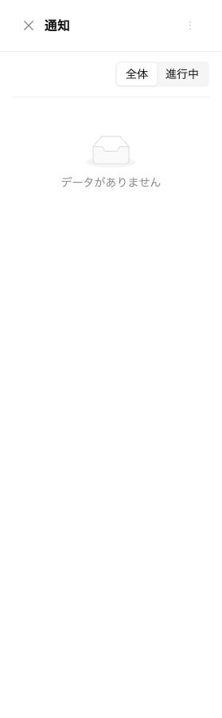
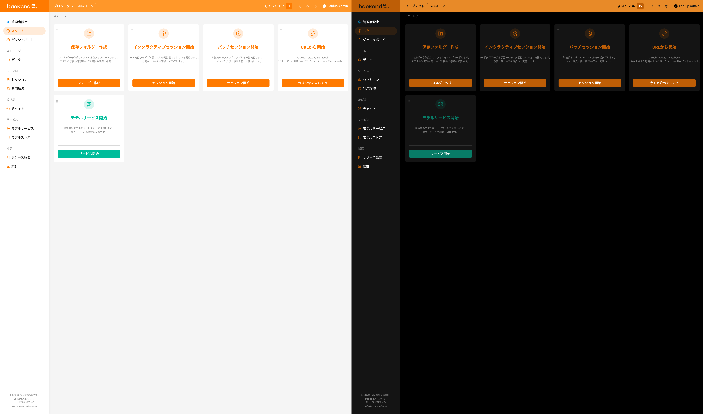
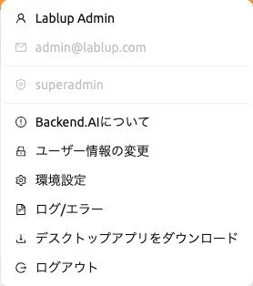
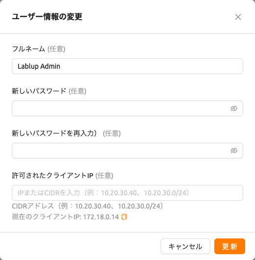
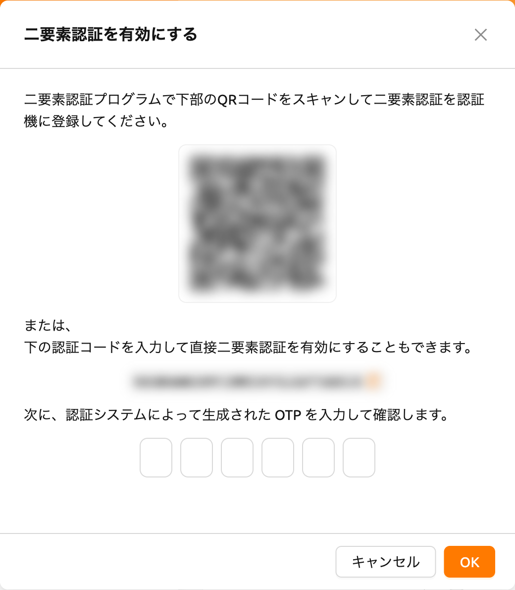
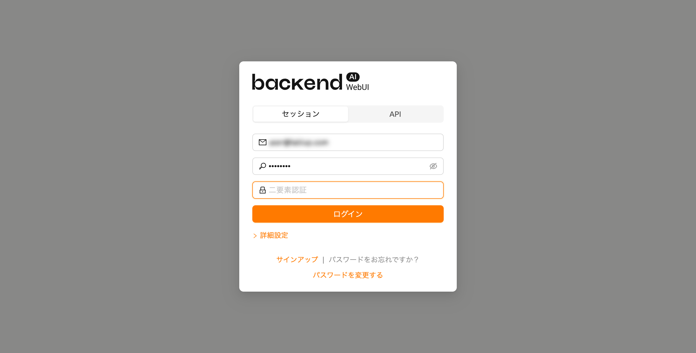
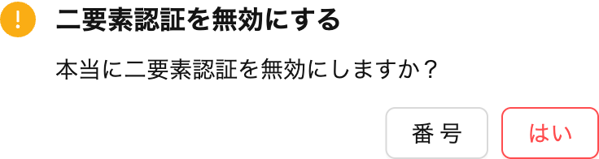

# Top Bar 機能s

The tob bar includes various features that support use of the WebUI.

## Project selector

Users can switch between projects using the project selector provided in the top bar.
By default, the project that ユーザー currently belongs to is selected.
Since each project may have different resource policies, switching projects may also change the available resource policies.

## Notification

ベル型のボタンは、イベント通知ボタンです。WebUIの操作中に記録する必要があるイベントがここに表示されます。コンピュートセッションの作成など、バックグラウンドタスクが実行されている場合、ここでジョブを確認できます。バックグラウンドタスクが終了したとき。
Press the shortcut key (`]`) to open and close the notification area.

## Theme mode

You can change the theme mode of the WebUI via the dark mode button on the
right side of the header.

## Help

Click question mark button to access the web version of this guide document.
You will be directed to the appropriate documentation based on the page you are currently on.

## User Menu

Click the person button on the right side of the top bar to see the ユーザー menu.
Each menu item has the following functions.

- Backend.AIについて: Backend.AI WebUIのバージョン、ライセンスの種類などの情報を表示します。
- My Account: Check / Update information of current login ユーザー.
- 設定: ユーザー設定ページへ移動.
- ログ/エラー: ログページに移動します。クライアント側に記録されたログとエラーの履歴を確認できます。
- Download Desktop App: Download the stand-alone WebUI app for your platform.
- Log Out: Log out of the WebUI.

### My Account

My Accountをクリックすると、次のダイアログが表示されます。

各項目には以下の意味があります。 希望する値を入力し、UPDATEボタンをクリックしてユーザー情報を更新します。

- フルネーム: ユーザーの名前 (最大64文字).
- Original password: Original password. Click the right view button to see the
  input contents.
- New password: New password (8 characters or more containing at least 1
  alphabet, number, and symbol). Click the right view button to see the input
  contents. Ensure this is the same as the Original password.
- 2FA 有効: 2FA の有効化。チェックされている場合、ユーザーはログイン時に OTP コードを入力する必要があります。

:::note
Depending on the plugin settings, the `2FA Enabled` column might be invisible.
In that case, please contact 管理者istrator of your system.
:::

### 2FA 設定
If you activate the `2FA Enabled` switch, the following dialog appears.

使用している2FAアプリケーションを起動し、QRコードをスキャンするか、手動で検証コードを入力します。2FA対応のアプリケーションには、Google Authenticator、2STP、1Password、Bitwardenなどがあります。

次に、お使いの2FAアプリケーションに追加された項目から6桁のコードを上記のダイアログに入力します。「確認」ボタンを押すと、2FAが有効になります。

後でログインする際に、メールアドレスとパスワードを入力すると、OTPコードを求める追加フィールドが表示されます。

ログインするには、2FAアプリケーションを開き、ワンタイムパスワードフィールドに6桁のコードを入力する必要があります。

If you want to disable 2FA, turn off the `2FA Enabled` switch and click the confirm button in the
following dialog.